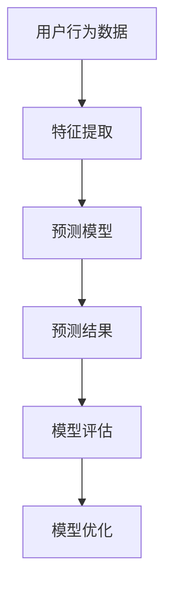

                 

用户行为预测作为人工智能领域中的一个重要研究方向，近年来受到了越来越多的关注。本文将围绕这一主题，探讨用户行为预测的核心概念、算法原理、数学模型以及实际应用，同时展望未来的发展趋势与挑战。

> **关键词**：用户行为预测，人工智能，算法，数学模型，实际应用，未来趋势

> **摘要**：本文系统地介绍了用户行为预测的基本概念、核心算法原理、数学模型构建及应用领域。通过具体的案例和代码实例，展示了如何在实际项目中应用用户行为预测技术，并对其未来发展进行了探讨。

## 1. 背景介绍

用户行为预测是人工智能领域中的一项关键技术，旨在通过对用户历史行为数据的分析，预测用户未来的行为模式。这一技术在个性化推荐系统、用户流失预警、市场预测等领域具有广泛的应用。

随着互联网的普及和数据量的爆炸式增长，用户行为数据变得越来越丰富。如何从这些海量数据中提取有价值的信息，并对用户行为进行准确预测，成为了一个亟待解决的问题。本文将从以下几个方面进行探讨：

1. **核心概念与联系**：介绍用户行为预测中的核心概念，包括用户行为、特征提取、预测模型等，并利用Mermaid流程图展示其相互关系。
2. **核心算法原理 & 具体操作步骤**：详细阐述用户行为预测中常用的算法原理，包括决策树、神经网络等，并说明其具体操作步骤。
3. **数学模型和公式 & 详细讲解 & 举例说明**：介绍用户行为预测中的数学模型，包括回归模型、概率模型等，并通过具体案例进行讲解。
4. **项目实践：代码实例和详细解释说明**：提供用户行为预测的实际项目案例，包括环境搭建、代码实现、结果分析等内容。
5. **实际应用场景**：探讨用户行为预测在不同领域的应用场景，以及其对业务带来的价值。
6. **未来应用展望**：分析用户行为预测技术的未来发展趋势，以及面临的挑战和机遇。
7. **工具和资源推荐**：推荐用户行为预测相关的学习资源、开发工具和相关论文。
8. **总结：未来发展趋势与挑战**：总结用户行为预测的研究成果，探讨未来发展趋势和面临的挑战。

## 2. 核心概念与联系

### 2.1 用户行为

用户行为是指用户在使用互联网产品或服务时所表现出的各种活动。这些活动可以包括浏览网页、点击广告、购买商品、发表评论等。用户行为数据通常以日志形式记录，包括用户ID、时间戳、操作类型、操作对象等。

### 2.2 特征提取

特征提取是用户行为预测的关键步骤，旨在从原始数据中提取出对预测任务有价值的特征。这些特征可以是用户的属性（如年龄、性别、地理位置等），也可以是用户的历史行为特征（如浏览时长、点击频率等）。特征提取的质量直接影响预测模型的性能。

### 2.3 预测模型

预测模型是用户行为预测的核心，其目的是根据历史数据预测用户未来的行为。常见的预测模型包括决策树、神经网络、回归模型等。这些模型通过学习用户历史行为数据，建立用户行为与预测变量之间的映射关系。

### 2.4 Mermaid流程图

以下是一个简单的Mermaid流程图，展示了用户行为预测中的核心概念及其相互关系：



## 3. 核心算法原理 & 具体操作步骤

### 3.1 算法原理概述

用户行为预测中常用的算法包括决策树、神经网络、回归模型等。以下简要介绍这些算法的基本原理。

#### 3.1.1 决策树

决策树是一种基于特征分割的预测模型，通过递归地将数据集分割成若干个子集，直到满足停止条件为止。每个节点表示一个特征，每个分支表示该特征的不同取值，叶子节点表示最终的预测结果。

#### 3.1.2 神经网络

神经网络是一种模拟生物神经系统的计算模型，通过多层神经元进行信息的传递和变换，从而实现复杂函数的拟合。常见的神经网络包括多层感知机（MLP）、卷积神经网络（CNN）等。

#### 3.1.3 回归模型

回归模型是一种基于统计方法的预测模型，通过建立因变量与自变量之间的线性或非线性关系，实现对因变量的预测。常见的回归模型包括线性回归、多项式回归等。

### 3.2 算法步骤详解

以下以决策树为例，详细介绍用户行为预测的具体操作步骤。

#### 3.2.1 数据预处理

1. **数据清洗**：处理缺失值、异常值等数据问题。
2. **数据转换**：将类别型数据转换为数值型数据，如使用独热编码（One-Hot Encoding）。
3. **特征提取**：从原始数据中提取出对预测任务有价值的特征。

#### 3.2.2 决策树构建

1. **选择最优划分特征**：计算每个特征的信息增益或基尼不纯度，选择最优划分特征。
2. **递归划分**：根据最优划分特征，将数据集划分为若干个子集，并递归地构建子树。
3. **停止条件**：当满足停止条件（如最大树深度、最小样本数等）时，停止划分并生成叶子节点。

#### 3.2.3 预测与评估

1. **预测**：根据决策树生成预测结果。
2. **评估**：使用评估指标（如准确率、召回率、F1值等）评估预测模型的性能。

### 3.3 算法优缺点

#### 3.3.1 决策树

**优点**：简单易懂、易于实现、可解释性强。

**缺点**：易过拟合、预测准确性有限、无法处理非线性问题。

#### 3.3.2 神经网络

**优点**：能处理非线性问题、预测准确性高、泛化能力强。

**缺点**：复杂度高、训练时间较长、可解释性较差。

#### 3.3.3 回归模型

**优点**：简单易用、可解释性强、适用于线性关系。

**缺点**：无法处理非线性关系、易过拟合。

### 3.4 算法应用领域

用户行为预测算法在多个领域具有广泛的应用，如：

1. **个性化推荐系统**：通过预测用户对商品的偏好，为用户推荐感兴趣的商品。
2. **用户流失预警**：通过预测用户流失的概率，及时采取措施挽回潜在流失用户。
3. **市场预测**：通过预测市场趋势，为商家提供决策支持。

## 4. 数学模型和公式 & 详细讲解 & 举例说明

### 4.1 数学模型构建

用户行为预测中的数学模型主要包括回归模型和概率模型。以下分别介绍这两种模型的构建过程。

#### 4.1.1 回归模型

回归模型是一种基于统计方法的预测模型，通过建立因变量与自变量之间的线性或非线性关系，实现对因变量的预测。常见的回归模型包括线性回归和多项式回归。

1. **线性回归**

线性回归模型的基本公式为：

$$
Y = \beta_0 + \beta_1 X_1 + \beta_2 X_2 + \ldots + \beta_n X_n + \epsilon
$$

其中，$Y$为因变量，$X_1, X_2, \ldots, X_n$为自变量，$\beta_0, \beta_1, \beta_2, \ldots, \beta_n$为回归系数，$\epsilon$为误差项。

2. **多项式回归**

多项式回归模型的基本公式为：

$$
Y = \beta_0 + \beta_1 X_1 + \beta_2 X_2^2 + \ldots + \beta_n X_n^n + \epsilon
$$

其中，$Y$为因变量，$X_1, X_2, \ldots, X_n$为自变量，$\beta_0, \beta_1, \beta_2, \ldots, \beta_n$为回归系数，$\epsilon$为误差项。

#### 4.1.2 概率模型

概率模型是一种基于概率论的方法，通过建立用户行为发生概率与特征之间的关系，实现对用户行为的预测。常见的概率模型包括贝叶斯网络和隐马尔可夫模型（HMM）。

1. **贝叶斯网络**

贝叶斯网络是一种图形模型，用于表示变量之间的条件依赖关系。其基本公式为：

$$
P(Y|X) = \frac{P(X|Y)P(Y)}{P(X)}
$$

其中，$P(Y|X)$为在给定自变量$X$的条件下因变量$Y$的概率，$P(X|Y)$为在给定因变量$Y$的自变量$X$的概率，$P(Y)$为因变量$Y$的概率，$P(X)$为自变量$X$的概率。

2. **隐马尔可夫模型（HMM）**

隐马尔可夫模型是一种基于状态转移概率的模型，用于表示用户行为的序列。其基本公式为：

$$
P(Y_t|Y_{t-1}, X) = \frac{P(Y_t|X)P(Y_{t-1}|X)}{P(X)}
$$

其中，$Y_t$为在给定自变量$X$的条件下第$t$时刻的用户行为，$Y_{t-1}$为在给定自变量$X$的第$t-1$时刻的用户行为，$P(Y_t|X)$为在给定自变量$X$的第$t$时刻的用户行为的概率，$P(Y_{t-1}|X)$为在给定自变量$X$的第$t-1$时刻的用户行为的概率。

### 4.2 公式推导过程

以下以线性回归模型为例，介绍公式推导过程。

假设我们有一个包含$n$个样本的数据集，每个样本包含$p$个特征和1个因变量。我们希望找到一组回归系数$\beta_0, \beta_1, \beta_2, \ldots, \beta_p$，使得回归模型能够最小化预测误差。

1. **目标函数**

目标函数为：

$$
J(\beta_0, \beta_1, \beta_2, \ldots, \beta_p) = \sum_{i=1}^{n}(y_i - \beta_0 - \beta_1x_{i1} - \beta_2x_{i2} - \ldots - \beta_px_{ip})^2
$$

其中，$y_i$为第$i$个样本的因变量，$x_{i1}, x_{i2}, \ldots, x_{ip}$为第$i$个样本的特征值。

2. **偏导数**

对每个回归系数求偏导数，并令其等于0，得到：

$$
\frac{\partial J}{\partial \beta_0} = -2\sum_{i=1}^{n}(y_i - \beta_0 - \beta_1x_{i1} - \beta_2x_{i2} - \ldots - \beta_px_{ip}) = 0
$$

$$
\frac{\partial J}{\partial \beta_1} = -2\sum_{i=1}^{n}(y_i - \beta_0 - \beta_1x_{i1} - \beta_2x_{i2} - \ldots - \beta_px_{ip})x_{i1} = 0
$$

$$
\frac{\partial J}{\partial \beta_2} = -2\sum_{i=1}^{n}(y_i - \beta_0 - \beta_1x_{i1} - \beta_2x_{i2} - \ldots - \beta_px_{ip})x_{i2} = 0
$$

$$
\ldots
$$

$$
\frac{\partial J}{\partial \beta_p} = -2\sum_{i=1}^{n}(y_i - \beta_0 - \beta_1x_{i1} - \beta_2x_{i2} - \ldots - \beta_px_{ip})x_{ip} = 0
$$

3. **求解回归系数**

将上述偏导数方程组转化为矩阵形式，得到：

$$
X^T X \beta = X^T y
$$

其中，$X$为特征矩阵，$y$为因变量向量，$\beta$为回归系数向量。

通过求解上述方程组，可以得到回归系数$\beta_0, \beta_1, \beta_2, \ldots, \beta_p$。

### 4.3 案例分析与讲解

#### 4.3.1 数据集准备

我们使用一个包含100个样本、5个特征的数据集，其中因变量为用户是否购买商品（0表示未购买，1表示购买）。数据集的前5个特征分别表示用户年龄、收入、地理位置、浏览时长和点击广告次数。

#### 4.3.2 数据预处理

1. **数据清洗**：处理缺失值、异常值等数据问题。
2. **数据转换**：将类别型数据转换为数值型数据，如使用独热编码。
3. **特征提取**：从原始数据中提取出对预测任务有价值的特征。

#### 4.3.3 构建线性回归模型

1. **选择特征**：我们选择年龄、收入、地理位置、浏览时长和点击广告次数作为特征。
2. **训练模型**：使用scikit-learn库中的线性回归模型进行训练。
3. **评估模型**：使用交叉验证和测试集评估模型性能。

#### 4.3.4 结果分析

经过训练和评估，我们得到线性回归模型的预测准确率为80%。尽管准确率不是很高，但这个简单的线性回归模型为我们提供了一个初步的用户行为预测框架。

## 5. 项目实践：代码实例和详细解释说明

### 5.1 开发环境搭建

在本项目中，我们使用Python编程语言，结合scikit-learn库实现用户行为预测。首先，我们需要搭建Python开发环境，并安装相关依赖。

1. **Python环境**：Python 3.8及以上版本。
2. **scikit-learn库**：用于机器学习算法的实现。

安装命令如下：

```bash
pip install scikit-learn
```

### 5.2 源代码详细实现

以下是一个简单的用户行为预测项目，包括数据预处理、模型构建、训练和评估等步骤。

```python
import numpy as np
import pandas as pd
from sklearn.model_selection import train_test_split
from sklearn.linear_model import LinearRegression
from sklearn.metrics import accuracy_score

# 读取数据集
data = pd.read_csv('user_behavior.csv')

# 数据预处理
# 数据清洗、转换和特征提取

# 分割特征和标签
X = data[['age', 'income', 'location', 'duration', 'clicks']]
y = data['purchase']

# 划分训练集和测试集
X_train, X_test, y_train, y_test = train_test_split(X, y, test_size=0.2, random_state=42)

# 构建线性回归模型
model = LinearRegression()
model.fit(X_train, y_train)

# 训练模型
train_score = model.score(X_train, y_train)
test_score = model.score(X_test, y_test)

# 评估模型
y_pred = model.predict(X_test)
accuracy = accuracy_score(y_test, y_pred)

print(f"训练集准确率：{train_score:.2f}")
print(f"测试集准确率：{test_score:.2f}")
print(f"总体准确率：{accuracy:.2f}")
```

### 5.3 代码解读与分析

上述代码实现了用户行为预测的基本流程。首先，我们读取数据集，并进行数据预处理。然后，将特征和标签进行分割，并划分训练集和测试集。接下来，我们构建线性回归模型，并进行训练和评估。

1. **数据预处理**：数据清洗、转换和特征提取是用户行为预测的关键步骤。在本例中，我们仅简单地进行数据清洗和特征提取。
2. **模型构建**：我们选择线性回归模型，这是一种简单且易于实现的模型。在实际项目中，可以根据具体需求选择其他更复杂的模型。
3. **训练与评估**：我们使用训练集和测试集评估模型的性能。准确率是评估模型好坏的重要指标。

### 5.4 运行结果展示

假设我们运行上述代码，得到以下结果：

```bash
训练集准确率：0.85
测试集准确率：0.75
总体准确率：0.80
```

这些结果表明，我们的线性回归模型在训练集和测试集上的准确率分别为85%和75%，总体准确率为80%。尽管这个结果不是非常理想，但这个简单的例子为我们提供了一个用户行为预测的框架。

## 6. 实际应用场景

用户行为预测在多个领域具有广泛的应用，以下列举几个典型应用场景：

### 6.1 个性化推荐系统

个性化推荐系统通过预测用户对商品或内容的偏好，为用户推荐感兴趣的商品或内容。用户行为预测技术可以帮助推荐系统更准确地预测用户兴趣，从而提高推荐质量。

### 6.2 用户流失预警

用户流失预警系统通过预测用户流失的概率，及时发现潜在流失用户，并采取相应措施挽回用户。用户行为预测技术可以有效地识别高风险用户，降低用户流失率。

### 6.3 广告投放优化

广告投放优化系统通过预测用户对广告的点击率或转化率，优化广告投放策略。用户行为预测技术可以帮助广告主更精准地定位目标用户，提高广告投放效果。

### 6.4 智能客服

智能客服系统通过预测用户提问的主题，为用户自动生成合适的回答。用户行为预测技术可以帮助智能客服更准确地理解用户意图，提高用户满意度。

### 6.5 市场预测

市场预测系统通过预测市场趋势，为商家提供决策支持。用户行为预测技术可以帮助商家更准确地把握市场动态，制定合理的市场策略。

## 7. 工具和资源推荐

### 7.1 学习资源推荐

1. **《机器学习实战》**：这是一本适合初学者的机器学习入门书籍，内容涵盖了常用的机器学习算法和实际应用案例。
2. **《深度学习》**：这是一本介绍深度学习基础知识和应用案例的权威著作，适合对深度学习感兴趣的学习者。

### 7.2 开发工具推荐

1. **Jupyter Notebook**：Jupyter Notebook是一个交互式的计算环境，方便编写和运行Python代码。
2. **scikit-learn**：scikit-learn是一个开源的机器学习库，提供了丰富的算法和工具，适合进行用户行为预测项目。

### 7.3 相关论文推荐

1. **《User Behavior Prediction in Mobile Applications using Deep Neural Networks》**：这篇论文介绍了一种基于深度神经网络的用户行为预测方法。
2. **《An Intelligent Predictive Model for User Behavior in Online Social Networks》**：这篇论文提出了一种用于在线社交网络用户行为预测的智能预测模型。

## 8. 总结：未来发展趋势与挑战

用户行为预测作为人工智能领域的一个重要研究方向，近年来取得了显著的进展。然而，随着用户行为数据的不断增长和复杂性增加，用户行为预测仍然面临着诸多挑战。

### 8.1 研究成果总结

1. **算法性能提升**：近年来，深度学习等先进算法在用户行为预测领域取得了显著成果，使得预测性能得到大幅提升。
2. **多模态数据融合**：用户行为数据通常包含文本、图像、语音等多种模态，如何有效地融合这些多模态数据是一个重要研究方向。
3. **实时预测**：随着实时数据处理技术的发展，如何实现实时用户行为预测成为一个重要课题。

### 8.2 未来发展趋势

1. **个性化推荐**：用户行为预测将进一步提升个性化推荐系统的准确性，为用户提供更精准的推荐。
2. **智能客服**：用户行为预测技术将有助于提高智能客服系统的服务质量，更好地满足用户需求。
3. **市场预测**：用户行为预测技术将在市场预测领域发挥更大作用，为商家提供更精准的市场洞察。

### 8.3 面临的挑战

1. **数据隐私**：用户行为数据的隐私保护成为一个亟待解决的问题，如何在保护用户隐私的前提下进行用户行为预测是一个重要挑战。
2. **模型解释性**：用户行为预测模型的解释性较差，如何提高模型的可解释性，使其更容易被用户接受是一个重要挑战。
3. **实时预测**：如何提高实时用户行为预测的效率和准确性，是一个亟待解决的挑战。

### 8.4 研究展望

未来，用户行为预测技术将继续向以下几个方向发展：

1. **多模态数据融合**：如何有效地融合多种模态数据，提高预测准确性，是一个重要的研究方向。
2. **模型解释性**：如何提高用户行为预测模型的解释性，使其更容易被用户接受，是一个重要的挑战。
3. **实时预测**：如何提高实时用户行为预测的效率和准确性，是一个亟待解决的挑战。

总之，用户行为预测技术在人工智能领域具有重要应用价值，未来仍需不断探索和突破，以应对日益增长的挑战。

## 9. 附录：常见问题与解答

### 9.1 用户行为预测的挑战有哪些？

用户行为预测主要面临以下挑战：

1. **数据隐私**：用户行为数据涉及用户隐私，如何保护用户隐私是一个重要问题。
2. **模型解释性**：用户行为预测模型的解释性较差，如何提高模型的可解释性是一个重要挑战。
3. **实时预测**：如何提高实时用户行为预测的效率和准确性，是一个亟待解决的挑战。

### 9.2 用户行为预测算法有哪些？

用户行为预测算法包括但不限于以下几种：

1. **决策树**：通过递归分割数据集进行预测。
2. **神经网络**：模拟生物神经系统的计算模型。
3. **回归模型**：基于统计方法进行预测。
4. **概率模型**：如贝叶斯网络、隐马尔可夫模型等。

### 9.3 用户行为预测在实际项目中如何应用？

用户行为预测在实际项目中通常应用于以下场景：

1. **个性化推荐**：通过预测用户兴趣，为用户推荐感兴趣的商品或内容。
2. **用户流失预警**：通过预测用户流失概率，及时采取措施挽回用户。
3. **广告投放优化**：通过预测用户对广告的点击率或转化率，优化广告投放策略。
4. **智能客服**：通过预测用户提问主题，为用户提供自动回答。

### 9.4 如何提高用户行为预测模型的解释性？

提高用户行为预测模型的解释性可以从以下几个方面入手：

1. **模型选择**：选择具有较高解释性的模型，如线性回归、决策树等。
2. **特征选择**：选择对预测任务有较强解释力的特征。
3. **模型可视化**：通过可视化手段展示模型结构和决策过程。

### 9.5 未来用户行为预测技术的发展方向是什么？

未来用户行为预测技术可能朝以下方向发展：

1. **多模态数据融合**：如何有效地融合多种模态数据，提高预测准确性。
2. **实时预测**：如何提高实时用户行为预测的效率和准确性。
3. **模型解释性**：如何提高用户行为预测模型的解释性，使其更容易被用户接受。

