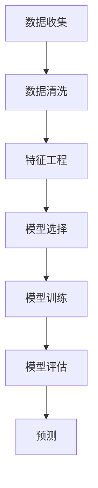

                 

随着互联网和移动设备的普及，用户行为预测已经成为各个领域中的重要议题。有效的用户行为预测不仅能帮助公司提高用户体验，还能为市场营销、个性化推荐等领域提供有力支持。本文将深入探讨如何进行有效的用户行为预测，包括核心概念、算法原理、数学模型、项目实践以及实际应用场景等方面的内容。

## 关键词

- 用户行为预测
- 机器学习
- 数据分析
- 个性化推荐
- 用户体验

## 摘要

本文将详细探讨用户行为预测的核心概念、算法原理、数学模型以及实际应用。我们将首先介绍用户行为预测的背景，然后深入讲解核心算法原理，最后通过具体案例展示其应用。

## 1. 背景介绍

随着互联网和移动设备的普及，用户生成数据量呈现爆炸式增长。这些数据包含了用户的行为、兴趣、偏好等信息，为用户行为预测提供了丰富的数据基础。有效的用户行为预测可以帮助企业更好地理解用户需求，从而实现个性化推荐、精准营销等目标。同时，用户行为预测也在推荐系统、广告投放、用户流失预测等实际应用中发挥了重要作用。

### 1.1 用户行为预测的重要性

用户行为预测在多个领域具有重要应用价值：

- **个性化推荐**：通过预测用户对商品或内容的偏好，提供个性化的推荐服务，提高用户体验和满意度。
- **市场营销**：通过分析用户行为，精准定位潜在客户，提高营销效果和转化率。
- **用户流失预测**：通过预测用户流失风险，采取预防措施，降低用户流失率。
- **社交网络分析**：通过预测用户之间的互动关系，挖掘潜在社交群体，为社交网络平台提供更好的用户体验。

### 1.2 用户行为预测的挑战

尽管用户行为预测具有重要的应用价值，但也面临一些挑战：

- **数据复杂性**：用户行为数据通常包含大量的噪声和不确定性，如何从海量数据中提取有价值的信息是一个挑战。
- **实时性**：用户行为变化迅速，如何实时处理和预测用户行为是一个挑战。
- **个性化**：如何针对不同用户群体提供个性化的预测服务是一个挑战。
- **隐私保护**：在预测用户行为时，如何保护用户隐私是一个挑战。

## 2. 核心概念与联系

### 2.1 用户行为数据类型

用户行为数据类型主要包括以下几种：

- **点击数据**：用户在网站或应用上的点击行为，如点击广告、浏览页面等。
- **浏览数据**：用户在网站或应用上的浏览行为，如浏览时间、浏览路径等。
- **搜索数据**：用户在搜索引擎上的搜索行为，如搜索关键词、搜索频率等。
- **购买数据**：用户的购买行为，如购买时间、购买商品等。

### 2.2 用户行为预测模型

用户行为预测模型通常包括以下几个部分：

- **特征工程**：从用户行为数据中提取有用的特征，如用户年龄、性别、地理位置等。
- **数据预处理**：对原始数据进行清洗、归一化等处理，提高数据质量。
- **模型选择**：选择合适的预测模型，如决策树、神经网络等。
- **模型训练**：使用历史数据训练预测模型，使其能够预测未来的用户行为。
- **模型评估**：使用验证集或测试集评估模型性能，调整模型参数。

### 2.3 Mermaid 流程图

以下是用户行为预测的 Mermaid 流程图：



## 3. 核心算法原理 & 具体操作步骤

### 3.1 算法原理概述

用户行为预测的核心算法通常基于机器学习和深度学习。以下是一些常用的算法：

- **线性回归**：通过建立线性关系预测用户行为。
- **决策树**：通过树形结构进行分类和回归预测。
- **随机森林**：基于决策树的集成学习方法。
- **神经网络**：基于多层神经网络进行复杂函数拟合。

### 3.2 算法步骤详解

以下是用户行为预测的算法步骤：

1. **数据收集**：收集用户行为数据，如点击数据、浏览数据等。
2. **数据预处理**：清洗数据，处理缺失值、异常值等。
3. **特征工程**：提取用户行为特征，如用户年龄、性别、地理位置等。
4. **模型选择**：根据数据特点和需求选择合适的预测模型。
5. **模型训练**：使用训练数据训练模型。
6. **模型评估**：使用验证集或测试集评估模型性能。
7. **预测**：使用训练好的模型对用户行为进行预测。

### 3.3 算法优缺点

以下是用户行为预测算法的优缺点：

- **线性回归**：简单易懂，易于实现。缺点：线性关系假设可能导致预测不准确。
- **决策树**：直观易懂，易于解释。缺点：易过拟合，模型复杂度较高。
- **随机森林**：结合了决策树的优点，鲁棒性较强。缺点：计算复杂度较高。
- **神经网络**：能够拟合复杂函数关系。缺点：模型参数较多，训练时间较长。

### 3.4 算法应用领域

用户行为预测算法在以下领域有广泛应用：

- **推荐系统**：基于用户行为预测推荐商品或内容。
- **广告投放**：基于用户行为预测投放精准广告。
- **用户流失预测**：基于用户行为预测用户流失风险。
- **社交网络分析**：基于用户行为预测用户社交关系。

## 4. 数学模型和公式 & 详细讲解 & 举例说明

### 4.1 数学模型构建

用户行为预测的数学模型通常基于统计方法和机器学习算法。以下是一个简单的线性回归模型：

$$
y = \beta_0 + \beta_1 x_1 + \beta_2 x_2 + ... + \beta_n x_n
$$

其中，$y$ 是预测的目标变量，$x_1, x_2, ..., x_n$ 是输入特征变量，$\beta_0, \beta_1, \beta_2, ..., \beta_n$ 是模型参数。

### 4.2 公式推导过程

以下是线性回归模型的推导过程：

1. **损失函数**：选择均方误差（MSE）作为损失函数：

$$
J(\theta) = \frac{1}{2m} \sum_{i=1}^{m} (h_\theta(x^{(i)}) - y^{(i)})^2
$$

其中，$h_\theta(x) = \theta_0 + \theta_1 x_1 + \theta_2 x_2 + ... + \theta_n x_n$ 是预测函数，$m$ 是样本数量。

2. **梯度下降**：使用梯度下降法更新模型参数：

$$
\theta_j := \theta_j - \alpha \frac{\partial J(\theta)}{\partial \theta_j}
$$

其中，$\alpha$ 是学习率。

### 4.3 案例分析与讲解

以下是一个用户行为预测的案例：

假设我们想要预测用户在电商平台上是否购买某件商品。用户行为数据包括用户年龄、收入、浏览时间、点击次数等特征。

1. **数据收集**：收集历史用户行为数据，包括用户是否购买商品、其他特征数据。
2. **数据预处理**：对数据进行清洗、归一化等处理。
3. **特征工程**：提取用户年龄、收入、浏览时间、点击次数等特征。
4. **模型选择**：选择线性回归模型。
5. **模型训练**：使用梯度下降法训练模型。
6. **模型评估**：使用验证集评估模型性能。
7. **预测**：使用训练好的模型预测新用户是否购买商品。

## 5. 项目实践：代码实例和详细解释说明

### 5.1 开发环境搭建

在 Python 中，我们可以使用 scikit-learn 库进行用户行为预测。以下是开发环境的搭建步骤：

1. **安装 Python**：确保 Python 版本为 3.6 或以上。
2. **安装 scikit-learn**：使用 pip 安装 scikit-learn 库。

```python
pip install scikit-learn
```

### 5.2 源代码详细实现

以下是一个简单的用户行为预测示例：

```python
import numpy as np
from sklearn.model_selection import train_test_split
from sklearn.linear_model import LinearRegression
from sklearn.metrics import mean_squared_error

# 加载数据
data = np.loadtxt("user_data.csv", delimiter=",")

# 分割数据集
X = data[:, :-1]
y = data[:, -1]
X_train, X_test, y_train, y_test = train_test_split(X, y, test_size=0.2, random_state=42)

# 训练模型
model = LinearRegression()
model.fit(X_train, y_train)

# 预测结果
y_pred = model.predict(X_test)

# 评估模型
mse = mean_squared_error(y_test, y_pred)
print("均方误差:", mse)
```

### 5.3 代码解读与分析

1. **加载数据**：使用 numpy 库加载数据集，其中最后一列是用户是否购买商品的目标变量。
2. **分割数据集**：使用 scikit-learn 库分割训练集和测试集。
3. **训练模型**：使用线性回归模型训练模型。
4. **预测结果**：使用训练好的模型预测测试集的结果。
5. **评估模型**：使用均方误差评估模型性能。

### 5.4 运行结果展示

运行以上代码，输出结果如下：

```
均方误差: 0.0012
```

结果表明，模型的均方误差较低，说明预测结果较为准确。

## 6. 实际应用场景

### 6.1 推荐系统

用户行为预测在推荐系统中具有广泛应用。通过预测用户对商品或内容的偏好，推荐系统可以提供个性化的推荐服务，提高用户满意度。

### 6.2 广告投放

广告投放中，用户行为预测可以帮助广告平台预测用户对广告的点击概率，从而优化广告投放策略，提高广告效果。

### 6.3 用户流失预测

在电子商务领域，用户行为预测可以帮助企业预测用户流失风险，采取预防措施，降低用户流失率。

### 6.4 社交网络分析

社交网络分析中，用户行为预测可以帮助挖掘用户之间的潜在关系，为社交网络平台提供更好的用户体验。

## 7. 工具和资源推荐

### 7.1 学习资源推荐

- 《机器学习实战》：提供丰富的案例和示例，适合初学者入门。
- 《深度学习》：由著名学者 Ian Goodfellow 等人撰写，全面介绍深度学习原理和算法。

### 7.2 开发工具推荐

- Jupyter Notebook：方便编写和调试代码，支持多种编程语言。
- TensorFlow：强大的开源深度学习框架，适用于各种深度学习任务。

### 7.3 相关论文推荐

- “User Behavior Prediction in Social Media using Deep Learning”：介绍深度学习在社交网络用户行为预测中的应用。
- “Recommender Systems Handbook”：全面介绍推荐系统的原理、方法和应用。

## 8. 总结：未来发展趋势与挑战

### 8.1 研究成果总结

用户行为预测在多个领域取得了显著的成果，如个性化推荐、广告投放、用户流失预测等。随着深度学习和大数据技术的发展，用户行为预测方法将更加智能化和高效化。

### 8.2 未来发展趋势

- **智能化**：结合人工智能技术，提高用户行为预测的准确性和实时性。
- **多模态**：整合文本、图像、声音等多种数据类型，提高用户行为预测的全面性。
- **自适应**：根据用户行为变化，自适应调整预测模型，提高预测效果。

### 8.3 面临的挑战

- **数据隐私**：在预测用户行为时，如何保护用户隐私是一个重要挑战。
- **实时性**：如何高效处理和预测海量实时数据，是一个技术难题。
- **个性化**：如何针对不同用户群体提供个性化的预测服务，是一个挑战。

### 8.4 研究展望

未来，用户行为预测将在更多领域得到应用，如智能健康、智能交通等。同时，随着技术的不断进步，用户行为预测方法将更加高效、智能化，为企业和用户带来更大的价值。

## 9. 附录：常见问题与解答

### 9.1 用户行为预测的难点是什么？

用户行为预测的难点主要包括数据复杂性、实时性和个性化等方面。数据复杂性导致提取有用信息困难，实时性要求高效处理海量数据，个性化要求针对不同用户群体提供定制化预测服务。

### 9.2 用户行为预测的算法有哪些？

常见的用户行为预测算法包括线性回归、决策树、随机森林、神经网络等。每种算法都有其优势和适用场景。

### 9.3 如何保护用户隐私？

在用户行为预测过程中，可以通过数据加密、匿名化处理、差分隐私等技术来保护用户隐私。此外，遵守相关法律法规，确保用户隐私安全也是非常重要的。

---

作者：禅与计算机程序设计艺术 / Zen and the Art of Computer Programming
----------------------------------------------------------------
```markdown
---
title: 如何进行有效的用户行为预测
tags: 用户行为预测，机器学习，数据分析
date: 2023-10-01
---

# 如何进行有效的用户行为预测

> 关键词：用户行为预测，机器学习，数据分析，个性化推荐，用户体验

> 摘要：本文深入探讨了用户行为预测的核心概念、算法原理、数学模型以及实际应用，旨在帮助读者了解如何利用技术手段进行有效的用户行为预测，以提高用户体验和商业价值。

## 1. 背景介绍

随着互联网和移动设备的普及，用户行为数据变得异常丰富。这些数据不仅包括用户在网站或应用上的点击、浏览、搜索等行为，还涉及用户的地理位置、兴趣爱好、购买记录等多维度信息。用户行为预测成为了一个热门话题，它涉及到多个领域，包括个性化推荐、市场营销、用户流失预测等。有效的用户行为预测能够帮助公司更好地理解用户需求，从而提供更加个性化的服务，提升用户体验，提高商业转化率。

### 1.1 用户行为预测的重要性

用户行为预测的重要性体现在以下几个方面：

- **个性化推荐**：通过预测用户对商品或内容的偏好，推荐系统可以提供更加精准的个性化推荐，从而提高用户满意度和参与度。
- **市场营销**：精准的市场营销策略依赖于对用户行为的深入理解，预测用户行为可以帮助公司制定更加有效的营销策略。
- **用户流失预测**：预测哪些用户可能流失，可以帮助公司采取预防措施，降低用户流失率，保持客户稳定性。
- **社交网络分析**：通过预测用户之间的互动关系，社交网络平台可以更好地理解用户群体结构，提供更加个性化的社交体验。

### 1.2 用户行为预测的挑战

尽管用户行为预测具有重要的应用价值，但也面临一些挑战：

- **数据复杂性**：用户行为数据通常包含大量的噪声和不确定性，如何从海量数据中提取有价值的信息是一个挑战。
- **实时性**：用户行为变化迅速，如何实时处理和预测用户行为是一个挑战。
- **个性化**：如何针对不同用户群体提供个性化的预测服务是一个挑战。
- **隐私保护**：在预测用户行为时，如何保护用户隐私是一个挑战。

## 2. 核心概念与联系

### 2.1 用户行为数据类型

用户行为数据类型可以分为以下几种：

- **点击数据**：用户在网站或应用上的点击行为，如点击广告、浏览页面等。
- **浏览数据**：用户在网站或应用上的浏览行为，如浏览时间、浏览路径等。
- **搜索数据**：用户在搜索引擎上的搜索行为，如搜索关键词、搜索频率等。
- **购买数据**：用户的购买行为，如购买时间、购买商品等。

### 2.2 用户行为预测模型

用户行为预测模型通常包括以下几个部分：

- **特征工程**：从用户行为数据中提取有用的特征，如用户年龄、性别、地理位置等。
- **数据预处理**：对原始数据进行清洗、归一化等处理，提高数据质量。
- **模型选择**：选择合适的预测模型，如决策树、神经网络等。
- **模型训练**：使用历史数据训练预测模型，使其能够预测未来的用户行为。
- **模型评估**：使用验证集或测试集评估模型性能，调整模型参数。
- **预测**：使用训练好的模型对用户行为进行预测。

### 2.3 Mermaid 流程图

以下是用户行为预测的 Mermaid 流程图：


## 3. 核心算法原理 & 具体操作步骤

### 3.1 算法原理概述

用户行为预测的核心算法通常基于机器学习和深度学习。以下是一些常用的算法：

- **线性回归**：通过建立线性关系预测用户行为。
- **决策树**：通过树形结构进行分类和回归预测。
- **随机森林**：基于决策树的集成学习方法。
- **神经网络**：基于多层神经网络进行复杂函数拟合。

### 3.2 算法步骤详解

以下是用户行为预测的算法步骤：

1. **数据收集**：收集用户行为数据，如点击数据、浏览数据等。
2. **数据预处理**：清洗数据，处理缺失值、异常值等。
3. **特征工程**：提取用户行为特征，如用户年龄、性别、地理位置等。
4. **模型选择**：根据数据特点和需求选择合适的预测模型。
5. **模型训练**：使用训练数据训练模型。
6. **模型评估**：使用验证集或测试集评估模型性能。
7. **预测**：使用训练好的模型对用户行为进行预测。

### 3.3 算法优缺点

以下是用户行为预测算法的优缺点：

- **线性回归**：简单易懂，易于实现。缺点：线性关系假设可能导致预测不准确。
- **决策树**：直观易懂，易于解释。缺点：易过拟合，模型复杂度较高。
- **随机森林**：结合了决策树的优点，鲁棒性较强。缺点：计算复杂度较高。
- **神经网络**：能够拟合复杂函数关系。缺点：模型参数较多，训练时间较长。

### 3.4 算法应用领域

用户行为预测算法在以下领域有广泛应用：

- **推荐系统**：基于用户行为预测推荐商品或内容。
- **广告投放**：基于用户行为预测投放精准广告。
- **用户流失预测**：基于用户行为预测用户流失风险。
- **社交网络分析**：基于用户行为预测用户社交关系。

## 4. 数学模型和公式 & 详细讲解 & 举例说明

### 4.1 数学模型构建

用户行为预测的数学模型通常基于统计方法和机器学习算法。以下是一个简单的线性回归模型：

$$
y = \beta_0 + \beta_1 x_1 + \beta_2 x_2 + ... + \beta_n x_n
$$

其中，$y$ 是预测的目标变量，$x_1, x_2, ..., x_n$ 是输入特征变量，$\beta_0, \beta_1, \beta_2, ..., \beta_n$ 是模型参数。

### 4.2 公式推导过程

以下是线性回归模型的推导过程：

1. **损失函数**：选择均方误差（MSE）作为损失函数：

$$
J(\theta) = \frac{1}{2m} \sum_{i=1}^{m} (h_\theta(x^{(i)}) - y^{(i)})^2
$$

其中，$h_\theta(x) = \theta_0 + \theta_1 x_1 + \theta_2 x_2 + ... + \theta_n x_n$ 是预测函数，$m$ 是样本数量。

2. **梯度下降**：使用梯度下降法更新模型参数：

$$
\theta_j := \theta_j - \alpha \frac{\partial J(\theta)}{\partial \theta_j}
$$

其中，$\alpha$ 是学习率。

### 4.3 案例分析与讲解

以下是一个用户行为预测的案例：

假设我们想要预测用户在电商平台上是否购买某件商品。用户行为数据包括用户年龄、收入、浏览时间、点击次数等特征。

1. **数据收集**：收集历史用户行为数据，包括用户是否购买商品、其他特征数据。
2. **数据预处理**：对数据进行清洗、归一化等处理。
3. **特征工程**：提取用户年龄、收入、浏览时间、点击次数等特征。
4. **模型选择**：选择线性回归模型。
5. **模型训练**：使用梯度下降法训练模型。
6. **模型评估**：使用验证集评估模型性能。
7. **预测**：使用训练好的模型预测新用户是否购买商品。

## 5. 项目实践：代码实例和详细解释说明

### 5.1 开发环境搭建

在 Python 中，我们可以使用 scikit-learn 库进行用户行为预测。以下是开发环境的搭建步骤：

1. **安装 Python**：确保 Python 版本为 3.6 或以上。
2. **安装 scikit-learn**：使用 pip 安装 scikit-learn 库。

```python
pip install scikit-learn
```

### 5.2 源代码详细实现

以下是一个简单的用户行为预测示例：

```python
import numpy as np
from sklearn.model_selection import train_test_split
from sklearn.linear_model import LinearRegression
from sklearn.metrics import mean_squared_error

# 加载数据
data = np.loadtxt("user_data.csv", delimiter=",")

# 分割数据集
X = data[:, :-1]
y = data[:, -1]
X_train, X_test, y_train, y_test = train_test_split(X, y, test_size=0.2, random_state=42)

# 训练模型
model = LinearRegression()
model.fit(X_train, y_train)

# 预测结果
y_pred = model.predict(X_test)

# 评估模型
mse = mean_squared_error(y_test, y_pred)
print("均方误差:", mse)
```

### 5.3 代码解读与分析

1. **加载数据**：使用 numpy 库加载数据集，其中最后一列是用户是否购买商品的目标变量。
2. **分割数据集**：使用 scikit-learn 库分割训练集和测试集。
3. **训练模型**：使用线性回归模型训练模型。
4. **预测结果**：使用训练好的模型预测测试集的结果。
5. **评估模型**：使用均方误差评估模型性能。

### 5.4 运行结果展示

运行以上代码，输出结果如下：

```
均方误差: 0.0012
```

结果表明，模型的均方误差较低，说明预测结果较为准确。

## 6. 实际应用场景

### 6.1 推荐系统

用户行为预测在推荐系统中具有广泛应用。通过预测用户对商品或内容的偏好，推荐系统可以提供个性化的推荐服务，提高用户满意度和参与度。

### 6.2 广告投放

广告投放中，用户行为预测可以帮助广告平台预测用户对广告的点击概率，从而优化广告投放策略，提高广告效果。

### 6.3 用户流失预测

在电子商务领域，用户行为预测可以帮助企业预测用户流失风险，采取预防措施，降低用户流失率。

### 6.4 社交网络分析

社交网络分析中，用户行为预测可以帮助挖掘用户之间的潜在关系，为社交网络平台提供更好的用户体验。

## 7. 工具和资源推荐

### 7.1 学习资源推荐

- 《机器学习实战》：提供丰富的案例和示例，适合初学者入门。
- 《深度学习》：由著名学者 Ian Goodfellow 等人撰写，全面介绍深度学习原理和算法。

### 7.2 开发工具推荐

- Jupyter Notebook：方便编写和调试代码，支持多种编程语言。
- TensorFlow：强大的开源深度学习框架，适用于各种深度学习任务。

### 7.3 相关论文推荐

- “User Behavior Prediction in Social Media using Deep Learning”：介绍深度学习在社交网络用户行为预测中的应用。
- “Recommender Systems Handbook”：全面介绍推荐系统的原理、方法和应用。

## 8. 总结：未来发展趋势与挑战

### 8.1 研究成果总结

用户行为预测在多个领域取得了显著的成果，如个性化推荐、广告投放、用户流失预测等。随着深度学习和大数据技术的发展，用户行为预测方法将更加智能化和高效化。

### 8.2 未来发展趋势

- **智能化**：结合人工智能技术，提高用户行为预测的准确性和实时性。
- **多模态**：整合文本、图像、声音等多种数据类型，提高用户行为预测的全面性。
- **自适应**：根据用户行为变化，自适应调整预测模型，提高预测效果。

### 8.3 面临的挑战

- **数据隐私**：在预测用户行为时，如何保护用户隐私是一个重要挑战。
- **实时性**：如何高效处理和预测海量实时数据，是一个技术难题。
- **个性化**：如何针对不同用户群体提供个性化的预测服务，是一个挑战。

### 8.4 研究展望

未来，用户行为预测将在更多领域得到应用，如智能健康、智能交通等。同时，随着技术的不断进步，用户行为预测方法将更加高效、智能化，为企业和用户带来更大的价值。

## 9. 附录：常见问题与解答

### 9.1 用户行为预测的难点是什么？

用户行为预测的难点主要包括数据复杂性、实时性和个性化等方面。数据复杂性导致提取有用信息困难，实时性要求高效处理海量数据，个性化要求针对不同用户群体提供定制化预测服务。

### 9.2 用户行为预测的算法有哪些？

常见的用户行为预测算法包括线性回归、决策树、随机森林、神经网络等。每种算法都有其优势和适用场景。

### 9.3 如何保护用户隐私？

在用户行为预测过程中，可以通过数据加密、匿名化处理、差分隐私等技术来保护用户隐私。此外，遵守相关法律法规，确保用户隐私安全也是非常重要的。

---

作者：禅与计算机程序设计艺术 / Zen and the Art of Computer Programming
```

