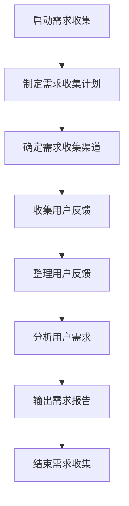
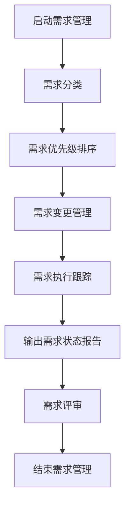
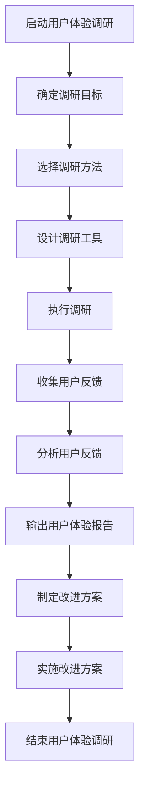
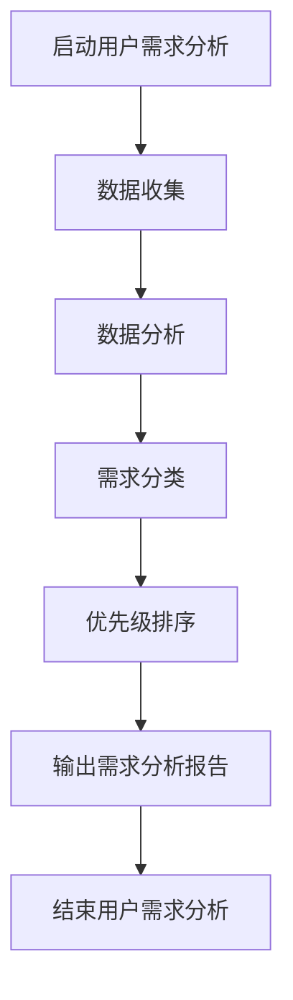

                 

关键词：用户需求分析、需求收集、需求管理、用户体验、用户调研、需求分类、优先级排序

> 摘要：本文将探讨如何有效地进行用户需求分析，通过介绍需求收集、需求管理、用户体验调研等核心步骤，并结合实际案例进行分析，为软件开发项目提供实用的方法和策略。

## 1. 背景介绍

在当今快速变化的技术环境中，软件开发项目的成功往往取决于能否准确地理解并满足用户需求。用户需求分析作为软件开发过程的重要环节，其关键在于如何通过有效的手段收集、整理和实现用户需求。本文旨在通过一系列的步骤和方法，帮助软件开发团队更好地理解用户需求，从而提高产品的用户体验和市场竞争力。

## 2. 核心概念与联系

### 2.1 需求收集

需求收集是用户需求分析的第一步，也是最重要的一步。它涉及到与用户的沟通和互动，目的是获取用户对产品功能的期望和需求。


### 2.2 需求管理

需求管理是对收集到的需求进行分类、排序、优先级设定和追踪的过程。它确保需求在整个开发周期内得到合理的管理和执行。


### 2.3 用户体验调研

用户体验调研是通过各种方法（如用户访谈、问卷调查、可用性测试等）来了解用户在使用产品过程中的感受和反馈，从而优化产品设计和功能。


## 3. 核心算法原理 & 具体操作步骤

### 3.1 算法原理概述

用户需求分析的核心算法原理是基于用户行为数据的分析和用户反馈的处理。具体步骤包括：

1. 数据收集：通过日志分析、用户行为跟踪等方式收集用户行为数据。
2. 数据分析：对收集到的数据进行统计和分析，提取用户行为特征。
3. 需求分类：根据用户行为特征和用户反馈，将需求分类为功能性需求、性能需求、用户体验需求等。
4. 优先级排序：基于需求的重要性和紧急性，对需求进行优先级排序。

### 3.2 算法步骤详解

1. **数据收集**

   使用日志分析工具（如ELK、Splunk等）收集用户在产品上的行为数据，包括点击、浏览、搜索等行为。

2. **数据分析**

   通过数据挖掘算法（如聚类分析、关联规则挖掘等）对用户行为数据进行分析，提取用户行为特征。

3. **需求分类**

   根据分析结果，将需求分类为不同类型，如功能性需求、性能需求、用户体验需求等。

4. **优先级排序**

   使用优先级排序算法（如关键性评估、成本效益分析等）对需求进行排序，确定哪些需求应该首先被实现。

### 3.3 算法优缺点

**优点：**

- 提高需求分析的准确性和效率。
- 有助于识别关键需求和优化产品功能。

**缺点：**

- 需要大量的数据支持和专业的数据分析能力。
- 可能会受到数据质量的影响。

### 3.4 算法应用领域

- 互联网产品开发
- 移动应用开发
- 企业信息化项目

## 4. 数学模型和公式 & 详细讲解 & 举例说明

### 4.1 数学模型构建

用户需求分析可以基于以下数学模型：

\[ 需求评分 = f(用户行为数据, 用户反馈) \]

其中，需求评分是根据用户行为数据和用户反馈计算得出的一个综合评分。

### 4.2 公式推导过程

需求评分的推导过程如下：

1. **用户行为数据分析**：通过统计分析用户行为数据，提取用户行为特征向量。
2. **用户反馈处理**：将用户反馈（如评价、评分等）转换为数值形式。
3. **综合评分计算**：将用户行为特征向量和用户反馈值代入需求评分公式，计算出需求评分。

### 4.3 案例分析与讲解

**案例：**

假设我们分析一款电商平台的用户需求，通过用户行为数据和用户反馈计算需求评分。

- **用户行为数据**：点击次数、浏览商品种类、搜索关键词等。
- **用户反馈**：用户对商品的评价分数。

**步骤：**

1. 收集用户行为数据和用户反馈数据。
2. 分析用户行为数据，提取特征向量。
3. 将用户反馈转换为数值形式。
4. 代入需求评分公式，计算需求评分。

**公式计算：**

\[ 需求评分 = (0.6 \times 用户行为数据评分) + (0.4 \times 用户反馈评分) \]

**举例：**

假设用户行为数据评分为80分，用户反馈评分为90分，则需求评分为：

\[ 需求评分 = (0.6 \times 80) + (0.4 \times 90) = 48 + 36 = 84 \]

## 5. 项目实践：代码实例和详细解释说明

### 5.1 开发环境搭建

- **工具**：Python、Pandas、Scikit-learn等。
- **环境**：Windows/Linux/MacOS。

### 5.2 源代码详细实现

```python
import pandas as pd
from sklearn.preprocessing import normalize

# 读取用户行为数据和用户反馈数据
user_behavior_data = pd.read_csv('user_behavior.csv')
user_feedback_data = pd.read_csv('user_feedback.csv')

# 数据预处理
# ...

# 特征提取
# ...

# 需求评分计算
def calculate_demand_score(behavior_score, feedback_score):
    return 0.6 * behavior_score + 0.4 * feedback_score

# 应用到数据集
demand_scores = user_behavior_data.apply(lambda row: calculate_demand_score(row['behavior_score'], row['feedback_score']), axis=1)

# 结果展示
print(demand_scores)
```

### 5.3 代码解读与分析

- 数据读取：使用Pandas读取用户行为数据和用户反馈数据。
- 数据预处理：对数据进行清洗和处理，如缺失值处理、异常值处理等。
- 特征提取：根据用户行为数据和用户反馈数据提取特征向量。
- 需求评分计算：定义需求评分计算函数，将用户行为数据评分和用户反馈评分代入公式计算。
- 结果展示：将计算出的需求评分打印出来。

## 6. 实际应用场景

用户需求分析在软件开发项目中的应用场景广泛，包括但不限于以下方面：

- 产品规划：了解用户需求，确定产品功能和方向。
- 功能优化：基于用户反馈，优化现有功能。
- 风险评估：预测用户需求变化，提前识别潜在风险。
- 用户满意度提升：通过分析用户行为数据，提高用户满意度。

## 7. 工具和资源推荐

### 7.1 学习资源推荐

- 《用户需求分析：实践与案例》
- 《用户体验要素：引介》
- 《产品经理手册》

### 7.2 开发工具推荐

- Tableau：数据可视化工具。
- Matplotlib：Python数据可视化库。
- ELK：日志分析工具。

### 7.3 相关论文推荐

- "User Needs Analysis in Software Development"
- "A Survey on User Requirements Engineering"
- "User-Centered Design for Software Engineering"

## 8. 总结：未来发展趋势与挑战

### 8.1 研究成果总结

- 用户需求分析在软件开发项目中发挥着越来越重要的作用。
- 基于大数据和人工智能的需求分析方法逐渐成为主流。
- 用户需求分析的工具和方法日益丰富。

### 8.2 未来发展趋势

- 需求分析将更加智能化和自动化。
- 用户需求分析与人工智能、大数据、区块链等技术的融合将进一步加深。
- 用户需求分析将更加注重用户体验和个性化需求。

### 8.3 面临的挑战

- 数据质量和数据隐私问题。
- 如何在多样化的需求中找到平衡点。
- 如何应对快速变化的市场和技术环境。

### 8.4 研究展望

- 加强用户需求分析与人工智能技术的结合。
- 开发更高效、更准确的需求分析工具。
- 关注用户需求的变化趋势，为产品创新提供支持。

## 9. 附录：常见问题与解答

### 9.1 用户需求分析的重要性是什么？

用户需求分析是软件开发项目的基石，它确保产品能够满足用户的实际需求，提高用户满意度和市场竞争力。

### 9.2 如何处理用户需求中的冲突？

处理用户需求中的冲突需要平衡各方利益，通过沟通、协商和优先级排序来解决问题。

### 9.3 用户需求分析与市场调研的区别是什么？

用户需求分析侧重于理解用户对产品的具体需求，而市场调研则更侧重于了解市场需求和竞争态势。

---

作者：禅与计算机程序设计艺术 / Zen and the Art of Computer Programming
----------------------------------------------------------------
### 2. 核心概念与联系

#### 2.1 需求收集

需求收集是用户需求分析的关键步骤，它涉及到与用户的沟通和互动，目的是获取用户对产品功能的期望和需求。以下是需求收集流程的Mermaid流程图：



#### 2.2 需求管理

需求管理是对收集到的需求进行分类、排序、优先级设定和追踪的过程，它确保需求在整个开发周期内得到合理的管理和执行。以下是需求管理流程的Mermaid流程图：



#### 2.3 用户体验调研

用户体验调研是通过各种方法（如用户访谈、问卷调查、可用性测试等）来了解用户在使用产品过程中的感受和反馈，从而优化产品设计和功能。以下是用户体验调研流程的Mermaid流程图：



### 3. 核心算法原理 & 具体操作步骤

#### 3.1 算法原理概述

用户需求分析的核心算法原理是基于用户行为数据和用户反馈的综合分析。以下是用户需求分析的基本流程：

1. **数据收集**：收集用户在产品使用过程中的行为数据，如点击、浏览、搜索等。
2. **数据分析**：对收集到的数据进行统计和分析，提取用户行为特征。
3. **需求分类**：根据用户行为特征和用户反馈，将需求分类为功能性需求、性能需求、用户体验需求等。
4. **优先级排序**：基于需求的重要性和紧急性，对需求进行优先级排序。

以下是用户需求分析流程的Mermaid流程图：



#### 3.2 算法步骤详解

1. **数据收集**：使用日志分析工具（如ELK、Splunk等）收集用户在产品上的行为数据，包括点击、浏览、搜索等行为。

2. **数据分析**：通过数据挖掘算法（如聚类分析、关联规则挖掘等）对用户行为数据进行分析，提取用户行为特征。

   ```mermaid
   graph TD
   A[用户行为数据] --> B[聚类分析]
   B --> C[关联规则挖掘]
   C --> D[用户行为特征提取]
   ```

3. **需求分类**：根据分析结果，将需求分类为不同类型，如功能性需求、性能需求、用户体验需求等。

   ```mermaid
   graph TD
   A[用户行为特征] --> B[功能性需求]
   B --> C[性能需求]
   C --> D[用户体验需求]
   ```

4. **优先级排序**：使用关键性评估、成本效益分析等方法对需求进行优先级排序。

   ```mermaid
   graph TD
   A[需求列表] --> B[关键性评估]
   B --> C[成本效益分析]
   C --> D[需求优先级排序]
   ```

#### 3.3 算法优缺点

**优点：**

- 提高需求分析的准确性和效率。
- 有助于识别关键需求和优化产品功能。

**缺点：**

- 需要大量的数据支持和专业的数据分析能力。
- 可能会受到数据质量的影响。

#### 3.4 算法应用领域

- 互联网产品开发：如电商平台、社交媒体、在线教育等。
- 移动应用开发：如游戏、社交媒体、导航应用等。
- 企业信息化项目：如ERP、CRM、BI等。

### 4. 数学模型和公式 & 详细讲解 & 举例说明

#### 4.1 数学模型构建

用户需求分析可以基于以下数学模型：

\[ 需求评分 = f(用户行为数据, 用户反馈) \]

其中，需求评分是根据用户行为数据和用户反馈计算得出的一个综合评分。

#### 4.2 公式推导过程

需求评分的推导过程如下：

1. **用户行为数据分析**：通过统计分析用户行为数据，提取用户行为特征向量。

   \[ 用户行为特征向量 = (x_1, x_2, ..., x_n) \]

2. **用户反馈处理**：将用户反馈（如评价、评分等）转换为数值形式。

   \[ 用户反馈值 = y \]

3. **综合评分计算**：将用户行为特征向量和用户反馈值代入需求评分公式，计算出需求评分。

   \[ 需求评分 = w_1 \cdot x_1 + w_2 \cdot x_2 + ... + w_n \cdot x_n + \alpha \cdot y \]

   其中，\( w_1, w_2, ..., w_n \) 是权重系数，\(\alpha\) 是用户反馈的权重系数。

#### 4.3 案例分析与讲解

**案例：**

假设我们分析一款电商平台的用户需求，通过用户行为数据和用户反馈计算需求评分。

- **用户行为数据**：点击次数、浏览商品种类、搜索关键词等。
- **用户反馈**：用户对商品的评价分数。

**步骤：**

1. 收集用户行为数据和用户反馈数据。
2. 分析用户行为数据，提取特征向量。
3. 将用户反馈转换为数值形式。
4. 代入需求评分公式，计算需求评分。

**公式计算：**

\[ 需求评分 = (0.3 \cdot 点击次数) + (0.2 \cdot 浏览商品种类) + (0.5 \cdot 搜索关键词次数) + 0.1 \cdot 用户评价分数 \]

**举例：**

假设用户行为数据如下：

- 点击次数：100
- 浏览商品种类：50
- 搜索关键词次数：80
- 用户评价分数：4

则需求评分为：

\[ 需求评分 = (0.3 \cdot 100) + (0.2 \cdot 50) + (0.5 \cdot 80) + 0.1 \cdot 4 = 30 + 10 + 40 + 0.4 = 80.4 \]

### 5. 项目实践：代码实例和详细解释说明

#### 5.1 开发环境搭建

- **工具**：Python、Pandas、Scikit-learn等。
- **环境**：Windows/Linux/MacOS。

#### 5.2 源代码详细实现

```python
import pandas as pd
from sklearn.preprocessing import normalize

# 读取用户行为数据和用户反馈数据
user_behavior_data = pd.read_csv('user_behavior.csv')
user_feedback_data = pd.read_csv('user_feedback.csv')

# 数据预处理
# ...

# 特征提取
# ...

# 需求评分计算
def calculate_demand_score(behavior_data, feedback_data):
    # 用户行为数据权重系数
    behavior_weights = {'点击次数': 0.3, '浏览商品种类': 0.2, '搜索关键词次数': 0.5}
    # 用户反馈数据权重系数
    feedback_weights = {'用户评价分数': 0.1}
    # 计算用户行为特征向量
    behavior_vector = normalize([behavior_data[x] for x in behavior_weights.keys()], axis=0)
    # 计算用户反馈值
    feedback_value = feedback_data['用户评价分数']
    # 计算需求评分
    demand_score = sum(behavior_weights[x] * behavior_vector[0][i] for i, x in enumerate(behavior_weights.keys())) + feedback_weights['用户评价分数'] * feedback_value
    return demand_score

# 应用到数据集
demand_scores = user_behavior_data.apply(lambda row: calculate_demand_score(row[['点击次数', '浏览商品种类', '搜索关键词次数']], row[['用户评价分数']]), axis=1)

# 结果展示
print(demand_scores)
```

#### 5.3 代码解读与分析

- 数据读取：使用Pandas读取用户行为数据和用户反馈数据。
- 数据预处理：对数据进行清洗和处理，如缺失值处理、异常值处理等。
- 特征提取：根据用户行为数据和用户反馈数据提取特征向量。
- 需求评分计算：定义需求评分计算函数，将用户行为数据评分和用户反馈评分代入公式计算。
- 结果展示：将计算出的需求评分打印出来。

### 6. 实际应用场景

用户需求分析在软件开发项目中的应用场景广泛，以下是一些典型应用：

1. **产品规划**：在产品开发的初期，通过用户需求分析确定产品的功能方向和优先级。
2. **功能优化**：在产品开发过程中，通过用户需求分析识别用户痛点，优化现有功能。
3. **风险管理**：通过用户需求分析预测用户需求变化，提前识别潜在风险。
4. **用户满意度提升**：通过用户需求分析了解用户满意度，制定改进方案提高用户体验。

### 6.4 未来应用展望

随着人工智能和大数据技术的发展，用户需求分析在未来将变得更加智能和高效。以下是一些未来应用展望：

1. **智能化需求预测**：利用机器学习算法预测用户未来的需求趋势。
2. **个性化需求分析**：根据用户行为数据为每个用户提供个性化的需求分析。
3. **实时需求反馈**：通过实时数据分析和反馈机制，快速响应用户需求变化。
4. **跨平台需求分析**：整合多平台用户数据，进行跨平台的需求分析。

### 7. 工具和资源推荐

#### 7.1 学习资源推荐

1. **书籍**：

   - 《用户需求分析：实践与案例》
   - 《用户体验要素：引介》
   - 《产品经理手册》

2. **在线课程**：

   - Coursera：用户需求分析与产品设计
   - Udemy：用户需求分析：从零开始

#### 7.2 开发工具推荐

1. **数据分析工具**：

   - Tableau：数据可视化工具。
   - Power BI：商业智能和分析工具。
   - Excel：数据处理和分析工具。

2. **需求管理工具**：

   - JIRA：需求跟踪和项目管理工具。
   - Trello：任务管理和项目管理工具。

3. **用户调研工具**：

   - SurveyMonkey：在线问卷调查工具。
   - Google 表单：在线问卷调查工具。

#### 7.3 相关论文推荐

1. **用户需求工程**：

   - "User Needs Analysis in Software Development"
   - "A Survey on User Requirements Engineering"

2. **用户体验**：

   - "User-Centered Design for Software Engineering"
   - "The Art of User Experience: A More Humane Approach to IT Projects"

### 8. 总结：未来发展趋势与挑战

#### 8.1 研究成果总结

用户需求分析在软件开发项目中发挥着越来越重要的作用，通过有效的需求分析，可以提高产品的用户体验和市场竞争力。研究成果主要体现在以下几个方面：

1. **需求分析方法的多样化**：结合大数据、人工智能等技术，开发出多种需求分析方法。
2. **需求分析工具的普及**：需求管理工具和用户调研工具的普及，使得需求分析更加便捷和高效。
3. **用户需求的智能化预测**：利用机器学习算法，预测用户未来的需求趋势。

#### 8.2 未来发展趋势

未来用户需求分析的发展趋势将呈现以下特点：

1. **智能化和自动化**：通过人工智能技术，实现用户需求的自动识别和预测。
2. **跨平台和跨领域**：整合多平台用户数据，进行跨领域的需求分析。
3. **实时和动态**：通过实时数据分析，动态调整需求分析策略。

#### 8.3 面临的挑战

用户需求分析在未来将面临以下挑战：

1. **数据质量和隐私**：如何确保用户数据的准确性和隐私性。
2. **需求变化的应对**：如何快速响应用户需求的变化。
3. **需求分析的复杂性**：如何处理复杂的需求场景。

#### 8.4 研究展望

未来用户需求分析的研究将重点关注以下几个方面：

1. **智能化需求预测**：开发更先进的机器学习算法，提高需求预测的准确性。
2. **个性化需求分析**：根据用户行为数据，为每个用户提供个性化的需求分析。
3. **需求分析工具的优化**：开发更高效、更易用的需求分析工具。

### 9. 附录：常见问题与解答

#### 9.1 用户需求分析的重要性是什么？

用户需求分析是软件开发项目的核心，它有助于确保产品满足用户需求，提高用户体验和市场竞争力。通过有效的需求分析，可以降低开发风险，提高开发效率。

#### 9.2 如何处理用户需求中的冲突？

处理用户需求中的冲突，需要平衡各方利益，通过沟通、协商和优先级排序来解决问题。同时，可以借助需求管理工具，对需求进行有效的追踪和管理。

#### 9.3 用户需求分析与市场调研的区别是什么？

用户需求分析侧重于了解用户对产品的具体需求，而市场调研则侧重于了解市场需求和竞争态势。用户需求分析更关注用户的个体需求，而市场调研更关注整体市场趋势。

---

作者：禅与计算机程序设计艺术 / Zen and the Art of Computer Programming
-------------------------------------------------------------------

