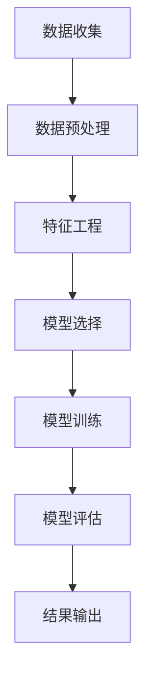

                 

在当今快速发展的数字化时代，了解并预测用户的需求成为了企业成功的关键。这不仅有助于企业更好地服务于现有客户，还能吸引潜在客户。有效的用户需求预测能够帮助企业优化资源分配，提高产品开发效率，以及提升客户满意度。本文将探讨如何进行有效的用户需求预测，包括核心概念、算法原理、数学模型、实际应用场景以及未来展望。

## 文章关键词

- 用户需求预测
- 数据分析
- 机器学习
- 客户行为分析
- 业务策略优化

## 文章摘要

本文旨在为企业和开发者提供一套系统的用户需求预测方法。首先，我们将回顾用户需求预测的背景和重要性，然后深入探讨核心概念、算法原理、数学模型，并通过实际应用案例展示其效果。最后，我们将展望用户需求预测的未来发展趋势和面临的挑战。

## 1. 背景介绍

### 数字化转型的驱动力

随着互联网的普及和智能设备的广泛使用，消费者的行为模式发生了显著变化。数字化转型的浪潮推动了企业对用户需求的重视。企业通过大数据和人工智能技术，可以更精确地捕捉和分析用户行为，从而预测他们的需求。

### 用户需求的多样性

用户需求的多样性增加了预测的复杂性。不同的用户群体、不同的购买周期、不同的消费习惯，都需要个性化的预测模型。传统的市场调研方法已经难以满足这种复杂性。

### 数据驱动决策的重要性

在数据驱动的商业环境中，用户需求预测成为制定战略、优化产品和服务的重要依据。准确的需求预测能够帮助企业避免库存过剩或短缺，提高运营效率。

## 2. 核心概念与联系

### 用户需求预测定义

用户需求预测是指利用历史数据、市场趋势和用户行为，通过统计分析和机器学习算法，对未来用户需求进行估计的过程。

### 数据源

- 用户行为数据：如浏览历史、购买记录、评论等。
- 市场数据：如竞争对手活动、行业趋势等。
- 社会媒体数据：如微博、知乎等社交平台上的用户反馈。

### 用户行为分析

用户行为分析是用户需求预测的基础。通过分析用户在网站、应用或其他数字平台上的行为，可以识别用户兴趣、购买意图等。

### Mermaid 流程图



### Mermaid 流程节点解释

- **A 数据收集**：从各种数据源收集用户数据。
- **B 数据预处理**：清洗、整合和规范化数据。
- **C 特征工程**：提取有用的特征，如用户浏览时间、购买频率等。
- **D 模型选择**：选择合适的预测模型，如线性回归、决策树、神经网络等。
- **E 模型训练**：使用历史数据训练模型。
- **F 模型评估**：评估模型的预测准确性。
- **G 结果输出**：输出预测结果，为决策提供依据。

## 3. 核心算法原理 & 具体操作步骤

### 3.1 算法原理概述

用户需求预测算法主要基于机器学习中的监督学习和无监督学习。常见的算法包括线性回归、决策树、随机森林、支持向量机和神经网络等。

### 3.2 算法步骤详解

1. **数据收集**：从各种渠道收集用户数据，包括行为数据和市场数据。
2. **数据预处理**：清洗和整合数据，处理缺失值和异常值。
3. **特征工程**：提取有用的特征，如用户年龄、购买历史、浏览时间等。
4. **模型选择**：根据数据特征和预测目标，选择合适的模型。
5. **模型训练**：使用历史数据训练模型，调整模型参数。
6. **模型评估**：评估模型的预测性能，如均方误差、准确率等。
7. **结果输出**：输出预测结果，为业务决策提供支持。

### 3.3 算法优缺点

- **线性回归**：简单易用，但只能处理线性关系。
- **决策树**：直观易懂，但容易过拟合。
- **随机森林**：可以处理非线性关系，但计算复杂度高。
- **支持向量机**：适用于高维空间，但参数选择困难。
- **神经网络**：强大的非线性处理能力，但训练过程复杂。

### 3.4 算法应用领域

用户需求预测算法在电商、金融、医疗等多个领域都有广泛应用。例如，电商企业可以通过用户需求预测优化库存管理，银行可以通过用户需求预测精准营销金融产品。

## 4. 数学模型和公式 & 详细讲解 & 举例说明

### 4.1 数学模型构建

用户需求预测的数学模型通常基于线性回归模型。假设用户需求 \( Y \) 与特征 \( X \) 的关系可以用以下公式表示：

\[ Y = \beta_0 + \beta_1X_1 + \beta_2X_2 + ... + \beta_nX_n + \epsilon \]

其中，\( \beta_0 \) 是截距，\( \beta_1, \beta_2, ..., \beta_n \) 是特征系数，\( X_1, X_2, ..., X_n \) 是特征值，\( \epsilon \) 是误差项。

### 4.2 公式推导过程

线性回归模型的推导基于最小二乘法。假设我们有 \( n \) 个数据点 \( (x_1, y_1), (x_2, y_2), ..., (x_n, y_n) \)，目标是最小化残差平方和：

\[ \sum_{i=1}^{n} (y_i - \beta_0 - \beta_1x_{i1} - \beta_2x_{i2} - ... - \beta_nx_{in})^2 \]

通过对残差平方和关于 \( \beta_0, \beta_1, ..., \beta_n \) 的偏导数取零，可以得到最优的参数值。

### 4.3 案例分析与讲解

#### 案例背景

假设我们想要预测某电商平台下一个月的用户购买数量。我们有以下特征数据：用户年龄、收入水平、购物频率、商品类别等。

#### 数据准备

```python
import pandas as pd

# 加载数据
data = pd.read_csv('user_data.csv')

# 数据预处理
data.fillna(data.mean(), inplace=True)
```

#### 特征工程

```python
# 提取特征
X = data[['age', 'income', 'shopping_frequency', 'product_category']]
y = data['purchase_quantity']

# 数据标准化
from sklearn.preprocessing import StandardScaler
scaler = StandardScaler()
X_scaled = scaler.fit_transform(X)
```

#### 模型训练

```python
from sklearn.linear_model import LinearRegression

# 创建线性回归模型
model = LinearRegression()

# 训练模型
model.fit(X_scaled, y)
```

#### 模型评估

```python
from sklearn.metrics import mean_squared_error

# 预测
y_pred = model.predict(X_scaled)

# 评估
mse = mean_squared_error(y, y_pred)
print('均方误差：', mse)
```

#### 结果输出

```python
# 输出模型参数
print('模型参数：', model.coef_)
```

## 5. 项目实践：代码实例和详细解释说明

### 5.1 开发环境搭建

```shell
# 安装Python环境
pip install numpy pandas scikit-learn matplotlib
```

### 5.2 源代码详细实现

```python
import pandas as pd
from sklearn.linear_model import LinearRegression
from sklearn.metrics import mean_squared_error
from sklearn.preprocessing import StandardScaler
import matplotlib.pyplot as plt

# 数据加载
data = pd.read_csv('user_data.csv')

# 数据预处理
data.fillna(data.mean(), inplace=True)

# 特征提取
X = data[['age', 'income', 'shopping_frequency', 'product_category']]
y = data['purchase_quantity']

# 数据标准化
scaler = StandardScaler()
X_scaled = scaler.fit_transform(X)

# 模型训练
model = LinearRegression()
model.fit(X_scaled, y)

# 预测
y_pred = model.predict(X_scaled)

# 评估
mse = mean_squared_error(y, y_pred)
print('均方误差：', mse)

# 可视化
plt.scatter(y, y_pred)
plt.xlabel('实际值')
plt.ylabel('预测值')
plt.show()
```

### 5.3 代码解读与分析

- **数据加载**：使用 `pandas` 读取CSV文件。
- **数据预处理**：处理缺失值，并填充平均值。
- **特征提取**：将相关特征提取出来。
- **数据标准化**：使用 `StandardScaler` 进行数据标准化。
- **模型训练**：使用 `LinearRegression` 创建线性回归模型，并训练。
- **预测**：使用训练好的模型进行预测。
- **评估**：计算均方误差，评估模型性能。
- **可视化**：绘制实际值与预测值的散点图，观察模型效果。

### 5.4 运行结果展示

运行上述代码后，程序会输出均方误差值，并展示实际值与预测值的散点图。通过观察散点图，可以直观地看到模型预测的效果。

## 6. 实际应用场景

### 6.1 电商领域

在电商领域，用户需求预测可以帮助企业优化库存管理，减少库存过剩或短缺的情况。例如，亚马逊使用机器学习算法预测商品需求，从而优化库存水平，提高运营效率。

### 6.2 金融领域

在金融领域，用户需求预测可以帮助银行精准营销金融产品，如信用卡、贷款等。通过分析用户行为和需求，银行可以提供个性化的金融产品推荐，提高客户满意度。

### 6.3 医疗领域

在医疗领域，用户需求预测可以帮助医院更好地分配医疗资源。例如，通过预测患者就诊数量，医院可以合理安排医生和护士的排班，提高医疗服务质量。

## 7. 工具和资源推荐

### 7.1 学习资源推荐

- 《Python数据分析》
- 《机器学习实战》
- Coursera上的《机器学习》课程

### 7.2 开发工具推荐

- Jupyter Notebook
- PyCharm
- Matplotlib

### 7.3 相关论文推荐

- "User Behavior Prediction in E-commerce via Multi-Relational Graph Embedding"
- "Customer Segmentation for Personalized Marketing in E-commerce"
- "Deep Learning for Customer Behavior Analysis in Retail"

## 8. 总结：未来发展趋势与挑战

### 8.1 研究成果总结

用户需求预测技术已经取得了显著成果。通过大数据和机器学习，企业能够更精确地预测用户需求，从而优化运营策略和产品设计。

### 8.2 未来发展趋势

未来，用户需求预测将更加智能化和个性化。随着人工智能和大数据技术的发展，预测模型将更加精确，能够更好地服务于企业和客户。

### 8.3 面临的挑战

尽管用户需求预测技术取得了进展，但仍然面临一些挑战。例如，数据质量问题和隐私保护问题需要得到更好的解决。

### 8.4 研究展望

未来，用户需求预测技术将继续发展，将更多的人工智能和大数据技术应用于实际场景，为企业提供更有价值的预测分析。

## 9. 附录：常见问题与解答

### Q1：用户需求预测有什么作用？

A1：用户需求预测可以帮助企业优化资源分配，提高产品开发效率，以及提升客户满意度。通过预测用户需求，企业可以更好地满足客户需求，提高市场竞争力。

### Q2：如何处理用户需求预测中的数据质量问题？

A2：处理数据质量问题包括数据清洗、数据整合和数据标准化。例如，使用均值填补缺失值，使用统计方法检测和处理异常值，以及对数据进行标准化处理。

### Q3：用户需求预测的算法有哪些？

A3：用户需求预测的算法包括线性回归、决策树、随机森林、支持向量机和神经网络等。选择合适的算法取决于数据的特征和预测目标。

作者：禅与计算机程序设计艺术 / Zen and the Art of Computer Programming
----------------------------------------------------------------

以上就是关于如何进行有效的用户需求预测的文章，内容涵盖了用户需求预测的定义、核心概念、算法原理、数学模型、实际应用场景以及未来展望等多个方面。希望对您有所帮助！
----------------------------------------------------------------

### 9. 附录：常见问题与解答

**Q1：用户需求预测有什么作用？**

A1：用户需求预测对企业至关重要。它可以指导企业在产品研发、库存管理、市场推广等方面做出更精准的决策，从而提高运营效率、降低成本、提升客户满意度和市场竞争力。

**Q2：用户需求预测中的数据如何清洗和处理？**

A2：数据清洗和处理是用户需求预测中的关键步骤。通常包括以下内容：

- **缺失值处理**：可以使用均值、中位数、众数等统计方法填补缺失值，或者删除含有缺失值的数据点。
- **异常值检测**：可以使用统计方法（如箱线图）或机器学习方法（如孤立森林）检测异常值，并根据具体情况决定是否保留或删除。
- **数据规范化**：将不同尺度的数据进行标准化或归一化，以便模型更好地处理数据。

**Q3：如何选择合适的用户需求预测算法？**

A3：选择合适的算法通常基于以下几个因素：

- **数据特性**：分析数据分布、特征维度等，选择适合处理相应数据特性的算法。
- **预测目标**：例如，是分类问题还是回归问题，不同类型的预测目标需要不同的算法。
- **模型复杂性**：简单模型（如线性回归）易于理解和解释，但可能不足以处理复杂关系；复杂模型（如神经网络）可以捕捉更复杂的关系，但可能需要更多数据和时间进行训练。
- **计算资源**：选择模型时还需考虑计算资源，复杂模型可能需要更多的计算能力。

**Q4：如何评估用户需求预测模型的性能？**

A4：评估模型性能常用的指标包括：

- **准确性**：分类问题中常用的指标，表示预测正确的比例。
- **均方误差（MSE）**：回归问题中常用的指标，表示预测值与实际值之间的平均误差。
- **召回率**：分类问题中用于衡量预测为正类的正类样本中实际正类样本的比例。
- **F1分数**：结合准确率和召回率的综合指标。

**Q5：用户需求预测中的数据隐私问题如何处理？**

A5：数据隐私问题是用户需求预测中的一个重要挑战。处理方法包括：

- **数据加密**：使用加密技术保护敏感数据。
- **数据脱敏**：对敏感数据进行匿名化处理，如使用伪名或混淆技术。
- **隐私保护算法**：如差分隐私、隐私机制学习等。

通过上述方法，可以尽量减少用户数据在预测过程中的泄露风险，同时保持模型的有效性和准确性。

**Q6：用户需求预测在电商领域的具体应用有哪些？**

A6：在电商领域，用户需求预测可以应用于以下几个方面：

- **库存管理**：预测商品的需求量，优化库存水平，减少库存过剩或短缺。
- **产品推荐**：根据用户历史行为和偏好预测其兴趣，提供个性化的产品推荐。
- **定价策略**：根据市场需求和用户购买行为预测价格敏感度，制定合理的定价策略。
- **营销策略**：预测潜在客户，精准营销，提高转化率。

**Q7：用户需求预测在金融领域的应用有哪些？**

A7：在金融领域，用户需求预测可以应用于以下几个方面：

- **信用评分**：根据用户的历史行为和信用记录预测其信用风险。
- **贷款审批**：预测用户的还款能力，优化贷款审批流程。
- **投资建议**：根据市场趋势和用户风险偏好预测投资策略。
- **风险管理**：预测潜在的市场风险，为金融机构提供风险管理建议。

**Q8：用户需求预测在医疗领域的应用有哪些？**

A8：在医疗领域，用户需求预测可以应用于以下几个方面：

- **患者需求预测**：根据患者历史数据和健康趋势预测其未来的医疗需求。
- **资源分配**：预测医院的就诊人数和床位需求，优化医疗资源分配。
- **疾病预测**：根据患者症状和疾病历史预测可能的疾病发展。
- **健康监测**：预测患者的健康状况，提供个性化的健康建议。

通过这些应用，用户需求预测可以帮助医疗机构提高服务质量，降低医疗成本，提升患者满意度。

