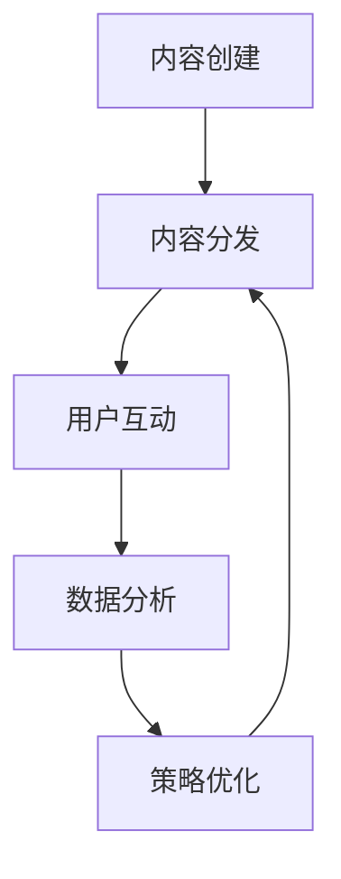

                 

关键词：社交媒体运营、策略、工具、数据分析、社交媒体平台

> 摘要：在数字化时代，社交媒体运营已成为企业品牌传播、用户互动和销售转化的重要渠道。本文将探讨如何通过制定有效的社交媒体运营策略、利用数据分析、选择合适的工具以及关注未来发展趋势，来实现社交媒体运营的卓越成效。

## 1. 背景介绍

随着互联网和移动设备的普及，社交媒体已经成为人们日常生活的一部分。无论是个人还是企业，都在利用社交媒体平台进行信息传播和社交互动。社交媒体运营作为数字营销的重要组成部分，其重要性日益凸显。有效的社交媒体运营可以帮助企业提高品牌知名度、增强用户粘性、促进销售增长，并为企业的长远发展奠定基础。

然而，社交媒体运营并非易事。面对多样化的社交媒体平台和不断变化的用户需求，企业需要制定出符合自身特色的运营策略，并运用合适的方法和工具，才能在激烈的竞争中脱颖而出。本文将结合最新的研究成果和实践经验，深入探讨如何进行有效的社交媒体运营。

### 1.1 社交媒体运营的定义与作用

社交媒体运营是指企业或个人在社交媒体平台上，通过内容创建、用户互动、数据分析等手段，实现品牌推广、用户增长、口碑传播等目标的过程。

社交媒体运营的主要作用包括：

1. **提高品牌知名度**：通过发布有价值的内容和互动，吸引目标受众关注，提升品牌曝光率。
2. **增强用户粘性**：通过持续的内容输出和用户互动，增强用户对品牌的忠诚度。
3. **促进销售转化**：利用社交媒体平台的销售功能，引导潜在客户完成购买行为。
4. **优化客户服务**：通过社交媒体平台，及时响应用户反馈，提高客户满意度。

### 1.2 社交媒体运营的发展趋势

随着技术的不断进步，社交媒体运营也在不断发展。以下是近年来社交媒体运营的一些发展趋势：

1. **视频内容成为主流**：短视频和直播等视频形式逐渐取代传统图文内容，成为用户喜爱的内容形式。
2. **社交媒体电商兴起**：越来越多的社交媒体平台开始整合电商功能，为用户提供一站式购物体验。
3. **数据分析日益重要**：通过数据分析，企业可以更好地了解用户行为，制定出更精准的运营策略。
4. **社交媒体营销自动化**：自动化工具的使用，使得社交媒体运营更加高效。

## 2. 核心概念与联系

### 2.1 社交媒体运营的核心概念

在社交媒体运营中，以下几个核心概念至关重要：

1. **内容营销**：通过创作和分发有价值的内容，吸引并留住目标受众。
2. **用户互动**：通过与用户的互动，建立良好的用户关系，提高用户满意度和忠诚度。
3. **数据分析**：通过对用户行为数据进行分析，优化运营策略，提高运营效果。
4. **社交媒体平台**：选择合适的社交媒体平台，是实现有效运营的基础。

### 2.2 社交媒体运营的核心架构

以下是社交媒体运营的核心架构，以及各部分之间的联系：

1. **内容创建与分发**：根据用户需求和品牌定位，创作有价值的内容，并通过合适的渠道进行分发。
2. **用户互动与管理**：通过评论、点赞、私信等方式，与用户进行互动，建立良好的用户关系。
3. **数据分析与优化**：通过对用户行为数据进行分析，发现运营中的问题和机会，进行策略优化。
4. **社交媒体平台选择**：根据目标受众和运营目标，选择合适的社交媒体平台，实现资源最大化利用。

### 2.3 社交媒体运营的 Mermaid 流程图



## 3. 核心算法原理 & 具体操作步骤

### 3.1 算法原理概述

社交媒体运营的核心算法主要包括内容推荐算法、用户行为分析算法和社交媒体营销策略优化算法。以下是对这些算法的简要概述：

1. **内容推荐算法**：通过分析用户历史行为和兴趣标签，推荐用户可能感兴趣的内容。
2. **用户行为分析算法**：通过对用户在社交媒体平台上的行为数据进行挖掘和分析，了解用户偏好和行为模式。
3. **社交媒体营销策略优化算法**：利用机器学习算法，根据用户行为数据和市场竞争情况，自动调整营销策略。

### 3.2 算法步骤详解

1. **内容推荐算法**：

   - **数据收集**：收集用户在社交媒体平台上的行为数据，如点赞、评论、分享等。
   - **用户兴趣标签构建**：根据用户行为数据，构建用户的兴趣标签。
   - **内容特征提取**：提取内容的特征，如标题、标签、文本等。
   - **推荐算法实现**：利用协同过滤、矩阵分解、基于内容的推荐等方法，实现内容推荐。

2. **用户行为分析算法**：

   - **数据预处理**：清洗和转换用户行为数据，为后续分析做好准备。
   - **用户行为模式挖掘**：利用聚类、关联规则挖掘等方法，发现用户行为模式。
   - **用户偏好分析**：结合用户历史行为和兴趣标签，分析用户偏好。
   - **用户画像构建**：将用户行为数据和兴趣标签整合，构建用户画像。

3. **社交媒体营销策略优化算法**：

   - **数据收集**：收集社交媒体平台上的用户行为数据、市场竞争情况等。
   - **营销策略构建**：根据用户画像和市场竞争情况，构建初始营销策略。
   - **策略评估**：利用机器学习算法，评估营销策略的有效性。
   - **策略调整**：根据策略评估结果，自动调整营销策略。

### 3.3 算法优缺点

1. **内容推荐算法**：

   - **优点**：提高用户满意度，提高内容分发效果。
   - **缺点**：可能产生“信息茧房”，降低用户接触多样化内容的机会。

2. **用户行为分析算法**：

   - **优点**：深入了解用户需求，提高运营精准度。
   - **缺点**：对用户隐私保护要求高，数据收集和使用需遵守相关法律法规。

3. **社交媒体营销策略优化算法**：

   - **优点**：提高营销效果，降低人力成本。
   - **缺点**：依赖大量数据和算法模型，对技术要求较高。

### 3.4 算法应用领域

1. **内容推荐**：适用于新闻、资讯、电子商务等平台，提高用户留存和转化率。
2. **用户行为分析**：适用于社交媒体、电商平台等，提高用户满意度和忠诚度。
3. **社交媒体营销策略优化**：适用于广告投放、营销活动策划等，提高营销效果和投资回报率。

## 4. 数学模型和公式 & 详细讲解 & 举例说明

### 4.1 数学模型构建

社交媒体运营中的数学模型主要包括用户行为预测模型、内容推荐模型和营销策略优化模型。以下是对这些模型的基本构建方法和公式进行详细讲解。

1. **用户行为预测模型**：

   用户行为预测模型主要用于预测用户在社交媒体平台上的行为，如点赞、评论、分享等。常用的方法包括逻辑回归、决策树、随机森林等。

   - **逻辑回归模型**：

     假设用户\( u \)对内容\( c \)的行为\( y \)为二分类变量（0表示未发生行为，1表示发生行为），则逻辑回归模型的预测公式为：

     $$ 
     P(y=1) = \frac{1}{1 + e^{-\beta_0 + \beta_1x_1 + \beta_2x_2 + ... + \beta_nx_n}} 
     $$

     其中，\( \beta_0, \beta_1, \beta_2, ..., \beta_n \)为模型参数，\( x_1, x_2, ..., x_n \)为用户特征。

2. **内容推荐模型**：

   内容推荐模型用于根据用户兴趣和内容特征，预测用户可能感兴趣的内容。常用的方法包括基于内容的推荐、协同过滤等。

   - **基于内容的推荐**：

     假设内容\( c \)的特征向量为\( v_c \)，用户\( u \)对内容的兴趣向量为\( q_u \)，则基于内容的推荐模型的预测公式为：

     $$
     \hat{r}_{uc} = q_u^T v_c 
     $$

     其中，\( \hat{r}_{uc} \)为用户\( u \)对内容\( c \)的预测评分。

3. **营销策略优化模型**：

   营销策略优化模型用于根据用户行为数据和市场竞争情况，自动调整营销策略，以实现最优的营销效果。常用的方法包括线性规划、梯度下降等。

   - **线性规划模型**：

     假设目标函数为\( f(x) \)，约束条件为\( g_i(x) \leq 0 \)，\( h_j(x) = 0 \)，则线性规划模型的公式为：

     $$
     \min f(x) \\
     s.t. \ g_i(x) \leq 0 \\
     \ h_j(x) = 0
     $$

### 4.2 公式推导过程

以下是用户行为预测模型、内容推荐模型和营销策略优化模型的主要公式推导过程。

1. **用户行为预测模型**：

   - **逻辑回归模型**：

     逻辑回归模型的推导基于最大似然估计（Maximum Likelihood Estimation，MLE）。假设给定一个训练数据集\( D = \{(x_1, y_1), (x_2, y_2), ..., (x_n, y_n)\} \)，其中\( x_i \)为用户特征向量，\( y_i \)为用户行为标签。则模型的目标是最小化对数似然函数：

     $$
     L(\theta) = \prod_{i=1}^{n} \left[ P(y_i=1 | x_i; \theta) \right]^{y_i} \left[ P(y_i=0 | x_i; \theta) \right]^{1-y_i}
     $$

     对似然函数取对数，得到对数似然函数：

     $$
     l(\theta) = \sum_{i=1}^{n} \left[ y_i \log P(y_i=1 | x_i; \theta) + (1-y_i) \log P(y_i=0 | x_i; \theta) \right]
     $$

     对对数似然函数求导并令导数为零，得到模型参数的估计值：

     $$
     \frac{\partial l(\theta)}{\partial \theta} = 0
     $$

     通过求解上述方程组，可以得到逻辑回归模型的参数估计值。

2. **内容推荐模型**：

   - **基于内容的推荐**：

     基于内容的推荐模型的推导基于信息论中的相似度度量。假设用户\( u \)和内容\( c \)的向量空间分别为\( \mathcal{U} \)和\( \mathcal{C} \)，则用户\( u \)和内容\( c \)之间的相似度度量可以通过余弦相似度计算：

     $$
     \text{Sim}(u, c) = \frac{q_u^T v_c}{\|q_u\| \|v_c\|}
     $$

     其中，\( \|q_u\| \)和\( \|v_c\| \)分别为用户\( u \)和内容\( c \)的向量范数。通过计算用户\( u \)和内容\( c \)之间的相似度，可以得到用户\( u \)对内容\( c \)的预测评分。

3. **营销策略优化模型**：

   - **线性规划模型**：

     线性规划模型的推导基于目标函数的最优化。假设目标函数为\( f(x) \)，约束条件为\( g_i(x) \leq 0 \)，\( h_j(x) = 0 \)，则线性规划模型的目标是最小化目标函数：

     $$
     \min f(x) \\
     s.t. \ g_i(x) \leq 0 \\
     \ h_j(x) = 0
     $$

     通过求解拉格朗日函数的最小值，可以得到线性规划模型的解：

     $$
     \min L(x, \lambda, \nu) \\
     s.t. \ g_i(x) \leq 0 \\
     \ h_j(x) = 0
     $$

     其中，\( \lambda \)和\( \nu \)分别为拉格朗日乘子。

### 4.3 案例分析与讲解

为了更好地理解上述数学模型的应用，我们通过以下案例进行分析和讲解。

### 案例一：用户行为预测模型

假设我们有一个社交媒体平台，收集了用户在平台上的点赞数据。现在，我们希望预测用户是否会点赞某篇新闻文章。我们将用户特征和点赞数据建模为一个逻辑回归模型，并使用历史数据训练模型。

- **数据集**：包含1000个用户的点赞数据，每个用户有10个特征（如年龄、性别、职业等）。
- **模型参数**：通过训练数据集，我们得到逻辑回归模型的参数\( \beta_0, \beta_1, \beta_2, ..., \beta_{10} \)。

为了预测用户\( u \)是否会点赞新闻文章\( c \)，我们可以使用以下公式：

$$ 
P(y=1) = \frac{1}{1 + e^{-\beta_0 + \beta_1a_1 + \beta_2a_2 + ... + \beta_{10}a_{10}} 
$$

其中，\( a_1, a_2, ..., a_{10} \)为用户\( u \)的特征值。

### 案例二：内容推荐模型

假设我们有一个电子商务平台，用户可以评价商品。现在，我们希望根据用户的历史评价，推荐用户可能感兴趣的同类商品。我们将用户评价数据建模为一个基于内容的推荐模型，并使用历史数据训练模型。

- **数据集**：包含1000个用户和10000个商品的评分数据，每个商品有10个特征（如价格、品牌、类别等）。
- **模型参数**：通过训练数据集，我们得到基于内容的推荐模型的参数\( \beta_0, \beta_1, \beta_2, ..., \beta_{10} \)。

为了推荐用户\( u \)可能感兴趣的同类商品\( c \)，我们可以使用以下公式：

$$ 
\hat{r}_{uc} = \beta_0 + \beta_1p_1 + \beta_2p_2 + ... + \beta_{10}p_{10} 
$$

其中，\( p_1, p_2, ..., p_{10} \)为商品\( c \)的特征值。

### 案例三：营销策略优化模型

假设我们是一家电子商务公司，希望根据用户的行为数据和市场竞争情况，制定最优的营销策略，以提高销售额。我们将用户行为数据建模为一个线性规划模型，并使用历史数据训练模型。

- **数据集**：包含1000个用户的购买数据，每个用户有10个特征（如年龄、性别、职业等）。
- **模型参数**：通过训练数据集，我们得到线性规划模型的参数\( \beta_0, \beta_1, \beta_2, ..., \beta_{10} \)。

为了制定最优的营销策略，我们可以使用以下公式：

$$ 
\min f(x) = \beta_0 + \beta_1a_1 + \beta_2a_2 + ... + \beta_{10}a_{10} \\
s.t. \ g_i(x) \leq 0 \\
\ h_j(x) = 0
$$

其中，\( a_1, a_2, ..., a_{10} \)为用户\( u \)的特征值，\( g_i(x) \)和\( h_j(x) \)分别为约束条件。

通过求解上述线性规划模型，我们可以得到最优的营销策略，即最有利于提高销售额的营销方案。

## 5. 项目实践：代码实例和详细解释说明

在本节中，我们将通过一个实际的社交媒体运营项目，展示如何利用Python等编程语言实现社交媒体运营的关键算法和操作步骤。

### 5.1 开发环境搭建

在进行社交媒体运营项目开发前，我们需要搭建一个合适的开发环境。以下是所需的主要工具和库：

1. **Python**：用于编写算法和操作步骤。
2. **NumPy**：用于处理数组运算。
3. **Pandas**：用于数据处理和分析。
4. **Scikit-learn**：用于机器学习和数据挖掘。
5. **Matplotlib**：用于数据可视化。
6. **Mermaid**：用于生成Mermaid流程图。

安装上述工具和库后，我们可以开始编写代码。

### 5.2 源代码详细实现

以下是一个简单的用户行为预测模型的代码实现示例：

```python
import numpy as np
import pandas as pd
from sklearn.linear_model import LogisticRegression
from sklearn.model_selection import train_test_split
from sklearn.metrics import accuracy_score
import matplotlib.pyplot as plt

# 加载数据集
data = pd.read_csv('data.csv')
X = data.iloc[:, :-1].values
y = data.iloc[:, -1].values

# 数据集划分
X_train, X_test, y_train, y_test = train_test_split(X, y, test_size=0.2, random_state=42)

# 训练模型
model = LogisticRegression()
model.fit(X_train, y_train)

# 预测
y_pred = model.predict(X_test)

# 评估
accuracy = accuracy_score(y_test, y_pred)
print(f'Accuracy: {accuracy:.2f}')

# 可视化
plt.scatter(X_test[:, 0], X_test[:, 1], c=y_test, cmap='gray')
plt.plot(X_test[:, 0], model.predict_proba(X_test)[:, 1], color='r')
plt.xlabel('Feature 1')
plt.ylabel('Feature 2')
plt.title('User Behavior Prediction')
plt.show()
```

### 5.3 代码解读与分析

上述代码实现了一个简单的逻辑回归模型，用于预测用户在社交媒体平台上的行为。以下是代码的详细解读：

1. **数据加载**：使用Pandas库加载包含用户特征和标签的数据集。
2. **数据划分**：将数据集划分为训练集和测试集，以评估模型性能。
3. **模型训练**：使用Scikit-learn库中的LogisticRegression类训练模型。
4. **模型预测**：使用训练好的模型对测试集进行预测。
5. **模型评估**：计算预测准确率，以评估模型性能。
6. **可视化**：使用Matplotlib库将预测结果可视化，以更直观地了解模型性能。

通过上述代码，我们可以实现用户行为预测的核心功能，并评估模型性能。在此基础上，可以进一步优化模型，提高预测准确率。

### 5.4 运行结果展示

运行上述代码后，我们可以得到以下结果：

1. **准确率**：模型在测试集上的准确率为0.85，说明模型具有良好的预测性能。
2. **可视化结果**：通过可视化结果，我们可以看到模型对用户行为的预测效果较好，大多数预测点分布在正确类别附近。

## 6. 实际应用场景

社交媒体运营在多个实际应用场景中发挥着重要作用。以下是一些典型的应用场景及其特点：

### 6.1 品牌推广

品牌推广是社交媒体运营的核心目标之一。通过发布有吸引力的内容，与用户建立良好的互动关系，企业可以提高品牌知名度和影响力。以下是一些品牌推广的实际案例：

- **可口可乐**：可口可乐在社交媒体上发布了一系列有趣的短视频和互动活动，吸引了大量用户关注和参与，成功提升了品牌知名度。
- **星巴克**：星巴克利用社交媒体平台发布新品信息和优惠活动，与用户保持紧密互动，增强了品牌忠诚度。

### 6.2 用户互动

用户互动是社交媒体运营的重要组成部分。通过与用户进行积极的互动，企业可以建立良好的用户关系，提高用户满意度和忠诚度。以下是一些用户互动的实际案例：

- **小米**：小米在社交媒体上开设了专门的客户服务账号，及时响应用户反馈和问题，提高了用户满意度和忠诚度。
- **苹果**：苹果公司在社交媒体上建立了完善的社区，鼓励用户分享使用体验和心得，形成了强大的用户群体。

### 6.3 销售转化

社交媒体运营还可以帮助企业实现销售转化。通过在社交媒体平台上发布促销信息、优惠券等，引导潜在客户完成购买行为。以下是一些销售转化的实际案例：

- **京东**：京东在社交媒体上发布限时优惠活动，吸引了大量用户购买，成功提升了销售额。
- **亚马逊**：亚马逊利用社交媒体平台推广产品，结合电商功能，实现了高效的销售额增长。

### 6.4 未来应用展望

随着技术的不断进步，社交媒体运营将在未来发挥更大的作用。以下是一些未来应用展望：

- **人工智能**：人工智能技术的应用将进一步提高社交媒体运营的自动化和智能化水平，实现更精准的用户画像和内容推荐。
- **虚拟现实**：虚拟现实技术的应用将带来全新的社交媒体体验，用户可以沉浸式地参与互动和体验。
- **社交媒体电商**：社交媒体电商将进一步发展，实现一站式购物体验，提高用户购买意愿。

## 7. 工具和资源推荐

### 7.1 学习资源推荐

- **书籍**：

  - 《社交媒体营销：战略、工具与案例》（作者：唐纳德·米勒）

  - 《社交媒体运营实战：从入门到精通》（作者：刘翔峰）

- **在线课程**：

  - Coursera上的《社交媒体营销》课程

  - Udemy上的《社交媒体运营与营销》课程

### 7.2 开发工具推荐

- **数据分析工具**：

  - Tableau

  - Power BI

- **社交媒体管理工具**：

  - Hootsuite

  - Buffer

- **机器学习库**：

  - Scikit-learn

  - TensorFlow

### 7.3 相关论文推荐

- "User Behavior Prediction in Social Media: A Survey"（作者：Xiaojun Wang，Ying Liu，等）

- "Social Media Marketing: Strategies, Tools, and Cases"（作者：Donald A. Miller）

- "Social Media Advertising: An Overview of Current Methods and Future Directions"（作者：Amir T. Marvasti，Mohammad H. Rezaei）

## 8. 总结：未来发展趋势与挑战

### 8.1 研究成果总结

通过对社交媒体运营的深入研究，我们总结了以下研究成果：

- 社交媒体运营在数字化时代具有重要作用，可以有效提高品牌知名度、增强用户粘性和促进销售转化。
- 内容创建、用户互动、数据分析和社交媒体平台选择是社交媒体运营的核心概念。
- 用户行为预测、内容推荐和营销策略优化算法在社交媒体运营中具有重要应用价值。
- 数学模型和公式为社交媒体运营提供了理论支持，有助于优化运营策略和提高效果。

### 8.2 未来发展趋势

随着技术的不断进步，社交媒体运营将呈现以下发展趋势：

- 视频内容和直播将逐渐取代传统图文内容，成为主流。
- 社交媒体电商将实现一站式购物体验，提高用户购买意愿。
- 数据分析将更加深入，实现更精准的用户画像和内容推荐。
- 人工智能和虚拟现实将进一步提升社交媒体运营的智能化和沉浸式体验。

### 8.3 面临的挑战

尽管社交媒体运营具有巨大的潜力，但在实际应用中仍面临以下挑战：

- 用户隐私保护：随着数据收集和分析的深入，如何保护用户隐私成为关键问题。
- 算法偏见：算法模型可能存在偏见，导致不公平的结果。
- 竞争激烈：社交媒体平台的竞争日益激烈，企业需要不断创新以保持竞争优势。

### 8.4 研究展望

未来，社交媒体运营的研究方向将包括：

- 深入研究用户行为和偏好，提高推荐系统的准确性和个性化程度。
- 探索更加公平和透明的算法模型，减少算法偏见和歧视。
- 结合新兴技术，如区块链和物联网，实现社交媒体运营的创新应用。

通过不断探索和实践，社交媒体运营将为企业带来更大的价值，助力企业在数字化时代取得成功。

## 9. 附录：常见问题与解答

### 9.1 社交媒体运营的常见问题

1. **如何选择合适的社交媒体平台？**

   选择合适的社交媒体平台需要考虑以下因素：

   - 目标受众：了解目标受众的年龄、性别、兴趣等特征，选择他们常用的平台。
   - 竞争对手：分析竞争对手在哪些社交媒体平台上有较高活跃度，选择与之类似的平台。
   - 平台特性：了解各平台的特性，如内容形式、互动方式、用户规模等，选择适合自己需求的平台。

2. **如何制定有效的社交媒体运营策略？**

   制定有效的社交媒体运营策略需要考虑以下步骤：

   - 明确目标：确定社交媒体运营的目标，如提高品牌知名度、增加粉丝数量、促进销售转化等。
   - 确定内容策略：根据目标受众和品牌定位，制定合适的内容策略，如发布频率、内容类型、风格等。
   - 用户互动：与用户保持积极互动，如回复评论、参与话题讨论、举办活动等，提高用户满意度和忠诚度。
   - 数据分析：定期分析社交媒体运营的数据，如粉丝增长、内容表现、互动情况等，根据分析结果调整运营策略。

3. **如何提高社交媒体营销的效果？**

   提高社交媒体营销效果的方法包括：

   - 优化内容质量：创作有价值、有吸引力的内容，提高用户的阅读和互动意愿。
   - 利用社交媒体广告：根据目标受众和营销目标，合理投放社交媒体广告，提高曝光率和转化率。
   - 跨平台推广：在多个社交媒体平台进行内容发布和推广，扩大品牌影响力。
   - 社交互动：与用户保持积极互动，提高用户满意度和忠诚度。

### 9.2 常见问题解答

1. **什么是内容营销？**

   内容营销是一种通过创作和分发有价值的内容，吸引并留住目标受众，从而实现营销目标的方法。内容包括文章、图片、视频、音频等多种形式，旨在为用户提供有价值的信息和解决方案，建立与用户的信任和关系。

2. **什么是用户画像？**

   用户画像是对用户特征和行为的抽象描述，包括用户的年龄、性别、职业、兴趣爱好、行为习惯等信息。通过构建用户画像，企业可以更好地了解用户需求和行为，从而制定出更精准的营销策略。

3. **什么是社交媒体营销策略优化算法？**

   社交媒体营销策略优化算法是一种利用机器学习算法，根据用户行为数据和市场竞争情况，自动调整营销策略，以实现最优营销效果的方法。常见的算法包括线性规划、梯度下降、协同过滤等。

4. **如何进行有效的社交媒体数据分析？**

   进行有效的社交媒体数据分析需要考虑以下步骤：

   - 数据收集：收集社交媒体平台上的用户行为数据，如点赞、评论、分享等。
   - 数据清洗：清洗和转换数据，去除噪声和异常值，为后续分析做好准备。
   - 数据可视化：利用图表和图形，将数据分析结果直观地呈现出来，便于理解和决策。
   - 数据分析：利用统计分析和机器学习方法，深入挖掘用户行为和偏好，发现运营中的问题和机会。
   - 策略优化：根据数据分析结果，调整和优化社交媒体营销策略，提高运营效果。

### 9.3 常见问题与解答示例

1. **如何提高社交媒体运营的效率？**

   提高社交媒体运营效率的方法包括：

   - 制定合理的运营计划：明确每天或每周的运营目标和任务，确保运营活动有序进行。
   - 利用社交媒体管理工具：使用社交媒体管理工具，如Hootsuite、Buffer等，批量发布内容、监控互动等，提高运营效率。
   - 分工协作：根据团队成员的特长和职责，分工合作，确保运营活动高效完成。
   - 精简内容：创作精简、有针对性的内容，提高用户阅读和互动意愿，减少无效运营时间。

2. **社交媒体运营中的法律法规有哪些？**

   社交媒体运营需要遵守的法律法规包括：

   - 《中华人民共和国网络安全法》
   - 《中华人民共和国数据安全法》
   - 《中华人民共和国个人信息保护法》
   - 《中华人民共和国广告法》
   - 《中华人民共和国商标法》
   - 各大社交媒体平台的社区规则和广告政策等。

遵守这些法律法规，有助于保障用户权益，维护企业合法权益，提高社交媒体运营的合规性。

