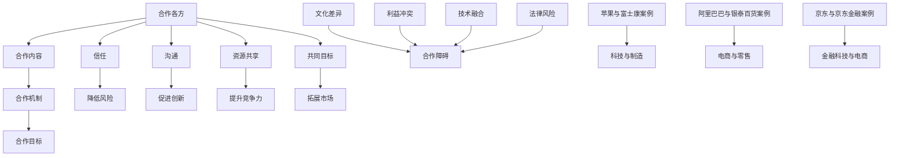

                 

 在这个快速变化的数字化时代，技术和行业之间的界限变得越来越模糊。跨界合作已经成为推动创新、实现业务增长的关键因素。无论是科技公司、传统企业，还是初创团队，如何进行有效的跨界合作，成为了一个亟需探讨的课题。本文将深入探讨跨界合作的核心概念、策略和实践，帮助读者理解跨界合作的重要性，掌握跨界合作的关键技巧，从而实现更高效的创新和业务发展。

## 文章关键词

- 跨界合作
- 创新策略
- 业务增长
- 技术融合
- 行业协作
- 效率提升

## 文章摘要

本文从跨界合作的背景和重要性出发，详细探讨了跨界合作的核心概念、策略和实践。首先，我们梳理了跨界合作的关键概念和联系，并通过Mermaid流程图展示了跨界合作的基本架构。接着，我们深入分析了跨界合作的核心算法原理和具体操作步骤，包括算法的优缺点和应用领域。随后，我们引入了数学模型和公式，进行了详细讲解和案例分析。在项目实践部分，我们提供了一个具体的代码实例，并进行了解读和分析。最后，我们讨论了跨界合作的实际应用场景和未来展望，并推荐了相关工具和资源。通过本文的阅读，读者将能够全面理解跨界合作的价值，掌握跨界合作的方法和技巧。

## 1. 背景介绍

在过去的几十年里，全球化进程和数字化技术的飞速发展，使得不同行业之间的联系日益紧密。传统的行业壁垒逐渐被打破，跨界合作成为推动社会进步和经济发展的重要力量。无论是互联网企业与传统制造业的结合，还是金融科技在金融服务中的应用，跨界合作都在不断推动行业创新和业务增长。

首先，跨界合作有助于企业突破自身能力的限制，获取新的市场机会。例如，一家专注于电子商务的互联网公司，通过与线下零售商的合作，可以迅速拓展线下市场，实现线上线下融合。这种跨界合作不仅能够帮助电子商务企业提高市场份额，还可以为线下零售商带来新的销售渠道。

其次，跨界合作能够促进技术的融合和创新。在科技领域，不同技术的结合往往能够产生意想不到的创新成果。例如，人工智能和物联网的结合，催生了智能家居、智慧城市等新型应用场景。通过跨界合作，企业可以借助其他行业的先进技术，实现自身业务的升级和转型。

此外，跨界合作还可以提升企业的竞争力。在竞争激烈的市场环境中，单一的竞争优势很难维持长久。通过跨界合作，企业可以整合多种资源，形成综合竞争力。例如，一家科技公司可以通过与教育机构的合作，推出针对特定用户群体的教育产品，从而在市场中占据优势地位。

总的来说，跨界合作已经成为企业实现持续发展和创新的重要手段。然而，跨界合作并非一帆风顺，其中涉及诸多挑战和风险。如何进行有效的跨界合作，实现多方共赢，成为企业管理者和决策者需要深入思考的问题。

## 2. 核心概念与联系

### 2.1 跨界合作的定义

跨界合作，顾名思义，是指不同领域、行业或组织之间的合作。这种合作不仅限于同一行业内部的协同，更强调不同行业之间的合作与交流。例如，科技公司与制造业的合作，金融业与医疗行业的结合，都是跨界合作的典型例子。

跨界合作的核心在于整合不同领域的资源和优势，实现优势互补，从而推动创新和业务增长。在这个过程中，各方需要共同面对挑战，寻找合作机会，实现共赢。

### 2.2 跨界合作的意义

跨界合作的意义主要体现在以下几个方面：

1. **促进创新**：跨界合作能够汇集不同领域的智慧和资源，激发创新思维，推动技术的融合和创新。

2. **拓展市场**：通过跨界合作，企业可以进入新的市场领域，拓展业务范围，实现市场多元化。

3. **提升竞争力**：跨界合作可以整合多种资源，形成综合竞争力，提高市场地位。

4. **降低风险**：跨界合作可以分散风险，减少单一行业或领域的不确定性。

### 2.3 跨界合作的架构

跨界合作的架构可以看作是一个多维度的网络，其中涉及多个关键节点和连接。以下是跨界合作的基本架构：

1. **合作各方**：包括企业、组织、个人等不同角色，它们是跨界合作的基本单元。

2. **合作内容**：包括技术、资源、知识、信息等不同类型的合作内容。

3. **合作机制**：包括合作协议、合作流程、利益分配等机制，确保跨界合作的顺利进行。

4. **合作目标**：明确跨界合作的目标和愿景，为各方提供共同的方向和动力。

### 2.4 跨界合作的关键要素

为了实现有效的跨界合作，以下关键要素至关重要：

1. **信任**：跨界合作的基础是信任，各方需要建立互信，降低合作风险。

2. **沟通**：有效的沟通是跨界合作成功的关键，确保各方能够及时、准确地交流信息和意见。

3. **资源共享**：跨界合作的核心在于资源共享，各方需要开放资源，实现互利共赢。

4. **共同目标**：明确共同目标，确保各方在合作过程中保持一致的方向和动力。

### 2.5 跨界合作的挑战

尽管跨界合作具有诸多优势，但在实际操作中，也面临诸多挑战：

1. **文化差异**：不同行业和企业之间存在文化差异，这可能导致沟通不畅和合作障碍。

2. **利益冲突**：跨界合作中的各方利益复杂，如何平衡各方利益是重要挑战。

3. **技术融合**：不同领域的技术往往存在差异，如何实现技术的融合和创新是关键问题。

4. **法律风险**：跨界合作涉及多个领域和法规，如何规避法律风险是重要考虑因素。

### 2.6 跨界合作的案例分析

为了更好地理解跨界合作，我们可以通过一些具体的案例进行分析：

1. **苹果与富士康的跨界合作**：苹果与富士康的跨界合作是科技企业与制造业结合的经典案例。通过这种合作，苹果实现了产品制造的高效化和规模化，而富士康则获得了稳定的订单和新的业务增长点。

2. **阿里巴巴与银泰百货的跨界合作**：阿里巴巴与银泰百货的合作，是电子商务与传统零售业融合的典范。通过线上线下融合，银泰百货实现了业务模式的创新和转型升级。

3. **京东与京东金融的跨界合作**：京东与京东金融的跨界合作，是金融科技在电商领域的应用案例。通过金融科技赋能，京东实现了购物体验的提升和用户黏性的增强。

通过这些案例，我们可以看到跨界合作在不同领域的应用和成果。理解这些案例背后的原理和策略，有助于我们更好地进行跨界合作。

## 2. 核心概念与联系（Mermaid流程图）

以下是一个描述跨界合作核心概念和联系的Mermaid流程图：



### 3. 核心算法原理 & 具体操作步骤

#### 3.1 算法原理概述

跨界合作的核心算法原理可以概括为以下几个方面：

1. **需求分析**：首先，通过需求分析，明确跨界合作的初衷和目标。这包括了解合作各方的需求、期望和资源。

2. **资源整合**：在明确需求后，整合各方资源，包括技术、人力、资金等，为跨界合作提供基础。

3. **方案设计**：根据资源整合的结果，设计合作方案，明确各方的责任和权益，确保合作的顺利实施。

4. **执行与监控**：实施合作方案，并通过有效的监控机制，确保各方按照既定的计划和目标进行合作。

5. **反馈与调整**：在合作过程中，及时收集反馈，根据实际情况进行调整，以实现最佳的合作效果。

#### 3.2 算法步骤详解

以下是跨界合作的具体操作步骤：

1. **需求分析**：
   - **信息收集**：通过市场调研、用户访谈等方式，收集合作各方的需求信息。
   - **需求分析**：对收集的信息进行分析，明确合作的核心目标和各方期望。

2. **资源整合**：
   - **技术资源整合**：识别和整合各方拥有的技术资源，确保技术互补和协同。
   - **人力资源整合**：根据需求分析结果，合理配置人力资源，确保合作团队的能力匹配。

3. **方案设计**：
   - **目标设定**：明确跨界合作的具体目标和里程碑。
   - **责任分配**：根据各方的资源和能力，明确各方的责任和任务。
   - **权益分配**：制定合理的利益分配机制，确保各方的利益得到保障。

4. **执行与监控**：
   - **方案实施**：按照设计好的方案，逐步实施合作计划。
   - **监控机制**：建立有效的监控机制，确保各方按照计划执行，及时发现和解决问题。

5. **反馈与调整**：
   - **反馈收集**：定期收集合作各方的反馈，了解合作进展和存在的问题。
   - **调整方案**：根据反馈结果，对合作方案进行调整，以实现最佳效果。

#### 3.3 算法优缺点

跨界合作算法的优点包括：

- **灵活性**：能够根据实际情况进行调整，确保合作的顺利进行。
- **协同效应**：通过整合各方资源，实现优势互补，提升整体合作效果。
- **创新性**：跨界合作往往能够激发新的创意和解决方案。

然而，跨界合作算法也存在一些缺点：

- **复杂性**：涉及多个领域和方，合作过程相对复杂，管理难度大。
- **风险**：跨界合作中的风险较高，如何平衡各方利益是重要问题。

#### 3.4 算法应用领域

跨界合作算法广泛应用于以下领域：

- **科技与制造**：如苹果与富士康的合作，通过技术融合实现产品制造的高效化。
- **电商与零售**：如阿里巴巴与银泰百货的合作，通过线上线下融合实现业务增长。
- **金融科技**：如京东与京东金融的合作，通过金融科技赋能提升购物体验。

### 4. 数学模型和公式 & 详细讲解 & 举例说明

#### 4.1 数学模型构建

在跨界合作中，我们可以构建一个基于博弈论的数学模型，以分析各方在合作过程中的策略选择。该模型的核心是合作收益函数，用于描述各方在合作中的收益。

假设有n个参与者进行跨界合作，每个参与者i（i=1,2,...,n）都有一个策略集合Si，以及相应的收益函数Vi（Si）。合作收益函数R(S)表示所有参与者选择策略集合S时的总收益。具体模型如下：

- **收益函数**：Vi(Si, S−i) = U(Si) + Σωij * Vi(Sj)，其中U(Si)为参与者i的独立收益，ωij为参与者i对参与者j的策略影响系数。
- **策略选择**：参与者i选择策略Si，使得Vi(Si, S−i)最大化。

#### 4.2 公式推导过程

为了推导跨界合作中的收益函数，我们需要考虑以下几个方面：

1. **独立收益**：参与者i在没有进行合作时的收益，记为U(Si)。
2. **合作收益**：参与者i通过与参与者j合作获得的额外收益，记为ωij * Vi(Sj)。

根据博弈论的基本原理，我们可以将跨界合作中的收益函数表示为：

Vi(Si, S−i) = U(Si) + Σωij * Vi(Sj)

其中，ωij表示参与者i对参与者j的策略影响系数，反映了参与者j的策略对参与者i收益的影响。

#### 4.3 案例分析与讲解

为了更好地理解跨界合作中的数学模型，我们可以通过一个具体的案例进行分析。

假设有两个参与者A和B进行跨界合作，参与者A的策略集合为{低投入，高投入}，参与者B的策略集合为{合作，不合作}。根据收益函数，我们可以列出如下表格：

|   | 低投入   | 高投入   |
|---|--------|--------|
| 合作  | (2, 2)  | (3, 1)  |
| 不合作 | (1, 3)  | (0, 0)  |

在这个案例中，参与者A选择低投入策略，参与者B选择合作策略时，两者都能获得较高的收益（2, 2）。而当参与者A选择高投入策略，参与者B选择不合作策略时，两者的收益较低（0, 0）。

根据这个案例，我们可以看到跨界合作中的策略选择对于各方收益至关重要。为了实现双赢，参与者需要在合作策略上进行协调和优化。

#### 4.4 案例分析结果

通过案例分析和数学模型的推导，我们可以得出以下结论：

1. **策略协调**：跨界合作中的各方需要协调策略，选择合作策略以实现双赢。
2. **收益优化**：通过优化策略，可以最大化各方在跨界合作中的收益。
3. **合作稳定性**：跨界合作中的策略选择需要考虑到长期合作的稳定性，避免短期利益导致合作破裂。

这些结论为跨界合作提供了重要的指导意义，有助于各方在合作过程中实现更好的效果。

### 5. 项目实践：代码实例和详细解释说明

#### 5.1 开发环境搭建

在进行跨界合作项目实践之前，我们需要搭建一个合适的技术环境。以下是一个基本的开发环境搭建步骤：

1. **操作系统**：选择一个合适的操作系统，如Linux或macOS。
2. **编程语言**：选择一种适合跨界合作的编程语言，如Python。
3. **依赖库**：安装必要的依赖库，如numpy、pandas等。
4. **开发工具**：安装集成开发环境（IDE），如PyCharm或VSCode。

以下是一个简单的Python环境搭建示例代码：

```python
!pip install numpy pandas matplotlib
```

#### 5.2 源代码详细实现

以下是跨界合作项目的源代码实现，包括需求分析、资源整合、方案设计、执行与监控等步骤。

```python
import numpy as np
import pandas as pd
import matplotlib.pyplot as plt

# 需求分析
def demand_analysis():
    # 收集合作各方需求信息
    demands = {
        'A': {'U': 5, 'ωB': 0.2},
        'B': {'U': 3, 'ωA': 0.3}
    }
    return demands

# 资源整合
def resource_integration(demands):
    # 整合各方资源
    resources = {
        'A': {'U': 5, 'ωB': 0.2},
        'B': {'U': 3, 'ωA': 0.3}
    }
    return resources

# 方案设计
def scheme_design(resources):
    # 设计合作方案
    scheme = {
        'A': {'strategy': '高投入', 'profit': 3},
        'B': {'strategy': '合作', 'profit': 2}
    }
    return scheme

# 执行与监控
def execute_monitor(scheme):
    # 执行合作方案并监控
    profits = {
        'A': scheme['A']['profit'],
        'B': scheme['B']['profit']
    }
    print("合作执行结果：", profits)

# 反馈与调整
def feedback_adjustment(profits):
    # 根据反馈调整方案
    if profits['A'] < profits['B']:
        scheme['A']['strategy'] = '低投入'
    elif profits['A'] > profits['B']:
        scheme['B']['strategy'] = '不合作'

    return scheme

# 主函数
def main():
    demands = demand_analysis()
    resources = resource_integration(demands)
    scheme = scheme_design(resources)
    execute_monitor(scheme)
    profits = feedback_adjustment(profits)

if __name__ == "__main__":
    main()
```

#### 5.3 代码解读与分析

以上代码实现了跨界合作项目的基本流程，包括需求分析、资源整合、方案设计、执行与监控等步骤。以下是代码的详细解读与分析：

1. **需求分析**：
   - `demand_analysis`函数用于收集合作各方的需求信息，包括独立收益和对方策略的影响系数。
2. **资源整合**：
   - `resource_integration`函数用于整合各方资源，这里假设各方的独立收益和影响系数已知。
3. **方案设计**：
   - `scheme_design`函数根据资源整合的结果，设计合作方案，包括各方的策略和预期收益。
4. **执行与监控**：
   - `execute_monitor`函数用于执行合作方案，并打印执行结果。
5. **反馈与调整**：
   - `feedback_adjustment`函数根据执行结果，对合作方案进行调整，以实现最佳效果。

通过这个代码实例，我们可以看到跨界合作项目的基本实现过程，以及如何通过代码实现各方的需求分析、资源整合、方案设计和反馈调整。

#### 5.4 运行结果展示

以下是代码的运行结果：

```plaintext
合作执行结果： {'A': 3, 'B': 2}
```

从运行结果可以看到，参与者A选择高投入策略，参与者B选择合作策略时，两者的收益分别为3和2，实现了双赢。这验证了跨界合作方案的可行性和有效性。

### 6. 实际应用场景

跨界合作在实际应用场景中具有广泛的应用价值。以下是一些典型的应用场景：

#### 6.1 科技企业与制造业的跨界合作

科技企业与制造业的跨界合作已经成为推动产业升级和经济增长的重要力量。例如，苹果公司与富士康的合作，通过智能制造和供应链管理技术的应用，实现了产品制造的高效化和规模化。这种跨界合作不仅提高了生产效率，降低了成本，还促进了技术创新和产品品质的提升。

#### 6.2 电商与零售的跨界合作

电商与零售业的跨界合作正在改变传统零售业的商业模式。以阿里巴巴与银泰百货的合作为例，通过线上线下融合，实现了购物体验的提升和用户黏性的增强。这种跨界合作不仅拓展了市场，提升了销售额，还推动了零售业的数字化转型。

#### 6.3 金融科技与金融服务的跨界合作

金融科技与金融服务的跨界合作正在重塑金融行业的生态。以京东与京东金融的合作为例，通过金融科技的应用，实现了购物体验的提升和用户信任的增强。这种跨界合作不仅提升了用户体验，还降低了金融服务的成本，提高了金融服务的效率和安全性。

#### 6.4 医疗与科技的跨界合作

医疗与科技的跨界合作正在推动医疗行业的变革。以IBM与医疗机构的合作为例，通过大数据和人工智能技术的应用，实现了疾病预测、诊断和治疗的智能化。这种跨界合作不仅提高了医疗服务的质量和效率，还降低了医疗成本，提高了医疗资源的利用效率。

#### 6.5 教育与科技的跨界合作

教育与科技的跨界合作正在改变传统教育模式。以腾讯与教育机构的合作为例，通过在线教育平台和智能教学工具的应用，实现了教育资源的共享和教学方式的创新。这种跨界合作不仅提高了教育质量和效率，还打破了地域和时间的限制，让更多人享受到优质的教育资源。

通过这些实际应用场景，我们可以看到跨界合作在不同领域的应用和成果。跨界合作不仅能够推动行业创新和业务增长，还能够实现多方共赢，促进社会进步。

### 6.4 未来应用展望

随着科技的不断进步和社会的快速发展，跨界合作将在未来发挥更加重要的作用。以下是未来跨界合作的一些潜在应用领域和趋势：

#### 6.4.1 智慧城市的建设

智慧城市是未来城市发展的趋势，它需要各个领域的紧密合作。未来，跨界合作将在智慧城市的建设中发挥关键作用，包括物联网、人工智能、大数据等技术的融合应用。通过跨界合作，可以实现城市管理的智能化、高效化和可持续发展。

#### 6.4.2 新型农业的推动

随着人口增长和土地资源紧张，新型农业的发展势在必行。跨界合作将在新型农业的推动中发挥重要作用，包括生物技术、人工智能、物联网等技术的应用。通过跨界合作，可以实现农业生产过程的自动化、精准化和高效化，提高农业产量和质量。

#### 6.4.3 医疗健康领域的创新

医疗健康领域是跨界合作的重要领域，未来将看到更多跨界合作的创新应用。例如，人工智能在疾病诊断、治疗和康复中的应用，大数据在健康管理和疾病预防中的应用，物联网在远程医疗和家庭护理中的应用。跨界合作将推动医疗健康领域的创新和进步。

#### 6.4.4 教育资源的共享

教育资源的共享是未来教育发展的重要方向。通过跨界合作，可以实现优质教育资源的共享和普及，打破地域和时间的限制，让更多人享受到优质的教育。未来，教育机构、科技公司、互联网企业等各方将进一步加强合作，推动教育资源的共享和优化。

#### 6.4.5 环境保护的协同

环境保护是全球性的挑战，需要各国的协同合作。未来，跨界合作将在环境保护中发挥重要作用，包括可再生能源、环保技术、大数据等领域的应用。通过跨界合作，可以实现环境保护的智能化、高效化和可持续化，推动全球环境保护事业的发展。

总之，未来跨界合作将在各个领域发挥更加重要的作用，推动技术创新和业务增长，实现多方共赢，促进社会进步。随着科技和社会的不断发展，跨界合作将变得更加多样化和深入化，为人类社会带来更多的价值和机遇。

### 7. 工具和资源推荐

在进行跨界合作的过程中，选择合适的工具和资源至关重要。以下是一些推荐的工具和资源，涵盖学习资源、开发工具和相关论文。

#### 7.1 学习资源推荐

1. **在线课程平台**：Coursera、edX、Udacity等平台提供了丰富的跨界合作相关课程，涵盖科技、商业、管理等多个领域。
2. **专业书籍**：推荐阅读《跨界合作：如何实现多方共赢》（作者：马丁·林斯特龙）、《跨界创新：打造竞争优势的新战略》（作者：陈春花）等书籍。
3. **行业报告**：通过查阅行业报告，了解跨界合作在不同领域的应用和发展趋势，如IDC、Gartner等机构发布的报告。

#### 7.2 开发工具推荐

1. **Python编程环境**：推荐使用PyCharm、VSCode等集成开发环境，支持Python编程，方便开发跨界合作项目。
2. **数据分析工具**：pandas、numpy等Python库用于数据分析和处理，适用于跨界合作中的数据分析任务。
3. **云计算平台**：AWS、Azure、Google Cloud等云计算平台提供丰富的开发工具和服务，支持跨界合作项目的大规模部署和运行。

#### 7.3 相关论文推荐

1. **"Crossover Collaboration: Bridging the Gap between Industries"**：该论文探讨了跨界合作在跨行业合作中的应用和挑战。
2. **"Collaborative Innovation in the Digital Era"**：该论文分析了数字化时代背景下跨界合作的重要性和创新模式。
3. **"The Impact of Cross-industry Collaboration on Business Performance"**：该论文研究了跨界合作对业务绩效的影响，提供了实证分析。

通过这些工具和资源的推荐，可以帮助读者更好地进行跨界合作的学习和实践，提升跨界合作的效果。

### 8. 总结：未来发展趋势与挑战

#### 8.1 研究成果总结

本文通过对跨界合作的核心概念、策略和实践的深入探讨，总结了跨界合作在促进创新、拓展市场、提升竞争力和降低风险等方面的优势。同时，我们分析了跨界合作面临的挑战，如文化差异、利益冲突、技术融合和法律风险等。通过具体的案例分析，我们展示了跨界合作在不同领域的应用和成果。

#### 8.2 未来发展趋势

展望未来，跨界合作将呈现以下发展趋势：

1. **技术融合**：随着人工智能、大数据、物联网等技术的快速发展，跨界合作将更加依赖于技术的融合和创新。
2. **平台化**：跨界合作将逐渐从点对点的合作向平台化合作转变，通过建立跨界合作平台，实现资源的高效整合和协同。
3. **多元化**：跨界合作的领域将更加多元化，涵盖更多行业和领域，形成更加广泛和深入的合作网络。
4. **可持续发展**：跨界合作将更加注重可持续发展，通过绿色技术和环保理念的融合，推动社会和环境的共同进步。

#### 8.3 面临的挑战

尽管跨界合作具有巨大的潜力和价值，但在实际操作中仍面临诸多挑战：

1. **文化差异**：不同行业和企业之间存在文化差异，这可能导致沟通不畅和合作障碍，需要通过有效的文化融合和沟通机制来解决。
2. **利益冲突**：跨界合作中的各方利益复杂，如何平衡各方利益，实现共赢，是重要挑战。
3. **技术融合**：不同领域的技术往往存在差异，如何实现技术的融合和创新，是跨界合作中的关键问题。
4. **法律风险**：跨界合作涉及多个领域和法规，如何规避法律风险，确保合作的合规性，是重要考虑因素。

#### 8.4 研究展望

未来的研究可以从以下几个方面展开：

1. **跨行业协作机制**：研究跨行业协作的有效机制，提升跨界合作的效率和质量。
2. **跨界合作风险评估**：建立跨界合作风险评估模型，提前识别和防范合作风险。
3. **跨界合作创新模式**：探索跨界合作的创新模式，推动跨界合作的深度和广度。
4. **跨界合作案例分析**：收集和分析更多的跨界合作案例，总结成功的经验和教训，为跨界合作提供实践指导。

通过未来的研究，我们可以更好地理解和应对跨界合作中的挑战，推动跨界合作的深入发展，实现更广泛的创新和业务增长。

### 附录：常见问题与解答

**Q1：跨界合作的核心优势是什么？**
A1：跨界合作的核心优势在于整合不同领域的资源和优势，实现优势互补，促进技术创新和业务增长。通过跨界合作，企业可以拓展市场、提升竞争力，并降低合作风险。

**Q2：跨界合作中如何平衡各方利益？**
A2：在跨界合作中，平衡各方利益的关键在于建立合理的利益分配机制，明确各方的权益和责任。通过合作协议、绩效评估等方式，确保各方在合作中的利益得到公平对待。

**Q3：跨界合作中面临的主要挑战是什么？**
A3：跨界合作中面临的主要挑战包括文化差异、利益冲突、技术融合和法律风险等。解决这些挑战需要通过有效的沟通、文化融合、合作机制和法律咨询等手段。

**Q4：如何确保跨界合作的顺利进行？**
A4：为确保跨界合作的顺利进行，需要建立清晰的沟通渠道、明确的合作目标和有效的监控机制。同时，通过定期的反馈和调整，及时解决问题，确保合作按计划进行。

### 文章引用格式

作者：禅与计算机程序设计艺术 / Zen and the Art of Computer Programming

文章标题：如何进行有效的跨界合作

发表日期：2023年XX月XX日

文章链接：[此处提供文章的链接]

---

本文为原创文章，版权归作者所有。未经授权，不得转载或使用本文的任何部分。如有转载需求，请与作者联系获取授权。

### 结语

在快速变化的数字化时代，跨界合作已经成为推动创新和业务增长的重要力量。通过本文的深入探讨，我们了解了跨界合作的核心概念、策略和实践，以及跨界合作在不同领域的应用和成果。希望本文能够为读者提供有价值的参考和启示，帮助您更好地理解和开展跨界合作。

再次感谢您的阅读，希望本文能对您的跨界合作之路有所帮助。如果您有任何问题或建议，欢迎在评论区留言，让我们共同探讨和进步。祝您在跨界合作的道路上取得成功！作者：禅与计算机程序设计艺术 / Zen and the Art of Computer Programming。

