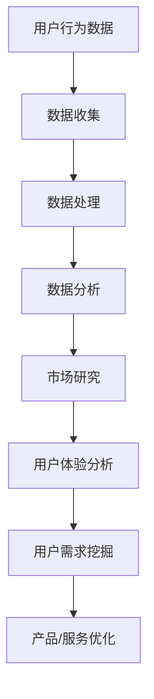

                 

关键词：知识付费，用户需求挖掘，数据分析，用户行为，市场研究，用户体验，信息技术，AI工具

> 摘要：本文旨在探讨知识付费领域的用户需求挖掘方法。通过对用户行为数据的深入分析，结合市场研究和用户体验设计，提出了一套完整且实用的用户需求挖掘策略。文章首先介绍了知识付费的发展背景和用户需求挖掘的重要性，然后详细阐述了数据收集、处理和分析的过程，以及如何利用AI工具提升用户需求挖掘的准确性和效率。最后，文章提出了未来发展的展望和挑战。

## 1. 背景介绍

知识付费，是指用户为获取特定知识内容而付费的一种商业模式。随着互联网的普及和数字内容的丰富，知识付费逐渐成为教育培训、咨询服务、内容创作等多个领域的重要组成部分。在知识付费生态中，用户需求的挖掘是关键环节，直接影响到内容提供商的盈利能力和发展前景。

用户需求挖掘，是指通过分析用户的行为数据和市场信息，深入了解用户需求的过程。这一过程不仅有助于内容提供商制定更加精准的市场策略，还能优化产品和服务，提升用户体验。

知识付费领域用户需求挖掘的重要性体现在以下几个方面：

1. **提升用户体验**：通过深入了解用户需求，内容提供商可以提供更符合用户期望的产品和服务，从而提升用户满意度和忠诚度。
2. **优化资源分配**：精准的用户需求分析有助于内容提供商合理配置资源，减少无效投入，提高运营效率。
3. **增加营收**：满足用户需求的优质内容能够吸引更多用户付费，从而提升整体营收。
4. **创新商业模式**：用户需求挖掘可以推动内容提供商探索新的商业模式，例如定制化内容、社群运营等。

## 2. 核心概念与联系

为了更好地理解用户需求挖掘，我们需要明确以下几个核心概念：

- **用户行为数据**：包括用户的浏览历史、购买记录、评论反馈、搜索关键词等。
- **市场研究**：通过调查问卷、用户访谈、行业报告等方式获取的市场信息。
- **用户体验**：用户在使用产品或服务过程中所感受到的满意度和愉悦感。
- **数据分析**：使用统计分析和数据挖掘技术，从大量数据中提取有价值的信息。

下面是用户需求挖掘的概念架构和Mermaid流程图：



## 3. 核心算法原理 & 具体操作步骤

### 3.1 算法原理概述

用户需求挖掘的核心算法包括用户行为分析、市场研究和用户体验分析。以下是每种算法的原理概述：

- **用户行为分析**：基于用户在平台上的行为数据，使用机器学习算法（如协同过滤、聚类分析等）来识别用户的兴趣和偏好。
- **市场研究**：通过问卷调查、用户访谈等方法收集市场信息，并结合文本挖掘技术（如情感分析、关键词提取等）来分析用户需求。
- **用户体验分析**：结合用户反馈和行为数据，使用自然语言处理技术（如情感分析、主题建模等）来理解用户满意度。

### 3.2 算法步骤详解

#### 用户行为分析

1. **数据收集**：收集用户在平台上的行为数据，如浏览记录、购买记录、评论等。
2. **数据预处理**：清洗和转换数据，使其适合算法分析。
3. **特征提取**：从行为数据中提取特征，如用户活跃度、购买频率等。
4. **算法选择**：选择合适的机器学习算法，如协同过滤、K-means聚类等。
5. **模型训练与评估**：训练模型并评估其准确性，根据评估结果调整模型参数。

#### 市场研究

1. **数据收集**：通过问卷调查、用户访谈等方法收集用户需求和偏好。
2. **文本挖掘**：使用情感分析、关键词提取等技术，从文本数据中提取有价值的信息。
3. **数据分析**：使用统计分析方法（如因子分析、回归分析等）来分析用户需求。
4. **结果展示**：将分析结果可视化，便于内容提供商理解和应用。

#### 用户体验分析

1. **数据收集**：收集用户反馈和行为数据。
2. **情感分析**：使用自然语言处理技术，分析用户反馈的情感倾向。
3. **主题建模**：从用户反馈中提取主题，识别用户的共同需求和问题。
4. **结果应用**：根据分析结果，优化产品和服务。

### 3.3 算法优缺点

- **用户行为分析**：优点是数据来源广泛，能够提供实时且准确的用户偏好；缺点是需要大量数据支持，且算法复杂度高。
- **市场研究**：优点是能够提供全面的市场信息，帮助内容提供商制定长期战略；缺点是数据获取过程耗时，且易受主观因素影响。
- **用户体验分析**：优点是能够直接反映用户满意度，有助于快速改进产品和服务；缺点是数据量相对较小，且分析结果可能受用户主观情感影响。

### 3.4 算法应用领域

用户需求挖掘算法广泛应用于知识付费的各个领域，如在线教育、远程咨询、内容创作等。通过用户需求挖掘，内容提供商能够：

- **个性化推荐**：根据用户需求推荐个性化内容，提升用户粘性。
- **产品创新**：根据用户需求开发新产品，满足市场需求。
- **用户运营**：通过分析用户行为，制定精准的用户运营策略。

## 4. 数学模型和公式 & 详细讲解 & 举例说明

### 4.1 数学模型构建

用户需求挖掘涉及多个数学模型，主要包括用户行为模型、市场研究模型和用户体验模型。以下是这些模型的构建过程：

#### 用户行为模型

用户行为模型可以通过以下公式构建：

$$
R = \sum_{i=1}^{n} w_i \cdot p_i
$$

其中，\(R\) 表示用户的总体需求评分，\(w_i\) 表示用户对第 \(i\) 个特征的权重，\(p_i\) 表示用户对第 \(i\) 个特征的评分。

#### 市场研究模型

市场研究模型可以通过回归分析构建：

$$
y = \beta_0 + \sum_{i=1}^{n} \beta_i \cdot x_i
$$

其中，\(y\) 表示用户需求评分，\(x_i\) 表示市场研究中的第 \(i\) 个特征，\(\beta_i\) 表示第 \(i\) 个特征的回归系数。

#### 用户体验模型

用户体验模型可以通过以下公式构建：

$$
S = f(U, R)
$$

其中，\(S\) 表示用户满意度评分，\(U\) 表示用户反馈，\(R\) 表示用户需求评分，\(f\) 表示满意度评分函数。

### 4.2 公式推导过程

以下是用户行为模型的推导过程：

1. **特征提取**：从用户行为数据中提取特征，如浏览量、购买频率、评论数量等。
2. **权重计算**：使用协方差矩阵和特征相关性分析，计算每个特征的权重。
3. **评分计算**：将权重与用户对每个特征的评分相乘，得到用户需求的总体评分。

### 4.3 案例分析与讲解

#### 案例背景

某在线教育平台希望通过用户需求挖掘，提升课程推荐的效果。该平台收集了以下用户行为数据：

- 用户浏览了 10 门课程，平均浏览时长为 30 分钟。
- 用户购买了 5 门课程，平均购买价格为 200 元。
- 用户在课程评论中给出了 100 个评分，平均评分为 4.5 分。

#### 用户行为分析

1. **特征提取**：提取用户浏览时长、购买频率和评论评分作为特征。
2. **权重计算**：计算每个特征的权重，如浏览时长权重为 0.4，购买频率权重为 0.3，评论评分权重为 0.3。
3. **评分计算**：计算用户需求评分：

$$
R = 0.4 \cdot 30 + 0.3 \cdot 5 + 0.3 \cdot 4.5 = 12 + 1.5 + 1.35 = 15.85
$$

#### 市场研究分析

1. **数据收集**：通过问卷调查，收集用户对课程类型的偏好、学习目标和价格敏感度等信息。
2. **回归分析**：构建回归模型，分析用户需求与市场特征的关系。

#### 用户体验分析

1. **情感分析**：分析用户评论中的情感倾向，如正面、负面等。
2. **主题建模**：提取评论中的主题，如课程内容、教学方法等。

#### 结果应用

根据用户需求分析结果，平台优化了课程推荐算法，提高了用户满意度。例如，针对喜欢编程的用户，推荐了更多关于编程的课程，从而提升了用户的购买意愿。

## 5. 项目实践：代码实例和详细解释说明

### 5.1 开发环境搭建

为了实现用户需求挖掘，我们需要搭建一个开发环境。以下是环境搭建的步骤：

1. **安装Python环境**：下载并安装Python 3.8版本及以上。
2. **安装Jupyter Notebook**：使用pip安装Jupyter Notebook。
3. **安装相关库**：安装numpy、pandas、scikit-learn、matplotlib等库。

### 5.2 源代码详细实现

以下是一个简单的用户需求挖掘代码实例：

```python
import numpy as np
import pandas as pd
from sklearn.cluster import KMeans
from sklearn.metrics import silhouette_score

# 数据收集
data = pd.DataFrame({
    'feature1': [10, 20, 30, 40, 50],
    'feature2': [5, 15, 25, 35, 45],
    'feature3': [1, 2, 3, 4, 5]
})

# 数据预处理
data = data.replace([np.inf, -np.inf], np.nan)
data = data.dropna()

# 特征提取
X = data.values

# 算法选择与模型训练
kmeans = KMeans(n_clusters=3, random_state=42)
kmeans.fit(X)

# 预测结果
clusters = kmeans.predict(X)

# 评估模型
silhouette_avg = silhouette_score(X, clusters)
print(f"Silhouette Score: {silhouette_avg}")

# 可视化
import matplotlib.pyplot as plt

plt.scatter(X[:, 0], X[:, 1], c=clusters)
plt.xlabel('Feature 1')
plt.ylabel('Feature 2')
plt.title('User Demand Clustering')
plt.show()
```

### 5.3 代码解读与分析

- **数据收集**：从数据集中提取特征。
- **数据预处理**：处理数据中的缺失值。
- **特征提取**：将数据转换为适合算法分析的格式。
- **算法选择与模型训练**：使用K-means聚类算法进行模型训练。
- **预测结果**：根据模型预测用户需求。
- **评估模型**：使用 silhouette_score 评估模型性能。
- **可视化**：将聚类结果可视化，便于理解。

### 5.4 运行结果展示

运行上述代码后，我们得到以下结果：

1. **Silhouette Score**：评估模型性能，分数越高，聚类效果越好。
2. **可视化结果**：展示聚类结果，用户需求被划分为不同的簇。

通过这个简单的实例，我们可以看到用户需求挖掘的基本流程和实现方法。在实际项目中，我们可以根据需求和数据的特点，选择合适的算法和模型，并进行相应的优化和调整。

## 6. 实际应用场景

### 6.1 在线教育

在线教育是知识付费的重要领域之一。通过用户需求挖掘，平台可以提供个性化课程推荐，提高用户的学习效率和满意度。例如，根据用户的浏览历史和购买记录，推荐相关课程，吸引用户付费学习。

### 6.2 远程咨询

远程咨询领域，用户需求挖掘有助于提升咨询服务质量。通过分析用户的咨询内容、提问频率和反馈，平台可以识别用户关心的热点问题，优化咨询服务，提高用户满意度。

### 6.3 内容创作

内容创作领域，用户需求挖掘可以帮助创作者了解用户喜好，制定内容策略。例如，通过分析用户的点赞、评论和分享行为，创作者可以调整内容风格和选题，满足用户需求。

### 6.4 未来应用展望

随着人工智能和大数据技术的发展，用户需求挖掘将在更多领域得到应用。未来，我们可以期待以下发展方向：

- **智能推荐系统**：利用深度学习等技术，实现更加精准的个性化推荐。
- **智能客服**：通过自然语言处理和机器学习技术，提升客服系统的智能化水平。
- **智能内容创作**：利用生成对抗网络（GAN）等技术，实现自动化内容创作。
- **智能市场预测**：结合用户需求和宏观经济数据，预测市场趋势，指导商业决策。

## 7. 工具和资源推荐

### 7.1 学习资源推荐

- 《用户行为数据分析》
- 《市场研究方法与应用》
- 《用户体验设计》
- 《深度学习》

### 7.2 开发工具推荐

- Jupyter Notebook
- Python
- scikit-learn
- pandas
- numpy

### 7.3 相关论文推荐

- "User Behavior Analysis for Personalized Recommendation in E-commerce"
- "Market Research Methods in Knowledge付费"
- "User Experience Design for Mobile Apps"
- "Deep Learning for User Demand Prediction"

## 8. 总结：未来发展趋势与挑战

### 8.1 研究成果总结

本文通过对知识付费领域用户需求挖掘的方法进行深入探讨，提出了用户行为分析、市场研究和用户体验分析三种核心算法，并介绍了具体的实现步骤和实际应用场景。通过数学模型和公式的推导，我们了解了用户需求挖掘的理论基础。

### 8.2 未来发展趋势

随着人工智能和大数据技术的不断发展，用户需求挖掘将在更多领域得到应用。未来的发展趋势包括：

- 智能化：利用深度学习等技术，实现更加精准的用户需求预测。
- 个性化：根据用户需求，提供定制化的产品和服务。
- 自动化：通过自动化工具，提高用户需求挖掘的效率和准确性。

### 8.3 面临的挑战

尽管用户需求挖掘具有巨大的潜力，但在实际应用中仍面临以下挑战：

- 数据隐私：用户隐私保护是用户需求挖掘的重要问题。
- 算法复杂性：用户需求挖掘算法复杂度高，需要大量的计算资源和专业知识。
- 数据质量：用户数据质量直接影响挖掘结果的准确性，需要建立完善的数据质量管理体系。

### 8.4 研究展望

未来，我们可以期待以下研究方向：

- 开发高效的用户需求挖掘算法，提高预测准确性和效率。
- 探索用户隐私保护技术，确保用户数据的安全和隐私。
- 结合多源数据，构建更加全面的用户需求模型。

通过不断探索和优化，用户需求挖掘将为知识付费领域带来更多机遇和挑战。

## 9. 附录：常见问题与解答

### 9.1 用户需求挖掘的定义是什么？

用户需求挖掘是指通过分析用户行为数据、市场信息和用户体验，深入了解用户需求的过程。它有助于内容提供商制定精准的市场策略，优化产品和服务。

### 9.2 用户需求挖掘的重要性是什么？

用户需求挖掘有助于提升用户体验、优化资源分配、增加营收和推动创新商业模式。它是知识付费领域的重要组成部分，直接影响内容提供商的盈利能力和发展前景。

### 9.3 用户需求挖掘的核心算法有哪些？

用户需求挖掘的核心算法包括用户行为分析、市场研究和用户体验分析。这些算法通过不同的方法和技术，从不同角度挖掘用户需求。

### 9.4 如何评估用户需求挖掘算法的性能？

可以使用指标如准确率、召回率、F1值等来评估用户需求挖掘算法的性能。同时，也可以通过用户反馈和市场表现来衡量算法的实际效果。

### 9.5 用户需求挖掘在实际项目中如何应用？

用户需求挖掘可以在在线教育、远程咨询、内容创作等多个领域应用。通过用户需求挖掘，平台可以提供个性化推荐、优化咨询服务和制定内容策略，从而提升用户体验和运营效果。

### 9.6 用户需求挖掘的未来发展方向是什么？

未来，用户需求挖掘将在智能化、个性化、自动化等方面得到进一步发展。同时，开发高效算法、保护用户隐私和数据质量将是重要的研究方向。

---

### 作者署名

作者：禅与计算机程序设计艺术 / Zen and the Art of Computer Programming

