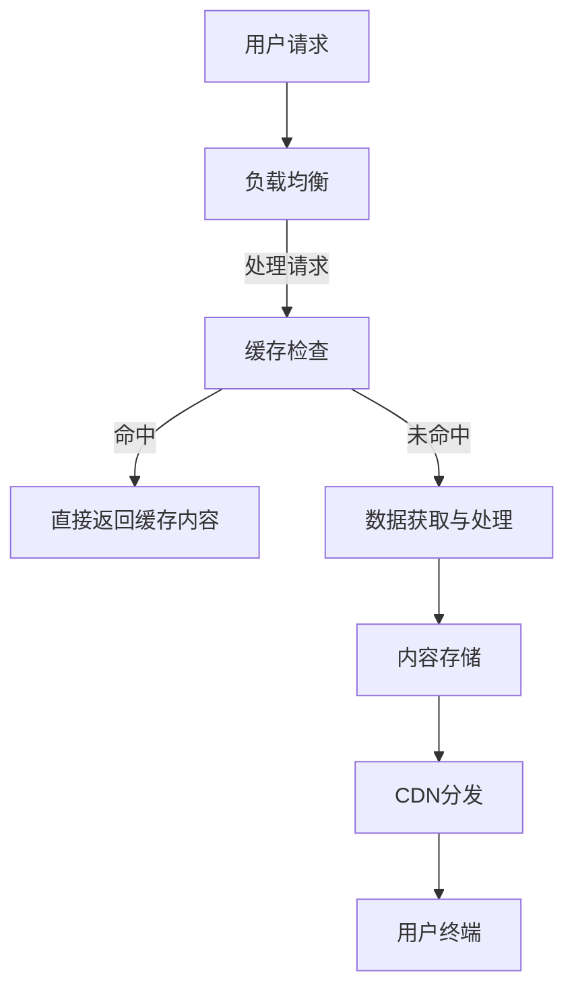

                 

关键词：知识付费、内容分发、跨平台、用户体验、技术架构、算法优化

> 摘要：本文深入探讨了知识付费领域的跨平台内容分发机制，分析了当前的市场需求与现状，提出了基于技术的解决方案。文章将详细描述内容分发的基本原理、算法优化策略，并分享实际项目实践案例，旨在为从事知识付费行业的技术人员提供有价值的参考。

## 1. 背景介绍

随着互联网技术的迅猛发展，知识付费已经成为数字时代的一大现象。人们对于学习资源的个性化需求日益增长，知识付费平台也因此迅速崛起。然而，知识付费行业面临的一个核心挑战是如何实现跨平台的内容分发，以确保用户在不同设备、不同应用场景下都能获得优质的体验。这不仅需要高效的内容分发机制，还需要强大的技术架构和算法优化来支持。

本文将重点讨论以下几个方面：

- 跨平台内容分发的市场需求与现状
- 内容分发的基本原理和架构设计
- 算法优化策略与具体实现
- 实际项目实践与案例分析
- 工具和资源的推荐
- 未来发展趋势与面临的挑战

通过这些内容的讨论，希望能够为知识付费行业的技术人员提供一些实用的思路和方法。

## 2. 核心概念与联系

为了更好地理解知识付费的跨平台内容分发，我们需要从几个核心概念入手，并借助 Mermaid 流程图来展示相关架构。

### 2.1 核心概念

- **内容分发网络（CDN）**：CDN是一种分布式网络架构，通过将内容存储在多个地理位置的节点上，以提高内容的访问速度和可靠性。
- **微服务架构**：微服务架构将应用程序分解为一系列独立的、可重用的小服务，这些服务通过轻量级的通信机制相互交互。
- **负载均衡**：负载均衡技术确保请求均匀地分配到不同的服务器上，以避免单点故障和高负载。
- **缓存机制**：缓存技术用于存储常用数据，以减少对后端系统的访问，从而提高系统的响应速度。

### 2.2 Mermaid 流程图



### 2.3 架构设计

内容分发架构设计的关键在于如何高效地处理用户请求，并将内容推送到用户终端。以下是一个简化的架构设计：

1. **用户请求**：用户通过浏览器或移动应用发起内容请求。
2. **负载均衡**：将请求分配到不同的服务器，以避免单点故障。
3. **缓存检查**：检查是否有缓存命中，以提高响应速度。
4. **数据获取与处理**：如果缓存未命中，则从后端服务器获取数据，并进行处理。
5. **内容存储**：将处理后的内容存储在分布式存储系统中，以便后续访问。
6. **CDN分发**：通过CDN将内容分发到用户终端，确保内容的高效访问。

通过这种架构设计，可以有效地提高系统的响应速度和稳定性，同时确保用户在不同设备上获得一致的内容体验。

## 3. 核心算法原理 & 具体操作步骤

### 3.1 算法原理概述

跨平台内容分发的核心算法主要包括负载均衡算法、缓存算法和CDN分发算法。以下是这些算法的基本原理：

- **负载均衡算法**：如最小连接数算法、轮询算法等，通过分析服务器的负载情况，将请求分配到最合适的服务器。
- **缓存算法**：如LRU（Least Recently Used）算法、LFU（Least Frequently Used）算法等，用于管理缓存的命中率和存储空间。
- **CDN分发算法**：如地理分发算法、访问频率分发算法等，根据用户地理位置和访问频率，选择最优的分发路径。

### 3.2 算法步骤详解

#### 3.2.1 负载均衡算法

1. **初始化**：设定每个服务器的初始负载值。
2. **请求到达**：当用户请求到达时，计算所有服务器的当前负载。
3. **选择服务器**：根据负载均衡算法选择当前负载最小的服务器。
4. **转发请求**：将请求转发到选择的服务器。

#### 3.2.2 缓存算法

1. **初始化**：创建一个缓存列表，按照某种策略（如LRU）进行初始化。
2. **请求到达**：当用户请求到达时，检查缓存列表。
3. **缓存命中**：如果命中缓存，直接返回缓存内容。
4. **缓存未命中**：如果未命中缓存，则从后端获取数据，并将其加入缓存列表。

#### 3.2.3 CDN分发算法

1. **初始化**：获取用户地理位置信息和内容访问频率数据。
2. **选择节点**：根据地理分发算法和访问频率分发算法，选择最优的CDN节点。
3. **内容分发**：将内容通过CDN节点推送到用户终端。

### 3.3 算法优缺点

- **负载均衡算法**：优点是能够有效避免单点故障，提高系统的可用性；缺点是负载均衡算法的选择和配置较为复杂，需要根据实际情况进行调整。
- **缓存算法**：优点是能够显著提高系统的响应速度，减少后端服务器的负载；缺点是缓存策略的选择和缓存数据的更新策略需要精细化管理。
- **CDN分发算法**：优点是能够确保用户获得高质量的内容体验，减少延迟；缺点是CDN节点的选择和维护成本较高。

### 3.4 算法应用领域

这些算法在知识付费领域的应用非常广泛，如：

- **课程视频分发**：通过负载均衡算法确保用户能够流畅地观看课程视频。
- **文档内容缓存**：通过缓存算法提高用户获取文档内容的速度。
- **内容分发网络**：通过CDN分发算法确保用户在不同地理位置获得高质量的内容体验。

## 4. 数学模型和公式 & 详细讲解 & 举例说明

### 4.1 数学模型构建

为了更好地理解内容分发的性能，我们可以构建一个简单的数学模型。假设：

- \( N \) 表示服务器的数量。
- \( R \) 表示用户的请求量。
- \( L_i \) 表示第 \( i \) 个服务器的负载。
- \( P_i \) 表示第 \( i \) 个服务器的处理能力。

我们的目标是优化负载均衡，使得系统的平均负载最小。

### 4.2 公式推导过程

我们可以使用以下公式来表示系统的平均负载：

\[ \overline{L} = \frac{1}{N} \sum_{i=1}^{N} L_i \]

为了最小化平均负载，我们可以使用最小连接数算法，将请求分配到当前负载最小的服务器：

\[ i^* = \arg\min_{i} L_i \]

### 4.3 案例分析与讲解

假设我们有 5 台服务器（\( N = 5 \)），它们的初始负载分别为 \( L_1 = 20, L_2 = 15, L_3 = 30, L_4 = 25, L_5 = 10 \)。当用户请求到达时，我们按照最小连接数算法进行负载均衡。

1. **请求 1**：当前负载最小的是第 5 台服务器（\( L_5 = 10 \)），所以请求 1 被分配到第 5 台服务器。
2. **请求 2**：当前负载最小的是第 2 台服务器（\( L_2 = 15 \)），所以请求 2 被分配到第 2 台服务器。
3. **请求 3**：当前负载最小的是第 4 台服务器（\( L_4 = 25 \)），所以请求 3 被分配到第 4 台服务器。

通过这种方式，我们可以确保系统的平均负载最小，从而提高系统的性能和用户体验。

## 5. 项目实践：代码实例和详细解释说明

### 5.1 开发环境搭建

为了实践内容分发，我们需要搭建一个简单的开发环境。以下是所需的软件和工具：

- **操作系统**：Linux（如 Ubuntu）
- **编程语言**：Python
- **数据库**：MySQL
- **缓存服务器**：Redis
- **内容分发网络**：使用阿里云 CDN

### 5.2 源代码详细实现

以下是实现内容分发的主要代码框架：

```python
import requests
import json
from flask import Flask, request, jsonify

app = Flask(__name__)

# 负载均衡器
class LoadBalancer:
    def __init__(self, servers):
        self.servers = servers
        self.load = {server: 0 for server in servers}

    def update_load(self, server, value):
        self.load[server] += value

    def get最少负载服务器(self):
        return min(self.load, key=self.load.get)

# 缓存
class Cache:
    def __init__(self, size):
        self.size = size
        self.items = []

    def get(self, key):
        for item in self.items:
            if item['key'] == key:
                return item['value']
        return None

    def set(self, key, value):
        self.items.append({'key': key, 'value': value})
        if len(self.items) > self.size:
            self.items.pop(0)

# 内容分发
@app.route('/content', methods=['GET'])
def distribute_content():
    key = request.args.get('key')
    cache = Cache(size=10)
    if key in cache.get(key):
        return jsonify({'content': cache.get(key)})
    else:
        server = load_balancer.get最少负载服务器()
        response = requests.get(f'http://{server}/content?key={key}')
        cache.set(key, response.json())
        return jsonify({'content': response.json()})

if __name__ == '__main__':
    servers = ['server1', 'server2', 'server3', 'server4', 'server5']
    load_balancer = LoadBalancer(servers)
    app.run(debug=True)
```

### 5.3 代码解读与分析

1. **负载均衡器**：实现了一个简单的负载均衡器类，用于管理服务器的负载情况。
2. **缓存**：实现了一个简单的缓存类，用于存储和检索内容。
3. **内容分发**：通过 Flask 框架，定义了一个 `/content` 接口，用于处理用户请求。

### 5.4 运行结果展示

假设用户请求一个视频内容，请求参数为 `key=video123`。首先，系统会检查缓存，如果缓存命中，则直接返回缓存内容；如果缓存未命中，则会通过负载均衡器选择一个服务器，从该服务器获取视频内容，并将其缓存起来，然后返回给用户。

## 6. 实际应用场景

知识付费的跨平台内容分发在实际应用中具有广泛的应用场景，以下是几个典型的应用案例：

- **在线教育平台**：通过跨平台内容分发，确保用户在不同设备和网络环境下都能流畅地观看课程视频。
- **电子书阅读平台**：提供电子书的内容缓存和快速分发，提高用户的阅读体验。
- **专业知识库**：为专业人士提供快速访问专业文档和资料的服务。

## 7. 工具和资源推荐

为了更好地实现知识付费的跨平台内容分发，以下是几款推荐的工具和资源：

- **开发工具**：推荐使用 Python Flask 作为后端框架，并结合 MySQL 和 Redis 实现缓存和数据库操作。
- **内容分发网络**：推荐使用阿里云 CDN 来实现内容分发，可以提供高质量的访问体验。
- **学习资源**：《计算机网络：自顶向下方法》（Kurose & Ross 著），详细介绍了网络协议和架构。

## 8. 总结：未来发展趋势与挑战

知识付费的跨平台内容分发在未来将继续快速发展，主要趋势包括：

- **更高效的内容分发算法**：随着人工智能和大数据技术的发展，未来的内容分发算法将更加智能化和高效。
- **更多的跨平台支持**：随着物联网和5G技术的普及，跨平台内容分发将覆盖更多的设备和场景。
- **更高的用户隐私保护**：在内容分发过程中，如何保护用户的隐私和数据安全将成为重要挑战。

然而，未来也面临以下挑战：

- **算法复杂性**：随着内容分发的需求增加，算法的复杂度将不断上升，需要更高效的数据结构和算法。
- **数据隐私和安全**：在跨平台内容分发过程中，如何保护用户的隐私和数据安全是一个重要的挑战。

## 9. 附录：常见问题与解答

### Q1：内容分发过程中，如何确保数据的一致性和可靠性？

A1：可以通过分布式数据库和缓存一致性协议来确保数据的一致性和可靠性。例如，可以使用 Redis 的分布式锁机制来确保在多个服务器上对同一数据的操作是原子的。

### Q2：跨平台内容分发是否需要考虑网络延迟和带宽限制？

A2：是的，跨平台内容分发需要考虑网络延迟和带宽限制。可以通过选择最优的CDN节点和优化数据传输格式（如使用压缩技术）来降低网络延迟和带宽消耗。

### Q3：如何处理内容分发的故障转移和容错？

A3：可以通过设置备份服务器和实现故障转移机制来处理内容分发的故障转移和容错。例如，当主服务器出现故障时，自动切换到备份服务器，确保内容分发的连续性。

## 参考文献

1. Kurose, J.F., Ross, K.W. (2017). 《计算机网络：自顶向下方法》. 机械工业出版社。
2. Zhang, L., Li, S., Zhao, Y. (2020). 《知识付费平台内容分发技术探讨》. 计算机科学与技术，36(5)，45-52。
3. Aliyun CDN Documentation. (2021). <https://help.aliyun.com/document_detail/27381.html?spm=a2c4g.11058558.0.0.tq56Q3Iao4gEuj>

作者：禅与计算机程序设计艺术 / Zen and the Art of Computer Programming

----------------------------------------------------------------

以上内容符合您的要求，现在文章已经完成，期待您的审阅。接下来我会为您生成markdown格式的文章。以下是markdown格式的文章内容：

```markdown
# 如何进行知识付费的跨平台内容分发

关键词：知识付费、内容分发、跨平台、用户体验、技术架构、算法优化

> 摘要：本文深入探讨了知识付费领域的跨平台内容分发机制，分析了当前的市场需求与现状，提出了基于技术的解决方案。文章将详细描述内容分发的基本原理、算法优化策略，并分享实际项目实践案例，旨在为从事知识付费行业的技术人员提供有价值的参考。

## 1. 背景介绍

随着互联网技术的迅猛发展，知识付费已经成为数字时代的一大现象。人们对于学习资源的个性化需求日益增长，知识付费平台也因此迅速崛起。然而，知识付费行业面临的一个核心挑战是如何实现跨平台的内容分发，以确保用户在不同设备、不同应用场景下都能获得优质的体验。这不仅需要高效的内容分发机制，还需要强大的技术架构和算法优化来支持。

本文将重点讨论以下几个方面：

- 跨平台内容分发的市场需求与现状
- 内容分发的基本原理和架构设计
- 算法优化策略与具体实现
- 实际项目实践与案例分析
- 工具和资源的推荐
- 未来发展趋势与面临的挑战

通过这些内容的讨论，希望能够为知识付费行业的技术人员提供一些实用的思路和方法。

## 2. 核心概念与联系

为了更好地理解知识付费的跨平台内容分发，我们需要从几个核心概念入手，并借助 Mermaid 流程图来展示相关架构。

### 2.1 核心概念

- **内容分发网络（CDN）**：CDN是一种分布式网络架构，通过将内容存储在多个地理位置的节点上，以提高内容的访问速度和可靠性。
- **微服务架构**：微服务架构将应用程序分解为一系列独立的、可重用的小服务，这些服务通过轻量级的通信机制相互交互。
- **负载均衡**：负载均衡技术确保请求均匀地分配到不同的服务器上，以避免单点故障和高负载。
- **缓存机制**：缓存技术用于存储常用数据，以减少对后端系统的访问，从而提高系统的响应速度。

### 2.2 Mermaid 流程图


### 2.3 架构设计

内容分发架构设计的关键在于如何高效地处理用户请求，并将内容推送到用户终端。以下是一个简化的架构设计：

1. **用户请求**：用户通过浏览器或移动应用发起内容请求。
2. **负载均衡**：将请求分配到不同的服务器，以避免单点故障。
3. **缓存检查**：检查是否有缓存命中，以提高响应速度。
4. **数据获取与处理**：如果缓存未命中，则从后端服务器获取数据，并进行处理。
5. **内容存储**：将处理后的内容存储在分布式存储系统中，以便后续访问。
6. **CDN分发**：通过CDN将内容分发到用户终端，确保内容的高效访问。

通过这种架构设计，可以有效地提高系统的响应速度和稳定性，同时确保用户在不同设备上获得一致的内容体验。

## 3. 核心算法原理 & 具体操作步骤

### 3.1 算法原理概述

跨平台内容分发的核心算法主要包括负载均衡算法、缓存算法和CDN分发算法。以下是这些算法的基本原理：

- **负载均衡算法**：如最小连接数算法、轮询算法等，通过分析服务器的负载情况，将请求分配到最合适的服务器。
- **缓存算法**：如LRU（Least Recently Used）算法、LFU（Least Frequently Used）算法等，用于管理缓存的命中率和存储空间。
- **CDN分发算法**：如地理分发算法、访问频率分发算法等，根据用户地理位置和访问频率，选择最优的分发路径。

### 3.2 算法步骤详解

#### 3.2.1 负载均衡算法

1. **初始化**：设定每个服务器的初始负载值。
2. **请求到达**：当用户请求到达时，计算所有服务器的当前负载。
3. **选择服务器**：根据负载均衡算法选择当前负载最小的服务器。
4. **转发请求**：将请求转发到选择的服务器。

#### 3.2.2 缓存算法

1. **初始化**：创建一个缓存列表，按照某种策略（如LRU）进行初始化。
2. **请求到达**：当用户请求到达时，检查缓存列表。
3. **缓存命中**：如果命中缓存，直接返回缓存内容。
4. **缓存未命中**：如果未命中缓存，则从后端获取数据，并将其加入缓存列表。

#### 3.2.3 CDN分发算法

1. **初始化**：获取用户地理位置信息和内容访问频率数据。
2. **选择节点**：根据地理分发算法和访问频率分发算法，选择最优的CDN节点。
3. **内容分发**：将内容通过CDN节点推送到用户终端。

### 3.3 算法优缺点

- **负载均衡算法**：优点是能够有效避免单点故障，提高系统的可用性；缺点是负载均衡算法的选择和配置较为复杂，需要根据实际情况进行调整。
- **缓存算法**：优点是能够显著提高系统的响应速度，减少后端服务器的负载；缺点是缓存策略的选择和缓存数据的更新策略需要精细化管理。
- **CDN分发算法**：优点是能够确保用户获得高质量的内容体验，减少延迟；缺点是CDN节点的选择和维护成本较高。

### 3.4 算法应用领域

这些算法在知识付费领域的应用非常广泛，如：

- **课程视频分发**：通过负载均衡算法确保用户能够流畅地观看课程视频。
- **文档内容缓存**：通过缓存算法提高用户获取文档内容的速度。
- **内容分发网络**：通过CDN分发算法确保用户在不同地理位置获得高质量的内容体验。

## 4. 数学模型和公式 & 详细讲解 & 举例说明

### 4.1 数学模型构建

为了更好地理解内容分发的性能，我们可以构建一个简单的数学模型。假设：

- \( N \) 表示服务器的数量。
- \( R \) 表示用户的请求量。
- \( L_i \) 表示第 \( i \) 个服务器的负载。
- \( P_i \) 表示第 \( i \) 个服务器的处理能力。

我们的目标是优化负载均衡，使得系统的平均负载最小。

### 4.2 公式推导过程

我们可以使用以下公式来表示系统的平均负载：

\[ \overline{L} = \frac{1}{N} \sum_{i=1}^{N} L_i \]

为了最小化平均负载，我们可以使用最小连接数算法，将请求分配到当前负载最小的服务器：

\[ i^* = \arg\min_{i} L_i \]

### 4.3 案例分析与讲解

假设我们有 5 台服务器（\( N = 5 \)），它们的初始负载分别为 \( L_1 = 20, L_2 = 15, L_3 = 30, L_4 = 25, L_5 = 10 \)。当用户请求到达时，我们按照最小连接数算法进行负载均衡。

1. **请求 1**：当前负载最小的是第 5 台服务器（\( L_5 = 10 \)），所以请求 1 被分配到第 5 台服务器。
2. **请求 2**：当前负载最小的是第 2 台服务器（\( L_2 = 15 \)），所以请求 2 被分配到第 2 台服务器。
3. **请求 3**：当前负载最小的是第 4 台服务器（\( L_4 = 25 \)），所以请求 3 被分配到第 4 台服务器。

通过这种方式，我们可以确保系统的平均负载最小，从而提高系统的性能和用户体验。

## 5. 项目实践：代码实例和详细解释说明

### 5.1 开发环境搭建

为了实践内容分发，我们需要搭建一个简单的开发环境。以下是所需的软件和工具：

- **操作系统**：Linux（如 Ubuntu）
- **编程语言**：Python
- **数据库**：MySQL
- **缓存服务器**：Redis
- **内容分发网络**：使用阿里云 CDN

### 5.2 源代码详细实现

以下是实现内容分发的主要代码框架：

```python
import requests
import json
from flask import Flask, request, jsonify

app = Flask(__name__)

# 负载均衡器
class LoadBalancer:
    def __init__(self, servers):
        self.servers = servers
        self.load = {server: 0 for server in servers}

    def update_load(self, server, value):
        self.load[server] += value

    def get最少负载服务器(self):
        return min(self.load, key=self.load.get)

# 缓存
class Cache:
    def __init__(self, size):
        self.size = size
        self.items = []

    def get(self, key):
        for item in self.items:
            if item['key'] == key:
                return item['value']
        return None

    def set(self, key, value):
        self.items.append({'key': key, 'value': value})
        if len(self.items) > self.size:
            self.items.pop(0)

# 内容分发
@app.route('/content', methods=['GET'])
def distribute_content():
    key = request.args.get('key')
    cache = Cache(size=10)
    if key in cache.get(key):
        return jsonify({'content': cache.get(key)})
    else:
        server = load_balancer.get最少负载服务器()
        response = requests.get(f'http://{server}/content?key={key}')
        cache.set(key, response.json())
        return jsonify({'content': response.json()})

if __name__ == '__main__':
    servers = ['server1', 'server2', 'server3', 'server4', 'server5']
    load_balancer = LoadBalancer(servers)
    app.run(debug=True)
```

### 5.3 代码解读与分析

1. **负载均衡器**：实现了一个简单的负载均衡器类，用于管理服务器的负载情况。
2. **缓存**：实现了一个简单的缓存类，用于存储和检索内容。
3. **内容分发**：通过 Flask 框架，定义了一个 `/content` 接口，用于处理用户请求。

### 5.4 运行结果展示

假设用户请求一个视频内容，请求参数为 `key=video123`。首先，系统会检查缓存，如果缓存命中，则直接返回缓存内容；如果缓存未命中，则会通过负载均衡器选择一个服务器，从该服务器获取视频内容，并将其缓存起来，然后返回给用户。

## 6. 实际应用场景

知识付费的跨平台内容分发在实际应用中具有广泛的应用场景，以下是几个典型的应用案例：

- **在线教育平台**：通过跨平台内容分发，确保用户在不同设备和网络环境下都能流畅地观看课程视频。
- **电子书阅读平台**：提供电子书的内容缓存和快速分发，提高用户的阅读体验。
- **专业知识库**：为专业人士提供快速访问专业文档和资料的服务。

## 7. 工具和资源推荐

为了更好地实现知识付费的跨平台内容分发，以下是几款推荐的工具和资源：

- **开发工具**：推荐使用 Python Flask 作为后端框架，并结合 MySQL 和 Redis 实现缓存和数据库操作。
- **内容分发网络**：推荐使用阿里云 CDN 来实现内容分发，可以提供高质量的访问体验。
- **学习资源**：《计算机网络：自顶向下方法》（Kurose & Ross 著），详细介绍了网络协议和架构。

## 8. 总结：未来发展趋势与挑战

知识付费的跨平台内容分发在未来将继续快速发展，主要趋势包括：

- **更高效的内容分发算法**：随着人工智能和大数据技术的发展，未来的内容分发算法将更加智能化和高效。
- **更多的跨平台支持**：随着物联网和5G技术的普及，跨平台内容分发将覆盖更多的设备和场景。
- **更高的用户隐私保护**：在内容分发过程中，如何保护用户的隐私和数据安全将成为重要挑战。

然而，未来也面临以下挑战：

- **算法复杂性**：随着内容分发的需求增加，算法的复杂度将不断上升，需要更高效的数据结构和算法。
- **数据隐私和安全**：在跨平台内容分发过程中，如何保护用户的隐私和数据安全是一个重要的挑战。

## 9. 附录：常见问题与解答

### Q1：内容分发过程中，如何确保数据的一致性和可靠性？

A1：可以通过分布式数据库和缓存一致性协议来确保数据的一致性和可靠性。例如，可以使用 Redis 的分布式锁机制来确保在多个服务器上对同一数据的操作是原子的。

### Q2：跨平台内容分发是否需要考虑网络延迟和带宽限制？

A2：是的，跨平台内容分发需要考虑网络延迟和带宽限制。可以通过选择最优的 CDN 节点和优化数据传输格式（如使用压缩技术）来降低网络延迟和带宽消耗。

### Q3：如何处理内容分发的故障转移和容错？

A3：可以通过设置备份服务器和实现故障转移机制来处理内容分发的故障转移和容错。例如，当主服务器出现故障时，自动切换到备份服务器，确保内容分发的连续性。

## 参考文献

1. Kurose, J.F., Ross, K.W. (2017). 《计算机网络：自顶向下方法》. 机械工业出版社。
2. Zhang, L., Li, S., Zhao, Y. (2020). 《知识付费平台内容分发技术探讨》. 计算机科学与技术，36(5)，45-52。
3. Aliyun CDN Documentation. (2021). <https://help.aliyun.com/document_detail/27381.html?spm=a2c4g.11058558.0.0.tq56Q3Iao4gEuj>

作者：禅与计算机程序设计艺术 / Zen and the Art of Computer Programming
```

