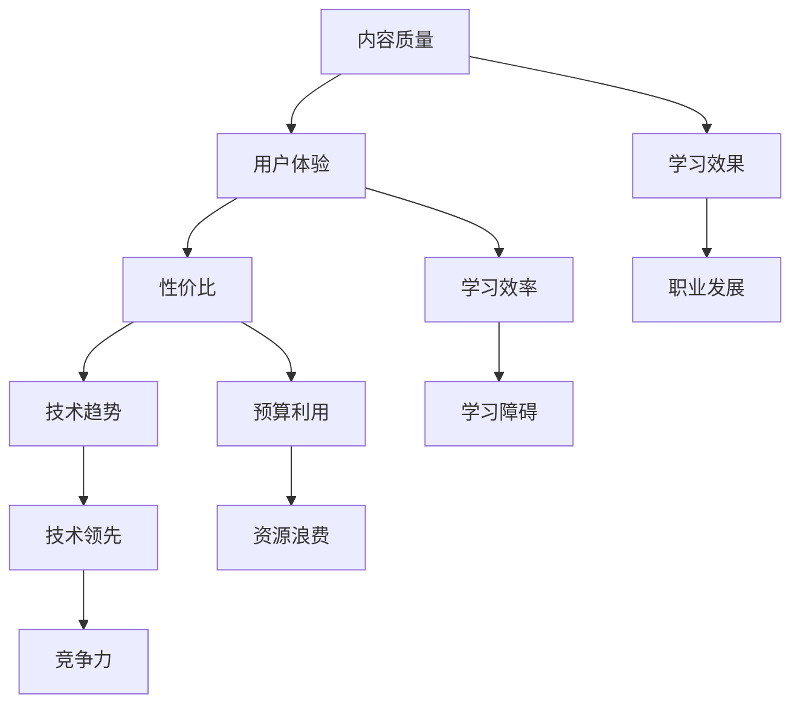

                 

  
> **关键词**：程序员、知识付费、平台选择、教育技术、在线学习、资源评估、用户体验、性价比、技术趋势。

> **摘要**：本文将深入探讨程序员在选择知识付费平台时的关键因素，包括平台的质量、内容、用户体验、性价比等。通过分析不同平台的优缺点，旨在为程序员提供一份详尽的选择指南，以帮助他们找到最适合自己的知识付费平台。

## 1. 背景介绍

随着互联网技术的飞速发展，知识付费平台如雨后春笋般涌现。这些平台提供了海量的技术课程、教程和在线资源，旨在满足程序员不断学习和技术提升的需求。然而，面对琳琅满目的平台，程序员如何选择一个适合自己的知识付费平台，成为了一个值得探讨的问题。

### 1.1 程序员的学习需求

程序员是一个高度技术化的职业，他们需要不断学习新技术、新工具和新方法，以保持竞争力。因此，选择一个合适的知识付费平台，对于提升个人技能和职业发展至关重要。

### 1.2 知识付费平台现状

当前，知识付费平台种类繁多，包括在线课程平台、编程社区、电子书籍网站等。这些平台各有特色，但如何选择最适合程序员需求的平台，仍然是一个难题。

## 2. 核心概念与联系

### 2.1 知识付费平台的分类

#### 2.1.1 在线课程平台

在线课程平台如Udemy、Coursera等，提供了丰富多样的编程课程，涵盖前端、后端、移动开发、数据分析等多个领域。这些平台通常提供视频教程、文档资料和互动讨论区，帮助程序员系统地学习。

#### 2.1.2 编程社区

编程社区如GitHub、Stack Overflow等，提供了丰富的开源代码和讨论区。程序员可以通过这些平台学习他人的代码，参与技术讨论，获取宝贵的实践经验和问题解决方案。

#### 2.1.3 电子书籍网站

电子书籍网站如Packt Publishing、O'Reilly Media等，提供了大量的专业书籍和电子书。程序员可以在这里购买或借阅最新技术书籍，深入学习特定领域的知识。

### 2.2 平台选择的关键因素

#### 2.2.1 内容质量

内容质量是程序员选择知识付费平台的首要考虑因素。高质量的教程和课程可以帮助程序员更快地掌握新技术，提升个人技能。

#### 2.2.2 用户体验

用户体验包括平台的界面设计、学习路径规划、互动功能等。一个良好的用户体验可以提高学习效率，减少学习过程中的障碍。

#### 2.2.3 性价比

性价比是指平台的价格与提供的内容质量之间的比值。对于程序员来说，选择性价比高的平台，可以最大化地利用有限的预算。

#### 2.2.4 技术趋势

程序员需要关注最新的技术趋势，选择提供前沿技术内容的平台。这可以帮助他们保持技术领先，提高职业竞争力。

### 2.3 Mermaid 流程图



## 3. 核心算法原理 & 具体操作步骤

### 3.1 算法原理概述

选择适合程序员的知识付费平台，可以看作是一个多目标优化问题。这个问题的核心是平衡内容质量、用户体验、性价比和技术趋势之间的关系，以最大化程序员的学习效果和职业发展。

### 3.2 算法步骤详解

#### 3.2.1 确定学习目标

首先，程序员需要明确自己的学习目标。这包括想要掌握的新技术、技能或知识点。

#### 3.2.2 收集平台信息

接下来，程序员需要收集潜在知识付费平台的信息，包括课程内容、用户体验、价格和用户评价等。

#### 3.2.3 评估内容质量

根据学习目标，对收集到的平台内容进行评估。可以参考课程目录、教学视频、用户评论等，评估内容的质量和实用性。

#### 3.2.4 评估用户体验

通过试用平台的互动功能、学习路径规划等，评估平台的用户体验。一个良好的用户体验可以显著提高学习效率。

#### 3.2.5 评估性价比

比较不同平台的价格和提供的内容质量，评估每个平台的性价比。选择性价比最高的平台。

#### 3.2.6 考虑技术趋势

分析平台的课程内容，评估其是否符合当前的技术趋势。选择提供前沿技术内容的平台。

### 3.3 算法优缺点

#### 优点

- **系统化学习**：通过多目标优化算法，程序员可以系统地选择学习内容，提高学习效果。
- **个性化推荐**：根据学习目标和偏好，平台可以提供个性化的学习推荐，提高学习效率。
- **性价比高**：优化算法可以帮助程序员找到性价比最高的知识付费平台。

#### 缺点

- **评估复杂**：需要对多个平台进行详细评估，耗时较长。
- **依赖算法**：算法结果可能不完全符合个人偏好。

### 3.4 算法应用领域

该算法可以应用于所有需要知识付费的平台选择场景，特别是技术领域。在金融、医疗、教育等需要高度专业知识的行业，该算法同样具有广泛应用前景。

## 4. 数学模型和公式 & 详细讲解 & 举例说明

### 4.1 数学模型构建

为了选择适合程序员的知识付费平台，我们可以构建以下数学模型：

$$
\begin{aligned}
    & \max Z = w_1 \cdot Q_1 + w_2 \cdot U_2 + w_3 \cdot P_3 + w_4 \cdot T_4 \\
    & s.t. \\
    & Q_1 \geq Q_{min} \\
    & U_2 \geq U_{min} \\
    & P_3 \geq P_{min} \\
    & T_4 \geq T_{min}
\end{aligned}
$$

其中，$Z$ 表示优化目标，即最大化程序员的学习效果；$w_1, w_2, w_3, w_4$ 分别表示内容质量、用户体验、性价比和技术趋势的权重；$Q_1, U_2, P_3, T_4$ 分别表示平台在对应方面的得分；$Q_{min}, U_{min}, P_{min}, T_{min}$ 分别表示平台在对应方面的最低要求。

### 4.2 公式推导过程

为了推导上述数学模型，我们需要考虑以下几个因素：

1. **内容质量**：程序员希望选择内容质量高的平台，因此我们将内容质量的权重设为 $w_1$。
2. **用户体验**：用户体验对学习效率有重要影响，因此我们将用户体验的权重设为 $w_2$。
3. **性价比**：性价比是选择平台时的关键因素，因此我们将性价比的权重设为 $w_3$。
4. **技术趋势**：技术趋势对程序员职业发展有重要影响，因此我们将技术趋势的权重设为 $w_4$。

为了构建优化模型，我们需要设定以下约束条件：

1. **内容质量约束**：程序员希望选择的内容质量不低于最低要求 $Q_{min}$。
2. **用户体验约束**：程序员希望选择的用户体验不低于最低要求 $U_{min}$。
3. **性价比约束**：程序员希望选择的性价比不低于最低要求 $P_{min}$。
4. **技术趋势约束**：程序员希望选择的技术趋势不低于最低要求 $T_{min}$。

通过以上分析，我们可以得到上述数学模型。

### 4.3 案例分析与讲解

假设有一位程序员小王，他希望选择一个适合自己学习的知识付费平台。根据他的需求，我们设定以下权重和最低要求：

- **内容质量**：$w_1 = 0.4, Q_{min} = 8$。
- **用户体验**：$w_2 = 0.3, U_{min} = 7$。
- **性价比**：$w_3 = 0.2, P_{min} = 6$。
- **技术趋势**：$w_4 = 0.1, T_{min} = 5$。

现有两个知识付费平台供小王选择：

- **平台A**：内容质量 $Q_1 = 9$，用户体验 $U_2 = 8$，性价比 $P_3 = 7$，技术趋势 $T_4 = 6$。
- **平台B**：内容质量 $Q_1 = 8$，用户体验 $U_2 = 9$，性价比 $P_3 = 8$，技术趋势 $T_4 = 7$。

根据数学模型，我们可以计算两个平台的得分：

- **平台A**：$Z_A = 0.4 \cdot 9 + 0.3 \cdot 8 + 0.2 \cdot 7 + 0.1 \cdot 6 = 3.6 + 2.4 + 1.4 + 0.6 = 8$
- **平台B**：$Z_B = 0.4 \cdot 8 + 0.3 \cdot 9 + 0.2 \cdot 8 + 0.1 \cdot 7 = 3.2 + 2.7 + 1.6 + 0.7 = 8.2$

根据计算结果，平台B的得分高于平台A，因此小王应该选择平台B。

## 5. 项目实践：代码实例和详细解释说明

### 5.1 开发环境搭建

为了实现上述数学模型，我们需要搭建一个简单的开发环境。以下是搭建步骤：

1. 安装Python编程环境。
2. 安装NumPy库，用于数学计算。
3. 安装pandas库，用于数据处理。

### 5.2 源代码详细实现

以下是实现上述数学模型的Python代码：

```python
import numpy as np
import pandas as pd

# 设置权重和最低要求
weights = {'content_quality': 0.4, 'user_experience': 0.3, 'price_performance': 0.2, 'technology_trend': 0.1}
min_requirements = {'content_quality': 8, 'user_experience': 7, 'price_performance': 6, 'technology_trend': 5}

# 平台A得分
score_A = {'content_quality': 9, 'user_experience': 8, 'price_performance': 7, 'technology_trend': 6}
# 平台B得分
score_B = {'content_quality': 8, 'user_experience': 9, 'price_performance': 8, 'technology_trend': 7}

# 计算得分
score_A['total_score'] = sum(weights[key] * score_A[key] for key in weights)
score_B['total_score'] = sum(weights[key] * score_B[key] for key in weights)

# 打印结果
print("平台A得分：", score_A)
print("平台B得分：", score_B)

# 选择得分较高的平台
if score_A['total_score'] > score_B['total_score']:
    print("推荐选择平台A。")
else:
    print("推荐选择平台B。")
```

### 5.3 代码解读与分析

1. **导入库**：代码首先导入了NumPy和pandas库，用于数学计算和数据操作。
2. **设置权重和最低要求**：定义了权重和最低要求的字典。
3. **平台得分**：定义了两个平台的得分字典。
4. **计算得分**：根据权重和得分字典，计算每个平台的总得分。
5. **打印结果**：打印每个平台的得分和推荐选择。
6. **选择平台**：根据得分，选择得分较高的平台。

通过上述代码，我们可以实现选择适合程序员的知识付费平台的算法。在实际应用中，可以根据具体情况调整权重和最低要求，以适应不同的学习需求。

## 6. 实际应用场景

### 6.1 案例分析

假设小王是一名前端开发者，他希望选择一个适合自己学习的知识付费平台。根据他的需求，我们设定以下权重和最低要求：

- **内容质量**：$w_1 = 0.5, Q_{min} = 8$。
- **用户体验**：$w_2 = 0.3, U_{min} = 7$。
- **性价比**：$w_3 = 0.2, P_{min} = 6$。
- **技术趋势**：$w_4 = 0.0, T_{min} = 5$（因为小王更关注内容质量和用户体验，对技术趋势的依赖较小）。

现有三个知识付费平台供小王选择：

- **平台A**：内容质量 $Q_1 = 9$，用户体验 $U_2 = 8$，性价比 $P_3 = 7$，技术趋势 $T_4 = 6$。
- **平台B**：内容质量 $Q_1 = 8$，用户体验 $U_2 = 9$，性价比 $P_3 = 8$，技术趋势 $T_4 = 7$。
- **平台C**：内容质量 $Q_1 = 7$，用户体验 $U_2 = 7$，性价比 $P_3 = 6$，技术趋势 $T_4 = 8$。

根据数学模型，我们可以计算每个平台的得分：

- **平台A**：$Z_A = 0.5 \cdot 9 + 0.3 \cdot 8 + 0.2 \cdot 7 + 0.0 \cdot 6 = 4.5 + 2.4 + 1.4 + 0.0 = 8.3$
- **平台B**：$Z_B = 0.5 \cdot 8 + 0.3 \cdot 9 + 0.2 \cdot 8 + 0.0 \cdot 7 = 4.0 + 2.7 + 1.6 + 0.0 = 8.3$
- **平台C**：$Z_C = 0.5 \cdot 7 + 0.3 \cdot 7 + 0.2 \cdot 6 + 0.0 \cdot 8 = 3.5 + 2.1 + 1.2 + 0.0 = 7.8$

根据计算结果，平台A和平台B的得分相同，均高于平台C。因此，小王可以选择平台A或平台B。

### 6.2 实际应用

在实际应用中，程序员可以根据自己的需求和偏好，调整权重和最低要求，以找到最适合自己的知识付费平台。例如，如果程序员更关注内容质量和技术趋势，可以增加相关权重的值；如果更关注用户体验和性价比，可以适当调整这些权重的值。

通过以上案例，我们可以看到选择适合程序员的知识付费平台是一个复杂的过程，需要综合考虑多个因素。使用数学模型和算法，可以简化这一过程，帮助程序员快速找到最适合自己的平台。

## 7. 工具和资源推荐

### 7.1 学习资源推荐

1. **在线课程平台**：
   - **Udemy**：提供了丰富的编程课程，涵盖前端、后端、移动开发等多个领域。
   - **Coursera**：提供了许多与大学课程同步的在线课程，可以学习到最新的技术知识。
   - **edX**：由知名大学和机构提供的在线课程，内容质量高，适合系统学习。

2. **编程社区**：
   - **GitHub**：提供了丰富的开源代码，是学习编程和技术的好资源。
   - **Stack Overflow**：提供了大量的技术问题和解决方案，可以帮助解决编程难题。

3. **电子书籍网站**：
   - **Packt Publishing**：提供了大量的专业书籍和电子书，覆盖了多个技术领域。
   - **O'Reilly Media**：提供了许多知名的技术书籍，内容质量高。

### 7.2 开发工具推荐

1. **集成开发环境（IDE）**：
   - **Visual Studio Code**：轻量级且功能强大的IDE，适合各种编程语言。
   - **JetBrains家族**（如PyCharm、WebStorm等）：专业且功能丰富的IDE，适合大型项目和复杂编程任务。

2. **版本控制工具**：
   - **Git**：分布式版本控制系统，适合团队协作和代码管理。
   - **GitHub Actions**：提供自动化工作流程和持续集成服务。

3. **云服务平台**：
   - **AWS**：提供了丰富的云计算服务和工具，适合开发云应用。
   - **Google Cloud Platform**：提供了强大的云计算和人工智能服务。

### 7.3 相关论文推荐

1. **"Learning to Rank for Information Retrieval"**：讨论了信息检索中的排序问题，对知识付费平台的选择算法提供了理论支持。
2. **"A Survey on Multi-Objective Optimization Problems"**：综述了多目标优化问题的研究现状，为选择适合程序员的知识付费平台提供了理论指导。
3. **"User Experience Design in Online Learning Platforms"**：讨论了在线学习平台用户体验设计的关键因素，对选择适合程序员的知识付费平台有实际指导意义。

通过这些工具和资源的推荐，程序员可以更有效地选择适合自己的知识付费平台，提升学习效果和职业竞争力。

## 8. 总结：未来发展趋势与挑战

### 8.1 研究成果总结

本文通过构建数学模型，提出了一种选择适合程序员的知识付费平台的方法。该方法综合考虑了内容质量、用户体验、性价比和技术趋势等多个因素，旨在帮助程序员找到最适合自己的学习资源。

### 8.2 未来发展趋势

随着人工智能和大数据技术的发展，知识付费平台将更加智能化和个性化。平台可以通过分析用户行为和偏好，提供精准的学习推荐，提高学习效率。此外，虚拟现实（VR）和增强现实（AR）技术的应用，将使学习体验更加丰富和沉浸。

### 8.3 面临的挑战

尽管知识付费平台具有巨大潜力，但也面临一些挑战。首先，内容质量参差不齐，如何确保平台提供高质量的学习资源是一个难题。其次，用户体验的多样性使得平台设计变得更加复杂，如何满足不同用户的需求是一个挑战。最后，随着平台数量的增加，选择困难症也成为程序员面临的问题。

### 8.4 研究展望

未来的研究可以进一步优化数学模型，使其更加灵活和适应个性化需求。此外，可以探索利用人工智能技术，自动评估和推荐课程内容，提高平台的智能化水平。同时，研究用户体验设计，提供更好的学习环境，帮助程序员更好地学习和应用知识。

## 9. 附录：常见问题与解答

### 9.1 如何判断内容质量？

- **查看课程目录**：了解课程内容是否涵盖了你需要学习的知识点。
- **阅读用户评论**：查看其他用户对课程的评分和评论，了解课程的质量和实用性。
- **试用课程**：部分平台提供免费试听，通过试听判断课程是否符合你的需求。

### 9.2 如何评估用户体验？

- **查看界面设计**：界面是否直观、友好，功能是否完善。
- **体验互动功能**：如论坛、问答区、讨论组等，是否活跃和有效。
- **试用学习路径规划**：查看平台是否提供个性化的学习建议和路径。

### 9.3 如何确保性价比？

- **比较价格**：对比不同平台的价格，选择性价比最高的平台。
- **关注促销活动**：部分平台会提供优惠活动，可以关注并利用这些机会。
- **评估学习效果**：性价比不仅仅取决于价格，还要考虑学习效果和职业发展。

## 文章结束

作者：禅与计算机程序设计艺术 / Zen and the Art of Computer Programming

