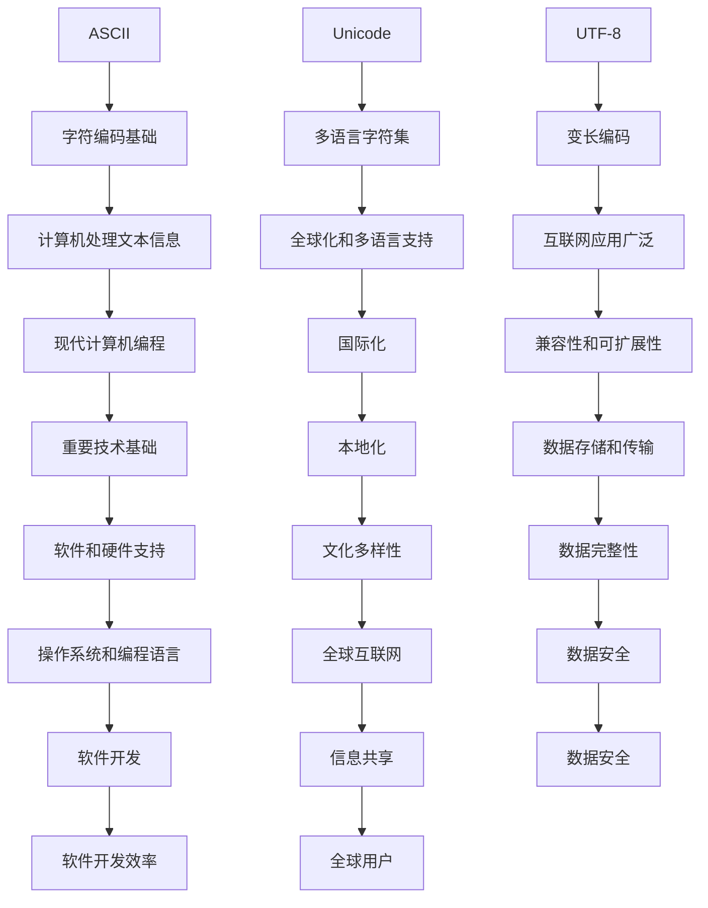

                 

关键词：ASCII、Unicode、UTF-8、字符编码、字符串处理、计算机编程、国际化和本地化。

> 摘要：本文将深入探讨字符编码的三个重要概念：ASCII、Unicode 和 UTF-8。我们将分析它们的起源、工作原理、优缺点以及它们在现代计算机编程中的重要性。通过本文，读者将能够更好地理解字符编码，并能够在实际项目中正确地应用这些知识。

## 1. 背景介绍

字符编码是计算机处理文本信息的基础。它定义了如何将人类可读的字符映射到计算机可以存储和处理的数字代码。字符编码的发展历程反映了计算机技术从早期到现代的演变。最早期的计算机系统使用的是简单的编码方案，如ASCII，而随着计算机技术的发展，文本信息的处理需求变得更加复杂，促使了Unicode和UTF-8等更高级编码方案的出现。

ASCII（美国信息交换标准码）是最早的字符编码方案，起源于20世纪60年代。它的目的是使不同计算机系统之间的文本交换变得容易。ASCII编码仅支持英文字母、数字、标点符号和其他一些常用符号，总共128个字符。这个编码方案的局限性在于它无法表示非英语字符，这在全球化和多语言环境中显得尤为明显。

Unicode旨在克服ASCII的限制，它是一个可扩展的字符集，涵盖了几乎所有的已知字符，包括拉丁字母、汉字、日文平假名和片假名、阿拉伯数字等。Unicode提供了统一的字符表示，使得不同语言的文本可以在同一系统中进行存储和处理。

UTF-8（Unicode转换格式）是Unicode的一种变长编码方案。它通过将字符编码为1到4个字节，实现了对Unicode字符的广泛支持。UTF-8的灵活性使得它在互联网中得到了广泛的应用。

### 2. 核心概念与联系

下面是一个关于字符编码的核心概念和它们之间联系的Mermaid流程图。



### 3. 核心算法原理 & 具体操作步骤

#### 3.1 算法原理概述

字符编码的核心算法是将字符映射到数字代码，并将这些代码存储为字节序列。每个字符都有一个唯一的数值，这个数值称为字符的编码值。不同的编码方案有不同的编码规则和编码值。

- ASCII编码：使用7位二进制数表示一个字符，可以表示128个不同的字符。
- Unicode编码：使用16位、32位或更多位二进制数表示一个字符，可以表示超过1000万个不同的字符。
- UTF-8编码：使用1到4个字节表示一个字符，根据字符的编码值的大小进行变长编码。

#### 3.2 算法步骤详解

- ASCII编码步骤：
  1. 将字符转换为对应的ASCII编码值。
  2. 将编码值转换为7位二进制数。
  3. 将二进制数分为若干个字节，每个字节最高位为0。

- Unicode编码步骤：
  1. 将字符转换为对应的Unicode编码值。
  2. 对于16位编码，直接将其转换为字节序列。
  3. 对于32位编码，首先将其分为两个16位的值，然后将每个值转换为字节序列。

- UTF-8编码步骤：
  1. 将字符转换为对应的Unicode编码值。
  2. 根据编码值的大小，选择合适的字节长度（1到4个字节）。
  3. 将编码值转换为对应的字节序列。

#### 3.3 算法优缺点

- ASCII编码：
  - 优点：简单、直观、易于实现。
  - 缺点：只能表示英文字符，无法支持多语言文本。

- Unicode编码：
  - 优点：支持所有字符，包括多语言文本。
  - 缺点：编码长度不固定，可能需要更多的存储空间。

- UTF-8编码：
  - 优点：灵活、高效、支持多语言文本。
  - 缺点：编码规则复杂，可能需要更多的计算资源。

#### 3.4 算法应用领域

- ASCII编码广泛应用于早期计算机系统，主要用于英文字符处理。
- Unicode编码广泛应用于现代计算机系统，支持多语言文本处理。
- UTF-8编码广泛应用于互联网和现代编程语言，支持高效的数据存储和传输。

### 4. 数学模型和公式 & 详细讲解 & 举例说明

字符编码涉及到一些基础的数学概念和公式。下面我们将详细讲解这些数学模型和公式，并通过具体的例子来说明。

#### 4.1 数学模型构建

字符编码的数学模型主要涉及字符的数值表示和编码值的转换。

- ASCII编码：
  - 数学模型：每个字符的编码值可以通过ASCII编码值表找到。
  - 转换公式：`编码值 = 字符对应的ASCII编码值`

- Unicode编码：
  - 数学模型：每个字符的编码值是其Unicode值。
  - 转换公式：`编码值 = 字符对应的Unicode值`

- UTF-8编码：
  - 数学模型：根据字符的Unicode值，确定所需的字节长度和每个字节的编码值。
  - 转换公式：
    - 若字符为ASCII字符，则编码值为字符的Unicode值对应的ASCII编码值。
    - 若字符为非ASCII字符，则编码值为字符的Unicode值。

#### 4.2 公式推导过程

- ASCII编码的公式推导：
  - 由于ASCII编码是直接映射，因此编码值就是字符的ASCII值。

- Unicode编码的公式推导：
  - Unicode编码值直接就是字符的Unicode值。

- UTF-8编码的公式推导：
  - UTF-8编码的规则比较复杂，需要根据字符的Unicode值来确定每个字节的编码值。
  - 以一个非ASCII字符为例，其UTF-8编码的步骤如下：
    1. 计算所需的字节长度（1到4个字节）。
    2. 根据字节长度，确定每个字节的最高位（总是1）。
    3. 将Unicode值转换为对应的字节序列。

#### 4.3 案例分析与讲解

我们将通过几个具体的例子来说明字符编码的数学模型和公式。

**例1：ASCII编码**

字符"A"的ASCII编码值为65，对应的二进制编码为01000001。

**例2：Unicode编码**

字符"中"的Unicode编码值为20013，对应的16位二进制编码为01010001 00100001。

**例3：UTF-8编码**

字符"中"的Unicode编码值为20013，对应的UTF-8编码如下：
- 字节长度：3个字节。
- 字节1：1110xxxx，其中x为0，所以为11100000。
- 字节2：10xxxxxx，其中前5位为10，后3位为001000。
- 字节3：10xxxxxx，其中前5位为10，后3位为001001。

因此，字符"中"的UTF-8编码为11100000 10010001 10000101。

### 5. 项目实践：代码实例和详细解释说明

在本节中，我们将通过一个简单的Python代码实例来演示如何处理ASCII、Unicode和UTF-8编码。

#### 5.1 开发环境搭建

确保您已经安装了Python（版本3.6及以上），并且已经配置了必要的Python环境。

#### 5.2 源代码详细实现

下面是一个简单的Python脚本，用于演示ASCII、Unicode和UTF-8编码的转换。

```python
# 导入所需的库
import unicodedata

# ASCII编码示例
ascii_char = 'A'
ascii_value = ord(ascii_char)
print(f"ASCII编码：{ascii_char} -> {ascii_value}")

# Unicode编码示例
unicode_char = '中'
unicode_value = ord(unicode_char)
print(f"Unicode编码：{unicode_char} -> {unicode_value}")

# UTF-8编码示例
utf8_char = '中'
utf8_value = unicodedata.encode(unicodedata.name(utf8_char), 'utf-8')
print(f"UTF-8编码：{utf8_char} -> {utf8_value}")

# 解码UTF-8示例
decoded_utf8 = utf8_value.decode('utf-8')
print(f"解码UTF-8：{utf8_value} -> {decoded_utf8}")
```

#### 5.3 代码解读与分析

1. **ASCII编码**：
   - 使用`ord()`函数获取字符"A"的ASCII编码值，并打印输出。

2. **Unicode编码**：
   - 使用`ord()`函数获取字符"中"的Unicode编码值，并打印输出。

3. **UTF-8编码**：
   - 使用`unicodedata.name()`函数获取字符"中"的Unicode名称，然后使用`unicodedata.encode()`函数将其编码为UTF-8格式，并打印输出。

4. **解码UTF-8**：
   - 使用`decode()`函数将UTF-8编码的字符串解码回原始字符，并打印输出。

#### 5.4 运行结果展示

```plaintext
ASCII编码：A -> 65
Unicode编码：中 -> 20013
UTF-8编码：中 -> b'\xe4\xb8ad'
解码UTF-8：b'\xe4\xb8ad' -> 中
```

运行结果展示了字符"A"和"中"的ASCII、Unicode和UTF-8编码，以及从UTF-8编码解码回原始字符的过程。

### 6. 实际应用场景

字符编码在实际应用中扮演着至关重要的角色，特别是在以下场景中：

- **国际化和本地化**：随着互联网的发展，全球用户访问和使用软件的需求日益增加。字符编码使得软件能够支持多种语言，实现国际化。例如，电子商务网站需要支持多种货币和语言，字符编码使得这一需求得以实现。

- **文本编辑和显示**：字符编码是文本编辑和显示的基础。无论是简单的文本编辑器还是复杂的富文本编辑器，字符编码都决定了文本的正确显示和处理。

- **数据存储和传输**：字符编码影响数据的存储和传输效率。正确的字符编码可以减少存储空间，提高数据传输速度。例如，使用UTF-8编码可以节省存储空间，因为在互联网传输中，大多数文本都是基于ASCII字符。

- **Web开发和互联网应用**：Web开发中的大部分文本都是通过HTTP协议传输的，而HTTP默认使用UTF-8编码。因此，Web开发者需要确保他们的应用支持UTF-8编码，以确保全球用户的文本正确显示。

### 7. 未来应用展望

随着全球化和数字化的不断推进，字符编码在未来将面临更多挑战和机遇：

- **字符集扩展**：Unicode正在不断扩展，以支持更多的字符和符号。未来可能会有更多的字符被添加到Unicode字符集中。

- **编码效率提升**：随着数据量的增长，编码效率变得尤为重要。新的编码方案可能会出现，以提供更高的压缩率和更快的传输速度。

- **国际化和本地化支持**：随着全球市场的不断扩大，软件和服务需要更好地支持国际化。字符编码将在这一过程中发挥关键作用。

- **跨平台兼容性**：随着不同操作系统和编程语言的普及，字符编码的跨平台兼容性将变得更加重要。未来的编码方案需要更好地支持多平台环境。

### 8. 总结：未来发展趋势与挑战

字符编码是计算机编程和互联网应用的基础，它直接影响文本的处理、存储和传输。随着全球化和数字化的推进，字符编码在未来将继续发展，面临以下趋势和挑战：

- **字符集扩展**：Unicode的字符集将继续扩展，以支持更多的语言和符号。

- **编码效率提升**：新的编码方案可能会出现，以提高编码效率和数据传输速度。

- **国际化和本地化支持**：字符编码将在全球化和本地化过程中发挥更加重要的作用。

- **跨平台兼容性**：未来的编码方案需要更好地支持多平台环境，以实现无缝的跨平台文本处理。

总的来说，字符编码的发展将继续推动计算机技术的进步，为全球用户带来更好的文本处理体验。

### 9. 附录：常见问题与解答

1. **什么是ASCII编码？**
   - ASCII编码是一种字符编码方案，用于将字符映射到数字代码。它起源于20世纪60年代，主要用于英文字符处理。

2. **Unicode和ASCII有什么区别？**
   - Unicode是一种更全面的字符编码方案，它支持超过1000万个字符，包括ASCII字符和许多其他语言的字符。ASCII只支持英文字符。

3. **什么是UTF-8编码？**
   - UTF-8是一种变长的Unicode编码方案，它使用1到4个字节表示一个字符。UTF-8在互联网中得到了广泛的应用，因为它高效且兼容ASCII。

4. **为什么需要Unicode而不是ASCII？**
   - 随着全球化和多语言文本的处理需求增加，ASCII编码无法满足这些需求。Unicode提供了统一的字符表示，支持多种语言，是实现国际化的重要工具。

5. **UTF-8编码如何工作？**
   - UTF-8编码通过将字符的Unicode值转换为对应的字节序列。不同的字符可能需要不同的字节长度（1到4个字节），这取决于字符的Unicode值。

### 作者署名

作者：禅与计算机程序设计艺术 / Zen and the Art of Computer Programming
----------------------------------------------------------------

