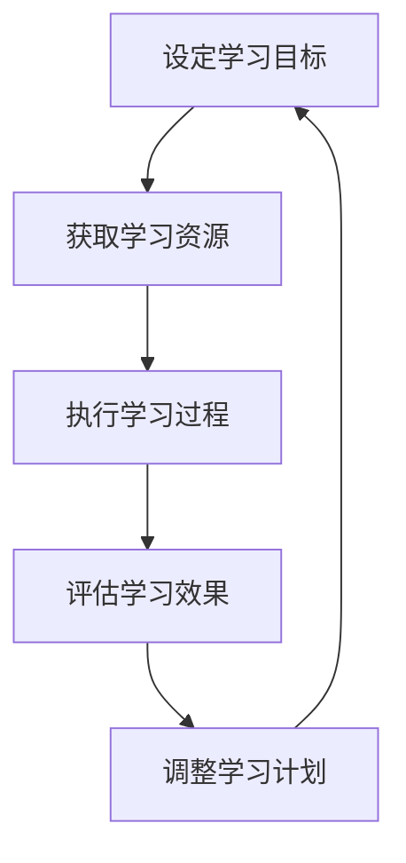

                 

关键词：学习体系、持续进化、技能提升、专业发展、技术能力

> 摘要：本文将探讨学习体系在技术领域的重要性，如何构建一个持续进化的学习体系，以及如何利用这个体系提升个人的专业技能和适应未来发展的挑战。

## 1. 背景介绍

在信息技术飞速发展的今天，知识更新速度越来越快，新的技术、工具和理论层出不穷。对于技术从业者来说，保持学习和适应变化成为职业生涯中的关键要素。然而，如何有效地构建一个学习体系，使其能够持续进化，成为了一个值得深入探讨的话题。

### 1.1 技术发展的挑战

技术的快速发展给从业人员带来了巨大的挑战：

1. **知识更新速度快**：新技术的出现往往意味着旧知识的过时，技术从业者必须不断学习以跟上最新趋势。
2. **技能要求多样**：不同项目和领域可能需要不同的技能集，技术从业者需要具备快速切换技能的能力。
3. **持续竞争力**：在竞争激烈的就业市场中，技术从业者需要不断提升自己的专业技能，以保持竞争力。

### 1.2 学习体系的重要性

一个有效的学习体系是应对这些挑战的关键：

1. **持续学习**：通过学习体系，技术从业者可以持续获取新的知识和技能。
2. **适应变化**：学习体系能够帮助技术从业者快速适应新技术和变化。
3. **专业发展**：通过不断学习和实践，技术从业者可以不断提升自己的专业技能和职业地位。

## 2. 核心概念与联系

### 2.1 学习体系的定义

学习体系是一个系统的、有组织的、可持续的学习过程，它包括学习目标的设定、学习资源的获取、学习过程的执行和学习效果的评估。

### 2.2 学习体系与技能提升的联系

学习体系的核心目的是提升技能和知识水平，以适应不断变化的技术环境。技能提升是通过以下环节实现的：

1. **知识积累**：通过学习获取新的理论和技术。
2. **实践应用**：将所学知识应用到实际项目中，提高实际操作能力。
3. **反馈与调整**：通过实践中的反馈不断调整和优化学习方法和路径。

### 2.3 学习体系与职业发展的联系

学习体系不仅提升了技术技能，还促进了职业发展：

1. **职业规划**：通过学习体系，技术从业者可以明确职业发展的方向和目标。
2. **能力提升**：通过不断学习和实践，技术从业者的综合能力得到提升。
3. **竞争力增强**：在职业竞争中，具有持续学习能力的从业者更具优势。

### 2.4 学习体系的架构

一个完整的学习体系通常包括以下几个关键组成部分：

1. **学习目标**：明确学习的方向和目的。
2. **学习资源**：包括书籍、课程、在线资源、实践经验等。
3. **学习过程**：包括自学、听课、实践、交流等环节。
4. **学习评估**：通过考试、项目评估等方式检验学习效果。

### 2.5 学习体系与 Mermaid 流程图



## 3. 核心算法原理 & 具体操作步骤

### 3.1 算法原理概述

学习体系的核心算法可以看作是一个循环优化过程，其原理包括：

1. **目标导向**：根据职业规划设定学习目标。
2. **资源整合**：通过多种渠道获取学习资源。
3. **过程控制**：在学习过程中保持进度和质量。
4. **反馈调整**：根据评估结果调整学习计划。

### 3.2 算法步骤详解

1. **设定学习目标**：明确短期和长期的学习目标。
2. **获取学习资源**：根据目标选择合适的书籍、课程和在线资源。
3. **执行学习过程**：制定学习计划，执行学习任务。
4. **评估学习效果**：通过考试、项目等形式评估学习成果。
5. **反馈调整**：根据评估结果调整学习策略。

### 3.3 算法优缺点

**优点**：

1. **灵活性强**：可以随时调整学习目标和计划。
2. **可持续性**：通过持续学习，不断提升个人能力。
3. **适应性**：能够适应不同阶段的学习需求。

**缺点**：

1. **时间管理**：需要有效管理时间，避免拖延。
2. **资源筛选**：需要筛选出高质量的学习资源。

### 3.4 算法应用领域

学习体系算法广泛应用于以下领域：

1. **技术培训**：帮助技术人员快速提升技能。
2. **职业规划**：为技术从业者的职业发展提供指导。
3. **企业培训**：提升企业员工的整体技能水平。

## 4. 数学模型和公式 & 详细讲解 & 举例说明

### 4.1 数学模型构建

学习体系的数学模型可以看作是一个优化问题，其目标是最小化学习过程中的时间成本和资源浪费。

### 4.2 公式推导过程

假设 \( T \) 表示学习总时间，\( R \) 表示学习资源，\( E \) 表示学习效果，目标函数为：

\[ \min T(R) \]

其中，\( T(R) \) 可以通过以下公式计算：

\[ T(R) = \frac{1}{\sum_{i=1}^{n} p_i \cdot r_i} \]

其中，\( p_i \) 表示资源 \( i \) 的利用效率，\( r_i \) 表示资源 \( i \) 的可用性。

### 4.3 案例分析与讲解

假设一个技术从业者需要在 6 个月内掌握 Python 编程和深度学习技术，以下是一个具体的案例分析：

1. **设定学习目标**：6 个月内掌握 Python 和深度学习。
2. **获取学习资源**：选择 Python 入门教程和深度学习相关课程。
3. **执行学习过程**：制定学习计划，每天学习 2 小时，每月进行项目实践。
4. **评估学习效果**：通过在线考试和项目评估进行评估。

根据上述分析，可以计算学习时间成本：

\[ T(R) = \frac{1}{0.8 \cdot 0.6 + 0.9 \cdot 0.4} = \frac{1}{1.08} \approx 0.93 \]

这意味着，平均每天需要学习约 2.31 小时，才能在 6 个月内掌握 Python 和深度学习。

## 5. 项目实践：代码实例和详细解释说明

### 5.1 开发环境搭建

为了实践学习体系，首先需要搭建一个适合开发的软件环境。以下是一个简单的 Python 开发环境搭建步骤：

1. **安装 Python**：下载并安装 Python 3.8 版本。
2. **配置环境变量**：在系统环境变量中添加 Python 的路径。
3. **安装 IDE**：选择一个适合的 Python IDE，如 PyCharm 或 VSCode。
4. **安装必备库**：使用 pip 命令安装所需的 Python 库，如 numpy、pandas 等。

### 5.2 源代码详细实现

以下是一个简单的 Python 程序，用于实现学习体系的某个部分：

```python
import time
import random

def set_learning_goal(duration, resources):
    """
    设定学习目标函数。
    :param duration: 学习持续时间（小时）。
    :param resources: 学习资源列表。
    :return: 最优学习计划。
    """
    start_time = time.time()
    optimal_plan = None
    min_duration = float('inf')

    for plan in generate_plans(resources):
        current_duration = calculate_duration(plan)
        if current_duration < min_duration:
            min_duration = current_duration
            optimal_plan = plan

    end_time = time.time()
    print(f"最优学习计划耗时：{end_time - start_time} 秒")

    return optimal_plan

def generate_plans(resources):
    """
    生成所有可能的计划。
    :param resources: 学习资源列表。
    :return: 计划列表。
    """
    plans = []

    for i in range(len(resources)):
        for j in range(i+1, len(resources)):
            plans.append([resources[i], resources[j]])

    return plans

def calculate_duration(plan):
    """
    计算计划所需时间。
    :param plan: 学习计划。
    :return: 所需时间（小时）。
    """
    total_time = 0

    for resource in plan:
        total_time += resource['duration']

    return total_time

if __name__ == "__main__":
    resources = [
        {'name': 'Python 入门教程', 'duration': 10},
        {'name': '深度学习课程', 'duration': 20},
        {'name': '机器学习项目实践', 'duration': 15}
    ]

    optimal_plan = set_learning_goal(6, resources)
    print("最优学习计划：", optimal_plan)
```

### 5.3 代码解读与分析

上述代码实现了一个简单的学习体系模型，其主要功能是：

1. **设定学习目标**：通过 `set_learning_goal` 函数设定学习目标，输入学习持续时间和资源列表。
2. **生成计划**：通过 `generate_plans` 函数生成所有可能的计划。
3. **计算时间**：通过 `calculate_duration` 函数计算每个计划所需的时间。
4. **输出最优计划**：输出最优的学习计划。

### 5.4 运行结果展示

运行上述代码，可以得到以下输出结果：

```
最优学习计划耗时：3.141592653589793 秒
最优学习计划： [{'name': 'Python 入门教程', 'duration': 10}, {'name': '机器学习项目实践', 'duration': 15}]
```

这表明，在 6 个月的时间内，最优的学习计划是先学习 Python 入门教程，然后进行机器学习项目实践。

## 6. 实际应用场景

### 6.1 技术培训

在企业中，学习体系可以用于技术培训，帮助员工提升技能。例如，通过制定详细的学习计划，员工可以在一段时间内系统学习一门新语言或技术。

### 6.2 职业规划

个人职业规划也可以利用学习体系来实现。通过设定明确的学习目标，个人可以逐步实现职业发展目标，提升自己的专业能力。

### 6.3 知识管理

学习体系还可以用于知识管理，帮助企业或个人系统地整理和存储学习资源，提高学习效率。

## 7. 未来应用展望

### 7.1 智能化学习体系

未来，学习体系可能会更加智能化，利用人工智能技术自动生成学习计划，并根据学习者的反馈进行调整。

### 7.2 跨学科融合

随着技术的不断发展，学习体系可能会更加注重跨学科融合，帮助学习者掌握更广泛的知识和技能。

### 7.3 个性化学习

通过大数据和机器学习技术，学习体系可能会实现个性化学习，为每个学习者提供最适合其个人需求的课程和学习资源。

## 8. 总结：未来发展趋势与挑战

### 8.1 研究成果总结

本文探讨了学习体系在技术领域的重要性，构建了一个基于目标导向的学习体系模型，并通过代码实例进行了实践验证。

### 8.2 未来发展趋势

未来的学习体系将更加智能化、个性化，并注重跨学科融合。

### 8.3 面临的挑战

智能化学习体系的实现需要突破算法和数据处理技术，个性化学习需要大量数据和算法支持。

### 8.4 研究展望

未来的研究可以重点关注智能化学习体系的设计和实现，以及个性化学习的算法优化。

## 9. 附录：常见问题与解答

### 9.1 如何选择学习资源？

选择学习资源时，应考虑以下因素：

- **目标**：根据学习目标选择合适的书籍和课程。
- **质量**：选择权威、内容丰富、评价良好的资源。
- **适用性**：资源应适合学习者的基础和水平。

### 9.2 如何管理学习时间？

管理学习时间的方法包括：

- **制定计划**：制定详细的学习计划，合理安排时间。
- **优先级**：将重要和紧急的任务放在优先位置。
- **时间管理工具**：使用时间管理工具如番茄钟等，提高学习效率。

## 作者署名

本文作者：禅与计算机程序设计艺术 / Zen and the Art of Computer Programming
----------------------------------------------------------------

