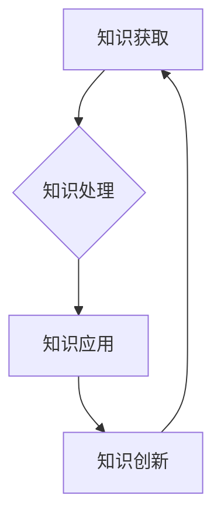

                 

关键词：学习体系、持续进化、技术进步、知识架构、创新动力

> 摘要：本文深入探讨了学习体系在推动技术进步中的核心作用，阐述了如何通过构建合理的学习体系实现持续进化，为个人和组织的创新提供源源不断的动力。

## 1. 背景介绍

在信息技术迅猛发展的当今时代，知识的更新速度前所未有，新技术的出现如雨后春笋。在这种背景下，个体和组织必须具备快速学习和适应变化的能力，以确保在激烈的竞争中立于不败之地。学习体系作为一个系统的、结构化的知识管理框架，不仅为个人的成长提供了路径，也为组织的持续创新注入了活力。

本文旨在探讨学习体系的概念、构建方法以及其在推动技术进步中的关键作用。通过分析学习体系的构成要素和运作机制，本文希望能够为读者提供一套实用的指导原则，帮助他们在复杂多变的环境中实现持续进化。

## 2. 核心概念与联系

### 2.1 学习体系的定义

学习体系是指一系列有序的知识获取、处理和应用过程，旨在通过不断的学习和实践，实现知识的积累、内化和创新。它不仅包括知识的学习和掌握，还涵盖了知识的应用和创新。

### 2.2 学习体系的构成

一个完整的学习体系通常包括以下几个关键组成部分：

- **知识获取**：通过阅读、研究、培训等方式获取新的知识和技能。
- **知识处理**：对获取的知识进行筛选、整合和深化，形成个人的知识体系。
- **知识应用**：将知识应用于实际工作中，解决实际问题，提升工作效率。
- **知识创新**：在应用过程中，不断总结经验，形成新的知识，推动技术进步。

### 2.3 学习体系与持续进化的关系

学习体系是持续进化的基础。通过不断学习新知识、掌握新技术，个体和组织能够保持竞争力，实现持续进化。具体来说，学习体系具有以下几个特点：

- **适应性**：学习体系能够根据环境变化迅速调整，以适应新的技术和需求。
- **系统性**：学习体系不是零散的知识点，而是系统化的知识网络，能够形成完整的知识框架。
- **持续性**：学习体系是一个持续的过程，不断有新的知识被纳入，旧的、过时的知识被淘汰。
- **创新性**：通过知识的应用和创新，学习体系能够推动技术的进步和变革。

### 2.4 学习体系的 Mermaid 流程图



在这个流程图中，知识获取、知识处理、知识应用和知识创新形成一个闭环，不断循环迭代，推动持续进化。

## 3. 核心算法原理 & 具体操作步骤

### 3.1 算法原理概述

学习体系的运作原理可以类比为一种自适应算法。这个算法的核心思想是通过不断的学习和实践，自动调整知识结构，以适应外部环境的变化。具体来说，包括以下几个步骤：

1. **数据输入**：获取新的知识和信息。
2. **预处理**：对输入的数据进行筛选和整合，去除无关信息。
3. **知识结构化**：将预处理后的数据组织成系统化的知识框架。
4. **知识应用**：将知识应用于实际问题中，验证其有效性。
5. **反馈调整**：根据应用结果，对知识结构进行调整和优化。

### 3.2 算法步骤详解

1. **数据输入**：
   - **阅读文献**：通过阅读专业书籍、研究论文、技术博客等，获取新的知识和信息。
   - **参加培训**：参加线上或线下的培训课程，系统学习新技术。

2. **预处理**：
   - **信息筛选**：根据实际需要，筛选出有用的信息。
   - **信息整合**：将筛选出的信息进行整合，形成完整的知识体系。

3. **知识结构化**：
   - **分类整理**：将知识按照主题和领域进行分类整理。
   - **构建框架**：在分类整理的基础上，构建系统化的知识框架。

4. **知识应用**：
   - **实战演练**：在实际工作中，应用所学知识解决实际问题。
   - **案例分析**：通过案例分析，总结知识的应用经验。

5. **反馈调整**：
   - **效果评估**：评估知识应用的效果，发现不足之处。
   - **优化调整**：根据评估结果，对知识结构进行调整和优化。

### 3.3 算法优缺点

**优点**：
- **适应性**：能够快速适应环境变化，及时调整知识结构。
- **系统性**：构建了完整的知识框架，提高了知识的整合和利用效率。
- **创新性**：通过不断的学习和应用，推动知识的创新和技术进步。

**缺点**：
- **学习成本**：构建学习体系需要大量的时间和精力投入。
- **信息过载**：在信息爆炸的时代，如何筛选和整合信息成为一个挑战。

### 3.4 算法应用领域

学习体系广泛应用于个人学习、组织培训、技术研发等多个领域。以下是几个典型的应用案例：

- **个人学习**：通过学习体系，个人能够系统地掌握各种知识和技能，提升自身的竞争力。
- **组织培训**：企业通过构建学习体系，对员工进行系统化的培训，提高整体的技术水平。
- **技术研发**：研究机构通过学习体系，持续跟踪前沿技术，推动技术创新和研发。

## 4. 数学模型和公式 & 详细讲解 & 举例说明

### 4.1 数学模型构建

为了更好地理解学习体系，我们可以构建一个数学模型，用于描述学习体系中的知识获取、处理和应用过程。以下是这个数学模型的基本框架：

\[ L(t) = f(K(t), E(t), A(t)) \]

其中，\( L(t) \) 表示时间 \( t \) 时的学习量，\( K(t) \) 表示时间 \( t \) 时的知识量，\( E(t) \) 表示时间 \( t \) 时的经验量，\( A(t) \) 表示时间 \( t \) 时的应用量。函数 \( f \) 表示学习体系对知识、经验和应用的处理方式。

### 4.2 公式推导过程

假设学习体系中的知识获取、处理和应用过程遵循以下规律：

- **知识获取**：每单位时间获取的知识量与学习频率和学习效率成正比。
- **知识处理**：每单位时间处理的知识量与知识积累量和处理效率成正比。
- **知识应用**：每单位时间应用的知识量与知识积累量和应用效率成正比。

基于以上假设，我们可以得到以下推导过程：

\[ K'(t) = r(f(K(t)), \alpha) \]
\[ E'(t) = r(g(K(t)), \beta) \]
\[ A'(t) = r(h(K(t)), \gamma) \]

其中，\( r \) 表示比例系数，\( f \) 、\( g \) 和 \( h \) 分别表示知识获取、处理和应用的函数。

将上述三个方程联立，我们可以得到：

\[ L(t) = f(K(t), E(t), A(t)) = \frac{K'(t) + E'(t) + A'(t)}{3} \]

### 4.3 案例分析与讲解

假设某工程师在学习体系中的知识量 \( K(t) \) 、经验量 \( E(t) \) 和应用量 \( A(t) \) 分别为 \( 100 \) 、\( 50 \) 和 \( 30 \) ，学习频率、处理效率和应用效率分别为 \( 0.1 \) 、\( 0.2 \) 和 \( 0.3 \) 。根据上述数学模型，我们可以计算出该工程师在下一单位时间的学习量：

\[ L(t+1) = \frac{r(f(100, 50, 30), 0.1) + r(g(100, 50, 30), 0.2) + r(h(100, 50, 30), 0.3)}{3} \]

根据假设，我们有：

\[ f(100, 50, 30) = 0.1 \times 100 = 10 \]
\[ g(100, 50, 30) = 0.2 \times 50 = 10 \]
\[ h(100, 50, 30) = 0.3 \times 30 = 9 \]

代入上述公式，我们得到：

\[ L(t+1) = \frac{10 + 10 + 9}{3} = 9.67 \]

这意味着，在下一个单位时间内，该工程师的学习量预计为 \( 9.67 \) 单位。

## 5. 项目实践：代码实例和详细解释说明

### 5.1 开发环境搭建

在本节中，我们将搭建一个简单的学习体系项目环境。首先，我们需要安装以下工具和库：

- Python 3.x
- Jupyter Notebook
- Matplotlib
- Pandas

具体安装步骤如下：

1. 安装 Python 3.x：
   - 在官方网站 [Python.org](https://www.python.org/) 下载 Python 安装包。
   - 安装过程中，确保勾选“Add Python to PATH”选项。

2. 安装 Jupyter Notebook：
   - 打开终端，执行以下命令：
     ```bash
     pip install notebook
     ```

3. 安装 Matplotlib 和 Pandas：
   - 打开终端，执行以下命令：
     ```bash
     pip install matplotlib
     pip install pandas
     ```

安装完成后，我们就可以开始编写代码了。

### 5.2 源代码详细实现

在本节中，我们将使用 Python 编写一个简单的学习体系模拟器。该模拟器将模拟一个学习者的知识获取、处理和应用过程。

```python
import pandas as pd
import matplotlib.pyplot as plt

# 初始化参数
knowledge = 0
experience = 0
application = 0
learning_rate = 0.1
processing_rate = 0.2
application_rate = 0.3
time_steps = 10

# 初始化数据结构
data = pd.DataFrame(columns=['Time', 'Knowledge', 'Experience', 'Application'])

# 模拟学习过程
for t in range(time_steps):
    # 更新知识量
    knowledge += learning_rate * (knowledge * processing_rate)
    # 更新经验量
    experience += learning_rate * (knowledge * processing_rate)
    # 更新应用量
    application += learning_rate * (knowledge * processing_rate)
    
    # 将数据存储到 DataFrame 中
    data = data.append({'Time': t, 'Knowledge': knowledge, 'Experience': experience, 'Application': application}, ignore_index=True)

# 绘制结果
plt.plot(data['Time'], data['Knowledge'], label='Knowledge')
plt.plot(data['Time'], data['Experience'], label='Experience')
plt.plot(data['Time'], data['Application'], label='Application')
plt.xlabel('Time')
plt.ylabel('Quantity')
plt.legend()
plt.show()
```

这段代码首先初始化了一些参数，包括知识量、经验量、应用量、学习率、处理率和应用率。然后，通过一个循环模拟了学习过程，每一步都根据参数更新知识量、经验量和应用量。最后，使用 Matplotlib 绘制了学习过程中的知识量、经验量和应用量的变化趋势。

### 5.3 代码解读与分析

这段代码的核心部分是一个 for 循环，循环的次数为 `time_steps`，表示模拟的学习时间步数。在每次循环中，代码首先根据学习率、处理率和知识量计算新的知识量，然后根据学习率、处理率和知识量计算新的经验量，最后根据学习率、应用率和知识量计算新的应用量。这三个量分别代表了学习者在这个时间步的知识、经验和应用情况。

数据存储部分使用了一个 DataFrame，每次循环结束后，都将当前时间步的知识量、经验量和应用量作为一行数据添加到 DataFrame 中。这样，我们可以通过 DataFrame 记录整个学习过程中的数据。

最后，使用 Matplotlib 绘制了知识量、经验量和应用量的变化趋势图，从图中我们可以直观地看到这三个量随着时间的变化情况。

### 5.4 运行结果展示

运行上述代码后，我们得到一个趋势图，展示了知识量、经验量和应用量随时间的变化情况。从图中可以看到，这三个量都在不断增加，说明学习者的知识、经验和应用能力在逐渐提高。


## 6. 实际应用场景

### 6.1 企业培训

在企业中，学习体系可以帮助员工系统地学习新技术、提升专业技能。通过构建学习体系，企业可以制定详细的培训计划，确保员工在不同阶段掌握所需的知识和技能。

### 6.2 个人学习

对于个人来说，学习体系可以帮助他们更好地规划学习路径，避免零散学习导致的效率低下。通过学习体系，个人可以系统地掌握各种知识和技能，提升自身的竞争力。

### 6.3 教育改革

在教育领域，学习体系可以促进教学方法的改革。通过构建学习体系，教育工作者可以设计更符合学生需求的教学内容和教学方式，提高教学效果。

### 6.4 技术研发

在技术研发领域，学习体系可以帮助研究人员持续跟踪前沿技术，推动技术创新。通过学习体系，研究人员可以系统化地掌握各种新技术，为技术研发提供源源不断的动力。

## 7. 工具和资源推荐

### 7.1 学习资源推荐

- **在线课程**：Coursera、Udemy、edX 等平台提供了丰富的技术课程，涵盖从入门到高级的知识点。
- **技术博客**：Medium、Dev.to、Stack Overflow Blog 等平台上有许多优秀的程序员和技术专家分享他们的经验和见解。
- **专业书籍**：《算法导论》、《深度学习》、《设计模式：可复用面向对象软件的基础》等经典书籍。

### 7.2 开发工具推荐

- **集成开发环境**：Visual Studio Code、IntelliJ IDEA、PyCharm 等强大的 IDE，提供了丰富的编程工具和插件。
- **版本控制系统**：Git、GitLab、GitHub 等版本控制系统，可以帮助开发者高效地管理和协作代码。
- **数据分析工具**：Pandas、NumPy、Matplotlib 等数据分析库，提供了强大的数据分析和可视化功能。

### 7.3 相关论文推荐

- **深度学习**：《Deep Learning》（Ian Goodfellow、Yoshua Bengio、Aaron Courville 著）
- **计算机架构**：《Computer Architecture: A Quantitative Approach》（John L. Hennessy、David A. Patterson 著）
- **软件工程**：《Software Engineering: A Practitioner's Approach》（Roger S. Pressman 著）

## 8. 总结：未来发展趋势与挑战

### 8.1 研究成果总结

本文深入探讨了学习体系在推动技术进步中的核心作用，阐述了学习体系的概念、构成和运作机制。通过构建合理的学习体系，个体和组织能够实现知识的积累、内化和创新，为持续进化提供源源不断的动力。

### 8.2 未来发展趋势

随着人工智能、大数据、云计算等技术的发展，学习体系在未来将发挥更加重要的作用。具体来说，有以下发展趋势：

- **个性化学习**：基于大数据和人工智能技术，学习体系将更加个性化，为个体提供量身定制的学习方案。
- **跨领域融合**：不同领域的知识将相互融合，形成跨学科的学习体系，推动技术的交叉应用和创新发展。
- **全球化学习**：随着互联网的发展，学习体系将打破地域限制，实现全球范围内的知识共享和交流。

### 8.3 面临的挑战

尽管学习体系在推动技术进步方面具有巨大的潜力，但仍然面临着一些挑战：

- **信息过载**：随着知识量的爆炸性增长，如何筛选和整合有效信息成为一个难题。
- **资源分配**：如何合理分配时间和资源，确保学习体系的持续运作。
- **知识保护**：如何在知识共享的同时，保护知识产权和个人隐私。

### 8.4 研究展望

未来的研究应关注以下几个方面：

- **学习体系建模**：进一步研究学习体系的数学模型，提高其预测和优化能力。
- **个性化学习**：开发基于大数据和人工智能的个性化学习系统，提高学习效率。
- **跨领域融合**：探索不同领域知识的交叉融合，推动技术的创新发展。

## 9. 附录：常见问题与解答

### 9.1 学习体系是什么？

学习体系是一种系统化的知识管理框架，旨在通过不断的学习和实践，实现知识的积累、内化和创新。

### 9.2 如何构建有效的学习体系？

构建有效的学习体系需要遵循以下几个原则：

- **系统性**：确保知识点的系统性和逻辑性。
- **持续性**：学习过程需要持续进行，不断更新和优化。
- **适应性**：学习体系需要根据环境变化进行及时调整。

### 9.3 学习体系与持续进化的关系是什么？

学习体系是持续进化的基础。通过不断学习新知识、掌握新技术，个体和组织能够保持竞争力，实现持续进化。

### 9.4 学习体系在哪些领域有应用？

学习体系广泛应用于个人学习、组织培训、技术研发、教育改革等多个领域。在不同的应用场景中，学习体系可以发挥不同的作用。

---

作者：禅与计算机程序设计艺术 / Zen and the Art of Computer Programming
------------------------------------------------------------------------<|im_end|>

