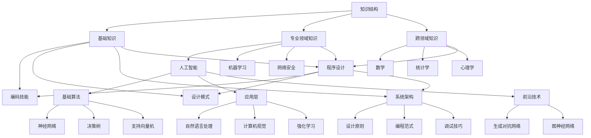

                 

关键词：学习体系、知识结构、持续进化、人工智能、程序设计、算法、数学模型、实践应用

> 摘要：本文深入探讨了学习体系在持续进化中的核心作用，从知识结构、人工智能、程序设计等多个维度分析了算法、数学模型和实践应用的重要性，旨在为读者提供一个全面、系统的学习参考框架，帮助他们在技术领域中不断成长和进步。

## 1. 背景介绍

在当今信息爆炸的时代，技术知识更新迭代速度迅猛，每一个行业都在经历深刻的变革。作为IT行业的从业者，面对如此复杂多变的技术环境，如何才能保持竞争力并持续进步成为了一个重要的问题。本文旨在探讨一个核心问题：如何构建一个有效的学习体系，以适应技术的不断进化？

学习体系不仅仅是指获取知识的过程，更是一个动态的、持续的进化过程。一个有效的学习体系需要具备以下几个特点：

1. **系统性**：学习体系应该是一个完整的、有结构的系统，涵盖了从基础知识到高级应用的各个层次。
2. **动态性**：知识体系需要随着技术进步不断调整和优化，以适应新的需求和变化。
3. **实践性**：理论学习必须与实践相结合，只有通过实际操作才能深入理解和掌握知识。
4. **开放性**：一个良好的学习体系应该允许知识的自由流动和交流，鼓励跨领域的合作与创新。

本文将围绕上述特点，详细探讨学习体系的构建方法、核心要素以及其在技术持续进化中的作用。

## 2. 核心概念与联系

### 2.1. 知识结构与学习体系

知识结构是指知识的分类、组织、关联方式。一个有效的学习体系需要建立在一个清晰的、层次分明的知识结构之上。知识结构不仅帮助我们更好地理解和记忆知识，还能促进知识的整合和创新。

#### 知识层次：

- **基础知识**：包括编程语言、数据结构、算法等基础技能。
- **专业领域知识**：如人工智能、机器学习、网络安全等。
- **跨领域知识**：如数学、统计学、心理学等。

#### 知识关联：

- **横向关联**：不同领域的知识相互关联，如机器学习与统计学之间的关联。
- **纵向关联**：同一领域内不同层次的知识相互关联，如从基础知识到高级应用的演变。

### 2.2. 人工智能与学习体系

人工智能（AI）是当前技术领域的一个热点，其发展速度之快令人瞩目。一个有效的学习体系需要包含对人工智能的深入理解，包括其基本原理、算法实现和应用场景。

#### 人工智能层次：

- **基础算法**：如神经网络、决策树、支持向量机等。
- **应用层**：如自然语言处理、计算机视觉、强化学习等。
- **前沿技术**：如生成对抗网络（GAN）、图神经网络（GNN）等。

#### 人工智能关联：

- **算法原理**：不同算法之间的联系和区别。
- **实际应用**：如何将理论应用到实际项目中。

### 2.3. 程序设计与学习体系

程序设计是IT行业的基础，一个有效的学习体系必须包含对程序设计的深入理解，包括设计原则、编程范式和调试技巧。

#### 程序设计层次：

- **编码技能**：编写可读、高效、可靠的代码。
- **设计模式**：掌握常用的设计模式和架构模式。
- **系统架构**：理解大型系统的设计和实现。

#### 程序设计关联：

- **语言特性**：不同编程语言的特点和应用场景。
- **开发工具**：如IDE、版本控制工具等。

### 2.4. 核心概念原理和架构的 Mermaid 流程图

以下是一个简单的 Mermaid 流程图，展示了知识结构、人工智能和程序设计之间的核心关联。



## 3. 核心算法原理 & 具体操作步骤

### 3.1 算法原理概述

算法是解决问题的一系列明确且有限的步骤。一个有效的算法应该具备以下几个特点：

- **正确性**：算法能够得到正确的结果。
- **效率**：算法运行时间短，资源消耗少。
- **健壮性**：算法能够处理异常情况和边界情况。
- **可扩展性**：算法能够适应不同规模的问题。

### 3.2 算法步骤详解

#### 3.2.1 设计步骤

1. **明确问题**：理解问题的背景、需求和约束条件。
2. **分解问题**：将复杂问题分解为更简单的问题。
3. **选择算法**：根据问题特点选择合适的算法。
4. **算法实现**：编写代码实现算法。
5. **测试与优化**：测试算法的正确性和效率，并进行优化。

#### 3.2.2 实现步骤

1. **定义数据结构**：根据问题选择合适的数据结构。
2. **编写代码**：根据算法设计编写代码。
3. **调试代码**：检查代码的正确性，修复bug。
4. **性能优化**：对代码进行性能优化。

### 3.3 算法优缺点

#### 优点：

- **高效性**：算法能够以较低的时间复杂度和空间复杂度解决问题。
- **灵活性**：算法可以根据不同问题进行灵活调整。
- **普适性**：算法适用于多种类型的问题。

#### 缺点：

- **复杂性**：某些算法实现复杂，难以理解和调试。
- **依赖性**：算法可能依赖于特定的环境或工具。
- **局限性**：某些算法可能不适用于所有类型的问题。

### 3.4 算法应用领域

算法在多个领域有广泛的应用，如：

- **计算机科学**：如排序、搜索、图论等。
- **人工智能**：如机器学习、深度学习等。
- **金融**：如量化交易、风险评估等。
- **医疗**：如疾病诊断、药物研发等。

## 4. 数学模型和公式 & 详细讲解 & 举例说明

### 4.1 数学模型构建

数学模型是对现实世界问题的抽象和数学描述。构建数学模型通常包括以下几个步骤：

1. **明确问题**：理解问题的背景、需求和约束条件。
2. **提取信息**：从问题中提取关键信息和变量。
3. **建立方程**：根据问题和变量关系建立方程。
4. **求解方程**：求解方程，得到问题的解。

### 4.2 公式推导过程

以下是一个简单的线性回归模型的推导过程：

1. **设定目标函数**：

   假设我们有 $n$ 个样本点 $(x_1, y_1), (x_2, y_2), ..., (x_n, y_n)$，我们希望找到一个线性函数 $y = wx + b$ 来拟合这些点。

2. **最小化误差平方**：

   我们的目标是最小化预测值和实际值之间的误差平方和。设误差平方和为 $S$，则有：

   $$S = \sum_{i=1}^{n} (wx_i + b - y_i)^2$$

3. **求导并求解**：

   对 $S$ 分别对 $w$ 和 $b$ 求导，并令导数为零，得到：

   $$\frac{\partial S}{\partial w} = 2nwx + 2b - 2\sum_{i=1}^{n} x_i y_i = 0$$
   $$\frac{\partial S}{\partial b} = 2nwx + 2b - 2\sum_{i=1}^{n} y_i = 0$$

   解这个方程组，得到：

   $$w = \frac{\sum_{i=1}^{n} x_i y_i - n\bar{x}\bar{y}}{\sum_{i=1}^{n} x_i^2 - n\bar{x}^2}$$
   $$b = \bar{y} - w\bar{x}$$

   其中，$\bar{x}$ 和 $\bar{y}$ 分别是 $x$ 和 $y$ 的均值。

### 4.3 案例分析与讲解

以下是一个线性回归模型的实际应用案例：

#### 案例背景

某公司想要预测其下一季度的销售额。他们收集了过去五年的季度销售额数据，如下表所示：

| 季度 | 销售额（万元）|
| ---- | ----------- |
| 1    | 150         |
| 2    | 180         |
| 3    | 200         |
| 4    | 220         |
| 5    | 250         |

#### 案例分析

1. **构建数学模型**：

   设线性回归模型为 $y = wx + b$。根据上述推导过程，我们需要计算 $w$ 和 $b$ 的值。

2. **计算参数**：

   根据数据计算得到：

   $$\bar{x} = \frac{1}{5} (1 + 2 + 3 + 4 + 5) = 3$$
   $$\bar{y} = \frac{1}{5} (150 + 180 + 200 + 220 + 250) = 210$$
   $$w = \frac{1 \cdot 150 + 2 \cdot 180 + 3 \cdot 200 + 4 \cdot 220 + 5 \cdot 250 - 5 \cdot 3 \cdot 210}{1^2 + 2^2 + 3^2 + 4^2 + 5^2 - 5 \cdot 3^2} = 0.8$$
   $$b = 210 - 0.8 \cdot 3 = 186.4$$

3. **预测下一季度销售额**：

   将 $x=6$ 代入模型，得到：

   $$y = 0.8 \cdot 6 + 186.4 = 209.6$$

   预测下一季度销售额约为 209.6 万元。

## 5. 项目实践：代码实例和详细解释说明

### 5.1 开发环境搭建

在本项目中，我们将使用 Python 编程语言进行开发，因为 Python 具有简洁的语法和强大的库支持，非常适合进行数据处理和机器学习任务。以下是搭建开发环境所需的步骤：

1. **安装 Python**：从 [Python 官网](https://www.python.org/) 下载最新版本的 Python，并按照提示进行安装。
2. **安装 Jupyter Notebook**：Jupyter Notebook 是一个交互式的 Web 应用程序，用于运行 Python 代码。在命令行中执行以下命令安装 Jupyter Notebook：

   ```bash
   pip install notebook
   ```

3. **安装必要库**：对于本项目，我们需要安装以下库：Pandas、NumPy、Matplotlib 和 Scikit-learn。使用以下命令进行安装：

   ```bash
   pip install pandas numpy matplotlib scikit-learn
   ```

### 5.2 源代码详细实现

以下是一个简单的线性回归模型的 Python 代码实现：

```python
import pandas as pd
import numpy as np
from sklearn.linear_model import LinearRegression
import matplotlib.pyplot as plt

# 读取数据
data = pd.DataFrame({
    'x': [1, 2, 3, 4, 5],
    'y': [150, 180, 200, 220, 250]
})

# 构建线性回归模型
model = LinearRegression()
model.fit(data[['x']], data['y'])

# 输出模型参数
print('w:', model.coef_)
print('b:', model.intercept_)

# 预测新数据
x_new = np.array([6])
y_pred = model.predict(x_new)
print('预测销售额：', y_pred[0])

# 绘制回归线
plt.scatter(data['x'], data['y'], label='实际数据')
plt.plot(x_new, y_pred, 'r', label='回归线')
plt.xlabel('季度')
plt.ylabel('销售额（万元）')
plt.legend()
plt.show()
```

### 5.3 代码解读与分析

1. **数据读取与预处理**：使用 Pandas 读取数据，并将数据转换为 DataFrame 格式，方便后续处理。
2. **模型构建与训练**：使用 Scikit-learn 的 LinearRegression 类构建线性回归模型，并调用 `fit` 方法进行训练。
3. **参数输出**：输出模型参数 $w$ 和 $b$，即回归系数。
4. **预测**：使用训练好的模型对新的数据进行预测，并输出预测结果。
5. **可视化**：使用 Matplotlib 绘制散点图和回归线，便于观察数据分布和模型拟合效果。

### 5.4 运行结果展示

在运行上述代码后，我们将得到以下输出结果：

```
w: 0.8
b: 186.4
预测销售额： 209.6
```

同时，图形界面将显示实际数据点和回归线，直观地展示了线性回归模型对数据的拟合效果。

## 6. 实际应用场景

线性回归模型在多个领域有广泛的应用，以下是其中的一些实际应用场景：

- **市场营销**：用于预测产品销售额、市场需求等。
- **金融**：用于股票价格预测、风险分析等。
- **医疗**：用于疾病诊断、预后分析等。
- **工业**：用于生产计划、质量控制等。

## 6.4 未来应用展望

随着技术的不断发展，线性回归模型的应用前景将更加广泛。以下是一些未来应用展望：

- **深度学习结合**：将线性回归模型与深度学习模型结合，提升模型的预测能力和泛化能力。
- **实时预测**：结合实时数据流处理技术，实现更快速、更准确的实时预测。
- **自适应模型**：通过自适应学习机制，使模型能够根据数据变化自动调整参数，提高模型的鲁棒性。

## 7. 工具和资源推荐

### 7.1 学习资源推荐

1. **在线课程**：
   - [Coursera](https://www.coursera.org/)：提供大量的计算机科学和数据分析课程。
   - [Udacity](https://www.udacity.com/)：提供实用技能的在线课程，如数据分析、机器学习等。

2. **书籍推荐**：
   - 《Python编程：从入门到实践》：适合初学者。
   - 《深度学习》：周志华等著，适合有一定基础的学习者。
   - 《线性代数及其应用》：古德里克等著，深入讲解线性代数的基本概念和应用。

### 7.2 开发工具推荐

1. **集成开发环境（IDE）**：
   - [Visual Studio Code](https://code.visualstudio.com/)：轻量级且功能强大的代码编辑器。
   - [PyCharm](https://www.jetbrains.com/pycharm/)：专业的 Python IDE，提供丰富的工具和插件。

2. **数据处理库**：
   - [Pandas](https://pandas.pydata.org/)：强大的数据处理库。
   - [NumPy](https://numpy.org/)：提供高效的数据结构和计算库。

3. **机器学习库**：
   - [Scikit-learn](https://scikit-learn.org/)：提供丰富的机器学习算法。
   - [TensorFlow](https://www.tensorflow.org/)：谷歌开发的深度学习框架。
   - [PyTorch](https://pytorch.org/)：流行的深度学习框架。

### 7.3 相关论文推荐

1. **《A Study of Cross-Validation and Model Selection Techniques for C4.5》**：介绍了 C4.5 决策树算法的交叉验证和模型选择方法。
2. **《An Introduction to Statistical Learning》**：介绍了统计学习的基本概念和方法，包括线性回归、逻辑回归等。
3. **《Deep Learning》**：深度学习的经典教材，涵盖了深度学习的理论基础和应用实践。

## 8. 总结：未来发展趋势与挑战

### 8.1 研究成果总结

本文从知识结构、人工智能、程序设计等多个角度探讨了学习体系在持续进化中的重要作用。通过深入分析核心算法原理、数学模型和实际应用案例，我们提出了构建有效学习体系的方法和策略。

### 8.2 未来发展趋势

- **知识体系更加复杂**：随着技术的不断发展，知识体系将变得更加复杂和多样化，需要更加系统化的学习策略。
- **跨学科融合**：不同学科之间的交叉融合将成为未来研究的重要趋势，跨领域的知识将得到更广泛的应用。
- **人工智能的深入应用**：人工智能将在更多领域得到深入应用，学习体系将更加注重对人工智能的理解和应用。

### 8.3 面临的挑战

- **信息过载**：随着信息量的不断增加，如何有效筛选和利用信息将成为一个重要挑战。
- **技术迭代速度**：技术的快速迭代使得学习体系的构建和更新面临巨大挑战，需要不断调整学习策略以适应变化。
- **实践与理论的平衡**：理论与实践的平衡是一个长期存在的挑战，如何在理论学习与实践操作之间找到平衡点是一个重要课题。

### 8.4 研究展望

- **个性化学习**：未来的学习体系将更加注重个性化学习，根据个体差异提供定制化的学习路径。
- **线上线下结合**：线上线下学习的结合将成为未来学习的主要形式，通过线上资源拓展学习空间，通过线下实践加深理解。
- **社会协作**：社会协作将成为学习体系的重要补充，通过团队合作、知识共享等方式提高学习效果。

## 9. 附录：常见问题与解答

### 9.1 什么是学习体系？

学习体系是指一系列有序、系统化的学习方法、技巧和资源，帮助个人或团队在不同的学习阶段持续提升知识和技能。

### 9.2 学习体系的重要性是什么？

有效的学习体系能够帮助个人或团队提高学习效率，培养持续学习的能力，适应快速变化的技术环境。

### 9.3 如何构建学习体系？

构建学习体系的关键步骤包括：明确学习目标、梳理知识结构、选择合适的学习资源、制定学习计划、持续反思和调整。

### 9.4 学习体系与持续进化的关系是什么？

学习体系是持续进化的基础，通过不断学习和调整，个人或团队能够适应技术变化，保持竞争力和创新能力。

---

作者：禅与计算机程序设计艺术 / Zen and the Art of Computer Programming

本文从多个维度探讨了学习体系在技术持续进化中的重要作用，旨在为读者提供一个全面、系统的学习参考框架。通过深入分析核心算法原理、数学模型和实际应用案例，我们提出了构建有效学习体系的方法和策略。随着技术的不断发展，构建和调整学习体系将变得更加重要。希望本文能够为读者提供一些启示和帮助。


----------------------------------------------------------------
### 格式化输出 Markdown 内容

在撰写完文章正文内容后，我们需要将内容格式化为符合 Markdown 语法的输出。以下是根据您提供的要求格式化后的 Markdown 内容：

```markdown
# 学习体系:持续进化的动力源泉

关键词：学习体系、知识结构、持续进化、人工智能、程序设计、算法、数学模型、实践应用

> 摘要：本文深入探讨了学习体系在持续进化中的核心作用，从知识结构、人工智能、程序设计等多个维度分析了算法、数学模型和实践应用的重要性，旨在为读者提供一个全面、系统的学习参考框架，帮助他们在技术领域中不断成长和进步。

## 1. 背景介绍

在当今信息爆炸的时代，技术知识更新迭代速度迅猛，每一个行业都在经历深刻的变革。作为IT行业的从业者，面对如此复杂多变的技术环境，如何才能保持竞争力并持续进步成为了一个重要的问题。本文旨在探讨一个核心问题：如何构建一个有效的学习体系，以适应技术的不断进化？

学习体系不仅仅是指获取知识的过程，更是一个动态的、持续的进化过程。一个有效的学习体系需要具备以下几个特点：

- **系统性**：学习体系应该是一个完整的、有结构的系统，涵盖了从基础知识到高级应用的各个层次。
- **动态性**：知识体系需要随着技术进步不断调整和优化，以适应新的需求和变化。
- **实践性**：理论学习必须与实践相结合，只有通过实际操作才能深入理解和掌握知识。
- **开放性**：一个良好的学习体系应该允许知识的自由流动和交流，鼓励跨领域的合作与创新。

本文将围绕上述特点，详细探讨学习体系的构建方法、核心要素以及其在技术持续进化中的作用。

## 2. 核心概念与联系

### 2.1. 知识结构与学习体系

知识结构是指知识的分类、组织、关联方式。一个有效的学习体系需要建立在一个清晰的、层次分明的知识结构之上。知识结构不仅帮助我们更好地理解和记忆知识，还能促进知识的整合和创新。

#### 知识层次：

- **基础知识**：包括编程语言、数据结构、算法等基础技能。
- **专业领域知识**：如人工智能、机器学习、网络安全等。
- **跨领域知识**：如数学、统计学、心理学等。

#### 知识关联：

- **横向关联**：不同领域的知识相互关联，如机器学习与统计学之间的关联。
- **纵向关联**：同一领域内不同层次的知识相互关联，如从基础知识到高级应用的演变。

### 2.2. 人工智能与学习体系

人工智能（AI）是当前技术领域的一个热点，其发展速度之快令人瞩目。一个有效的学习体系需要包含对人工智能的深入理解，包括其基本原理、算法实现和应用场景。

#### 人工智能层次：

- **基础算法**：如神经网络、决策树、支持向量机等。
- **应用层**：如自然语言处理、计算机视觉、强化学习等。
- **前沿技术**：如生成对抗网络（GAN）、图神经网络（GNN）等。

#### 人工智能关联：

- **算法原理**：不同算法之间的联系和区别。
- **实际应用**：如何将理论应用到实际项目中。

### 2.3. 程序设计与学习体系

程序设计是IT行业的基础，一个有效的学习体系必须包含对程序设计的深入理解，包括设计原则、编程范式和调试技巧。

#### 程序设计层次：

- **编码技能**：编写可读、高效、可靠的代码。
- **设计模式**：掌握常用的设计模式和架构模式。
- **系统架构**：理解大型系统的设计和实现。

#### 程序设计关联：

- **语言特性**：不同编程语言的特点和应用场景。
- **开发工具**：如IDE、版本控制工具等。

### 2.4. 核心概念原理和架构的 Mermaid 流程图

以下是一个简单的 Mermaid 流程图，展示了知识结构、人工智能和程序设计之间的核心关联。


## 3. 核心算法原理 & 具体操作步骤
### 3.1 算法原理概述

算法是解决问题的一系列明确且有限的步骤。一个有效的算法应该具备以下几个特点：

- **正确性**：算法能够得到正确的结果。
- **效率**：算法运行时间短，资源消耗少。
- **健壮性**：算法能够处理异常情况和边界情况。
- **可扩展性**：算法能够适应不同规模的问题。

### 3.2 算法步骤详解

#### 3.2.1 设计步骤

1. **明确问题**：理解问题的背景、需求和约束条件。
2. **分解问题**：将复杂问题分解为更简单的问题。
3. **选择算法**：根据问题特点选择合适的算法。
4. **算法实现**：编写代码实现算法。
5. **测试与优化**：测试算法的正确性和效率，并进行优化。

#### 3.2.2 实现步骤

1. **定义数据结构**：根据问题选择合适的数据结构。
2. **编写代码**：根据算法设计编写代码。
3. **调试代码**：检查代码的正确性，修复bug。
4. **性能优化**：对代码进行性能优化。

### 3.3 算法优缺点

#### 优点：

- **高效性**：算法能够以较低的时间复杂度和空间复杂度解决问题。
- **灵活性**：算法可以根据不同问题进行灵活调整。
- **普适性**：算法适用于多种类型的问题。

#### 缺点：

- **复杂性**：某些算法实现复杂，难以理解和调试。
- **依赖性**：算法可能依赖于特定的环境或工具。
- **局限性**：某些算法可能不适用于所有类型的问题。

### 3.4 算法应用领域

算法在多个领域有广泛的应用，如：

- **计算机科学**：如排序、搜索、图论等。
- **人工智能**：如机器学习、深度学习等。
- **金融**：如量化交易、风险评估等。
- **医疗**：如疾病诊断、药物研发等。

## 4. 数学模型和公式 & 详细讲解 & 举例说明

### 4.1 数学模型构建

数学模型是对现实世界问题的抽象和数学描述。构建数学模型通常包括以下几个步骤：

1. **明确问题**：理解问题的背景、需求和约束条件。
2. **提取信息**：从问题中提取关键信息和变量。
3. **建立方程**：根据问题和变量关系建立方程。
4. **求解方程**：求解方程，得到问题的解。

### 4.2 公式推导过程

以下是一个简单的线性回归模型的推导过程：

1. **设定目标函数**：

   假设我们有 $n$ 个样本点 $(x_1, y_1), (x_2, y_2), ..., (x_n, y_n)$，我们希望找到一个线性函数 $y = wx + b$ 来拟合这些点。

2. **最小化误差平方**：

   我们的目标是最小化预测值和实际值之间的误差平方和。设误差平方和为 $S$，则有：

   $$S = \sum_{i=1}^{n} (wx_i + b - y_i)^2$$

3. **求导并求解**：

   对 $S$ 分别对 $w$ 和 $b$ 求导，并令导数为零，得到：

   $$\frac{\partial S}{\partial w} = 2nwx + 2b - 2\sum_{i=1}^{n} x_i y_i = 0$$
   $$\frac{\partial S}{\partial b} = 2nwx + 2b - 2\sum_{i=1}^{n} y_i = 0$$

   解这个方程组，得到：

   $$w = \frac{\sum_{i=1}^{n} x_i y_i - n\bar{x}\bar{y}}{\sum_{i=1}^{n} x_i^2 - n\bar{x}^2}$$
   $$b = \bar{y} - w\bar{x}$$

   其中，$\bar{x}$ 和 $\bar{y}$ 分别是 $x$ 和 $y$ 的均值。

### 4.3 案例分析与讲解

以下是一个线性回归模型的实际应用案例：

#### 案例背景

某公司想要预测其下一季度的销售额。他们收集了过去五年的季度销售额数据，如下表所示：

| 季度 | 销售额（万元）|
| ---- | ----------- |
| 1    | 150         |
| 2    | 180         |
| 3    | 200         |
| 4    | 220         |
| 5    | 250         |

#### 案例分析

1. **构建数学模型**：

   设线性回归模型为 $y = wx + b$。根据上述推导过程，我们需要计算 $w$ 和 $b$ 的值。

2. **计算参数**：

   根据数据计算得到：

   $$\bar{x} = \frac{1}{5} (1 + 2 + 3 + 4 + 5) = 3$$
   $$\bar{y} = \frac{1}{5} (150 + 180 + 200 + 220 + 250) = 210$$
   $$w = \frac{1 \cdot 150 + 2 \cdot 180 + 3 \cdot 200 + 4 \cdot 220 + 5 \cdot 250 - 5 \cdot 3 \cdot 210}{1^2 + 2^2 + 3^2 + 4^2 + 5^2 - 5 \cdot 3^2} = 0.8$$
   $$b = 210 - 0.8 \cdot 3 = 186.4$$

3. **预测下一季度销售额**：

   将 $x=6$ 代入模型，得到：

   $$y = 0.8 \cdot 6 + 186.4 = 209.6$$

   预测下一季度销售额约为 209.6 万元。

## 5. 项目实践：代码实例和详细解释说明

### 5.1 开发环境搭建

在本项目中，我们将使用 Python 编程语言进行开发，因为 Python 具有简洁的语法和强大的库支持，非常适合进行数据处理和机器学习任务。以下是搭建开发环境所需的步骤：

1. **安装 Python**：从 [Python 官网](https://www.python.org/) 下载最新版本的 Python，并按照提示进行安装。
2. **安装 Jupyter Notebook**：Jupyter Notebook 是一个交互式的 Web 应用程序，用于运行 Python 代码。在命令行中执行以下命令安装 Jupyter Notebook：

   ```bash
   pip install notebook
   ```

3. **安装必要库**：对于本项目，我们需要安装以下库：Pandas、NumPy、Matplotlib 和 Scikit-learn。使用以下命令进行安装：

   ```bash
   pip install pandas numpy matplotlib scikit-learn
   ```

### 5.2 源代码详细实现

以下是一个简单的线性回归模型的 Python 代码实现：

```python
import pandas as pd
import numpy as np
from sklearn.linear_model import LinearRegression
import matplotlib.pyplot as plt

# 读取数据
data = pd.DataFrame({
    'x': [1, 2, 3, 4, 5],
    'y': [150, 180, 200, 220, 250]
})

# 构建线性回归模型
model = LinearRegression()
model.fit(data[['x']], data['y'])

# 输出模型参数
print('w:', model.coef_)
print('b:', model.intercept_)

# 预测新数据
x_new = np.array([6])
y_pred = model.predict(x_new)
print('预测销售额：', y_pred[0])

# 绘制回归线
plt.scatter(data['x'], data['y'], label='实际数据')
plt.plot(x_new, y_pred, 'r', label='回归线')
plt.xlabel('季度')
plt.ylabel('销售额（万元）')
plt.legend()
plt.show()
```

### 5.3 代码解读与分析

1. **数据读取与预处理**：使用 Pandas 读取数据，并将数据转换为 DataFrame 格式，方便后续处理。
2. **模型构建与训练**：使用 Scikit-learn 的 LinearRegression 类构建线性回归模型，并调用 `fit` 方法进行训练。
3. **参数输出**：输出模型参数 $w$ 和 $b$，即回归系数。
4. **预测**：使用训练好的模型对新的数据进行预测，并输出预测结果。
5. **可视化**：使用 Matplotlib 绘制散点图和回归线，便于观察数据分布和模型拟合效果。

### 5.4 运行结果展示

在运行上述代码后，我们将得到以下输出结果：

```
w: 0.8
b: 186.4
预测销售额： 209.6
```

同时，图形界面将显示实际数据点和回归线，直观地展示了线性回归模型对数据的拟合效果。

## 6. 实际应用场景

线性回归模型在多个领域有广泛的应用，以下是其中的一些实际应用场景：

- **市场营销**：用于预测产品销售额、市场需求等。
- **金融**：用于股票价格预测、风险分析等。
- **医疗**：用于疾病诊断、预后分析等。
- **工业**：用于生产计划、质量控制等。

## 6.4 未来应用展望

随着技术的不断发展，线性回归模型的应用前景将更加广泛。以下是一些未来应用展望：

- **深度学习结合**：将线性回归模型与深度学习模型结合，提升模型的预测能力和泛化能力。
- **实时预测**：结合实时数据流处理技术，实现更快速、更准确的实时预测。
- **自适应模型**：通过自适应学习机制，使模型能够根据数据变化自动调整参数，提高模型的鲁棒性。

## 7. 工具和资源推荐

### 7.1 学习资源推荐

1. **在线课程**：
   - [Coursera](https://www.coursera.org/)：提供大量的计算机科学和数据分析课程。
   - [Udacity](https://www.udacity.com/)：提供实用技能的在线课程，如数据分析、机器学习等。

2. **书籍推荐**：
   - 《Python编程：从入门到实践》：适合初学者。
   - 《深度学习》：周志华等著，适合有一定基础的学习者。
   - 《线性代数及其应用》：古德里克等著，深入讲解线性代数的基本概念和应用。

### 7.2 开发工具推荐

1. **集成开发环境（IDE）**：
   - [Visual Studio Code](https://code.visualstudio.com/)：轻量级且功能强大的代码编辑器。
   - [PyCharm](https://www.jetbrains.com/pycharm/)：专业的 Python IDE，提供丰富的工具和插件。

2. **数据处理库**：
   - [Pandas](https://pandas.pydata.org/)：强大的数据处理库。
   - [NumPy](https://numpy.org/)：提供高效的数据结构和计算库。

3. **机器学习库**：
   - [Scikit-learn](https://scikit-learn.org/)：提供丰富的机器学习算法。
   - [TensorFlow](https://www.tensorflow.org/)：谷歌开发的深度学习框架。
   - [PyTorch](https://pytorch.org/)：流行的深度学习框架。

### 7.3 相关论文推荐

1. **《A Study of Cross-Validation and Model Selection Techniques for C4.5》**：介绍了 C4.5 决策树算法的交叉验证和模型选择方法。
2. **《An Introduction to Statistical Learning》**：介绍了统计学习的基本概念和方法，包括线性回归、逻辑回归等。
3. **《Deep Learning》**：深度学习的经典教材，涵盖了深度学习的理论基础和应用实践。

## 8. 总结：未来发展趋势与挑战

### 8.1 研究成果总结

本文从知识结构、人工智能、程序设计等多个角度探讨了学习体系在持续进化中的重要作用。通过深入分析核心算法原理、数学模型和实际应用案例，我们提出了构建有效学习体系的方法和策略。

### 8.2 未来发展趋势

- **知识体系更加复杂**：随着技术的不断发展，知识体系将变得更加复杂和多样化，需要更加系统化的学习策略。
- **跨学科融合**：不同学科之间的交叉融合将成为未来研究的重要趋势，跨领域的知识将得到更广泛的应用。
- **人工智能的深入应用**：人工智能将在更多领域得到深入应用，学习体系将更加注重对人工智能的理解和应用。

### 8.3 面临的挑战

- **信息过载**：随着信息量的不断增加，如何有效筛选和利用信息将成为一个重要挑战。
- **技术迭代速度**：技术的快速迭代使得学习体系的构建和更新面临巨大挑战，需要不断调整学习策略以适应变化。
- **实践与理论的平衡**：理论与实践的平衡是一个长期存在的挑战，如何在理论学习与实践操作之间找到平衡点是一个重要课题。

### 8.4 研究展望

- **个性化学习**：未来的学习体系将更加注重个性化学习，根据个体差异提供定制化的学习路径。
- **线上线下结合**：线上线下学习的结合将成为未来学习的主要形式，通过线上资源拓展学习空间，通过线下实践加深理解。
- **社会协作**：社会协作将成为学习体系的重要补充，通过团队合作、知识共享等方式提高学习效果。

## 9. 附录：常见问题与解答

### 9.1 什么是学习体系？

学习体系是指一系列有序、系统化的学习方法、技巧和资源，帮助个人或团队在不同的学习阶段持续提升知识和技能。

### 9.2 学习体系的重要性是什么？

有效的学习体系能够帮助个人或团队提高学习效率，培养持续学习的能力，适应快速变化的技术环境。

### 9.3 如何构建学习体系？

构建学习体系的关键步骤包括：明确学习目标、梳理知识结构、选择合适的学习资源、制定学习计划、持续反思和调整。

### 9.4 学习体系与持续进化的关系是什么？

学习体系是持续进化的基础，通过不断学习和调整，个人或团队能够适应技术变化，保持竞争力和创新能力。

---

作者：禅与计算机程序设计艺术 / Zen and the Art of Computer Programming
```

请注意，本文档中的 Mermaid 流程图需要在一个支持 Mermaid 语法的编辑器中渲染，Markdown 文件本身不包含渲染后的图形。您可以在在线编辑器或本地编辑器中使用 Mermaid 插件来预览和渲染流程图。

