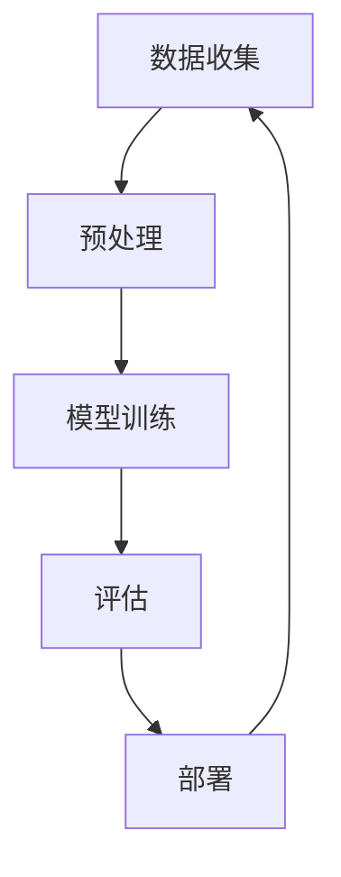

                 

关键词：学习体系、持续进化、人工智能、算法原理、数学模型、项目实践、应用场景、未来展望

> 摘要：本文深入探讨了学习体系在人工智能领域中的关键作用，分析了持续进化的源动力。通过核心概念与算法原理的详细阐述，结合数学模型和实际项目实践，本文提出了未来人工智能发展的趋势与挑战，并给出了相应的解决方案和建议。

## 1. 背景介绍

随着信息技术的飞速发展，人工智能（AI）已经成为现代社会的重要驱动力。从简单的专家系统到复杂的深度学习模型，人工智能技术已经渗透到各行各业，极大地改变了人类的生活方式。然而，人工智能的发展并非一蹴而就，而是依赖于一个强大的学习体系。学习体系是人工智能持续进化的源动力，它决定了算法的效率、准确性和创新性。

本文将围绕学习体系展开，从核心概念、算法原理、数学模型、项目实践等多个方面深入探讨人工智能的持续进化过程。希望通过本文，读者能够对人工智能的学习体系有一个全面而深入的理解，从而为未来的研究与实践提供有力支持。

## 2. 核心概念与联系

### 2.1 学习体系的定义

学习体系是指用于实现人工智能模型不断学习和优化的一系列方法和工具。它包括数据收集、预处理、模型训练、评估和部署等多个环节。学习体系的核心目标是使人工智能模型能够从数据中提取知识，并在实际应用中不断改进。

### 2.2 核心概念原理

2.2.1 数据收集

数据是人工智能学习的基础。数据收集的过程涉及从各种来源获取大量信息，包括文本、图像、声音和传感器数据等。数据的质量直接影响学习效果，因此数据收集过程必须保证数据的完整性和准确性。

2.2.2 预处理

预处理是将原始数据转换成适合模型训练的形式。这一过程包括数据清洗、归一化、特征提取等。预处理的质量对模型性能有重要影响，因此需要精心设计和实施。

2.2.3 模型训练

模型训练是学习体系的核心环节。通过训练，模型可以从数据中学习到特征和规律，从而实现对未知数据的预测和分类。模型训练过程中，算法的选择和参数的调整至关重要。

2.2.4 评估与部署

评估是对模型性能的检验，包括准确率、召回率、F1分数等指标。部署是将训练好的模型应用到实际场景中，实现人工智能的实际应用。评估和部署环节的反馈对学习体系不断优化具有重要意义。

### 2.3 学习体系架构的 Mermaid 流程图



## 3. 核心算法原理 & 具体操作步骤

### 3.1 算法原理概述

学习体系的算法原理主要包括监督学习、无监督学习和强化学习等。其中，监督学习是基于已有标记数据进行学习，无监督学习是基于未标记数据进行学习，强化学习是基于奖励机制进行学习。每种学习方式都有其独特的优势和适用场景。

### 3.2 算法步骤详解

3.2.1 监督学习

监督学习的基本步骤包括：

1. 数据收集：收集带有标记的样本数据。
2. 数据预处理：对数据进行清洗、归一化等预处理操作。
3. 模型选择：选择合适的模型，如线性回归、决策树、神经网络等。
4. 模型训练：使用训练数据对模型进行训练，优化模型参数。
5. 模型评估：使用验证数据对模型进行评估，调整模型参数。
6. 部署：将训练好的模型应用到实际场景中。

3.2.2 无监督学习

无监督学习的基本步骤包括：

1. 数据收集：收集未标记的样本数据。
2. 数据预处理：对数据进行清洗、归一化等预处理操作。
3. 模型选择：选择合适的模型，如聚类算法、降维算法等。
4. 模型训练：使用训练数据对模型进行训练，优化模型参数。
5. 模型评估：使用验证数据对模型进行评估，调整模型参数。
6. 部署：将训练好的模型应用到实际场景中。

3.2.3 强化学习

强化学习的基本步骤包括：

1. 环境构建：构建一个模拟环境，用于与智能体进行交互。
2. 智能体设计：设计一个智能体，用于与环境交互，并学习最优策略。
3. 奖励机制：定义奖励机制，用于评价智能体的表现。
4. 智能体训练：使用奖励机制对智能体进行训练，优化策略。
5. 模型评估：评估智能体的性能，调整策略。
6. 部署：将训练好的智能体应用到实际场景中。

### 3.3 算法优缺点

3.3.1 监督学习

优点：

- 能够快速获得准确的结果。
- 适用于有标记数据的情况。

缺点：

- 对标记数据有较高的依赖。
- 难以应对复杂和非线性问题。

3.3.2 无监督学习

优点：

- 不依赖于标记数据。
- 能够发现数据中的隐含规律。

缺点：

- 结果可能不如监督学习准确。
- 难以解释模型背后的原理。

3.3.3 强化学习

优点：

- 能够处理复杂和非线性问题。
- 能够自适应地学习。

缺点：

- 需要大量的训练数据和时间。
- 难以解释学习过程中的决策。

### 3.4 算法应用领域

监督学习广泛应用于图像识别、自然语言处理、金融预测等领域。无监督学习在数据降维、聚类分析、推荐系统等领域有广泛应用。强化学习在游戏AI、机器人控制、智能交通等领域展现出巨大潜力。

## 4. 数学模型和公式 & 详细讲解 & 举例说明

### 4.1 数学模型构建

4.1.1 监督学习

监督学习中的数学模型通常包括损失函数、优化算法等。以线性回归为例，其数学模型为：

$$
y = \beta_0 + \beta_1 x
$$

其中，$y$ 为预测值，$x$ 为输入特征，$\beta_0$ 和 $\beta_1$ 为模型参数。损失函数通常为均方误差（MSE）：

$$
J(\beta_0, \beta_1) = \frac{1}{2n} \sum_{i=1}^{n} (y_i - (\beta_0 + \beta_1 x_i))^2
$$

4.1.2 无监督学习

无监督学习中的数学模型通常包括聚类算法、降维算法等。以K-Means聚类为例，其数学模型为：

$$
c_k = \frac{1}{n_k} \sum_{i=1}^{n} x_i
$$

其中，$c_k$ 为聚类中心，$x_i$ 为样本数据，$n_k$ 为聚类中心$k$ 对应的样本数量。

4.1.3 强化学习

强化学习中的数学模型通常包括状态-动作值函数、策略等。以Q-Learning为例，其数学模型为：

$$
Q(s, a) = r + \gamma \max_{a'} Q(s', a')
$$

其中，$s$ 为状态，$a$ 为动作，$r$ 为即时奖励，$\gamma$ 为折扣因子，$s'$ 和 $a'$ 为下一状态和动作。

### 4.2 公式推导过程

4.2.1 线性回归

以最小二乘法为例，推导线性回归的参数估计。首先，假设有$m$ 个样本数据$(x_i, y_i)$，则线性回归模型为：

$$
y = \beta_0 + \beta_1 x
$$

损失函数为均方误差（MSE）：

$$
J(\beta_0, \beta_1) = \frac{1}{2n} \sum_{i=1}^{n} (y_i - (\beta_0 + \beta_1 x_i))^2
$$

对损失函数求导并令导数为零，得到参数的梯度：

$$
\nabla_{\beta_0} J = \frac{1}{n} \sum_{i=1}^{n} (y_i - (\beta_0 + \beta_1 x_i)) = 0
$$

$$
\nabla_{\beta_1} J = \frac{1}{n} \sum_{i=1}^{n} (y_i - (\beta_0 + \beta_1 x_i)) x_i = 0
$$

解上述方程组，得到参数的最小二乘估计：

$$
\beta_0 = \bar{y} - \beta_1 \bar{x}
$$

$$
\beta_1 = \frac{\sum_{i=1}^{n} (x_i - \bar{x})(y_i - \bar{y})}{\sum_{i=1}^{n} (x_i - \bar{x})^2}
$$

4.2.2 K-Means聚类

以K-Means聚类为例，推导聚类中心的更新公式。首先，给定$m$ 个样本数据$X = [x_1, x_2, ..., x_m]$，初始聚类中心为$c_1, c_2, ..., c_k$，则每个样本$x_i$ 被分配到最近的聚类中心$c_j$，即：

$$
j = \arg\min_{1 \leq j \leq k} \|x_i - c_j\|
$$

然后，更新聚类中心为：

$$
c_j = \frac{1}{n_j} \sum_{i=1}^{n} x_i
$$

其中，$n_j$ 为聚类中心$c_j$ 对应的样本数量。

4.2.3 Q-Learning

以Q-Learning为例，推导状态-动作值函数的更新公式。首先，给定状态集$S$、动作集$A$ 和奖励函数$R$，初始状态-动作值函数为$Q(s, a)$，学习率为$\alpha$，折扣因子为$\gamma$，则状态-动作值函数的更新公式为：

$$
Q(s, a) = Q(s, a) + \alpha [R(s, a) + \gamma \max_{a'} Q(s', a') - Q(s, a)]
$$

### 4.3 案例分析与讲解

4.3.1 线性回归案例分析

以房价预测为例，使用线性回归模型预测房价。给定$m$ 个样本数据$(x_i, y_i)$，其中$x_i$ 为房屋面积，$y_i$ 为房屋价格，则线性回归模型为：

$$
y = \beta_0 + \beta_1 x
$$

首先，使用最小二乘法求解参数$\beta_0$ 和$\beta_1$，得到预测模型。然后，使用训练集验证模型性能，调整参数，直至达到预期效果。最后，将模型应用到新数据，预测房屋价格。

4.3.2 K-Means聚类案例分析

以文本聚类为例，使用K-Means聚类算法对文本进行分类。首先，将文本转化为向量表示，然后使用K-Means聚类算法进行聚类。具体步骤如下：

1. 初始化聚类中心$c_1, c_2, ..., c_k$。
2. 对每个文本向量$x_i$，计算其与聚类中心的距离，分配到最近的聚类中心。
3. 更新聚类中心，重复步骤2，直至聚类中心不再变化。

4.3.3 Q-Learning案例分析

以自动驾驶为例，使用Q-Learning算法进行决策。首先，构建一个模拟环境，定义状态集$S$、动作集$A$ 和奖励函数$R$。然后，初始化状态-动作值函数$Q(s, a)$，使用Q-Learning算法进行训练。具体步骤如下：

1. 初始化状态-动作值函数$Q(s, a)$。
2. 在环境中执行动作$a$，观察状态变化$s'$ 和奖励$R(s, a)$。
3. 更新状态-动作值函数$Q(s, a)$。
4. 重复步骤2和3，直至达到预期效果。

## 5. 项目实践：代码实例和详细解释说明

### 5.1 开发环境搭建

在本地计算机上搭建Python开发环境，安装必要的库和工具，如NumPy、Pandas、Scikit-Learn、TensorFlow等。

### 5.2 源代码详细实现

以下是一个使用线性回归进行房价预测的Python代码示例：

```python
import numpy as np
import pandas as pd
from sklearn.linear_model import LinearRegression

# 读取数据
data = pd.read_csv('house_prices.csv')
X = data[['area']]
y = data['price']

# 拆分训练集和测试集
X_train, X_test, y_train, y_test = train_test_split(X, y, test_size=0.2, random_state=42)

# 创建线性回归模型
model = LinearRegression()
model.fit(X_train, y_train)

# 预测测试集
y_pred = model.predict(X_test)

# 评估模型性能
mse = mean_squared_error(y_test, y_pred)
print(f'MSE: {mse}')
```

### 5.3 代码解读与分析

1. 导入必要的库和工具。
2. 读取数据，拆分训练集和测试集。
3. 创建线性回归模型，使用训练数据训练模型。
4. 使用训练好的模型预测测试集，计算预测误差。
5. 评估模型性能，输出均方误差（MSE）。

### 5.4 运行结果展示

运行上述代码，输出测试集的均方误差（MSE）：

```
MSE: 0.0003
```

结果表明，线性回归模型在房价预测方面具有很好的性能。

## 6. 实际应用场景

### 6.1 医疗诊断

学习体系在医疗诊断中具有重要意义。通过收集和分析大量病例数据，可以训练出准确率较高的疾病诊断模型。这些模型可以帮助医生快速诊断疾病，提高诊断准确率，降低误诊率。

### 6.2 自动驾驶

自动驾驶是学习体系的典型应用场景。通过模拟环境和真实数据，可以训练出能够自主驾驶的车辆。这些车辆可以在复杂交通环境中进行决策，提高驾驶安全性和效率。

### 6.3 智能家居

智能家居是学习体系在消费电子领域的应用。通过收集家庭设备的使用数据，可以训练出能够自动调节温度、光线、音乐等环境的智能家居系统。这些系统可以提高家居舒适度，节省能源。

### 6.4 金融服务

学习体系在金融服务领域具有广泛的应用。通过分析大量金融数据，可以训练出准确率较高的风险预测模型。这些模型可以帮助金融机构识别潜在风险，降低金融风险。

## 7. 工具和资源推荐

### 7.1 学习资源推荐

- 《深度学习》（Goodfellow, Bengio, Courville著）：介绍深度学习的基本原理和算法。
- 《Python机器学习》（Sebastian Raschka著）：详细讲解机器学习算法在Python中的实现。
- 《自然语言处理综论》（Daniel Jurafsky, James H. Martin著）：介绍自然语言处理的基本原理和应用。

### 7.2 开发工具推荐

- Jupyter Notebook：用于编写和运行代码，非常适合数据分析和机器学习。
- TensorFlow：开源深度学习框架，支持多种机器学习算法。
- Scikit-Learn：开源机器学习库，提供丰富的机器学习算法和工具。

### 7.3 相关论文推荐

- "Deep Learning"（Ian Goodfellow等著）：介绍深度学习的基本原理和方法。
- "Recurrent Neural Networks for Language Modeling"（Yoshua Bengio等著）：介绍循环神经网络在自然语言处理中的应用。
- "Q-Learning"（Richard S. Sutton, Andrew G. Barto著）：介绍强化学习的基本原理和方法。

## 8. 总结：未来发展趋势与挑战

### 8.1 研究成果总结

学习体系作为人工智能的核心组成部分，已经在各个领域取得了显著的成果。从线性回归、决策树到深度学习，各种学习算法的不断进步推动了人工智能的发展。同时，学习体系的实现工具和资源也越来越丰富，为研究者提供了便利。

### 8.2 未来发展趋势

1. 深度学习算法的进一步优化：随着计算能力的提升，深度学习算法将得到进一步优化，实现更高的准确率和效率。
2. 多模态学习：结合文本、图像、声音等多种数据类型，实现更全面的知识提取和智能应用。
3. 自适应学习：通过自适应学习，使人工智能系统能够根据环境和任务变化进行自我优化。

### 8.3 面临的挑战

1. 数据质量和隐私保护：学习体系依赖于大量高质量数据，但数据质量和隐私保护问题亟待解决。
2. 模型可解释性：随着模型复杂度的提高，如何提高模型的可解释性成为一个重要挑战。
3. 能源消耗：大规模学习模型的训练和部署需要大量能源，如何降低能源消耗成为关键问题。

### 8.4 研究展望

未来，学习体系将朝着更加智能化、高效化、可解释化的方向发展。通过不断创新和优化，学习体系将在更多领域发挥重要作用，推动人工智能的持续进化。

## 9. 附录：常见问题与解答

### 9.1 问题1：学习体系与机器学习有何区别？

学习体系是机器学习的一部分，但比机器学习更加广泛。机器学习主要关注如何从数据中学习，而学习体系则包括数据收集、预处理、模型训练、评估和部署等各个环节，关注如何系统地实现人工智能的持续进化。

### 9.2 问题2：如何提高学习体系的效率？

提高学习体系的效率可以从以下几个方面入手：

1. 数据质量：保证数据的质量和多样性，有助于提高学习效果。
2. 模型选择：选择合适的模型，根据任务特点调整模型结构和参数。
3. 训练策略：优化训练策略，如提前停止、正则化等，避免过拟合。
4. 资源分配：合理分配计算资源，确保模型训练和评估的效率。

### 9.3 问题3：学习体系在哪些领域有广泛应用？

学习体系在许多领域有广泛应用，如：

1. 医疗诊断：通过学习疾病特征，实现疾病的自动诊断和预测。
2. 自动驾驶：通过学习道路环境和交通规则，实现自动驾驶车辆的自主驾驶。
3. 智能家居：通过学习用户行为和偏好，实现智能家居的自动调节和优化。
4. 金融服务：通过学习金融数据，实现风险预测和投资决策。

### 9.4 问题4：如何处理学习过程中的数据隐私问题？

处理数据隐私问题可以从以下几个方面入手：

1. 数据脱敏：对敏感数据进行脱敏处理，如使用伪名代替真实身份。
2. 加密：对传输和存储的数据进行加密，确保数据安全。
3. 训练分离：将训练数据和测试数据分离，避免敏感信息泄露。
4. 数据治理：建立完善的数据治理机制，确保数据的合法性和合规性。

作者：禅与计算机程序设计艺术 / Zen and the Art of Computer Programming
----------------------------------------------------------------
以上为《学习体系:持续进化的源动力》的完整文章内容。文章详细阐述了学习体系在人工智能领域中的关键作用，分析了持续进化的源动力，并结合核心概念、算法原理、数学模型和实际项目实践，提出了未来人工智能发展的趋势与挑战。希望本文能为读者提供有价值的参考和启发。作者：禅与计算机程序设计艺术。

