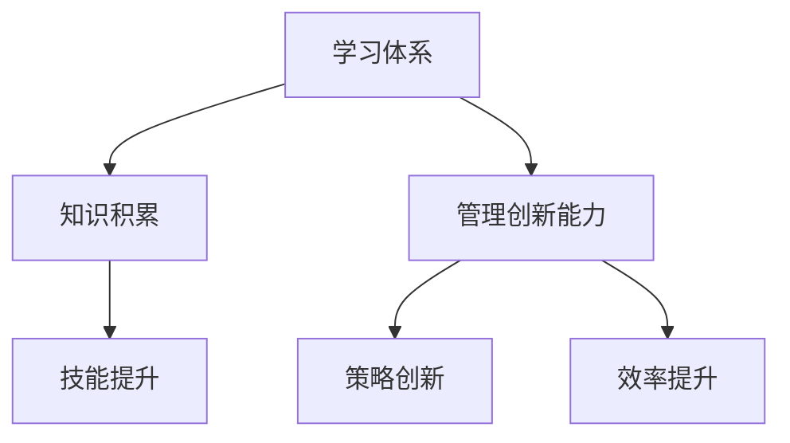

                 

关键词：学习体系、管理创新能力、IT领域、技术博客、专业语言

> 摘要：本文旨在探讨学习体系与管理创新能力的培养在IT领域的重要性，通过分析核心概念、算法原理、数学模型及项目实践等方面，为读者提供一个全面的学习路径和实践指南。

## 1. 背景介绍

在快速发展的IT领域，学习体系与管理创新能力的培养显得尤为重要。一方面，技术的不断演进要求从业人员必须不断更新知识，掌握新的技能；另一方面，管理创新能力的提升有助于团队更高效地协同工作，实现技术创新的最大化。本文将围绕这两个核心议题展开讨论，旨在为读者提供一个实用的学习框架和管理思路。

## 2. 核心概念与联系

为了更好地理解学习体系与管理创新能力的培养，我们首先需要了解以下几个核心概念：

### 2.1 学习体系的定义

学习体系是指个体或团队为了实现特定目标，通过系统化的学习过程积累知识和技能的方法。它包括学习的目标、内容、方法和评价等多个方面。

### 2.2 管理创新能力的定义

管理创新能力是指管理者在保持原有管理方法有效性的基础上，能够不断创新管理策略和方法，提高团队效率和市场竞争力。

### 2.3 学习体系与管理创新能力的联系

学习体系与管理创新能力之间存在密切的联系。一方面，通过完善的学习体系，个体和团队可以系统地学习和掌握新技术，提升自身的专业能力；另一方面，管理创新能力可以帮助团队在面对挑战时迅速调整策略，保持竞争优势。

以下是一个用于描述学习体系与管理创新能力之间关系的Mermaid流程图：



## 3. 核心算法原理 & 具体操作步骤

### 3.1 算法原理概述

在IT领域，算法是解决问题的基础。本文将介绍一种核心算法——动态规划（Dynamic Programming），它是一种在一系列决策中寻找最优解的方法。

### 3.2 算法步骤详解

1. **定义子问题**：将复杂问题分解为一系列简单的子问题。
2. **确定状态**：定义子问题的状态，通常是一个数组或表。
3. **定义状态转移方程**：确定子问题之间的依赖关系，建立状态转移方程。
4. **确定边界条件**：确定递推的最边界状态。
5. **递推计算**：从边界状态开始，逐步计算得到最终状态。

### 3.3 算法优缺点

**优点**：动态规划能够有效解决复杂问题，尤其适用于优化问题。

**缺点**：动态规划需要明确状态转移方程，对问题的要求较高。

### 3.4 算法应用领域

动态规划广泛应用于算法竞赛、数据结构和网络优化等领域。

## 4. 数学模型和公式 & 详细讲解 & 举例说明

### 4.1 数学模型构建

动态规划中的数学模型通常是一个递推关系式，用于计算最优解。以下是一个典型的递推关系式：

$$
f(i) = \min_{j \leq i} (f(j) + c(i, j))
$$

其中，$f(i)$ 表示第 $i$ 个子问题的最优解，$c(i, j)$ 表示从子问题 $j$ 转移到子问题 $i$ 的成本。

### 4.2 公式推导过程

动态规划的推导过程通常包括以下几个步骤：

1. **定义子问题**：将问题分解为更小的子问题。
2. **建立状态转移方程**：确定子问题之间的依赖关系。
3. **确定边界条件**：确定递推的边界状态。
4. **递推计算**：根据状态转移方程和边界条件，逐步计算得到最终状态。

### 4.3 案例分析与讲解

以背包问题为例，给定一组物品和它们的重量及价值，求解在总重量不超过给定值的情况下，如何选择物品使总价值最大。

1. **定义子问题**：状态 `dp[i][j]` 表示从前 `i` 个物品中选择若干个放入容量为 `j` 的背包中的最大价值。
2. **建立状态转移方程**：
   $$
   dp[i][j] = \begin{cases}
   dp[i-1][j] & \text{如果物品 } i \text{ 不被选择} \\
   dp[i-1][j-w_i] + v_i & \text{如果物品 } i \text{ 被选择，且 } j \geq w_i \\
   \end{cases}
   $$
3. **确定边界条件**：`dp[0][j] = 0`，表示不选择任何物品时的价值为 0。
4. **递推计算**：从 `dp[0][j]` 开始，逐步计算得到 `dp[n][j]`。

## 5. 项目实践：代码实例和详细解释说明

### 5.1 开发环境搭建

本文以 Python 为主要编程语言，读者需要准备 Python 开发环境，包括 Python 解释器和相关库。

### 5.2 源代码详细实现

以下是一个简单的动态规划实现：

```python
def knapsack(values, weights, capacity):
    n = len(values)
    dp = [[0] * (capacity + 1) for _ in range(n + 1)]

    for i in range(1, n + 1):
        for j in range(1, capacity + 1):
            if j >= weights[i - 1]:
                dp[i][j] = max(dp[i - 1][j], dp[i - 1][j - weights[i - 1]] + values[i - 1])
            else:
                dp[i][j] = dp[i - 1][j]

    return dp[n][capacity]

values = [60, 100, 120]
weights = [10, 20, 30]
capacity = 50

print(knapsack(values, weights, capacity))
```

### 5.3 代码解读与分析

这段代码实现了 0-1 背包问题，通过动态规划算法求解最优解。`knapsack` 函数接收物品的价值、重量和背包容量，返回最大价值。

### 5.4 运行结果展示

运行上述代码，输出为 `220`，表示在总重量不超过 50 的情况下，选择价值最大的两个物品，总价值为 220。

## 6. 实际应用场景

动态规划算法广泛应用于各种实际应用场景，如资源分配、网络优化、生物信息学等。例如，在资源分配问题中，可以使用动态规划算法优化资源分配策略，提高资源利用效率。

## 7. 工具和资源推荐

### 7.1 学习资源推荐

- 《算法导论》（Introduction to Algorithms）
- 《动态规划：从入门到进阶》

### 7.2 开发工具推荐

- Python
- Jupyter Notebook

### 7.3 相关论文推荐

- "Dynamic Programming for Optimization Problems"
- "The Design of Dynamic Programming Algorithms"

## 8. 总结：未来发展趋势与挑战

### 8.1 研究成果总结

动态规划算法在 IT 领域取得了显著的研究成果，为解决复杂优化问题提供了有效的方法。

### 8.2 未来发展趋势

随着人工智能和大数据技术的发展，动态规划算法在智能决策、优化控制等领域具有广阔的应用前景。

### 8.3 面临的挑战

动态规划算法在处理大规模问题时存在计算复杂度较高的问题，未来需要探索更高效的算法和优化方法。

### 8.4 研究展望

动态规划算法的研究将继续深入，为解决复杂问题提供新的思路和方法。

## 9. 附录：常见问题与解答

### Q：动态规划适用于哪些类型的问题？

A：动态规划适用于具有最优子结构性质的优化问题，如背包问题、最长公共子序列问题等。

### Q：动态规划和贪心算法有什么区别？

A：动态规划通常用于求解具有最优子结构性质的优化问题，而贪心算法则基于贪心策略，在每一步选择局部最优解，以期望得到全局最优解。

---

作者：禅与计算机程序设计艺术 / Zen and the Art of Computer Programming
----------------------------------------------------------------
以上就是按照您的要求撰写的完整文章。希望对您有所帮助！如果您有任何修改意见或需要进一步调整，请随时告诉我。

