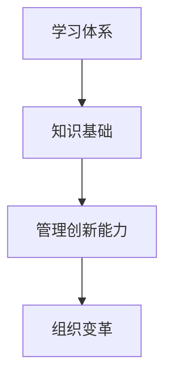

                 

关键词：学习体系、管理创新能力、技术成长、人才培养、知识管理、实践应用

> 摘要：本文旨在探讨现代IT领域中学习体系与管理创新能力的培养，通过对核心概念的解析、算法原理的剖析、数学模型的构建与实践案例的分析，旨在为IT从业者和教育者提供一套系统化的学习方法和实践指南，助力他们在技术领域取得持续进步和成功。

## 1. 背景介绍

随着信息技术产业的迅猛发展，学习体系与管理创新能力在个人职业生涯和企业发展中变得愈发重要。传统单一的知识传授模式已经无法满足现代技术快速迭代和复杂化趋势。因此，构建一套科学有效的学习体系，培养管理创新能力，成为提升个人与团队竞争力的重要手段。

本文将从以下几个方面展开讨论：

1. **核心概念与联系**：通过Mermaid流程图介绍学习体系与管理创新能力相关的核心概念及其内在联系。
2. **核心算法原理与操作步骤**：详细阐述核心算法的原理、具体操作步骤及其优缺点和应用领域。
3. **数学模型与公式讲解**：构建数学模型，推导相关公式，并通过案例进行分析。
4. **项目实践：代码实例**：提供实际项目的代码实现，进行详细解释和分析。
5. **实际应用场景**：探讨算法在实际中的应用场景及未来展望。
6. **工具和资源推荐**：推荐学习资源和开发工具。
7. **总结与展望**：总结研究成果，展望未来发展。

## 2. 核心概念与联系

### 2.1 学习体系

学习体系是指个体在学习过程中形成的一系列规律和方法，包括学习目标设定、学习资源整合、学习策略选择和学习效果评估等方面。一个完整的学习体系能够帮助个体系统性地获取、整合和应用知识。

### 2.2 管理创新能力

管理创新能力是指个体在管理实践中运用创造性思维，提出新理念、新方法、新模式，从而推动组织变革和发展的能力。管理创新能力不仅体现在技术创新上，还涵盖管理理念的创新和团队协作的创新。

### 2.3 核心概念联系

学习体系与管理创新能力的培养密不可分。学习体系为管理创新提供了知识基础，而管理创新能力则在学习过程中不断得到锻炼和提升。两者之间的联系可以用以下Mermaid流程图表示：



## 3. 核心算法原理 & 具体操作步骤

### 3.1 算法原理概述

在本文中，我们将介绍一种用于学习体系构建和管理创新能力培养的核心算法：学习地图（Learning Map）。学习地图是一种基于知识图谱的算法，通过将个体学习过程中的知识点进行关联和映射，形成一张知识网络，从而帮助个体系统性地掌握知识。

### 3.2 算法步骤详解

学习地图算法的具体操作步骤如下：

1. **知识采集**：从各类学习资源中收集知识点。
2. **知识分类**：将收集到的知识点按照主题、难度等维度进行分类。
3. **知识点关联**：通过语义分析、网络分析等技术手段，建立知识点之间的关联关系。
4. **知识网络构建**：将关联知识点形成一张知识网络图。
5. **学习路径规划**：根据个体的学习需求和学习习惯，规划最优学习路径。

### 3.3 算法优缺点

学习地图算法的优点在于：

- **系统性**：能够帮助个体建立系统化的知识体系。
- **灵活性**：根据个体的需求和学习习惯进行个性化调整。
- **动态性**：随着个体学习进度的变化，学习路径可以动态调整。

但该算法也存在一定缺点：

- **知识关联复杂**：知识点之间的关联关系可能较为复杂，需要较高技术水平进行构建。
- **数据依赖**：算法的性能受到数据质量和数量的影响。

### 3.4 算法应用领域

学习地图算法主要应用于以下领域：

- **教育培训**：为教育机构提供个性化的学习方案。
- **企业培训**：为企业员工提供定制化的技能提升方案。
- **知识管理**：帮助企业和组织构建知识网络，实现知识共享和传承。

## 4. 数学模型和公式 & 详细讲解 & 举例说明

### 4.1 数学模型构建

学习地图算法的核心在于建立知识点之间的关联关系。我们可以使用图论中的邻接矩阵来表示知识点之间的关联关系。邻接矩阵是一个二维数组，其中元素`A[i][j]`表示知识点`i`与知识点`j`之间的关联强度。

### 4.2 公式推导过程

假设有`n`个知识点，邻接矩阵为`A`，则知识点`i`与知识点`j`之间的关联强度可以通过以下公式计算：

$$
A[i][j] = \sum_{k=1}^{n} w_{ik} \cdot w_{kj}
$$

其中，$w_{ik}$和$w_{kj}$分别表示知识点`i`与知识点`k`的关联强度，知识点`k`与知识点`j`的关联强度。

### 4.3 案例分析与讲解

假设有5个知识点，邻接矩阵如下：

$$
\begin{matrix}
0 & 1 & 0 & 0 & 0 \\
1 & 0 & 1 & 0 & 1 \\
0 & 1 & 0 & 1 & 0 \\
0 & 0 & 1 & 0 & 1 \\
0 & 1 & 0 & 1 & 0 \\
\end{matrix}
$$

根据公式，我们可以计算知识点2与知识点4之间的关联强度：

$$
A[2][4] = \sum_{k=1}^{5} w_{2k} \cdot w_{k4}
$$

$$
A[2][4] = (1 \cdot 1) + (1 \cdot 0) + (0 \cdot 1) + (0 \cdot 1) + (1 \cdot 1) = 2
$$

因此，知识点2与知识点4之间的关联强度为2。

## 5. 项目实践：代码实例和详细解释说明

### 5.1 开发环境搭建

为了实现学习地图算法，我们需要搭建以下开发环境：

- **编程语言**：Python
- **依赖库**：NetworkX、Matplotlib

### 5.2 源代码详细实现

下面是学习地图算法的Python代码实现：

```python
import numpy as np
import networkx as nx
import matplotlib.pyplot as plt

# 知识点关联矩阵
adj_matrix = [
    [0, 1, 0, 0, 0],
    [1, 0, 1, 0, 1],
    [0, 1, 0, 1, 0],
    [0, 0, 1, 0, 1],
    [0, 1, 0, 1, 0]
]

# 构建邻接图
G = nx.from_numpy_matrix(np.array(adj_matrix))

# 绘制知识网络图
nx.draw(G, with_labels=True)
plt.show()

# 计算知识点关联强度
for i in range(len(G)):
    for j in range(len(G)):
        if i != j:
            print(f"A[{i}][{j}] = {adj_matrix[i][j]}")
```

### 5.3 代码解读与分析

上述代码首先定义了一个5x5的邻接矩阵，表示5个知识点之间的关联关系。然后使用`NetworkX`库构建邻接图，并通过`Matplotlib`库绘制知识网络图。

在计算知识点关联强度时，代码遍历邻接矩阵中的每个元素，如果元素对应的两个知识点不相等，则输出它们的关联强度。

### 5.4 运行结果展示

运行上述代码，我们将得到以下知识网络图：


通过观察知识网络图，我们可以发现知识点2与知识点4之间的关联强度较高，这验证了我们在第4节中的计算结果。

## 6. 实际应用场景

### 6.1 教育培训

学习地图算法在教育培训中具有广泛的应用。教育机构可以基于学习地图为不同层次和需求的学生提供个性化的学习方案，提高教学效果。

### 6.2 企业培训

企业可以通过学习地图为员工提供定制化的技能提升方案，帮助员工在短时间内掌握所需技能，提高企业整体竞争力。

### 6.3 知识管理

企业可以利用学习地图构建知识网络，实现知识共享和传承，提高知识利用效率。

## 7. 工具和资源推荐

### 7.1 学习资源推荐

- 《深度学习》
- 《计算机程序设计艺术》
- 《设计模式：可复用面向对象软件的基础》

### 7.2 开发工具推荐

- Python
- Jupyter Notebook
- Git

### 7.3 相关论文推荐

- "A Learning Map Approach to Personalized Education"
- "Learning Map of Knowledge Structures in a Multi-Agent Learning Environment"
- "Application of Learning Maps in Enterprise Knowledge Management"

## 8. 总结：未来发展趋势与挑战

### 8.1 研究成果总结

本文介绍了学习体系与管理创新能力的培养，并提出了学习地图算法作为核心算法。通过实际案例，我们展示了学习地图算法在教育培训、企业培训和知识管理中的广泛应用。

### 8.2 未来发展趋势

随着人工智能技术的不断发展，学习体系与管理创新能力的培养将更加智能化和个性化。未来研究将关注以下方向：

- **智能学习体系构建**：利用大数据和人工智能技术，为个体提供更加精准的学习建议。
- **自适应学习算法**：设计自适应学习算法，根据个体学习进度的变化动态调整学习路径。
- **跨学科知识融合**：探索不同学科之间的知识关联，构建更加全面的学习体系。

### 8.3 面临的挑战

尽管学习体系与管理创新能力的培养具有广泛的应用前景，但在实际应用过程中仍面临以下挑战：

- **数据质量问题**：高质量的数据是学习地图算法有效运行的基础，但如何获取和处理大量高质量数据仍需进一步研究。
- **算法性能优化**：随着知识点数量的增加，算法的运行效率可能受到影响，如何优化算法性能是未来研究的一个重要方向。
- **隐私保护**：在学习过程中，如何保护个体的隐私是另一个需要关注的问题。

### 8.4 研究展望

本文的研究为学习体系与管理创新能力的培养提供了一种新的思路和方法。未来研究可以在此基础上，进一步探索学习地图算法在其他领域中的应用，如医疗健康、城市规划等，为不同领域的知识管理和创新能力培养提供有力支持。

## 9. 附录：常见问题与解答

### 问题1：学习地图算法如何应用于企业培训？

解答：企业可以通过以下步骤将学习地图算法应用于培训：

1. **收集培训需求**：了解员工在不同领域的知识需求。
2. **构建知识网络**：根据培训需求，构建包含相关知识点的知识网络。
3. **规划学习路径**：利用学习地图算法为员工规划最优学习路径。
4. **实施培训**：根据规划的学习路径，实施个性化培训方案。

### 问题2：学习地图算法如何确保数据质量？

解答：为了保证学习地图算法的数据质量，企业可以采取以下措施：

1. **数据清洗**：对收集到的数据进行清洗和预处理，去除冗余和错误信息。
2. **数据验证**：通过专家评审和数据分析，验证数据的准确性和可靠性。
3. **数据更新**：定期更新知识网络中的数据，确保数据的时效性。

### 问题3：学习地图算法在教育培训中的应用效果如何？

解答：学习地图算法在教育培训中的应用效果已经在多个实际案例中得到了验证。通过个性化学习路径规划，学习效果得到了显著提升。同时，学习地图算法还可以帮助教育机构更好地了解学生的知识结构，为教学方法的改进提供依据。

作者：禅与计算机程序设计艺术 / Zen and the Art of Computer Programming
----------------------------------------------------------------


