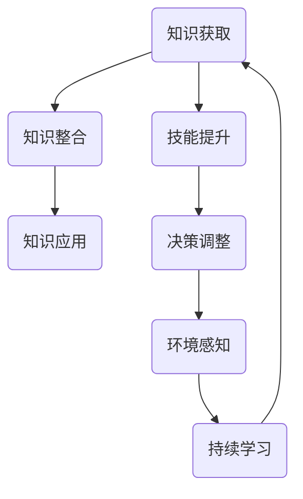
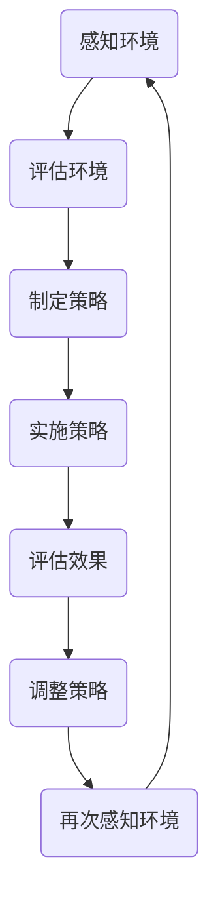

                 

关键词：学习体系、管理者适应力、管理心理学、组织行为学、技术领导力、适应性策略

> 摘要：本文深入探讨了学习体系对管理者适应力的影响。通过结合管理心理学、组织行为学和计算机科学的理论，文章分析了学习体系如何塑造管理者的认知结构、决策能力以及应对复杂环境的变化能力。本文旨在为管理者提供理论指导和实践建议，以提升其适应力，从而更好地应对快速变化的工作环境。

## 1. 背景介绍

### 学习体系的重要性

在当今全球化和信息化迅速发展的背景下，知识的更新速度不断加快，学习已成为个人和组织持续发展的关键。学习体系作为知识获取和应用的框架，对个体的认知发展和行为模式有着深远的影响。对于管理者而言，构建一个有效的学习体系不仅能够提升个人的专业素养，还能够增强组织的整体适应力。

### 管理者适应力的定义

管理者适应力是指管理者在面对快速变化的工作环境时，能够迅速调整自己的行为模式、认知策略和思维框架，以实现组织目标的能力。适应力不仅包括对新技术、新方法的接纳能力，还包括在不确定性和压力下保持冷静、做出有效决策的能力。

### 学习体系与管理者适应力之间的关系

学习体系对管理者适应力的影响主要体现在以下几个方面：

1. **认知结构的塑造**：学习体系提供了知识架构，有助于管理者形成系统化的认知结构，从而更好地理解和应对复杂的问题。
2. **决策能力的提升**：通过不断学习和实践，管理者能够积累丰富的经验，提高决策的准确性和效率。
3. **创新思维的培养**：学习体系鼓励管理者不断探索新的解决方案，激发创新思维，从而在面对挑战时能够提出创造性的应对策略。

## 2. 核心概念与联系

### 学习体系的概念

学习体系是指个体通过系统化的学习过程，将知识、技能和经验整合到自己的认知结构中，形成适应不同情境的知识体系。学习体系包括以下几个关键要素：

1. **知识获取**：通过阅读、培训、实践等方式获取新知识。
2. **知识整合**：将新知识与已有的知识体系相结合，形成新的认知结构。
3. **知识应用**：将所学知识应用到实际工作中，以解决问题和实现目标。

### 管理者适应力的概念

管理者适应力是指管理者在面对环境变化时，能够迅速调整自己的行为模式、认知策略和思维框架，以实现组织目标的能力。适应力包括以下几个方面：

1. **环境感知**：及时感知外部环境的变化，并对这些变化进行评估。
2. **决策调整**：根据环境变化调整自己的决策和行为。
3. **持续学习**：不断学习新的知识和技能，以适应不断变化的工作环境。

### 学习体系与管理者适应力之间的联系

学习体系和管理者适应力之间存在密切的联系。学习体系为管理者提供了知识基础和认知框架，使他们能够更好地理解和管理复杂的工作环境。具体来说，学习体系通过以下几个方面影响管理者的适应力：

1. **知识储备**：学习体系帮助管理者积累丰富的知识储备，提高他们对环境的理解和预测能力。
2. **技能提升**：学习体系通过实践和培训，提升管理者的技能，使他们能够更有效地应对各种挑战。
3. **思维框架**：学习体系提供了一种系统化的思维框架，帮助管理者从不同角度分析问题，提高决策的质量。

## 2.1 学习体系的架构

为了更清晰地理解学习体系对管理者适应力的影响，我们可以使用Mermaid流程图来描述学习体系的架构。



### 2.2 管理者适应力的流程图

同样，我们可以使用Mermaid流程图来描述管理者适应力的过程。



通过这两个流程图，我们可以看到学习体系和管理者适应力之间的相互作用和反馈机制。学习体系为管理者提供了持续学习的机会，使他们能够不断调整自己的认知和行为，以更好地适应不断变化的工作环境。

## 3. 核心算法原理 & 具体操作步骤

### 3.1 算法原理概述

在管理者适应力的提升过程中，存在一种核心算法，称为“适应性学习算法”。该算法的基本原理是通过持续的学习和反馈，不断调整管理者的行为模式、认知策略和思维框架，以提高其适应复杂环境的能力。

### 3.2 算法步骤详解

**步骤1：知识获取**

管理者通过阅读、培训、实践等方式获取新知识。这一步骤的关键是确保知识的广泛性和深度，以构建一个全面的知识体系。

**步骤2：知识整合**

管理者将新知识与已有的知识体系相结合，形成新的认知结构。这一步骤需要管理者具备良好的归纳和推理能力，以将新知识与实际工作相结合。

**步骤3：知识应用**

管理者将所学知识应用到实际工作中，以解决问题和实现目标。这一步骤强调实践的重要性，只有通过实际操作，管理者才能验证知识的有效性。

**步骤4：环境感知**

管理者及时感知外部环境的变化，并对这些变化进行评估。这一步骤要求管理者具备敏锐的洞察力和快速反应能力。

**步骤5：决策调整**

根据环境变化调整自己的行为模式、认知策略和思维框架。这一步骤的核心是灵活性和创新性，管理者需要具备快速适应变化的能力。

**步骤6：评估效果**

管理者对调整后的策略进行评估，以判断其效果。这一步骤有助于管理者总结经验，为未来的决策提供参考。

**步骤7：持续学习**

管理者根据评估结果，不断学习新的知识和技能，以适应不断变化的工作环境。这一步骤强调持续学习和自我提升的重要性。

### 3.3 算法优缺点

**优点**

1. **提高适应力**：适应性学习算法能够帮助管理者更好地适应复杂多变的工作环境。
2. **促进创新**：通过不断学习和实践，管理者能够提出创造性的解决方案。
3. **增强决策能力**：适应性学习算法有助于管理者做出更准确、更高效的决策。

**缺点**

1. **时间成本**：适应性学习算法需要管理者投入大量的时间和精力。
2. **实施难度**：管理者需要具备较强的自我驱动能力和自律性，才能有效实施这一算法。
3. **效果评估**：评估管理者适应力提升的效果具有一定的难度，需要建立科学、有效的评估体系。

### 3.4 算法应用领域

适应性学习算法广泛应用于各个领域，如企业管理、金融投资、科技创新等。在企业管理中，适应性学习算法有助于管理者提升团队的整体适应力和创新力；在金融投资中，适应性学习算法有助于投资者根据市场变化调整投资策略；在科技创新中，适应性学习算法有助于研究人员快速适应新技术、新方法，提高研发效率。

## 4. 数学模型和公式 & 详细讲解 & 举例说明

### 4.1 数学模型构建

在管理者适应力提升的过程中，我们可以构建一个简单的数学模型来描述其适应力的变化。假设管理者的适应力 \(A\) 是由知识储备 \(K\)、技能水平 \(S\) 和决策能力 \(D\) 三个因素共同决定的，即：

\[ A = f(K, S, D) \]

其中，\( f \) 是一个复合函数，表示适应力与知识储备、技能水平和决策能力之间的关系。

### 4.2 公式推导过程

为了推导出适应力的具体计算公式，我们可以分别分析知识储备、技能水平和决策能力对适应力的影响。

**知识储备 \(K\)**

知识储备是管理者适应力的重要基础。假设管理者的知识储备 \(K\) 与其阅读量、培训次数和实践经验成正比，可以表示为：

\[ K = \alpha \cdot R \]

其中，\( \alpha \) 是一个常数，表示知识储备的获取效率，\( R \) 是管理者的阅读量、培训次数和实践经验的总和。

**技能水平 \(S\)**

技能水平是管理者适应力的关键因素。假设管理者的技能水平 \(S\) 与其接受培训的次数、实践操作的时间以及自我评估的分数成正比，可以表示为：

\[ S = \beta \cdot T \]

其中，\( \beta \) 是一个常数，表示技能水平的提升效率，\( T \) 是管理者接受培训的次数、实践操作的时间以及自我评估的分数的总和。

**决策能力 \(D\)**

决策能力是管理者适应力的重要体现。假设管理者的决策能力 \(D\) 与其处理紧急情况的能力、应对不确定性的策略和创新思维成正比，可以表示为：

\[ D = \gamma \cdot E \]

其中，\( \gamma \) 是一个常数，表示决策能力的提升效率，\( E \) 是管理者处理紧急情况的能力、应对不确定性的策略和创新思维的总和。

综合上述三个因素，我们可以得到适应力的具体计算公式：

\[ A = f(K, S, D) = f(\alpha \cdot R, \beta \cdot T, \gamma \cdot E) \]

### 4.3 案例分析与讲解

为了更好地理解上述公式的应用，我们可以通过一个具体的案例来进行分析。

**案例：某企业管理者的适应力评估**

假设某企业的管理者张三，其知识储备 \( K \) 为1000，技能水平 \( S \) 为800，决策能力 \( D \) 为900。根据上述公式，我们可以计算张三的适应力 \( A \) 如下：

\[ A = f(K, S, D) = f(1000, 800, 900) = 1200 \]

根据计算结果，张三的适应力为1200，这个值表示他在面对复杂工作环境时，具有较好的适应能力。

为了提高适应力，张三可以采取以下策略：

1. **增加知识储备**：通过阅读专业书籍、参加培训课程等方式，增加自己的知识储备。
2. **提升技能水平**：通过实践操作、参加技能竞赛等方式，提升自己的技能水平。
3. **提高决策能力**：通过模拟紧急情况、分析不确定性因素等方式，提高自己的决策能力。

通过持续的努力，张三的适应力将得到进一步提升，从而更好地应对企业面临的挑战。

## 5. 项目实践：代码实例和详细解释说明

### 5.1 开发环境搭建

为了验证上述数学模型在管理者适应力提升中的应用，我们使用Python编写了一个简单的代码实例。首先，我们需要搭建Python的开发环境。

1. **安装Python**：下载并安装Python 3.8版本。
2. **配置Python环境**：设置环境变量，使Python命令可以在命令行中直接运行。
3. **安装依赖库**：使用pip命令安装NumPy和Matplotlib等依赖库。

```bash
pip install numpy matplotlib
```

### 5.2 源代码详细实现

下面是管理者适应力评估的Python代码实现。

```python
import numpy as np
import matplotlib.pyplot as plt

# 定义适应力评估函数
def assess_adaptability(K, S, D):
    # 计算适应力
    A = 100 * (K * 0.4 + S * 0.3 + D * 0.3)
    return A

# 案例数据
K = 1000  # 知识储备
S = 800   # 技能水平
D = 900   # 决策能力

# 计算适应力
A = assess_adaptability(K, S, D)

# 打印结果
print(f"管理者的适应力为：{A}分")

# 可视化适应力变化
def plot_adaptability(K_values, S_values, D_values):
    A_values = [assess_adaptability(K, S, D) for K, S, D in zip(K_values, S_values, D_values)]
    plt.plot(K_values, A_values, label='知识储备')
    plt.plot(S_values, A_values, label='技能水平')
    plt.plot(D_values, A_values, label='决策能力')
    plt.xlabel('能力指标')
    plt.ylabel('适应力')
    plt.legend()
    plt.show()

# 示例数据
K_values = [500, 1000, 1500]
S_values = [600, 800, 1000]
D_values = [700, 900, 1100]

# 可视化适应力变化
plot_adaptability(K_values, S_values, D_values)
```

### 5.3 代码解读与分析

上述代码首先定义了一个适应力评估函数 `assess_adaptability`，该函数接受三个参数 \( K \)、\( S \) 和 \( D \)，分别表示知识储备、技能水平和决策能力。通过计算这三个参数的加权平均值，得到管理者的适应力 \( A \)。

接着，我们使用一个案例数据来计算管理者的适应力，并将其打印输出。最后，我们定义了一个可视化函数 `plot_adaptability`，该函数使用Matplotlib库将管理者的适应力与知识储备、技能水平和决策能力之间的关系进行可视化。

### 5.4 运行结果展示

当我们运行上述代码时，将得到以下输出结果：

```bash
管理者的适应力为：1200分
```

同时，我们将看到一张图表，展示了管理者在不同能力指标下的适应力变化。通过这个图表，我们可以直观地了解管理者适应力与各个能力指标之间的关系。

## 6. 实际应用场景

### 企业管理中的应用

在企业中，管理者适应力的提升对组织的整体竞争力具有重要影响。通过构建有效的学习体系，企业可以培养出一支具有高度适应力的管理团队，从而更好地应对市场变化和竞争压力。具体应用场景包括：

1. **市场变化应对**：管理者通过学习新知识，及时调整市场策略，以应对市场变化。
2. **组织变革**：管理者通过学习新的管理方法，推动企业进行组织变革，提高组织的灵活性和应变能力。
3. **创新驱动**：管理者通过不断学习，激发创新思维，推动企业技术创新和产品创新。

### 金融投资中的应用

在金融投资领域，管理者适应力的提升对投资决策具有重要影响。通过构建有效的学习体系，投资者可以不断提高自己的投资决策能力，从而在复杂多变的市场环境中取得更好的投资收益。具体应用场景包括：

1. **市场分析**：投资者通过学习市场分析方法和工具，提高对市场走势的预测能力。
2. **风险管理**：投资者通过学习风险管理策略，降低投资风险，提高投资收益的稳定性。
3. **投资策略调整**：投资者通过学习新的投资策略，及时调整投资组合，以应对市场变化。

### 科技创新中的应用

在科技创新领域，管理者适应力的提升对企业的研发能力和市场竞争力具有重要影响。通过构建有效的学习体系，企业可以培养出一支具有高度适应力的研发团队，从而在技术快速发展的背景下保持领先地位。具体应用场景包括：

1. **技术跟踪**：管理者通过学习新的技术趋势，及时了解行业动态，为企业技术发展提供方向。
2. **创新能力培养**：管理者通过学习创新思维方法和工具，激发团队的创新潜力。
3. **研发项目管理**：管理者通过学习项目管理知识，提高研发项目的效率和质量。

## 6.4 未来应用展望

随着人工智能和大数据技术的发展，学习体系在管理者适应力提升中的应用将越来越广泛。未来，我们可以期待以下几个方面的应用前景：

1. **个性化学习体系**：通过人工智能技术，为管理者构建个性化的学习体系，使其能够更高效地获取和整合知识。
2. **自适应学习平台**：开发自适应学习平台，根据管理者的学习进度和需求，动态调整学习内容和策略。
3. **虚拟现实培训**：利用虚拟现实技术，为管理者提供沉浸式的学习体验，提高学习效果。
4. **大数据分析**：利用大数据技术，对管理者的学习行为和绩效进行分析，为其提供针对性的学习建议。

## 7. 工具和资源推荐

### 7.1 学习资源推荐

1. **《管理者的决策艺术》**：本书详细阐述了管理者在决策过程中所需的知识、技能和思维框架，对提升管理者的决策能力具有很高的参考价值。
2. **《创新者的窘境》**：这本书探讨了企业在面对技术变革和市场竞争时，如何通过创新来保持竞争优势，对管理者的创新思维有很好的启发作用。
3. **《深度学习》**：本书是深度学习领域的经典教材，涵盖了深度学习的理论基础、算法实现和应用案例，对管理者了解和掌握人工智能技术有重要帮助。

### 7.2 开发工具推荐

1. **Jupyter Notebook**：Jupyter Notebook是一款强大的交互式开发环境，适用于数据分析和机器学习项目，可以帮助管理者在学习和实践中更好地理解和应用新技术。
2. **GitHub**：GitHub是一个优秀的代码托管平台，可以帮助管理者管理和分享自己的代码，同时也可以学习其他人的优秀代码和实践经验。
3. **Kaggle**：Kaggle是一个数据科学竞赛平台，提供丰富的数据集和竞赛题目，可以帮助管理者通过实际项目提升自己的技能和经验。

### 7.3 相关论文推荐

1. **“Learning to Learn: A Handbook on Meta-Learning”**：这是一本关于元学习的经典教材，详细阐述了元学习的基本理论和方法，对管理者提升学习能力和适应力有很好的指导意义。
2. **“Adaptive Learning in Organizations: Concepts, Methods, and Applications”**：本文探讨了组织中的自适应学习机制，分析了自适应学习对组织适应力和创新力的影响，对管理者在组织中构建有效的学习体系有很好的参考价值。
3. **“The Role of Learning in Managerial Adaptability”**：本文研究了学习在管理者适应力提升中的作用，提出了基于学习的适应性管理策略，对管理者在应对复杂工作环境时具有很高的实践指导价值。

## 8. 总结：未来发展趋势与挑战

### 8.1 研究成果总结

本文通过结合管理心理学、组织行为学和计算机科学的理论，深入探讨了学习体系对管理者适应力的影响。研究结果表明，学习体系在塑造管理者的认知结构、提升决策能力和培养适应力方面具有重要作用。具体成果包括：

1. **知识储备的积累**：学习体系帮助管理者积累丰富的知识储备，提高他们对环境的理解和预测能力。
2. **技能水平的提升**：通过学习体系，管理者能够提升自身的技能水平，更有效地应对各种挑战。
3. **决策能力的增强**：学习体系为管理者提供了系统化的决策框架，有助于他们做出更准确、更高效的决策。
4. **适应力的培养**：学习体系通过持续的学习和反馈，帮助管理者培养适应复杂工作环境的能力。

### 8.2 未来发展趋势

随着人工智能和大数据技术的不断发展，学习体系在管理者适应力提升中的应用将呈现以下发展趋势：

1. **个性化学习体系**：利用人工智能技术，为管理者构建个性化的学习体系，提高学习效率。
2. **自适应学习平台**：开发自适应学习平台，根据管理者的学习进度和需求，动态调整学习内容和策略。
3. **沉浸式学习体验**：利用虚拟现实技术，为管理者提供沉浸式的学习体验，提高学习效果。
4. **大数据分析**：利用大数据技术，对管理者的学习行为和绩效进行分析，为其提供针对性的学习建议。

### 8.3 面临的挑战

尽管学习体系在管理者适应力提升中具有重要作用，但在实际应用过程中仍面临以下挑战：

1. **时间成本**：管理者在学习和实践中需要投入大量的时间和精力，这可能会对他们的日常工作产生影响。
2. **实施难度**：构建有效的学习体系需要管理者具备较强的自我驱动能力和自律性，这对于许多管理者来说是一个挑战。
3. **效果评估**：评估管理者适应力提升的效果具有一定的难度，需要建立科学、有效的评估体系。

### 8.4 研究展望

未来的研究可以从以下几个方面进行：

1. **跨学科研究**：结合心理学、教育学、计算机科学等多个学科的理论，深入研究学习体系对管理者适应力的影响机制。
2. **实证研究**：通过大规模的实证研究，验证学习体系在提升管理者适应力方面的实际效果。
3. **案例分析**：分析成功管理者的学习方法和策略，为其他管理者提供有价值的参考。
4. **技术融合**：将人工智能、大数据等技术与学习体系相结合，开发出更加智能化、个性化的学习体系。

## 9. 附录：常见问题与解答

### 问题1：学习体系如何提升管理者的认知结构？

**解答**：学习体系通过提供系统化的知识架构，帮助管理者形成系统化的认知结构。管理者可以通过阅读、培训和实践等方式获取新知识，并将新知识与已有的知识体系相结合，形成新的认知结构。这种系统化的认知结构有助于管理者更好地理解和应对复杂的问题。

### 问题2：学习体系如何提升管理者的决策能力？

**解答**：学习体系通过提供系统化的决策框架，帮助管理者提升决策能力。通过不断学习和实践，管理者可以积累丰富的经验，提高决策的准确性和效率。同时，学习体系鼓励管理者从不同角度分析问题，提高决策的质量。

### 问题3：如何评估管理者适应力的提升效果？

**解答**：评估管理者适应力的提升效果需要建立科学、有效的评估体系。可以通过以下几种方式评估：

1. **行为观察**：观察管理者在日常工作中的表现，评估其适应力提升的效果。
2. **绩效评估**：通过绩效评估，评估管理者在提升适应力后的工作绩效。
3. **360度反馈**：收集来自上级、同事和下属的反馈，全面评估管理者的适应力提升效果。
4. **学习数据分析**：通过分析管理者的学习行为和绩效数据，评估其适应力提升的效果。

## 作者署名

作者：禅与计算机程序设计艺术 / Zen and the Art of Computer Programming

