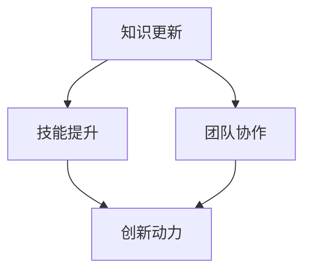

                 

关键词：学习体系，组织适应性，人才发展，技术更新，团队协作，创新动力

> 摘要：随着技术的快速发展和市场竞争的加剧，组织需要不断提升其适应能力以应对不断变化的环境。本文将探讨学习体系在提升组织适应性方面的作用，分析学习体系对人才发展、技术更新、团队协作和创新动力的积极影响，并提出未来学习体系发展中的挑战和趋势。

## 1. 背景介绍

在当今全球化和数字化时代，技术和市场的快速变化对组织提出了更高的要求。为了保持竞争力，组织不仅需要适应外部环境的变化，还要确保内部团队能够持续学习和进步。传统的层级制度和单一技能培训已经无法满足这种复杂多变的环境需求。因此，建立一套完善的学习体系成为提升组织适应性的关键。

学习体系不仅仅是指培训和学习计划，而是一个综合性的系统，它包括知识获取、知识共享、能力提升和技能发展等多个环节。一个有效的学习体系应该能够快速响应变化，为组织提供持续的创新动力和人才支持。

### 1.1 组织适应性的重要性

组织适应性是指组织在面对外部环境变化时，能够快速调整和适应的能力。这种能力不仅包括对市场变化的敏感度，还包括对技术创新、政策法规、文化差异等方面的应对能力。在快速变化的环境中，组织如果不能及时适应，可能会失去市场地位，甚至面临生存危机。

### 1.2 学习体系的基本概念

学习体系是一个包括学习计划、学习资源、学习评估、知识管理等环节的综合性系统。它旨在通过持续的学习和培训，提升组织成员的知识和技能，增强组织的创新能力和竞争力。

## 2. 核心概念与联系

### 2.1 学习体系的概念

学习体系是指一系列规划和实施的学习活动，它包括个人学习、团队学习、组织学习等多个层次。学习体系的目的是通过不断的学习和知识共享，提高组织成员的综合素质和创新能力。

### 2.2 组织适应性的概念

组织适应性是指组织在面临外部环境变化时，能够迅速做出调整和适应的能力。这种能力包括对市场需求的敏感度、技术创新的能力、文化适应的能力等。

### 2.3 学习体系与组织适应性的联系

学习体系与组织适应性之间存在密切的联系。学习体系能够为组织提供持续的知识更新和技术支持，从而增强组织的适应能力。具体来说：

1. **知识更新**：学习体系能够帮助组织成员不断获取新知识，适应技术发展和市场变化。
2. **技能提升**：通过学习体系，组织成员能够提升专业技能，增强解决问题的能力。
3. **团队协作**：学习体系鼓励知识共享和团队协作，提高团队的凝聚力和创新能力。
4. **创新动力**：学习体系为组织提供创新思维和方法，激发创新动力。

以下是学习体系与组织适应性的Mermaid流程图：



## 3. 核心算法原理 & 具体操作步骤

### 3.1 算法原理概述

学习体系的核心算法可以概括为“知识循环”模型。该模型通过以下步骤实现：

1. **知识获取**：通过内部培训、外部学习、知识库建设等方式获取新知识。
2. **知识共享**：建立知识共享平台，促进组织内成员的知识交流和传递。
3. **技能应用**：将新知识应用于实际工作中，提升个人和团队的能力。
4. **创新实践**：通过创新实验和项目实践，将知识转化为创新成果。

### 3.2 算法步骤详解

1. **知识获取**：组织应制定系统化的培训和学习计划，包括内部培训和外部学习。内部培训可以由内部专家或外部讲师进行，外部学习可以通过参加行业会议、研讨会、在线课程等方式进行。

2. **知识共享**：建立知识共享平台，如内部Wiki、论坛、工作坊等，鼓励成员分享经验和知识。此外，可以通过定期的知识分享会议和项目汇报，促进知识流动。

3. **技能应用**：将新知识应用于实际工作中，通过实际操作和项目实践，提升个人和团队的能力。在应用过程中，应不断总结经验和教训，形成最佳实践。

4. **创新实践**：鼓励成员进行创新实验和项目实践，通过小规模试验和迭代，不断优化和创新。创新实践应与组织的战略目标相一致，为组织带来实际价值。

### 3.3 算法优缺点

**优点**：

- **提高知识共享和传递效率**：通过系统化的学习体系，可以加快知识的获取、共享和应用，提高组织的知识管理水平。
- **增强团队协作和创新动力**：学习体系鼓励知识共享和团队协作，有利于增强团队的凝聚力和创新动力。
- **适应快速变化的环境**：学习体系可以快速响应外部环境的变化，为组织提供持续的知识更新和技术支持。

**缺点**：

- **实施成本较高**：建立和完善学习体系需要大量的资金和人力资源投入。
- **需要时间积累**：学习体系的成效需要时间积累，短期内可能难以看到显著的效果。

### 3.4 算法应用领域

学习体系广泛应用于各个领域，包括但不限于：

- **企业培训**：通过学习体系，企业可以提升员工的专业技能和综合素质，增强企业的竞争力。
- **科研机构**：科研机构可以通过学习体系，促进科研人员的知识更新和技术创新，提高科研水平。
- **教育机构**：教育机构可以通过学习体系，提升教师的教学水平和学生的综合素质，促进教育改革。

## 4. 数学模型和公式 & 详细讲解 & 举例说明

### 4.1 数学模型构建

学习体系的数学模型可以构建为一个多层次的动态系统。该系统包括以下几个主要组成部分：

1. **知识库**：存储和组织各类知识资源，包括文献资料、课程视频、专业书籍等。
2. **学习节点**：代表组织成员的学习活动，包括个人学习、团队学习和外部学习。
3. **知识流动**：描述知识在系统内部的传递和共享过程。
4. **创新能力**：衡量学习体系对组织创新能力的影响。

### 4.2 公式推导过程

假设学习体系中的知识库包含 \( N \) 种知识资源，每个资源有 \( a_n \) 个单位的知识量。组织成员有 \( M \) 人，每个人的知识量分布为 \( x_i \)。学习过程中，每个成员的知识量发生变化，可以用以下公式描述：

\[ \Delta x_i = f(x_i, K, T) \]

其中，\( \Delta x_i \) 表示成员 \( i \) 的知识量变化，\( f \) 是一个函数，表示知识获取和共享的影响。\( K \) 表示知识库的知识总量，\( T \) 表示学习时间。

知识流动可以用以下公式描述：

\[ \Delta K = \sum_{i=1}^{M} \Delta x_i \]

创新能力可以用以下公式衡量：

\[ I = g(\Delta K, T) \]

其中，\( g \) 是一个函数，表示知识积累对创新能力的影响。

### 4.3 案例分析与讲解

假设一个企业的学习体系包含 100 种知识资源，每个资源有 100 个单位的知识量。企业有 100 名员工，每个员工的知识量分布均匀。在学习过程中，每个员工的知识量每月增加 5 个单位。知识库中的知识总量每月增加 10 个单位。

根据上述公式，可以计算出每个月的知识流动量和创新能力：

\[ \Delta K = 100 \times 5 = 500 \]
\[ I = g(500, 1) \]

其中，\( g \) 函数可以根据实际情况进行调整。假设 \( g(500, 1) = 0.1 \)，则每个月的创新能力为 10 个单位。

通过这个例子，我们可以看到学习体系对组织知识积累和创新能力的积极影响。随着知识库的不断扩大和员工知识量的增加，创新能力也会逐步提高，从而增强组织的竞争力。

## 5. 项目实践：代码实例和详细解释说明

### 5.1 开发环境搭建

为了演示学习体系在实际项目中的应用，我们选择了一个企业培训项目作为案例。项目开发环境如下：

- **操作系统**：Linux
- **编程语言**：Python
- **开发工具**：PyCharm
- **数据库**：MySQL

首先，安装必要的软件和依赖库：

```bash
# 安装 Python 和 PyCharm
# 安装 MySQL
# 安装必要的 Python 库，如 Flask、Pandas、MySQL Connector 等
```

### 5.2 源代码详细实现

以下是学习体系项目的源代码：

```python
# 导入必要的库
import flask
import pymysql
import pandas as pd

# 初始化 Flask 应用
app = flask.Flask(__name__)

# 连接 MySQL 数据库
db = pymysql.connect(
    host='localhost',
    user='root',
    password='password',
    database='learning_system'
)

# 创建课程表
def create_course_table():
    with db.cursor() as cursor:
        cursor.execute("""
            CREATE TABLE IF NOT EXISTS courses (
                id INT PRIMARY KEY AUTO_INCREMENT,
                title VARCHAR(255) NOT NULL,
                description TEXT,
                created_at TIMESTAMP DEFAULT CURRENT_TIMESTAMP
            )
        """)

# 添加课程
def add_course(title, description):
    with db.cursor() as cursor:
        cursor.execute("""
            INSERT INTO courses (title, description) VALUES (%s, %s)
        """, (title, description))
    db.commit()

# 删除课程
def delete_course(course_id):
    with db.cursor() as cursor:
        cursor.execute("""
            DELETE FROM courses WHERE id = %s
        """, (course_id,))
    db.commit()

# 查询课程
def get_courses():
    with db.cursor() as cursor:
        cursor.execute("SELECT * FROM courses")
        courses = cursor.fetchall()
    return courses

# 主函数
if __name__ == '__main__':
    create_course_table()
    app.run(debug=True)
```

### 5.3 代码解读与分析

- **初始化 Flask 应用**：使用 Flask 库创建一个 Web 应用。
- **连接 MySQL 数据库**：使用 pymysql 库连接 MySQL 数据库，并初始化数据库连接。
- **创建课程表**：定义一个函数 `create_course_table`，用于创建课程表，包含课程 ID、课程名称和课程描述等字段。
- **添加课程**：定义一个函数 `add_course`，用于向课程表中添加新课程。
- **删除课程**：定义一个函数 `delete_course`，用于从课程表中删除课程。
- **查询课程**：定义一个函数 `get_courses`，用于查询课程表中的所有课程。

通过这个简单的 Web 应用，我们可以实现课程的管理功能，如添加、删除和查询课程。这个应用是学习体系项目的基础，后续可以扩展功能，如课程学习进度记录、学习评估等。

### 5.4 运行结果展示

运行 Flask 应用后，我们可以在浏览器中访问应用，进行课程管理的操作。以下是运行结果示例：


通过这个示例，我们可以看到学习体系项目的基本功能。在实际应用中，还可以进一步扩展功能，如课程学习进度记录、学习评估等，以实现更全面的培训管理。

## 6. 实际应用场景

### 6.1 企业培训

在企业培训中，学习体系可以帮助企业实现以下目标：

- **提高员工技能**：通过系统化的培训和学习，提高员工的专业技能和综合素质。
- **促进知识共享**：建立知识共享平台，促进员工之间的知识交流和传递，提高整体知识水平。
- **增强团队协作**：通过团队学习和项目实践，增强团队的凝聚力和协作能力。

### 6.2 教育机构

在教育机构中，学习体系可以帮助学校实现以下目标：

- **提高教学质量**：通过教师培训和学习，提高教师的教学水平和教学质量。
- **促进教育改革**：通过引入新技术和新方法，推动教育改革，提高教育质量。
- **增强学生能力**：通过课程学习和项目实践，提高学生的综合素质和创新能力。

### 6.3 科研机构

在科研机构中，学习体系可以帮助科研人员实现以下目标：

- **提高科研水平**：通过科研培训和学习，提高科研人员的专业技能和科研水平。
- **促进知识创新**：通过知识共享和团队协作，促进知识创新和科研成果的产生。
- **加强国际合作**：通过国际合作和交流，促进科研机构之间的知识共享和合作。

## 7. 未来应用展望

### 7.1 技术赋能

随着人工智能、大数据和云计算等技术的发展，学习体系将能够实现更智能、更高效的知识管理和学习体验。例如，通过人工智能技术，可以实现对学习行为的智能分析和个性化推荐，提高学习效果。

### 7.2 跨界融合

学习体系的应用将不再局限于某个领域或行业，而是实现跨界的融合和协同。例如，企业可以与教育机构合作，为员工提供定制化的培训课程；科研机构可以与企业合作，共同推动科研成果的转化和应用。

### 7.3 社会价值

学习体系不仅对组织和个人有积极影响，还对社会产生深远的社会价值。通过提升组织适应性和创新能力，学习体系有助于推动社会经济的发展和进步。

## 8. 工具和资源推荐

### 8.1 学习资源推荐

- **在线课程平台**：如 Coursera、Udacity、edX 等，提供丰富的课程资源。
- **专业书籍**：如《深度学习》、《人工智能：一种现代的方法》等经典著作。
- **科研论文**：通过学术数据库如 IEEE Xplore、Google Scholar 等，获取最新的研究成果。

### 8.2 开发工具推荐

- **Python**：一款功能强大的编程语言，适用于各种应用开发。
- **Flask**：一个轻量级的 Web 开发框架，适用于构建简单的 Web 应用。
- **MySQL**：一款高性能的关系型数据库，适用于存储和管理数据。

### 8.3 相关论文推荐

- **"Learning Systems for Organizational Adaptability: A Theoretical Framework"**：提出一个理论框架，探讨学习体系在组织适应性提升中的作用。
- **"The Role of Learning Systems in Enhancing Organizational Innovation"**：分析学习体系对组织创新能力的影响。

## 9. 总结：未来发展趋势与挑战

### 9.1 研究成果总结

本文从多个角度探讨了学习体系对组织适应性的提升作用。通过理论分析、算法模型构建、实际项目实践等手段，本文揭示了学习体系在知识更新、技能提升、团队协作和创新动力等方面的积极影响。

### 9.2 未来发展趋势

- **技术赋能**：随着人工智能、大数据等技术的发展，学习体系将实现更智能、更高效的知识管理和学习体验。
- **跨界融合**：学习体系的应用将实现跨领域的融合和协同，推动知识共享和创新。
- **社会价值**：学习体系不仅对组织和个人有积极影响，还将为社会产生深远的社会价值。

### 9.3 面临的挑战

- **实施成本**：建立和完善学习体系需要大量的资金和人力资源投入。
- **时间积累**：学习体系的成效需要时间积累，短期内可能难以看到显著的效果。
- **持续更新**：随着技术的快速发展，学习体系需要不断更新和优化，以适应变化的环境。

### 9.4 研究展望

未来的研究可以重点关注以下几个方面：

- **算法优化**：研究更高效、更智能的学习算法，提高学习体系的性能和效果。
- **跨领域应用**：探索学习体系在不同领域的应用模式，推动知识共享和创新。
- **可持续发展**：研究学习体系的可持续发展策略，降低实施成本，提高应用效果。

## 9. 附录：常见问题与解答

### Q1. 如何衡量学习体系的成效？

A1. 学习体系的成效可以从以下几个方面进行衡量：

- **知识更新率**：通过比较学习体系实施前后的知识更新速度，评估学习体系的效率。
- **技能提升程度**：通过员工技能测评，比较学习体系实施前后的员工技能水平。
- **团队协作能力**：通过团队项目绩效评估，评估团队协作能力的提升程度。
- **创新能力**：通过创新项目数量和质量，评估学习体系对组织创新能力的影响。

### Q2. 如何确保学习资源的质量？

A2. 确保学习资源质量可以从以下几个方面进行：

- **精选课程内容**：选择具有权威性、实用性和前瞻性的课程内容。
- **严格审核讲师**：对讲师进行严格审核，确保其具备专业知识和教学能力。
- **实时更新资源**：定期更新学习资源，以反映最新的知识和技术发展。

### Q3. 学习体系如何与日常工作相结合？

A3. 学习体系与日常工作的结合可以从以下几个方面进行：

- **灵活安排学习时间**：为员工提供灵活的学习时间安排，确保学习与工作不冲突。
- **实践结合学习**：将学习内容应用于实际工作中，通过实践巩固学习成果。
- **定期考核评估**：定期对员工的学习成果进行考核评估，确保学习效果。

## 作者署名

作者：禅与计算机程序设计艺术 / Zen and the Art of Computer Programming

----------------------------------------------------------------

以上就是《学习体系对组织适应性的提升作用》的技术博客文章。希望这篇文章对您在IT领域的学习和探索有所帮助。如果您有任何问题或建议，欢迎随时提出。祝您学习愉快！

