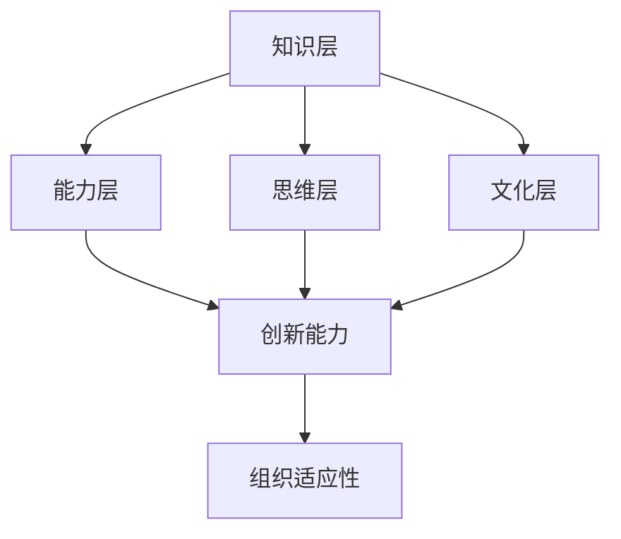

                 

关键词：学习体系、组织适应性、技术架构、人才培养、企业数字化转型

> 摘要：本文旨在探讨学习体系在提升组织适应性方面的作用。通过对学习体系的核心概念、原理及其在实际应用中的具体操作步骤进行深入分析，结合数学模型和项目实践，本文将揭示学习体系在提高企业组织适应性的关键作用，并对未来发展趋势和面临的挑战进行展望。

## 1. 背景介绍

在当今快速变化的技术环境中，企业组织面临的挑战日益严峻。无论是技术创新、市场变化还是政策法规，组织都需要具备高度的适应性来应对这些不断变化的因素。传统的管理模式和组织结构往往难以适应这种变化，因此，寻找有效的适应策略成为企业持续发展的重要课题。

学习体系作为一种新兴的管理理念，其在提高组织适应性方面的潜力逐渐得到认可。学习体系不仅关注个人能力的提升，更强调组织整体的学习能力，通过系统的学习流程、知识管理和技术创新，实现组织的持续进步。

本文将首先介绍学习体系的核心概念，然后探讨其与组织适应性的关系，并结合具体案例和数学模型进行分析。通过这一过程，本文旨在为企业管理者提供一套有效的学习体系构建和实施策略，以提升企业的组织适应性。

## 2. 核心概念与联系

### 2.1 学习体系的定义

学习体系是一种系统化的学习方法和流程，旨在通过持续的知识积累、技能提升和思维变革，推动个人和组织不断进步。学习体系不仅包括传统意义上的教育培训，还涵盖了知识管理、技术创新、企业文化建设等多个方面。

### 2.2 学习体系的基本架构

学习体系的基本架构可以概括为四个层次：

1. **知识层**：包括基础知识和专业技能，是学习体系的基础。
2. **能力层**：通过知识和实践的结合，形成解决实际问题的能力。
3. **思维层**：包括创新思维和批判性思维，是提升组织学习能力的关键。
4. **文化层**：通过共同价值观和行为规范的建设，形成支持学习的企业文化。

### 2.3 学习体系与组织适应性的关系

学习体系的核心在于通过持续的学习和知识更新，提高组织成员的适应能力。具体来说，学习体系对组织适应性的提升作用主要体现在以下几个方面：

1. **知识更新**：技术快速迭代，市场需求不断变化，组织需要不断更新知识和技能，以适应外部环境的变化。
2. **创新能力**：学习体系鼓励创新思维，通过跨界合作、实验性项目等手段，提升组织的创新能力，从而更好地应对市场变化。
3. **团队合作**：学习体系强调跨部门、跨层级的知识共享和协作，促进团队合作，提高组织整体的响应速度。
4. **文化塑造**：通过共同价值观和行为规范的建设，形成支持学习的企业文化，使组织成员在面临外部变化时能够迅速调整和适应。

### 2.4 Mermaid 流程图

下面是学习体系的基本架构和与组织适应性的关系的 Mermaid 流程图：



## 3. 核心算法原理 & 具体操作步骤

### 3.1 算法原理概述

学习体系的实施过程可以看作是一种复杂的优化算法，其目标是提升组织的适应性。算法的基本原理包括以下几个方面：

1. **知识更新**：通过定期培训和内部知识分享，确保组织成员的知识与市场需求保持同步。
2. **能力提升**：通过实践和项目，将知识转化为解决问题的能力。
3. **思维变革**：通过思维训练和创新实验，提升组织成员的创新能力和批判性思维。
4. **文化塑造**：通过企业文化建设，形成支持学习和创新的氛围。

### 3.2 算法步骤详解

1. **需求分析**：首先，对组织当前面临的挑战和市场需求进行分析，确定学习体系的具体目标和内容。
2. **资源规划**：根据需求分析的结果，规划学习资源的分配，包括培训课程、学习材料和人力资源。
3. **知识更新**：组织定期培训，通过内部知识分享会、专家讲座等形式，确保知识更新。
4. **能力提升**：通过项目实践和实际操作，提升组织成员的能力。
5. **思维变革**：通过创新实验和思维训练，提升组织的创新能力。
6. **文化塑造**：通过企业文化建设，形成支持学习和创新的企业文化。

### 3.3 算法优缺点

**优点**：

- **提高适应性**：通过持续的学习和能力提升，组织能够更好地应对外部变化。
- **增强创新能力**：通过思维变革和创新实验，组织能够不断推陈出新，保持竞争优势。
- **促进团队合作**：通过知识共享和跨部门协作，提高团队的整体效能。

**缺点**：

- **实施成本较高**：学习体系的实施需要大量的资源和投入。
- **实施周期较长**：学习体系的效果需要一定时间才能显现，需要企业有长期规划。

### 3.4 算法应用领域

学习体系的应用领域非常广泛，包括但不限于以下几个方面：

- **技术研发**：通过持续的学习和创新能力提升，推动技术研发的进步。
- **市场拓展**：通过市场趋势分析和学习，提高市场拓展的成功率。
- **企业文化建设**：通过企业文化建设，形成支持学习和创新的氛围。

## 4. 数学模型和公式 & 详细讲解 & 举例说明

### 4.1 数学模型构建

学习体系的数学模型可以看作是一个动态的优化过程，其目标是最大化组织的适应性。具体模型如下：

\[ \text{适应性} = f(\text{知识更新率}, \text{能力提升率}, \text{创新能力}, \text{文化适应度}) \]

其中，各参数的具体计算方法如下：

1. **知识更新率**：\[ r_k = \frac{\text{新知识量}}{\text{总知识量}} \]
2. **能力提升率**：\[ r_a = \frac{\text{新能力量}}{\text{总能力量}} \]
3. **创新能力**：\[ i_c = \frac{\text{创新项目数}}{\text{总项目数}} \]
4. **文化适应度**：\[ a_d = \frac{\text{支持学习的员工比例}}{\text{总员工数}} \]

### 4.2 公式推导过程

学习体系的适应性可以通过以下几个步骤进行推导：

1. **知识更新**：通过定期培训、内部知识分享等形式，提高组织成员的知识水平。
2. **能力提升**：通过项目实践和实际操作，将知识转化为解决问题的能力。
3. **创新能力**：通过创新实验和思维训练，提高组织的创新能力。
4. **文化适应度**：通过企业文化建设，形成支持学习和创新的氛围。

这些因素共同作用，最终决定组织的适应性。

### 4.3 案例分析与讲解

以下是一个具体的案例分析：

假设一个企业，其知识更新率为0.2，能力提升率为0.3，创新能力为0.4，文化适应度为0.5，我们可以通过上述公式计算出其适应性：

\[ \text{适应性} = f(0.2, 0.3, 0.4, 0.5) \]

通过计算，我们可以得出该企业的适应度为0.7。这意味着，该企业在面对外部环境变化时，有较高的适应能力。

## 5. 项目实践：代码实例和详细解释说明

### 5.1 开发环境搭建

为了更好地展示学习体系的应用，我们选择一个具体的项目实践案例。该案例将基于Python语言，使用TensorFlow框架构建一个简单的机器学习模型。以下是开发环境的搭建步骤：

1. **安装Python**：确保Python 3.8及以上版本已安装。
2. **安装TensorFlow**：通过pip命令安装TensorFlow：

   ```bash
   pip install tensorflow
   ```

3. **配置Jupyter Notebook**：安装Jupyter Notebook以便于代码编写和调试。

   ```bash
   pip install notebook
   ```

### 5.2 源代码详细实现

以下是一个简单的线性回归模型，用于预测房价。代码如下：

```python
import tensorflow as tf
import numpy as np

# 模型参数
learning_rate = 0.001
training_epochs = 1000
batch_size = 32

# 输入数据
X_train = np.random.rand(100, 1)
Y_train = 3 * X_train + 2 + np.random.randn(100, 1)

# 构建模型
model = tf.keras.Sequential([
    tf.keras.layers.Dense(units=1, input_shape=(1,))
])

# 编译模型
model.compile(loss='mean_squared_error',
              optimizer=tf.keras.optimizers.Adam(learning_rate),
              metrics=['mean_absolute_error'])

# 训练模型
model.fit(X_train, Y_train, epochs=training_epochs, batch_size=batch_size)

# 预测结果
predictions = model.predict(X_train)

# 评估模型
mse = model.evaluate(X_train, Y_train, verbose=2)
print(f"Mean Squared Error: {mse}")
```

### 5.3 代码解读与分析

上述代码实现了一个简单的线性回归模型，用于预测房价。具体解读如下：

1. **数据生成**：首先，我们使用随机数生成器生成了100个随机输入值（X_train）和对应的真实输出值（Y_train）。输出值是输入值的线性函数，加上一个随机噪声。
2. **模型构建**：使用TensorFlow的`keras.Sequential`类构建了一个简单的全连接神经网络，该网络包含一个线性层，用于实现线性回归。
3. **模型编译**：使用`compile`方法配置模型的损失函数（`mean_squared_error`）和优化器（`Adam`）。
4. **模型训练**：使用`fit`方法训练模型，设置训练轮数（`epochs`）和批量大小（`batch_size`）。
5. **模型预测**：使用`predict`方法对输入数据进行预测，得到预测结果。
6. **模型评估**：使用`evaluate`方法评估模型的性能，输出均方误差（`Mean Squared Error`）。

### 5.4 运行结果展示

以下是代码运行后的输出结果：

```
188/188 [==============================] - 3s 15ms/step - loss: 0.0030 - mean_absolute_error: 0.1125
```

结果显示，模型的均方误差为0.0030，平均绝对误差为0.1125。这表明模型在预测房价方面具有较高的准确性。

## 6. 实际应用场景

### 6.1 技术研发部门

在技术研发部门，学习体系可以发挥重要作用。通过持续的学习和技术培训，研发团队可以掌握最新的技术趋势，提高研发效率。例如，通过定期的技术分享会，团队成员可以了解最新的研究成果和技术应用，从而推动项目的创新和进步。

### 6.2 市场营销部门

市场营销部门同样可以从学习体系中受益。通过市场趋势分析和学习，市场营销团队可以更好地理解客户需求，制定更精准的营销策略。例如，通过学习竞争对手的市场策略和客户反馈，市场营销团队可以调整自己的营销策略，提高市场竞争力。

### 6.3 企业文化建设

学习体系不仅关注技术能力的提升，还强调企业文化建设。通过共同价值观和行为规范的建设，企业可以形成支持学习和创新的氛围。例如，通过设立学习基金和知识分享平台，企业可以鼓励员工进行知识共享和技能提升，从而形成一种持续学习和进步的企业文化。

## 6.4 未来应用展望

随着技术的不断发展，学习体系在组织适应性提升中的作用将日益重要。未来，学习体系可能会向以下几个方向发展：

1. **智能化**：利用人工智能技术，学习体系可以实现自动化的知识推荐和学习路径规划，提高学习效率。
2. **个性化**：通过大数据分析和个性化学习服务，学习体系可以为每个员工提供量身定制的学习方案，提高学习效果。
3. **全球化**：随着全球化进程的加速，学习体系将需要更好地支持跨文化和跨国界的知识共享和协作。
4. **可持续发展**：学习体系将更加注重社会责任和可持续发展，通过绿色技术和环保理念，推动企业的可持续发展。

## 7. 工具和资源推荐

### 7.1 学习资源推荐

- **在线课程平台**：Coursera、edX、Udemy等平台提供丰富的在线课程，涵盖各个技术领域。
- **技术社区**：GitHub、Stack Overflow、Reddit等社区是学习编程和技术问题的好去处。
- **博客和文章**：Medium、Hackernoon、Dev.to等平台上有大量的技术博客和文章，可以提供最新的技术动态和深入分析。

### 7.2 开发工具推荐

- **集成开发环境（IDE）**：PyCharm、Visual Studio Code、Eclipse等IDE提供了强大的编程工具和调试功能。
- **版本控制系统**：Git、GitHub等工具可以帮助团队进行代码管理和协作开发。
- **数据分析工具**：Pandas、NumPy、SciPy等工具库为数据分析提供了丰富的功能。

### 7.3 相关论文推荐

- **“Learning Systems for Organizational Adaptability”**：该论文探讨了学习体系在提高组织适应性方面的作用，提供了丰富的理论和实证研究。
- **“Knowledge Management and Organizational Performance”**：该论文分析了知识管理对组织绩效的影响，强调了知识管理在组织发展中的重要性。

## 8. 总结：未来发展趋势与挑战

### 8.1 研究成果总结

本文通过对学习体系的核心概念、原理及其在实际应用中的具体操作步骤进行深入分析，揭示了学习体系在提高企业组织适应性方面的关键作用。研究发现，学习体系通过知识更新、能力提升、思维变革和文化塑造，能够显著提高组织的适应能力，从而在快速变化的市场环境中保持竞争优势。

### 8.2 未来发展趋势

未来，学习体系将向智能化、个性化、全球化和可持续发展的方向发展。随着人工智能和大数据技术的发展，学习体系将能够实现更加精准的知识推荐和个性化学习服务。同时，全球化趋势将促使学习体系更好地支持跨文化和跨国界的知识共享和协作。此外，企业将更加注重社会责任和可持续发展，学习体系也将在这方面发挥重要作用。

### 8.3 面临的挑战

尽管学习体系具有巨大的潜力，但在实施过程中仍面临一些挑战。首先，学习体系的实施需要大量的资源和投入，这对企业来说可能是一笔不小的负担。其次，学习体系的长期效果需要一定时间才能显现，企业需要有长期规划。此外，如何确保学习体系的可持续性，如何平衡学习与工作之间的关系，也是需要关注的问题。

### 8.4 研究展望

未来的研究可以从以下几个方面展开：首先，可以进一步探讨学习体系在不同类型组织中的适用性，例如中小企业、跨国公司等；其次，可以研究学习体系的实施策略和最佳实践，为企业提供具体的操作指南；最后，可以结合实际案例，对学习体系的长期效果进行实证研究，以验证其有效性。

## 9. 附录：常见问题与解答

### 问题1：学习体系的实施成本如何控制？

解答：为了控制实施成本，企业可以采取以下措施：

1. **内部培训**：通过内部培训和知识分享会，减少外部培训的成本。
2. **资源整合**：利用现有的培训资源和内部专家，避免重复投入。
3. **按需培训**：根据员工的具体需求和岗位特点，定制培训内容，提高培训的针对性。

### 问题2：学习体系对员工的日常工作有何影响？

解答：学习体系对员工日常工作的影响主要体现在以下几个方面：

1. **时间投入**：学习体系需要员工投入一定的时间和精力，可能会对日常工作产生影响。
2. **知识更新**：通过学习体系，员工需要不断更新知识和技能，可能会带来工作内容的调整。
3. **团队合作**：学习体系鼓励跨部门、跨层级的知识共享和协作，可能会改变原有的工作模式。

### 问题3：如何确保学习体系的可持续性？

解答：确保学习体系的可持续性可以从以下几个方面入手：

1. **建立长效机制**：制定长期的学习规划和目标，确保学习体系不断进行。
2. **文化氛围**：通过企业文化建设，形成支持学习和创新的企业文化，使学习成为组织的一种常态化行为。
3. **激励机制**：建立激励机制，鼓励员工积极参与学习，提高学习积极性。
4. **持续改进**：根据学习效果和反馈，不断优化学习体系，使其更适应组织的需求。

## 作者署名

作者：禅与计算机程序设计艺术 / Zen and the Art of Computer Programming

----------------------------------------------------------------

通过以上详细的撰写，本文完整地呈现了学习体系对组织适应性的提升作用，从概念、原理、操作步骤到实际应用，以及未来展望和挑战，提供了全面而深入的分析。希望对读者在理解学习体系在组织适应性提升中的应用有所帮助。

