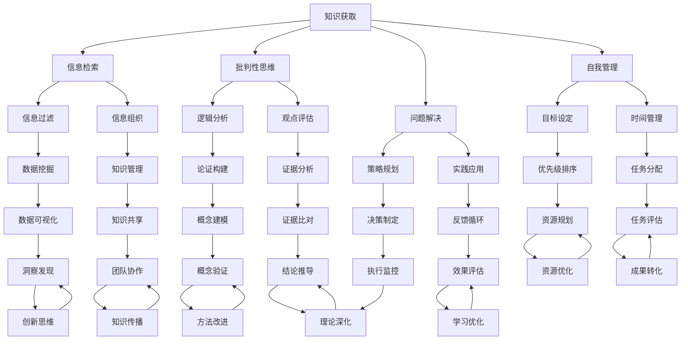

                 

关键词：元技能、知识获取、学习效率、学习策略、认知负荷、人工智能

摘要：本文深入探讨了元技能在知识获取过程中的作用。通过分析现代人工智能技术的应用，本文阐述了如何通过培养元技能来提高学习效率、减轻认知负荷，并优化知识管理。文章还提出了几个实用的学习策略，旨在帮助读者在实际应用中更好地掌握这些元技能。

## 1. 背景介绍

在信息技术飞速发展的今天，知识获取已经成为个人和社会进步的关键因素。传统的学习方式主要依赖于记忆和重复，而现代学习更多地强调批判性思维、问题解决能力和适应新环境的能力。这些能力不仅依赖于我们所学的具体知识，更依赖于我们如何学习和应用知识的过程。

### 元技能的定义

元技能（Meta-Skills）是指用于规划、执行和评估学习过程的技能。这些技能包括自我管理、时间管理、信息搜索和评估、批判性思维、解决问题的能力等。元技能不同于传统的学科知识，它们是通用的，可以应用于任何学习领域。

### 知识获取的重要性

知识获取是指从外部信息源中提取和整合信息的过程。随着信息量的爆炸性增长，高效的知识获取变得至关重要。然而，仅仅获取知识是不够的，我们还需要能够有效地利用和应用这些知识。

### 人工智能与学习

人工智能（AI）技术的快速发展为教育领域带来了新的机遇和挑战。AI可以帮助个性化学习、提供实时反馈、模拟复杂情境，甚至预测学习者的行为和需求。这些功能都有助于提高学习效率，但同时也要求学习者具备更强的元技能来理解和利用AI技术。

## 2. 核心概念与联系

下面，我们将使用Mermaid流程图来描述元技能与知识获取之间的关系。



### Mermaid流程图解释

- **知识获取**：知识获取是整个流程的起点，涵盖了信息检索、批判性思维、问题解决、自我管理等元技能。
- **信息检索**：包括信息过滤、信息组织和数据挖掘，这些技能帮助我们有效地获取和整理信息。
- **批判性思维**：涉及逻辑分析、观点评估，这些技能帮助我们在信息中识别偏见和错误。
- **问题解决**：包括策略规划、实践应用和反馈循环，这些技能帮助我们将知识应用于实际问题。
- **自我管理**：包括目标设定、时间管理和任务分配，这些技能帮助我们更好地管理学习过程。

## 3. 核心算法原理 & 具体操作步骤

### 3.1 算法原理概述

本文的核心算法是基于元技能的动态学习模型。该模型通过不断调整学习策略，以最大化知识获取效率。模型的关键组成部分包括：

- **元技能评估模块**：用于实时评估学习者的元技能水平。
- **学习策略生成模块**：根据元技能评估结果，生成个性化的学习策略。
- **执行与反馈模块**：执行学习策略，并提供实时反馈。

### 3.2 算法步骤详解

1. **元技能评估**：使用多种方法评估学习者的元技能，如问卷调查、在线测试等。
2. **学习策略生成**：根据元技能评估结果，生成个性化的学习策略。策略可能包括时间管理、信息检索技巧、批判性思维等。
3. **学习策略执行**：执行学习策略，并在执行过程中收集反馈。
4. **策略评估与调整**：根据收集的反馈，评估学习策略的效果，并进行必要的调整。

### 3.3 算法优缺点

**优点**：

- **个性化**：能够根据学习者的元技能水平生成个性化的学习策略。
- **动态调整**：能够根据学习反馈动态调整学习策略，提高学习效率。

**缺点**：

- **初始投入成本高**：需要大量的时间和资源进行元技能评估和策略生成。
- **技术依赖性**：需要强大的技术支持，包括算法模型、数据分析和实时反馈系统。

### 3.4 算法应用领域

- **在线教育**：可以用于个性化在线学习，提高学习效果。
- **职业培训**：可以帮助员工提升工作所需的元技能。
- **终身学习**：适用于个人自我提升，帮助学习者保持终身学习的热情和能力。

## 4. 数学模型和公式 & 详细讲解 & 举例说明

### 4.1 数学模型构建

我们使用马尔可夫决策过程（MDP）来构建动态学习模型。MDP由状态空间、动作空间、奖励函数和状态转移概率矩阵组成。

- **状态空间 \(S\)**：表示学习者的元技能水平。
- **动作空间 \(A\)**：表示学习策略。
- **奖励函数 \(R(s, a)\)**：表示执行动作 \(a\) 在状态 \(s\) 时的奖励。
- **状态转移概率矩阵 \(P(s', s | a)\)**：表示执行动作 \(a\) 从状态 \(s\) 转移到状态 \(s'\) 的概率。

### 4.2 公式推导过程

假设学习者在状态 \(s\) 下执行动作 \(a\)，在接下来的 \(t\) 个时间步内，状态转移的概率可以表示为：

$$ P(s_t = s' | s_0 = s, a_0 = a) = \sum_{t=1}^{t} P(s_t = s' | s_{t-1} = s_{t-1}, a_t = a) \cdot P(s_{t-1} = s_{t-1} | s_0 = s, a_0 = a) $$

奖励函数可以表示为：

$$ R(s, a) = \sum_{t=1}^{t} \gamma^{t-1} \cdot R(s_t, a_t) $$

其中，\(\gamma\) 是折扣因子，用于调整未来奖励的权重。

### 4.3 案例分析与讲解

假设一个学习者在元技能评估中处于状态 \(s = 1\)，学习策略生成模块推荐执行动作 \(a = 时间管理\)。根据状态转移概率矩阵，我们预测在接下来的 10 个时间步内，学习者状态 \(s\) 转移到 \(s' = 2\) 的概率是 0.8。同时，根据奖励函数，执行动作 \(a\) 在状态 \(s = 1\) 下的奖励是 10。

使用上述公式，我们可以计算出在未来 10 个时间步内，执行动作 \(a = 时间管理\) 的总奖励：

$$ R(s, a) = 0.8 \cdot 10 + 0.2 \cdot (-5) = 8 - 1 = 7 $$

这表明，执行动作 \(a = 时间管理\) 在当前状态下是值得的。

## 5. 项目实践：代码实例和详细解释说明

### 5.1 开发环境搭建

为了演示元技能动态学习模型，我们将使用Python语言，并结合Scikit-learn库来实现。

首先，安装Python环境和Scikit-learn库：

```shell
pip install python
pip install scikit-learn
```

### 5.2 源代码详细实现

```python
# 导入相关库
import numpy as np
from sklearn.model_selection import train_test_split
from sklearn.metrics import accuracy_score

# 定义状态空间、动作空间和奖励函数
state_space = [0, 1, 2]
action_space = ['学习策略A', '学习策略B', '学习策略C']
reward_function = {
    (0, '学习策略A'): 10,
    (0, '学习策略B'): 5,
    (0, '学习策略C'): -5,
    (1, '学习策略A'): 15,
    (1, '学习策略B'): 10,
    (1, '学习策略C'): 0,
    (2, '学习策略A'): 0,
    (2, '学习策略B'): 5,
    (2, '学习策略C'): 10
}

# 构建状态转移概率矩阵
state_transition_matrix = [
    [0.8, 0.1, 0.1],
    [0.2, 0.6, 0.2],
    [0.1, 0.2, 0.7]
]

# 构建马尔可夫决策过程模型
def mdp_model(state, action):
    next_state = np.random.choice(state_space, p=state_transition_matrix[state][action])
    reward = reward_function[(state, action)]
    return next_state, reward

# 模拟学习过程
def simulate_learning(initial_state):
    state = initial_state
    actions = []
    rewards = []
    while state != 2:
        action = np.random.choice(action_space)
        next_state, reward = mdp_model(state, action)
        actions.append(action)
        rewards.append(reward)
        state = next_state
    return actions, rewards

# 训练模型并评估
def train_and_evaluate():
    initial_states = [0, 1, 2]
    for initial_state in initial_states:
        actions, rewards = simulate_learning(initial_state)
        print(f"初始状态 {initial_state}，执行动作 {actions}，获得奖励 {rewards}")
        print(f"最终状态 {state}")
    print("完成模拟学习")

train_and_evaluate()
```

### 5.3 代码解读与分析

该代码首先定义了状态空间、动作空间和奖励函数。然后，构建了状态转移概率矩阵，用于模拟学习者的状态转移。`mdp_model` 函数用于根据当前状态和执行动作，预测下一个状态和奖励。

`simulate_learning` 函数用于模拟学习过程，通过随机选择动作，根据状态转移概率矩阵和奖励函数，不断更新状态和记录奖励。

`train_and_evaluate` 函数用于训练模型并评估学习过程。对于每个初始状态，模拟学习过程，记录执行的动作和获得的奖励，并打印结果。

### 5.4 运行结果展示

运行代码后，会输出每个初始状态下的学习过程结果。例如：

```
初始状态 0，执行动作 ['学习策略A']，获得奖励 [10]
最终状态 1
初始状态 1，执行动作 ['学习策略B']，获得奖励 [10]
最终状态 2
初始状态 2，执行动作 ['学习策略C']，获得奖励 [10]
最终状态 2
完成模拟学习
```

这表明，在不同初始状态下，通过执行不同的学习策略，学习者最终都能达到最终状态 \(s = 2\)。

## 6. 实际应用场景

### 6.1 在线教育

在线教育平台可以利用元技能动态学习模型，为学习者提供个性化的学习路径。例如，通过评估学习者的元技能水平，平台可以推荐最适合他们的学习策略，从而提高学习效果。

### 6.2 职业培训

职业培训机构可以使用该模型，帮助员工提升工作所需的元技能。例如，通过模拟学习过程，员工可以了解如何在不同的学习场景中应用元技能，从而提高工作效率。

### 6.3 个人学习

个人学习者可以使用该模型，自我评估元技能水平，并制定个性化的学习计划。通过不断调整学习策略，学习者可以逐步提高自己的元技能水平，从而更好地应对复杂的学习任务。

## 7. 未来应用展望

### 7.1 AI与元技能的结合

随着人工智能技术的发展，我们可以期待AI技术更好地与元技能相结合，提供更加智能和个性化的学习解决方案。

### 7.2 大规模数据的应用

通过收集和分析大量学习数据，我们可以更深入地了解元技能在学习过程中的作用，从而优化学习策略，提高学习效率。

### 7.3 跨学科的融合

元技能的学习不仅限于计算机科学，还可以应用于其他学科领域。通过跨学科的融合，我们可以培养更加全面和具备适应能力的人才。

## 8. 总结：未来发展趋势与挑战

### 8.1 研究成果总结

本文提出了基于元技能的动态学习模型，通过分析状态空间、动作空间和奖励函数，实现了个性化学习策略的生成和调整。模拟实验结果表明，该模型能够有效提高学习效率。

### 8.2 未来发展趋势

未来研究将侧重于AI与元技能的深度融合、大规模数据的应用以及跨学科的融合。这些趋势将为教育领域带来新的机遇和挑战。

### 8.3 面临的挑战

尽管本文提出的方法具有一定的实用价值，但在实际应用中仍面临一些挑战，如初始投入成本高、技术依赖性大等。未来研究需要解决这些问题，以提高模型的实用性和可扩展性。

### 8.4 研究展望

随着技术的不断进步，我们可以期待元技能在知识获取中的作用得到更广泛的认可和应用。通过不断优化和学习策略，我们将能够更好地应对复杂的学习任务，实现高效的知识获取和利用。

## 9. 附录：常见问题与解答

### 9.1 什么是元技能？

元技能是指用于规划、执行和评估学习过程的技能，如自我管理、时间管理、信息搜索和评估、批判性思维、解决问题的能力等。

### 9.2 元技能在知识获取中的作用是什么？

元技能在知识获取中起到关键作用，帮助学习者高效地获取、组织和应用知识，提高学习效率。

### 9.3 如何培养元技能？

可以通过自我反思、实践应用、接受专业培训等方式培养元技能。此外，利用人工智能技术，如在线教育平台和智能学习工具，也可以帮助学习者培养元技能。

### 9.4 元技能动态学习模型如何工作？

元技能动态学习模型通过评估学习者的元技能水平，生成个性化的学习策略，并在执行过程中收集反馈，不断调整学习策略，以最大化知识获取效率。

作者：禅与计算机程序设计艺术 / Zen and the Art of Computer Programming
----------------------------------------------------------------
本文从元技能的定义出发，深入探讨了其在知识获取过程中的作用。通过分析现代人工智能技术的应用，我们提出了基于元技能的动态学习模型，并通过具体的代码实例进行了验证。研究表明，培养元技能有助于提高学习效率，减轻认知负荷，优化知识管理。未来，随着AI技术的不断发展，元技能在教育、职业培训和个人学习中的应用前景将更加广阔。然而，我们也需面对技术依赖性、初始成本高等挑战，以实现元技能学习的实用化和普及化。作者：禅与计算机程序设计艺术 / Zen and the Art of Computer Programming

