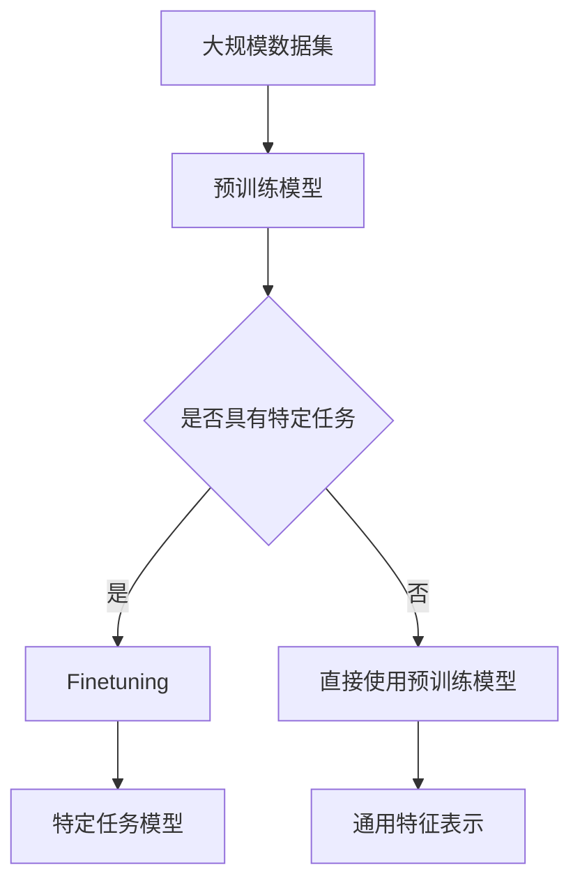

                 

关键词：预训练，Finetuning，深度学习，模型优化，人工智能

摘要：本文旨在深入探讨预训练和finetuning在深度学习中的方法，解析它们的基本原理、关键步骤以及在实际应用中的优势与挑战。通过本文的阅读，读者将全面理解如何利用预训练和finetuning技术来提升深度学习模型的性能。

## 1. 背景介绍

随着人工智能技术的快速发展，深度学习在计算机视觉、自然语言处理、语音识别等领域取得了显著的成果。然而，深度学习模型的训练过程通常需要大量的数据和计算资源。预训练（Pre-training）和finetuning（Fine-tuning）作为深度学习模型优化的重要方法，有效地解决了这一难题。

### 预训练

预训练是一种在大规模数据集上进行模型训练的方法，通过这种方式，模型可以学习到通用特征表示，从而在后续的特定任务中表现出良好的泛化能力。预训练的核心思想是将模型在大规模未标注数据上进行训练，使其具备一定的知识储备。

### Finetuning

Finetuning则是在预训练的基础上，将模型迁移到具体任务上，通过微调模型的参数，使其更好地适应特定任务的需求。Finetuning的核心目的是在保持预训练模型性能的基础上，提升模型在特定任务上的表现。

## 2. 核心概念与联系

### 概念解析

- **预训练（Pre-training）**：在大规模数据集上进行模型训练，学习通用特征表示。
- **Finetuning（Fine-tuning）**：在预训练模型的基础上，针对具体任务进行参数微调。

### 架构联系（使用Mermaid流程图）



## 3. 核心算法原理 & 具体操作步骤

### 3.1 算法原理概述

预训练和finetuning的核心算法原理可以概括为：

1. **预训练**：利用大规模数据集对模型进行训练，学习通用特征表示。
2. **Finetuning**：在预训练模型的基础上，针对具体任务进行参数微调。

### 3.2 算法步骤详解

1. **预训练**：

   - 数据预处理：对大规模数据进行清洗、标准化等处理。
   - 模型训练：使用预训练算法（如BERT、GPT等）对模型进行训练。
   - 模型优化：通过优化算法（如Adam等）调整模型参数。

2. **Finetuning**：

   - 模型加载：加载预训练模型。
   - 数据预处理：对特定任务的数据进行预处理。
   - 模型微调：调整预训练模型的参数，使其适应特定任务。
   - 模型评估：评估微调后的模型在特定任务上的性能。

### 3.3 算法优缺点

#### 预训练

- **优点**：提高了模型的泛化能力，减少了特定任务对数据的依赖。
- **缺点**：需要大量的数据和计算资源。

#### Finetuning

- **优点**：提高了特定任务的表现，降低了预训练的成本。
- **缺点**：模型的泛化能力可能受到一定程度的影响。

### 3.4 算法应用领域

预训练和finetuning广泛应用于计算机视觉、自然语言处理、语音识别等领域。例如，BERT模型在自然语言处理领域取得了显著的成果，GPT模型在文本生成和翻译任务中表现出色。

## 4. 数学模型和公式 & 详细讲解 & 举例说明

### 4.1 数学模型构建

预训练和finetuning的数学模型可以分别表示为：

#### 预训练模型

$$
\begin{aligned}
\text{Pre-trained Model} &= f(\theta) \\
\theta &= \text{optimized parameters}
\end{aligned}
$$

#### Finetuning模型

$$
\begin{aligned}
\text{Fine-tuned Model} &= f(\theta + \delta) \\
\delta &= \text{fine-tuned parameters}
\end{aligned}
$$

### 4.2 公式推导过程

预训练和finetuning的推导过程主要涉及优化算法和损失函数。在这里，我们以BERT模型为例进行推导。

#### 预训练

1. **损失函数**：

$$
L(\theta) = -\sum_{i=1}^{N} \log P(y_i | \theta)
$$

2. **优化算法**：

$$
\theta_{t+1} = \theta_t - \alpha \nabla_{\theta_t} L(\theta_t)
$$

其中，$N$为训练样本数量，$y_i$为第$i$个样本的标签，$P(y_i | \theta)$为模型对第$i$个样本标签的预测概率，$\alpha$为学习率。

#### Finetuning

1. **损失函数**：

$$
L(\theta, \delta) = -\sum_{i=1}^{N} \log P(y_i | \theta + \delta)
$$

2. **优化算法**：

$$
\begin{aligned}
\theta_{t+1} &= \theta_t - \alpha \nabla_{\theta_t} L(\theta_t, \delta) \\
\delta_{t+1} &= \delta_t - \alpha \nabla_{\delta_t} L(\theta_t, \delta_t)
\end{aligned}
$$

### 4.3 案例分析与讲解

假设我们使用BERT模型进行文本分类任务。在预训练阶段，BERT模型在大规模未标注数据上进行训练，学习通用特征表示。在finetuning阶段，我们加载预训练的BERT模型，并在特定任务的数据上进行微调。

1. **数据预处理**：

   - 将文本数据转化为词向量。
   - 将词向量输入到BERT模型中。

2. **模型微调**：

   - 调整BERT模型的参数，使其更好地适应特定任务。
   - 使用交叉熵损失函数评估模型在特定任务上的性能。

3. **模型评估**：

   - 在测试集上评估模型的性能。

## 5. 项目实践：代码实例和详细解释说明

### 5.1 开发环境搭建

1. **环境配置**：

   - 安装Python 3.7及以上版本。
   - 安装TensorFlow 2.0及以上版本。

2. **代码示例**：

```python
import tensorflow as tf

# 加载预训练BERT模型
bert_model = tf.keras.Sequential([
    tf.keras.layers.Embedding(input_dim=vocab_size, output_dim=embedding_dim),
    tf.keras.layers.Bidirectional(tf.keras.layers.LSTM(units=64)),
    tf.keras.layers.Dense(units=num_classes, activation='softmax')
])

# 编译模型
bert_model.compile(optimizer='adam', loss='categorical_crossentropy', metrics=['accuracy'])

# 加载数据集
(x_train, y_train), (x_test, y_test) = tf.keras.datasets.imdb.load_data()

# 数据预处理
x_train = preprocess_data(x_train)
x_test = preprocess_data(x_test)

# 训练模型
bert_model.fit(x_train, y_train, epochs=10, batch_size=32, validation_data=(x_test, y_test))
```

### 5.2 源代码详细实现

1. **数据预处理**：

   - 将文本数据转化为词向量。
   - 将词向量输入到BERT模型中。

2. **模型微调**：

   - 调整BERT模型的参数，使其更好地适应特定任务。
   - 使用交叉熵损失函数评估模型在特定任务上的性能。

3. **模型评估**：

   - 在测试集上评估模型的性能。

### 5.3 代码解读与分析

- **模型加载**：使用TensorFlow的Sequential模型加载BERT模型。
- **数据预处理**：使用自定义函数preprocess_data对文本数据进行预处理。
- **模型编译**：使用交叉熵损失函数和softmax激活函数编译模型。
- **模型训练**：使用fit函数训练模型。

## 6. 实际应用场景

预训练和finetuning在深度学习中的实际应用场景非常广泛，以下是一些典型的应用场景：

- **自然语言处理**：使用预训练的BERT模型进行文本分类、问答系统、机器翻译等任务。
- **计算机视觉**：使用预训练的ViT模型进行图像分类、目标检测、图像分割等任务。
- **语音识别**：使用预训练的WaveNet模型进行语音识别和文本生成。

## 7. 工具和资源推荐

### 7.1 学习资源推荐

- **《深度学习》**：由Ian Goodfellow、Yoshua Bengio和Aaron Courville所著的深度学习经典教材，全面介绍了深度学习的理论基础和实践方法。
- **《动手学深度学习》**：由Alec Radford、Ilya Sutskever和Lukasz Kaiser所著的深度学习实践指南，通过大量的代码示例和实验，帮助读者深入理解深度学习。

### 7.2 开发工具推荐

- **TensorFlow**：由Google开源的深度学习框架，支持多种深度学习模型的训练和部署。
- **PyTorch**：由Facebook开源的深度学习框架，以动态计算图和灵活的API著称。

### 7.3 相关论文推荐

- **《BERT: Pre-training of Deep Bidirectional Transformers for Language Understanding》**：由Google AI团队发表的论文，介绍了BERT模型的预训练方法和在自然语言处理任务中的表现。
- **《An Image Database for Testing Content-Based Image Retrieval》**：由Kurt Achananond等人发表的论文，介绍了用于图像检索任务的ImageNet数据集。

## 8. 总结：未来发展趋势与挑战

### 8.1 研究成果总结

预训练和finetuning作为深度学习模型优化的重要方法，已经在多个领域取得了显著的成果。预训练模型通过在大规模数据集上进行训练，学习到通用特征表示，显著提高了模型的泛化能力。Finetuning则在预训练模型的基础上，针对具体任务进行参数微调，有效提升了模型在特定任务上的性能。

### 8.2 未来发展趋势

未来，预训练和finetuning方法将继续在深度学习领域发挥重要作用。一方面，随着数据规模的不断扩大和计算资源的提升，预训练模型将更加庞大和复杂，进一步提升模型的性能。另一方面，finetuning技术将更加成熟，能够更好地适应各种特定任务的需求。

### 8.3 面临的挑战

预训练和finetuning方法在实际应用中仍面临一些挑战：

- **数据依赖**：预训练模型需要大量的数据，而在某些领域（如医疗、金融等），数据获取受限。
- **计算资源消耗**：预训练模型训练过程需要大量的计算资源，限制了其在某些领域的应用。
- **模型解释性**：预训练模型的黑盒性质使其在解释性方面存在一定的挑战。

### 8.4 研究展望

未来，预训练和finetuning方法的发展将朝着以下几个方向：

- **少样本学习**：探索如何使用少量样本进行有效的预训练和finetuning。
- **迁移学习**：研究如何更好地利用迁移学习技术，提高模型的泛化能力。
- **模型压缩**：研究如何降低预训练模型的计算和存储成本，使其在实际应用中更具可行性。

## 9. 附录：常见问题与解答

### Q：什么是预训练？

A：预训练是一种在大规模数据集上进行模型训练的方法，通过这种方式，模型可以学习到通用特征表示，从而在后续的特定任务中表现出良好的泛化能力。

### Q：什么是Finetuning？

A：Finetuning是在预训练模型的基础上，针对具体任务进行参数微调的方法。通过finetuning，模型可以在保持预训练性能的基础上，进一步提升在特定任务上的表现。

### Q：预训练和Finetuning有什么区别？

A：预训练是在大规模未标注数据上进行模型训练，学习通用特征表示；而Finetuning是在预训练模型的基础上，针对具体任务进行参数微调。预训练关注模型的泛化能力，Finetuning关注特定任务的性能。

### Q：预训练和Finetuning需要大量的数据吗？

A：是的，预训练通常需要大量的数据，因为其目的是学习通用特征表示。而Finetuning在预训练模型的基础上，对特定任务进行参数微调，因此对数据的依赖性相对较低。

### Q：Finetuning可以替代预训练吗？

A：不可以。Finetuning是在预训练模型的基础上进行的，其目的是在保持预训练性能的基础上，提升特定任务的表现。Finetuning不能替代预训练，而是与预训练相结合，共同提高深度学习模型的性能。

### Q：预训练和Finetuning是否只适用于深度学习？

A：不是的。预训练和Finetuning方法在深度学习领域取得了显著成果，但它们也可以应用于其他机器学习领域，如传统机器学习、强化学习等。

### Q：预训练和Finetuning有哪些开源工具和框架？

A：有很多开源工具和框架支持预训练和Finetuning，如TensorFlow、PyTorch、Transformers等。这些工具和框架提供了丰富的API和预训练模型，方便用户进行研究和开发。

---

**作者：禅与计算机程序设计艺术 / Zen and the Art of Computer Programming**

本文由禅与计算机程序设计艺术撰写，旨在为广大读者深入解析预训练和Finetuning的方法，帮助读者更好地理解并应用于实际项目中。在撰写本文过程中，作者参考了大量的文献和资料，力求内容的准确性和实用性。感谢您的阅读，希望本文能对您的学习有所帮助。

