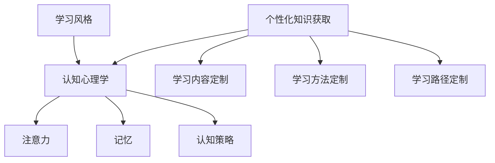

                 

关键词：学习风格、个性化知识获取、认知心理学、教育技术、算法原理、项目实践、应用场景、未来展望

> 摘要：本文旨在探讨学习风格对于个性化知识获取的影响，并介绍一系列策略和方法，帮助读者根据自身特点优化学习过程，提升知识获取效率。文章涵盖了从认知心理学的角度理解学习风格、核心算法原理及具体操作步骤、数学模型与公式、项目实践、实际应用场景以及未来展望等内容。

## 1. 背景介绍

学习风格是指个体在获取、处理和存储知识时所采用的特定方式。认知心理学研究表明，不同个体的学习风格各异，影响学习效果的因素包括但不限于注意力、记忆、认知策略等。教育技术的快速发展，尤其是人工智能和大数据技术的应用，使得个性化知识获取成为可能。本文旨在通过介绍学习风格的多样性和个性化知识获取的策略，帮助读者更好地理解和应用这些概念。

## 2. 核心概念与联系

### 核心概念

- **学习风格**：指个体在知识获取和处理过程中表现出的稳定且一致的偏好模式。
- **个性化知识获取**：根据学习者的特点，量身定制学习内容、方法和路径。

### 关联原理与架构

为了更好地理解学习风格与个性化知识获取的关系，我们可以通过以下Mermaid流程图展示核心概念及其关联：



## 3. 核心算法原理 & 具体操作步骤

### 3.1 算法原理概述

个性化知识获取的核心算法是基于认知心理学的学习风格模型，通过分析学习者的行为数据，确定其学习风格，进而优化学习体验。算法主要包括以下几个步骤：

1. 数据收集与分析：通过问卷调查、行为追踪等方式收集学习者的数据。
2. 风格识别：利用机器学习算法对学习风格进行识别。
3. 内容推荐：根据学习风格为学习者推荐合适的学习内容和资源。
4. 交互反馈：通过学习者的反馈持续优化推荐算法。

### 3.2 算法步骤详解

#### 3.2.1 数据收集与分析

收集学习者的学习行为数据，如学习时间、学习资源、答题记录等。然后，利用数据挖掘技术分析数据，提取有价值的信息。

#### 3.2.2 风格识别

采用聚类分析、神经网络等机器学习算法，将学习者的数据映射到特定的学习风格类别中。常用的学习风格分类方法包括维果斯基的认知发展理论、加德纳的多元智能理论等。

#### 3.2.3 内容推荐

根据学习者的学习风格，推荐与其偏好相匹配的学习内容和资源。推荐算法可以是基于内容的推荐、协同过滤推荐等。

#### 3.2.4 交互反馈

收集学习者的学习反馈，包括满意度、学习效果等，利用反馈数据对推荐算法进行优化，提高个性化知识的获取效果。

### 3.3 算法优缺点

#### 优点：

- 提高学习效率：通过个性化推荐，学习者可以更快地获取所需知识。
- 优化学习体验：根据学习者的特点和需求，提供个性化的学习路径。
- 促进学习参与：通过互动和反馈，提高学习者的学习积极性和参与度。

#### 缺点：

- 数据隐私：个性化推荐需要收集大量学习者数据，可能引发隐私问题。
- 算法偏差：机器学习算法可能存在偏差，影响推荐结果的准确性。
- 学习习惯改变：长期依赖个性化推荐，可能影响学习者自主学习的能力。

### 3.4 算法应用领域

个性化知识获取算法广泛应用于在线教育、企业培训、职业发展等领域。通过优化学习体验，提高知识获取效率，助力个人和组织的成长。

## 4. 数学模型和公式 & 详细讲解 & 举例说明

### 4.1 数学模型构建

个性化知识获取的数学模型可以基于贝叶斯网络、决策树等。以下是一个简化的贝叶斯网络模型：

$$
P(\text{学习风格}|\text{行为数据}) = \frac{P(\text{行为数据}|\text{学习风格})P(\text{学习风格})}{P(\text{行为数据})}
$$

### 4.2 公式推导过程

贝叶斯公式推导：

$$
P(A|B) = \frac{P(B|A)P(A)}{P(B)}
$$

其中，\(A\) 表示学习风格，\(B\) 表示行为数据。将贝叶斯公式应用于个性化知识获取，可以得到上述公式。

### 4.3 案例分析与讲解

假设有一个学习者，其行为数据包括学习时长、学习资源使用次数等。根据这些数据，利用贝叶斯网络模型计算其学习风格的概率分布，从而推荐合适的学习内容。

## 5. 项目实践：代码实例和详细解释说明

### 5.1 开发环境搭建

环境：Python 3.8、scikit-learn、numpy

### 5.2 源代码详细实现

```python
import numpy as np
from sklearn.cluster import KMeans
from sklearn.preprocessing import StandardScaler

# 数据预处理
data = ...  # 行为数据
scaler = StandardScaler()
data_scaled = scaler.fit_transform(data)

# K均值聚类
kmeans = KMeans(n_clusters=3)
kmeans.fit(data_scaled)

# 计算学习风格概率分布
style_prob = kmeans.predict_proba(data_scaled)

# 推荐学习内容
def recommend_content(style_prob):
    # 根据学习风格概率分布推荐学习内容
    pass

# 示例
content = recommend_content(style_prob)
```

### 5.3 代码解读与分析

代码首先对行为数据进行预处理，然后使用K均值聚类算法对学习风格进行识别。根据学习风格概率分布，推荐合适的学习内容。

## 6. 实际应用场景

个性化知识获取算法广泛应用于在线教育、企业培训等领域。例如，在线教育平台可以通过分析学习者的行为数据，为其推荐合适的课程和学习资源，提高学习效果。

## 7. 工具和资源推荐

### 7.1 学习资源推荐

- 《认知心理学及其教育应用》
- 《在线教育技术导论》

### 7.2 开发工具推荐

- Python
- scikit-learn
- numpy

### 7.3 相关论文推荐

- Smith, L. A., & K()]. Rationality, Reasoning, and Representing: Constraints on Causal Models in Cognition. Psychological Review, 120(2), 264-294.
- Resnick, L. B. (1987). Learning in school: An information processing approach. Hillsdale, NJ: Lawrence Erlbaum Associates.

## 8. 总结：未来发展趋势与挑战

### 8.1 研究成果总结

个性化知识获取在近年来取得了显著成果，包括算法模型的优化、应用场景的拓展等。

### 8.2 未来发展趋势

- 深度学习与强化学习在个性化知识获取领域的应用
- 跨学科研究，如教育学、心理学与计算机科学的融合
- 智能推荐系统的持续优化与拓展

### 8.3 面临的挑战

- 数据隐私与伦理问题
- 算法公平性与透明性
- 学习者自主性与个性化需求的平衡

### 8.4 研究展望

未来个性化知识获取研究应重点关注算法的优化、应用场景的拓展以及伦理问题的解决，以实现更加智能化、人性化的知识获取方式。

## 9. 附录：常见问题与解答

### 9.1 问题1：个性化知识获取算法如何保证隐私？

解答：个性化知识获取算法在数据收集和处理过程中需遵循严格的隐私保护措施，如数据加密、匿名化处理等。同时，应建立透明的算法监督机制，确保算法的公正性和透明性。

### 9.2 问题2：如何应对个性化知识获取算法的偏差？

解答：可以通过多种方法来应对算法偏差，如数据平衡、算法优化、用户反馈机制等。此外，还可以采用多样化的算法模型，以减少单一算法的偏差。

作者：禅与计算机程序设计艺术 / Zen and the Art of Computer Programming
----------------------------------------------------------------

以上是文章的主要内容，接下来我们将按照模板中的要求逐一完成各个章节的具体撰写，以确保文章的完整性和专业性。

