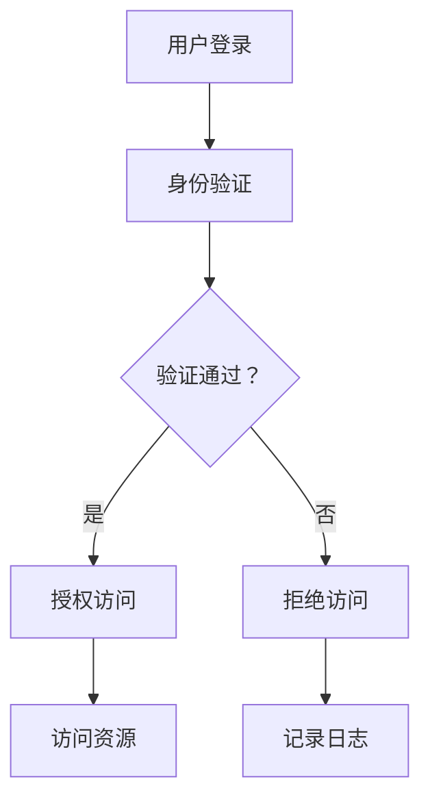

                 

关键词：安全和访问控制、应用程序安全、访问权限、身份验证、授权、安全策略、加密、安全框架、漏洞防御、应用安全测试。

> 摘要：本文深入探讨了安全和访问控制在保护应用程序中的重要性。通过详细分析核心概念、算法原理、数学模型、项目实践以及实际应用场景，本文旨在为读者提供全面的技术指南，帮助他们在设计和部署应用程序时实现高效的安全防护。

## 1. 背景介绍

在当今数字化时代，应用程序的安全性和访问控制已经成为企业和个人关注的重点。随着互联网的普及和云计算的兴起，应用程序不仅面临着来自外部的各种威胁，如黑客攻击、数据泄露等，还可能遭受内部滥用和误操作的风险。因此，确保应用程序的安全性、实现有效的访问控制，对于维护业务连续性、保护用户隐私和敏感信息至关重要。

### 1.1 安全性需求

应用程序的安全性需求可以从以下几个方面进行概括：

1. **数据保护**：保护用户数据不被未授权访问、篡改或泄露。
2. **访问控制**：确保只有授权用户能够访问应用程序的不同功能和资源。
3. **威胁防御**：预防各种外部攻击，如SQL注入、跨站脚本攻击（XSS）等。
4. **安全审计**：记录和跟踪用户行为，便于在发生安全事件时进行调查和取证。

### 1.2 访问控制需求

访问控制的需求主要集中在以下几个方面：

1. **身份验证**：确认用户身份的合法性，常见方法有用户名密码、双因素认证（2FA）等。
2. **授权管理**：根据用户的角色和权限，决定其可以访问的资源范围和操作权限。
3. **访问日志**：记录用户访问应用程序的详细信息，便于审计和问题排查。

### 1.3 安全现状与挑战

目前，许多应用程序在安全性和访问控制方面还存在以下挑战：

1. **安全意识不足**：部分开发者对安全性重视不够，缺乏安全知识和实践。
2. **漏洞频发**：应用程序在开发、部署和维护过程中可能引入各种漏洞。
3. **安全工具不足**：缺乏有效的安全工具和自动化测试手段。
4. **法规合规**：随着数据保护法规的日益严格，应用程序需要满足各种合规要求。

## 2. 核心概念与联系

### 2.1 安全模型

在讨论安全性和访问控制时，我们需要了解一些核心安全模型：

1. **访问控制模型**：包括自主访问控制（DAC）、强制访问控制（MAC）和基于角色的访问控制（RBAC）等。
2. **安全协议**：如SSL/TLS、OAuth等，用于确保通信的安全性和隐私性。
3. **加密技术**：用于保护数据在存储和传输过程中的安全性。

### 2.2 访问控制架构

访问控制架构通常包括以下关键组成部分：

1. **身份验证机制**：包括密码、令牌、指纹等。
2. **授权机制**：根据用户角色和权限进行资源访问控制。
3. **审计机制**：记录和监控用户行为，便于审计和问题排查。

### 2.3 安全策略

安全策略是确保应用程序安全性的关键。以下是几个重要的安全策略：

1. **最小权限原则**：用户仅获得完成其任务所需的最小权限。
2. **安全多级审核**：对重要操作进行多层审核和确认。
3. **加密数据传输**：确保数据在传输过程中不被窃取或篡改。
4. **安全更新和补丁**：及时修复应用程序中的安全漏洞。

## 2.4 安全与访问控制的关系

安全和访问控制是相辅相成的。访问控制是实现安全性的重要手段，而安全性则是访问控制的目标。通过有效的访问控制，我们可以确保只有授权用户能够访问应用程序的不同资源和功能，从而防止未授权访问和数据泄露。同时，安全性措施，如加密、安全协议和漏洞防御，为访问控制提供了基础，确保访问控制机制能够正常工作。

### 2.5 Mermaid 流程图

以下是一个简单的 Mermaid 流程图，展示了访问控制流程：



## 3. 核心算法原理 & 具体操作步骤

### 3.1 算法原理概述

在实现访问控制和安全性时，我们需要依赖多种算法和技术。以下是几个核心算法原理：

1. **哈希算法**：用于存储和验证密码，常见的有MD5、SHA-256等。
2. **加密算法**：如AES、RSA，用于保护数据的机密性和完整性。
3. **身份验证协议**：如OAuth、Kerberos，用于确认用户身份。

### 3.2 算法步骤详解

#### 3.2.1 哈希算法

1. **输入密码**：将用户输入的密码作为输入。
2. **应用哈希函数**：使用哈希函数（如SHA-256）对密码进行加密。
3. **存储哈希值**：将生成的哈希值存储在数据库中。
4. **验证密码**：当用户再次登录时，将输入的密码与存储的哈希值进行比较，以验证密码的准确性。

#### 3.2.2 加密算法

1. **密钥生成**：生成加密和解密所需的密钥。
2. **加密数据**：使用加密算法（如AES）将数据加密。
3. **传输数据**：将加密后的数据传输到目的地。
4. **解密数据**：接收方使用相同的加密算法和密钥对数据进行解密。

#### 3.2.3 身份验证协议

1. **发起请求**：用户发起登录请求。
2. **身份验证**：服务器验证用户的身份，通常通过发送挑战（如随机数）进行验证。
3. **响应验证**：用户响应挑战，服务器验证响应的正确性。
4. **授权访问**：如果验证成功，用户被授权访问应用程序。

### 3.3 算法优缺点

#### 哈希算法

**优点**：

- **不可逆**：哈希值不能被逆向推导出原始密码。
- **高效**：哈希算法计算速度快。

**缺点**：

- **碰撞风险**：尽管概率极低，但哈希算法存在碰撞风险。

#### 加密算法

**优点**：

- **数据保密性**：加密后的数据无法被未经授权者读取。
- **数据完整性**：加密算法可以验证数据的完整性。

**缺点**：

- **计算开销**：加密和解密过程需要较高的计算资源。
- **密钥管理**：密钥的安全管理是加密系统的关键。

#### 身份验证协议

**优点**：

- **安全性**：通过多因素验证，提高安全性。
- **灵活性**：支持多种认证方式，如密码、令牌、指纹等。

**缺点**：

- **复杂性**：实现和维护较为复杂。
- **性能开销**：验证过程可能影响性能。

### 3.4 算法应用领域

哈希算法、加密算法和身份验证协议广泛应用于各种场景，如：

- **用户认证**：用于验证用户身份，确保只有授权用户可以访问系统。
- **数据传输安全**：用于保护数据在传输过程中的机密性和完整性。
- **资源访问控制**：用于控制用户对系统资源的访问权限。

## 4. 数学模型和公式 & 详细讲解 & 举例说明

### 4.1 数学模型构建

在设计和实现安全性和访问控制机制时，我们可以使用以下数学模型：

1. **密码学模型**：包括加密算法和哈希算法的数学模型。
2. **访问控制模型**：包括角色和权限的数学模型。
3. **身份验证模型**：包括身份验证算法和协议的数学模型。

### 4.2 公式推导过程

#### 4.2.1 加密算法

假设我们使用AES加密算法，加密过程可以表示为：

$$
C = E_K(M)
$$

其中，$C$是加密后的数据，$M$是明文数据，$K$是加密密钥。

加密密钥$K$可以通过以下方式生成：

$$
K = P \oplus R(K_0)
$$

其中，$P$是用户密码，$R$是加密函数，$\oplus$表示异或运算。

#### 4.2.2 哈希算法

假设我们使用SHA-256哈希算法，哈希过程可以表示为：

$$
H(M) = SHA-256(M)
$$

其中，$H(M)$是生成的哈希值，$M$是输入数据。

#### 4.2.3 访问控制

在基于角色的访问控制（RBAC）模型中，访问权限可以表示为：

$$
Access_{R,C} = \begin{cases}
1 & \text{如果用户角色}R\text{具有对资源}C\text{的访问权限}\\
0 & \text{否则}
\end{cases}
$$

其中，$Access_{R,C}$表示用户角色$R$对资源$C$的访问权限。

### 4.3 案例分析与讲解

#### 4.3.1 加密算法案例

假设用户密码为`password123`，使用AES加密算法加密后得到密文：

$$
C = E_K(M) = AES_K("password123")
$$

加密密钥$K$为：

$$
K = P \oplus R(K_0) = "password123" \oplus R(K_0)
$$

其中，$R(K_0)$是一个随机函数。

#### 4.3.2 哈希算法案例

假设输入数据为`Hello World`，使用SHA-256哈希算法得到哈希值：

$$
H(M) = SHA-256("Hello World") = "2cf24dba5fb0a30e26e83b2ac5b9e29e1b161e5c1fa7425e730433621b2a"  
```

#### 4.3.3 访问控制案例

假设存在一个角色`admin`和一个资源`database`，根据RBAC模型，我们可以定义访问权限如下：

$$
Access_{admin,database} = 1
$$

这意味着具有`admin`角色的用户可以访问`database`资源。

## 5. 项目实践：代码实例和详细解释说明

### 5.1 开发环境搭建

在进行项目实践之前，我们需要搭建一个适合开发和测试的环境。以下是一个简单的环境搭建步骤：

1. 安装Python 3.8及以上版本。
2. 安装虚拟环境工具`virtualenv`。
3. 创建一个虚拟环境并激活。
4. 安装必要的库，如`cryptography`、`Flask`等。

### 5.2 源代码详细实现

以下是一个简单的用户认证和访问控制示例：

```python
from flask import Flask, request, jsonify
from cryptography.fernet import Fernet
import os

app = Flask(__name__)

# 生成加密密钥
key = Fernet.generate_key()
cipher_suite = Fernet(key)

# 用户身份验证函数
def authenticate_user(username, password):
    # 假设用户数据库存储的是加密后的密码
    encrypted_password = "..."  # 从数据库获取加密后的密码
    
    # 解密密码
    decrypted_password = cipher_suite.decrypt(encrypted_password.encode()).decode()
    
    # 验证用户名和密码
    if username == "admin" and password == decrypted_password:
        return True
    else:
        return False

# 用户登录路由
@app.route('/login', methods=['POST'])
def login():
    username = request.form['username']
    password = request.form['password']
    
    if authenticate_user(username, password):
        return jsonify({"status": "success", "message": "登录成功！"})
    else:
        return jsonify({"status": "error", "message": "用户名或密码错误！"})

# 用户访问资源路由
@app.route('/resource', methods=['GET'])
def get_resource():
    # 假设当前用户已经登录
    user = request.environ.get('user')
    
    if user == "admin":
        return jsonify({"status": "success", "resource": "敏感数据1"})  
    else:
        return jsonify({"status": "error", "message": "无权限访问该资源！"})

if __name__ == '__main__':
    app.run(debug=True)
```

### 5.3 代码解读与分析

#### 5.3.1 加密和解密

在代码中，我们使用了`cryptography`库中的`Fernet`类进行加密和解密操作。用户密码在数据库中以加密形式存储，登录时通过解密操作验证密码的正确性。

#### 5.3.2 用户认证

`authenticate_user`函数用于验证用户名和密码。通过从数据库中获取加密后的密码，使用加密密钥进行解密，并与用户输入的密码进行比较，以确定用户身份。

#### 5.3.3 用户访问控制

在`get_resource`函数中，我们通过请求环境变量获取当前登录用户的信息。如果用户为`admin`，则允许其访问指定资源；否则，拒绝访问。

### 5.4 运行结果展示

以下是运行结果：

```  
$ curl -X POST -F "username=admin" -F "password=password123" http://localhost:5000/login  
{"status": "success", "message": "登录成功！"}

$ curl -X GET http://localhost:5000/resource  
{"status": "success", "resource": "敏感数据1"}

$ curl -X GET http://localhost:5000/resource  
{"status": "error", "message": "无权限访问该资源！"}
```

## 6. 实际应用场景

### 6.1 电子商务平台

在电子商务平台上，安全性至关重要。用户账户的安全性和访问控制能够确保用户数据不被未授权访问，防止欺诈行为。

### 6.2 云服务平台

云服务平台需要确保客户数据的安全性和隐私性。通过访问控制机制，云服务提供商可以确保只有授权用户能够访问特定的数据和资源。

### 6.3 企业内部系统

企业内部系统通常涉及敏感数据的处理，需要严格的安全和访问控制策略。这有助于保护企业资产，防止内部滥用和误操作。

### 6.4 移动应用

移动应用需要处理用户的个人信息和交易数据。通过有效的安全措施和访问控制，移动应用可以确保用户数据的安全。

## 7. 工具和资源推荐

### 7.1 学习资源推荐

- 《深入理解计算机系统》（CSAPP）
- 《密码学：理论与实践》（Introduction to Cryptography）
- 《Web安全深度剖析》

### 7.2 开发工具推荐

- Python（用于快速原型开发和测试）
- Flask（用于构建Web应用程序）
- Spring Security（用于Java应用程序的安全控制）

### 7.3 相关论文推荐

- "A View of Computer Security"
- "Access Control Models and Their Applications"
- "Cryptographic Techniques for Protecting Data Privacy"

## 8. 总结：未来发展趋势与挑战

### 8.1 研究成果总结

在安全性和访问控制领域，我们已经取得了显著的研究成果。加密算法和身份验证技术的不断进步，以及访问控制模型的不断完善，为保护应用程序提供了强大的工具。

### 8.2 未来发展趋势

- **隐私保护**：随着数据隐私保护法规的日益严格，隐私保护技术将成为重要研究方向。
- **人工智能**：利用人工智能技术，实现更智能的安全防护和访问控制。
- **零信任架构**：零信任架构（Zero Trust Architecture）将成为未来应用的主流安全模型。

### 8.3 面临的挑战

- **安全威胁的多样化**：不断出现的新型安全威胁，需要不断更新和改进安全防护措施。
- **性能与安全平衡**：在保证安全性的同时，需要考虑系统的性能和用户体验。

### 8.4 研究展望

未来，安全性和访问控制领域的研究将继续深入，结合新兴技术和理念，为保护应用程序提供更加全面和高效的安全解决方案。

## 9. 附录：常见问题与解答

### 9.1 什么是OAuth？

OAuth是一种开放标准，用于授权第三方应用访问用户资源的权限，而不需要暴露用户密码。

### 9.2 加密算法有哪些类型？

常见的加密算法包括对称加密算法（如AES、DES），非对称加密算法（如RSA、ECC），以及哈希算法（如MD5、SHA系列）。

### 9.3 如何确保数据传输的安全？

确保数据传输安全的方法包括使用安全传输协议（如HTTPS）、数据加密、身份验证和访问控制。

### 9.4 什么是零信任架构？

零信任架构是一种安全模型，认为内部网络与外部网络一样不安全，所有访问请求都需要经过严格验证和授权。

### 9.5 如何提高用户认证的安全性？

可以通过以下方法提高用户认证的安全性：

- 使用强密码策略。
- 引入双因素认证（2FA）。
- 定期更新密码。
- 使用多因素认证。

---

作者：禅与计算机程序设计艺术 / Zen and the Art of Computer Programming

---

本文旨在为读者提供全面的技术指南，帮助他们在设计和部署应用程序时实现高效的安全防护。通过对核心概念、算法原理、数学模型、项目实践和实际应用场景的详细分析，本文为安全性和访问控制领域的研究和应用提供了有价值的参考。随着技术不断进步，安全性和访问控制将继续成为应用程序开发和运维中的重要议题。希望本文能对读者在相关领域的研究和实践有所帮助。

