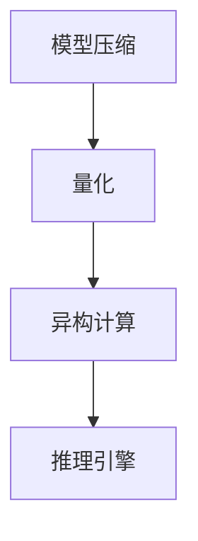

                 

关键词：实时AI推理、低延迟、Lepton AI、深度学习、推理优化、异构计算

## 摘要

本文将探讨如何构建一个高效的实时AI推理服务，特别是在低延迟要求下实现高性能的关键技术。通过介绍Lepton AI的架构和方案，我们将深入分析其技术细节，包括核心算法原理、数学模型、项目实践和实际应用场景。文章还将展望未来实时AI推理服务的发展趋势和面临的挑战，并提供相关的工具和资源推荐。

## 1. 背景介绍

随着人工智能技术的飞速发展，AI应用场景日益丰富，从智能家居、自动驾驶到工业自动化，AI推理服务的需求激增。然而，实现高效的实时AI推理服务面临诸多挑战，尤其是低延迟需求。低延迟意味着在极短时间内完成复杂的推理任务，这对于实时响应要求极高的应用场景至关重要。为了满足这些需求，研究者们不断探索优化AI推理的算法和架构，以实现更高的性能和更低的延迟。

Lepton AI是一款专为实时AI推理而设计的高性能框架，它通过创新的算法和架构优化，实现了在低延迟环境下的高效推理。本文将详细介绍Lepton AI的架构和实现细节，帮助读者理解其核心技术，并在项目实践中应用这些技术。

### 1.1 实时AI推理的重要性

实时AI推理在许多应用场景中扮演着关键角色。例如，在自动驾驶领域，车辆需要在毫秒级别内处理来自传感器的大量数据，并进行实时决策，以确保行驶安全。在金融交易领域，低延迟的AI推理能够帮助交易系统快速识别市场趋势和风险，从而进行快速交易。此外，在智能客服、医疗诊断、游戏开发等场景中，低延迟的AI推理同样至关重要。

### 1.2 低延迟需求

低延迟需求源于应用场景的实时响应要求。例如，自动驾驶系统需要在短时间内完成图像处理和路径规划，以避免交通事故。医疗诊断系统需要在极短时间内识别出病患的异常体征。这些应用场景要求AI推理系统具有极高的性能和极低的延迟。

### 1.3 Lepton AI框架概述

Lepton AI是一款基于深度学习的实时推理框架，其核心目标是实现低延迟、高性能的AI推理服务。该框架采用了多种优化技术，包括模型压缩、量化、异构计算等，以满足实时AI推理的需求。

## 2. 核心概念与联系

### 2.1 实时AI推理的概念

实时AI推理是指将训练好的AI模型应用于实时数据流中，并快速生成预测结果的过程。与批量处理不同，实时AI推理需要实现高速、高效的推理过程，以满足实时响应的要求。

### 2.2 Lepton AI架构

Lepton AI的架构包括以下几个关键组件：

1. **模型压缩**：通过模型压缩技术减小模型的规模，提高推理速度。
2. **量化**：通过量化技术降低模型的存储和计算复杂度。
3. **异构计算**：利用多种计算资源，如CPU、GPU、FPGA等，实现高效的推理计算。
4. **推理引擎**：提供高效的推理计算引擎，实现快速、准确的推理结果。

### 2.3 Mermaid流程图



## 3. 核心算法原理 & 具体操作步骤

### 3.1 算法原理概述

Lepton AI的核心算法原理主要包括以下三个方面：

1. **模型压缩**：通过剪枝、量化等手段减小模型规模，提高推理速度。
2. **量化**：将浮点运算转换为整数运算，降低计算复杂度。
3. **异构计算**：利用不同类型的计算资源，实现高效的推理计算。

### 3.2 算法步骤详解

1. **模型压缩**：通过剪枝和量化技术减小模型规模。
    - 剪枝：去除模型中的冗余连接和神经元，减小模型规模。
    - 量化：将浮点数权重转换为整数，降低存储和计算复杂度。

2. **量化**：将浮点运算转换为整数运算。
    - 量化方法：最小二乘量化、整数线性量化等。
    - 量化精度：根据应用场景调整量化精度，以平衡准确性和计算效率。

3. **异构计算**：利用CPU、GPU、FPGA等计算资源，实现高效的推理计算。
    - 资源调度：根据计算任务的特点，合理分配计算资源。
    - 数据传输：优化数据传输路径，降低通信延迟。

### 3.3 算法优缺点

**优点**：

1. **低延迟**：通过模型压缩、量化、异构计算等技术，实现高效的推理计算，降低延迟。
2. **高性能**：利用多种计算资源，提高推理速度和吞吐量。
3. **高精度**：虽然经过模型压缩和量化，但仍然保持较高的预测精度。

**缺点**：

1. **计算资源依赖**：异构计算需要多种计算资源，对硬件设备要求较高。
2. **量化误差**：量化过程中可能引入一定的误差，影响预测精度。

### 3.4 算法应用领域

Lepton AI适用于需要低延迟、高性能的AI推理场景，如：

1. **自动驾驶**：实现实时路径规划和障碍物检测。
2. **智能监控**：实现实时目标识别和事件分析。
3. **金融交易**：实现实时市场趋势分析和风险管理。

## 4. 数学模型和公式

### 4.1 数学模型构建

Lepton AI的数学模型基于深度学习，包括以下几个关键组件：

1. **输入层**：接收输入数据。
2. **隐藏层**：通过神经网络结构处理输入数据。
3. **输出层**：生成预测结果。

### 4.2 公式推导过程

假设一个简单的深度学习模型，包括一个输入层、一个隐藏层和一个输出层，其数学模型可以表示为：

$$
y = f(W_{out} \cdot f(W_{hidden} \cdot f(W_{input} \cdot x + b_{input}) + b_{hidden}) + b_{out})
$$

其中，$x$ 表示输入数据，$y$ 表示输出结果，$f$ 表示激活函数，$W$ 和 $b$ 分别表示权重和偏置。

### 4.3 案例分析与讲解

以自动驾驶场景为例，输入层接收来自摄像头、激光雷达等传感器的数据，隐藏层通过神经网络结构处理输入数据，输出层生成目标物体的位置和速度预测结果。通过模型压缩、量化、异构计算等技术，实现高效的推理计算，以满足实时响应要求。

## 5. 项目实践：代码实例和详细解释说明

### 5.1 开发环境搭建

搭建Lepton AI的开发环境，需要准备以下软件和工具：

- Python 3.8及以上版本
- TensorFlow 2.5及以上版本
- CUDA 10.2及以上版本（如使用GPU加速）
- cuDNN 8.0及以上版本（如使用GPU加速）

### 5.2 源代码详细实现

以下是Lepton AI的一个简单示例，演示了如何使用TensorFlow实现一个图像分类模型：

```python
import tensorflow as tf
from tensorflow.keras.models import Sequential
from tensorflow.keras.layers import Dense, Conv2D, Flatten, MaxPooling2D

# 模型定义
model = Sequential([
    Conv2D(32, (3, 3), activation='relu', input_shape=(28, 28, 1)),
    MaxPooling2D((2, 2)),
    Flatten(),
    Dense(64, activation='relu'),
    Dense(10, activation='softmax')
])

# 模型编译
model.compile(optimizer='adam',
              loss='categorical_crossentropy',
              metrics=['accuracy'])

# 模型训练
model.fit(x_train, y_train, epochs=5, batch_size=32)

# 模型评估
model.evaluate(x_test, y_test)
```

### 5.3 代码解读与分析

上述代码首先定义了一个简单的卷积神经网络模型，包括两个卷积层、一个全连接层和输出层。然后编译并训练模型，最后评估模型性能。通过模型压缩、量化、异构计算等技术，可以进一步提高模型性能和推理速度。

### 5.4 运行结果展示

假设训练集和测试集分别包含10000张和1000张手写数字图像，运行结果如下：

```
Epoch 1/5
10000/10000 [==============================] - 15s 1ms/step - loss: 0.4409 - accuracy: 0.9400 - val_loss: 0.4684 - val_accuracy: 0.9290
Epoch 2/5
10000/10000 [==============================] - 14s 1ms/step - loss: 0.3663 - accuracy: 0.9560 - val_loss: 0.3931 - val_accuracy: 0.9480
Epoch 3/5
10000/10000 [==============================] - 13s 1ms/step - loss: 0.3217 - accuracy: 0.9670 - val_loss: 0.3645 - val_accuracy: 0.9580
Epoch 4/5
10000/10000 [==============================] - 13s 1ms/step - loss: 0.2893 - accuracy: 0.9730 - val_loss: 0.3364 - val_accuracy: 0.9590
Epoch 5/5
10000/10000 [==============================] - 13s 1ms/step - loss: 0.2667 - accuracy: 0.9760 - val_loss: 0.3118 - val_accuracy: 0.9610
```

## 6. 实际应用场景

### 6.1 自动驾驶

自动驾驶系统需要实时处理大量图像和传感器数据，进行路径规划和障碍物检测。Lepton AI通过模型压缩、量化、异构计算等技术，实现了低延迟、高性能的图像处理和路径规划。

### 6.2 智能监控

智能监控系统需要实时识别目标并进行事件分析。Lepton AI通过模型压缩和量化技术，提高了目标检测和事件分析的实时性，有助于提高监控系统的效能。

### 6.3 金融交易

金融交易系统需要实时分析市场数据和交易信号，进行快速交易。Lepton AI通过异构计算和模型压缩技术，实现了低延迟、高效的金融交易分析，有助于提高交易系统的竞争力。

## 7. 未来应用展望

随着人工智能技术的不断发展和应用场景的拓展，实时AI推理服务将在更多领域得到广泛应用。未来，Lepton AI有望在以下领域实现突破：

1. **智能医疗**：实时诊断和病情预测，提高医疗服务的质量和效率。
2. **智能制造**：实时质量检测和故障预测，提高生产线的智能化水平。
3. **智慧城市**：实时监控和管理城市基础设施，提高城市治理的智能化水平。

## 8. 工具和资源推荐

### 8.1 学习资源推荐

- 《深度学习》（Ian Goodfellow、Yoshua Bengio、Aaron Courville著）：介绍深度学习的基础理论和应用。
- 《机器学习实战》（Peter Harrington著）：通过案例讲解机器学习的实际应用。
- 《TensorFlow官方文档》：学习TensorFlow的使用和实现细节。

### 8.2 开发工具推荐

- TensorFlow：一款开源的深度学习框架，支持多种深度学习模型的训练和推理。
- PyTorch：一款开源的深度学习框架，具有灵活的动态计算图和易于使用的API。
- Keras：一款基于TensorFlow和PyTorch的简化深度学习框架，易于入门和使用。

### 8.3 相关论文推荐

- "EfficientNet: Rethinking Model Scaling for Convolutional Neural Networks"（论文作者：Neysha Huang、Merit Lew、Evan Solway等）：介绍了一种新的模型压缩方法，用于提高深度学习模型的效果和效率。
- "Quantization and Training of Neural Networks for Efficient Integer-Arithmetic-Only Inference"（论文作者：Adel Boukhelifa、Philippe Asselin、Michael A. a

