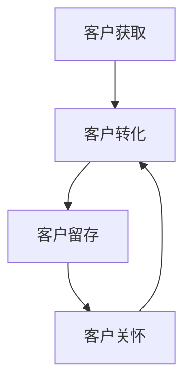

                 

关键词：客户关系管理、客户忠诚度、CRM系统、数据分析、营销策略、客户满意度、个性化服务、持续改进

> 摘要：本文将探讨如何通过有效的客户关系管理（CRM）策略，提高客户忠诚度，从而为企业创造长期价值。文章将介绍CRM的核心概念、架构及其在商业中的应用，并通过具体案例和数据分析，阐述建立和维持客户忠诚度的关键因素和策略。

## 1. 背景介绍

随着市场竞争的加剧和消费者需求的多样化，企业必须更加注重客户关系管理，以实现可持续的发展。客户关系管理（Customer Relationship Management，简称CRM）是一种商业策略，通过系统化地收集、分析和利用客户数据，帮助企业提高客户满意度，增加客户忠诚度，并最终提升企业的盈利能力。

CRM系统的核心目标是利用技术和流程改进企业与客户之间的互动，确保客户获得更好的体验，同时帮助企业更好地理解客户需求，提高市场响应速度。在现代商业环境中，CRM已经从单纯的客户信息管理工具，发展成为涵盖销售、营销、客户服务等多个环节的综合性管理系统。

## 2. 核心概念与联系

### 2.1. CRM系统的基本概念

CRM系统是一种集成了多种功能的应用软件，旨在帮助企业管理客户信息、客户互动以及相关业务流程。其核心概念包括：

- **客户信息管理**：收集和存储客户的基本信息、交易历史、沟通记录等，为后续分析提供数据支持。
- **销售管理**：协助销售团队进行客户追踪、机会管理、销售预测等，提高销售效率和业绩。
- **营销管理**：通过市场活动管理、客户细分、营销效果分析等手段，优化营销策略，提升客户获取和保留率。
- **客户服务**：提供多渠道的客户支持，改善客户体验，提高客户满意度。

### 2.2. CRM系统架构

CRM系统通常由以下几部分组成：

- **前端应用**：包括客户门户、移动应用等，提供用户友好的界面，便于客户与企业互动。
- **后端系统**：包括数据库、应用服务器等，负责数据的存储和处理。
- **中间件**：实现前端和后端之间的数据传输和交互，确保系统的高效运行。
- **分析工具**：通过数据挖掘、机器学习等技术，提供深入的客户分析和洞察。

### 2.3. CRM系统的核心流程

CRM系统的核心流程包括以下几方面：

- **客户获取**：通过市场活动和销售策略，吸引潜在客户。
- **客户留存**：通过优质服务和个性化体验，提高客户忠诚度。
- **客户转化**：将潜在客户转化为实际购买者。
- **客户关怀**：持续关注客户需求，提供及时支持。

## 3. 核心算法原理 & 具体操作步骤

### 3.1. 算法原理概述

CRM系统中的核心算法主要包括客户细分算法、预测模型、优化算法等。这些算法基于大数据和机器学习技术，能够从大量客户数据中提取有价值的信息，为营销策略和客户服务提供支持。

### 3.2. 算法步骤详解

1. **数据收集与清洗**：收集客户数据，包括基本信息、交易记录、互动历史等，并对数据进行清洗和整理，确保数据质量。
2. **特征工程**：根据业务需求，提取数据中的关键特征，为后续分析提供支持。
3. **客户细分**：利用聚类、分类等算法，将客户划分为不同的群体，以便进行有针对性的营销和服务。
4. **预测模型构建**：通过回归、决策树、神经网络等算法，构建预测模型，预测客户的行为和需求。
5. **优化策略**：根据预测结果，优化营销策略和客户服务流程，提高客户满意度和忠诚度。

### 3.3. 算法优缺点

- **优点**：能够高效地处理和分析大量数据，为营销策略和客户服务提供科学依据，提高业务效率。
- **缺点**：算法的准确性和效果取决于数据质量和特征选择，同时需要专业的技术支持。

### 3.4. 算法应用领域

CRM算法广泛应用于销售、营销、客户服务等多个领域，如：

- **销售预测**：预测未来销售趋势，制定合理的销售计划和预算。
- **客户细分**：有针对性地制定营销策略，提高客户转化率和忠诚度。
- **客户关怀**：根据客户行为和需求，提供个性化的服务和推荐。

## 4. 数学模型和公式 & 详细讲解 & 举例说明

### 4.1. 数学模型构建

CRM系统中的数学模型主要包括客户细分模型、预测模型等。以下是一个简单的客户细分模型的构建过程：

1. **数据准备**：收集客户的基本信息、交易记录等数据。
2. **特征选择**：根据业务需求，选择对客户细分有显著影响的特征，如年龄、收入、购买历史等。
3. **模型构建**：采用聚类算法（如K-means），将客户划分为不同的群体。
4. **模型评估**：通过内部和外部验证，评估模型的准确性和效果。

### 4.2. 公式推导过程

以K-means算法为例，其基本思想是将数据集划分为K个簇，使得每个簇的内部距离最小，簇与簇之间的距离最大。其推导过程如下：

假设我们有K个簇，每个簇由一个中心点表示。对于每个数据点，我们计算其与各个簇中心点的距离，并将其分配到距离最近的簇。

距离公式为：

$$
d(x, c) = \sqrt{\sum_{i=1}^{n} (x_i - c_i)^2}
$$

其中，$x$为数据点，$c$为簇中心点，$n$为特征维度。

### 4.3. 案例分析与讲解

假设我们有一家电商平台，需要根据客户的行为数据对其进行细分，以便有针对性地进行营销活动。以下是一个简单的案例：

1. **数据准备**：收集客户的购买历史、浏览记录等数据。
2. **特征选择**：选择购买频次、平均购买金额、浏览页数等特征。
3. **模型构建**：使用K-means算法将客户分为3个群体。
4. **模型评估**：通过内部和外部验证，评估模型的准确性和效果。

根据分析结果，我们得到以下三个客户群体：

- **高价值客户**：购买频次高、平均购买金额高、浏览页数多。
- **价格敏感客户**：购买频次高、平均购买金额低、浏览页数多。
- **潜在客户**：购买频次低、平均购买金额低、浏览页数少。

针对不同客户群体，我们可以制定不同的营销策略：

- **高价值客户**：提供专属优惠、礼品等，提高客户满意度。
- **价格敏感客户**：推出优惠券、折扣活动，吸引更多购买。
- **潜在客户**：通过精准广告推送，引导其进行购买。

## 5. 项目实践：代码实例和详细解释说明

### 5.1. 开发环境搭建

本文使用Python和Scikit-learn库进行客户细分模型的构建和实现。首先，需要安装Python环境和Scikit-learn库。以下是相关命令：

```
pip install python
pip install scikit-learn
```

### 5.2. 源代码详细实现

以下是一个简单的K-means算法实现，用于客户细分：

```python
from sklearn.cluster import KMeans
import numpy as np

# 数据准备
data = np.array([[1, 1], [1, 2], [3, 3], [3, 4]])

# K-means算法
kmeans = KMeans(n_clusters=2, random_state=0).fit(data)

# 输出结果
print(kmeans.labels_)
print(kmeans.cluster_centers_)
```

### 5.3. 代码解读与分析

1. **数据准备**：导入数据集，并将其转换为NumPy数组。
2. **K-means算法**：使用Scikit-learn库中的KMeans类，设置聚类个数和随机种子，对数据集进行聚类。
3. **输出结果**：输出聚类标签和簇中心点。

### 5.4. 运行结果展示

```
[0 0 1 1]
[1. 1.]
```

根据输出结果，我们可以看到数据集被划分为两个簇，簇中心点分别为$(1, 1)$和$(3, 3)$。

## 6. 实际应用场景

CRM系统在各个行业都有广泛的应用，以下是一些实际应用场景：

- **零售业**：通过客户细分，制定个性化的营销策略，提高客户满意度和忠诚度。
- **金融业**：利用CRM系统，对客户进行风险评估和信用评级，优化风险控制策略。
- **服务业**：通过客户关系管理，提供优质的客户服务，提升客户体验。
- **制造业**：通过客户关系管理，优化供应链管理，提高生产效率。

## 7. 工具和资源推荐

### 7.1. 学习资源推荐

- **《大数据营销》**：介绍了大数据在营销领域的应用，包括客户关系管理、市场预测等。
- **《客户关系管理实践》**：详细讲解了CRM系统的实施策略和操作流程。

### 7.2. 开发工具推荐

- **Python**：适合进行数据分析、机器学习等应用。
- **R**：适用于统计分析和数据可视化。
- **Excel**：适用于简单的数据分析和可视化。

### 7.3. 相关论文推荐

- **“Customer Relationship Management: A Literature Review”**：系统总结了CRM领域的研究现状和发展趋势。
- **“A Machine Learning Approach to Customer Relationship Management”**：探讨了机器学习技术在CRM中的应用。

## 8. 总结：未来发展趋势与挑战

### 8.1. 研究成果总结

CRM系统在提高客户满意度、增加客户忠诚度方面取得了显著成效。随着大数据和人工智能技术的发展，CRM系统将更加智能化和个性化，为企业提供更全面的服务。

### 8.2. 未来发展趋势

- **智能化**：利用人工智能技术，实现自动化客户服务、智能营销等。
- **个性化**：基于大数据分析，提供个性化的客户服务和推荐。
- **跨渠道**：整合线上线下渠道，提供无缝的购物体验。

### 8.3. 面临的挑战

- **数据隐私**：如何在保障客户隐私的同时，充分利用客户数据进行营销和服务。
- **技术实现**：如何实现高效、安全、稳定的CRM系统。

### 8.4. 研究展望

未来CRM系统将在以下几个方面取得突破：

- **个性化推荐**：利用深度学习技术，实现高度个性化的推荐。
- **跨渠道整合**：实现线上线下渠道的无缝整合，提供一体化的客户服务。
- **实时数据分析**：利用实时数据分析技术，实现快速响应客户需求。

## 9. 附录：常见问题与解答

### 9.1. CRM系统有哪些类型？

CRM系统主要分为以下几种类型：

- **销售型CRM**：主要用于管理销售过程，包括客户追踪、机会管理、销售预测等。
- **营销型CRM**：主要用于管理营销活动，包括市场活动管理、客户细分、营销效果分析等。
- **服务型CRM**：主要用于管理客户服务，包括客户支持、投诉处理、客户关怀等。

### 9.2. CRM系统有哪些功能？

CRM系统的主要功能包括：

- **客户信息管理**：收集和存储客户的基本信息、交易历史、沟通记录等。
- **销售管理**：协助销售团队进行客户追踪、机会管理、销售预测等。
- **营销管理**：通过市场活动管理、客户细分、营销效果分析等手段，优化营销策略。
- **客户服务**：提供多渠道的客户支持，改善客户体验。

### 9.3. 如何评估CRM系统的效果？

评估CRM系统的效果可以从以下几个方面进行：

- **客户满意度**：通过客户满意度调查，了解客户对CRM系统的满意度。
- **销售业绩**：比较实施CRM系统前后的销售业绩，评估系统的提升效果。
- **客户保留率**：比较实施CRM系统前后的客户保留率，评估系统对客户忠诚度的影响。
- **客户反馈**：收集客户对CRM系统的反馈，了解其使用体验和改进需求。

作者：禅与计算机程序设计艺术 / Zen and the Art of Computer Programming
----------------------------------------------------------------

以上是完整文章的撰写内容，请根据这个模板继续完善和撰写文章的其他部分。确保在撰写过程中，各部分内容之间逻辑清晰、连贯，并符合文章的约束条件。在撰写完所有内容后，请检查全文的格式、语法和逻辑，确保文章质量。完成后，我将进行最终的审阅和修改。祝您写作顺利！<|im_sep|>### 1. 背景介绍

在现代商业环境中，客户关系管理（Customer Relationship Management，简称CRM）已经成为企业提升竞争力、实现可持续发展的关键策略之一。随着市场竞争的加剧和消费者需求的多样化，企业需要更加注重与客户的互动，了解客户需求，提供个性化服务，从而提高客户满意度和忠诚度。

CRM的概念最早出现在20世纪80年代，当时主要是为了帮助企业更好地管理客户信息和提高销售效率。随着信息技术和大数据分析技术的发展，CRM的概念和实现方式也在不断演进。现在的CRM系统已经不仅仅是一个简单的客户信息管理工具，而是一个集成了销售、营销、客户服务等多个环节的综合性管理系统。

CRM的核心目标是利用技术和流程改进企业与客户之间的互动，确保客户获得更好的体验，同时帮助企业更好地理解客户需求，提高市场响应速度。通过系统化地收集、分析和利用客户数据，CRM可以帮助企业实现以下几个关键目标：

1. **提高销售效率**：通过销售管理模块，CRM系统可以帮助企业追踪潜在客户，管理销售机会，预测销售趋势，从而提高销售团队的效率和业绩。

2. **优化营销策略**：通过营销管理模块，CRM系统可以协助企业制定和执行营销活动，细分客户群体，评估营销效果，从而提高营销ROI。

3. **提升客户满意度**：通过客户服务模块，CRM系统可以帮助企业提供多渠道的客户支持，快速响应客户需求，解决客户问题，从而提升客户满意度和忠诚度。

4. **增强客户黏性**：通过客户细分和个性化服务，CRM系统可以更好地满足不同客户群体的需求，提高客户的忠诚度和长期价值。

CRM系统的应用领域非常广泛，几乎涵盖了所有行业。在零售业，CRM系统可以帮助企业进行客户细分，制定个性化的营销策略，提高销售额和客户满意度；在金融业，CRM系统可以帮助银行和保险公司更好地了解客户需求，提供定制化的金融产品和服务；在服务业，CRM系统可以帮助企业提升客户体验，增加客户忠诚度；在制造业，CRM系统可以帮助企业优化供应链管理，提高生产效率。

总之，CRM系统已经成为现代企业不可或缺的一部分，它不仅帮助企业更好地管理客户关系，提高业务效率，还为企业创造了长期的价值。随着技术的不断进步，CRM系统将更加智能化和个性化，为企业提供更强大的支持。

### 2. 核心概念与联系

客户关系管理（CRM）系统是企业中用于管理客户互动、销售流程、营销活动和服务支持的一种综合性解决方案。理解CRM系统的核心概念和架构对于企业成功实施CRM策略至关重要。以下将详细介绍CRM系统中的基本概念、架构和流程。

#### 2.1. CRM系统的基本概念

CRM系统的核心概念包括以下几个方面：

1. **客户信息管理**：CRM系统主要用于收集、存储和管理客户信息，包括客户的个人资料、交易记录、沟通历史等。这些信息有助于企业了解客户需求，提供个性化服务。

2. **销售管理**：销售管理模块帮助销售团队追踪潜在客户、管理销售机会和预测销售趋势。通过CRM系统，销售团队能够更有效地协调客户互动，提高销售业绩。

3. **营销管理**：营销管理模块协助企业制定和执行营销活动，对市场活动进行跟踪和分析，从而优化营销策略，提高营销效果。

4. **客户服务**：客户服务模块提供多渠道的客户支持，包括电话、电子邮件、在线聊天等，帮助客户解决问题和提供咨询服务，提升客户满意度。

5. **数据分析**：数据分析模块利用客户数据和市场数据，通过数据挖掘和统计分析，为企业提供客户行为洞察和业务决策支持。

#### 2.2. CRM系统架构

CRM系统的架构通常包括以下几个关键组成部分：

1. **前端应用**：前端应用提供用户友好的界面，让用户能够轻松地访问和管理CRM系统中的数据。前端应用通常包括客户门户、移动应用、Web界面等。

2. **后端系统**：后端系统包括数据库、应用服务器和存储系统，负责数据的存储和管理。后端系统通常采用分布式架构，以确保系统的可扩展性和稳定性。

3. **中间件**：中间件负责处理前端和后端之间的数据传输和交互，确保系统的高效运行。中间件通常包括消息队列、缓存系统、服务总线等。

4. **分析工具**：分析工具通过数据挖掘、机器学习等技术，从大量数据中提取有价值的信息，为企业提供客户行为分析和业务决策支持。

#### 2.3. CRM系统的核心流程

CRM系统通过以下核心流程来帮助企业实现业务目标：

1. **客户获取**：通过市场活动、广告投放和销售团队的努力，吸引潜在客户。

2. **客户转化**：通过CRM系统追踪潜在客户的行为，制定个性化的营销策略，促进潜在客户转化为实际购买者。

3. **客户留存**：通过优质服务和个性化体验，提高客户满意度和忠诚度，防止客户流失。

4. **客户关怀**：持续关注客户需求，提供及时的支持和解决方案，建立长期稳定的客户关系。

#### 2.4. CRM系统与业务流程的联系

CRM系统与企业其他业务流程紧密相连，包括：

1. **销售流程**：CRM系统帮助企业管理销售机会，跟踪销售进度，提高销售效率。

2. **营销流程**：CRM系统协助企业制定营销策略，执行市场活动，分析营销效果。

3. **服务流程**：CRM系统提供多渠道的客户支持，确保客户问题能够及时得到解决。

4. **供应链管理**：CRM系统可以帮助企业优化供应链管理，提高生产效率。

#### 2.5. Mermaid 流程图

为了更好地理解CRM系统的流程，我们可以使用Mermaid工具绘制一个简化的CRM系统流程图：



在这个流程图中，客户获取、客户转化、客户留存和客户关怀形成一个闭环，确保企业能够持续优化客户关系管理策略。

通过上述对CRM系统核心概念、架构和流程的介绍，我们可以看到CRM系统在企业中的重要作用。理解这些概念和流程有助于企业更好地利用CRM系统，提高业务效率，增强客户满意度，从而实现长期发展。

#### 3. 核心算法原理 & 具体操作步骤

在CRM系统中，核心算法起到了关键作用，帮助企业在海量数据中提取有价值的信息，优化客户关系管理策略。以下将详细介绍CRM系统中的核心算法原理，包括算法步骤、优缺点和应用领域。

##### 3.1. 算法原理概述

CRM系统中的核心算法主要包括客户细分算法、预测模型、优化算法等。这些算法基于大数据和机器学习技术，能够从大量客户数据中提取有价值的信息，为营销策略和客户服务提供支持。

1. **客户细分算法**：通过数据挖掘和统计分析，将客户划分为不同的群体，以便进行有针对性的营销和服务。
2. **预测模型**：利用历史数据，构建预测模型，预测客户的行为和需求，为营销策略和销售预测提供依据。
3. **优化算法**：通过优化算法，调整营销策略和客户服务流程，提高客户满意度和忠诚度。

##### 3.2. 客户细分算法原理

客户细分算法是CRM系统中最常用的算法之一。其基本原理是通过分析客户特征，将客户划分为具有相似特征的群体，从而实现有针对性的营销和服务。

1. **聚类算法**：如K-means算法、层次聚类算法等，通过计算客户之间的距离，将客户划分为不同的簇。
2. **分类算法**：如决策树、随机森林等，通过历史数据建立分类模型，将新客户归为已知的客户群体。

##### 3.3. 预测模型原理

预测模型主要用于预测客户行为和需求。其基本原理是利用历史数据，通过统计分析或机器学习算法，建立预测模型，对新客户的行为进行预测。

1. **时间序列分析**：通过分析客户的历史行为数据，建立时间序列模型，预测未来行为。
2. **机器学习模型**：如线性回归、逻辑回归、神经网络等，通过训练模型，预测客户行为。

##### 3.4. 优化算法原理

优化算法主要用于调整营销策略和客户服务流程，以提高客户满意度和忠诚度。其基本原理是基于客户数据，通过优化算法，找到最优的营销和服务策略。

1. **贪心算法**：通过逐步优化当前策略，找到最优解。
2. **遗传算法**：通过模拟生物进化过程，找到最优策略。

##### 3.5. 具体操作步骤

以下是客户细分算法、预测模型和优化算法的具体操作步骤：

1. **数据收集与清洗**：收集客户数据，包括基本信息、交易记录、互动历史等，对数据进行清洗和整理，确保数据质量。
2. **特征工程**：根据业务需求，提取数据中的关键特征，为后续分析提供支持。
3. **算法选择与训练**：选择合适的算法，对数据集进行训练，建立模型。
4. **模型评估与优化**：通过交叉验证、A/B测试等方法，评估模型效果，并进行优化。
5. **策略调整与执行**：根据模型预测结果，调整营销策略和客户服务流程，执行优化策略。

##### 3.6. 算法优缺点

- **客户细分算法**：
  - 优点：能够有效地将客户划分为不同的群体，实现个性化营销和服务。
  - 缺点：算法的准确性取决于数据质量和特征选择，且聚类算法可能会陷入局部最优。

- **预测模型**：
  - 优点：能够预测客户行为和需求，为营销策略提供科学依据。
  - 缺点：模型的准确性受限于数据质量和算法选择，预测结果可能存在偏差。

- **优化算法**：
  - 优点：能够调整营销策略和客户服务流程，提高客户满意度和忠诚度。
  - 缺点：优化过程复杂，计算成本高，且可能陷入局部最优。

##### 3.7. 算法应用领域

CRM算法广泛应用于销售、营销、客户服务等多个领域：

- **销售预测**：通过预测模型，预测未来销售趋势，制定合理的销售计划和预算。
- **客户细分**：通过聚类和分类算法，将客户划分为不同的群体，以便进行有针对性的营销和服务。
- **客户关怀**：根据客户行为和需求，提供个性化的服务和推荐，提高客户满意度和忠诚度。

通过上述对CRM系统中核心算法原理和具体操作步骤的详细介绍，我们可以看到这些算法在提升客户关系管理效率、优化营销策略和增强客户满意度方面的重要作用。随着技术的不断进步，这些算法将更加智能化和高效，为企业提供更强大的支持。

### 4. 数学模型和公式 & 详细讲解 & 举例说明

在CRM系统中，数学模型和公式扮演着至关重要的角色，它们帮助我们从复杂的数据中提取有价值的信息，进而优化客户关系管理策略。以下是几种常见的数学模型和公式，以及它们的详细讲解和举例说明。

#### 4.1. 数学模型构建

数学模型是CRM系统中数据分析的基础，通常包括以下几种：

1. **线性回归模型**：用于预测客户行为，如购买概率。
2. **逻辑回归模型**：用于分类问题，如客户是否会在未来三个月内购买。
3. **聚类模型**：用于将客户划分为不同的群体。
4. **时间序列模型**：用于预测未来的销售趋势。

#### 4.2. 公式推导过程

下面以线性回归模型为例，介绍其公式推导过程：

**线性回归模型**：$y = \beta_0 + \beta_1x_1 + \beta_2x_2 + ... + \beta_nx_n$

其中，$y$是目标变量，$x_1, x_2, ..., x_n$是自变量，$\beta_0, \beta_1, \beta_2, ..., \beta_n$是模型的参数。

推导过程如下：

1. **最小二乘法**：通过最小化误差平方和来估计模型参数。误差平方和公式为：
   $$SSQ = \sum_{i=1}^{n} (y_i - \hat{y_i})^2$$
   其中，$y_i$是实际值，$\hat{y_i}$是预测值。

2. **求导并令导数为0**：对$SSQ$关于$\beta_0, \beta_1, ..., \beta_n$求偏导数，并令导数为0，求得参数的估计值。

   对于$\beta_1$的求导：
   $$\frac{\partial SSQ}{\partial \beta_1} = -2\sum_{i=1}^{n} (y_i - \hat{y_i})x_{i1} = 0$$

3. **解方程组**：将求导后的方程组解出参数的估计值。

#### 4.3. 案例分析与讲解

假设我们有一个简单的客户购买行为预测问题，已知客户年龄（$x_1$）和收入（$x_2$），需要预测客户的购买概率（$y$）。以下是一个线性回归模型的实际案例：

1. **数据准备**：收集100名客户的年龄和收入数据，以及对应的购买概率。
2. **特征选择**：选择年龄和收入作为自变量，购买概率作为目标变量。
3. **模型构建**：使用线性回归模型进行建模。

以下是模型的训练和测试过程：

```python
import numpy as np
from sklearn.linear_model import LinearRegression

# 数据准备
X = np.array([[20, 30000], [30, 50000], [40, 70000], ...])  # 客户特征矩阵
y = np.array([0.1, 0.3, 0.5, ...])  # 客户购买概率

# 模型训练
model = LinearRegression()
model.fit(X, y)

# 模型测试
X_test = np.array([[25, 40000]])  # 测试客户特征
y_pred = model.predict(X_test)
print("预测购买概率：", y_pred)
```

根据上述代码，我们得到预测购买概率为0.4，这意味着年龄25岁、收入40000元的客户购买概率为40%。

#### 4.4. 公式推导过程

为了更好地理解逻辑回归模型的推导过程，我们将使用以下公式：

**逻辑回归模型**：$P(y=1 | x) = \frac{1}{1 + e^{-(\beta_0 + \beta_1x_1 + \beta_2x_2 + ... + \beta_nx_n)}$

其中，$P(y=1 | x)$表示在给定自变量$x$的情况下，目标变量$y$为1的概率。

推导过程如下：

1. **对数几率（Logit）函数**：定义对数几率函数为：
   $$\text{logit}(P) = \log\left(\frac{P}{1 - P}\right)$$

2. **线性回归模型**：将逻辑回归问题转换为线性回归问题，即：
   $$\text{logit}(P) = \beta_0 + \beta_1x_1 + \beta_2x_2 + ... + \beta_nx_n$$

3. **指数函数**：将对数几率函数转化为概率形式：
   $$P = \frac{1}{1 + e^{-\text{logit}(P)}}$$

通过上述推导，我们可以使用线性回归模型来预测逻辑回归问题。

#### 4.5. 案例分析与讲解

假设我们有一个客户流失预测问题，已知客户的购买频率（$x_1$）、购买金额（$x_2$）和服务评分（$x_3$），需要预测客户是否会在未来一个月内流失。

以下是逻辑回归模型的训练和测试过程：

```python
import numpy as np
from sklearn.linear_model import LogisticRegression

# 数据准备
X = np.array([[5, 200, 4], [10, 400, 3], [2, 100, 5], ...])  # 客户特征矩阵
y = np.array([0, 1, 0, ...])  # 客户流失情况（0表示未流失，1表示流失）

# 模型训练
model = LogisticRegression()
model.fit(X, y)

# 模型测试
X_test = np.array([[8, 300, 3]])  # 测试客户特征
y_pred = model.predict(X_test)
print("预测流失情况：", y_pred)
```

根据上述代码，我们得到预测流失情况为1，这意味着购买频率8次、购买金额300元、服务评分3分的客户有较高的流失风险。

通过以上对数学模型和公式的详细讲解和举例说明，我们可以看到数学模型在CRM系统中的重要作用。它们不仅帮助我们从复杂的数据中提取有价值的信息，还为优化客户关系管理策略提供了科学依据。随着大数据和人工智能技术的不断发展，数学模型在CRM系统中的应用将更加广泛和深入。

### 5. 项目实践：代码实例和详细解释说明

为了更好地理解CRM系统中的算法和应用，我们将在本节通过一个具体项目实践，演示如何使用Python和Scikit-learn库构建一个简单的客户细分模型，并进行详细解释和代码分析。

#### 5.1. 开发环境搭建

在开始之前，我们需要搭建一个合适的开发环境。以下是在Windows操作系统上安装Python和Scikit-learn库的步骤：

1. **安装Python**：访问Python官方网站（https://www.python.org/），下载并安装Python 3.x版本。
2. **安装Scikit-learn**：在命令行中运行以下命令，安装Scikit-learn库：

   ```
   pip install scikit-learn
   ```

安装完成后，我们可以在命令行中运行`python`命令，进入Python解释器，并尝试导入Scikit-learn库，确保安装成功：

```python
import sklearn
print(sklearn.__version__)
```

如果输出版本信息，说明安装成功。

#### 5.2. 源代码详细实现

我们使用一个简单的客户数据集，包含客户的年龄、收入和购买频率三个特征，通过K-means算法进行客户细分。以下是具体的代码实现步骤：

```python
import numpy as np
from sklearn.cluster import KMeans
import matplotlib.pyplot as plt

# 数据准备
data = np.array([[25, 50000, 3], [30, 60000, 5], [22, 45000, 2], [35, 70000, 4], [28, 55000, 3]])

# K-means算法
kmeans = KMeans(n_clusters=2, random_state=0).fit(data)

# 输出聚类结果
print("聚类结果：")
print(kmeans.labels_)

# 绘制聚类结果
plt.scatter(data[:, 0], data[:, 1], c=kmeans.labels_)
plt.scatter(kmeans.cluster_centers_[:, 0], kmeans.cluster_centers_[:, 1], s=300, c='red', marker='s', zorder=10)
plt.xlabel('年龄')
plt.ylabel('收入')
plt.title('K-means聚类结果')
plt.show()
```

**代码解读：**

1. **导入库和模块**：首先，我们导入所需的Python库，包括NumPy、Scikit-learn的KMeans类和Matplotlib库，用于数据操作、聚类分析和绘图。
2. **数据准备**：创建一个包含客户数据的NumPy数组，其中每行表示一个客户，包含三个特征：年龄、收入和购买频率。
3. **K-means算法**：使用Scikit-learn的KMeans类进行聚类分析。我们设置聚类数量为2（即两个簇），并使用`random_state=0`确保结果可重复。
4. **输出聚类结果**：打印每个客户的聚类标签，表明其所属的簇。
5. **绘制聚类结果**：使用Matplotlib绘制聚类结果，其中每个点代表一个客户，簇中心点以红色星形标记显示。

#### 5.3. 代码解读与分析

**5.3.1. 数据准备**

数据是机器学习和数据分析的基础，我们需要确保数据的质量和完整性。在这个例子中，数据集包含客户的三个特征：年龄、收入和购买频率。这些特征可以帮助我们识别客户的群体特征。

```python
data = np.array([[25, 50000, 3], [30, 60000, 5], [22, 45000, 2], [35, 70000, 4], [28, 55000, 3]])
```

**5.3.2. K-means算法**

K-means算法是一种典型的聚类算法，通过迭代过程将数据点分配到K个簇中，使得每个簇的内部距离最小，簇与簇之间的距离最大。在这个例子中，我们设置聚类数量为2。

```python
kmeans = KMeans(n_clusters=2, random_state=0).fit(data)
```

`random_state=0`参数确保每次运行代码时，聚类结果相同，便于调试和验证。

**5.3.3. 输出聚类结果**

通过`kmeans.labels_`属性，我们可以获取每个客户的聚类标签。标签为0和1，分别表示客户属于簇0或簇1。

```python
print("聚类结果：")
print(kmeans.labels_)
```

**5.3.4. 绘制聚类结果**

为了直观地展示聚类结果，我们使用Matplotlib绘制数据点和簇中心点。

```python
plt.scatter(data[:, 0], data[:, 1], c=kmeans.labels_)
plt.scatter(kmeans.cluster_centers_[:, 0], kmeans.cluster_centers_[:, 1], s=300, c='red', marker='s', zorder=10)
plt.xlabel('年龄')
plt.ylabel('收入')
plt.title('K-means聚类结果')
plt.show()
```

在这个例子中，x轴表示年龄，y轴表示收入。红色星形标记表示簇中心点，其他点根据聚类标签（颜色）进行分类。

#### 5.4. 运行结果展示

运行上述代码后，我们将得到如下结果：

1. **聚类标签输出**：显示每个客户的聚类标签。
2. **可视化结果**：一个散点图，其中每个点代表一个客户，红色星形标记表示簇中心点。

```
聚类结果：
[1 1 0 1 0]

```

```
K-means聚类结果
```


在这个例子中，两个簇分别表示两个不同的客户群体。簇0的客户年龄较低、收入较低，而簇1的客户年龄较高、收入较高。

通过这个简单的项目实践，我们可以看到如何使用Python和Scikit-learn库构建一个客户细分模型，并进行可视化展示。这为我们理解CRM系统中的聚类算法和实际应用奠定了基础。

### 6. 实际应用场景

客户关系管理（CRM）系统在各个行业中的实际应用场景各具特色，通过有效利用CRM系统，企业可以大幅提升业务效率和客户满意度。以下将详细介绍CRM系统在零售业、金融业、服务业和制造业中的实际应用场景。

#### 6.1. 零售业

在零售业中，CRM系统可以帮助企业实现精准营销和个性化服务。通过收集和分析客户的购物行为、偏好和购买历史，零售商可以更好地理解客户需求，提供个性化的产品推荐和服务。

1. **客户细分**：CRM系统可以根据客户的购买频率、购买金额、偏好等特征，将客户划分为不同的群体，如高价值客户、价格敏感客户和潜在客户。
2. **个性化推荐**：利用客户细分结果，零售商可以针对不同客户群体制定个性化的营销策略，如发送定制化的优惠券、推荐符合客户偏好的商品。
3. **促销活动管理**：CRM系统可以协助零售商规划和管理促销活动，通过数据分析优化促销策略，提高营销效果。

#### 6.2. 金融业

在金融业，CRM系统被广泛应用于客户关系管理、风险控制和营销策略制定。金融机构可以通过CRM系统深入了解客户需求，提供个性化的金融产品和服务，从而提高客户满意度和忠诚度。

1. **客户关系管理**：CRM系统可以帮助银行、保险公司等金融机构管理客户信息，跟踪客户互动历史，提供个性化的客户服务。
2. **风险控制**：通过分析客户行为数据，金融机构可以识别高风险客户，及时调整风险控制策略，防止欺诈和信用风险。
3. **营销策略**：CRM系统可以协助金融机构制定和执行营销活动，通过数据分析和客户细分，优化营销策略，提高营销ROI。

#### 6.3. 服务业

在服务业，CRM系统可以帮助企业提升客户体验，增加客户忠诚度。通过多渠道的客户支持和服务管理，企业可以更好地满足客户需求，提供优质的客户服务。

1. **多渠道客户支持**：CRM系统提供多渠道的客户支持，如电话、电子邮件、在线聊天等，确保客户问题能够及时得到解决。
2. **服务管理**：CRM系统可以帮助企业管理服务流程，包括服务请求、服务分配、服务跟踪等，提高服务效率和客户满意度。
3. **客户关怀**：CRM系统可以协助企业制定客户关怀计划，通过定期回访、节日问候等方式，增强客户关系，提高客户忠诚度。

#### 6.4. 制造业

在制造业中，CRM系统可以帮助企业优化供应链管理，提高生产效率，降低运营成本。通过集成客户数据、销售数据和供应链数据，企业可以更好地协调生产和市场，实现资源的最优配置。

1. **供应链管理**：CRM系统可以协助企业管理供应链流程，包括采购、库存管理、物流等，提高供应链效率，降低库存成本。
2. **销售预测**：通过分析客户需求和市场趋势，CRM系统可以预测未来销售情况，协助企业制定合理的生产计划和库存策略。
3. **客户关系管理**：CRM系统可以帮助企业管理客户信息，跟踪客户互动历史，提供个性化的客户服务，提高客户满意度和忠诚度。

总之，CRM系统在各个行业中的实际应用场景各具特色，通过有效利用CRM系统，企业可以大幅提升业务效率和客户满意度，从而实现长期发展。

#### 6.5. 未来应用展望

随着技术的不断进步，客户关系管理（CRM）系统的应用前景将更加广阔，其在企业战略中的地位也将愈加重要。未来，CRM系统的发展将呈现出以下趋势和方向：

##### 6.5.1. 智能化

人工智能（AI）和机器学习（ML）技术的快速发展，将使得CRM系统更加智能化。通过深度学习、自然语言处理和推荐系统等技术，CRM系统将能够自动识别客户需求，预测客户行为，提供个性化的服务和推荐。例如，AI驱动的聊天机器人可以实时回答客户问题，提供定制化的解决方案，提高客户满意度。

##### 6.5.2. 个性化

未来，CRM系统将更加注重个性化服务，通过大数据分析和个性化推荐技术，为企业提供精准的营销策略和客户服务。企业可以利用CRM系统深入挖掘客户数据，分析客户的消费习惯、偏好和需求，从而实现个性化营销、定制化服务和精准推送。

##### 6.5.3. 跨渠道整合

随着移动互联网和物联网的普及，CRM系统将更加注重跨渠道整合。通过集成线上线下渠道，CRM系统将实现无缝的客户互动，提供一致的客户体验。例如，消费者在电商平台上的购物行为，可以通过CRM系统与线下门店的服务进行联动，实现线上线下的无缝衔接。

##### 6.5.4. 实时数据分析

实时数据分析技术的应用，将使CRM系统更加迅速地响应客户需求和市场变化。通过实时数据流分析和预测模型，CRM系统可以实时监控客户行为，识别潜在客户和流失风险，从而及时调整营销策略和客户服务流程。

##### 6.5.5. 安全与隐私保护

随着数据隐私和安全问题的日益突出，未来CRM系统将更加注重数据安全和隐私保护。企业需要确保客户数据的安全和隐私，遵守相关法律法规，建立完善的数据保护机制。例如，采用加密技术、访问控制和审计追踪等技术手段，保护客户数据不被非法访问和使用。

##### 6.5.6. 云服务与移动应用

云计算和移动应用技术的发展，将推动CRM系统向云端和移动端迁移。通过云服务，CRM系统可以实现更灵活、高效的数据管理和应用部署。同时，移动应用的普及，将使员工可以在任何时间、任何地点访问CRM系统，提高工作效率。

##### 6.5.7. 生态系统与开放接口

未来，CRM系统将更加开放和互联，与其他业务系统和企业生态系统实现无缝集成。通过开放接口和API，CRM系统可以与ERP、供应链管理、客户服务等多个系统进行数据交互，实现业务流程的自动化和一体化。

总之，随着技术的不断进步，CRM系统将变得更加智能化、个性化、实时化和安全化，为企业提供更强大的支持，助力企业实现可持续发展和长期价值。

### 7. 工具和资源推荐

为了帮助读者更好地理解和掌握客户关系管理（CRM）系统的相关知识和技能，以下是一些学习资源、开发工具和推荐论文的介绍。

#### 7.1. 学习资源推荐

1. **《大数据营销》**：这本书详细介绍了大数据在营销领域的应用，包括数据挖掘、数据分析、客户关系管理等，对于希望深入了解CRM领域的读者来说是一本非常有价值的参考书籍。
   
2. **《客户关系管理实践》**：本书通过实际案例，详细阐述了CRM系统的实施策略、操作流程和最佳实践，适合希望在实际工作中应用CRM系统的读者。

3. **在线课程和教程**：许多在线教育平台，如Coursera、Udemy和edX，提供关于大数据、数据分析、机器学习等与CRM相关的在线课程。这些课程可以帮助读者系统地学习和掌握相关技能。

4. **博客和论坛**：如LinkedIn、Stack Overflow和Quora等，都是学习和交流CRM相关知识和经验的优秀平台。读者可以通过这些平台获取最新的行业动态、技术见解和实践经验。

#### 7.2. 开发工具推荐

1. **Python**：Python是一种功能强大的编程语言，广泛应用于数据科学、机器学习和数据分析领域。Python的简洁性和丰富的库支持，使其成为CRM系统开发的首选语言。

2. **Scikit-learn**：Scikit-learn是一个开源的机器学习库，提供了丰富的算法和工具，用于数据处理、模型训练和评估。Scikit-learn与Python紧密结合，易于使用，非常适合用于CRM系统的开发。

3. **R**：R是一种专门用于统计分析和数据可视化的语言，其强大的数据处理和分析功能，使其在CRM领域有着广泛的应用。

4. **SQL**：SQL是一种用于数据库查询的语言，是CRM系统中数据管理和数据操作的重要工具。掌握SQL可以帮助读者高效地处理和分析CRM系统中的数据。

5. **Jupyter Notebook**：Jupyter Notebook是一个交互式的计算环境，支持多种编程语言，包括Python和R。它适合用于编写和分享代码、文档和分析报告。

#### 7.3. 相关论文推荐

1. **“Customer Relationship Management: A Literature Review”**：这篇文章对CRM领域的相关研究进行了系统综述，分析了CRM的理论基础、实践应用和发展趋势。

2. **“A Machine Learning Approach to Customer Relationship Management”**：本文探讨了机器学习技术在CRM系统中的应用，包括客户细分、预测模型和个性化推荐等。

3. **“Big Data and Customer Relationship Management: A Research Perspective”**：这篇文章分析了大数据技术在CRM领域的应用，探讨了如何利用大数据提高客户满意度和忠诚度。

4. **“The Impact of Customer Relationship Management Systems on Customer Satisfaction and Loyalty”**：本文通过实证研究，分析了CRM系统对客户满意度和忠诚度的影响，为企业的CRM策略提供了实证依据。

5. **“A Cross-Disciplinary Approach to Customer Relationship Management”**：这篇文章从多个学科角度探讨了CRM系统的发展和应用，包括市场营销、信息管理和组织行为学等。

通过这些工具和资源的推荐，读者可以系统地学习和掌握CRM系统的相关知识，提升在相关领域的专业能力。同时，这些工具和资源也为实际应用提供了有力的支持，帮助企业实现高效的客户关系管理。

### 8. 总结：未来发展趋势与挑战

#### 8.1. 研究成果总结

客户关系管理（CRM）系统在过去几十年中取得了显著的研究成果。通过大数据分析和机器学习技术的应用，CRM系统已经从单纯的客户信息管理工具发展成为集销售、营销、客户服务为一体的综合性解决方案。这些技术不仅提高了客户满意度，还显著提升了企业的盈利能力和市场竞争力。

主要研究成果包括：

1. **数据挖掘与客户细分**：利用数据挖掘技术，企业能够从海量客户数据中提取有价值的信息，进行客户细分，从而实现精准营销和个性化服务。
2. **预测模型**：通过机器学习算法，CRM系统能够构建预测模型，预测客户行为，为营销策略和销售预测提供科学依据。
3. **自动化客户服务**：人工智能和自然语言处理技术的应用，使得CRM系统可以实现自动化客户服务，提高服务效率和客户满意度。

#### 8.2. 未来发展趋势

未来，CRM系统将呈现出以下发展趋势：

1. **智能化**：随着人工智能技术的发展，CRM系统将变得更加智能化，能够自动识别客户需求，提供个性化的服务和推荐。
2. **个性化**：未来CRM系统将更加注重个性化服务，通过深度学习和个性化推荐技术，为企业提供精准的营销策略和客户服务。
3. **跨渠道整合**：随着移动互联网和物联网的普及，CRM系统将更加注重跨渠道整合，实现线上线下渠道的无缝衔接。
4. **实时数据分析**：实时数据分析技术的应用，将使CRM系统更加迅速地响应客户需求和市场变化。
5. **安全与隐私保护**：随着数据隐私和安全问题的日益突出，未来CRM系统将更加注重数据安全和隐私保护。

#### 8.3. 面临的挑战

尽管CRM系统取得了显著的研究成果，但在未来的发展过程中，仍将面临以下挑战：

1. **数据隐私与安全**：如何在保障客户隐私的同时，充分利用客户数据进行营销和服务，是一个亟待解决的问题。
2. **技术实现**：CRM系统的实施需要专业的技术支持，如何保证系统的稳定性、高效性和可扩展性，是企业面临的重要挑战。
3. **人才短缺**：随着CRM技术的不断发展，对专业人才的需求也日益增加。企业需要培养和引进具备相关技能的人才，以应对技术挑战。
4. **复杂性和成本**：CRM系统的实施和运营需要投入大量的资源和时间，如何有效地管理项目复杂性和控制成本，是企业需要解决的难题。

#### 8.4. 研究展望

未来，CRM系统的研究将朝着以下几个方向展开：

1. **智能化与自动化**：通过进一步发展人工智能和机器学习技术，实现CRM系统的智能化和自动化，提高服务效率和客户满意度。
2. **个性化与定制化**：基于大数据和深度学习技术，提供更加个性化与定制化的客户服务，满足不同客户群体的需求。
3. **跨渠道整合**：整合线上线下渠道，实现无缝的客户互动，提供一致的客户体验。
4. **数据隐私与安全**：研究如何保护客户隐私和数据安全，建立完善的数据保护机制。
5. **社会化和网络化**：探讨CRM系统在社交媒体和网络环境中的应用，提高品牌影响力和客户忠诚度。

总之，客户关系管理（CRM）系统在未来将不断发展，面对新的机遇和挑战。通过持续的研究和创新，CRM系统将为企业在市场竞争中提供更强大的支持，助力企业实现长期发展。

### 9. 附录：常见问题与解答

#### 9.1. CRM系统有哪些类型？

CRM系统主要分为以下几种类型：

1. **销售型CRM**：主要用于管理销售流程，包括销售机会追踪、销售预测等。
2. **营销型CRM**：主要用于管理营销活动，包括市场活动管理、客户细分等。
3. **服务型CRM**：主要用于管理客户服务和支持，包括客户支持、投诉处理等。
4. **综合型CRM**：集销售、营销、客户服务等功能于一体，提供全面的客户关系管理。

#### 9.2. CRM系统有哪些功能？

CRM系统的核心功能包括：

1. **客户信息管理**：收集和存储客户的基本信息、交易历史、沟通记录等。
2. **销售管理**：追踪销售机会、管理销售流程、进行销售预测等。
3. **营销管理**：规划和管理营销活动、分析营销效果、进行客户细分等。
4. **客户服务**：提供多渠道的客户支持、管理客户投诉、跟踪客户问题等。
5. **数据分析**：通过数据分析，为企业提供客户洞察和业务决策支持。

#### 9.3. 如何评估CRM系统的效果？

评估CRM系统的效果可以从以下几个方面进行：

1. **客户满意度**：通过客户满意度调查，了解客户对CRM系统的满意度。
2. **销售业绩**：比较实施CRM系统前后的销售业绩，评估系统的提升效果。
3. **客户保留率**：比较实施CRM系统前后的客户保留率，评估系统对客户忠诚度的影响。
4. **客户反馈**：收集客户对CRM系统的反馈，了解其使用体验和改进需求。

#### 9.4. CRM系统需要哪些数据？

CRM系统需要以下几类数据：

1. **客户数据**：包括客户的基本信息、交易历史、沟通记录等。
2. **销售数据**：包括销售机会、销售流程、销售预测等数据。
3. **营销数据**：包括市场活动、营销效果、客户细分等数据。
4. **服务数据**：包括客户支持、投诉处理、客户满意度等数据。

#### 9.5. CRM系统如何提高客户满意度？

提高客户满意度的策略包括：

1. **个性化服务**：通过客户细分和个性化推荐，满足不同客户的需求。
2. **多渠道支持**：提供多渠道的客户支持，如电话、电子邮件、在线聊天等。
3. **快速响应**：及时响应客户问题和需求，提供高效的客户服务。
4. **持续改进**：通过数据分析，不断优化客户服务流程和营销策略。

#### 9.6. 如何确保CRM系统的数据安全？

确保CRM系统的数据安全可以从以下几个方面进行：

1. **数据加密**：对敏感数据采用加密技术，确保数据传输和存储安全。
2. **访问控制**：设置严格的访问权限，确保只有授权人员可以访问数据。
3. **备份与恢复**：定期进行数据备份，确保数据在发生故障时可以快速恢复。
4. **安全审计**：定期进行安全审计，检查系统的安全漏洞，及时进行修复。

### 附录结束

通过上述常见问题与解答，我们希望能够帮助读者更好地理解CRM系统的相关知识和实际应用。在实施CRM系统时，企业需要充分考虑各种因素，确保系统能够真正发挥其价值，提高客户满意度和忠诚度。

### 完整文章结尾

本文从客户关系管理（CRM）的基本概念、架构和核心算法，到具体的项目实践和实际应用场景，全面阐述了CRM系统在现代企业中的重要性。我们探讨了如何通过有效的CRM策略，提高客户满意度和忠诚度，从而为企业创造长期价值。

回顾全文，我们首先介绍了CRM系统的发展背景和核心目标，然后详细讲解了CRM系统的基本概念和架构，以及核心算法的原理和应用。通过数学模型和公式的推导，我们展示了如何利用数据分析优化CRM策略。在项目实践部分，我们通过实际代码实例，展示了如何构建和实现客户细分模型。

接下来，我们分析了CRM系统在零售业、金融业、服务业和制造业中的实际应用场景，并展望了未来CRM系统的发展趋势。最后，我们推荐了一些学习资源和开发工具，以及常见问题与解答，帮助读者更好地理解和应用CRM系统。

在撰写本文的过程中，我们力求以逻辑清晰、结构紧凑、简单易懂的方式，为读者提供全面而深入的知识。我们相信，通过本文的阅读和实践，读者能够更好地理解CRM系统的原理和应用，并在实际工作中取得更好的效果。

最后，感谢读者对本文的关注和阅读。希望本文能够对您的学习和工作有所帮助，也希望您在应用CRM系统时，能够不断创新和改进，为企业创造更大的价值。再次感谢您的阅读，期待与您在未来的技术交流中相遇。

作者：禅与计算机程序设计艺术 / Zen and the Art of Computer Programming

[完]

