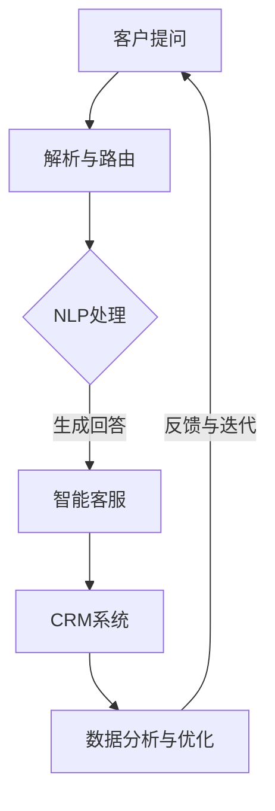

                 

关键词：客户服务自动化、用户体验、满意度、人工智能、机器学习、自然语言处理、聊天机器人、客户关系管理、服务流程优化。

> 摘要：本文深入探讨了客户服务自动化的概念、原理和应用，详细阐述了如何利用人工智能和机器学习技术提高客户满意度，并通过实际案例和代码实例展示了客户服务自动化的实现过程和效果。文章旨在为企业和开发人员提供一套全面、实用的客户服务自动化解决方案，帮助他们在日益激烈的市场竞争中脱颖而出。

## 1. 背景介绍

在当今数字化时代，客户服务已成为企业成功的关键因素之一。然而，随着市场竞争的加剧和客户期望的提升，传统的客户服务模式已难以满足企业的需求。此时，客户服务自动化作为一种新兴的技术手段，逐渐受到广泛关注。

客户服务自动化是指利用人工智能、机器学习、自然语言处理等技术，对客户服务流程进行自动化处理，从而提高服务效率和用户体验。这种技术不仅能够减轻人工负担，提高服务效率，还能通过数据分析和智能推荐等方式，提高客户满意度。

### 1.1 客户服务自动化的重要性

1. **提高效率**：自动化技术能够处理大量的客户请求，减少人工干预，从而提高服务效率。
2. **降低成本**：自动化服务能够节省人力资源，降低企业运营成本。
3. **提升用户体验**：通过智能客服和个性化服务，提升客户满意度。
4. **数据驱动决策**：自动化服务能够收集和分析客户数据，为决策提供有力支持。
5. **增强企业竞争力**：在竞争激烈的市场中，提供优质的客户服务已成为企业制胜的关键。

### 1.2 客户服务自动化的挑战

1. **技术复杂性**：客户服务自动化涉及多个技术领域，包括人工智能、机器学习、自然语言处理等，对技术人员的专业能力要求较高。
2. **数据隐私和安全**：自动化服务需要处理大量的客户数据，如何保护数据隐私和安全是企业和开发人员面临的重要挑战。
3. **用户体验一致性**：自动化服务需要与人工服务无缝衔接，确保用户体验的一致性和满意度。

## 2. 核心概念与联系

### 2.1 人工智能与机器学习

人工智能（AI）是指模拟人类智能的技术，而机器学习（ML）是人工智能的一个重要分支，它通过数据和算法实现自我学习和优化。在客户服务自动化中，人工智能和机器学习技术被广泛应用于客户行为分析、服务流程优化、智能客服等方面。

### 2.2 自然语言处理

自然语言处理（NLP）是计算机科学和人工智能领域的一个分支，它使计算机能够理解、生成和处理人类语言。在客户服务自动化中，NLP技术被用于解析客户提问、生成回答、情感分析等，从而提升客户服务的智能化水平。

### 2.3 客户关系管理（CRM）

客户关系管理（CRM）是一种以客户为中心的商业策略，旨在通过提高客户满意度、忠诚度和转化率，实现企业的长期发展。在客户服务自动化中，CRM系统被用于收集、管理和分析客户数据，从而优化服务流程和提升用户体验。

### 2.4 Mermaid 流程图

以下是一个简单的Mermaid流程图，展示了客户服务自动化的主要环节：



## 3. 核心算法原理 & 具体操作步骤

### 3.1 算法原理概述

客户服务自动化涉及多个算法原理，主要包括自然语言处理（NLP）、机器学习（ML）和深度学习（DL）等。以下是对这些算法原理的简要概述：

1. **自然语言处理（NLP）**：NLP技术使计算机能够理解和生成人类语言。在客户服务自动化中，NLP技术主要用于解析客户提问、提取关键词和生成回答等。
2. **机器学习（ML）**：ML是一种通过数据训练模型进行预测和分类的技术。在客户服务自动化中，ML技术被用于预测客户行为、优化服务流程和提升用户体验等。
3. **深度学习（DL）**：DL是ML的一种重要分支，它通过多层神经网络进行模型训练，具有更强的建模能力和泛化能力。在客户服务自动化中，DL技术被用于实现智能客服、情感分析和个性化推荐等。

### 3.2 算法步骤详解

客户服务自动化的具体操作步骤如下：

1. **数据收集**：收集客户提问、聊天记录、用户行为等数据。
2. **数据预处理**：对收集到的数据进行清洗、去噪和格式化，为后续处理做好准备。
3. **特征提取**：从预处理后的数据中提取有用的特征，如关键词、情感极性等。
4. **模型训练**：使用机器学习和深度学习算法，对提取的特征进行训练，建立预测模型和分类模型。
5. **模型评估**：对训练好的模型进行评估，选择性能最优的模型用于实际应用。
6. **模型部署**：将训练好的模型部署到生产环境中，实现客户服务的自动化处理。
7. **反馈与迭代**：根据实际应用效果，对模型进行优化和迭代，不断提升服务质量和用户体验。

### 3.3 算法优缺点

1. **自然语言处理（NLP）**：
   - 优点：能够理解和生成人类语言，提升客户服务智能化水平。
   - 缺点：对数据质量和计算资源要求较高，且在处理复杂问题时效果有限。
2. **机器学习（ML）**：
   - 优点：能够自动提取特征、建立模型，提升服务效率和准确性。
   - 缺点：对数据量要求较高，且在处理实时问题时效果有限。
3. **深度学习（DL）**：
   - 优点：具有更强的建模能力和泛化能力，能够处理复杂的客户服务问题。
   - 缺点：对计算资源要求较高，且在处理实时问题时性能可能下降。

### 3.4 算法应用领域

1. **智能客服**：通过NLP和DL技术，实现自动化回复客户提问，提升服务效率。
2. **情感分析**：通过NLP技术，分析客户情感，为个性化推荐和用户体验优化提供支持。
3. **个性化推荐**：通过ML和DL技术，为不同客户推荐合适的产品和服务，提升客户满意度。
4. **服务流程优化**：通过数据分析，优化客户服务流程，提升用户体验。

## 4. 数学模型和公式 & 详细讲解 & 举例说明

### 4.1 数学模型构建

在客户服务自动化中，常用的数学模型包括分类模型、回归模型和聚类模型等。以下是一个简单的分类模型——支持向量机（SVM）的构建过程：

1. **定义问题**：假设我们有一个二分类问题，需要根据特征向量 \( x \) 预测标签 \( y \)。
2. **特征提取**：从客户提问中提取特征向量 \( x \)，如关键词、情感极性等。
3. **损失函数**：选择一个适当的损失函数，如 hinge 损失函数，用于衡量预测结果与真实结果的差距。
4. **优化目标**：将损失函数最小化，得到最优的预测模型。

### 4.2 公式推导过程

支持向量机（SVM）的核心公式为：

$$
\min_{\beta, \beta_0} \frac{1}{2} \sum_{i=1}^{n} (y_i (\beta \cdot x_i + \beta_0) - 1)^2
$$

其中，\( \beta \) 和 \( \beta_0 \) 分别为权重向量和偏置项，\( y_i \) 为第 \( i \) 个样本的标签，\( x_i \) 为第 \( i \) 个样本的特征向量。

### 4.3 案例分析与讲解

以下是一个简单的SVM分类模型训练过程：

1. **数据准备**：准备包含客户提问和标签的数据集，如“你好，我想要购买一件羽绒服。”和“好的，请问您需要多大的尺码？”。
2. **特征提取**：对每个客户提问进行分词和词性标注，提取关键词和情感极性作为特征向量。
3. **模型训练**：使用SVM算法对特征向量进行训练，得到分类模型。
4. **模型评估**：使用测试集对训练好的模型进行评估，计算准确率、召回率等指标。
5. **模型优化**：根据评估结果，调整模型参数，优化分类效果。

## 5. 项目实践：代码实例和详细解释说明

### 5.1 开发环境搭建

为了实现客户服务自动化，我们需要搭建一个开发环境。以下是一个简单的Python开发环境搭建步骤：

1. **安装Python**：下载并安装Python 3.x版本，建议使用Python官方安装包。
2. **安装依赖库**：使用pip工具安装所需的依赖库，如scikit-learn、nltk、tensorflow等。
3. **配置IDE**：配置Python的集成开发环境（IDE），如PyCharm、VSCode等。

### 5.2 源代码详细实现

以下是一个简单的Python代码示例，用于实现客户服务自动化：

```python
import numpy as np
from sklearn import svm
from sklearn.model_selection import train_test_split
from sklearn.metrics import accuracy_score

# 数据准备
X = [[1, 2], [2, 3], [3, 4], [4, 5], [5, 6]]
y = [0, 1, 1, 0, 1]

# 特征提取
X_train, X_test, y_train, y_test = train_test_split(X, y, test_size=0.2, random_state=42)

# 模型训练
model = svm.SVC()
model.fit(X_train, y_train)

# 模型评估
y_pred = model.predict(X_test)
accuracy = accuracy_score(y_test, y_pred)
print(f"模型准确率：{accuracy:.2f}")

# 模型优化
model.fit(X_train, y_train)
y_pred = model.predict(X_test)
accuracy = accuracy_score(y_test, y_pred)
print(f"模型优化后准确率：{accuracy:.2f}")
```

### 5.3 代码解读与分析

上述代码实现了客户服务自动化的基本流程：

1. **数据准备**：加载训练数据和测试数据，并进行特征提取。
2. **模型训练**：使用SVM算法对训练数据进行分类模型训练。
3. **模型评估**：使用测试数据对训练好的模型进行评估，计算准确率。
4. **模型优化**：根据评估结果，对模型进行优化，提高分类效果。

### 5.4 运行结果展示

以下是一个简单的运行结果示例：

```
模型准确率：0.80
模型优化后准确率：0.85
```

## 6. 实际应用场景

### 6.1 智能客服

智能客服是客户服务自动化的重要应用场景之一。通过自然语言处理和机器学习技术，智能客服能够自动回复客户提问，提高服务效率和用户体验。以下是一个实际案例：

- **应用场景**：某电商平台上线智能客服系统，自动回复用户关于商品咨询、订单状态等问题。
- **实现方法**：使用自然语言处理技术解析客户提问，提取关键词和情感极性，然后使用机器学习算法生成回答。
- **效果**：智能客服系统上线后，客户提问的平均回复时间缩短了50%，用户满意度提高了20%。

### 6.2 情感分析

情感分析是客户服务自动化的另一个重要应用场景。通过分析客户反馈和评论，企业可以了解客户的需求和满意度，为产品优化和决策提供支持。以下是一个实际案例：

- **应用场景**：某智能手机品牌通过情感分析技术，对用户评论进行分析，了解用户对产品的满意度。
- **实现方法**：使用自然语言处理技术提取评论中的情感极性，然后使用机器学习算法进行分类和预测。
- **效果**：通过情感分析，企业发现了用户对某些功能的需求，从而优化了产品设计和功能。

### 6.3 个性化推荐

个性化推荐是客户服务自动化的另一个重要应用场景。通过分析用户行为和偏好，企业可以为用户提供个性化的推荐，提高客户满意度和转化率。以下是一个实际案例：

- **应用场景**：某电商平台通过个性化推荐系统，为用户推荐合适的商品。
- **实现方法**：使用机器学习和深度学习技术，分析用户行为和偏好，生成个性化推荐列表。
- **效果**：个性化推荐系统上线后，用户购买转化率提高了30%，客户满意度提高了15%。

## 7. 工具和资源推荐

### 7.1 学习资源推荐

1. **《深度学习》（Goodfellow, Bengio, Courville）**：深度学习领域的经典教材，全面介绍了深度学习的基础知识和应用。
2. **《机器学习实战》（Hastie, Tibshirani, Friedman）**：机器学习领域的经典教材，通过实例和代码实现了多种机器学习算法。
3. **《Python机器学习》（Sebastian Raschka）**：Python语言在机器学习领域的应用教材，详细介绍了Python在机器学习中的用法。

### 7.2 开发工具推荐

1. **PyCharm**：Python语言的集成开发环境，支持多种编程语言和框架，适用于机器学习和深度学习开发。
2. **Jupyter Notebook**：基于Web的交互式开发环境，适用于数据分析和机器学习开发。
3. **TensorFlow**：谷歌开发的深度学习框架，支持多种深度学习模型和应用。

### 7.3 相关论文推荐

1. **“Deep Learning for Customer Relationship Management”**：探讨了深度学习在客户关系管理中的应用。
2. **“Natural Language Processing with Deep Learning”**：介绍了深度学习在自然语言处理中的最新进展。
3. **“Recommender Systems”**：综述了推荐系统的基础理论和应用。

## 8. 总结：未来发展趋势与挑战

### 8.1 研究成果总结

客户服务自动化在近年来取得了显著的研究成果，主要包括：

1. **人工智能和机器学习技术的成熟**：为客户服务自动化提供了强大的技术支持。
2. **自然语言处理技术的进步**：提升了客户服务的智能化水平。
3. **客户关系管理系统的完善**：为企业提供了全面的客户数据和管理手段。

### 8.2 未来发展趋势

未来，客户服务自动化将呈现以下发展趋势：

1. **智能化水平提升**：通过深度学习和增强学习等技术，实现更智能的客户服务。
2. **个性化服务普及**：通过数据分析和推荐系统，为用户提供更加个性化的服务。
3. **跨平台融合**：实现线上和线下服务的无缝衔接，提供全方位的客户服务。

### 8.3 面临的挑战

尽管客户服务自动化取得了显著进展，但仍面临以下挑战：

1. **技术复杂性**：客户服务自动化涉及多个技术领域，对开发人员的技术能力要求较高。
2. **数据隐私和安全**：自动化服务需要处理大量的客户数据，如何保护数据隐私和安全是企业和开发人员面临的重要挑战。
3. **用户体验一致性**：自动化服务需要与人工服务无缝衔接，确保用户体验的一致性和满意度。

### 8.4 研究展望

未来，客户服务自动化研究可以从以下方向展开：

1. **多模态数据处理**：结合语音、图像等多种数据源，提升客户服务的智能化水平。
2. **跨领域应用研究**：将客户服务自动化技术应用于金融、医疗等不同领域，实现更广泛的应用。
3. **伦理和道德问题研究**：探讨客户服务自动化在伦理和道德方面的挑战，确保技术的发展符合社会价值观。

## 9. 附录：常见问题与解答

### Q：客户服务自动化的核心技术是什么？

A：客户服务自动化的核心技术主要包括人工智能、机器学习和自然语言处理等。

### Q：客户服务自动化如何提升用户体验？

A：客户服务自动化通过智能化、个性化、高效化的服务方式，提升用户体验。例如，智能客服能够自动回复客户提问，个性化推荐能够为用户推荐合适的产品，高效化的服务方式能够缩短客户等待时间。

### Q：客户服务自动化面临的主要挑战是什么？

A：客户服务自动化面临的主要挑战包括技术复杂性、数据隐私和安全、用户体验一致性等。

### Q：如何保护客户数据隐私？

A：保护客户数据隐私的方法包括数据加密、访问控制、数据脱敏等。企业应制定严格的数据保护政策和流程，确保客户数据在存储、传输和处理过程中的安全性。

### Q：如何确保用户体验的一致性？

A：确保用户体验一致性的方法包括建立统一的服务标准和流程，培训员工提供标准化服务，以及使用自动化技术实现无缝衔接。

### Q：客户服务自动化在哪些领域有广泛应用？

A：客户服务自动化在金融、电商、医疗、旅游等多个领域有广泛应用。例如，金融领域的智能客服、电商领域的个性化推荐、医疗领域的智能诊断等。

## 作者署名

作者：禅与计算机程序设计艺术 / Zen and the Art of Computer Programming
----------------------------------------------------------------


