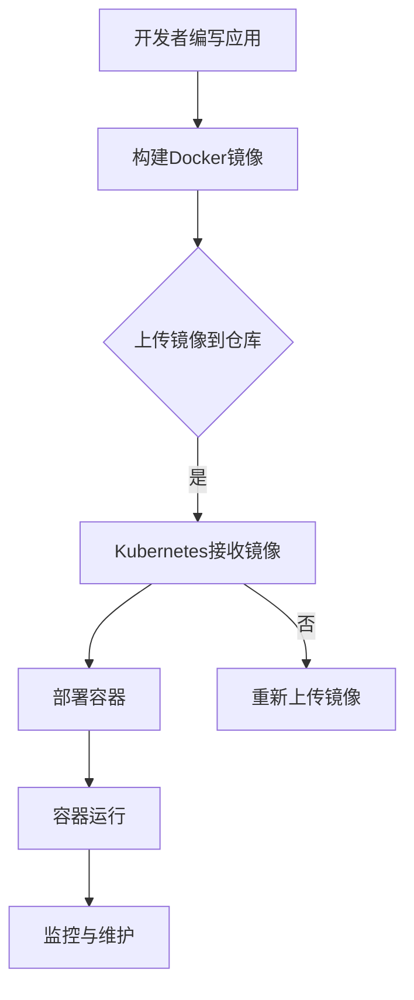

                 

关键词：容器化，Docker，Kubernetes，微服务，持续集成与部署，DevOps

> 摘要：本文将深入探讨容器化技术的两大巨头——Docker 和 Kubernetes，解析它们的核心概念、技术原理、具体操作步骤，以及在实际应用场景中的表现。我们将结合案例和实践，详细解读这两个工具的优势和局限，并展望其未来发展趋势和面临的挑战。

## 1. 背景介绍

容器化技术的兴起源于云计算和微服务架构的发展需求。传统的应用程序部署方式往往依赖于特定的操作系统环境和软件配置，导致跨环境部署时出现大量的问题。容器化技术通过将应用程序及其依赖环境封装在一个独立的容器中，解决了这一问题，使得应用可以在任何支持容器引擎的环境中一致运行。

Docker 是容器化技术的先驱，于 2013 年诞生。它提供了一个轻量级、可移植的容器平台，使得开发者可以将应用程序及其依赖打包在一个 Docker 镜像中，并在不同的环境中快速部署。Docker 引擎是运行这些容器的基础设施。

Kubernetes（简称 K8s）是一个开源的容器编排工具，由 Google 开发并捐赠给云原生计算基金会（CNCF）。它的核心功能是自动化容器的部署、扩展和管理，帮助开发者更高效地管理和运行容器化应用。

## 2. 核心概念与联系

### 2.1 容器与虚拟机的区别

容器和虚拟机都是用于隔离应用程序及其运行环境的工具，但它们的工作原理和性能特性有所不同。

- **容器**：容器共享宿主机的操作系统内核，通过 cgroup 和 namespace 实现资源隔离。容器比虚拟机轻量，启动速度快，资源占用少，适用于微服务架构和持续集成与部署。
- **虚拟机**：虚拟机通过 Hypervisor 实现硬件资源的虚拟化，每个虚拟机都有自己的操作系统和硬件设备。虚拟机隔离性更好，但资源占用较大，启动时间较长。

### 2.2 Docker 与 Kubernetes 的关系

Docker 提供了容器化技术的基础设施，而 Kubernetes 则负责管理和编排这些容器。具体来说：

- **Docker**：负责创建和管理容器，将应用程序及其依赖打包成 Docker 镜像，并提供 Docker 引擎来运行这些容器。
- **Kubernetes**：负责自动化容器的部署、扩展和管理。Kubernetes 可以理解 Docker 容器的配置，并对其进行调度、监控和更新。

### 2.3 Mermaid 流程图

以下是一个简化的容器化技术架构的 Mermaid 流程图：



## 3. 核心算法原理 & 具体操作步骤

### 3.1 算法原理概述

容器化技术的核心在于将应用程序及其依赖环境封装在一个独立的容器中，实现环境的一致性。这个过程涉及到以下几个步骤：

1. **Docker 镜像构建**：通过 Dockerfile 指令将应用程序及其依赖打包成 Docker 镜像。
2. **容器运行**：使用 Docker 引擎运行 Docker 镜像，创建容器。
3. **容器编排**：Kubernetes 接收 Docker 容器的配置，并对其进行调度、监控和更新。

### 3.2 算法步骤详解

#### 3.2.1 Docker 镜像构建

1. 编写 Dockerfile：
   ```Dockerfile
   FROM ubuntu:18.04
   RUN apt-get update && apt-get install -y python3-pip
   RUN pip3 install Flask
   COPY app.py /app.py
   CMD ["python3", "/app.py"]
   ```

2. 构建镜像：
   ```bash
   docker build -t myapp:latest .
   ```

3. 查看镜像：
   ```bash
   docker images
   ```

#### 3.2.2 容器运行

1. 运行容器：
   ```bash
   docker run -d -p 8080:8080 myapp:latest
   ```

2. 查看容器：
   ```bash
   docker ps
   ```

#### 3.2.3 容器编排

1. 部署 Kubernetes：
   - 参考官方文档：https://kubernetes.io/docs/setup/production-environment/tools/kubeadm/kubeadm-init/

2. 创建 Kubernetes Deployment：
   ```yaml
   apiVersion: apps/v1
   kind: Deployment
   metadata:
     name: myapp-deployment
   spec:
     replicas: 3
     selector:
       matchLabels:
         app: myapp
     template:
       metadata:
         labels:
           app: myapp
       spec:
         containers:
         - name: myapp
           image: myapp:latest
           ports:
           - containerPort: 8080
   ```

3. 部署并查看：
   ```bash
   kubectl apply -f myapp-deployment.yaml
   kubectl get pods
   ```

### 3.3 算法优缺点

**Docker**：

- **优点**：轻量级，可移植性强，易于使用，支持微服务架构。
- **缺点**：缺乏自动化管理功能，需要额外的工具（如 Kubernetes）进行编排。

**Kubernetes**：

- **优点**：强大的容器编排和管理能力，支持自动部署、扩展和滚动更新。
- **缺点**：学习曲线较陡峭，配置和管理较为复杂。

### 3.4 算法应用领域

容器化技术适用于以下场景：

- **微服务架构**：将应用程序拆分为多个微服务，每个微服务运行在一个容器中，实现高可用和可伸缩性。
- **持续集成与部署（CI/CD）**：快速构建、测试和部署应用程序，提高开发效率。
- **云原生应用**：充分利用云计算资源，实现弹性伸缩和自动化管理。

## 4. 数学模型和公式 & 详细讲解 & 举例说明

### 4.1 数学模型构建

在容器化技术的实际应用中，我们常常关注以下数学模型：

- **资源利用率**：容器化应用在宿主机上的资源利用率，包括 CPU、内存、磁盘等。
- **响应时间**：容器化应用对外服务的响应时间。

### 4.2 公式推导过程

#### 资源利用率

资源利用率的计算公式为：

$$
\text{利用率} = \frac{\text{实际使用资源}}{\text{总资源}} \times 100\%
$$

#### 响应时间

响应时间的计算公式为：

$$
\text{响应时间} = \frac{\text{请求总数}}{\text{处理时间}} \times \text{平均响应时间}
$$

### 4.3 案例分析与讲解

假设一个容器化应用，每天接收 10000 个请求，处理时间为 1 分钟，平均响应时间为 10 秒。

1. **资源利用率**：

- **CPU**：假设宿主机有 4 个 CPU 核心，容器占用 2 个核心，则 CPU 利用率为：

  $$
  \text{CPU 利用率} = \frac{2}{4} \times 100\% = 50\%
  $$

- **内存**：假设宿主机有 8GB 内存，容器占用 4GB 内存，则内存利用率为：

  $$
  \text{内存利用率} = \frac{4}{8} \times 100\% = 50\%
  $$

- **磁盘**：假设宿主机有 100GB 磁盘，容器占用 50GB 磁盘，则磁盘利用率为：

  $$
  \text{磁盘利用率} = \frac{50}{100} \times 100\% = 50\%
  $$

2. **响应时间**：

  $$
  \text{响应时间} = \frac{10000}{1 \times 60} \times 10 = 166.67 \text{秒}
  $$

## 5. 项目实践：代码实例和详细解释说明

### 5.1 开发环境搭建

本文以 Flask 应用为例，演示如何在 Docker 和 Kubernetes 上部署一个简单的 Web 应用。

1. 安装 Docker：

   ```bash
   sudo apt-get update
   sudo apt-get install docker.io
   sudo systemctl start docker
   sudo systemctl enable docker
   ```

2. 安装 Kubernetes：

   - 参考官方文档：https://kubernetes.io/docs/setup/production-environment/tools/kubeadm/kubeadm-init/

### 5.2 源代码详细实现

1. 创建一个名为 `app.py` 的 Flask 应用：

   ```python
   from flask import Flask

   app = Flask(__name__)

   @app.route('/')
   def hello():
       return 'Hello, World!'

   if __name__ == '__main__':
       app.run(host='0.0.0.0', port=8080)
   ```

2. 创建一个名为 `Dockerfile` 的 Docker 镜像构建文件：

   ```Dockerfile
   FROM python:3.8
   WORKDIR /app
   COPY app.py app.py
   RUN pip3 install flask
   CMD ["python3", "app.py"]
   ```

### 5.3 代码解读与分析

1. `app.py`：这是一个简单的 Flask 应用，定义了一个根路由 `/`，返回字符串 `'Hello, World!'`。

2. `Dockerfile`：这是一个用于构建 Flask 应用 Docker 镜像的文件。它基于 Python 3.8 编译环境，将 `app.py` 文件复制到镜像中的 `/app` 目录下，并安装 Flask 库。最后，命令 `CMD ["python3", "app.py"]` 用于启动 Flask 应用。

### 5.4 运行结果展示

1. 构建 Docker 镜像：

   ```bash
   docker build -t myapp:latest .
   ```

2. 运行容器：

   ```bash
   docker run -d -p 8080:8080 myapp:latest
   ```

3. 访问 Web 应用：

   在浏览器中输入 `http://localhost:8080`，可以看到页面显示 "Hello, World!"。

## 6. 实际应用场景

容器化技术在实际应用中有着广泛的应用场景，以下列举几个典型的应用场景：

1. **微服务架构**：将复杂的应用系统拆分为多个微服务，每个微服务运行在一个容器中，实现高可用和可伸缩性。

2. **持续集成与部署（CI/CD）**：通过 Docker 和 Kubernetes，实现自动化构建、测试和部署，提高开发效率。

3. **云原生应用**：充分利用云计算资源，实现弹性伸缩和自动化管理，降低运维成本。

4. **容器化数据库**：将数据库容器化，实现数据库的高可用、备份和恢复。

5. **边缘计算**：在边缘设备上部署容器化应用，实现实时数据处理和响应。

## 7. 工具和资源推荐

### 7.1 学习资源推荐

1. 《Docker 实战》
2. 《Kubernetes 实战》
3. Kubernetes 官方文档：https://kubernetes.io/docs/
4. Docker 官方文档：https://docs.docker.com/

### 7.2 开发工具推荐

1. Visual Studio Code
2. Docker Desktop
3. Kubernetes CLI（kubectl）

### 7.3 相关论文推荐

1. "Docker: Lightweight Linux Containers for Developing, Shipping, and Running Applications"
2. "Kubernetes: The Hard Parts: Load Balancing, Visibility, and Scalability"
3. "The Linux Container Infrastructure: From Docker to Kubernetes"

## 8. 总结：未来发展趋势与挑战

### 8.1 研究成果总结

容器化技术在过去几年取得了显著的进展，已成为现代应用程序开发的重要基础设施。Docker 和 Kubernetes 作为容器化技术的两大代表，分别解决了容器创建和管理的问题。随着云计算和微服务架构的发展，容器化技术将继续在 IT 领域发挥重要作用。

### 8.2 未来发展趋势

1. **云原生技术**：容器化技术将深度融合云原生技术，实现更高效、更安全的云计算服务。
2. **自动化与智能化**：容器编排和管理将更加自动化和智能化，降低运维成本。
3. **多租户与混合云**：容器化技术将支持多租户架构和混合云部署，满足不同业务需求。

### 8.3 面临的挑战

1. **安全性**：容器化应用的安全性和合规性仍需加强，确保数据安全和隐私保护。
2. **兼容性与迁移**：如何有效地将现有应用程序迁移到容器化环境，是当前面临的一个重要挑战。
3. **人才需求**：随着容器化技术的普及，对相关人才的需求日益增长，人才培养和培训是一个长期任务。

### 8.4 研究展望

未来，容器化技术将在以下几个方面展开深入研究：

1. **高性能容器引擎**：提高容器性能，满足更高性能的应用需求。
2. **容器安全与合规**：加强容器安全性和合规性，保障应用安全。
3. **跨平台与跨语言支持**：提高容器化技术的跨平台和跨语言兼容性，简化开发流程。

## 9. 附录：常见问题与解答

### 9.1 Docker 和 Kubernetes 的区别是什么？

Docker 是一个用于创建和管理容器的工具，而 Kubernetes 是一个用于自动化容器编排和管理的工具。Docker 提供了一个轻量级的容器化平台，将应用程序及其依赖打包在容器中，而 Kubernetes 负责管理这些容器的部署、扩展和更新。

### 9.2 如何在 Kubernetes 上部署一个容器化应用？

在 Kubernetes 上部署一个容器化应用通常涉及以下几个步骤：

1. 编写 Dockerfile，用于构建应用程序的 Docker 镜像。
2. 将 Docker 镜像上传到容器镜像仓库（如 Docker Hub）。
3. 创建 Kubernetes Deployment，指定应用程序容器的镜像、部署策略和资源需求。
4. 使用 kubectl 命令部署 Kubernetes Deployment。

### 9.3 容器化技术的优势是什么？

容器化技术的优势包括：

1. **环境一致性**：容器化应用可以在任何支持容器引擎的环境中一致运行，解决了跨环境部署问题。
2. **可移植性**：容器化应用可以轻松地在不同操作系统、不同硬件平台之间迁移。
3. **资源利用率**：容器比虚拟机更轻量，启动速度快，资源占用少。
4. **自动化管理**：Kubernetes 等工具可以自动化管理容器，提高运维效率。

### 9.4 容器化技术面临的主要挑战是什么？

容器化技术面临的主要挑战包括：

1. **安全性**：确保容器化应用的安全性，防止数据泄露和攻击。
2. **兼容性与迁移**：如何有效地将现有应用程序迁移到容器化环境，需要解决兼容性和迁移问题。
3. **人才需求**：容器化技术需要相关人才进行部署、管理和维护，人才短缺是一个挑战。

**作者：禅与计算机程序设计艺术 / Zen and the Art of Computer Programming**----------------------------------------------------------------

### 文章关键词 Keyword
- 容器化技术
- Docker
- Kubernetes
- 微服务
- 持续集成与部署
- DevOps

### 文章摘要 Abstract
本文深入探讨了容器化技术领域的两大重要工具——Docker 和 Kubernetes，分析了它们的核心概念、技术原理、具体操作步骤，以及在实际应用场景中的表现。通过结合案例和实践，本文详细解读了这两个工具的优势和局限，并展望了其未来发展趋势和面临的挑战。

## 1. 背景介绍

容器化技术的兴起源于云计算和微服务架构的发展需求。传统的应用程序部署方式往往依赖于特定的操作系统环境和软件配置，导致跨环境部署时出现大量的问题。容器化技术通过将应用程序及其依赖环境封装在一个独立的容器中，解决了这一问题，使得应用可以在任何支持容器引擎的环境中一致运行。

Docker 是容器化技术的先驱，于 2013 年诞生。它提供了一个轻量级、可移植的容器平台，使得开发者可以将应用程序及其依赖打包在一个 Docker 镜像中，并在不同的环境中快速部署。Docker 引擎是运行这些容器的基础设施。

Kubernetes（简称 K8s）是一个开源的容器编排工具，由 Google 开发并捐赠给云原生计算基金会（CNCF）。它的核心功能是自动化容器的部署、扩展和管理，帮助开发者更高效地管理和运行容器化应用。

## 2. 核心概念与联系

### 2.1 容器与虚拟机的区别

容器和虚拟机都是用于隔离应用程序及其运行环境的工具，但它们的工作原理和性能特性有所不同。

- **容器**：容器共享宿主机的操作系统内核，通过 cgroup 和 namespace 实现资源隔离。容器比虚拟机轻量，启动速度快，资源占用少，适用于微服务架构和持续集成与部署。
- **虚拟机**：虚拟机通过 Hypervisor 实现硬件资源的虚拟化，每个虚拟机都有自己的操作系统和硬件设备。虚拟机隔离性更好，但资源占用较大，启动时间较长。

### 2.2 Docker 与 Kubernetes 的关系

Docker 提供了容器化技术的基础设施，而 Kubernetes 则负责管理和编排这些容器。具体来说：

- **Docker**：负责创建和管理容器，将应用程序及其依赖打包成 Docker 镜像，并提供 Docker 引擎来运行这些容器。
- **Kubernetes**：负责自动化容器的部署、扩展和管理。Kubernetes 可以理解 Docker 容器的配置，并对其进行调度、监控和更新。

### 2.3 Mermaid 流程图

以下是一个简化的容器化技术架构的 Mermaid 流程图：


## 3. 核心算法原理 & 具体操作步骤
### 3.1 算法原理概述

容器化技术的核心在于将应用程序及其依赖环境封装在一个独立的容器中，实现环境的一致性。这个过程涉及到以下几个步骤：

1. **Docker 镜像构建**：通过 Dockerfile 指令将应用程序及其依赖打包成 Docker 镜像。
2. **容器运行**：使用 Docker 引擎运行 Docker 镜像，创建容器。
3. **容器编排**：Kubernetes 接收 Docker 容器的配置，并对其进行调度、监控和更新。

### 3.2 算法步骤详解

#### 3.2.1 Docker 镜像构建

1. 编写 Dockerfile：
   ```Dockerfile
   FROM ubuntu:18.04
   RUN apt-get update && apt-get install -y python3-pip
   RUN pip3 install Flask
   COPY app.py /app.py
   CMD ["python3", "/app.py"]
   ```

2. 构建镜像：
   ```bash
   docker build -t myapp:latest .
   ```

3. 查看镜像：
   ```bash
   docker images
   ```

#### 3.2.2 容器运行

1. 运行容器：
   ```bash
   docker run -d -p 8080:8080 myapp:latest
   ```

2. 查看容器：
   ```bash
   docker ps
   ```

#### 3.2.3 容器编排

1. 部署 Kubernetes：
   - 参考官方文档：https://kubernetes.io/docs/setup/production-environment/tools/kubeadm/kubeadm-init/

2. 创建 Kubernetes Deployment：
   ```yaml
   apiVersion: apps/v1
   kind: Deployment
   metadata:
     name: myapp-deployment
   spec:
     replicas: 3
     selector:
       matchLabels:
         app: myapp
     template:
       metadata:
         labels:
           app: myapp
       spec:
         containers:
         - name: myapp
           image: myapp:latest
           ports:
           - containerPort: 8080
   ```

3. 部署并查看：
   ```bash
   kubectl apply -f myapp-deployment.yaml
   kubectl get pods
   ```

### 3.3 算法优缺点

**Docker**：

- **优点**：轻量级，可移植性强，易于使用，支持微服务架构。
- **缺点**：缺乏自动化管理功能，需要额外的工具（如 Kubernetes）进行编排。

**Kubernetes**：

- **优点**：强大的容器编排和管理能力，支持自动部署、扩展和滚动更新。
- **缺点**：学习曲线较陡峭，配置和管理较为复杂。

### 3.4 算法应用领域

容器化技术适用于以下场景：

- **微服务架构**：将复杂的应用系统拆分为多个微服务，每个微服务运行在一个容器中，实现高可用和可伸缩性。
- **持续集成与部署（CI/CD）**：快速构建、测试和部署应用程序，提高开发效率。
- **云原生应用**：充分利用云计算资源，实现弹性伸缩和自动化管理。

## 4. 数学模型和公式 & 详细讲解 & 举例说明
### 4.1 数学模型构建

在容器化技术的实际应用中，我们常常关注以下数学模型：

- **资源利用率**：容器化应用在宿主机上的资源利用率，包括 CPU、内存、磁盘等。
- **响应时间**：容器化应用对外服务的响应时间。

### 4.2 公式推导过程

#### 资源利用率

资源利用率的计算公式为：

$$
\text{利用率} = \frac{\text{实际使用资源}}{\text{总资源}} \times 100\%
$$

#### 响应时间

响应时间的计算公式为：

$$
\text{响应时间} = \frac{\text{请求总数}}{\text{处理时间}} \times \text{平均响应时间}
$$

### 4.3 案例分析与讲解

假设一个容器化应用，每天接收 10000 个请求，处理时间为 1 分钟，平均响应时间为 10 秒。

1. **资源利用率**：

- **CPU**：假设宿主机有 4 个 CPU 核心，容器占用 2 个核心，则 CPU 利用率为：

  $$
  \text{CPU 利用率} = \frac{2}{4} \times 100\% = 50\%
  $$

- **内存**：假设宿主机有 8GB 内存，容器占用 4GB 内存，则内存利用率为：

  $$
  \text{内存利用率} = \frac{4}{8} \times 100\% = 50\%
  $$

- **磁盘**：假设宿主机有 100GB 磁盘，容器占用 50GB 磁盘，则磁盘利用率为：

  $$
  \text{磁盘利用率} = \frac{50}{100} \times 100\% = 50\%
  $$

2. **响应时间**：

  $$
  \text{响应时间} = \frac{10000}{1 \times 60} \times 10 = 166.67 \text{秒}
  $$

## 5. 项目实践：代码实例和详细解释说明
### 5.1 开发环境搭建

本文以 Flask 应用为例，演示如何在 Docker 和 Kubernetes 上部署一个简单的 Web 应用。

1. 安装 Docker：

   ```bash
   sudo apt-get update
   sudo apt-get install docker.io
   sudo systemctl start docker
   sudo systemctl enable docker
   ```

2. 安装 Kubernetes：

   - 参考官方文档：https://kubernetes.io/docs/setup/production-environment/tools/kubeadm/kubeadm-init/

### 5.2 源代码详细实现

1. 创建一个名为 `app.py` 的 Flask 应用：

   ```python
   from flask import Flask

   app = Flask(__name__)

   @app.route('/')
   def hello():
       return 'Hello, World!'

   if __name__ == '__main__':
       app.run(host='0.0.0.0', port=8080)
   ```

2. 创建一个名为 `Dockerfile` 的 Docker 镜像构建文件：

   ```Dockerfile
   FROM python:3.8
   WORKDIR /app
   COPY app.py app.py
   RUN pip3 install flask
   CMD ["python3", "app.py"]
   ```

### 5.3 代码解读与分析

1. `app.py`：这是一个简单的 Flask 应用，定义了一个根路由 `/`，返回字符串 `'Hello, World!'`。

2. `Dockerfile`：这是一个用于构建 Flask 应用 Docker 镜像的文件。它基于 Python 3.8 编译环境，将 `app.py` 文件复制到镜像中的 `/app` 目录下，并安装 Flask 库。最后，命令 `CMD ["python3", "app.py"]` 用于启动 Flask 应用。

### 5.4 运行结果展示

1. 构建 Docker 镜像：

   ```bash
   docker build -t myapp:latest .
   ```

2. 运行容器：

   ```bash
   docker run -d -p 8080:8080 myapp:latest
   ```

3. 访问 Web 应用：

   在浏览器中输入 `http://localhost:8080`，可以看到页面显示 "Hello, World!"。

## 6. 实际应用场景

容器化技术在实际应用中有着广泛的应用场景，以下列举几个典型的应用场景：

1. **微服务架构**：将复杂的应用系统拆分为多个微服务，每个微服务运行在一个容器中，实现高可用和可伸缩性。

2. **持续集成与部署（CI/CD）**：通过 Docker 和 Kubernetes，实现自动化构建、测试和部署，提高开发效率。

3. **云原生应用**：充分利用云计算资源，实现弹性伸缩和自动化管理，降低运维成本。

4. **容器化数据库**：将数据库容器化，实现数据库的高可用、备份和恢复。

5. **边缘计算**：在边缘设备上部署容器化应用，实现实时数据处理和响应。

## 7. 工具和资源推荐
### 7.1 学习资源推荐

1. 《Docker 实战》
2. 《Kubernetes 实战》
3. Kubernetes 官方文档：https://kubernetes.io/docs/
4. Docker 官方文档：https://docs.docker.com/

### 7.2 开发工具推荐

1. Visual Studio Code
2. Docker Desktop
3. Kubernetes CLI（kubectl）

### 7.3 相关论文推荐

1. "Docker: Lightweight Linux Containers for Developing, Shipping, and Running Applications"
2. "Kubernetes: The Hard Parts: Load Balancing, Visibility, and Scalability"
3. "The Linux Container Infrastructure: From Docker to Kubernetes"

## 8. 总结：未来发展趋势与挑战
### 8.1 研究成果总结

容器化技术在过去几年取得了显著的进展，已成为现代应用程序开发的重要基础设施。Docker 和 Kubernetes 作为容器化技术的两大代表，分别解决了容器创建和管理的问题。随着云计算和微服务架构的发展，容器化技术将继续在 IT 领域发挥重要作用。

### 8.2 未来发展趋势

1. **云原生技术**：容器化技术将深度融合云原生技术，实现更高效、更安全的云计算服务。
2. **自动化与智能化**：容器编排和管理将更加自动化和智能化，降低运维成本。
3. **多租户与混合云**：容器化技术将支持多租户架构和混合云部署，满足不同业务需求。

### 8.3 面临的挑战

1. **安全性**：确保容器化应用的安全性，防止数据泄露和攻击。
2. **兼容性与迁移**：如何有效地将现有应用程序迁移到容器化环境，是当前面临的一个重要挑战。
3. **人才需求**：容器化技术需要相关人才进行部署、管理和维护，人才短缺是一个挑战。

### 8.4 研究展望

未来，容器化技术将在以下几个方面展开深入研究：

1. **高性能容器引擎**：提高容器性能，满足更高性能的应用需求。
2. **容器安全与合规**：加强容器安全性和合规性，保障应用安全。
3. **跨平台与跨语言支持**：提高容器化技术的跨平台和跨语言兼容性，简化开发流程。

## 9. 附录：常见问题与解答

### 9.1 Docker 和 Kubernetes 的区别是什么？

Docker 是一个用于创建和管理容器的工具，而 Kubernetes 是一个用于自动化容器编排和管理的工具。Docker 提供了一个轻量级的容器化平台，将应用程序及其依赖打包在容器中，而 Kubernetes 负责管理这些容器的部署、扩展和更新。

### 9.2 如何在 Kubernetes 上部署一个容器化应用？

在 Kubernetes 上部署一个容器化应用通常涉及以下几个步骤：

1. 编写 Dockerfile，用于构建应用程序的 Docker 镜像。
2. 将 Docker 镜像上传到容器镜像仓库（如 Docker Hub）。
3. 创建 Kubernetes Deployment，指定应用程序容器的镜像、部署策略和资源需求。
4. 使用 kubectl 命令部署 Kubernetes Deployment。

### 9.3 容器化技术的优势是什么？

容器化技术的优势包括：

1. **环境一致性**：容器化应用可以在任何支持容器引擎的环境中一致运行，解决了跨环境部署问题。
2. **可移植性**：容器化应用可以轻松地在不同操作系统、不同硬件平台之间迁移。
3. **资源利用率**：容器比虚拟机更轻量，启动速度快，资源占用少。
4. **自动化管理**：Kubernetes 等工具可以自动化管理容器，提高运维效率。

### 9.4 容器化技术面临的主要挑战是什么？

容器化技术面临的主要挑战包括：

1. **安全性**：确保容器化应用的安全性，防止数据泄露和攻击。
2. **兼容性与迁移**：如何有效地将现有应用程序迁移到容器化环境，需要解决兼容性和迁移问题。
3. **人才需求**：容器化技术需要相关人才进行部署、管理和维护，人才短缺是一个挑战。

**作者：禅与计算机程序设计艺术 / Zen and the Art of Computer Programming**

