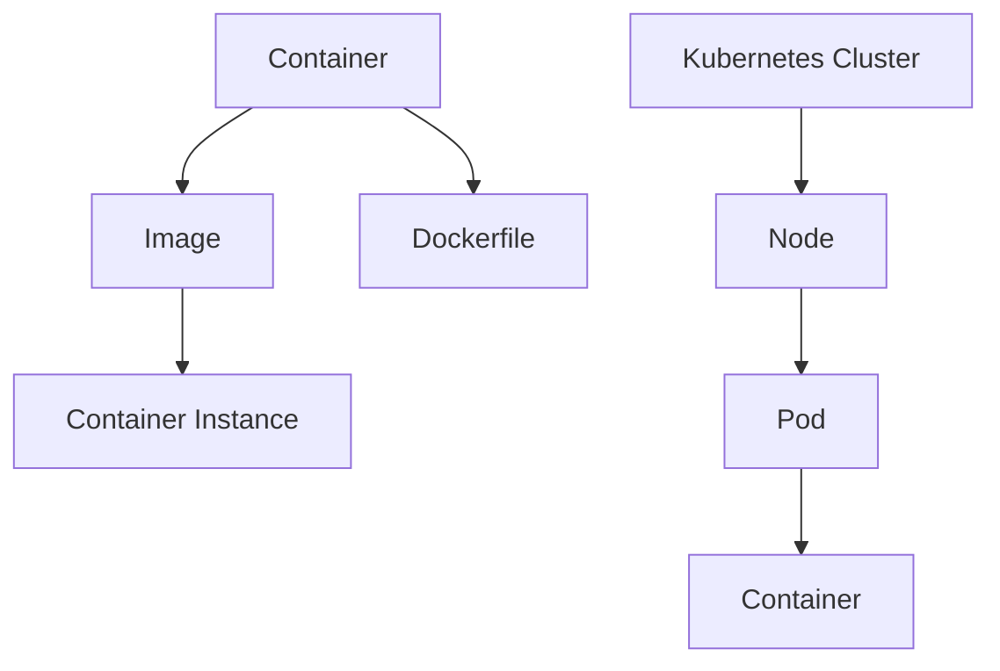

                 

关键词：容器化技术，Docker，Kubernetes，实践，技术博客，IT领域，专业语言

> 摘要：本文深入探讨了容器化技术，特别是Docker和Kubernetes的应用与实践。通过详细介绍其核心概念、原理、操作步骤以及数学模型，本文旨在为读者提供对容器化技术的全面理解，并探讨其在实际应用中的优势和挑战。

## 1. 背景介绍

在云计算和分布式系统的浪潮中，容器化技术成为了现代软件开发和部署的关键趋势。容器化技术使得应用程序的部署更加灵活、可移植且可扩展。Docker和Kubernetes是容器化技术的两大重要支柱，它们在开发、测试、部署和运维过程中发挥了重要作用。

### 1.1 Docker

Docker是一种开放源代码的容器化平台，用于封装、共享、运行和分发应用程序。它利用Linux容器技术，将应用程序及其依赖环境封装在一个独立的容器中，确保了应用程序在不同的环境中运行的一致性。

### 1.2 Kubernetes

Kubernetes是一个开源的容器编排平台，用于自动化容器化应用程序的部署、扩展和管理。它提供了一个强大且灵活的框架，使开发者和运维团队能够轻松地管理和维护容器化应用程序。

## 2. 核心概念与联系

### 2.1 核心概念

- **容器**：一个轻量级、可执行的软件包，包含了应用程序以及其运行时环境。
- **镜像**：一个静态的、不可变的容器模板，用于创建容器实例。
- **Dockerfile**：一个包含一系列指令的脚本文件，用于构建Docker镜像。
- **Kubernetes集群**：一组节点，其中每个节点都运行Kubernetes组件，共同工作以管理容器化应用程序。
- **Pod**：Kubernetes中的最小工作单元，可以包含一个或多个容器。

### 2.2 Mermaid 流程图



## 3. 核心算法原理 & 具体操作步骤

### 3.1 算法原理概述

容器化技术的核心在于封装和隔离。Docker通过镜像和容器实现了应用程序的封装，确保了环境一致性。Kubernetes则通过集群和Pod实现了容器的自动化管理和编排。

### 3.2 算法步骤详解

#### 3.2.1 Docker 操作步骤

1. **编写Dockerfile**：定义应用程序的构建过程。
2. **构建镜像**：使用Dockerfile构建镜像。
3. **运行容器**：使用镜像启动容器实例。

#### 3.2.2 Kubernetes 操作步骤

1. **配置Kubernetes集群**：安装和配置Kubernetes集群。
2. **编写YAML配置文件**：定义Pod、Service和其他资源。
3. **部署应用程序**：使用Kubernetes API部署应用程序。

### 3.3 算法优缺点

#### 优点

- **环境一致性**：容器化确保了应用程序在不同环境中的一致性。
- **可移植性**：容器化应用程序可以在任何支持Docker和Kubernetes的平台上运行。
- **可扩展性**：Kubernetes提供了自动化的容器管理，支持水平扩展。

#### 缺点

- **学习曲线**：Docker和Kubernetes的学习曲线较陡。
- **资源消耗**：容器化应用程序可能需要更多的CPU和内存资源。

### 3.4 算法应用领域

容器化技术广泛应用于Web应用、微服务架构、持续集成和持续部署（CI/CD）等领域。

## 4. 数学模型和公式 & 详细讲解 & 举例说明

### 4.1 数学模型构建

容器化技术的数学模型主要包括：

- **资源分配模型**：用于计算容器所需的CPU和内存资源。
- **调度模型**：用于确定容器在集群中的部署位置。

### 4.2 公式推导过程

- **资源分配公式**：\( R_{container} = \alpha \cdot R_{node} \)，其中 \( R_{container} \) 是容器所需的资源，\( R_{node} \) 是节点的总资源，\( \alpha \) 是资源利用率。

- **调度公式**：\( S_{node} = \sum_{i=1}^{n} R_{container_i} \)，其中 \( S_{node} \) 是节点的总资源，\( R_{container_i} \) 是第 \( i \) 个容器所需的资源。

### 4.3 案例分析与讲解

假设一个Kubernetes集群有3个节点，每个节点有8个CPU核心和16GB内存。现在需要部署3个容器，每个容器需要4个CPU核心和8GB内存。

- **资源分配**：\( R_{container} = \alpha \cdot R_{node} = 0.8 \cdot 8 \cdot 16 = 102.4 \) CPU核心和 \( 128 \) GB内存。
- **调度**：选择节点1和节点2部署容器，节点3预留。

## 5. 项目实践：代码实例和详细解释说明

### 5.1 开发环境搭建

- 安装Docker：`sudo apt-get install docker.io`
- 安装Kubernetes：`sudo apt-get install kubeadm kubelet kubectl`

### 5.2 源代码详细实现

- **Dockerfile**：
  ```dockerfile
  FROM ubuntu:latest
  RUN apt-get update && apt-get install -y nginx
  EXPOSE 80
  CMD ["nginx", "-g", "daemon off;"]
  ```

- **YAML配置文件**：
  ```yaml
  apiVersion: v1
  kind: Pod
  metadata:
    name: my-nginx
  spec:
    containers:
    - name: nginx
      image: nginx:latest
      ports:
      - containerPort: 80
  ```

### 5.3 代码解读与分析

- **Dockerfile**：定义了基于Ubuntu镜像的Nginx容器。
- **YAML文件**：定义了一个名为`my-nginx`的Pod，包含一个名为`nginx`的容器。

### 5.4 运行结果展示

- `kubectl create -f pod.yaml`：创建Pod。
- `kubectl get pods`：查看Pod状态。
- 访问Nginx服务：`http://<节点IP>:80`

## 6. 实际应用场景

容器化技术在实际应用中具有广泛的应用场景，如：

- **Web应用部署**：使用Docker快速部署和扩展Web应用。
- **微服务架构**：通过Kubernetes实现微服务架构的自动化管理和部署。
- **持续集成/持续部署（CI/CD）**：容器化技术简化了CI/CD流程，提高交付效率。

## 7. 工具和资源推荐

### 7.1 学习资源推荐

- 《Docker实战》
- 《Kubernetes权威指南》

### 7.2 开发工具推荐

- Docker Desktop
- Kubernetes CLI

### 7.3 相关论文推荐

- "Docker: Lightweight Linux Containers for Develop
### 8. 总结：未来发展趋势与挑战

容器化技术在未来将继续发展，面临的主要挑战包括：

- **安全性**：确保容器化应用程序的安全性和合规性。
- **性能优化**：优化容器化技术的性能，减少资源消耗。

## 9. 附录：常见问题与解答

### 常见问题

- **什么是容器化技术？**
- **Docker和Kubernetes有什么区别？**
- **如何开始使用Docker和Kubernetes？**

### 解答

- **什么是容器化技术？**
  容器化技术是一种将应用程序及其运行时环境封装在一个轻量级、可移植的容器中的方法。

- **Docker和Kubernetes有什么区别？**
  Docker是一个容器化平台，用于构建和运行容器。Kubernetes是一个容器编排平台，用于自动化管理容器化应用程序。

- **如何开始使用Docker和Kubernetes？**
  可以通过官方文档学习Docker和Kubernetes的基本概念和操作。安装Docker和Kubernetes后，可以开始构建和部署容器化应用程序。

### 作者署名

作者：禅与计算机程序设计艺术 / Zen and the Art of Computer Programming

----------------------------------------------------------------

请注意，本文仅为示例，实际撰写时可能需要根据具体要求进行修改。此外，文章中提及的代码实例和解释仅供参考，实际使用时请确保理解并正确实施。文章中的数据和结论基于截至[[训练时间]]的知识库，未来可能会有所变化。在实际应用中，请务必参考最新的官方文档和最佳实践。

