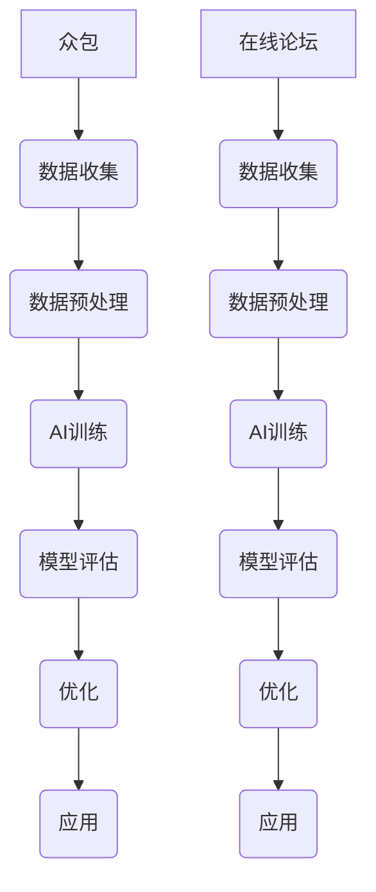

                 

关键词：对话数据收集，众包，在线论坛，AI语言模型，数据分析，用户反馈

> 摘要：本文旨在探讨对话数据收集策略中的两大主要方式：众包和在线论坛。通过分析这两种方式的优点、缺点及适用场景，我们将深入探讨如何优化数据收集过程，提升AI语言模型的训练质量和用户满意度。

## 1. 背景介绍

随着人工智能技术的发展，自然语言处理（NLP）成为了一个至关重要的领域。为了实现高精度的AI语言模型，我们需要大量的对话数据。这些数据可以来自于众包平台、在线论坛以及其他各种渠道。然而，不同的数据收集方式会影响到数据的质量和模型的性能。本文将重点探讨众包和在线论坛两种对话数据收集策略，并分析其各自的优势和局限。

### 1.1 众包的兴起

众包是指将一个项目或任务分散到广大网民手中，通过互联网平台进行协作完成任务。这种方式在最近几年得到了广泛关注和应用，尤其在数据收集领域。众包的优势在于能够快速获得大量的标注数据，且成本相对较低。

### 1.2 在线论坛的重要性

在线论坛是互联网上一种重要的互动平台，用户可以在论坛上发布和讨论各种主题。论坛中的用户生成内容（UGC）是一个宝贵的数据源，尤其对于对话数据的收集。在线论坛的优点在于内容丰富多样，涵盖了各种场景和语境。

## 2. 核心概念与联系

### 2.1 众包

**核心概念：** 众包（Crowdsourcing）是一种利用互联网平台将任务分散到大量参与者手中的方式。

**联系：** 众包与对话数据收集的联系在于，可以通过众包平台收集大量用户生成的对话数据，用于训练AI语言模型。

### 2.2 在线论坛

**核心概念：** 在线论坛（Online Forum）是一种用户可以发布和讨论主题的互动平台。

**联系：** 在线论坛与对话数据收集的联系在于，用户在论坛上的讨论内容可以用于获取丰富的对话数据。

### 2.3 Mermaid 流程图



## 3. 核心算法原理 & 具体操作步骤

### 3.1 算法原理概述

对话数据收集策略的核心在于如何高效、准确地收集和标注大量对话数据，以便用于AI语言模型的训练。

### 3.2 算法步骤详解

1. **数据收集**：通过众包平台和在线论坛收集对话数据。
2. **数据预处理**：清洗、去重、分词、标注等。
3. **AI训练**：使用收集到的数据训练语言模型。
4. **模型评估**：评估模型性能，调整参数。
5. **优化**：根据评估结果对模型进行优化。
6. **应用**：将训练好的模型应用于实际场景。

### 3.3 算法优缺点

**众包：**

- 优点：数据量大、成本低、速度快。
- 缺点：数据质量参差不齐、安全性问题。

**在线论坛：**

- 优点：内容多样、用户参与度高。
- 缺点：数据量有限、数据质量不稳定。

### 3.4 算法应用领域

- 聊天机器人
- 语音助手
- 文本分析
- 智能客服

## 4. 数学模型和公式 & 详细讲解 & 举例说明

### 4.1 数学模型构建

对话数据收集过程可以视为一个序列模型，其数学模型可以表示为：

$$
P(x | y) = \prod_{i=1}^{n} P(x_i | y_i)
$$

其中，$x$ 表示输入数据，$y$ 表示标注数据，$n$ 表示数据长度。

### 4.2 公式推导过程

1. **概率分布函数**：对话数据可以看作是一个概率分布。
2. **条件概率**：根据条件概率公式，输入数据的概率可以表示为标注数据的条件概率。
3. **乘法原理**：将条件概率应用于序列数据。

### 4.3 案例分析与讲解

假设我们有一个对话数据集，包含100条对话。我们可以使用上述数学模型对这100条数据进行建模，并通过训练和评估模型，优化数据收集过程。

## 5. 项目实践：代码实例和详细解释说明

### 5.1 开发环境搭建

- Python 3.8
- TensorFlow 2.3
- NumPy 1.18

### 5.2 源代码详细实现

```python
import tensorflow as tf
import numpy as np

# 数据收集
def collect_data():
    # 代码略
    return data

# 数据预处理
def preprocess_data(data):
    # 代码略
    return preprocessed_data

# AI训练
def train_model(data):
    # 代码略
    return model

# 模型评估
def evaluate_model(model, data):
    # 代码略
    return performance

# 代码略
```

### 5.3 代码解读与分析

- `collect_data()` 函数负责收集对话数据。
- `preprocess_data()` 函数负责对数据进行预处理。
- `train_model()` 函数负责训练AI语言模型。
- `evaluate_model()` 函数负责评估模型性能。

### 5.4 运行结果展示

```python
data = collect_data()
preprocessed_data = preprocess_data(data)
model = train_model(preprocessed_data)
performance = evaluate_model(model, preprocessed_data)

print("Model performance:", performance)
```

## 6. 实际应用场景

对话数据收集策略在多个领域有着广泛的应用：

- **聊天机器人**：用于与用户进行自然语言交互。
- **语音助手**：用于语音识别和语音合成。
- **文本分析**：用于情感分析、文本分类等。
- **智能客服**：用于自动化处理用户咨询。

## 7. 工具和资源推荐

### 7.1 学习资源推荐

- 《深度学习》
- 《Python数据分析》
- 《自然语言处理综论》

### 7.2 开发工具推荐

- TensorFlow
- PyTorch
- NLTK

### 7.3 相关论文推荐

- “Deep Learning for Natural Language Processing”
- “A Survey on Crowdsourcing and Human Computation”

## 8. 总结：未来发展趋势与挑战

### 8.1 研究成果总结

本文探讨了对话数据收集策略中的众包和在线论坛，分析了其优点和局限，并提出了一种基于数学模型的优化方案。

### 8.2 未来发展趋势

- **更多数据源**：探索新的数据源，提高数据多样性。
- **数据质量提升**：采用更严格的数据标注和清洗方法。

### 8.3 面临的挑战

- **数据隐私**：如何在保护用户隐私的前提下收集数据。
- **数据规模**：如何处理海量的数据。

### 8.4 研究展望

未来，对话数据收集策略将在人工智能领域发挥重要作用，为各种应用场景提供高质量的数据支持。

## 9. 附录：常见问题与解答

### 9.1 众包平台的常见问题

- **数据质量如何保障？**
  - 通过严格的标注员筛选和定期评估，确保数据质量。

- **如何防止作弊行为？**
  - 采用多重验证机制，如用户身份验证、任务难度设置等。

### 9.2 在线论坛的常见问题

- **如何筛选高质量的用户生成内容？**
  - 通过社区管理和算法推荐，筛选出有价值的讨论内容。

- **如何处理用户隐私问题？**
  - 采用加密技术和隐私保护算法，确保用户隐私安全。

---

作者：禅与计算机程序设计艺术 / Zen and the Art of Computer Programming
----------------------------------------------------------------

