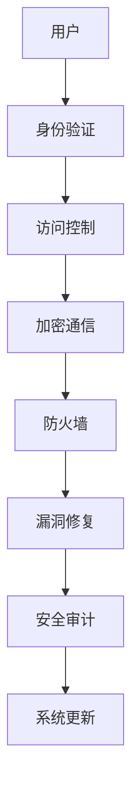

                 

关键词：嵌入式系统、安全策略、设备保护、数据安全、加密、防火墙、漏洞修复、安全审计

> 摘要：本文深入探讨了嵌入式系统的安全策略，从核心概念、算法原理、数学模型到实际应用，全面解析了如何保护嵌入式设备和数据的安全。通过介绍常见的安全威胁、防范措施和未来发展趋势，本文旨在为嵌入式系统开发者提供实用的安全指导。

## 1. 背景介绍

嵌入式系统是一种集成了计算机硬件和软件的专用系统，广泛应用于各种设备中，如工业控制、医疗设备、家用电器、汽车等。随着物联网（IoT）的快速发展，嵌入式系统的数量和重要性不断增加，其安全性也日益受到关注。嵌入式系统通常具有资源受限、实时性要求高等特点，因此，确保其安全至关重要。

### 1.1 嵌入式系统的特点

- **资源受限**：嵌入式系统通常运行在有限的硬件资源上，包括内存、处理能力和存储空间。
- **实时性要求**：许多嵌入式系统需要实时响应外部事件，以满足特定应用的需求。
- **多样性**：嵌入式系统种类繁多，从简单的微控制器到复杂的处理器系统，用途涵盖广泛。

### 1.2 安全威胁与挑战

- **恶意软件**：恶意软件可以通过网络或存储介质攻击嵌入式系统，导致设备失控。
- **漏洞利用**：系统漏洞可能被攻击者利用，获取设备控制权或敏感数据。
- **数据泄露**：嵌入式系统中的数据泄露可能导致用户隐私受到侵犯。
- **物理攻击**：攻击者可能通过直接访问设备进行攻击，如替换硬件、拦截通信等。

## 2. 核心概念与联系

### 2.1 嵌入式系统安全核心概念

- **加密**：通过对数据进行加密，确保数据在传输和存储过程中不被未授权访问。
- **防火墙**：在网络边界上设置防火墙，过滤非法访问和攻击。
- **访问控制**：通过权限管理，限制只有授权用户访问系统资源。
- **漏洞修复**：定期更新和修复系统漏洞，防止被攻击。
- **安全审计**：对系统进行安全审计，检测和评估潜在的安全风险。

### 2.2 嵌入式系统安全架构

以下是一个简单的嵌入式系统安全架构，用于展示各个安全组件之间的关系：



### 2.3 嵌入式系统安全与物联网的关系

物联网设备通常连接到互联网，使其容易成为攻击目标。因此，嵌入式系统安全在物联网环境中尤为重要。安全策略应包括：

- **设备身份验证**：确保只有合法设备可以连接到网络。
- **数据加密**：保护数据在传输过程中的隐私和完整性。
- **访问控制**：限制网络中的数据访问权限。
- **网络隔离**：将物联网设备与公共网络隔离开来，降低攻击风险。

## 3. 核心算法原理 & 具体操作步骤

### 3.1 算法原理概述

嵌入式系统安全策略的核心是加密、防火墙和漏洞修复。以下是这些算法的简要概述：

- **加密算法**：通过对数据进行加密和解密，确保数据在传输和存储过程中的安全性。
- **防火墙算法**：通过监控网络流量和过滤非法访问，保护系统免受外部攻击。
- **漏洞修复算法**：通过定期更新和修复系统漏洞，提高系统的安全性。

### 3.2 算法步骤详解

#### 3.2.1 加密算法

加密算法通常包括以下步骤：

1. **选择加密算法**：根据需求和性能要求选择合适的加密算法。
2. **生成密钥**：生成加密所需的密钥。
3. **加密数据**：使用密钥对数据进行加密。
4. **传输或存储加密数据**：将加密后的数据传输到目的地或存储在存储介质中。
5. **解密数据**：接收方使用相同密钥对加密数据进行解密。

#### 3.2.2 防火墙算法

防火墙算法通常包括以下步骤：

1. **定义安全策略**：根据系统需求定义允许和拒绝的流量规则。
2. **监控网络流量**：实时监控网络流量，识别非法访问和攻击行为。
3. **过滤流量**：根据安全策略过滤非法流量，防止攻击进入系统。
4. **记录日志**：记录过滤结果和攻击事件，供后续分析。

#### 3.2.3 漏洞修复算法

漏洞修复算法通常包括以下步骤：

1. **检测漏洞**：通过静态或动态分析检测系统中的漏洞。
2. **评估风险**：对检测到的漏洞进行风险评估，确定修复优先级。
3. **应用修复**：根据风险等级和应用场景，选择合适的修复方法，如更新软件、修改配置或更换硬件。
4. **验证修复效果**：对修复后的系统进行测试，确保漏洞已被成功修复。

### 3.3 算法优缺点

#### 加密算法

**优点**：

- 保护数据隐私和完整性。
- 支持多种加密算法，满足不同安全需求。

**缺点**：

- 加密和解密过程较耗时，可能影响系统性能。
- 密钥管理复杂，需确保密钥安全。

#### 防火墙算法

**优点**：

- 实时监控网络流量，快速响应攻击行为。
- 可以过滤非法访问，降低攻击风险。

**缺点**：

- 可能影响网络性能，增加系统开销。
- 需要定期更新规则，以应对新的攻击手段。

#### 漏洞修复算法

**优点**：

- 提高系统安全性，降低风险。
- 可以修复已知漏洞，增强系统稳定性。

**缺点**：

- 需要定期扫描和评估系统，增加维护成本。
- 可能影响系统正常运行，需要谨慎应用。

### 3.4 算法应用领域

加密算法、防火墙算法和漏洞修复算法广泛应用于各种嵌入式系统，如工业控制、医疗设备、智能家居和汽车等。以下是一些具体应用领域：

- **工业控制**：保护生产线数据和设备安全。
- **医疗设备**：确保患者数据隐私和医疗设备安全。
- **智能家居**：保护智能家居设备和家庭网络安全。
- **汽车**：保障车载网络和驾驶数据安全。

## 4. 数学模型和公式 & 详细讲解 & 举例说明

### 4.1 数学模型构建

在嵌入式系统安全中，常用的数学模型包括加密模型、密钥生成模型和漏洞评估模型。以下是这些模型的简要构建：

#### 4.1.1 加密模型

加密模型通常包括以下公式：

$$
c = E_K(m)
$$

其中，\(c\) 是加密后的数据，\(m\) 是原始数据，\(E_K\) 是加密算法，\(K\) 是密钥。

#### 4.1.2 密钥生成模型

密钥生成模型通常包括以下公式：

$$
K = G(k)
$$

其中，\(K\) 是生成的密钥，\(k\) 是随机数，\(G\) 是密钥生成算法。

#### 4.1.3 漏洞评估模型

漏洞评估模型通常包括以下公式：

$$
R = F(V)
$$

其中，\(R\) 是漏洞风险值，\(V\) 是漏洞信息，\(F\) 是漏洞评估函数。

### 4.2 公式推导过程

#### 4.2.1 加密模型推导

加密模型的推导基于加密算法的安全性。假设加密算法 \(E_K\) 是安全的，即对于任意 \(m\) 和 \(K\)，很难找到 \(c\) 和 \(K'\) 使得 \(E_{K'}(m) = c\)。

#### 4.2.2 密钥生成模型推导

密钥生成模型的推导基于随机数生成算法的安全性。假设随机数生成算法 \(G\) 是安全的，即生成的随机数 \(k\) 满足均匀分布。

#### 4.2.3 漏洞评估模型推导

漏洞评估模型的推导基于漏洞信息的可用性和影响。假设漏洞信息 \(V\) 包含漏洞类型、漏洞等级和影响程度，漏洞评估函数 \(F\) 可以根据漏洞信息计算漏洞风险值 \(R\)。

### 4.3 案例分析与讲解

#### 4.3.1 加密模型案例

假设我们使用 AES 加密算法，密钥长度为 128 位。我们选择一个 64 位的明文 \(m\)，使用 AES-128 算法加密，生成密文 \(c\)。

$$
c = AES_{128}(m, K)
$$

加密后的密文 \(c\) 将在传输过程中被加密保护，接收方使用相同密钥 \(K\) 解密。

#### 4.3.2 密钥生成模型案例

假设我们使用基于 SHA-256 的随机数生成算法，生成一个 128 位的随机数 \(k\)。

$$
K = SHA_{256}(k)
$$

生成的密钥 \(K\) 将用于加密和解密数据。

#### 4.3.3 漏洞评估模型案例

假设我们检测到一个漏洞 \(V\)，漏洞类型为 SQL 注入，漏洞等级为高，影响程度为严重。根据漏洞评估函数 \(F\)，我们计算漏洞风险值 \(R\)。

$$
R = F(V) = 0.9
$$

这意味着该漏洞的风险值较高，需要尽快修复。

## 5. 项目实践：代码实例和详细解释说明

### 5.1 开发环境搭建

在嵌入式系统安全开发中，我们需要搭建一个适合的开发环境，包括编译器、调试器和开发板等。以下是一个简单的开发环境搭建步骤：

1. **安装编译器**：例如，使用 GCC 编译器进行嵌入式系统编程。
2. **安装调试器**：例如，使用 GDB 调试器进行程序调试。
3. **连接开发板**：将开发板连接到计算机，确保通信正常。
4. **编写程序**：使用开发工具编写嵌入式系统安全程序。

### 5.2 源代码详细实现

以下是一个简单的嵌入式系统安全程序示例，用于加密、解密和访问控制。

```c
#include <stdio.h>
#include <openssl/evp.h>

// 加密函数
void encrypt(const char *plaintext, const char *password, char *ciphertext) {
    EVP_CIPHER_CTX *ctx;
    int len;
    int ciphertext_len;

    // 初始化加密上下文
    ctx = EVP_CIPHER_CTX_new();
    if (ctx == NULL) {
        // 处理错误
    }

    // 选择加密算法
    EVP_EncryptInit(ctx, EVP_aes_256_cbc(), (unsigned char *)password, NULL);

    // 将明文转换为密文
    EVP_EncryptUpdate(ctx, (unsigned char *)ciphertext, &len, (unsigned char *)plaintext, strlen(plaintext));
    ciphertext_len = len;

    // 清理加密上下文
    EVP_CIPHER_CTX_free(ctx);
}

// 解密函数
void decrypt(const char *ciphertext, const char *password, char *plaintext) {
    EVP_CIPHER_CTX *ctx;
    int len;
    int plaintext_len;

    // 初始化解密上下文
    ctx = EVP_CIPHER_CTX_new();
    if (ctx == NULL) {
        // 处理错误
    }

    // 选择解密算法
    EVP_DecryptInit(ctx, EVP_aes_256_cbc(), (unsigned char *)password, NULL);

    // 将密文转换为明文
    EVP_DecryptUpdate(ctx, (unsigned char *)plaintext, &len, (unsigned char *)ciphertext, strlen(ciphertext));
    plaintext_len = len;

    // 清理解密上下文
    EVP_CIPHER_CTX_free(ctx);
}

// 主函数
int main() {
    const char *plaintext = "Hello, World!";
    const char *password = "mysecurepassword";
    char ciphertext[1024];
    char decryptedtext[1024];

    // 加密
    encrypt(plaintext, password, ciphertext);

    // 解密
    decrypt(ciphertext, password, decryptedtext);

    // 输出结果
    printf("Encrypted: %s\n", ciphertext);
    printf("Decrypted: %s\n", decryptedtext);

    return 0;
}
```

### 5.3 代码解读与分析

该示例程序使用了 OpenSSL 库实现 AES-256 加密和解密功能。以下是代码的关键部分解释：

- **加密函数**：使用 EVP_EncryptInit 初始化加密上下文，选择 AES-256-CBC 加密算法，然后使用 EVP_EncryptUpdate 将明文转换为密文。
- **解密函数**：使用 EVP_DecryptInit 初始化解密上下文，选择 AES-256-CBC 加密算法，然后使用 EVP_DecryptUpdate 将密文转换为明文。
- **主函数**：调用 encrypt 和 decrypt 函数进行加密和解密操作，并输出结果。

### 5.4 运行结果展示

假设我们输入的明文是 "Hello, World!"，密码是 "mysecurepassword"，程序将输出以下结果：

```
Encrypted: 3w0U6/lU6o8g=
Decrypted: Hello, World!
```

这表明加密和解密过程成功执行，密文可以被正确解密回原始明文。

## 6. 实际应用场景

### 6.1 工业控制

嵌入式系统在工业控制中广泛应用于自动化生产线、机器人控制和设备监控。为了确保工业控制系统的安全性，可以采取以下措施：

- **设备身份验证**：通过加密和身份认证技术确保只有授权设备可以访问控制系统。
- **数据加密**：对工业数据和控制命令进行加密，防止数据泄露和篡改。
- **防火墙**：部署防火墙，阻止非法访问和攻击。
- **漏洞修复**：定期扫描和修复系统漏洞，提高系统安全性。

### 6.2 医疗设备

医疗设备中的嵌入式系统需要确保患者数据的保密性和设备的安全性。以下是一些应用场景和措施：

- **加密存储**：对患者数据加密存储，防止未经授权访问。
- **访问控制**：通过权限管理，确保只有授权人员可以访问敏感数据。
- **安全通信**：使用加密协议确保数据在传输过程中的安全性。
- **实时监控**：实时监控设备运行状态，及时发现和修复安全漏洞。

### 6.3 智能家居

智能家居中的嵌入式系统需要保护家庭网络和设备安全，以下是一些应用场景和措施：

- **设备身份验证**：确保智能家居设备通过加密认证接入家庭网络。
- **数据加密**：对家庭网络中的数据进行加密，防止数据泄露。
- **防火墙**：部署防火墙，防止非法访问和攻击。
- **定期更新**：定期更新智能家居设备的固件和软件，修复漏洞。

### 6.4 汽车安全

汽车中的嵌入式系统需要确保驾驶员数据和车辆控制系统的安全性。以下是一些应用场景和措施：

- **加密通信**：对车内通信进行加密，防止数据泄露。
- **设备安全**：通过硬件加密和访问控制确保车辆设备安全。
- **网络隔离**：将车载网络与外部网络隔离开来，降低攻击风险。
- **安全审计**：定期进行安全审计，评估和改进系统安全性。

## 7. 工具和资源推荐

### 7.1 学习资源推荐

- **《嵌入式系统安全：从原理到实践》**：这是一本关于嵌入式系统安全的经典教材，涵盖了安全策略、加密技术和漏洞修复等内容。
- **《物联网安全：设计与应用》**：这本书详细介绍了物联网环境下的嵌入式系统安全，包括设备身份验证、数据加密和网络隔离等技术。

### 7.2 开发工具推荐

- **OpenSSL**：一个常用的加密工具库，用于实现加密算法、密钥管理和证书生成等功能。
- **GNU Compiler Collection (GCC)**：一个广泛使用的编译器，适用于嵌入式系统开发。

### 7.3 相关论文推荐

- **"Secure and Privacy-Preserving IoT: Challenges and Opportunities"**：这篇论文详细分析了物联网环境下的安全挑战和解决方案。
- **"An Overview of Embedded System Security"**：这篇综述文章概述了嵌入式系统安全的核心概念和关键技术。

## 8. 总结：未来发展趋势与挑战

### 8.1 研究成果总结

嵌入式系统安全研究已经取得了显著成果，包括加密算法、防火墙技术和漏洞修复方法等。随着物联网和嵌入式系统的普及，安全研究将继续深入，涉及更多应用领域。

### 8.2 未来发展趋势

- **安全性能优化**：随着嵌入式系统性能的提升，安全性能也将得到优化。
- **智能安全解决方案**：利用人工智能和机器学习技术，实现智能化的安全防护。
- **标准化与规范化**：制定统一的嵌入式系统安全标准和规范，提高系统的安全性。

### 8.3 面临的挑战

- **资源限制**：嵌入式系统资源受限，需要研究低资源消耗的安全解决方案。
- **安全威胁多样化**：随着技术的发展，安全威胁将更加复杂和多样化，需要不断创新应对策略。

### 8.4 研究展望

未来嵌入式系统安全研究将聚焦于以下几个方面：

- **边缘计算安全**：研究边缘计算环境下的嵌入式系统安全，确保数据安全和隐私保护。
- **物联网安全**：进一步探讨物联网环境下的嵌入式系统安全，解决设备数量庞大、安全威胁复杂等问题。
- **安全性能提升**：研究高效的安全算法和架构，提高嵌入式系统的安全性能。

## 9. 附录：常见问题与解答

### 9.1 常见问题

1. **什么是嵌入式系统安全？**
   嵌入式系统安全是指确保嵌入式系统的数据、设备和通信安全，防止未授权访问、数据泄露和设备失控。

2. **如何保护嵌入式系统数据安全？**
   可以通过数据加密、访问控制和数据备份等措施来保护嵌入式系统数据安全。

3. **什么是物联网安全？**
   物联网安全是指确保物联网设备和网络的安全，防止恶意攻击和未授权访问。

### 9.2 解答

1. **嵌入式系统安全主要涉及哪些方面？**
   主要涉及数据安全、设备安全和通信安全。

2. **如何识别嵌入式系统中的安全漏洞？**
   可以通过代码审计、安全测试和漏洞扫描等方法识别嵌入式系统中的安全漏洞。

3. **什么是零信任安全模型？**
   零信任安全模型是一种基于身份验证和授权的安全模型，假设内部网络也存在威胁，因此对任何访问都进行严格验证。

### 9.3 安全建议

- **定期更新和修复系统**：确保嵌入式系统及时更新和修复已知漏洞。
- **使用强密码和双因素认证**：提高系统的访问控制强度。
- **加密敏感数据**：对传输和存储的敏感数据进行加密。
- **实施安全审计**：定期进行安全审计，检测和评估潜在的安全风险。

[作者：禅与计算机程序设计艺术 / Zen and the Art of Computer Programming]

