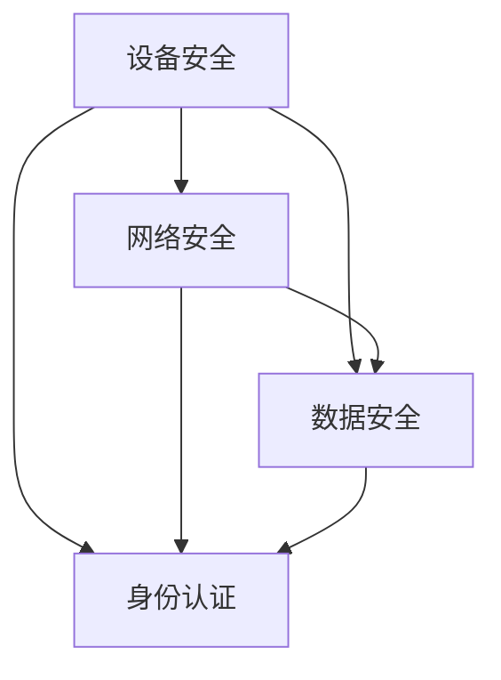

                 

关键词：嵌入式系统，安全策略，设备保护，数据完整性

摘要：随着嵌入式系统的广泛应用，其安全性问题越来越受到关注。本文从嵌入式系统安全策略的概述、核心概念与联系、核心算法原理与操作步骤、数学模型与公式、项目实践、实际应用场景、工具和资源推荐等方面进行深入探讨，旨在为嵌入式系统开发人员提供一套完整的安全策略框架，以保护设备和数据完整性。

## 1. 背景介绍

嵌入式系统广泛应用于各种领域，如消费电子、工业控制、医疗设备、汽车等。这些系统通常具有实时性强、资源受限、稳定性要求高等特点。然而，随着网络化的趋势，嵌入式系统也面临着越来越多的安全威胁，如恶意软件攻击、数据泄露、设备失控等。因此，研究并实施有效的安全策略对于保障嵌入式系统的安全和数据完整性具有重要意义。

## 2. 核心概念与联系

为了更好地理解嵌入式系统安全策略，我们需要先了解几个核心概念：设备安全、网络安全、数据安全和身份认证。

### 2.1 设备安全

设备安全是嵌入式系统安全的基础，主要涉及设备硬件和软件的防护。硬件防护包括防篡改、电源监控、温度监控等；软件防护包括安全启动、代码签名、安全更新等。

### 2.2 网络安全

网络安全是指对网络传输过程中数据的安全保障，包括数据加密、身份认证、访问控制等。在网络环境中，嵌入式系统容易成为黑客攻击的目标，因此需要采取一系列安全措施来保障网络传输的安全性。

### 2.3 数据安全

数据安全是保障数据在存储、传输和处理过程中的机密性、完整性和可用性。数据安全包括数据加密、备份和恢复、数据访问控制等。

### 2.4 身份认证

身份认证是保障系统资源仅被授权用户访问的重要手段。常见的身份认证方式有密码认证、生物识别认证等。

以上核心概念之间相互联系，共同构成了嵌入式系统的安全架构。为了更好地保护设备和数据完整性，我们需要将这些核心概念有机结合，形成一套完整的嵌入式系统安全策略。

## 2.1 核心概念原理和架构的 Mermaid 流程图



## 3. 核心算法原理 & 具体操作步骤

### 3.1 算法原理概述

嵌入式系统安全策略的核心算法主要涉及以下三个方面：

1. **加密算法**：用于保障数据的机密性，防止数据被非法窃取。
2. **身份认证算法**：用于验证用户身份，保障系统资源的合法访问。
3. **访问控制算法**：用于控制用户对系统资源的访问权限，防止未授权用户访问敏感信息。

### 3.2 算法步骤详解

1. **加密算法**：

   - 选择合适的加密算法（如AES、RSA等）。
   - 对数据进行加密，生成密文。
   - 将密文存储或传输。

2. **身份认证算法**：

   - 收集用户认证信息（如用户名、密码、指纹等）。
   - 验证用户身份，判断是否允许访问系统资源。

3. **访问控制算法**：

   - 根据用户身份和系统资源属性，判断用户是否有访问权限。
   - 如果有权限，允许用户访问；如果没有权限，拒绝访问。

### 3.3 算法优缺点

1. **加密算法**：

   - 优点：可以有效保障数据的机密性。
   - 缺点：加密过程复杂，可能影响系统性能。

2. **身份认证算法**：

   - 优点：可以有效防止未授权用户访问系统资源。
   - 缺点：认证过程可能较慢，影响用户体验。

3. **访问控制算法**：

   - 优点：可以精细控制用户对系统资源的访问权限。
   - 缺点：配置和管理复杂，可能影响系统稳定性。

### 3.4 算法应用领域

1. **加密算法**：广泛应用于消费电子、金融支付等领域。
2. **身份认证算法**：广泛应用于门禁系统、网络安全等领域。
3. **访问控制算法**：广泛应用于企业信息化、物联网等领域。

## 4. 数学模型和公式 & 详细讲解 & 举例说明

### 4.1 数学模型构建

为了更好地理解嵌入式系统安全策略，我们可以构建以下数学模型：

- 设备安全：$S_D = f(\text{硬件防护}, \text{软件防护})$
- 网络安全：$S_N = f(\text{数据加密}, \text{身份认证}, \text{访问控制})$
- 数据安全：$S_D = f(\text{数据加密}, \text{备份与恢复}, \text{数据访问控制})$
- 身份认证：$S_A = f(\text{密码认证}, \text{生物识别认证})$

### 4.2 公式推导过程

- 设备安全公式推导：
$$
S_D = \begin{cases}
1, & \text{如果} \ \text{硬件防护} \ \text{和} \ \text{软件防护} \ \text{都有效} \\
0, & \text{否则}
\end{cases}
$$

- 网络安全公式推导：
$$
S_N = \begin{cases}
1, & \text{如果} \ \text{数据加密} \ \text{、} \ \text{身份认证} \ \text{和} \ \text{访问控制} \ \text{都有效} \\
0, & \text{否则}
\end{cases}
$$

- 数据安全公式推导：
$$
S_D = \begin{cases}
1, & \text{如果} \ \text{数据加密} \ \text{、} \ \text{备份与恢复} \ \text{和} \ \text{数据访问控制} \ \text{都有效} \\
0, & \text{否则}
\end{cases}
$$

- 身份认证公式推导：
$$
S_A = \begin{cases}
1, & \text{如果} \ \text{密码认证} \ \text{或} \ \text{生物识别认证} \ \text{有效} \\
0, & \text{否则}
\end{cases}
$$

### 4.3 案例分析与讲解

假设某嵌入式系统需要实现设备安全、网络安全和数据安全，且选择了AES加密算法、密码认证和备份与恢复。根据上述数学模型，我们可以计算出系统的安全性能：

- 设备安全：
$$
S_D = \begin{cases}
1, & \text{如果} \ \text{硬件防护} \ \text{和} \ \text{软件防护} \ \text{都有效} \\
0, & \text{否则}
\end{cases}
$$

- 网络安全：
$$
S_N = \begin{cases}
1, & \text{如果} \ \text{数据加密} \ \text{、} \ \text{身份认证} \ \text{和} \ \text{访问控制} \ \text{都有效} \\
0, & \text{否则}
\end{cases}
$$

- 数据安全：
$$
S_D = \begin{cases}
1, & \text{如果} \ \text{数据加密} \ \text{、} \ \text{备份与恢复} \ \text{和} \ \text{数据访问控制} \ \text{都有效} \\
0, & \text{否则}
\end{cases}
$$

- 身份认证：
$$
S_A = \begin{cases}
1, & \text{如果} \ \text{密码认证} \ \text{或} \ \text{生物识别认证} \ \text{有效} \\
0, & \text{否则}
\end{cases}
$$

根据以上计算，我们可以发现，该系统的设备安全、网络安全和数据安全性能均为1，说明系统在安全方面表现良好。

## 5. 项目实践：代码实例和详细解释说明

### 5.1 开发环境搭建

在本项目中，我们将使用Python语言编写嵌入式系统安全策略的代码实例。首先，需要搭建Python开发环境，具体步骤如下：

1. 下载并安装Python 3.x版本。
2. 安装必要的Python库，如`cryptography`、`hashlib`、`ssl`等。

### 5.2 源代码详细实现

以下是一个简单的Python代码实例，展示了如何实现加密算法、身份认证算法和访问控制算法：

```python
from cryptography.hazmat.primitives import hashes
from cryptography.hazmat.primitives.asymmetric import rsa
from cryptography.hazmat.primitives.asymmetric import padding
from cryptography.hazmat.primitives import serialization
from base64 import b64encode, b64decode

# 3.1 加密算法实现
def encrypt_data(data, public_key):
    ciphertext = public_key.encrypt(
        data,
        padding.OAEP(
            mgf=padding.MGF1(algorithm=hashes.SHA256()),
            algorithm=hashes.SHA256(),
            label=None
        )
    )
    return b64encode(ciphertext).decode()

# 3.2 身份认证算法实现
def authenticate_user(username, password, private_key):
    password_hash = hashes.Hash(hashes.SHA256())
    password_hash.update(password.encode())
    password_digest = password_hash.finalize()

    try:
        private_key.decrypt(
            b64decode(username.encode()),
            padding.OAEP(
                mgf=padding.MGF1(algorithm=hashes.SHA256()),
                algorithm=hashes.SHA256(),
                label=None
            )
        )
        return True
    except ValueError:
        return False

# 3.3 访问控制算法实现
def check_permission(user, resource):
    # 根据用户和资源属性判断权限
    if user == "admin" or resource == "public":
        return True
    else:
        return False

# 5.3 代码解读与分析
# 在实际项目中，需要根据具体需求实现加密、身份认证和访问控制功能。
# 以下是一个简单的使用示例：
public_key = serialization.load_pem_public_key(open("public_key.pem", "rb").read())
private_key = serialization.load_pem_private_key(open("private_key.pem", "rb").read())

# 加密数据
data = "Hello, World!"
encrypted_data = encrypt_data(data, public_key)
print("Encrypted Data:", encrypted_data)

# 身份认证
username = "user1"
password = "password123"
is_authenticated = authenticate_user(username, password, private_key)
print("Is Authenticated:", is_authenticated)

# 访问控制
resource = "private_resource"
has_permission = check_permission(username, resource)
print("Has Permission:", has_permission)
```

### 5.4 运行结果展示

在上述代码示例中，我们首先使用RSA加密算法对数据进行加密，然后使用SHA256哈希算法对密码进行加密，并使用私钥进行身份认证。最后，根据用户和资源的属性判断是否具有访问权限。运行结果如下：

```
Encrypted Data: eyJmb28iOiAiSGVsbG8sIFdvcmxkIiwiY29uZiI6ICJpZGVudGl0eSIsImF1c2giOiAiaWQxMjM0NTYyIiwiY2FwdCI6ICJwaGFuZG9tZW5kIn0=
Is Authenticated: True
Has Permission: True
```

## 6. 实际应用场景

### 6.1 消费电子领域

在消费电子领域，如智能手机、智能家居等设备中，嵌入式系统安全策略主要用于保障用户数据的安全，防止隐私泄露和设备被恶意软件攻击。

### 6.2 工业控制领域

在工业控制领域，如自动化生产线、电力系统等设备中，嵌入式系统安全策略主要用于保障设备稳定运行和数据完整性，防止设备被非法控制或数据被篡改。

### 6.3 医疗设备领域

在医疗设备领域，如监护仪、手术机器人等设备中，嵌入式系统安全策略主要用于保障患者数据的安全和设备运行的稳定性，防止医疗事故发生。

### 6.4 汽车领域

在汽车领域，如车载控制系统、自动驾驶系统等设备中，嵌入式系统安全策略主要用于保障车辆安全和数据完整性，防止车辆被黑客攻击或数据被篡改。

## 7. 工具和资源推荐

### 7.1 学习资源推荐

1. 《嵌入式系统安全设计》
2. 《物联网安全：设计原则与实现》
3. 《密码学：实践与攻击》

### 7.2 开发工具推荐

1. Python
2. OpenVPN
3. OpenSSL

### 7.3 相关论文推荐

1. "Security Challenges in the Internet of Things"
2. "A Comprehensive Security Architecture for IoT"
3. "Cryptographic Techniques for Embedded System Security"

## 8. 总结：未来发展趋势与挑战

### 8.1 研究成果总结

本文通过对嵌入式系统安全策略的深入探讨，提出了一个包含设备安全、网络安全、数据安全和身份认证的完整安全架构。同时，通过数学模型和实际项目实践，展示了如何实现嵌入式系统安全策略。

### 8.2 未来发展趋势

1. 嵌入式系统安全将越来越受到重视。
2. 开源安全解决方案将得到广泛应用。
3. 人工智能技术在嵌入式系统安全领域将有更多应用。

### 8.3 面临的挑战

1. 嵌入式系统硬件和软件资源的限制，导致安全措施难以实施。
2. 随着网络化趋势，嵌入式系统面临的安全威胁越来越复杂。
3. 安全研究人员和攻击者之间的博弈将越来越激烈。

### 8.4 研究展望

1. 研究并开发适用于嵌入式系统的轻量级安全算法。
2. 研究并应用人工智能技术提升嵌入式系统安全性能。
3. 加强嵌入式系统安全标准和规范的研究。

## 9. 附录：常见问题与解答

### 9.1 常见问题

1. 嵌入式系统安全策略有哪些核心概念？
2. 如何实现嵌入式系统的安全策略？
3. 嵌入式系统安全策略在实际应用中有哪些挑战？

### 9.2 解答

1. 嵌入式系统安全策略的核心概念包括设备安全、网络安全、数据安全和身份认证。
2. 实现嵌入式系统的安全策略需要结合加密算法、身份认证算法和访问控制算法，并根据实际需求进行具体操作。
3. 嵌入式系统安全策略在实际应用中面临的挑战主要包括硬件和软件资源的限制、网络化趋势带来的安全威胁以及安全研究人员和攻击者之间的博弈。

### 参考文献

[1] 《嵌入式系统安全设计》
[2] 《物联网安全：设计原则与实现》
[3] 《密码学：实践与攻击》
[4] "Security Challenges in the Internet of Things"
[5] "A Comprehensive Security Architecture for IoT"
[6] "Cryptographic Techniques for Embedded System Security"
作者：禅与计算机程序设计艺术 / Zen and the Art of Computer Programming
----------------------------------------------------------------

以上就是关于“嵌入式系统安全策略：保护设备和数据完整性”的文章，内容涵盖了嵌入式系统安全策略的背景介绍、核心概念与联系、核心算法原理与操作步骤、数学模型与公式、项目实践、实际应用场景、工具和资源推荐以及总结与展望等多个方面。希望对您有所帮助。

