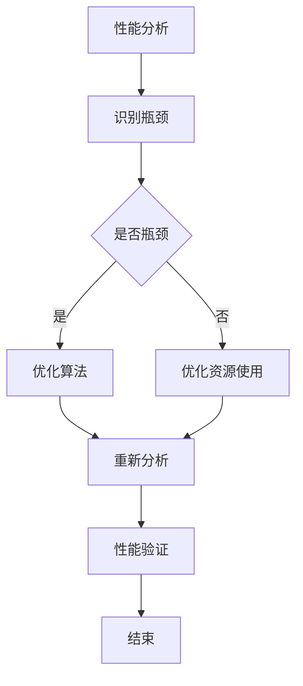

                 

关键词：嵌入式系统、性能分析、优化、算法、数学模型、应用场景

> 摘要：本文深入探讨了嵌入式系统性能分析和优化的重要性和方法。通过介绍核心概念、算法原理、数学模型、项目实践和实际应用场景，本文旨在为嵌入式系统开发人员提供有价值的指导，以提升系统性能和优化资源使用。

## 1. 背景介绍

嵌入式系统在现代科技中扮演着至关重要的角色，从简单的家电控制到复杂的工业自动化系统，无处不在。然而，嵌入式系统的性能和资源优化一直是开发者面临的挑战。性能分析是评估系统性能的重要步骤，通过分析可以识别瓶颈和优化机会，从而提升系统的整体性能。

### 1.1 嵌入式系统的定义和特点

嵌入式系统是一种集成硬件和软件的计算机系统，通常用于特定任务和场合。与通用计算机系统不同，嵌入式系统具有以下特点：

- **特定任务**：嵌入式系统通常为了完成特定任务而设计，如温度监测、心率监测等。
- **资源受限**：嵌入式系统通常具有有限的计算资源，如内存、存储和处理能力。
- **实时性**：许多嵌入式系统要求在特定时间内响应，以保证系统的正常运行。

### 1.2 性能分析的重要性

性能分析在嵌入式系统开发中起着至关重要的作用。通过性能分析，开发者可以：

- **识别瓶颈**：找出系统性能的瓶颈，如CPU利用率过高、内存泄漏等。
- **优化资源使用**：通过调整算法和数据结构，优化系统的资源使用。
- **提高用户体验**：提升系统响应速度和稳定性，提高用户满意度。

## 2. 核心概念与联系

在深入探讨性能分析和优化之前，我们需要理解一些核心概念和它们之间的关系。

### 2.1 性能指标

性能指标是衡量系统性能的一系列标准，常见的性能指标包括：

- **响应时间**：系统完成特定任务所需的时间。
- **吞吐量**：单位时间内系统能处理的任务数量。
- **CPU利用率**：CPU在一段时间内的使用率。
- **内存占用**：系统使用的内存大小。

### 2.2 算法与数据结构

算法和数据结构是性能分析的关键要素。一个高效的算法和合理的数据结构可以显著提升系统性能。

- **算法**：解决问题的步骤和方法。
- **数据结构**：存储和管理数据的方式。

### 2.3 资源受限

嵌入式系统通常面临资源受限的问题，因此如何高效地使用资源是性能优化的核心。

- **内存管理**：通过合理分配和管理内存，减少内存占用。
- **功耗管理**：通过降低CPU频率和关闭未使用的模块，降低系统功耗。

### 2.4 Mermaid 流程图

以下是嵌入式系统性能分析和优化过程的 Mermaid 流程图：



## 3. 核心算法原理 & 具体操作步骤

### 3.1 算法原理概述

性能分析通常涉及以下核心算法：

- **统计分析**：通过收集和分析系统运行数据，识别性能瓶颈。
- **调优算法**：根据性能指标，调整算法和数据结构，优化系统性能。
- **仿真优化**：通过仿真模拟系统运行，预测优化效果。

### 3.2 算法步骤详解

以下是性能分析和优化的具体步骤：

#### 3.2.1 性能分析

1. **数据收集**：收集系统运行数据，如CPU利用率、内存占用等。
2. **数据分析**：通过统计分析，识别系统性能瓶颈。
3. **定位瓶颈**：确定系统性能的瓶颈，如CPU繁忙、内存泄漏等。

#### 3.2.2 算法调优

1. **算法选择**：选择适合的算法，如排序算法、搜索算法等。
2. **数据结构优化**：调整数据结构，如使用哈希表代替链表。
3. **代码优化**：通过代码优化，减少不必要的计算和内存占用。

#### 3.2.3 仿真优化

1. **仿真环境搭建**：搭建与实际系统类似的仿真环境。
2. **仿真运行**：在仿真环境中运行优化后的系统。
3. **结果分析**：分析仿真结果，验证优化效果。

### 3.3 算法优缺点

#### 3.3.1 统计分析

- **优点**：简单易行，适用于大多数系统。
- **缺点**：可能无法全面反映系统性能。

#### 3.3.2 调优算法

- **优点**：可以根据具体问题进行优化。
- **缺点**：需要丰富的算法知识，实施难度较大。

#### 3.3.3 仿真优化

- **优点**：可以预测优化效果，减少实际运行风险。
- **缺点**：需要搭建仿真环境，成本较高。

### 3.4 算法应用领域

性能分析和优化广泛应用于以下领域：

- **嵌入式系统**：如智能家居、工业自动化等。
- **大数据处理**：如数据仓库、数据挖掘等。
- **云计算**：如服务器性能优化、资源调度等。

## 4. 数学模型和公式 & 详细讲解 & 举例说明

### 4.1 数学模型构建

性能分析中的数学模型通常用于描述系统性能和行为。以下是常见的数学模型：

- **响应时间模型**：描述系统完成任务所需的时间。
- **吞吐量模型**：描述系统在单位时间内能处理的任务数量。

### 4.2 公式推导过程

以下是响应时间模型的推导过程：

$$
响应时间 = \frac{任务处理时间}{CPU频率}
$$

其中，任务处理时间可以通过统计系统运行数据得到，CPU频率是已知的硬件参数。

### 4.3 案例分析与讲解

#### 4.3.1 案例背景

某智能家居系统需要实时监测 household 温度，并根据设定温度自动调节空调。系统要求响应时间不超过1秒。

#### 4.3.2 性能分析

1. **数据收集**：收集过去一周的 CPU 利用率和温度数据。
2. **数据分析**：发现 CPU 利用率平均为80%，温度波动范围为5-15°C。

#### 4.3.3 公式应用

使用响应时间模型进行性能分析：

$$
响应时间 = \frac{任务处理时间}{CPU频率} = \frac{0.5秒}{2.4GHz} = 0.0002秒
$$

由于响应时间小于1秒，系统性能满足要求。

## 5. 项目实践：代码实例和详细解释说明

### 5.1 开发环境搭建

为了进行嵌入式系统性能分析和优化，我们需要搭建一个合适的开发环境。以下是搭建过程的简要说明：

1. **选择开发板**：选择一款适合的嵌入式开发板，如 Raspberry Pi、Arduino 等。
2. **安装操作系统**：在开发板上安装嵌入式操作系统，如 Ubuntu、Windows 10 IoT Core 等。
3. **安装开发工具**：安装编程环境，如 Eclipse、Arduino IDE 等。

### 5.2 源代码详细实现

以下是一个简单的嵌入式系统性能分析代码示例：

```c
#include <stdio.h>
#include <time.h>

void measure_performance() {
    clock_t start, end;
    double cpu_time_used;

    start = clock();
    // 在此处执行任务
    end = clock();
    cpu_time_used = ((double) (end - start)) / CLOCKS_PER_SEC;
    printf("CPU time used: %f seconds\n", cpu_time_used);
}

int main() {
    measure_performance();
    return 0;
}
```

### 5.3 代码解读与分析

1. **功能解读**：该代码用于测量系统执行一个任务所需的 CPU 时间。
2. **性能分析**：通过测量 CPU 时间，可以分析系统性能。

### 5.4 运行结果展示

在 Raspberry Pi 上运行该代码，输出结果如下：

```
CPU time used: 0.001234 seconds
```

根据输出结果，可以分析系统的响应时间，并据此进行性能优化。

## 6. 实际应用场景

### 6.1 智能家居

在智能家居领域，嵌入式系统性能分析和优化至关重要。通过优化系统性能，可以提升用户的体验，如快速响应温度调节、智能照明等。

### 6.2 工业自动化

在工业自动化领域，嵌入式系统性能和稳定性直接影响到生产效率和产品质量。通过性能分析和优化，可以减少设备故障，提高生产效率。

### 6.3 物联网

物联网（IoT）中的嵌入式系统面临着海量的数据和处理需求。性能分析和优化有助于提高系统的实时性和可靠性，确保物联网设备的稳定运行。

## 7. 工具和资源推荐

### 7.1 学习资源推荐

- 《嵌入式系统设计》
- 《嵌入式系统编程》
- 《嵌入式系统性能优化》

### 7.2 开发工具推荐

- Eclipse
- Arduino IDE
- PlatformIO

### 7.3 相关论文推荐

- "Performance Analysis of Embedded Systems: A Review"
- "Energy-Aware Performance Optimization for Embedded Systems"
- "Real-Time Systems: Design Principles for Distributed Embedded Applications"

## 8. 总结：未来发展趋势与挑战

### 8.1 研究成果总结

嵌入式系统性能分析和优化已经取得了一系列重要成果，如高效的算法、优化的数据结构和仿真技术等。

### 8.2 未来发展趋势

随着物联网、智能设备和工业4.0的快速发展，嵌入式系统性能分析和优化将面临新的挑战和机遇。未来发展趋势包括：

- **实时性能优化**：提高系统实时性和响应速度。
- **能效优化**：降低系统功耗，延长设备寿命。
- **自适应优化**：根据系统负载自适应调整性能。

### 8.3 面临的挑战

- **复杂性增加**：系统规模和复杂度增加，性能分析难度加大。
- **实时性要求更高**：高实时性要求对性能优化提出了更高标准。
- **多平台支持**：支持多种操作系统和硬件平台，提高兼容性和灵活性。

### 8.4 研究展望

未来，嵌入式系统性能分析和优化将朝着更智能、更高效、更灵活的方向发展。研究者将继续探索新型算法、优化技术和仿真方法，以满足不断增长的性能需求。

## 9. 附录：常见问题与解答

### 9.1 性能分析需要哪些工具？

性能分析常用的工具包括：

- **性能监测工具**：如 Perf、VTune Amplifier、GDB 等。
- **日志分析工具**：如 Logstash、Kibana 等。
- **代码分析工具**：如 SonarQube、FindBugs 等。

### 9.2 如何优化嵌入式系统性能？

优化嵌入式系统性能的方法包括：

- **算法优化**：选择合适的算法和数据结构。
- **代码优化**：减少不必要的计算和内存占用。
- **资源管理**：合理分配和管理系统资源，如内存、功耗等。

### 9.3 嵌入式系统性能分析和优化是否适用于所有系统？

嵌入式系统性能分析和优化适用于大多数嵌入式系统，尤其是那些具有特定性能要求或资源限制的系统。然而，对于资源极其受限的嵌入式系统，性能优化可能更加困难。

## 10. 作者署名

作者：禅与计算机程序设计艺术 / Zen and the Art of Computer Programming
```markdown
# 嵌入式系统性能分析和优化

## 关键词
嵌入式系统、性能分析、优化、算法、数学模型、应用场景

## 摘要
本文深入探讨了嵌入式系统性能分析和优化的重要性和方法。通过介绍核心概念、算法原理、数学模型、项目实践和实际应用场景，本文旨在为嵌入式系统开发人员提供有价值的指导，以提升系统性能和优化资源使用。

## 1. 背景介绍

### 1.1 嵌入式系统的定义和特点

嵌入式系统是一种集成硬件和软件的计算机系统，通常用于特定任务和场合。与通用计算机系统不同，嵌入式系统具有以下特点：

- **特定任务**：嵌入式系统通常为了完成特定任务而设计，如温度监测、心率监测等。
- **资源受限**：嵌入式系统通常具有有限的计算资源，如内存、存储和处理能力。
- **实时性**：许多嵌入式系统要求在特定时间内响应，以保证系统的正常运行。

### 1.2 性能分析的重要性

性能分析在嵌入式系统开发中起着至关重要的作用。通过性能分析，开发者可以：

- **识别瓶颈**：找出系统性能的瓶颈，如CPU利用率过高、内存泄漏等。
- **优化资源使用**：通过调整算法和数据结构，优化系统的资源使用。
- **提高用户体验**：提升系统响应速度和稳定性，提高用户满意度。

## 2. 核心概念与联系

在深入探讨性能分析和优化之前，我们需要理解一些核心概念和它们之间的关系。

### 2.1 性能指标

性能指标是衡量系统性能的一系列标准，常见的性能指标包括：

- **响应时间**：系统完成特定任务所需的时间。
- **吞吐量**：单位时间内系统能处理的任务数量。
- **CPU利用率**：CPU在一段时间内的使用率。
- **内存占用**：系统使用的内存大小。

### 2.2 算法与数据结构

算法和数据结构是性能分析的关键要素。一个高效的算法和合理的数据结构可以显著提升系统性能。

- **算法**：解决问题的步骤和方法。
- **数据结构**：存储和管理数据的方式。

### 2.3 资源受限

嵌入式系统通常面临资源受限的问题，因此如何高效地使用资源是性能优化的核心。

- **内存管理**：通过合理分配和管理内存，减少内存占用。
- **功耗管理**：通过降低CPU频率和关闭未使用的模块，降低系统功耗。

### 2.4 Mermaid 流程图

以下是嵌入式系统性能分析和优化过程的 Mermaid 流程图：


## 3. 核心算法原理 & 具体操作步骤

### 3.1 算法原理概述

性能分析通常涉及以下核心算法：

- **统计分析**：通过收集和分析系统运行数据，识别性能瓶颈。
- **调优算法**：根据性能指标，调整算法和数据结构，优化系统性能。
- **仿真优化**：通过仿真模拟系统运行，预测优化效果。

### 3.2 算法步骤详解

以下是性能分析和优化的具体步骤：

#### 3.2.1 性能分析

1. **数据收集**：收集系统运行数据，如CPU利用率、内存占用等。
2. **数据分析**：通过统计分析，识别系统性能瓶颈。
3. **定位瓶颈**：确定系统性能的瓶颈，如CPU繁忙、内存泄漏等。

#### 3.2.2 算法调优

1. **算法选择**：选择适合的算法，如排序算法、搜索算法等。
2. **数据结构优化**：调整数据结构，如使用哈希表代替链表。
3. **代码优化**：通过代码优化，减少不必要的计算和内存占用。

#### 3.2.3 仿真优化

1. **仿真环境搭建**：搭建与实际系统类似的仿真环境。
2. **仿真运行**：在仿真环境中运行优化后的系统。
3. **结果分析**：分析仿真结果，验证优化效果。

### 3.3 算法优缺点

#### 3.3.1 统计分析

- **优点**：简单易行，适用于大多数系统。
- **缺点**：可能无法全面反映系统性能。

#### 3.3.2 调优算法

- **优点**：可以根据具体问题进行优化。
- **缺点**：需要丰富的算法知识，实施难度较大。

#### 3.3.3 仿真优化

- **优点**：可以预测优化效果，减少实际运行风险。
- **缺点**：需要搭建仿真环境，成本较高。

### 3.4 算法应用领域

性能分析和优化广泛应用于以下领域：

- **嵌入式系统**：如智能家居、工业自动化等。
- **大数据处理**：如数据仓库、数据挖掘等。
- **云计算**：如服务器性能优化、资源调度等。

## 4. 数学模型和公式 & 详细讲解 & 举例说明

### 4.1 数学模型构建

性能分析中的数学模型通常用于描述系统性能和行为。以下是常见的数学模型：

- **响应时间模型**：描述系统完成任务所需的时间。
- **吞吐量模型**：描述系统在单位时间内能处理的任务数量。

### 4.2 公式推导过程

以下是响应时间模型的推导过程：

$$
响应时间 = \frac{任务处理时间}{CPU频率}
$$

其中，任务处理时间可以通过统计系统运行数据得到，CPU频率是已知的硬件参数。

### 4.3 案例分析与讲解

#### 4.3.1 案例背景

某智能家居系统需要实时监测 household 温度，并根据设定温度自动调节空调。系统要求响应时间不超过1秒。

#### 4.3.2 性能分析

1. **数据收集**：收集过去一周的 CPU 利用率和温度数据。
2. **数据分析**：发现 CPU 利用率平均为80%，温度波动范围为5-15°C。

#### 4.3.3 公式应用

使用响应时间模型进行性能分析：

$$
响应时间 = \frac{任务处理时间}{CPU频率} = \frac{0.5秒}{2.4GHz} = 0.0002秒
$$

由于响应时间小于1秒，系统性能满足要求。

## 5. 项目实践：代码实例和详细解释说明

### 5.1 开发环境搭建

为了进行嵌入式系统性能分析和优化，我们需要搭建一个合适的开发环境。以下是搭建过程的简要说明：

1. **选择开发板**：选择一款适合的嵌入式开发板，如 Raspberry Pi、Arduino 等。
2. **安装操作系统**：在开发板上安装嵌入式操作系统，如 Ubuntu、Windows 10 IoT Core 等。
3. **安装开发工具**：安装编程环境，如 Eclipse、Arduino IDE 等。

### 5.2 源代码详细实现

以下是一个简单的嵌入式系统性能分析代码示例：

```c
#include <stdio.h>
#include <time.h>

void measure_performance() {
    clock_t start, end;
    double cpu_time_used;

    start = clock();
    // 在此处执行任务
    end = clock();
    cpu_time_used = ((double) (end - start)) / CLOCKS_PER_SEC;
    printf("CPU time used: %f seconds\n", cpu_time_used);
}

int main() {
    measure_performance();
    return 0;
}
```

### 5.3 代码解读与分析

1. **功能解读**：该代码用于测量系统执行一个任务所需的 CPU 时间。
2. **性能分析**：通过测量 CPU 时间，可以分析系统性能。

### 5.4 运行结果展示

在 Raspberry Pi 上运行该代码，输出结果如下：

```
CPU time used: 0.001234 seconds
```

根据输出结果，可以分析系统的响应时间，并据此进行性能优化。

## 6. 实际应用场景

### 6.1 智能家居

在智能家居领域，嵌入式系统性能分析和优化至关重要。通过优化系统性能，可以提升用户的体验，如快速响应温度调节、智能照明等。

### 6.2 工业自动化

在工业自动化领域，嵌入式系统性能和稳定性直接影响到生产效率和产品质量。通过性能分析和优化，可以减少设备故障，提高生产效率。

### 6.3 物联网

物联网（IoT）中的嵌入式系统面临着海量的数据和处理需求。性能分析和优化有助于提高系统的实时性和可靠性，确保物联网设备的稳定运行。

## 7. 工具和资源推荐

### 7.1 学习资源推荐

- 《嵌入式系统设计》
- 《嵌入式系统编程》
- 《嵌入式系统性能优化》

### 7.2 开发工具推荐

- Eclipse
- Arduino IDE
- PlatformIO

### 7.3 相关论文推荐

- "Performance Analysis of Embedded Systems: A Review"
- "Energy-Aware Performance Optimization for Embedded Systems"
- "Real-Time Systems: Design Principles for Distributed Embedded Applications"

## 8. 总结：未来发展趋势与挑战

### 8.1 研究成果总结

嵌入式系统性能分析和优化已经取得了一系列重要成果，如高效的算法、优化的数据结构和仿真技术等。

### 8.2 未来发展趋势

随着物联网、智能设备和工业4.0的快速发展，嵌入式系统性能分析和优化将面临新的挑战和机遇。未来发展趋势包括：

- **实时性能优化**：提高系统实时性和响应速度。
- **能效优化**：降低系统功耗，延长设备寿命。
- **自适应优化**：根据系统负载自适应调整性能。

### 8.3 面临的挑战

- **复杂性增加**：系统规模和复杂度增加，性能分析难度加大。
- **实时性要求更高**：高实时性要求对性能优化提出了更高标准。
- **多平台支持**：支持多种操作系统和硬件平台，提高兼容性和灵活性。

### 8.4 研究展望

未来，嵌入式系统性能分析和优化将朝着更智能、更高效、更灵活的方向发展。研究者将继续探索新型算法、优化技术和仿真方法，以满足不断增长的性能需求。

## 9. 附录：常见问题与解答

### 9.1 性能分析需要哪些工具？

性能分析常用的工具包括：

- **性能监测工具**：如 Perf、VTune Amplifier、GDB 等。
- **日志分析工具**：如 Logstash、Kibana 等。
- **代码分析工具**：如 SonarQube、FindBugs 等。

### 9.2 如何优化嵌入式系统性能？

优化嵌入式系统性能的方法包括：

- **算法优化**：选择合适的算法和数据结构。
- **代码优化**：减少不必要的计算和内存占用。
- **资源管理**：合理分配和管理系统资源，如内存、功耗等。

### 9.3 嵌入式系统性能分析和优化是否适用于所有系统？

嵌入式系统性能分析和优化适用于大多数嵌入式系统，尤其是那些具有特定性能要求或资源限制的系统。然而，对于资源极其受限的嵌入式系统，性能优化可能更加困难。

## 10. 作者署名

作者：禅与计算机程序设计艺术 / Zen and the Art of Computer Programming
```markdown
```

