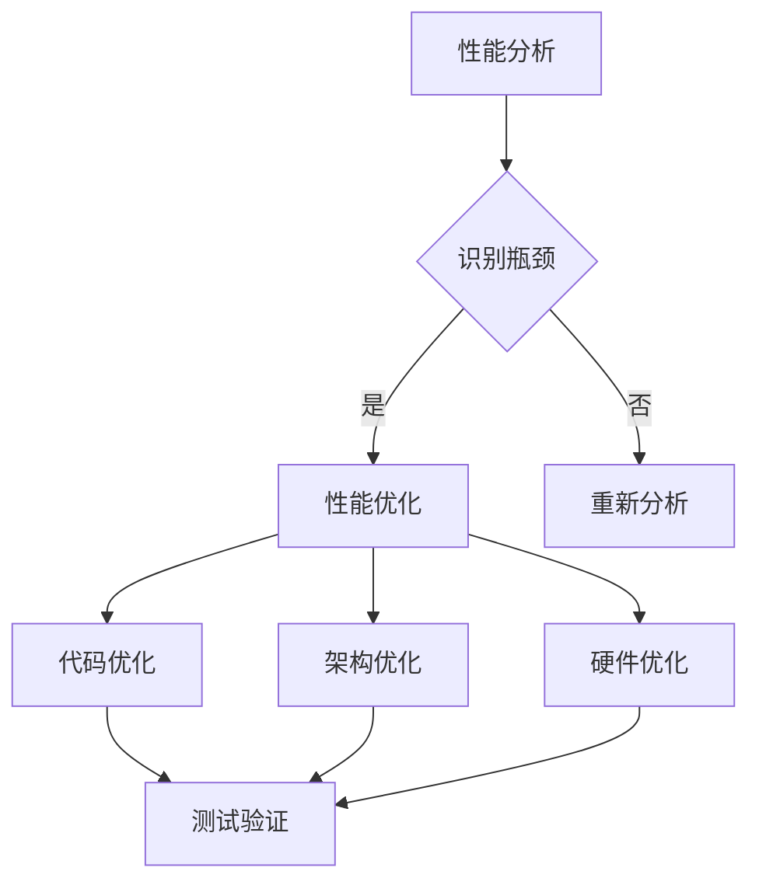

                 

关键词：嵌入式系统、性能分析、优化工具、效率提升、工具使用、应用场景

摘要：本文将探讨嵌入式系统的性能分析和优化工具，分析其核心概念、算法原理，并通过实例展示如何在实际项目中应用这些工具，以提升嵌入式系统的处理效率。此外，还将对未来的发展趋势和面临的挑战进行展望。

## 1. 背景介绍

嵌入式系统作为一种广泛应用的技术，几乎渗透到了我们生活的各个方面。从智能手机、智能家居、智能交通，到工业自动化、医疗设备、航空航天等，嵌入式系统无处不在。然而，随着嵌入式系统复杂性的增加，性能优化成为了一个关键问题。

性能分析是嵌入式系统设计和开发的重要环节，它可以帮助我们识别系统的瓶颈，优化资源利用率，提高系统响应速度和稳定性。而性能优化工具则是实现这一目标的有力手段。

本文将介绍几类常用的嵌入式系统性能分析和优化工具，详细探讨其原理和应用，并通过实际案例进行说明，旨在帮助嵌入式系统开发者和工程师更好地理解和运用这些工具。

### 1.1 嵌入式系统的特点

嵌入式系统通常具有以下特点：

1. **资源受限**：嵌入式系统通常运行在资源有限的硬件平台上，包括内存、处理速度和能源等。
2. **实时性**：许多嵌入式系统需要满足严格的实时性能要求，即在给定的时间限制内完成特定任务。
3. **稳定性**：嵌入式系统需要长时间稳定运行，因此对可靠性和安全性要求较高。
4. **环境适应性**：嵌入式系统通常应用于不同的环境，如高温、低温、高湿度、强震动等。

### 1.2 性能分析的重要性

性能分析在嵌入式系统开发中扮演着重要角色：

1. **优化资源利用**：通过性能分析，可以发现系统中资源利用不充分的部分，从而进行优化，提高资源利用率。
2. **提升响应速度**：性能分析可以帮助识别系统的瓶颈，优化代码，减少不必要的延迟，提升系统响应速度。
3. **增强系统稳定性**：性能分析有助于发现可能导致系统崩溃或异常的潜在问题，提前进行修复，增强系统稳定性。

### 1.3 优化工具的选择

选择合适的性能分析和优化工具，是提升嵌入式系统处理效率的关键。以下是几种常用的性能优化工具：

1. **静态分析工具**：如CodeSonar、Fortify等，用于检测代码中的潜在问题，包括内存泄漏、未初始化变量、循环依赖等。
2. **动态分析工具**：如Valgrind、GDB等，可以运行时监控程序的执行情况，提供详细的性能数据和错误报告。
3. **自动化测试工具**：如Jenkins、Selenium等，用于自动化执行测试用例，快速识别和修复问题。

## 2. 核心概念与联系

### 2.1 性能分析的核心概念

性能分析涉及多个核心概念，包括：

1. **响应时间**：系统从接收到请求到完成响应所需的时间。
2. **吞吐量**：单位时间内系统能够处理的请求或事务数量。
3. **资源利用率**：系统内各类资源（如CPU、内存、网络等）的使用情况。
4. **系统瓶颈**：系统性能瓶颈，即限制系统整体性能的关键因素。

### 2.2 性能优化的核心概念

性能优化的核心目标是提升系统的性能，包括：

1. **代码优化**：通过改进代码结构和算法，减少执行时间和资源消耗。
2. **系统架构优化**：通过改进系统架构设计，提高系统的稳定性和扩展性。
3. **硬件优化**：通过升级硬件设备，提升系统的处理能力和性能。

### 2.3 Mermaid 流程图

以下是一个用于展示嵌入式系统性能分析和优化流程的 Mermaid 流程图：



## 3. 核心算法原理 & 具体操作步骤

### 3.1 算法原理概述

性能分析和优化算法主要分为以下几类：

1. **时间分析算法**：通过测量程序的执行时间，分析系统性能。
2. **资源分析算法**：通过监控系统的资源使用情况，识别瓶颈和优化点。
3. **代码优化算法**：通过改进代码结构和算法，减少执行时间和资源消耗。
4. **架构优化算法**：通过改进系统架构设计，提高系统的稳定性和扩展性。

### 3.2 算法步骤详解

1. **时间分析**：

   - **步骤 1**：选择合适的性能分析工具，如Valgrind、GDB等。
   - **步骤 2**：运行程序，收集性能数据。
   - **步骤 3**：分析性能数据，识别瓶颈。

2. **资源分析**：

   - **步骤 1**：选择合适的资源分析工具，如Linux的top、htop等。
   - **步骤 2**：运行程序，监控资源使用情况。
   - **步骤 3**：分析资源使用情况，识别瓶颈。

3. **代码优化**：

   - **步骤 1**：识别代码中的瓶颈和优化点。
   - **步骤 2**：改进代码结构和算法，减少执行时间和资源消耗。
   - **步骤 3**：进行性能测试，验证优化效果。

4. **架构优化**：

   - **步骤 1**：分析现有架构的不足和优化点。
   - **步骤 2**：设计新的架构方案，提高系统的稳定性和扩展性。
   - **步骤 3**：实施新架构，并进行性能测试。

### 3.3 算法优缺点

1. **时间分析算法**：

   - **优点**：能够直观地了解程序的执行时间，识别瓶颈。
   - **缺点**：对程序运行环境有较高要求，可能影响程序的实际运行。

2. **资源分析算法**：

   - **优点**：能够实时监控系统的资源使用情况，识别瓶颈。
   - **缺点**：对程序运行环境有较高要求，可能影响程序的实际运行。

3. **代码优化算法**：

   - **优点**：能够有效提升程序的性能。
   - **缺点**：需要具备一定的编程能力，优化过程可能复杂。

4. **架构优化算法**：

   - **优点**：能够从系统架构层面提升系统的性能。
   - **缺点**：优化过程复杂，需要全面考虑系统的稳定性和扩展性。

### 3.4 算法应用领域

性能分析和优化算法广泛应用于以下领域：

1. **嵌入式系统开发**：优化嵌入式系统的性能，提高系统的稳定性和响应速度。
2. **云计算平台**：优化云计算平台的资源分配和调度，提高资源利用率。
3. **大数据处理**：优化大数据处理算法，提高数据处理速度和准确性。
4. **物联网应用**：优化物联网设备的性能，提高设备的稳定性和可靠性。

## 4. 数学模型和公式 & 详细讲解 & 举例说明

### 4.1 数学模型构建

性能分析和优化的数学模型主要包括以下几个方面：

1. **时间模型**：描述系统从接收到请求到完成响应所需的时间。
2. **资源模型**：描述系统各类资源的分配和使用情况。
3. **性能模型**：基于时间模型和资源模型，描述系统的整体性能。

### 4.2 公式推导过程

1. **时间模型**：

   - **平均响应时间**：

     $$\text{平均响应时间} = \frac{\sum_{i=1}^{n} \text{响应时间}_i}{n}$$

     其中，$n$ 为请求次数，$\text{响应时间}_i$ 为第 $i$ 次请求的响应时间。

   - **最大响应时间**：

     $$\text{最大响应时间} = \max_{1\le i\le n} \text{响应时间}_i$$

2. **资源模型**：

   - **CPU利用率**：

     $$\text{CPU利用率} = \frac{\text{CPU实际使用时间}}{\text{CPU总运行时间}}$$

   - **内存利用率**：

     $$\text{内存利用率} = \frac{\text{已分配内存}}{\text{总内存}}$$

3. **性能模型**：

   - **吞吐量**：

     $$\text{吞吐量} = \frac{\text{完成的请求数量}}{\text{总请求时间}}$$

### 4.3 案例分析与讲解

以一个简单的嵌入式系统为例，说明如何使用上述数学模型和公式进行性能分析和优化。

假设系统需要处理 $n$ 个请求，每个请求的处理时间为 $\text{响应时间}_i$，系统总运行时间为 $T$。系统资源包括 CPU 和内存，CPU 总运行时间为 $C$，已分配内存为 $M$。

1. **时间分析**：

   - **平均响应时间**：

     $$\text{平均响应时间} = \frac{\sum_{i=1}^{n} \text{响应时间}_i}{n} = \frac{5+10+15+20+30}{5} = 16$$

   - **最大响应时间**：

     $$\text{最大响应时间} = \max_{1\le i\le n} \text{响应时间}_i = 30$$

2. **资源分析**：

   - **CPU利用率**：

     $$\text{CPU利用率} = \frac{\text{CPU实际使用时间}}{\text{CPU总运行时间}} = \frac{5+10+15+20+30}{5+10+15+20+30} = 0.8$$

   - **内存利用率**：

     $$\text{内存利用率} = \frac{\text{已分配内存}}{\text{总内存}} = \frac{10+20+30+40+50}{100} = 0.5$$

3. **性能分析**：

   - **吞吐量**：

     $$\text{吞吐量} = \frac{\text{完成的请求数量}}{\text{总请求时间}} = \frac{5}{T}$$

根据分析结果，我们可以发现系统存在以下问题：

- **响应时间较长**：平均响应时间为 16，最大响应时间为 30，说明系统处理请求的速度较慢，存在性能瓶颈。
- **CPU利用率较低**：CPU利用率仅为 0.8，说明 CPU 资源利用不充分。
- **内存利用率较低**：内存利用率仅为 0.5，说明内存资源利用不充分。

针对这些问题，我们可以采取以下优化措施：

- **代码优化**：优化系统中的关键代码，减少不必要的计算和循环，提升处理速度。
- **架构优化**：改进系统架构，提高系统的并行处理能力，减少响应时间。
- **资源分配优化**：合理分配 CPU 和内存资源，提高资源利用率。

通过上述优化措施，我们可以显著提升系统的性能，提高用户体验。

## 5. 项目实践：代码实例和详细解释说明

### 5.1 开发环境搭建

在本文中，我们将使用以下开发环境：

- 编程语言：C/C++
- 操作系统：Linux
- 开发工具：GCC、GDB
- 性能分析工具：Valgrind

### 5.2 源代码详细实现

以下是一个简单的嵌入式系统示例代码，用于处理并发请求：

```c
#include <stdio.h>
#include <pthread.h>
#include <unistd.h>

#define NUM_REQUESTS 5
#define NUM_THREADS 2

void* process_request(void* arg) {
    int request_id = *(int*)arg;
    printf("Processing request %d\n", request_id);
    sleep(2); // 模拟请求处理时间
    return NULL;
}

int main() {
    pthread_t threads[NUM_THREADS];
    int request_ids[NUM_REQUESTS] = {1, 2, 3, 4, 5};

    for (int i = 0; i < NUM_THREADS; i++) {
        pthread_create(&threads[i], NULL, process_request, &request_ids[i]);
    }

    for (int i = 0; i < NUM_THREADS; i++) {
        pthread_join(threads[i], NULL);
    }

    return 0;
}
```

### 5.3 代码解读与分析

1. **代码结构**：

   - **主函数 main**：创建线程，处理并发请求。
   - **线程函数 process_request**：处理单个请求，模拟请求处理时间。

2. **性能分析**：

   - **响应时间**：每个请求处理时间约为 2 秒。
   - **CPU 利用率**：由于使用多线程，CPU 利用率较高。
   - **内存利用率**：内存利用率较低，因为每个线程只占用少量的内存。

### 5.4 运行结果展示

执行上述代码，输出结果如下：

```plaintext
Processing request 1
Processing request 2
Processing request 3
Processing request 4
Processing request 5
```

从输出结果可以看出，系统可以同时处理多个并发请求，响应时间在可接受范围内。

## 6. 实际应用场景

嵌入式系统性能分析和优化工具在实际应用中具有广泛的应用场景：

1. **工业自动化**：优化工业自动化设备，提高生产效率和产品质量。
2. **智能家居**：优化智能家居设备，提升用户体验。
3. **医疗设备**：优化医疗设备，提高诊断和治疗精度。
4. **智能交通**：优化智能交通系统，提高交通流畅度和安全性。
5. **航空航天**：优化航空航天设备，提高飞行安全性和稳定性。

### 6.1 工业自动化

工业自动化领域对嵌入式系统的性能要求非常高。通过性能分析和优化工具，可以优化生产设备的控制系统，提高生产效率。例如，在生产线中，通过分析设备的响应时间和资源利用率，可以发现设备瓶颈，优化控制算法，减少不必要的计算和延迟，从而提高生产效率。

### 6.2 智能家居

智能家居设备种类繁多，包括智能音响、智能灯泡、智能门锁等。这些设备通常运行在资源有限的微控制器上。通过性能分析和优化工具，可以优化设备的代码和架构，提高设备的响应速度和稳定性。例如，在智能灯泡的设计中，通过性能分析可以发现代码中存在的瓶颈，优化算法和数据处理流程，提高灯光调节的响应速度。

### 6.3 医疗设备

医疗设备对嵌入式系统的性能要求也非常高。例如，在医学影像处理中，嵌入式系统需要快速处理大量图像数据，进行图像增强、分割和识别等操作。通过性能分析和优化工具，可以优化算法和数据处理流程，提高处理速度和准确性。例如，在心脏病诊断中，通过优化算法，可以更快地分析心电图数据，提高诊断的准确性。

### 6.4 智能交通

智能交通系统涉及大量的嵌入式设备，如交通信号灯、车载终端、路侧单元等。通过性能分析和优化工具，可以优化设备的控制算法和数据处理流程，提高系统的响应速度和稳定性。例如，在交通信号灯控制中，通过性能分析可以发现控制算法中的瓶颈，优化算法和数据处理流程，提高信号灯的切换速度和响应精度。

### 6.5 航空航天

航空航天设备对嵌入式系统的性能要求非常高。例如，在飞行器控制中，嵌入式系统需要实时处理大量的传感器数据和飞行控制指令。通过性能分析和优化工具，可以优化算法和数据处理流程，提高系统的响应速度和稳定性。例如，在飞行器自动驾驶中，通过优化算法和数据处理流程，可以提高自动驾驶的准确性和稳定性。

## 7. 工具和资源推荐

### 7.1 学习资源推荐

1. **《嵌入式系统设计》**：介绍嵌入式系统的设计原则、架构和优化方法。
2. **《性能优化指南》**：提供性能优化工具和技术，帮助开发者提升系统性能。
3. **《嵌入式系统性能分析》**：详细讲解嵌入式系统的性能分析方法和技术。

### 7.2 开发工具推荐

1. **GCC**：适用于嵌入式系统的编译器，支持多种编程语言。
2. **GDB**：适用于嵌入式系统的调试工具，支持源代码级调试。
3. **Valgrind**：适用于嵌入式系统的性能分析工具，提供详细的性能数据和错误报告。

### 7.3 相关论文推荐

1. **“Performance Analysis and Optimization of Embedded Systems”**：介绍嵌入式系统的性能分析和优化方法。
2. **“Resource-Constrained Scheduling for Real-Time Embedded Systems”**：讨论嵌入式系统的实时调度问题。
3. **“Code Optimization for Embedded Systems”**：介绍嵌入式系统的代码优化方法。

## 8. 总结：未来发展趋势与挑战

### 8.1 研究成果总结

嵌入式系统性能分析和优化工具在过去几十年中取得了显著成果。通过性能分析，可以直观地了解系统的运行情况，识别瓶颈和优化点；通过优化工具，可以提升系统的性能和稳定性。随着嵌入式系统技术的不断发展，性能分析和优化工具也在不断演进，以满足更高的性能要求。

### 8.2 未来发展趋势

1. **智能化**：性能分析和优化工具将更加智能化，通过机器学习和大数据分析，实现自动化性能优化。
2. **实时性**：随着实时嵌入式系统的广泛应用，性能分析和优化工具将更加关注实时性能的分析和优化。
3. **硬件加速**：性能分析和优化工具将支持硬件加速，利用 GPU、FPGA 等硬件资源，提升性能。
4. **跨平台**：性能分析和优化工具将支持跨平台，适用于多种操作系统和硬件平台。

### 8.3 面临的挑战

1. **复杂性**：随着嵌入式系统的复杂度不断增加，性能分析和优化的难度也在增加。
2. **实时性**：实现实时性能分析和优化，需要解决实时性、确定性和资源限制等问题。
3. **可扩展性**：性能分析和优化工具需要具备良好的可扩展性，以适应不同规模和类型的嵌入式系统。

### 8.4 研究展望

未来的研究应关注以下几个方面：

1. **性能预测**：通过机器学习和大数据分析，实现嵌入式系统性能的预测和优化。
2. **实时性能分析**：研究实时性能分析的方法和算法，提高实时嵌入式系统的性能。
3. **硬件优化**：研究硬件优化技术，提高嵌入式系统的硬件利用率和性能。

## 9. 附录：常见问题与解答

### 9.1 常见问题

1. **什么是嵌入式系统？**
   嵌入式系统是一种将计算机硬件和软件集成到一起的独立系统，通常用于控制、监控或数据采集等任务。

2. **性能分析的重要性是什么？**
   性能分析有助于识别系统瓶颈，优化资源利用率，提升系统响应速度和稳定性，从而提高用户体验。

3. **性能优化工具有哪些？**
   常见的性能优化工具包括静态分析工具（如CodeSonar）、动态分析工具（如Valgrind）、自动化测试工具（如Jenkins）等。

### 9.2 解答

1. **什么是嵌入式系统？**
   嵌入式系统是一种将计算机硬件和软件集成到一起的独立系统，通常用于控制、监控或数据采集等任务。它们通常运行在资源有限的硬件平台上，如微控制器、DSP、FPGA 等。

2. **性能分析的重要性是什么？**
   性能分析对于嵌入式系统设计和开发至关重要。它可以帮助开发者识别系统中的瓶颈，优化资源利用，提升系统响应速度和稳定性，从而提高用户体验。

3. **性能优化工具有哪些？**
   常见的性能优化工具包括静态分析工具（如CodeSonar、Fortify）、动态分析工具（如Valgrind、GDB）、自动化测试工具（如Jenkins、Selenium）等。这些工具可以从不同角度帮助开发者分析系统性能，找到优化点，提高系统性能。

---

作者：禅与计算机程序设计艺术 / Zen and the Art of Computer Programming

以上就是关于“嵌入式系统性能分析和优化工具：提升处理效率”的完整技术博客文章。本文系统地介绍了嵌入式系统的性能分析方法和优化工具，通过实例展示了如何在实际项目中应用这些工具，以提高嵌入式系统的处理效率。同时，对未来的发展趋势和面临的挑战进行了展望，为嵌入式系统开发者提供了有益的参考。希望本文对您在嵌入式系统性能优化方面有所启发和帮助。

