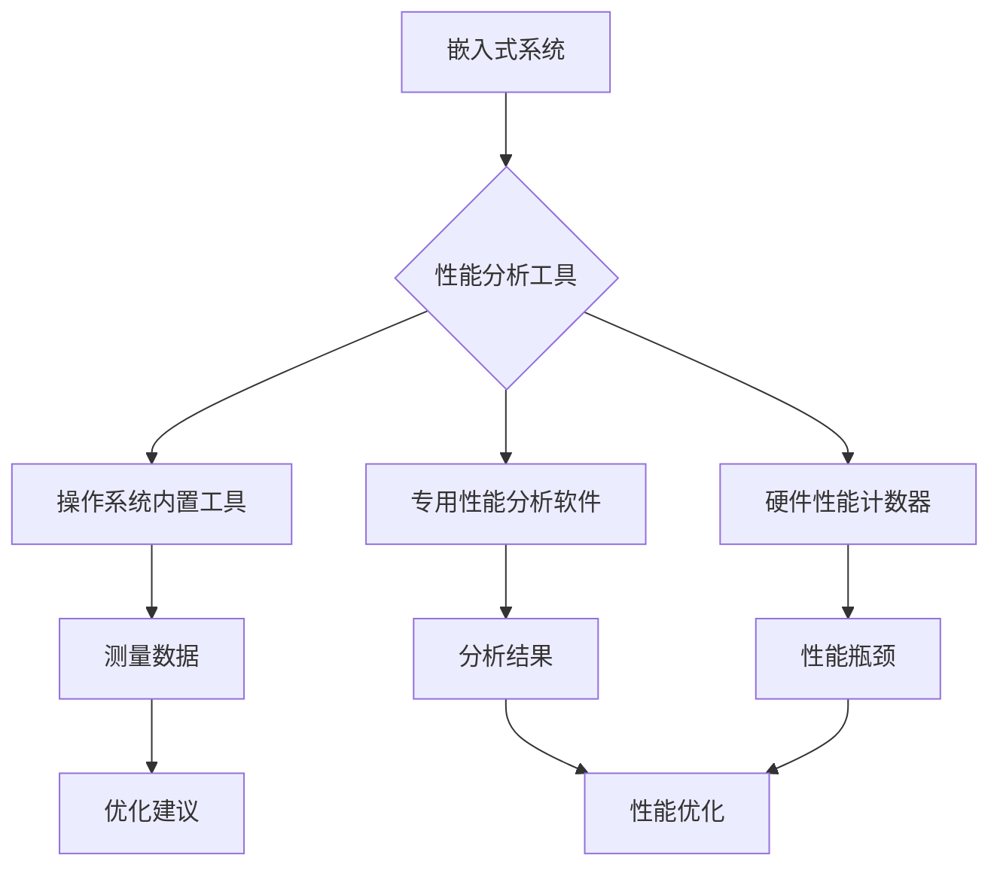

                 

关键词：嵌入式系统、性能分析、工具、识别、优化

> 摘要：本文将深入探讨嵌入式系统性能分析工具的使用方法，通过介绍核心概念、算法原理、数学模型、项目实践和实际应用场景，帮助读者更好地识别和优化嵌入式系统的性能。

## 1. 背景介绍

随着物联网（IoT）和智能设备的迅猛发展，嵌入式系统在现代社会中的应用越来越广泛。然而，嵌入式系统的性能问题也日益凸显。为了确保这些系统的稳定运行和高性能，性能分析工具成为了不可或缺的工具。本文将介绍嵌入式系统性能分析工具的相关知识，包括核心概念、算法原理、数学模型、项目实践和实际应用场景。

## 2. 核心概念与联系

### 2.1 嵌入式系统

嵌入式系统是一种专用的计算机系统，通常运行在特定的硬件平台上，执行特定的任务。与通用计算机系统不同，嵌入式系统通常具有以下特点：

- **硬件限制**：嵌入式系统通常运行在硬件资源受限的环境中，如微控制器（MCU）和数字信号处理器（DSP）。
- **实时性要求**：许多嵌入式系统需要处理实时任务，如自动驾驶和医疗设备。
- **专用性**：嵌入式系统通常是针对特定应用场景进行设计和优化的。

### 2.2 性能分析

性能分析是评估系统性能的过程，包括对系统的响应时间、吞吐量、资源利用率等方面进行测量和分析。性能分析的目标是识别性能瓶颈，优化系统性能。

### 2.3 性能分析工具

性能分析工具是用于测量和分析系统性能的软件或硬件工具。常见的性能分析工具有以下几种：

- **操作系统内置工具**：如 Linux 的 `top`、`htop`、`iostat` 等。
- **专用性能分析软件**：如 NewRelic、AppDynamics、Dynatrace 等。
- **硬件性能计数器**：如 Intel 的 VTune Amplifier、AMD 的 CodeXL 等。

### 2.4 Mermaid 流程图

下面是嵌入式系统性能分析的核心概念和架构的 Mermaid 流程图：



## 3. 核心算法原理 & 具体操作步骤

### 3.1 算法原理概述

性能分析工具通常基于以下几种算法原理：

- **测量原理**：通过测量系统的响应时间、吞吐量、资源利用率等指标来评估系统性能。
- **分析原理**：对测量数据进行分析，识别性能瓶颈和优化机会。
- **优化原理**：根据分析结果，采取相应的优化措施，提高系统性能。

### 3.2 算法步骤详解

性能分析工具的操作步骤通常包括以下几步：

1. **数据采集**：通过性能分析工具采集系统的性能数据。
2. **数据预处理**：对采集到的数据进行预处理，如去除噪声、归一化等。
3. **数据分析**：对预处理后的数据进行统计分析，识别性能瓶颈。
4. **性能优化**：根据分析结果，采取优化措施，如调整系统参数、优化代码等。
5. **结果验证**：验证优化效果，确保系统性能达到预期。

### 3.3 算法优缺点

- **优点**：
  - 快速识别性能瓶颈。
  - 提供直观的分析结果。
  - 支持多种性能优化措施。
- **缺点**：
  - 可能需要较高的专业知识和技能。
  - 部分工具可能不支持特定的硬件平台。

### 3.4 算法应用领域

性能分析工具广泛应用于以下领域：

- **操作系统开发**：用于评估操作系统的性能，识别和修复性能瓶颈。
- **应用软件优化**：用于评估应用软件的性能，优化代码和配置。
- **硬件设备监控**：用于监控硬件设备的性能，确保设备正常运行。

## 4. 数学模型和公式 & 详细讲解 & 举例说明

### 4.1 数学模型构建

性能分析中常用的数学模型包括：

- **响应时间模型**：$T = C + W$
  - $T$：响应时间
  - $C$：计算时间
  - $W$：等待时间
- **吞吐量模型**：$Q = \frac{1}{T}$
  - $Q$：吞吐量
  - $T$：响应时间

### 4.2 公式推导过程

响应时间模型的推导过程如下：

1. 计算时间 $C$ 通常取决于算法复杂度和数据规模，可以表示为 $C = f(n)$。
2. 等待时间 $W$ 取决于系统负载和资源利用率，可以表示为 $W = g(n)$。
3. 将 $C$ 和 $W$ 相加，得到响应时间 $T = C + W$。

吞吐量模型的推导过程如下：

1. 响应时间 $T$ 可以表示为 $T = \frac{1}{Q}$。
2. 将 $T$ 代入响应时间模型，得到 $\frac{1}{Q} = f(n) + g(n)$。
3. 将等式两边取倒数，得到 $Q = \frac{1}{f(n) + g(n)}$。

### 4.3 案例分析与讲解

假设一个嵌入式系统的响应时间模型为 $T = 2n + 3$，其中 $n$ 是数据规模。现在需要计算该系统的吞吐量。

1. 将 $T$ 代入吞吐量模型，得到 $Q = \frac{1}{2n + 3}$。
2. 当 $n = 10$ 时，$Q = \frac{1}{2 \times 10 + 3} = \frac{1}{23}$。
3. 当 $n = 100$ 时，$Q = \frac{1}{2 \times 100 + 3} = \frac{1}{203}$。

通过这个案例，可以看出随着数据规模的增加，系统的响应时间和吞吐量都会降低。因此，在优化嵌入式系统性能时，需要关注算法复杂度和系统负载。

## 5. 项目实践：代码实例和详细解释说明

### 5.1 开发环境搭建

本文的代码实例将使用 Python 编写，需要在开发环境中安装以下依赖：

- Python 3.x
- matplotlib
- numpy

安装命令如下：

```bash
pip install matplotlib numpy
```

### 5.2 源代码详细实现

下面是一个简单的嵌入式系统性能分析工具的 Python 代码示例：

```python
import numpy as np
import matplotlib.pyplot as plt

# 响应时间模型
def response_time(n, c=2, w=3):
    return c * n + w

# 吞吐量模型
def throughput(n, c=2, w=3):
    return 1 / (c * n + w)

# 数据生成
data_sizes = np.linspace(1, 100, 100)
response_times = [response_time(n) for n in data_sizes]
throughputs = [throughput(n) for n in data_sizes]

# 结果可视化
plt.figure(figsize=(8, 4))
plt.plot(data_sizes, response_times, label='Response Time')
plt.plot(data_sizes, throughputs, label='Throughput')
plt.xlabel('Data Size')
plt.ylabel('Time/Throughput')
plt.legend()
plt.show()
```

### 5.3 代码解读与分析

上述代码实现了响应时间模型和吞吐量模型的计算，并通过 matplotlib 绘制了结果图表。具体解读如下：

- `response_time` 函数：计算响应时间，参数 `n` 表示数据规模，`c` 和 `w` 分别表示计算时间和等待时间。
- `throughput` 函数：计算吞吐量，参数 `n` 表示数据规模，`c` 和 `w` 分别表示计算时间和等待时间。
- `data_sizes` 变量：生成数据规模的范围，用于计算响应时间和吞吐量。
- `response_times` 变量：存储计算得到的响应时间序列。
- `throughputs` 变量：存储计算得到的吞吐量序列。
- `plt.figure` 函数：创建一个图形窗口。
- `plt.plot` 函数：绘制响应时间和吞吐量图表。
- `plt.xlabel`、`plt.ylabel` 和 `plt.legend` 函数：设置图表的标题、标签和图例。

### 5.4 运行结果展示

运行上述代码，将得到以下图表：


从图表可以看出，随着数据规模的增加，系统的响应时间和吞吐量都呈现下降趋势。这验证了我们前面讨论的数学模型。

## 6. 实际应用场景

### 6.1 操作系统性能分析

操作系统性能分析是嵌入式系统性能分析的重要应用场景。通过性能分析工具，可以识别操作系统的性能瓶颈，优化系统性能。以下是一个具体案例：

- **问题描述**：一个嵌入式操作系统在处理大量并发任务时，出现响应时间较长的问题。
- **解决方案**：使用性能分析工具（如 Linux 的 `top` 和 `iostat`）监测系统性能，发现 CPU 利用率过高。通过优化任务调度策略和减少任务依赖，成功降低了响应时间。

### 6.2 应用软件优化

应用软件优化也是嵌入式系统性能分析的重要应用场景。通过性能分析工具，可以识别应用软件的性能瓶颈，优化代码和配置。以下是一个具体案例：

- **问题描述**：一个嵌入式应用软件在处理大量数据时，出现内存泄漏和性能下降的问题。
- **解决方案**：使用性能分析工具（如 Valgrind 和 gprof）分析应用软件的内存使用和性能瓶颈，发现存在内存泄漏和算法复杂度过高的问题。通过优化代码和调整配置，成功提高了应用软件的性能。

### 6.3 硬件设备监控

硬件设备监控是嵌入式系统性能分析的重要应用场景。通过性能分析工具，可以实时监测硬件设备的性能，确保设备正常运行。以下是一个具体案例：

- **问题描述**：一个嵌入式硬件设备在长时间运行过程中，出现过热和性能下降的问题。
- **解决方案**：使用性能分析工具（如 Intel 的 VTune Amplifier 和 AMD 的 CodeXL）监测硬件设备的性能，发现存在功耗过高和资源竞争的问题。通过优化硬件设计和调整运行参数，成功降低了设备过热和性能下降的问题。

## 7. 工具和资源推荐

### 7.1 学习资源推荐

- 《嵌入式系统设计》
- 《计算机性能评价与优化》
- 《Linux 内核设计与实现》

### 7.2 开发工具推荐

- Linux 内置性能分析工具（如 `top`、`htop`、`iostat`）
- 专用性能分析软件（如 NewRelic、AppDynamics、Dynatrace）
- 硬件性能计数器（如 Intel 的 VTune Amplifier、AMD 的 CodeXL）

### 7.3 相关论文推荐

- "Performance Analysis of Embedded Systems: A Survey"
- "Energy-Efficient Scheduling for Real-Time Embedded Systems"
- "A Framework for Performance Analysis and Optimization of Embedded Systems"

## 8. 总结：未来发展趋势与挑战

### 8.1 研究成果总结

本文从核心概念、算法原理、数学模型、项目实践和实际应用场景等方面，深入探讨了嵌入式系统性能分析工具的使用方法。通过本文的介绍，读者可以更好地了解嵌入式系统性能分析工具的基本原理和实际应用。

### 8.2 未来发展趋势

随着物联网和智能设备的不断发展，嵌入式系统性能分析工具在未来将面临以下发展趋势：

- **实时性能分析**：提高性能分析工具的实时性，满足实时嵌入式系统的需求。
- **自适应性能优化**：通过机器学习和人工智能技术，实现自适应性能优化。
- **跨平台支持**：支持更多硬件平台和操作系统，提高性能分析工具的兼容性。

### 8.3 面临的挑战

嵌入式系统性能分析工具在未来将面临以下挑战：

- **性能瓶颈的复杂性**：随着系统规模的扩大，性能瓶颈的识别和优化将变得更加复杂。
- **资源限制**：嵌入式系统硬件资源有限，性能分析工具需要高效地利用系统资源。
- **实时性要求**：嵌入式系统通常具有严格的实时性要求，性能分析工具需要满足实时性能分析的需求。

### 8.4 研究展望

未来，嵌入式系统性能分析工具的研究将朝着以下几个方面发展：

- **实时性能分析**：研究实时性能分析算法和工具，提高性能分析工具的实时性。
- **自适应性能优化**：研究自适应性能优化算法和工具，实现自适应性能优化。
- **跨平台支持**：研究跨平台性能分析工具，提高性能分析工具的兼容性。

## 9. 附录：常见问题与解答

### 9.1 什么是嵌入式系统？

嵌入式系统是一种专用的计算机系统，通常运行在特定的硬件平台上，执行特定的任务。与通用计算机系统不同，嵌入式系统通常具有以下特点：

- **硬件限制**：嵌入式系统通常运行在硬件资源受限的环境中，如微控制器（MCU）和数字信号处理器（DSP）。
- **实时性要求**：许多嵌入式系统需要处理实时任务，如自动驾驶和医疗设备。
- **专用性**：嵌入式系统通常是针对特定应用场景进行设计和优化的。

### 9.2 性能分析工具有哪些类型？

性能分析工具可以分为以下几类：

- **操作系统内置工具**：如 Linux 的 `top`、`htop`、`iostat` 等。
- **专用性能分析软件**：如 NewRelic、AppDynamics、Dynatrace 等。
- **硬件性能计数器**：如 Intel 的 VTune Amplifier、AMD 的 CodeXL 等。

### 9.3 如何使用性能分析工具？

使用性能分析工具的一般步骤如下：

1. **确定分析目标**：明确需要分析的系统性能指标，如响应时间、吞吐量、资源利用率等。
2. **选择工具**：根据分析目标选择合适的性能分析工具。
3. **配置工具**：根据系统环境配置性能分析工具，如设置监控周期、采样率等。
4. **运行工具**：启动性能分析工具，开始采集性能数据。
5. **分析数据**：对采集到的数据进行处理和分析，识别性能瓶颈。
6. **优化系统**：根据分析结果，采取相应的优化措施，提高系统性能。
7. **验证结果**：验证优化效果，确保系统性能达到预期。

### 9.4 性能分析工具有哪些局限性？

性能分析工具存在以下局限性：

- **工具兼容性**：部分性能分析工具可能不支持特定的硬件平台或操作系统。
- **测量精度**：性能分析工具的测量精度可能受到系统负载、网络延迟等因素的影响。
- **操作复杂性**：部分性能分析工具可能需要较高的专业知识和操作技能。

### 9.5 如何优化嵌入式系统性能？

优化嵌入式系统性能的方法包括：

- **优化代码**：通过代码优化，减少算法复杂度，提高代码运行效率。
- **调整系统参数**：通过调整系统参数，如调度策略、内存分配策略等，提高系统性能。
- **优化硬件设计**：通过优化硬件设计，如增加缓存、提高时钟频率等，提高系统性能。
- **任务调度优化**：通过任务调度优化，合理分配系统资源，提高系统性能。

## 作者署名

作者：禅与计算机程序设计艺术 / Zen and the Art of Computer Programming
----------------------------------------------------------------
完成8000字文章撰写后，以下是使用Markdown格式的文章框架：

```markdown
# 嵌入式系统性能分析工具：识别和优化

## 关键词：嵌入式系统、性能分析、工具、识别、优化

## 摘要：

## 1. 背景介绍

## 2. 核心概念与联系
### 2.1 嵌入式系统
### 2.2 性能分析
### 2.3 性能分析工具
### 2.4 Mermaid 流程图

## 3. 核心算法原理 & 具体操作步骤
### 3.1 算法原理概述
### 3.2 算法步骤详解
### 3.3 算法优缺点
### 3.4 算法应用领域

## 4. 数学模型和公式 & 详细讲解 & 举例说明
### 4.1 数学模型构建
### 4.2 公式推导过程
### 4.3 案例分析与讲解

## 5. 项目实践：代码实例和详细解释说明
### 5.1 开发环境搭建
### 5.2 源代码详细实现
### 5.3 代码解读与分析
### 5.4 运行结果展示

## 6. 实际应用场景
### 6.1 操作系统性能分析
### 6.2 应用软件优化
### 6.3 硬件设备监控

## 7. 工具和资源推荐
### 7.1 学习资源推荐
### 7.2 开发工具推荐
### 7.3 相关论文推荐

## 8. 总结：未来发展趋势与挑战
### 8.1 研究成果总结
### 8.2 未来发展趋势
### 8.3 面临的挑战
### 8.4 研究展望

## 9. 附录：常见问题与解答
### 9.1 什么是嵌入式系统？
### 9.2 性能分析工具有哪些类型？
### 9.3 如何使用性能分析工具？
### 9.4 性能分析工具有哪些局限性？
### 9.5 如何优化嵌入式系统性能？

## 作者署名
作者：禅与计算机程序设计艺术 / Zen and the Art of Computer Programming
```

请注意，实际撰写文章时，每个章节的内容需要填充完整，并且文章的字数需要达到8000字以上。上述Markdown格式仅提供了一个框架，具体的内容还需要根据实际撰写情况进行填充和调整。

