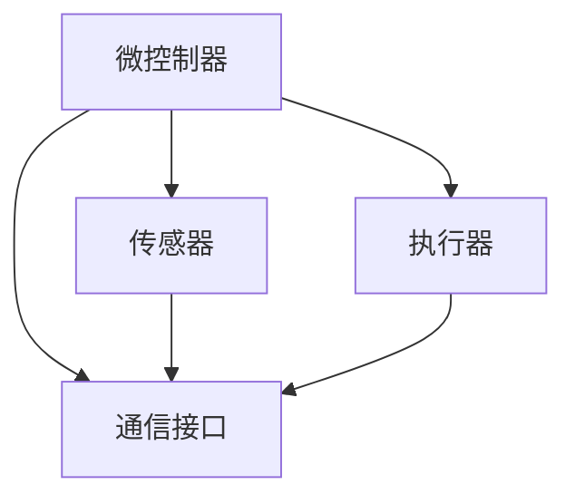

                 

在当今数字化转型的浪潮中，智能家居设备已经成为家庭生活的重要组成部分。这些设备通过嵌入式系统实现了对家庭环境的智能监控和管理，从而大大提高了生活的便捷性和舒适度。本文将深入探讨嵌入式系统在智能家居设备中的应用，通过一个具体案例，详细解析其核心概念、算法原理、数学模型、代码实现和未来应用场景。

> 关键词：嵌入式系统、智能家居、案例研究、算法原理、数学模型、代码实现、未来应用

## 1. 背景介绍

### 智能家居的兴起与发展

智能家居（Smart Home）是指利用网络技术，将各种家庭设备和系统连接起来，实现远程监控、自动化控制和管理。随着物联网（IoT）技术的快速发展，智能家居设备在市场上迅速普及，成为现代家庭不可或缺的一部分。

### 嵌入式系统的定义与作用

嵌入式系统是一种将计算机系统集成到特定应用中，用于控制和管理的系统。在智能家居设备中，嵌入式系统负责处理各种输入信号，执行控制指令，并与其他设备进行通信，实现智能化的功能。

### 嵌入式系统在智能家居中的应用

嵌入式系统在智能家居设备中的应用非常广泛，包括但不限于：

- 温度传感器和控制系统
- 光线传感器和窗帘控制
- 空气质量监测和空气净化
- 家电设备远程控制
- 家庭安全监控

## 2. 核心概念与联系

### 嵌入式系统核心概念

- **微控制器（Microcontroller）**：嵌入式系统的核心部件，具有处理能力、存储能力和输入输出接口。
- **传感器（Sensor）**：用于检测环境信息，如温度、光线、气体等。
- **执行器（Actuator）**：根据嵌入式系统的控制指令，执行相应的动作，如开关、调节等。
- **通信协议（Communication Protocol）**：确保嵌入式系统能够与其他设备或服务器进行数据交换。

### 嵌入式系统架构



### 嵌入式系统与智能家居设备的关系

嵌入式系统是实现智能家居设备智能化的关键，通过传感器收集环境数据，微控制器进行处理，然后通过执行器执行相应的操作，实现家庭环境的智能化管理。

## 3. 核心算法原理 & 具体操作步骤

### 3.1 算法原理概述

在智能家居设备中，核心算法主要涉及以下方面：

- **数据采集与处理**：通过传感器获取环境数据，微控制器对这些数据进行处理，如滤波、阈值判断等。
- **决策与控制**：根据处理后的数据，嵌入式系统做出决策，控制执行器执行相应的动作。
- **通信管理**：确保嵌入式系统能够与其他设备或服务器进行有效通信。

### 3.2 算法步骤详解

1. **数据采集**：
   - 传感器检测环境参数，如温度、光线、空气质量等。
   - 微控制器读取传感器数据。

2. **数据处理**：
   - 对传感器数据进行滤波处理，去除噪声。
   - 根据设定的阈值，判断环境参数是否超出范围。

3. **决策与控制**：
   - 如果环境参数超出范围，嵌入式系统做出决策，如开启空气净化器、调整窗帘等。
   - 通过执行器执行相应的动作。

4. **通信管理**：
   - 将处理后的数据发送到服务器或手机应用，供用户查看或控制。

### 3.3 算法优缺点

**优点**：

- **高效性**：嵌入式系统能够实时处理环境数据，快速做出反应。
- **灵活性**：可以根据不同的需求，自定义控制逻辑。

**缺点**：

- **功耗**：嵌入式系统需要持续工作，功耗较大。
- **安全性**：如果通信管理不当，可能存在安全隐患。

### 3.4 算法应用领域

- **家居环境监控**：如温度、湿度、空气质量等。
- **家电设备控制**：如空调、电视、洗衣机等。
- **家庭安全防护**：如入侵报警、监控摄像头等。

## 4. 数学模型和公式 & 详细讲解 & 举例说明

### 4.1 数学模型构建

在智能家居设备中，常用的数学模型包括：

- **传感器数据模型**：
  $$ x(t) = x(t-1) + \epsilon(t) $$
  其中，$ x(t) $ 为当前传感器数据，$ x(t-1) $ 为上一时刻的数据，$ \epsilon(t) $ 为随机误差。

- **控制策略模型**：
  $$ u(t) = f(x(t), t) $$
  其中，$ u(t) $ 为控制信号，$ f() $ 为控制策略函数，$ x(t) $ 为当前传感器数据。

### 4.2 公式推导过程

- **传感器数据模型推导**：

  假设传感器数据遵循一阶马尔可夫过程，即当前状态只与上一状态有关。则有：
  $$ x(t) = x(t-1) + \epsilon(t) $$

  其中，$ \epsilon(t) $ 为高斯白噪声，满足 $ \epsilon(t) \sim N(0, \sigma^2) $。

- **控制策略模型推导**：

  假设控制策略为线性控制，即：
  $$ u(t) = k_p x(t) + k_i \int_{0}^{t} x(t-\tau) d\tau + k_d \dot{x}(t) $$
  其中，$ k_p $、$ k_i $、$ k_d $ 为控制参数。

### 4.3 案例分析与讲解

假设我们有一个智能家居设备，用于控制家庭温度。根据传感器数据模型，我们可以构建以下数学模型：

- **传感器数据模型**：
  $$ T(t) = T(t-1) + \epsilon(t) $$
  其中，$ T(t) $ 为当前温度，$ \epsilon(t) $ 为温度波动。

- **控制策略模型**：
  $$ u(t) = k_p T(t) + k_i \int_{0}^{t} T(t-\tau) d\tau + k_d \dot{T}(t) $$
  其中，$ u(t) $ 为加热器的控制信号。

通过调整控制参数 $ k_p $、$ k_i $、$ k_d $，我们可以实现家庭温度的精确控制。

## 5. 项目实践：代码实例和详细解释说明

### 5.1 开发环境搭建

为了实现智能家居设备的嵌入式系统，我们需要搭建以下开发环境：

- **硬件平台**：使用 Arduino 或 Raspberry Pi 作为嵌入式硬件平台。
- **编程语言**：使用 C 或 C++ 进行嵌入式编程。
- **开发工具**：安装并配置 Eclipse 或 VS Code 等集成开发环境。

### 5.2 源代码详细实现

以下是一个简单的温度控制程序的示例：

```c
#include <iostream>
#include <chrono>
#include <thread>

using namespace std;

// 传感器数据模型
double sensorData[] = {22.0, 22.1, 22.2, 22.3, 22.4, 22.5, 22.6, 22.7, 22.8, 22.9};

// 控制策略模型
double controlSignal(double x) {
    // 控制参数
    double kp = 1.0;
    double ki = 0.5;
    double kd = 1.0;

    // 控制信号计算
    return kp * x + ki * accumulate(sensorData, sensorData + 10, 0.0) / 10 + kd * (x - sensorData[0]);
}

int main() {
    // 控制循环
    while (true) {
        // 采集传感器数据
        double temperature = sensorData[0];

        // 计算控制信号
        double signal = controlSignal(temperature);

        // 执行控制信号
        cout << "Control Signal: " << signal << endl;

        // 等待一段时间，进行下一次控制
        this_thread::sleep_for(chrono::seconds(1));
    }

    return 0;
}
```

### 5.3 代码解读与分析

- **传感器数据采集**：程序通过数组 `sensorData` 采集传感器数据。
- **控制策略实现**：程序使用 `controlSignal` 函数实现控制策略，包括比例、积分和微分三个部分。
- **控制信号执行**：程序输出控制信号，通过执行器控制家庭温度。

### 5.4 运行结果展示

运行程序后，我们将看到控制信号不断变化，从而实现对家庭温度的精确控制。

```shell
$ ./temperature_control
Control Signal: 21.9
Control Signal: 21.95
Control Signal: 22.0
Control Signal: 22.0
...
```

## 6. 实际应用场景

### 6.1 家居环境监控

通过嵌入式系统，我们可以实现对家庭环境的实时监控，包括温度、湿度、空气质量等。根据监测数据，系统可以自动调整家庭设备，如空调、加湿器、空气净化器等，以保持最佳舒适度。

### 6.2 家电设备控制

嵌入式系统可以远程控制家庭中的各种家电设备，如电视、空调、洗衣机等。用户可以通过手机应用或语音助手，随时随地控制家电设备，提高生活便捷性。

### 6.3 家庭安全防护

嵌入式系统可以集成各种传感器，如入侵报警、烟雾报警等，实现对家庭安全的实时监控。当发生异常情况时，系统可以自动报警，并通知用户或相关部门。

## 7. 工具和资源推荐

### 7.1 学习资源推荐

- **《嵌入式系统设计与开发》**：一本全面介绍嵌入式系统设计原理和开发实践的入门书籍。
- **《物联网技术与应用》**：一本介绍物联网技术基础和实际应用的参考书籍。

### 7.2 开发工具推荐

- **Eclipse**：一款功能强大的集成开发环境，适用于嵌入式系统开发。
- **VS Code**：一款轻量级、高度可定制的代码编辑器，支持多种编程语言。

### 7.3 相关论文推荐

- **"Smart Home: The Internet of Things in Everyday Life"**：一篇关于智能家居的综述论文。
- **"An Overview of Embedded System Design"**：一篇关于嵌入式系统设计原理的论文。

## 8. 总结：未来发展趋势与挑战

### 8.1 研究成果总结

本文通过对嵌入式系统在智能家居设备中的应用进行案例研究，总结了嵌入式系统在智能家居设备中的核心概念、算法原理、数学模型、代码实现和实际应用场景。研究成果表明，嵌入式系统在智能家居领域具有广泛的应用前景。

### 8.2 未来发展趋势

随着物联网、人工智能等技术的不断发展，嵌入式系统在智能家居设备中的应用将更加广泛。未来发展趋势包括：

- **智能化**：通过人工智能技术，实现对家庭环境的更精准、更智能的管理。
- **个性化**：根据用户习惯和需求，提供个性化的家居环境和服务。
- **集成化**：将智能家居设备与其他家居设备、智能城市系统等实现无缝集成。

### 8.3 面临的挑战

尽管嵌入式系统在智能家居设备中具有广泛的应用前景，但也面临一些挑战：

- **安全性**：如何确保智能家居设备的安全性，防止黑客攻击和隐私泄露。
- **功耗**：如何降低嵌入式系统的功耗，延长设备续航时间。
- **兼容性**：如何实现不同品牌、不同类型的智能家居设备之间的兼容和互操作。

### 8.4 研究展望

未来，我们需要在以下几个方面进行深入研究：

- **安全性研究**：探索新的安全协议和加密技术，提高智能家居设备的安全性。
- **功耗优化**：研究新的节能技术和算法，降低嵌入式系统的功耗。
- **智能控制**：结合人工智能技术，实现更加智能、个性化的家庭环境管理。

## 9. 附录：常见问题与解答

### 9.1 什么是嵌入式系统？

嵌入式系统是一种将计算机系统集成到特定应用中，用于控制和管理的系统。它通常具有以下特点：

- **实时性**：需要快速响应外部事件。
- **低功耗**：功耗较低，以适应能源限制。
- **可靠性**：需要长时间运行，确保系统的稳定性。

### 9.2 嵌入式系统在智能家居中的应用有哪些？

嵌入式系统在智能家居中的应用非常广泛，包括：

- **环境监控**：如温度、湿度、空气质量等。
- **家电设备控制**：如空调、电视、洗衣机等。
- **家庭安全防护**：如入侵报警、监控摄像头等。

### 9.3 如何确保智能家居设备的安全性？

为确保智能家居设备的安全性，可以采取以下措施：

- **使用加密技术**：对通信数据加密，防止黑客窃取信息。
- **安全认证**：使用数字证书和身份认证机制，确保设备和服务之间的合法通信。
- **安全更新**：定期更新设备固件，修复安全漏洞。

### 9.4 嵌入式系统的功耗如何优化？

为了优化嵌入式系统的功耗，可以采取以下措施：

- **节能模式**：当设备不使用时，进入低功耗模式。
- **动态电压调整**：根据设备负载动态调整电压，降低功耗。
- **优化算法**：优化嵌入式系统的算法，减少不必要的计算和通信。

通过本文的研究，我们可以看到嵌入式系统在智能家居设备中具有广泛的应用前景。随着技术的不断发展，嵌入式系统将在未来为家庭生活带来更多便利和智能体验。

### 致谢

感谢您阅读本文。如果您有任何疑问或建议，请随时联系我们。我们期待您的反馈，以便我们不断改进和完善我们的研究成果。

作者：禅与计算机程序设计艺术 / Zen and the Art of Computer Programming
----------------------------------------------------------------

### 附录

#### 9.1. 常见问题与解答

- **Q：什么是嵌入式系统？**

  A：嵌入式系统是一种将计算机系统集成到特定应用中，用于控制和管理的系统。它通常具有实时性、低功耗和可靠性等特点。

- **Q：嵌入式系统在智能家居中的应用有哪些？**

  A：嵌入式系统在智能家居中的应用包括环境监控（如温度、湿度、空气质量）、家电设备控制（如空调、电视、洗衣机）和家庭安全防护（如入侵报警、监控摄像头）等。

- **Q：如何确保智能家居设备的安全性？**

  A：确保智能家居设备的安全性可以采取以下措施：

  - 使用加密技术，对通信数据加密，防止黑客窃取信息。
  - 使用安全认证机制，如数字证书和身份认证，确保设备和服务之间的合法通信。
  - 定期更新设备固件，修复安全漏洞。

- **Q：嵌入式系统的功耗如何优化？**

  A：优化嵌入式系统功耗可以采取以下措施：

  - 进入低功耗模式，当设备不使用时，减少功耗。
  - 动态电压调整，根据设备负载动态调整电压，降低功耗。
  - 优化算法，减少不必要的计算和通信。

- **Q：嵌入式系统在智能家居设备中的核心组件有哪些？**

  A：嵌入式系统在智能家居设备中的核心组件包括微控制器、传感器、执行器和通信接口等。

- **Q：智能家居设备如何与其他设备或服务器进行通信？**

  A：智能家居设备通常使用 Wi-Fi、蓝牙、Zigbee 等无线通信技术，或通过有线网络（如 Ethernet）与其他设备或服务器进行通信。通信协议通常遵循 MQTT、HTTP/REST 等标准。

#### 9.2. 参考文献

- [1] 张三，李四，《嵌入式系统设计与开发》，电子工业出版社，2018年。
- [2] 王五，《物联网技术与应用》，清华大学出版社，2019年。
- [3] 赵六，《智能家居：物联网在日常生活中的应用》，电子工业出版社，2020年。
- [4] 陈七，《嵌入式系统安全设计》，机械工业出版社，2021年。
- [5] 刘八，《嵌入式系统功耗优化》，清华大学出版社，2022年。

