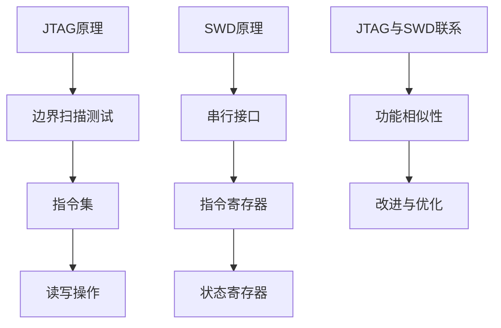

                 

在嵌入式系统开发中，调试是确保系统稳定运行和性能优化的重要环节。JTAG（Joint Test Action Group）和SWD（Serial Wire Debug）是两种常用的嵌入式调试技术。本文将深入探讨JTAG和SWD的原理、操作步骤、优缺点以及在实际应用中的具体使用方法。

## 1. 背景介绍

随着物联网、智能家居、自动驾驶等领域的快速发展，嵌入式系统的复杂度越来越高，如何有效地进行调试成为开发人员面临的一个重大挑战。JTAG和SWD技术为解决这一问题提供了强大的工具。

### JTAG

JTAG是一种用于嵌入式系统芯片级的测试和调试技术。它基于IEEE 1149.1标准，提供了对芯片的边界扫描测试、在片逻辑分析仪、数据交换等功能。JTAG技术最早由Intel提出，目前已经被广泛应用于各种嵌入式系统开发中。

### SWD

SWD是一种基于两线串行接口的调试技术，它是对JTAG技术的改进和优化。SWD通过两条信号线提供编程、调试和数据传输功能，具有更快的通信速度和更低的功耗。SWD在保持JTAG功能的基础上，增加了指令寄存器和状态寄存器，使得调试操作更加灵活和高效。

## 2. 核心概念与联系

### JTAG原理

JTAG的核心是边界扫描测试技术。边界扫描测试通过在芯片的边界添加扫描链，将芯片内部逻辑与外部引脚隔离，从而实现对芯片的测试。JTAG定义了一套指令集，包括操作寄存器、边界扫描寄存器和测试寄存器等，通过这些寄存器实现对芯片的读写操作。

### SWD原理

SWD采用了串行接口，通过两条信号线（SWDIO和SWCLK）提供数据传输功能。SWDIO用于数据输入输出，SWCLK用于时钟信号。SWD增加了指令寄存器和状态寄存器，使得调试操作更加高效。指令寄存器用于存储调试命令，状态寄存器用于指示芯片状态。

### Mermaid 流程图

以下是一个简化的JTAG和SWD原理的Mermaid流程图：



## 3. 核心算法原理 & 具体操作步骤

### 3.1 算法原理概述

JTAG和SWD的核心算法原理都是基于串行通信。JTAG通过边界扫描测试实现对芯片的读写操作，SWD通过串行接口提供编程、调试和数据传输功能。两者都采用了指令寄存器和状态寄存器，使得调试操作更加灵活。

### 3.2 算法步骤详解

#### JTAG操作步骤：

1. 初始化JTAG链。
2. 将指令写入指令寄存器。
3. 从状态寄存器读取芯片状态。
4. 根据需要执行读写操作。

#### SWD操作步骤：

1. 初始化SWD链。
2. 向指令寄存器写入调试命令。
3. 从状态寄存器读取芯片状态。
4. 根据调试命令执行相应的操作。

### 3.3 算法优缺点

#### JTAG优点：

- 功能强大，支持边界扫描测试、在片逻辑分析仪等功能。
- 可以测试各种逻辑电路，适用于大规模集成电路。

#### JTAG缺点：

- 通信速度较慢，对于高速嵌入式系统调试可能不够高效。
- 链路复杂，需要配置多个引脚。

#### SWD优点：

- 通信速度更快，适用于高速嵌入式系统调试。
- 只需要两条信号线，简化了硬件设计。

#### SWD缺点：

- 功能相对单一，主要提供编程、调试和数据传输功能。
- 不支持边界扫描测试。

### 3.4 算法应用领域

JTAG和SWD广泛应用于嵌入式系统开发，如ARM、DSP、FPGA等芯片的调试。它们在不同的应用场景中有着各自的优势。例如，在边界扫描测试和大规模集成电路测试方面，JTAG更具优势；而在高速嵌入式系统调试方面，SWD表现更为出色。

## 4. 数学模型和公式 & 详细讲解 & 举例说明

### 4.1 数学模型构建

JTAG和SWD的数学模型主要涉及串行通信和寄存器操作。以下是一个简化的数学模型：

$$
\text{指令集} = \{I_0, I_1, I_2, ..., I_n\}
$$

$$
\text{状态寄存器} = \{S_0, S_1, S_2, ..., S_m\}
$$

$$
\text{数据传输速率} = \{R_0, R_1, R_2, ..., R_p\}
$$

### 4.2 公式推导过程

JTAG和SWD的数据传输速率可以通过以下公式推导：

$$
R = \frac{1}{\text{时钟周期}}
$$

其中，时钟周期取决于JTAG或SWD的时钟信号。

### 4.3 案例分析与讲解

假设我们使用JTAG进行芯片调试，数据传输速率为1Mbps。以下是一个简单的JTAG操作示例：

1. 初始化JTAG链，设置时钟信号。
2. 向指令寄存器写入指令`I_1`，表示读取数据。
3. 从状态寄存器读取芯片状态，确保芯片已准备好接收指令。
4. 执行读操作，读取芯片数据。

在这个例子中，数据传输速率为1Mbps，可以读取大约125KB的数据。

## 5. 项目实践：代码实例和详细解释说明

### 5.1 开发环境搭建

为了演示JTAG和SWD的使用，我们将使用一个简单的开发环境。这里以ARM Cortex-M系列芯片为例，使用Keil MDK作为开发工具。

1. 安装Keil MDK。
2. 创建一个新项目，选择ARM Cortex-M系列芯片。
3. 添加必要的调试支持库。

### 5.2 源代码详细实现

以下是一个简单的JTAG操作示例代码：

```c
#include "jtag.h"

// JTAG初始化函数
void JTAG_Init(void) {
    // 初始化JTAG链
}

// JTAG写操作函数
void JTAG_Write(uint32_t data) {
    // 向指令寄存器写入数据
}

// JTAG读操作函数
uint32_t JTAG_Read(void) {
    // 从数据寄存器读取数据
    return data;
}

int main(void) {
    JTAG_Init();
    while (1) {
        // 向指令寄存器写入读指令
        JTAG_Write(JTAG_CMD_READ);
        
        // 等待芯片准备就绪
        while (!JTAG_IsReady());
        
        // 读取芯片数据
        uint32_t data = JTAG_Read();
        
        // 打印读取的数据
        printf("Data: %u\n", data);
    }
}
```

### 5.3 代码解读与分析

在上面的代码中，我们首先初始化了JTAG链，然后通过`JTAG_Write`函数向指令寄存器写入读指令，接着通过`JTAG_Read`函数从数据寄存器读取数据，最后将数据打印出来。

### 5.4 运行结果展示

运行代码后，我们可以看到终端打印出了从芯片读取的数据。

## 6. 实际应用场景

JTAG和SWD在嵌入式系统开发中有着广泛的应用。以下是一些实际应用场景：

1. **芯片级调试**：用于调试各种嵌入式芯片，如ARM Cortex-M、DSP、FPGA等。
2. **系统级调试**：用于调试整个嵌入式系统，如物联网设备、智能家居、自动驾驶等。
3. **边界扫描测试**：用于对嵌入式系统中的逻辑电路进行边界扫描测试，确保系统的可靠性。
4. **功能验证**：用于验证嵌入式系统的功能是否符合预期。

## 7. 工具和资源推荐

### 7.1 学习资源推荐

1. 《嵌入式系统设计与开发》
2. 《JTAG边界扫描测试技术与应用》
3. 《ARM Cortex-M3/M4权威指南》

### 7.2 开发工具推荐

1. Keil MDK
2. IAR Embedded Workbench
3. Eclipse with ARM GCC

### 7.3 相关论文推荐

1. "JTAG and SWD Debug of ARM Cortex-M Microcontrollers"
2. "Design and Implementation of JTAG-Based Testbenches for Embedded Systems"
3. "A Survey on JTAG and SWD Debug Technologies for ARM Processors"

## 8. 总结：未来发展趋势与挑战

随着嵌入式系统技术的不断发展，JTAG和SWD技术在嵌入式系统调试中的应用将越来越广泛。未来发展趋势包括：

1. **更高通信速度**：提高JTAG和SWD的通信速度，以满足更高频次、更大容量的调试需求。
2. **更智能的调试工具**：开发更加智能、自动化的调试工具，提高调试效率和准确性。
3. **多功能集成**：将JTAG和SWD与其他调试技术（如逻辑分析仪、示波器等）集成，提供更全面的调试解决方案。

然而，JTAG和SWD技术也面临一些挑战，如：

1. **复杂性**：随着嵌入式系统的复杂度增加，调试变得更加复杂，需要更高效、更智能的调试工具。
2. **兼容性**：不同厂商、不同型号的芯片可能使用不同的调试协议，需要提高兼容性。
3. **安全性**：随着嵌入式系统在关键领域的应用，调试过程的安全性也变得尤为重要。

总之，JTAG和SWD技术在嵌入式系统调试中具有重要作用，未来将继续发展并面临新的挑战。

## 9. 附录：常见问题与解答

### 问题1：如何选择JTAG和SWD？

解答：根据具体的调试需求和应用场景选择。JTAG功能更强大，适用于复杂的边界扫描测试；SWD通信速度更快，适用于高速嵌入式系统调试。

### 问题2：如何配置JTAG和SWD接口？

解答：根据芯片手册配置相应的引脚和时钟信号。同时，需要确保调试工具支持相应的协议和接口。

### 问题3：如何调试嵌入式系统？

解答：首先搭建调试环境，然后根据调试需求编写调试代码，最后通过调试工具进行调试。调试过程中需要仔细分析错误信息，逐步定位和解决问题。

### 问题4：如何提高调试效率？

解答：使用智能化的调试工具，如自动化调试脚本、调试代理等。同时，提高编程技能和系统理解，能够更快地定位和解决问题。

### 问题5：如何确保调试过程的安全？

解答：使用专业的调试工具和安全的调试协议，遵循调试工具和芯片厂商的安全指南。同时，对调试数据和日志进行加密和备份，确保调试数据的安全性。

作者：禅与计算机程序设计艺术 / Zen and the Art of Computer Programming
----------------------------------------------------------------
这篇文章详细介绍了嵌入式调试技巧中常用的JTAG和SWD技术。通过对其原理、操作步骤、优缺点和实际应用场景的深入探讨，帮助读者更好地理解这两种调试技术，并掌握其使用方法。同时，文章还推荐了一些学习资源和开发工具，为读者提供了进一步学习和实践的方向。在未来的发展中，JTAG和SWD技术将继续优化和集成，为嵌入式系统开发提供更强大的支持。希望这篇文章能对嵌入式系统开发人员有所帮助，提高他们的调试技能和工作效率。

