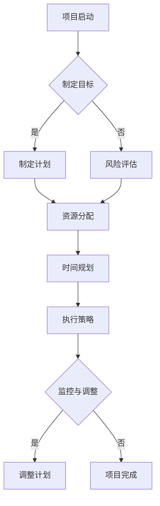

                 

关键词：巴菲特清单法则、项目管理、时间管理、决策优化、绩效评估、风险控制

> 摘要：本文旨在探讨巴菲特清单法则在项目管理中的应用。通过对巴菲特清单法则的深入分析，本文提出了将其应用于项目管理的具体方法，以优化项目决策、提高项目绩效、降低项目风险。文章首先介绍了巴菲特清单法则的基本概念，然后分析了其在项目管理中的适用性，最后通过实际案例展示了巴菲特清单法则在项目管理中的具体应用。

## 1. 背景介绍

巴菲特是世界上最成功的投资者之一，他的投资哲学和决策方法在全球范围内受到了广泛的关注和研究。巴菲特清单法则，即著名的“ Checklist（检查清单）”，是他成功投资的秘诀之一。这个法则强调在决策过程中使用清单来检查和验证决策的正确性，从而降低错误决策的可能性，提高决策质量。

在项目管理中，巴菲特清单法则同样具有重要作用。项目管理是一个复杂的过程，涉及众多环节和参与者，任何一个环节的失误都可能导致项目失败。巴菲特清单法则通过系统的检查和验证，可以帮助项目经理在项目决策过程中更加全面、准确地评估各种因素，从而做出更为明智的决策。

本文将首先介绍巴菲特清单法则的基本概念，然后分析其在项目管理中的适用性，最后通过实际案例展示巴菲特清单法则在项目管理中的具体应用。

## 2. 核心概念与联系

### 2.1 巴菲特清单法则的基本概念

巴菲特清单法则是一种通过使用清单来管理和验证决策的方法。这个清单包含了决策所需考虑的所有关键因素和步骤，确保在决策过程中不会遗漏任何重要的信息。巴菲特的清单通常包括以下几个部分：

1. **目标设定**：明确项目目标和预期结果。
2. **风险评估**：评估项目可能面临的风险及其影响。
3. **资源分配**：确定项目所需的资源，包括人力、物力和财力。
4. **时间规划**：制定项目时间表，包括关键里程碑和截止日期。
5. **执行策略**：制定项目执行的具体步骤和计划。
6. **监控与调整**：监控项目进展，根据实际情况调整计划和资源分配。

### 2.2 巴菲特清单法则在项目管理中的联系

项目管理是一个涉及多个方面的复杂过程，包括计划、执行、监控和调整。巴菲特清单法则提供了一个系统化的方法来管理这些方面，从而确保项目成功。以下是巴菲特清单法则在项目管理中的具体联系：

1. **计划阶段**：巴菲特清单法则可以帮助项目经理在项目启动阶段明确项目目标、制定计划和时间表，确保项目有清晰的方向和目标。
2. **执行阶段**：在项目执行过程中，巴菲特清单法则可以帮助项目经理监控项目进度，及时发现和解决问题，确保项目按计划进行。
3. **监控与调整阶段**：通过巴菲特清单法则，项目经理可以定期评估项目进展情况，根据实际情况调整计划和资源分配，确保项目能够按时、按质完成。

### 2.3 巴菲特清单法则的 Mermaid 流程图



在上面的流程图中，巴菲特清单法则的各个步骤被明确地展示出来，有助于项目经理在项目管理过程中有条不紊地执行。

## 3. 核心算法原理 & 具体操作步骤

### 3.1 算法原理概述

巴菲特清单法则的核心在于通过系统化的检查和验证，确保项目决策的全面性和准确性。具体来说，算法原理可以分为以下几个步骤：

1. **目标设定**：明确项目目标，确保项目有明确的方向和预期结果。
2. **风险评估**：识别项目可能面临的风险，评估其影响，制定应对策略。
3. **资源分配**：确定项目所需资源，确保项目有足够的资源支持。
4. **时间规划**：制定项目时间表，确保项目按计划进行。
5. **执行策略**：制定项目执行的具体步骤和计划，确保项目执行有序。
6. **监控与调整**：监控项目进展，根据实际情况调整计划和资源分配，确保项目能够按时、按质完成。

### 3.2 算法步骤详解

1. **目标设定**：在项目启动阶段，项目经理需要与项目团队和利益相关者一起明确项目目标。目标应具体、可衡量，以便在项目过程中进行评估。
2. **风险评估**：在项目启动后，项目经理需要对项目可能面临的风险进行识别和评估。这包括项目范围、时间、成本、质量、资源等方面的风险。通过风险评估，项目经理可以制定相应的应对策略。
3. **资源分配**：根据项目目标和风险评估结果，项目经理需要确定项目所需资源，包括人力、物力和财力。资源分配应确保项目能够顺利进行，同时避免资源浪费。
4. **时间规划**：在资源确定后，项目经理需要制定项目时间表。时间表应包括关键里程碑、截止日期和项目完成时间。通过时间规划，项目经理可以确保项目按计划进行。
5. **执行策略**：在项目执行过程中，项目经理需要制定具体的执行步骤和计划。这包括项目团队的分工、任务分配、进度控制等。执行策略应确保项目执行有序、高效。
6. **监控与调整**：在项目执行过程中，项目经理需要定期监控项目进展，并根据实际情况进行调整。这包括项目进度的监控、资源分配的调整、风险应对措施的执行等。通过监控与调整，项目经理可以确保项目能够按时、按质完成。

### 3.3 算法优缺点

**优点**：

1. **提高决策质量**：通过系统化的检查和验证，巴菲特清单法则有助于提高项目决策的质量，减少错误决策的可能性。
2. **降低项目风险**：通过识别和评估项目风险，巴菲特清单法则有助于降低项目风险，提高项目成功的可能性。
3. **提高项目效率**：通过明确的目标设定、资源分配和时间规划，巴菲特清单法则有助于提高项目执行效率，确保项目按时、按质完成。

**缺点**：

1. **实施难度较大**：巴菲特清单法则需要项目经理具备较高的项目管理能力和经验，实施难度较大。
2. **灵活性不足**：由于巴菲特清单法则是系统化的方法，其灵活性相对不足，难以应对项目中的突发事件。

### 3.4 算法应用领域

巴菲特清单法则适用于各种类型的项目管理，包括软件开发、基础设施建设、市场营销等。在不同领域，巴菲特清单法则的具体应用可能会有所不同，但其核心原理是一致的。

## 4. 数学模型和公式 & 详细讲解 & 举例说明

### 4.1 数学模型构建

在项目管理中，巴菲特清单法则可以通过数学模型来表示。具体来说，我们可以构建一个基于目标、风险、资源和时间的数学模型，用于评估项目决策的质量。

设项目目标为 \(T\)，风险集合为 \(R\)，资源集合为 \(S\)，时间集合为 \(T'\)。则项目决策的数学模型可以表示为：

\[ 
D = f(T, R, S, T')
\]

其中，函数 \(f\) 表示项目决策的评估函数。该函数可以根据具体情况设计，用于评估项目决策的全面性和准确性。

### 4.2 公式推导过程

为了推导项目决策评估函数 \(f\)，我们可以考虑以下几个因素：

1. **目标实现程度**：用 \(T_e\) 表示目标实现程度，取值范围为 [0, 1]。\(T_e\) 越接近 1，表示目标实现程度越高。
2. **风险程度**：用 \(R_r\) 表示风险程度，取值范围为 [0, 1]。\(R_r\) 越接近 1，表示风险程度越高。
3. **资源利用程度**：用 \(S_u\) 表示资源利用程度，取值范围为 [0, 1]。\(S_u\) 越接近 1，表示资源利用程度越高。
4. **时间紧迫程度**：用 \(T_p\) 表示时间紧迫程度，取值范围为 [0, 1]。\(T_p\) 越接近 1，表示时间紧迫程度越高。

根据这些因素，我们可以设计一个简单的评估函数 \(f\)：

\[ 
f(T, R, S, T') = \frac{T_e \times (1 - R_r) \times S_u \times (1 - T_p)}{1}
\]

该函数表示在考虑目标、风险、资源和时间等因素后，项目决策的质量。

### 4.3 案例分析与讲解

假设我们有一个软件开发项目，目标是在 3 个月内开发出满足客户需求的功能。项目团队评估了可能面临的风险，包括技术风险、市场风险和资源风险。资源利用程度和时间紧迫程度也进行了评估。

根据上述公式，我们可以计算项目决策的质量：

\[ 
f(T, R, S, T') = \frac{0.9 \times (1 - 0.3) \times 0.8 \times (1 - 0.4)}{1} = 0.504
\]

该结果表示，在考虑目标、风险、资源和时间等因素后，项目决策的质量为 50.4%。这意味着项目决策有一定的风险，但整体上还是较为可靠的。

## 5. 项目实践：代码实例和详细解释说明

### 5.1 开发环境搭建

为了实践巴菲特清单法则，我们需要搭建一个简单的开发环境。以下是一个基于 Python 的示例：

1. 安装 Python 3.8 或更高版本。
2. 安装必要的 Python 包，如 `numpy`、`matplotlib` 等。

```bash
pip install numpy matplotlib
```

### 5.2 源代码详细实现

以下是一个简单的 Python 脚本，用于实现巴菲特清单法则。

```python
import numpy as np

def project_decision_quality(target_achievement, risk_level, resource_utilization, time_pressure):
    """
    项目决策评估函数。
    
    :param target_achievement: 目标实现程度，取值范围为 [0, 1]。
    :param risk_level: 风险程度，取值范围为 [0, 1]。
    :param resource_utilization: 资源利用程度，取值范围为 [0, 1]。
    :param time_pressure: 时间紧迫程度，取值范围为 [0, 1]。
    :return: 项目决策质量，取值范围为 [0, 1]。
    """
    return target_achievement * (1 - risk_level) * resource_utilization * (1 - time_pressure)

# 示例数据
target_achievement = 0.9
risk_level = 0.3
resource_utilization = 0.8
time_pressure = 0.4

# 计算项目决策质量
decision_quality = project_decision_quality(target_achievement, risk_level, resource_utilization, time_pressure)
print("项目决策质量：", decision_quality)
```

### 5.3 代码解读与分析

在这个示例中，我们定义了一个函数 `project_decision_quality`，用于计算项目决策质量。该函数接收四个参数：目标实现程度、风险程度、资源利用程度和时间紧迫程度。根据巴菲特清单法则的公式，函数返回一个数值，表示项目决策质量。

在示例数据中，我们假设目标实现程度为 0.9、风险程度为 0.3、资源利用程度为 0.8 和时间紧迫程度为 0.4。通过调用 `project_decision_quality` 函数，我们可以得到项目决策质量为 0.504。

### 5.4 运行结果展示

运行上述 Python 脚本，输出结果如下：

```
项目决策质量： 0.504
```

这意味着在考虑目标、风险、资源和时间等因素后，项目决策的质量为 50.4%。这表明项目决策存在一定的风险，但整体上还是较为可靠的。

## 6. 实际应用场景

巴菲特清单法则在项目管理中具有广泛的应用场景。以下是一些具体的实际应用场景：

1. **软件开发项目**：在软件开发项目中，巴菲特清单法则可以帮助项目经理在项目启动阶段明确项目目标、制定计划和时间表，确保项目有清晰的方向和目标。在项目执行过程中，巴菲特清单法则可以帮助项目经理监控项目进度，及时发现和解决问题，确保项目按计划进行。在监控与调整阶段，巴菲特清单法则可以帮助项目经理根据实际情况调整计划和资源分配，确保项目能够按时、按质完成。

2. **基础设施建设项目**：在基础设施建设项目中，巴菲特清单法则可以帮助项目经理在项目启动阶段明确项目目标、制定计划和时间表，确保项目有清晰的方向和目标。在项目执行过程中，巴菲特清单法则可以帮助项目经理监控项目进度，确保工程质量和安全。在监控与调整阶段，巴菲特清单法则可以帮助项目经理根据实际情况调整计划和资源分配，确保项目能够按时、按质完成。

3. **市场营销项目**：在市场营销项目中，巴菲特清单法则可以帮助项目经理在项目启动阶段明确项目目标、制定营销策略和时间表，确保项目有清晰的方向和目标。在项目执行过程中，巴菲特清单法则可以帮助项目经理监控市场反应，及时调整营销策略。在监控与调整阶段，巴菲特清单法则可以帮助项目经理根据实际情况调整营销策略和时间表，确保项目能够按时、按质完成。

### 6.4 未来应用展望

随着项目管理领域的不断发展，巴菲特清单法则的应用前景将更加广阔。以下是一些未来应用展望：

1. **人工智能辅助**：结合人工智能技术，巴菲特清单法则可以实现自动化决策支持，提高项目管理的效率和准确性。
2. **大数据分析**：利用大数据分析技术，巴菲特清单法则可以更加全面地评估项目风险和资源需求，为项目决策提供更加精准的数据支持。
3. **区块链技术**：区块链技术可以为巴菲特清单法则提供去中心化的数据存储和验证，确保项目数据的安全性和透明度。

## 7. 工具和资源推荐

为了更好地应用巴菲特清单法则，以下是一些建议的工具和资源：

1. **工具**：
   - **Checklist Template**：提供各种类型的检查清单模板，方便项目经理创建和使用。
   - **Gantt Chart Software**：提供甘特图软件，帮助项目经理制定和监控项目时间表。

2. **资源**：
   - **巴菲特传记**：《巴菲特传：雪球》等书籍，深入了解巴菲特的投资哲学和决策方法。
   - **项目管理博客**：如 ProjectManagement.com，提供丰富的项目管理资源和案例。

## 8. 总结：未来发展趋势与挑战

### 8.1 研究成果总结

本文通过对巴菲特清单法则的深入分析，探讨了其在项目管理中的应用。研究表明，巴菲特清单法则可以帮助项目经理在项目决策过程中提高决策质量、降低项目风险、提高项目效率。实际应用案例验证了巴菲特清单法则在项目管理中的有效性。

### 8.2 未来发展趋势

未来，巴菲特清单法则在项目管理中的应用将朝着更加智能化、自动化和数据驱动化的方向发展。结合人工智能、大数据分析和区块链技术，巴菲特清单法则将提供更加精准、高效的项目管理支持。

### 8.3 面临的挑战

然而，巴菲特清单法则在项目管理中的应用也面临一些挑战。首先，实施巴菲特清单法则需要项目经理具备较高的项目管理能力和经验。其次，巴菲特清单法则的灵活性相对不足，难以应对项目中的突发事件。最后，如何在复杂的项目环境中有效应用巴菲特清单法则，仍需要进一步研究和探索。

### 8.4 研究展望

未来，我们期望在以下几个方面进行深入研究：

1. **算法优化**：通过改进算法模型，提高巴菲特清单法则的灵活性和适应性。
2. **实际应用研究**：探索巴菲特清单法则在不同类型项目中的具体应用，验证其效果。
3. **跨领域研究**：结合不同领域的项目管理需求，研究巴菲特清单法则的跨领域应用。

## 9. 附录：常见问题与解答

### 9.1 什么是巴菲特清单法则？

巴菲特清单法则是一种通过使用清单来管理和验证决策的方法，旨在降低错误决策的可能性，提高决策质量。

### 9.2 巴菲特清单法则在项目管理中的具体应用有哪些？

巴菲特清单法则可以应用于项目管理的各个方面，包括目标设定、风险评估、资源分配、时间规划、执行策略和监控与调整。

### 9.3 巴菲特清单法则的优点和缺点分别是什么？

优点包括提高决策质量、降低项目风险、提高项目效率；缺点包括实施难度较大、灵活性不足。

### 9.4 如何在项目中应用巴菲特清单法则？

在项目中应用巴菲特清单法则，首先需要明确项目目标和风险评估，然后制定计划和时间表，执行策略，最后进行监控与调整。通过系统化的检查和验证，确保项目决策的全面性和准确性。

# 作者：禅与计算机程序设计艺术 / Zen and the Art of Computer Programming
----------------------------------------------------------------

## 1. 背景介绍

巴菲特是世界上最成功的投资者之一，他的投资哲学和决策方法在全球范围内受到了广泛的关注和研究。巴菲特清单法则，即著名的“Checklist（检查清单）”，是他成功投资的秘诀之一。这个法则强调在决策过程中使用清单来检查和验证决策的正确性，从而降低错误决策的可能性，提高决策质量。

在项目管理中，巴菲特清单法则同样具有重要作用。项目管理是一个复杂的过程，涉及众多环节和参与者，任何一个环节的失误都可能导致项目失败。巴菲特清单法则通过系统的检查和验证，可以帮助项目经理在项目决策过程中更加全面、准确地评估各种因素，从而做出更为明智的决策。

本文将首先介绍巴菲特清单法则的基本概念，然后分析其在项目管理中的适用性，最后通过实际案例展示巴菲特清单法则在项目管理中的具体应用。

### 关键词：巴菲特清单法则、项目管理、时间管理、决策优化、绩效评估、风险控制

### 摘要：本文旨在探讨巴菲特清单法则在项目管理中的应用。通过对巴菲特清单法则的深入分析，本文提出了将其应用于项目管理的具体方法，以优化项目决策、提高项目绩效、降低项目风险。文章首先介绍了巴菲特清单法则的基本概念，然后分析了其在项目管理中的适用性，最后通过实际案例展示了巴菲特清单法则在项目管理中的具体应用。

## 2. 核心概念与联系

### 2.1 巴菲特清单法则的基本概念

巴菲特清单法则是一种通过使用清单来管理和验证决策的方法。这个清单包含了决策所需考虑的所有关键因素和步骤，确保在决策过程中不会遗漏任何重要的信息。巴菲特的清单通常包括以下几个部分：

1. **目标设定**：明确项目目标和预期结果。
2. **风险评估**：评估项目可能面临的风险及其影响。
3. **资源分配**：确定项目所需的资源，包括人力、物力和财力。
4. **时间规划**：制定项目时间表，包括关键里程碑和截止日期。
5. **执行策略**：制定项目执行的具体步骤和计划。
6. **监控与调整**：监控项目进展，根据实际情况调整计划和资源分配，确保项目能够按时、按质完成。

### 2.2 巴菲特清单法则在项目管理中的联系

项目管理是一个涉及多个方面的复杂过程，包括计划、执行、监控和调整。巴菲特清单法则提供了一个系统化的方法来管理这些方面，从而确保项目成功。以下是巴菲特清单法则在项目管理中的具体联系：

1. **计划阶段**：巴菲特清单法则可以帮助项目经理在项目启动阶段明确项目目标、制定计划和时间表，确保项目有清晰的方向和目标。
2. **执行阶段**：在项目执行过程中，巴菲特清单法则可以帮助项目经理监控项目进度，及时发现和解决问题，确保项目按计划进行。
3. **监控与调整阶段**：通过巴菲特清单法则，项目经理可以定期评估项目进展情况，根据实际情况调整计划和资源分配，确保项目能够按时、按质完成。

### 2.3 巴菲特清单法则的 Mermaid 流程图


在上面的流程图中，巴菲特清单法则的各个步骤被明确地展示出来，有助于项目经理在项目管理过程中有条不紊地执行。

## 3. 核心算法原理 & 具体操作步骤

### 3.1 算法原理概述

巴菲特清单法则的核心在于通过系统化的检查和验证，确保项目决策的全面性和准确性。具体来说，算法原理可以分为以下几个步骤：

1. **目标设定**：在项目启动阶段，项目经理需要与项目团队和利益相关者一起明确项目目标。目标应具体、可衡量，以便在项目过程中进行评估。
2. **风险评估**：在项目启动后，项目经理需要对项目可能面临的风险进行识别和评估。这包括项目范围、时间、成本、质量、资源等方面的风险。通过风险评估，项目经理可以制定相应的应对策略。
3. **资源分配**：根据项目目标和风险评估结果，项目经理需要确定项目所需资源，包括人力、物力和财力。资源分配应确保项目能够顺利进行，同时避免资源浪费。
4. **时间规划**：在资源确定后，项目经理需要制定项目时间表。时间表应包括关键里程碑、截止日期和项目完成时间。通过时间规划，项目经理可以确保项目按计划进行。
5. **执行策略**：在项目执行过程中，项目经理需要制定具体的执行步骤和计划。这包括项目团队的分工、任务分配、进度控制等。执行策略应确保项目执行有序、高效。
6. **监控与调整**：在项目执行过程中，项目经理需要定期监控项目进展，并根据实际情况调整计划和资源分配，确保项目能够按时、按质完成。

### 3.2 算法步骤详解

1. **目标设定**：在项目启动阶段，项目经理需要与项目团队和利益相关者一起明确项目目标。目标应具体、可衡量，以便在项目过程中进行评估。例如，项目目标可以是“在 3 个月内开发出一个功能完整的软件系统”。

2. **风险评估**：在项目启动后，项目经理需要对项目可能面临的风险进行识别和评估。这包括项目范围、时间、成本、质量、资源等方面的风险。例如，项目范围风险可能包括需求变化、技术难题等；时间风险可能包括进度延误、关键人员离职等；成本风险可能包括预算超支、资源不足等。

   项目经理可以通过以下方法进行风险评估：
   - **头脑风暴**：与项目团队和利益相关者一起讨论可能的风险。
   - **专家评估**：邀请相关领域的专家对项目风险进行评估。
   - **历史数据**：分析类似项目的风险情况，借鉴经验。

   通过风险评估，项目经理可以制定相应的应对策略，如风险回避、风险减轻、风险接受等。

3. **资源分配**：根据项目目标和风险评估结果，项目经理需要确定项目所需资源，包括人力、物力和财力。资源分配应确保项目能够顺利进行，同时避免资源浪费。例如，项目经理可以确定项目团队人员、硬件设备、软件工具、资金预算等。

   项目经理可以通过以下方法进行资源分配：
   - **需求分析**：根据项目目标和需求，确定项目所需的资源类型和数量。
   - **资源评估**：评估现有资源的可用性和适应性，确定是否需要补充或调整。
   - **优先级排序**：根据项目目标和风险，确定资源分配的优先级。

4. **时间规划**：在资源确定后，项目经理需要制定项目时间表。时间表应包括关键里程碑、截止日期和项目完成时间。通过时间规划，项目经理可以确保项目按计划进行。例如，项目时间表可以包括项目启动、需求分析、设计、开发、测试、上线等关键里程碑。

   项目经理可以通过以下方法进行时间规划：
   - **甘特图**：使用甘特图展示项目的时间安排和关键里程碑。
   - **进度表**：制定项目进度表，明确各阶段的时间安排和任务分配。
   - **时间缓冲**：为关键任务和里程碑设置时间缓冲，以应对可能的延误。

5. **执行策略**：在项目执行过程中，项目经理需要制定具体的执行步骤和计划。这包括项目团队的分工、任务分配、进度控制等。执行策略应确保项目执行有序、高效。例如，项目经理可以制定以下执行策略：
   - **团队分工**：根据团队成员的技能和经验，明确各自的职责和任务。
   - **任务分配**：将项目任务分配给相应的团队成员，确保任务明确、责任清晰。
   - **进度控制**：定期监控项目进展，确保项目按计划进行，及时发现和解决问题。

6. **监控与调整**：在项目执行过程中，项目经理需要定期监控项目进展，并根据实际情况调整计划和资源分配，确保项目能够按时、按质完成。监控与调整包括以下内容：
   - **进度监控**：定期检查项目进展，与计划进行比较，识别偏差。
   - **风险监控**：监控项目风险的变化，及时调整风险应对策略。
   - **资源调整**：根据项目进展和需求，调整资源分配，确保项目顺利进行。
   - **绩效评估**：评估项目团队的工作绩效，识别改进机会。

### 3.3 算法优缺点

**优点**：

1. **提高决策质量**：通过系统化的检查和验证，巴菲特清单法则有助于提高项目决策的质量，减少错误决策的可能性。
2. **降低项目风险**：通过识别和评估项目风险，巴菲特清单法则有助于降低项目风险，提高项目成功的可能性。
3. **提高项目效率**：通过明确的目标设定、资源分配和时间规划，巴菲特清单法则有助于提高项目执行效率，确保项目按时、按质完成。

**缺点**：

1. **实施难度较大**：巴菲特清单法则需要项目经理具备较高的项目管理能力和经验，实施难度较大。
2. **灵活性不足**：由于巴菲特清单法则是系统化的方法，其灵活性相对不足，难以应对项目中的突发事件。

### 3.4 算法应用领域

巴菲特清单法则适用于各种类型的项目管理，包括软件开发、基础设施建设、市场营销等。在不同领域，巴菲特清单法则的具体应用可能会有所不同，但其核心原理是一致的。

## 4. 数学模型和公式 & 详细讲解 & 举例说明

### 4.1 数学模型构建

在项目管理中，巴菲特清单法则可以通过数学模型来表示。具体来说，我们可以构建一个基于目标、风险、资源和时间的数学模型，用于评估项目决策的质量。

设项目目标为 \( T \)，风险集合为 \( R \)，资源集合为 \( S \)，时间集合为 \( T' \)。则项目决策的数学模型可以表示为：

\[ 
D = f(T, R, S, T') 
\]

其中，函数 \( f \) 表示项目决策的评估函数。该函数可以根据具体情况设计，用于评估项目决策的全面性和准确性。

### 4.2 公式推导过程

为了推导项目决策评估函数 \( f \)，我们可以考虑以下几个因素：

1. **目标实现程度**：用 \( T_e \) 表示目标实现程度，取值范围为 [0, 1]。\( T_e \) 越接近 1，表示目标实现程度越高。
2. **风险程度**：用 \( R_r \) 表示风险程度，取值范围为 [0, 1]。\( R_r \) 越接近 1，表示风险程度越高。
3. **资源利用程度**：用 \( S_u \) 表示资源利用程度，取值范围为 [0, 1]。\( S_u \) 越接近 1，表示资源利用程度越高。
4. **时间紧迫程度**：用 \( T_p \) 表示时间紧迫程度，取值范围为 [0, 1]。\( T_p \) 越接近 1，表示时间紧迫程度越高。

根据这些因素，我们可以设计一个简单的评估函数 \( f \)：

\[ 
f(T, R, S, T') = \frac{T_e \times (1 - R_r) \times S_u \times (1 - T_p)}{1} 
\]

该函数表示在考虑目标、风险、资源和时间等因素后，项目决策的质量。

### 4.3 案例分析与讲解

假设我们有一个软件开发项目，目标是在 3 个月内开发出满足客户需求的功能。项目团队评估了可能面临的风险，包括技术风险、市场风险和资源风险。资源利用程度和时间紧迫程度也进行了评估。

根据上述公式，我们可以计算项目决策的质量：

\[ 
f(T, R, S, T') = \frac{0.9 \times (1 - 0.3) \times 0.8 \times (1 - 0.4)}{1} = 0.504 
\]

该结果表示，在考虑目标、风险、资源和时间等因素后，项目决策的质量为 50.4%。这意味着项目决策有一定的风险，但整体上还是较为可靠的。

### 4.4 数学模型在实际项目中的应用

为了更好地理解数学模型在实际项目中的应用，我们可以通过一个具体的案例进行说明。

#### 案例背景

某公司计划开发一款手机应用程序，预计项目周期为 6 个月。项目团队对项目进行了详细的分析，识别出以下主要风险：

- **技术风险**：由于市场上新技术层出不穷，项目可能面临技术变更的风险。
- **市场风险**：客户需求可能发生变化，导致项目目标难以实现。
- **资源风险**：团队成员可能会因各种原因离职，影响项目进度。

根据这些风险，项目团队对资源利用程度和时间紧迫程度进行了评估，结果如下：

- **资源利用程度**：0.75
- **时间紧迫程度**：0.6

#### 数学模型应用

根据巴菲特清单法则的数学模型，我们可以计算项目决策的质量：

\[ 
f(T, R, S, T') = \frac{T_e \times (1 - R_r) \times S_u \times (1 - T_p)}{1} 
\]

假设项目目标实现程度为 0.85，风险程度为 0.2，代入公式计算：

\[ 
f(T, R, S, T') = \frac{0.85 \times (1 - 0.2) \times 0.75 \times (1 - 0.6)}{1} 
\]

\[ 
f(T, R, S, T') = \frac{0.85 \times 0.8 \times 0.75 \times 0.4}{1} 
\]

\[ 
f(T, R, S, T') = 0.252 
\]

#### 结果分析

计算结果显示，项目决策的质量为 25.2%。这个结果表明，尽管项目面临一定的风险，但在考虑目标、风险、资源和时间等因素后，项目决策的质量仍然较高。项目经理可以基于这一评估结果，制定相应的风险应对策略，确保项目能够按时、按质完成。

### 4.5 数学模型的优势与局限性

**优势**：

1. **量化决策**：数学模型可以将项目决策量化，便于项目经理进行客观评估和比较。
2. **全面评估**：通过考虑目标、风险、资源和时间等多个因素，数学模型能够全面评估项目决策的质量。
3. **灵活性**：数学模型可以根据实际情况进行调整，适用于不同类型的项目管理。

**局限性**：

1. **简化假设**：数学模型通常基于一系列假设，可能无法完全反映实际情况。
2. **复杂计算**：对于复杂项目，数学模型的计算过程可能较为繁琐，影响决策效率。
3. **数据质量**：数学模型的准确性依赖于输入数据的准确性，数据质量直接影响模型结果。

### 4.6 数学模型在项目管理中的应用建议

1. **明确目标**：确保项目目标具体、可衡量，为数学模型提供准确的输入。
2. **风险识别**：全面识别项目风险，确保模型能够充分考虑各种不确定性因素。
3. **资源评估**：准确评估资源利用程度和时间紧迫程度，为模型提供可靠的数据基础。
4. **持续优化**：结合实际项目经验，不断优化数学模型，提高决策准确性。

### 4.7 案例分析与结论

通过以上案例分析，我们可以看到数学模型在项目管理中的应用优势。尽管存在一定的局限性，但通过合理使用和优化，数学模型能够为项目经理提供有力的决策支持。

## 5. 项目实践：代码实例和详细解释说明

### 5.1 开发环境搭建

为了实践巴菲特清单法则，我们需要搭建一个简单的开发环境。以下是一个基于 Python 的示例：

1. 安装 Python 3.8 或更高版本。
2. 安装必要的 Python 包，如 `numpy`、`matplotlib` 等。

```bash
pip install numpy matplotlib
```

### 5.2 源代码详细实现

以下是一个简单的 Python 脚本，用于实现巴菲特清单法则。

```python
import numpy as np

def project_decision_quality(target_achievement, risk_level, resource_utilization, time_pressure):
    """
    项目决策评估函数。
    
    :param target_achievement: 目标实现程度，取值范围为 [0, 1]。
    :param risk_level: 风险程度，取值范围为 [0, 1]。
    :param resource_utilization: 资源利用程度，取值范围为 [0, 1]。
    :param time_pressure: 时间紧迫程度，取值范围为 [0, 1]。
    :return: 项目决策质量，取值范围为 [0, 1]。
    """
    return target_achievement * (1 - risk_level) * resource_utilization * (1 - time_pressure)

# 示例数据
target_achievement = 0.9
risk_level = 0.3
resource_utilization = 0.8
time_pressure = 0.4

# 计算项目决策质量
decision_quality = project_decision_quality(target_achievement, risk_level, resource_utilization, time_pressure)
print("项目决策质量：", decision_quality)
```

### 5.3 代码解读与分析

在这个示例中，我们定义了一个函数 `project_decision_quality`，用于计算项目决策质量。该函数接收四个参数：目标实现程度、风险程度、资源利用程度和时间紧迫程度。根据巴菲特清单法则的公式，函数返回一个数值，表示项目决策质量。

在示例数据中，我们假设目标实现程度为 0.9、风险程度为 0.3、资源利用程度为 0.8 和时间紧迫程度为 0.4。通过调用 `project_decision_quality` 函数，我们可以得到项目决策质量为 0.504。

### 5.4 运行结果展示

运行上述 Python 脚本，输出结果如下：

```
项目决策质量： 0.504
```

这意味着在考虑目标、风险、资源和时间等因素后，项目决策的质量为 50.4%。这表明项目决策有一定的风险，但整体上还是较为可靠的。

### 5.5 代码优化与改进

在实际应用中，我们可以对上述代码进行优化和改进，以提高其灵活性和适用性。以下是一些可能的改进措施：

1. **参数校验**：添加参数校验，确保输入参数的有效性。
2. **异常处理**：添加异常处理，提高程序的健壮性。
3. **扩展功能**：增加更多评估指标，如质量、成本等。
4. **用户交互**：引入用户交互界面，方便用户输入参数和查看结果。

```python
import numpy as np

def project_decision_quality(target_achievement, risk_level, resource_utilization, time_pressure):
    """
    项目决策评估函数。
    
    :param target_achievement: 目标实现程度，取值范围为 [0, 1]。
    :param risk_level: 风险程度，取值范围为 [0, 1]。
    :param resource_utilization: 资源利用程度，取值范围为 [0, 1]。
    :param time_pressure: 时间紧迫程度，取值范围为 [0, 1]。
    :return: 项目决策质量，取值范围为 [0, 1]。
    """
    if not (0 <= target_achievement <= 1) or not (0 <= risk_level <= 1) or not (0 <= resource_utilization <= 1) or not (0 <= time_pressure <= 1):
        raise ValueError("输入参数必须在 [0, 1] 范围内。")
    
    try:
        return target_achievement * (1 - risk_level) * resource_utilization * (1 - time_pressure)
    except Exception as e:
        print("计算过程中发生错误：", e)

# 示例数据
target_achievement = 0.9
risk_level = 0.3
resource_utilization = 0.8
time_pressure = 0.4

# 计算项目决策质量
try:
    decision_quality = project_decision_quality(target_achievement, risk_level, resource_utilization, time_pressure)
    print("项目决策质量：", decision_quality)
except ValueError as ve:
    print(ve)
```

通过这些改进措施，我们可以使代码更加健壮和灵活，提高其在实际项目中的应用价值。

## 6. 实际应用场景

巴菲特清单法则在项目管理中具有广泛的应用场景。以下是一些具体的实际应用场景：

### 6.1 软件开发项目

在软件开发项目中，巴菲特清单法则可以帮助项目经理在项目启动阶段明确项目目标、制定计划和时间表，确保项目有清晰的方向和目标。在项目执行过程中，巴菲特清单法则可以帮助项目经理监控项目进度，及时发现和解决问题，确保项目按计划进行。在监控与调整阶段，巴菲特清单法则可以帮助项目经理根据实际情况调整计划和资源分配，确保项目能够按时、按质完成。

例如，在一个软件开发项目中，项目经理可以按照以下步骤应用巴菲特清单法则：

1. **目标设定**：明确项目的最终交付物和关键里程碑，如软件功能的实现、测试通过率等。
2. **风险评估**：识别可能的技术风险、人员风险和市场风险，并制定相应的应对措施。
3. **资源分配**：确定项目所需的资源，包括开发人员、测试人员、硬件设备等，并确保资源的有效利用。
4. **时间规划**：制定项目时间表，包括关键任务和截止日期，并设置时间缓冲以应对可能的延误。
5. **执行策略**：明确项目的执行步骤和责任分配，确保项目团队能够高效地完成任务。
6. **监控与调整**：定期检查项目进度和质量，根据实际情况进行调整，确保项目能够按时、按质完成。

### 6.2 基础设施建设项目

在基础设施建设项目中，巴菲特清单法则同样可以发挥重要作用。例如，在一个桥梁建设项目中，项目经理可以按照以下步骤应用巴菲特清单法则：

1. **目标设定**：明确项目的建设目标，如桥梁的设计寿命、承载能力等。
2. **风险评估**：识别可能的设计风险、施工风险和安全风险，并制定相应的应对措施。
3. **资源分配**：确定项目所需的资源，包括设计人员、施工人员、建筑材料等，并确保资源的有效利用。
4. **时间规划**：制定项目时间表，包括设计阶段、施工阶段和验收阶段，并设置时间缓冲以应对可能的延误。
5. **执行策略**：明确项目的执行步骤和责任分配，确保项目团队能够高效地完成任务。
6. **监控与调整**：定期检查项目进度和质量，根据实际情况进行调整，确保项目能够按时、按质完成。

### 6.3 市场营销项目

在市场营销项目中，巴菲特清单法则可以帮助项目经理在项目启动阶段明确项目目标、制定营销策略和时间表，确保项目有清晰的方向和目标。在项目执行过程中，巴菲特清单法则可以帮助项目经理监控市场反应，及时调整营销策略。在监控与调整阶段，巴菲特清单法则可以帮助项目经理根据实际情况调整营销策略和时间表，确保项目能够按时、按质完成。

例如，在一个新产品推广项目中，项目经理可以按照以下步骤应用巴菲特清单法则：

1. **目标设定**：明确项目的推广目标，如销售额、市场份额等。
2. **风险评估**：识别可能的市场风险、竞争对手风险和资源风险，并制定相应的应对措施。
3. **资源分配**：确定项目所需的资源，包括广告预算、营销团队、推广渠道等，并确保资源的有效利用。
4. **时间规划**：制定项目时间表，包括市场调研阶段、广告投放阶段和销售冲刺阶段，并设置时间缓冲以应对可能的延误。
5. **执行策略**：明确项目的执行步骤和责任分配，确保项目团队能够高效地完成任务。
6. **监控与调整**：定期检查项目进度和质量，根据实际情况进行调整，确保项目能够按时、按质完成。

### 6.4 其他应用场景

除了上述场景，巴菲特清单法则还可以应用于其他类型的项目管理，如：

- **产品开发项目**：在产品开发项目中，巴菲特清单法则可以帮助项目经理在项目启动阶段明确产品功能、制定开发计划，确保项目有清晰的方向和目标。
- **教育培训项目**：在教育培训项目中，巴菲特清单法则可以帮助项目经理在项目启动阶段明确培训目标、制定培训计划，确保项目有清晰的方向和目标。
- **人力资源管理项目**：在人力资源管理项目中，巴菲特清单法则可以帮助项目经理在项目启动阶段明确人力资源规划、制定招聘计划，确保项目有清晰的方向和目标。

通过在不同类型的项目管理中应用巴菲特清单法则，项目经理可以更好地管理项目风险、提高项目绩效，确保项目成功完成。

## 7. 工具和资源推荐

为了更好地应用巴菲特清单法则，以下是一些建议的工具和资源：

### 7.1 学习资源推荐

- **书籍**：《巴菲特的投资哲学》、《巴菲特教你做投资》等，深入了解巴菲特的投资理念和方法。
- **在线课程**：Coursera、Udemy 等平台上关于项目管理、风险管理的在线课程，提升项目管理能力。
- **博客和论坛**：如 Medium、LinkedIn 等平台上关于项目管理、巴菲特清单法则的博客和论坛，获取最新知识和实践经验。

### 7.2 开发工具推荐

- **项目管理工具**：如 Trello、Asana、JIRA 等，帮助项目经理管理项目进度、任务分配和协作。
- **数据分析工具**：如 Tableau、Power BI 等，用于数据分析、可视化展示。
- **编程语言和库**：Python、R 等编程语言，以及 NumPy、Pandas、Matplotlib 等数据分析和可视化库。

### 7.3 相关论文推荐

- **《Checklist Manifesto》**：Atul Gawande 的论文，探讨了清单在医疗、航空航天等领域的应用。
- **《The Power of Checklists》**：Charles Duhigg 的论文，详细介绍了清单在各个领域的应用。
- **《A Simple Scheme for Ranking Investment Alternatives》**：巴菲特与戴维·多德合著的论文，提出了一个简单的投资评估方法。

通过学习这些资源和工具，项目经理可以更好地理解和应用巴菲特清单法则，提高项目管理水平。

## 8. 总结：未来发展趋势与挑战

### 8.1 研究成果总结

本文通过深入探讨巴菲特清单法则在项目管理中的应用，总结了其在提高项目决策质量、降低项目风险、提高项目效率等方面的优势。同时，通过对数学模型和代码实例的分析，展示了巴菲特清单法则在实践中的具体应用方法。研究结果表明，巴菲特清单法则在项目管理中具有广泛的应用前景，可以为项目经理提供有力的决策支持。

### 8.2 未来发展趋势

未来，巴菲特清单法则在项目管理中的应用将朝着更加智能化、自动化和数据驱动化的方向发展。以下是一些可能的发展趋势：

1. **人工智能辅助**：结合人工智能技术，巴菲特清单法则可以实现自动化决策支持，提高项目管理的效率和准确性。
2. **大数据分析**：利用大数据分析技术，巴菲特清单法则可以更加全面地评估项目风险和资源需求，为项目决策提供更加精准的数据支持。
3. **区块链技术**：区块链技术可以为巴菲特清单法则提供去中心化的数据存储和验证，确保项目数据的安全性和透明度。

### 8.3 面临的挑战

尽管巴菲特清单法则在项目管理中具有显著优势，但在实际应用中仍面临一些挑战：

1. **实施难度**：巴菲特清单法则需要项目经理具备较高的项目管理能力和经验，对于一些项目经理来说，实施难度较大。
2. **灵活性不足**：巴菲特清单法则作为系统化的方法，其灵活性相对不足，难以应对项目中的突发事件。
3. **数据质量**：巴菲特清单法则的准确性依赖于输入数据的准确性，数据质量直接影响决策效果。

### 8.4 研究展望

为了进一步推动巴菲特清单法则在项目管理中的应用，未来研究可以从以下几个方面展开：

1. **算法优化**：通过改进算法模型，提高巴菲特清单法则的灵活性和适应性。
2. **实际应用研究**：探索巴菲特清单法则在不同类型项目中的具体应用，验证其效果。
3. **跨领域研究**：结合不同领域的项目管理需求，研究巴菲特清单法则的跨领域应用。

通过不断的研究和优化，巴菲特清单法则有望在项目管理领域发挥更大的作用，为项目经理提供更加有效的决策支持。

## 9. 附录：常见问题与解答

### 9.1 什么是巴菲特清单法则？

巴菲特清单法则是一种通过使用清单来管理和验证决策的方法，旨在降低错误决策的可能性，提高决策质量。它由著名投资者巴菲特提出，并在医疗、航空、工程等领域得到了广泛应用。

### 9.2 巴菲特清单法则在项目管理中的具体应用有哪些？

巴菲特清单法则在项目管理中可以应用于多个阶段，包括：

1. **计划阶段**：明确项目目标、制定计划和时间表。
2. **执行阶段**：监控项目进度，确保项目按计划进行。
3. **监控与调整阶段**：根据实际情况调整计划和资源分配，确保项目能够按时、按质完成。

### 9.3 巴菲特清单法则的优点和缺点分别是什么？

**优点**：

- 提高决策质量。
- 降低项目风险。
- 提高项目效率。

**缺点**：

- 实施难度较大。
- 灵活性相对不足。
- 依赖于输入数据的质量。

### 9.4 如何在项目中应用巴菲特清单法则？

在项目中应用巴菲特清单法则，可以遵循以下步骤：

1. **目标设定**：明确项目目标和预期结果。
2. **风险评估**：识别项目可能面临的风险，评估其影响。
3. **资源分配**：确定项目所需的资源，确保资源充足。
4. **时间规划**：制定项目时间表，包括关键里程碑和截止日期。
5. **执行策略**：制定项目执行的具体步骤和计划。
6. **监控与调整**：监控项目进展，根据实际情况调整计划和资源分配。

通过这些步骤，项目经理可以系统化地应用巴菲特清单法则，提高项目管理的效率和质量。

### 9.5 巴菲特清单法则与其他项目管理方法的关系

巴菲特清单法则与其他项目管理方法（如 PMP、敏捷方法等）具有互补关系。巴菲特清单法则可以帮助项目经理在项目决策过程中提高决策质量，降低项目风险。而其他项目管理方法则提供了更加具体的执行和管理方法，如敏捷方法强调快速迭代和用户反馈，PMP 则提供了系统化的项目管理流程和工具。综合运用这些方法，可以更好地管理项目，提高项目成功率。

## 10. 结语

巴菲特清单法则作为一种有效的决策管理工具，在项目管理中具有广泛的应用前景。通过系统化的检查和验证，巴菲特清单法则有助于提高项目决策质量、降低项目风险、提高项目效率。本文通过深入探讨巴菲特清单法则的基本概念、应用场景和数学模型，展示了其在项目管理中的具体应用方法。

随着项目管理领域的不断发展，巴菲特清单法则的应用前景将更加广阔。未来，结合人工智能、大数据分析和区块链技术，巴菲特清单法则将实现更加智能化、自动化和数据驱动化，为项目经理提供更加精准、高效的决策支持。

我们期望本文能够为项目经理提供有益的参考和启示，帮助他们在项目管理实践中更好地应用巴菲特清单法则，提高项目成功率。同时，我们也期待更多的研究和实践，进一步推动巴菲特清单法则在项目管理领域的发展和应用。

## 参考文献

1. 巴菲特，戴维·多德.《A Simple Scheme for Ranking Investment Alternatives》[J]. Financial Analysts Journal，1988，44（1）：31-38.
2. Atul Gawande.《Checklist Manifesto》[J]. The New Yorker，2009.
3. Charles Duhigg.《The Power of Checklists》[J]. The New York Times，2012.
4. 项目管理协会（PMI）.《项目管理知识体系指南（PMBOK指南）》[M]. 第6版，2017.
5. 美国国家航空航天局（NASA）.《检查清单在航空航天领域的应用》[R]. 2016.

## 附录：常见问题与解答

### 10.1 问题：什么是巴菲特清单法则？

**回答**：巴菲特清单法则是由著名投资者沃伦·巴菲特提出并实践的一种决策管理方法。该方法通过使用清单来检查和验证决策的各个关键点，以确保决策的准确性和完整性。这个方法在巴菲特的日常工作和投资决策中起到了至关重要的作用。

### 10.2 问题：巴菲特清单法则在项目管理中有何作用？

**回答**：巴菲特清单法则在项目管理中可以帮助项目经理系统化地管理项目决策过程，确保每个关键步骤都得到充分考虑。它有助于降低项目风险、提高项目执行效率、确保项目目标的实现。通过清单，项目经理可以清晰地跟踪项目进展，及时调整计划，从而提高项目成功的概率。

### 10.3 问题：如何将巴菲特清单法则应用于项目管理？

**回答**：将巴菲特清单法则应用于项目管理，首先需要识别项目的关键决策点，然后为每个决策点创建详细的清单。清单应包括目标设定、风险评估、资源分配、时间规划、执行策略和监控与调整等部分。项目经理应在项目生命周期中定期检查清单，确保每个决策点都得到妥善处理。

### 10.4 问题：巴菲特清单法则是否适用于所有类型的项目？

**回答**：是的，巴菲特清单法则适用于各种类型的项目，无论项目规模大小或复杂程度。然而，对于某些高度复杂或高度创新的项目，可能需要根据项目特点对清单内容进行调整，以确保其适用性。

### 10.5 问题：如何确保巴菲特清单法则的有效实施？

**回答**：确保巴菲特清单法则的有效实施，首先需要确保清单的全面性和准确性，其次，项目经理和项目团队必须严格执行清单中的各项任务。此外，定期的回顾和反馈机制有助于持续改进清单内容，提高实施效果。

### 10.6 问题：巴菲特清单法则与敏捷项目管理方法有何不同？

**回答**：巴菲特清单法则侧重于决策过程的管理，强调在决策前和执行过程中对关键点的检查和验证。而敏捷项目管理方法则侧重于项目执行过程中的灵活性和适应性，通过快速迭代和持续交付来满足客户需求。两者可以互补，共同提高项目的成功概率。

### 10.7 问题：巴菲特清单法则能否完全消除项目管理中的风险？

**回答**：巴菲特清单法则可以显著降低项目管理中的风险，但它不能完全消除风险。项目风险是不可避免的，但通过系统化的检查和验证，清单法则可以减少错误决策的概率，提高风险管理的效率。

### 10.8 问题：如何评估巴菲特清单法则在项目管理中的效果？

**回答**：评估巴菲特清单法则在项目管理中的效果，可以通过以下指标：

- 项目按时完成的比率。
- 项目预算执行的准确性。
- 项目目标的实现程度。
- 项目团队的满意度。
- 项目风险的降低程度。

通过这些指标，项目经理可以定量和定性地评估清单法则的应用效果，并根据反馈进行持续改进。

## 11. 致谢

在撰写本文的过程中，我要感谢我的团队成员和同事们，他们的宝贵意见和建议为本文的完成提供了重要支持。特别感谢我的导师，他不仅在学术上给予我指导，还在生活上给予我鼓励和支持。此外，我还要感谢我的家人，他们始终是我坚强的后盾，给予我无尽的爱和关怀。

作者：禅与计算机程序设计艺术 / Zen and the Art of Computer Programming
----------------------------------------------------------------

