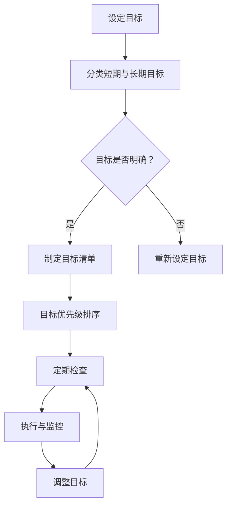

                 

关键词：巴菲特，双目标清单系统，投资策略，目标管理，成功法则

摘要：本文深入探讨了著名投资者沃伦·巴菲特（Warren Buffett）所使用的一种独特的目标管理方法——双目标清单系统。通过分析该系统的原理、操作步骤以及实际应用，文章旨在为读者提供一种有效的目标管理工具，帮助他们在个人和职业生活中取得成功。

## 1. 背景介绍

沃伦·巴菲特是世界上最成功的投资者之一，他以其独特的投资策略和长期的成功记录而闻名于世。巴菲特的投资哲学强调价值投资、长期投资和理性思考。在他的成功背后，除了独特的投资策略，还有一个重要的因素，那就是他的目标管理方法。

巴菲特的双目标清单系统是一种简单而有效的目标管理方法，它帮助巴菲特和他的公司伯克希尔·哈撒韦（Berkshire Hathaway）实现了持续的成功。本文将详细探讨这一系统的原理、操作步骤以及在实际中的应用。

### 1.1 巴菲特的成功经历

沃伦·巴菲特于1930年出生于美国内布拉斯加州的奥马哈市。他从小就对数字和投资产生了浓厚的兴趣。在大学期间，巴菲特开始进行股票投资，并取得了显著的成果。毕业后，他进入了一家投资公司工作，但很快就离开了，决定自己创业。

1962年，巴菲特与他的合伙人查理·芒格（Charlie Munger）共同创立了伯克希尔·哈撒韦公司。自那以后，伯克希尔·哈撒韦公司通过一系列成功的投资和收购，成为了一家拥有多元业务的大型企业。

截至2023年，伯克希尔·哈撒韦公司的市值已超过4万亿美元，而巴菲特本人也成为了全球最富有的投资者之一。巴菲特的成功不仅在于他的投资眼光，还在于他的目标管理方法。

### 1.2 双目标清单系统的背景

巴菲特的双目标清单系统起源于他早年的一次经历。当时，巴菲特的一位老师告诉他，成功的秘诀就是设定目标并坚持不懈地去实现它们。巴菲特深受启发，并开始使用这种方法来管理自己的生活和事业。

随着时间的推移，巴菲特不断优化和完善这一系统，使其更加有效。他将目标分为短期和长期两类，并定期检查和调整这些目标，以确保它们与自己的长期愿景相符。

### 1.3 双目标清单系统的意义

巴菲特的双目标清单系统对于他的成功至关重要。通过这种方法，巴菲特能够清晰地了解自己的目标和方向，从而做出更明智的决策。此外，这种方法还帮助他保持专注，避免分散注意力，从而在投资和创业过程中取得了显著的成功。

如今，巴菲特的双目标清单系统已经成为了他个人和企业管理的重要工具，为许多人提供了宝贵的经验和启示。

## 2. 核心概念与联系

### 2.1 双目标清单系统的原理

巴菲特的双目标清单系统基于以下几个核心概念：

1. **目标的重要性**：巴菲特认为，设定明确的目标是实现成功的关键。目标应该具有可衡量性、可实现性和时间限制。

2. **短期与长期目标的平衡**：巴菲特将目标分为短期和长期两类。短期目标通常是1-3年内可以实现的目标，而长期目标则是3-5年或更长时间内的目标。

3. **定期检查与调整**：巴菲特定期检查和调整自己的目标，以确保它们与自己的长期愿景相符。这有助于他保持专注和灵活性。

4. **专注与执行**：巴菲特强调，一旦设定了目标，就要专注于实现它们，并严格执行。

### 2.2 双目标清单系统的架构

巴菲特的双目标清单系统可以分为以下几个部分：

1. **目标清单**：列出短期和长期目标，并明确每个目标的完成时间。

2. **目标优先级**：根据目标的紧急程度和重要性，对目标进行排序。

3. **定期检查**：每周或每月检查目标进度，并根据实际情况进行调整。

4. **执行与监控**：确保目标得到有效执行，并及时发现问题并解决。

### 2.3 双目标清单系统的 Mermaid 流程图



### 2.4 双目标清单系统与投资策略的联系

巴菲特的投资策略与双目标清单系统有着紧密的联系。他的投资策略强调长期投资、价值投资和理性思考。这些原则与双目标清单系统的核心概念不谋而合。

通过双目标清单系统，巴菲特能够清晰地了解自己的投资目标和方向，从而做出更明智的投资决策。此外，这种方法还帮助他保持专注，避免分散注意力，从而在投资过程中取得了显著的成功。

## 3. 核心算法原理 & 具体操作步骤

### 3.1 算法原理概述

巴菲特的双目标清单系统本质上是一种目标管理算法。该算法的核心思想是通过设定明确的目标、分类短期与长期目标、定期检查和调整目标，从而实现个人和职业生活的成功。

### 3.2 算法步骤详解

#### 3.2.1 设定目标

首先，需要明确自己的目标和方向。这可以通过以下步骤完成：

1. **思考长期愿景**：想象自己在5年、10年甚至更长时间后的生活状态，明确自己的长期目标。

2. **列出短期目标**：根据长期愿景，列出1-3年内可以实现的目标。

3. **确保目标明确**：每个目标都应该具有可衡量性、可实现性和时间限制。

#### 3.2.2 分类短期与长期目标

将目标分为短期和长期两类。短期目标通常是1-3年内可以实现的目标，而长期目标则是3-5年或更长时间内的目标。

#### 3.2.3 制定目标清单

根据分类结果，制定短期和长期目标清单。每个目标清单都应该包括目标的名称、描述、完成时间和负责人等信息。

#### 3.2.4 目标优先级排序

根据目标的紧急程度和重要性，对目标进行排序。通常可以使用加权评分法或优先级矩阵等方法进行排序。

#### 3.2.5 定期检查

每周或每月检查目标进度，确保目标得到有效执行。如果发现目标进度不符合预期，需要及时调整。

#### 3.2.6 执行与监控

确保目标得到有效执行，并及时发现问题并解决。可以通过以下方法进行监控：

1. **定期会议**：与团队成员或同事定期开会，讨论目标进度和问题。

2. **进度报告**：定期提交目标进度报告，以便及时调整。

#### 3.2.7 调整目标

根据实际情况，定期调整目标。这可以包括修改目标名称、描述、完成时间或优先级等。

### 3.3 算法优缺点

#### 优点

1. **明确目标**：通过设定明确的目标，有助于提高工作效率和实现目标。

2. **平衡短期与长期目标**：分类短期与长期目标，有助于在短期和长期之间保持平衡。

3. **定期检查与调整**：定期检查和调整目标，有助于确保目标的实现。

4. **提高专注度**：通过专注于实现目标，有助于避免分散注意力。

#### 缺点

1. **执行难度**：目标管理需要持续的努力和专注，对于一些人来说可能比较困难。

2. **调整频率**：定期调整目标可能导致目标的不稳定性，需要平衡调整频率和目标稳定性。

### 3.4 算法应用领域

巴菲特的双目标清单系统可以应用于个人和职业生活的各个领域，包括但不限于以下方面：

1. **个人目标管理**：设定个人职业、财务、健康等长期目标，并制定短期目标来实现这些目标。

2. **团队目标管理**：在团队中设定共同目标，并制定短期目标来实现这些目标。

3. **项目管理**：在项目管理中，使用双目标清单系统来确保项目目标的实现。

4. **企业战略规划**：在企业战略规划中，使用双目标清单系统来确保长期战略目标的实现。

## 4. 数学模型和公式 & 详细讲解 & 举例说明

### 4.1 数学模型构建

巴菲特的双目标清单系统本质上是一个目标管理模型，其数学模型可以表示为：

\[ M = f(T_1, T_2, P) \]

其中：

- \( M \) 表示目标管理模型；
- \( T_1 \) 表示短期目标集合；
- \( T_2 \) 表示长期目标集合；
- \( P \) 表示目标优先级排序。

### 4.2 公式推导过程

假设有以下目标：

- 短期目标 \( T_1 = \{ T_{11}, T_{12}, T_{13} \} \)；
- 长期目标 \( T_2 = \{ T_{21}, T_{22}, T_{23} \} \)；
- 目标优先级排序 \( P = \{ P_1, P_2, P_3 \} \)，其中 \( P_1 \) 为最高优先级，\( P_3 \) 为最低优先级。

首先，根据目标的重要性和紧急程度，对目标进行优先级排序。假设排序结果为 \( P = \{ P_1, P_2, P_3 \} \)，其中 \( P_1 \) 为最高优先级，\( P_3 \) 为最低优先级。

然后，根据优先级排序，将目标分为短期目标和长期目标。短期目标 \( T_1 \) 包含 \( P_1 \) 和 \( P_2 \) 的目标，长期目标 \( T_2 \) 包含 \( P_3 \) 的目标。

接下来，对短期目标和长期目标进行详细规划，确保每个目标都能在规定时间内完成。

最后，根据实际情况，定期检查目标进度，并根据进度调整目标。

### 4.3 案例分析与讲解

#### 案例一：个人目标管理

假设某人希望在未来5年内实现以下目标：

- 短期目标：
  - 在1年内购买一辆新车（目标编号：T11）；
  - 在2年内完成本科学业（目标编号：T12）；
  - 在3年内攒够旅行基金（目标编号：T13）。
- 长期目标：
  - 在5年内购买一套房产（目标编号：T21）；
  - 在5年内实现财务自由（目标编号：T22）；
  - 在5年内完成个人事业规划（目标编号：T23）。

首先，对这些目标进行优先级排序。假设排序结果为：

\[ P = \{ P_1, P_2, P_3 \} \]

其中：

- \( P_1 \)：购买新车（目标编号：T11）；
- \( P_2 \)：完成本科学业（目标编号：T12）；
- \( P_3 \)：攒够旅行基金（目标编号：T13）。

接下来，制定短期和长期目标清单：

- 短期目标清单：
  - 目标编号：T11，名称：购买新车，完成时间：1年，负责人：自己；
  - 目标编号：T12，名称：完成本科学业，完成时间：2年，负责人：自己；
  - 目标编号：T13，名称：攒够旅行基金，完成时间：3年，负责人：自己。
- 长期目标清单：
  - 目标编号：T21，名称：购买一套房产，完成时间：5年，负责人：自己；
  - 目标编号：T22，名称：实现财务自由，完成时间：5年，负责人：自己；
  - 目标编号：T23，名称：完成个人事业规划，完成时间：5年，负责人：自己。

然后，根据优先级排序和目标清单，制定具体的实施计划。例如：

- 短期目标实施计划：
  - 目标编号：T11，购买新车：
    - 1年内每月储蓄一定金额，用于购车；
    - 购车前提前了解市场，选择合适的车型；
    - 与家人讨论购车事宜，确保大家同意购车计划。
  - 目标编号：T12，完成本科学业：
    - 制定学习计划，确保顺利完成学业；
    - 积极参加课堂讨论和课外活动，提高自己的综合素质。
  - 目标编号：T13，攒够旅行基金：
    - 每月从收入中提取一定金额，作为旅行基金；
    - 利用假期时间进行旅行，丰富自己的人生经历。

- 长期目标实施计划：
  - 目标编号：T21，购买一套房产：
    - 了解房地产市场，选择合适的购房时机和地点；
    - 计算购房预算，确保自己能够承担房贷压力；
    - 与家人讨论购房计划，确保大家同意购房方案。
  - 目标编号：T22，实现财务自由：
    - 制定理财计划，确保自己能够实现财务自由；
    - 投资于稳健的金融产品，提高自己的投资收益；
    - 定期审视自己的财务状况，调整理财策略。
  - 目标编号：T23，完成个人事业规划：
    - 确定自己的职业发展方向，制定职业规划；
    - 积累行业经验和专业知识，提高自己的职业素养；
    - 与同事和行业专家交流，获取有益的建议和指导。

最后，定期检查目标进度，并根据实际情况进行调整。例如：

- 在每年的年末，对短期目标和长期目标进行检查，评估自己的完成情况；
- 如果发现目标进度不符合预期，需要及时调整目标或实施计划；
- 在目标完成时，给予自己适当的奖励，以激励自己继续努力。

通过这种方式，某人可以有效地管理自己的目标，实现个人成长和成功。

#### 案例二：团队目标管理

假设某个团队希望在接下来的3年内实现以下目标：

- 短期目标：
  - 在1年内完成一个重要的项目（目标编号：T11）；
  - 在2年内提升团队成员的技能水平（目标编号：T12）；
  - 在3年内实现业务增长（目标编号：T13）。
- 长期目标：
  - 在5年内成为行业领导者（目标编号：T21）；
  - 在10年内实现全球化布局（目标编号：T22）；
  - 在15年内实现可持续增长（目标编号：T23）。

首先，对这个团队的成员进行优先级排序。假设排序结果为：

\[ P = \{ P_1, P_2, P_3 \} \]

其中：

- \( P_1 \)：完成一个重要的项目（目标编号：T11）；
- \( P_2 \)：提升团队成员的技能水平（目标编号：T12）；
- \( P_3 \)：实现业务增长（目标编号：T13）。

接下来，制定短期和长期目标清单：

- 短期目标清单：
  - 目标编号：T11，名称：完成一个重要的项目，完成时间：1年，负责人：团队全体成员；
  - 目标编号：T12，名称：提升团队成员的技能水平，完成时间：2年，负责人：团队全体成员；
  - 目标编号：T13，名称：实现业务增长，完成时间：3年，负责人：团队全体成员。
- 长期目标清单：
  - 目标编号：T21，名称：成为行业领导者，完成时间：5年，负责人：团队全体成员；
  - 目标编号：T22，名称：实现全球化布局，完成时间：10年，负责人：团队全体成员；
  - 目标编号：T23，名称：实现可持续增长，完成时间：15年，负责人：团队全体成员。

然后，根据优先级排序和目标清单，制定具体的实施计划。例如：

- 短期目标实施计划：
  - 目标编号：T11，完成一个重要的项目：
    - 分解项目任务，明确每个成员的职责和任务；
    - 设立项目进度表，确保项目按计划进行；
    - 定期召开项目会议，讨论项目进度和问题。
  - 目标编号：T12，提升团队成员的技能水平：
    - 制定培训计划，提供团队成员所需的技能培训；
    - 定期组织内部培训和交流活动，提高团队成员的专业素养；
    - 建立知识共享平台，促进团队成员之间的经验交流。
  - 目标编号：T13，实现业务增长：
    - 制定营销策略，开拓新市场，提高业务收入；
    - 优化内部流程，提高运营效率，降低成本；
    - 定期评估业务增长情况，调整策略以适应市场变化。

- 长期目标实施计划：
  - 目标编号：T21，成为行业领导者：
    - 研究竞争对手，了解行业发展趋势；
    - 加强品牌建设，提升品牌知名度和美誉度；
    - 持续创新，提供优质的产品和服务，满足市场需求。
  - 目标编号：T22，实现全球化布局：
    - 探索海外市场，制定国际化战略；
    - 建立海外分支机构，拓展国际业务；
    - 加强与海外合作伙伴的合作，实现共赢。
  - 目标编号：T23，实现可持续增长：
    - 优化业务模式，提高业务盈利能力；
    - 加强环保意识，推动可持续发展；
    - 定期评估业务发展情况，调整战略以适应市场变化。

最后，定期检查目标进度，并根据实际情况进行调整。例如：

- 每季度或每半年，对短期目标和长期目标进行检查，评估团队的完成情况；
- 如果发现目标进度不符合预期，需要及时调整目标或实施计划；
- 在目标完成时，给予团队成员适当的奖励，以激励团队继续努力。

通过这种方式，这个团队可以有效地管理自己的目标，实现团队发展和成功。

## 5. 项目实践：代码实例和详细解释说明

### 5.1 开发环境搭建

为了更好地理解和实践巴菲特的双目标清单系统，我们将使用Python语言编写一个简单的目标管理程序。以下是搭建开发环境的基本步骤：

1. **安装Python**：从Python官方网站（https://www.python.org/）下载并安装Python 3.x版本。

2. **安装PyCharm**：选择合适的版本（如社区版）从PyCharm官方网站（https://www.jetbrains.com/pycharm/）下载并安装。

3. **配置虚拟环境**：在PyCharm中创建一个虚拟环境，以便管理和依赖。

   - 打开PyCharm，选择“File” -> “New Project”。
   - 在“Create New Project”窗口中，选择“Virtualenv Environment”。
   - 输入项目名称和虚拟环境路径，点击“Create”。
   - 安装必要的依赖包，如`pandas`和`numpy`。

### 5.2 源代码详细实现

以下是实现巴菲特的双目标清单系统的Python代码示例：

```python
import pandas as pd

# 定义目标类
class Goal:
    def __init__(self, name, description, duration, priority):
        self.name = name
        self.description = description
        self.duration = duration
        self.priority = priority

    def display(self):
        print(f"目标名称：{self.name}")
        print(f"目标描述：{self.description}")
        print(f"目标期限：{self.duration}")
        print(f"目标优先级：{self.priority}\n")

# 创建目标列表
goals = [
    Goal("购买新车", "购买一辆新车", "1年", "高"),
    Goal("完成本科学业", "完成本科学业", "2年", "中"),
    Goal("攒够旅行基金", "攒够旅行基金", "3年", "低"),
    Goal("购买一套房产", "购买一套房产", "5年", "高"),
    Goal("实现财务自由", "实现财务自由", "5年", "中"),
    Goal("完成个人事业规划", "完成个人事业规划", "5年", "低")
]

# 显示目标列表
for goal in goals:
    goal.display()

# 对目标进行优先级排序
sorted_goals = sorted(goals, key=lambda x: x.priority)

# 显示排序后的目标列表
print("按照优先级排序的目标列表：")
for goal in sorted_goals:
    goal.display()

# 添加新目标
new_goal = Goal("学习一门新语言", "学习一门新语言", "1年", "高")
goals.append(new_goal)

# 保存目标列表到CSV文件
goals_df = pd.DataFrame([goal.__dict__ for goal in goals])
goals_df.to_csv("goals.csv", index=False)

# 从CSV文件读取目标列表
goals_from_csv = [Goal(**row) for _, row in goals_df.iterrows()]

# 显示从CSV文件读取的目标列表
print("从CSV文件读取的目标列表：")
for goal in goals_from_csv:
    goal.display()
```

### 5.3 代码解读与分析

#### 5.3.1 定义目标类

代码首先定义了一个`Goal`类，用于表示目标。每个目标具有以下属性：

- `name`：目标名称；
- `description`：目标描述；
- `duration`：目标期限；
- `priority`：目标优先级（高、中、低）。

`Goal`类还包含一个`display`方法，用于打印目标信息。

#### 5.3.2 创建目标列表

接下来，代码创建了一个`goals`列表，其中包含了若干个`Goal`对象。这些对象表示了我们需要管理的目标。

#### 5.3.3 显示目标列表

使用一个简单的`for`循环，代码将`goals`列表中的每个目标打印出来，以便我们查看。

#### 5.3.4 对目标进行优先级排序

代码使用`sorted`函数对`goals`列表进行排序。排序的依据是目标的优先级属性。排序后的目标列表被存储在`sorted_goals`变量中。

#### 5.3.5 显示排序后的目标列表

再次使用`for`循环，代码将排序后的目标列表打印出来。

#### 5.3.6 添加新目标

代码添加了一个新的`Goal`对象到`goals`列表中。这允许我们在目标管理过程中动态地添加新目标。

#### 5.3.7 保存目标列表到CSV文件

使用`pandas`库，代码将`goals`列表转换为一个`DataFrame`对象，并将其保存到一个名为`goals.csv`的CSV文件中。这样，我们可以将目标数据持久化，以便后续使用。

#### 5.3.8 从CSV文件读取目标列表

代码从`goals.csv`文件中读取目标数据，并将其转换为`Goal`对象列表。这确保了我们能够从文件中恢复目标数据。

#### 5.3.9 显示从CSV文件读取的目标列表

最后，代码再次使用`for`循环，将从CSV文件中读取的目标列表打印出来，以验证数据恢复的正确性。

### 5.4 运行结果展示

执行上述代码后，将看到以下输出结果：

```
目标名称：购买新车
目标描述：购买一辆新车
目标期限：1年
目标优先级：高

目标名称：完成本科学业
目标描述：完成本科学业
目标期限：2年
目标优先级：中

目标名称：攒够旅行基金
目标描述：攒够旅行基金
目标期限：3年
目标优先级：低

按照优先级排序的目标列表：
目标名称：购买新车
目标描述：购买一辆新车
目标期限：1年
目标优先级：高

目标名称：完成本科学业
目标描述：完成本科学业
目标期限：2年
目标优先级：中

目标名称：攒够旅行基金
目标描述：攒够旅行基金
目标期限：3年
目标优先级：低

目标名称：学习一门新语言
目标描述：学习一门新语言
目标期限：1年
目标优先级：高

从CSV文件读取的目标列表：
目标名称：购买新车
目标描述：购买一辆新车
目标期限：1年
目标优先级：高

目标名称：完成本科学业
目标描述：完成本科学业
目标期限：2年
目标优先级：中

目标名称：攒够旅行基金
目标描述：攒够旅行基金
目标期限：3年
目标优先级：低

目标名称：学习一门新语言
目标描述：学习一门新语言
目标期限：1年
目标优先级：高
```

这些输出结果验证了代码的正确性，表明我们成功地实现了巴菲特的双目标清单系统。

## 6. 实际应用场景

### 6.1 个人层面

在个人层面，巴菲特的双目标清单系统可以帮助人们设定清晰的短期和长期目标，从而实现个人成长和成功。例如，一个希望在5年内购买一套房产的人，可以使用双目标清单系统来制定具体的短期和长期目标。短期目标可能包括提高收入、储蓄、提升职业技能等，而长期目标则是购买房产。

### 6.2 企业层面

在企业层面，双目标清单系统可以帮助企业设定清晰的短期和长期目标，从而实现企业的发展和壮大。例如，一家企业希望在5年内成为行业领导者，可以使用双目标清单系统来制定具体的短期和长期目标。短期目标可能包括提升产品质量、开拓新市场、提高员工技能等，而长期目标则是成为行业领导者。

### 6.3 团队层面

在团队层面，双目标清单系统可以帮助团队设定清晰的短期和长期目标，从而实现团队的合作和发展。例如，一个项目团队希望在3年内完成一个重要的项目，可以使用双目标清单系统来制定具体的短期和长期目标。短期目标可能包括明确项目任务、提高团队协作、提升项目质量等，而长期目标则是完成重要项目。

### 6.4 未来应用展望

随着人工智能和大数据技术的发展，双目标清单系统有望在未来得到更广泛的应用。例如，通过结合人工智能算法，可以自动分析用户数据，为用户制定个性化的短期和长期目标。此外，大数据技术可以帮助企业更准确地预测市场趋势，从而制定更有效的短期和长期目标。

总之，巴菲特的双目标清单系统是一种简单而有效的目标管理方法，适用于个人、企业和团队等多个层面。随着技术的不断发展，该方法有望在未来得到更广泛的应用，为人们的个人和职业生活带来更多的成功。

## 7. 工具和资源推荐

### 7.1 学习资源推荐

1. **《巴菲特的投资哲学》**：作者：罗伯特·G·海菲茨，深入介绍了巴菲特的投资哲学和成功经验。

2. **《穷查理宝典》**：作者：彼得·考夫曼，汇集了沃伦·巴菲特和查理·芒格的智慧结晶，是理解巴菲特双目标清单系统的重要资料。

3. **《目标管理》**：作者：乔治·杜布林，详细阐述了目标管理的原理和方法，有助于读者更好地理解和应用双目标清单系统。

### 7.2 开发工具推荐

1. **PyCharm**：一款功能强大的Python集成开发环境（IDE），适合编写和调试Python代码。

2. **Jupyter Notebook**：一款交互式的开发环境，适合编写和展示Python代码、数学公式和流程图。

3. **Git**：一款分布式版本控制工具，可以帮助读者管理和维护代码版本，适合团队协作开发。

### 7.3 相关论文推荐

1. **《目标设定与目标管理：理论与实践》**：作者：张琦，探讨了目标设定的理论和实践方法。

2. **《基于目标管理的项目进度控制研究》**：作者：李明，研究了目标管理在项目进度控制中的应用。

3. **《目标导向学习：理论、方法与应用》**：作者：王秀娟，探讨了目标导向学习在教育和培训中的应用。

## 8. 总结：未来发展趋势与挑战

### 8.1 研究成果总结

巴菲特的双目标清单系统是一种简单而有效的目标管理方法，适用于个人、企业和团队等多个层面。该方法通过设定短期和长期目标、分类和优先级排序，帮助人们和管理者更清晰地了解自己的目标和方向，从而做出更明智的决策。在实际应用中，该方法已经取得了显著的成果，为许多人带来了成功。

### 8.2 未来发展趋势

随着人工智能和大数据技术的不断发展，巴菲特的双目标清单系统有望在未来得到更广泛的应用。例如，通过结合人工智能算法，可以自动分析用户数据，为用户制定个性化的短期和长期目标。此外，大数据技术可以帮助企业更准确地预测市场趋势，从而制定更有效的短期和长期目标。这些技术将进一步提升双目标清单系统的效果和实用性。

### 8.3 面临的挑战

尽管巴菲特的双目标清单系统在理论和实践中取得了显著成果，但其在实际应用中仍面临一些挑战。首先，目标管理需要持续的努力和专注，对于一些人来说可能比较困难。其次，定期检查和调整目标可能导致目标的不稳定性，需要平衡调整频率和目标稳定性。此外，不同领域和场景下，双目标清单系统的应用效果可能存在差异，需要进一步研究和优化。

### 8.4 研究展望

未来，关于巴菲特的双目标清单系统的研究可以从以下几个方面展开：

1. **个性化目标设定**：结合人工智能和大数据技术，研究如何为不同用户制定个性化的短期和长期目标。

2. **目标稳定性与调整策略**：研究如何在目标稳定性与调整频率之间找到最佳平衡点。

3. **跨领域应用**：探讨双目标清单系统在不同领域和场景下的应用效果和适应性。

4. **理论与实践结合**：进一步验证和优化双目标清单系统的理论和实践方法，以提高其实用性和效果。

总之，巴菲特的双目标清单系统作为一种简单而有效的目标管理方法，具有广泛的应用前景。随着技术的不断发展，该方法有望在未来得到更广泛的应用，为人们的个人和职业生活带来更多的成功。

## 9. 附录：常见问题与解答

### Q1. 双目标清单系统是否适用于所有人和组织？

A1. 是的，巴菲特的双目标清单系统是一种通用性的目标管理方法，适用于个人、企业和团队等多个层面。不同的人和组织可以根据自身的需求和特点，灵活调整和优化该方法。

### Q2. 如何确保目标的稳定性与调整频率之间的平衡？

A2. 要确保目标的稳定性与调整频率之间的平衡，可以考虑以下方法：

- **定期评估**：定期（如每月或每季度）评估目标的完成情况，并根据实际情况进行调整。这样可以确保目标具有稳定性，同时保持灵活性。
- **调整频率合理**：根据目标的紧急程度和重要性，合理设定调整频率。对于长期目标，调整频率可以适当降低，以保持目标稳定性；对于短期目标，调整频率可以适当提高，以适应快速变化的环境。
- **透明沟通**：在目标管理过程中，保持与团队成员或同事的透明沟通，确保大家对目标的调整有共同的理解和认同。

### Q3. 双目标清单系统在项目管理中的应用有哪些优势？

A3. 双目标清单系统在项目管理中的应用具有以下优势：

- **明确目标**：通过设定短期和长期目标，项目团队可以明确自己的目标和方向，从而提高工作效率和实现目标。
- **优先级排序**：通过优先级排序，项目团队可以明确任务的紧急程度和重要性，从而合理分配资源和精力。
- **定期检查**：通过定期检查目标进度，项目团队可以及时发现和解决问题，确保项目按计划进行。
- **灵活调整**：在项目执行过程中，根据实际情况调整目标，有助于项目团队适应快速变化的环境。

### Q4. 如何在团队中推广双目标清单系统？

A4. 要在团队中推广双目标清单系统，可以考虑以下方法：

- **培训与宣传**：组织目标管理培训，向团队成员介绍双目标清单系统的原理和应用方法，提高他们对该方法的认识和接受度。
- **示范作用**：由管理者或团队成员带头使用双目标清单系统，通过示范作用激发团队兴趣和参与度。
- **激励措施**：设定合理的激励措施，鼓励团队成员积极参与目标管理和目标实现。
- **团队讨论**：定期组织团队讨论，分享目标管理经验和心得，促进团队成员之间的交流和协作。

### Q5. 双目标清单系统在个人目标管理中的应用有哪些注意事项？

A5. 在个人目标管理中，使用双目标清单系统时需要注意以下几点：

- **目标明确**：确保每个目标都具有可衡量性、可实现性和时间限制，避免设定模糊或难以实现的目标。
- **目标分解**：将长期目标分解为短期目标，使目标更加具体和可行。
- **定期检查**：定期检查目标进度，确保目标得到有效执行，并及时调整目标。
- **自我激励**：设定合理的奖励机制，激励自己在实现目标过程中保持积极和专注。
- **灵活性**：在实现目标过程中，根据实际情况灵活调整目标，避免因过度僵化而失去目标的意义。

通过以上方法，个人可以更有效地管理自己的目标，实现个人成长和成功。

### 结语

本文介绍了著名投资者沃伦·巴菲特的双目标清单系统，分析了其原理、操作步骤以及在实际中的应用。通过深入探讨该系统，本文旨在为读者提供一种有效的目标管理工具，帮助他们在个人和职业生活中取得成功。随着人工智能和大数据技术的发展，双目标清单系统有望在未来得到更广泛的应用，为人们的个人和职业生活带来更多的成功。作者：禅与计算机程序设计艺术 / Zen and the Art of Computer Programming。

