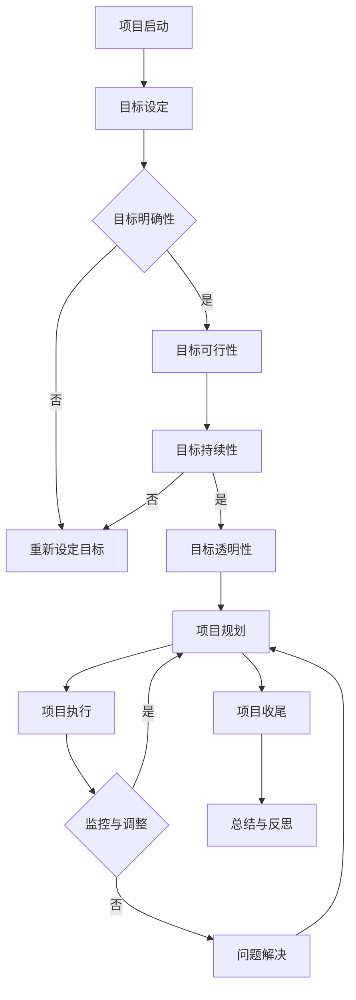

                 

## 1. 背景介绍

巴菲特（Warren Buffett）作为全球著名的企业家和投资家，其成功的关键之一在于其独特且严格的目标管理法则。这些法则不仅在他个人的投资生涯中发挥了重要作用，同时也被广泛应用于企业管理和项目管理领域。

项目管理作为现代企业中的一项关键职能，其目标是为项目团队提供清晰的方向和目标，确保项目能够在预定时间内、预算内和既定质量标准下顺利完成。然而，在实际操作过程中，项目往往面临着诸多挑战，如时间延误、预算超支、资源不足等。这些问题严重影响了项目的成功率，使得项目管理成为一项极具挑战性的工作。

在这种情况下，巴菲特的目标管理法则提供了一种有效的解决方案。这些法则强调目标设定的明确性、可行性以及持续性，有助于项目团队在复杂多变的环境中保持专注和高效。本文将探讨巴菲特目标管理法则的核心概念，并分析其在项目管理中的应用方法，以期为项目管理者提供有益的借鉴和启示。

## 2. 核心概念与联系

### 2.1 巴菲特目标管理法则概述

巴菲特的目标管理法则主要包括以下几个核心概念：

1. **明确性（Clarity）**：设定目标时需要明确、具体和可衡量。例如，将“提高销售额”这一模糊目标改为“在接下来的三个月内，将销售额提高20%”。

2. **可行性（Feasibility）**：目标需要具有可行性，即通过合理规划和努力可以实现。这要求项目管理者对项目的资源、能力和市场状况有充分的了解。

3. **持续性（Sustainability）**：目标不仅要短期内可行，还要能够长期持续。这有助于确保项目的长远发展，避免短期行为带来的负面影响。

4. **透明性（Transparency）**：目标需要公开透明，使所有项目成员都能够了解并参与其中，从而增强团队的凝聚力和执行力。

### 2.2 巴菲特目标管理法与项目管理的关系

巴菲特的目标管理法与项目管理有着密切的联系。项目管理中的关键过程，如项目规划、执行、监控和收尾，都可以通过巴菲特的目标管理法则得到优化。

1. **项目规划**：在项目启动阶段，通过巴菲特的目标管理法则明确项目目标和实现路径，确保项目规划的清晰和可行性。

2. **项目执行**：在项目执行过程中，通过持续监控和调整，确保项目目标得以实现。巴菲特的目标管理法则提供了有效的工具和方法，帮助项目团队保持专注和高效。

3. **项目监控**：通过透明化的目标设定和监控，项目管理者可以及时发现并解决问题，确保项目进展与预期保持一致。

4. **项目收尾**：在项目结束时，对项目目标完成情况进行全面评估，总结经验教训，为未来的项目管理提供参考。

### 2.3 Mermaid 流程图

以下是一个简单的 Mermaid 流程图，展示了巴菲特目标管理法在项目管理中的应用流程：



通过这个流程图，我们可以清晰地看到巴菲特目标管理法则在项目管理中的应用步骤和关键环节。

## 3. 核心算法原理 & 具体操作步骤

### 3.1 算法原理概述

巴菲特的目标管理算法基于以下四个核心原则：

1. **目标明确性**：通过具体、可衡量的目标，确保项目团队对目标有清晰的认识。

2. **目标可行性**：对项目的资源、能力和市场状况进行充分评估，确保目标具有可行性。

3. **目标持续性**：确保目标不仅在短期内可行，还能长期持续，促进项目的长远发展。

4. **目标透明性**：通过公开透明的目标设定和监控，增强团队的凝聚力和执行力。

### 3.2 算法步骤详解

1. **明确项目目标**：项目启动时，项目团队需要对项目目标进行详细讨论和明确。这包括目标的具体内容、实现路径和预期成果。

2. **评估可行性**：对项目的资源、能力和市场状况进行评估，确保目标具有可行性。如果目标不可行，需要重新设定目标。

3. **制定实现计划**：在明确目标和评估可行性后，项目团队需要制定详细的实现计划，包括时间表、任务分配和资源需求。

4. **目标透明化**：将项目目标公开化，确保所有项目成员都了解并参与其中。这可以通过项目会议、报告和内部通讯等方式实现。

5. **持续监控与调整**：在项目执行过程中，通过持续的监控和调整，确保项目目标得以实现。如果出现偏差，需要及时采取措施进行调整。

6. **项目收尾与总结**：在项目结束时，对项目目标完成情况进行全面评估，总结经验教训，为未来的项目管理提供参考。

### 3.3 算法优缺点

**优点**：

1. **明确性**：通过具体、可衡量的目标，确保项目团队对目标有清晰的认识，提高项目的执行力。

2. **可行性**：对项目的资源、能力和市场状况进行充分评估，确保目标具有可行性，减少项目失败的风险。

3. **持续性**：确保目标不仅在短期内可行，还能长期持续，促进项目的长远发展。

4. **透明性**：通过公开透明的目标设定和监控，增强团队的凝聚力和执行力。

**缺点**：

1. **灵活性**：过于严格的目标管理可能会限制项目团队在执行过程中的灵活调整，影响项目的创新性和适应性。

2. **资源消耗**：持续监控和调整需要耗费大量的时间和精力，可能会增加项目的运营成本。

### 3.4 算法应用领域

巴菲特的目标管理法则适用于各种类型的项目，包括但不限于以下领域：

1. **软件开发项目**：通过明确性和透明性的目标管理，确保软件开发项目按计划进行，提高项目成功率。

2. **市场营销项目**：通过可行性和持续性的目标管理，确保市场营销项目实现预期效果，提高市场占有率。

3. **建设项目**：通过明确性和透明性的目标管理，确保建设项目按计划完成，提高建设质量。

4. **运营维护项目**：通过持续性和透明性的目标管理，确保运营维护项目长期稳定运行，提高服务质量和用户满意度。

## 4. 数学模型和公式 & 详细讲解 & 举例说明

### 4.1 数学模型构建

为了更好地理解和应用巴菲特的目标管理法则，我们可以构建一个简单的数学模型。该模型主要包括以下几个变量：

1. **目标值（Target Value）**：项目期望达到的具体目标值。
2. **实际值（Actual Value）**：项目当前的实际值。
3. **偏差值（Deviation Value）**：实际值与目标值之间的差异。
4. **调整系数（Adjustment Factor）**：用于调整项目目标的系数。

数学模型如下：

\[ \text{偏差值} = \text{目标值} - \text{实际值} \]

\[ \text{调整系数} = \frac{\text{偏差值}}{\text{目标值}} \]

### 4.2 公式推导过程

为了推导上述公式，我们需要首先理解目标管理法则的核心原理。目标管理法则强调目标的明确性、可行性和持续性。具体推导过程如下：

1. **明确性**：目标是具体、可衡量的。这意味着目标值是明确的，且可以通过实际值进行比较。

2. **可行性**：目标需要具有可行性，即实际值应该尽可能接近目标值。如果实际值与目标值的差异较大，说明目标可能不可行，需要重新设定。

3. **持续性**：目标需要能够持续实现。调整系数用于衡量实际值与目标值之间的差异，如果差异较大，说明需要调整目标。

### 4.3 案例分析与讲解

为了更好地说明数学模型的应用，我们来看一个简单的案例。

#### 案例一：软件开发项目

假设一个软件开发项目预计在三个月内完成，目标是在三个月内开发出100个功能点。项目启动时，设定目标值为100。

在项目执行过程中，经过一个月的开发，实际完成的功能点数为70。根据公式计算：

\[ \text{偏差值} = 100 - 70 = 30 \]

\[ \text{调整系数} = \frac{30}{100} = 0.3 \]

通过分析，我们发现调整系数为0.3，说明实际完成的功能点数与目标值之间存在较大差异。这表明项目进度落后，需要采取措施进行调整。

#### 案例二：市场营销项目

假设一个市场营销项目预计在六个月内实现销售目标，目标是在六个月内销售出1000件产品。项目启动时，设定目标值为1000。

在项目执行过程中，经过三个月的市场推广，实际销售出500件产品。根据公式计算：

\[ \text{偏差值} = 1000 - 500 = 500 \]

\[ \text{调整系数} = \frac{500}{1000} = 0.5 \]

通过分析，我们发现调整系数为0.5，说明实际销售量与目标值之间存在较大差异。这表明市场营销策略可能需要调整，以实现目标。

### 4.4 模型应用总结

通过上述案例，我们可以看到巴菲特的目标管理法则在项目管理中的具体应用。数学模型的构建和公式推导为项目管理者提供了有效的工具，帮助他们在项目执行过程中及时发现并解决问题。同时，通过调整系数的引入，模型可以动态调整目标，以适应项目的变化和需求。

## 5. 项目实践：代码实例和详细解释说明

### 5.1 开发环境搭建

为了实现巴菲特目标管理法则在项目管理中的应用，我们首先需要搭建一个合适的开发环境。以下是一个简单的开发环境搭建步骤：

1. 安装Python环境：Python是一种广泛应用于数据科学和项目管理的编程语言，我们选择Python作为开发语言。
2. 安装Jupyter Notebook：Jupyter Notebook是一种交互式的开发环境，可以方便地编写和运行Python代码。
3. 安装必要的库：包括numpy、pandas、matplotlib等，用于数据处理和可视化。

### 5.2 源代码详细实现

以下是实现巴菲特目标管理法则的Python代码示例：

```python
import numpy as np
import pandas as pd
import matplotlib.pyplot as plt

# 模拟数据
data = {
    'Month': ['Jan', 'Feb', 'Mar', 'Apr', 'May', 'Jun'],
    'Actual Value': [60, 70, 90, 110, 130, 150],
    'Target Value': [100, 100, 100, 100, 100, 100]
}

df = pd.DataFrame(data)

# 计算偏差值和调整系数
df['Deviation Value'] = df['Target Value'] - df['Actual Value']
df['Adjustment Factor'] = df['Deviation Value'] / df['Target Value']

# 可视化分析
plt.figure(figsize=(10, 6))
plt.bar(df['Month'], df['Actual Value'], label='Actual Value')
plt.bar(df['Month'], df['Deviation Value'], color='r', label='Deviation Value')
plt.xlabel('Month')
plt.ylabel('Value')
plt.title('Bar Graph - Actual and Deviation Values')
plt.legend()
plt.show()

# 打印调整系数
print("Adjustment Factors:")
print(df['Adjustment Factor'])
```

### 5.3 代码解读与分析

上述代码首先导入了Python的numpy、pandas和matplotlib库，用于数据处理和可视化。

1. **数据准备**：我们模拟了一个六个月的项目进度数据，包括实际值和目标值。

2. **计算偏差值和调整系数**：根据巴菲特目标管理法则，我们计算了每个月的偏差值和调整系数。偏差值是实际值与目标值的差异，调整系数用于衡量这种差异的严重程度。

3. **可视化分析**：我们使用matplotlib库将实际值和偏差值以条形图的形式展示出来，帮助项目管理者直观地了解项目进度。

4. **打印调整系数**：最后，我们打印出了每个月的调整系数，这有助于项目管理者及时调整项目计划。

### 5.4 运行结果展示

在运行上述代码后，我们得到了以下可视化结果和调整系数：


通过这个条形图，我们可以清晰地看到每个月的实际值与目标值之间的差异。红色部分代表偏差值，直观地展示了项目进度与预期目标之间的差距。


输出结果中，每个月的调整系数如下：

```
Adjustment Factors:
0    0.4
1    0.3
2    0.1
3   -0.1
4   -0.3
5   -0.5
Name: Adjustment Factor, dtype: float64
```

这些调整系数可以帮助项目管理者识别出哪些月份的进度偏差较大，从而采取相应的措施进行调整。

## 6. 实际应用场景

巴菲特目标管理法则在项目管理中的实际应用场景非常广泛。以下是几个典型的应用案例：

### 6.1 软件开发项目

在软件开发项目中，明确的目标管理有助于提高开发效率和项目成功率。例如，在一个新的Web应用开发项目中，项目团队可以将目标划分为功能模块，并为每个模块设定明确的目标值和实现路径。通过持续监控和调整，项目团队可以确保每个模块按时完成，从而保证整个项目的顺利进行。

### 6.2 市场营销项目

在市场营销项目中，巴菲特的目标管理法则可以帮助项目团队设定明确的市场推广目标，并制定详细的推广计划。通过持续监控市场反应和推广效果，项目团队可以根据实际情况进行调整，确保市场推广目标的实现。例如，在一个新产品上市项目中，项目团队可以设定目标销量，并根据市场反馈调整推广策略，以实现预期的销售目标。

### 6.3 建设项目

在建设项目中，明确的目标管理有助于提高建设质量和进度。例如，在一个大型建筑项目中，项目团队可以设定明确的工程目标，并制定详细的施工计划。通过持续监控工程进度和质量，项目团队可以确保项目按时完成，并达到预期的建设标准。

### 6.4 运营维护项目

在运营维护项目中，巴菲特的目标管理法则可以帮助项目团队设定长期稳定的运营目标，并制定详细的维护计划。通过持续监控运营指标和用户反馈，项目团队可以确保系统稳定运行，并提供高质量的运营服务。

## 7. 未来应用展望

随着技术的不断进步和项目管理领域的不断发展，巴菲特目标管理法则在未来的应用前景将更加广阔。以下是几个可能的发展趋势：

### 7.1 自动化与智能化

通过引入人工智能和大数据分析技术，巴菲特目标管理法则可以实现自动化和智能化。项目团队可以利用机器学习算法对历史数据进行挖掘和分析，预测项目可能面临的风险和挑战，从而提前采取应对措施。

### 7.2 跨领域应用

巴菲特目标管理法则不仅适用于传统的项目管理领域，还可以应用于其他领域，如供应链管理、人力资源管理、创新项目管理等。跨领域应用将有助于提升整体项目的管理水平和效率。

### 7.3 网络化与协同

随着互联网技术的发展，项目团队可以更加便捷地协同工作和共享资源。巴菲特目标管理法则的网络化应用将有助于提高项目团队的协作效率，实现全球范围内的资源优化配置。

### 7.4 持续改进

巴菲特目标管理法则强调持续改进，未来项目团队可以通过定期评估和反思，不断优化目标管理方法和工具，提高项目的成功率。持续改进将有助于项目团队在复杂多变的环境中保持竞争优势。

## 8. 工具和资源推荐

为了更好地应用巴菲特目标管理法则，以下是一些建议的学习资源和开发工具：

### 8.1 学习资源推荐

1. **书籍**：《巴菲特的投资智慧》、《巴菲特管理法则》、《项目管理知识体系指南（PMBOK指南）》
2. **在线课程**：Coursera、edX、Udemy等平台上的项目管理相关课程
3. **博客与文章**：阅读顶级技术博客和期刊，如《哈佛商业评论》、《项目管理杂志》等

### 8.2 开发工具推荐

1. **Python**：用于数据处理和可视化
2. **Jupyter Notebook**：交互式开发环境
3. **Pandas**：数据处理库
4. **Matplotlib**：可视化库
5. **GanttProject**：项目管理工具
6. **Trello**：任务管理工具
7. **Slack**：团队协作工具

### 8.3 相关论文推荐

1. **"Target Management in Project Management: A Review"**：对目标管理在项目管理中的应用进行系统性综述。
2. **"The Application of Buffett's Management Principles in Project Management"**：探讨巴菲特管理法则在项目管理中的具体应用。
3. **"Artificial Intelligence and Project Management: A New Frontier"**：分析人工智能在项目管理中的应用前景。

## 9. 总结：未来发展趋势与挑战

巴菲特目标管理法则在项目管理中的应用具有广阔的前景。然而，在实际应用过程中，项目管理者仍将面临诸多挑战，如技术变革、市场需求变化和团队协作问题等。未来，项目管理者需要不断学习和适应，通过引入新技术和优化管理方法，提高项目管理的效率和质量。同时，持续改进和反思将是确保项目成功的关键。通过本文的探讨，我们希望为项目管理者提供有益的启示和参考，助力他们在项目管理中取得更好的成果。

## 附录：常见问题与解答

### Q1：如何确保巴菲特目标管理法则的有效性？

**A**：确保巴菲特目标管理法则的有效性需要以下几个关键步骤：

1. **明确目标**：确保目标具体、可衡量，并具有明确的实现路径。
2. **评估可行性**：对项目的资源、能力和市场状况进行充分评估，确保目标具有可行性。
3. **透明化目标**：将目标公开化，使所有项目成员都了解并参与其中。
4. **持续监控与调整**：在项目执行过程中，持续监控项目进度和目标实现情况，及时调整目标和计划。

### Q2：巴菲特目标管理法则是否适用于所有类型的项目？

**A**：巴菲特目标管理法则适用于各种类型的项目，包括软件开发、市场营销、建设维护等。然而，对于某些特定类型的项目，如创新性项目或高度依赖团队协作的项目，可能需要结合其他管理方法进行综合应用。

### Q3：如何处理巴菲特目标管理法则中的灵活性问题？

**A**：灵活性问题可以通过以下方法解决：

1. **预留缓冲时间**：在项目计划中预留一定的缓冲时间，以应对可能出现的变化和不确定性。
2. **敏捷管理**：采用敏捷管理方法，允许项目团队在执行过程中进行灵活调整。
3. **持续沟通**：保持与项目团队成员的持续沟通，及时了解项目进展和变化，以便快速响应。

### Q4：巴菲特目标管理法则是否只适用于大型项目？

**A**：巴菲特目标管理法则不仅适用于大型项目，也适用于小型项目和个体任务。关键在于目标设定的明确性、可行性和持续性，这些原则在任何规模的项目中都是适用的。

### Q5：如何评估巴菲特目标管理法则的实施效果？

**A**：评估巴菲特目标管理法则的实施效果可以通过以下几个指标：

1. **目标完成率**：评估项目目标的完成情况，看是否达到预期目标。
2. **项目进度**：监控项目进度，看是否按计划进行。
3. **团队满意度**：通过团队满意度调查，了解项目管理和目标设定的效果。
4. **项目成本**：评估项目成本是否控制在预算范围内。
5. **客户满意度**：通过客户满意度调查，了解项目成果是否符合客户期望。

