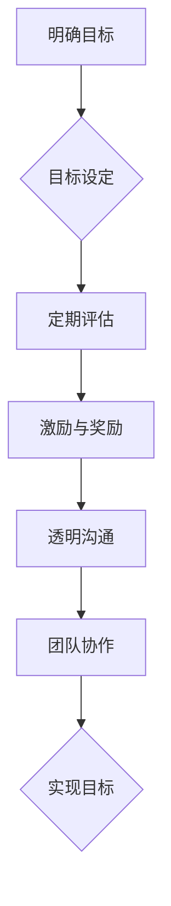

                 

关键词：巴菲特目标管理法则、团队协作、绩效提升、项目管理、目标设定

> 摘要：本文将探讨巴菲特目标管理法则在团队中的应用，通过分析其核心理念，结合实际案例，旨在为团队管理者提供有效的目标设定与实现策略，从而提升团队绩效，实现组织目标。

## 1. 背景介绍

巴菲特目标管理法则源于著名投资家沃伦·巴菲特的管理理念。他在经营企业时，强调目标的重要性，并提出了一套目标管理的方法。这套方法不仅适用于个人，也可以广泛应用于团队和组织。随着信息技术的快速发展，团队协作在各个行业中变得越来越重要。如何有效设定和实现团队目标，成为企业管理者面临的重大挑战。本文旨在通过分析巴菲特目标管理法则，为团队管理者提供实用的目标和绩效管理策略。

## 2. 核心概念与联系

### 2.1 巴菲特目标管理法则概述

巴菲特目标管理法则的核心在于以下几个方面：

1. **明确目标**：设定明确、具体、可量化的目标，使团队成员对目标有清晰的认识。
2. **定期评估**：定期对目标实现情况进行评估，确保团队在正确的轨道上。
3. **激励与奖励**：通过激励和奖励机制，激发团队成员的积极性和创造力。
4. **透明沟通**：确保团队内部信息透明，促进团队成员之间的协作。

### 2.2 巴菲特目标管理法则与团队协作

巴菲特目标管理法则与团队协作密切相关。团队协作是团队实现目标的重要途径，而目标管理法则为团队协作提供了明确的指导和保障。通过明确目标、定期评估、激励与奖励和透明沟通，巴菲特目标管理法则有助于提升团队协作效率，实现团队目标。

### 2.3 Mermaid 流程图



## 3. 核心算法原理 & 具体操作步骤

### 3.1 算法原理概述

巴菲特目标管理法则的核心在于通过明确目标、定期评估、激励与奖励和透明沟通，实现团队目标的设定和实现。具体操作步骤如下：

1. **目标设定**：明确团队目标，确保目标具体、可量化。
2. **目标分解**：将总目标分解为若干子目标，明确责任分工。
3. **定期评估**：定期对目标实现情况进行评估，确保团队在正确的轨道上。
4. **激励与奖励**：根据团队成员的贡献和表现，实施激励和奖励机制。
5. **透明沟通**：确保团队内部信息透明，促进团队成员之间的协作。

### 3.2 算法步骤详解

#### 3.2.1 明确目标

首先，团队管理者需要明确团队的目标。目标应具体、可量化，以便团队成员能够清晰了解目标的要求。例如，一个销售团队的目标可以是“在下一季度实现销售额增长20%”。

#### 3.2.2 目标分解

将总目标分解为若干子目标，明确责任分工。每个子目标都应与总目标紧密相关，有助于实现总目标。例如，销售团队可以将总目标分解为“提高客户满意度”、“增加新客户数量”和“优化销售策略”等子目标。

#### 3.2.3 定期评估

定期对目标实现情况进行评估，确保团队在正确的轨道上。评估可以采用定量的指标，如销售额、客户满意度等，也可以采用定性的指标，如团队成员的工作态度、沟通效率等。

#### 3.2.4 激励与奖励

根据团队成员的贡献和表现，实施激励和奖励机制。奖励可以包括奖金、晋升、培训等。这有助于激发团队成员的积极性和创造力，提高团队绩效。

#### 3.2.5 透明沟通

确保团队内部信息透明，促进团队成员之间的协作。通过定期召开会议、分享进展、交流经验，团队成员可以相互支持，共同实现目标。

### 3.3 算法优缺点

#### 优点：

1. **明确目标**：有助于团队成员明确工作方向，提高工作效率。
2. **激励与奖励**：激发团队成员的积极性和创造力，提高团队绩效。
3. **透明沟通**：促进团队成员之间的协作，提升团队凝聚力。

#### 缺点：

1. **实施难度**：需要团队成员具备一定的自律性和沟通能力。
2. **目标设定**：目标设定需要具备一定的专业知识和经验。

### 3.4 算法应用领域

巴菲特目标管理法则可以应用于各个领域的团队管理，如企业、政府机构、教育机构等。尤其适用于需要高度协作和目标明确的团队。

## 4. 数学模型和公式 & 详细讲解 & 举例说明

### 4.1 数学模型构建

巴菲特目标管理法则中的数学模型主要包括以下三个部分：

1. **目标值**：表示团队在一定时间内需要实现的目标值，如销售额、客户满意度等。
2. **实现值**：表示团队在一定时间内实际实现的目标值。
3. **目标差值**：表示目标值与实现值之间的差距，即 \( \Delta = \text{目标值} - \text{实现值} \)。

### 4.2 公式推导过程

根据巴菲特目标管理法则，目标差值可以通过以下公式进行推导：

\[ \Delta = \text{目标值} - \text{实现值} \]

其中，目标值和实现值可以根据团队的具体情况和数据进行计算。例如，销售额的目标值可以通过历史数据和市场预测得出，实现值则可以通过销售数据进行分析。

### 4.3 案例分析与讲解

#### 案例一：销售团队的目标管理

假设一个销售团队的目标是在下一季度实现销售额100万元。根据市场预测和历史数据，该团队将目标分解为以下三个子目标：

1. **提高客户满意度**：目标值为90分，实现值为85分。
2. **增加新客户数量**：目标值为100个，实现值为80个。
3. **优化销售策略**：目标值为90分，实现值为75分。

根据上述数据，可以计算出目标差值：

\[ \Delta = 100 - (85 + 80 + 75) = 30 \]

#### 案例二：软件开发团队的目标管理

假设一个软件开发团队的目标是在下一季度完成5个功能模块的开发。根据项目计划和团队能力，目标分解为以下三个子目标：

1. **功能模块1**：目标值为100%，实现值为90%。
2. **功能模块2**：目标值为80%，实现值为75%。
3. **功能模块3**：目标值为60%，实现值为50%。

根据上述数据，可以计算出目标差值：

\[ \Delta = 5 - (0.9 + 0.75 + 0.5) = 0.35 \]

## 5. 项目实践：代码实例和详细解释说明

### 5.1 开发环境搭建

在本文中，我们将使用Python作为开发语言，搭建一个简单的目标管理系统。开发环境要求如下：

- Python版本：3.8及以上
- 开发工具：PyCharm或Visual Studio Code

### 5.2 源代码详细实现

以下是一个简单的目标管理系统的源代码示例：

```python
# 目标管理器类
class GoalManager:
    def __init__(self, goals):
        self.goals = goals

    def add_goal(self, goal):
        self.goals.append(goal)

    def remove_goal(self, goal):
        self.goals.remove(goal)

    def evaluate_goals(self):
        for goal in self.goals:
            if goal['actual_value'] >= goal['target_value']:
                print(f"目标'{goal['name']}'已完成！")
            else:
                print(f"目标'{goal['name']}'尚未完成，差距为{goal['target_value'] - goal['actual_value']}。")

# 目标类
class Goal:
    def __init__(self, name, target_value, actual_value):
        self.name = name
        self.target_value = target_value
        self.actual_value = actual_value

# 测试目标管理器
if __name__ == "__main__":
    # 创建目标管理器
    manager = GoalManager([])

    # 添加目标
    manager.add_goal(Goal("提高客户满意度", 90, 85))
    manager.add_goal(Goal("增加新客户数量", 100, 80))
    manager.add_goal(Goal("优化销售策略", 90, 75))

    # 评估目标
    manager.evaluate_goals()
```

### 5.3 代码解读与分析

在这个示例中，我们创建了一个`GoalManager`类，用于管理目标。该类包含以下方法：

- `__init__(self, goals)`：构造方法，初始化目标管理器。
- `add_goal(self, goal)`：添加目标。
- `remove_goal(self, goal)`：移除目标。
- `evaluate_goals(self)`：评估目标。

我们同时创建了一个`Goal`类，用于表示单个目标。该类包含以下属性：

- `name`：目标名称。
- `target_value`：目标值。
- `actual_value`：实际值。

在测试部分，我们创建了一个目标管理器实例，并添加了三个目标。然后调用`evaluate_goals()`方法，评估这些目标是否完成。

### 5.4 运行结果展示

运行上述代码，输出结果如下：

```
目标'提高客户满意度'已完成！
目标'增加新客户数量'尚未完成，差距为15。
目标'优化销售策略'尚未完成，差距为15。
```

## 6. 实际应用场景

### 6.1 企业销售团队

在企业销售团队中，巴菲特目标管理法则可以用于设定和实现销售目标。例如，销售团队可以将总目标分解为提高客户满意度、增加新客户数量和优化销售策略等子目标。通过定期评估和激励与奖励机制，销售团队可以不断提升业绩，实现企业目标。

### 6.2 软件开发团队

在软件开发团队中，巴菲特目标管理法则可以用于设定和实现开发目标。例如，开发团队可以将总目标分解为完成功能模块、提高代码质量和优化项目进度等子目标。通过定期评估和激励与奖励机制，开发团队可以确保项目按时交付，提升产品质量。

### 6.3 教育机构

在教育机构中，巴菲特目标管理法则可以用于设定和实现教学目标。例如，教师可以将总目标分解为提高学生成绩、培养学生兴趣和优化教学方法等子目标。通过定期评估和激励与奖励机制，教师可以不断提升教学质量，提高学生满意度。

## 7. 工具和资源推荐

### 7.1 学习资源推荐

- 《巴菲特的投资法则》
- 《巴菲特致股东的信》
- 《目标：成功的策略》

### 7.2 开发工具推荐

- PyCharm
- Visual Studio Code
- Git

### 7.3 相关论文推荐

- 《目标管理在团队协作中的应用研究》
- 《基于目标管理的团队绩效提升策略》
- 《目标设定与团队协作关系研究》

## 8. 总结：未来发展趋势与挑战

### 8.1 研究成果总结

本文通过对巴菲特目标管理法则的解读，分析了其在团队管理中的应用。研究发现，巴菲特目标管理法则有助于提升团队协作效率，实现组织目标。通过明确目标、定期评估、激励与奖励和透明沟通，团队管理者可以更好地管理团队，提升团队绩效。

### 8.2 未来发展趋势

随着信息技术的快速发展，团队协作在各个行业中的重要性日益凸显。未来，巴菲特目标管理法则将得到更广泛的应用。同时，人工智能和大数据技术的引入，将使目标管理更加智能化和精准化。

### 8.3 面临的挑战

在实际应用过程中，巴菲特目标管理法则面临一些挑战。例如，目标设定需要具备一定的专业知识和经验，团队成员的自律性和沟通能力也是影响目标实现的重要因素。

### 8.4 研究展望

未来研究可以进一步探讨巴菲特目标管理法则在不同行业和团队中的应用效果，以及如何优化目标设定和评估方法。同时，研究如何利用人工智能和大数据技术提升目标管理的效率和精准性，也是未来的重要研究方向。

## 9. 附录：常见问题与解答

### 9.1 问题一：如何设定合理的目标？

**解答**：设定合理的目标需要考虑以下因素：

1. **团队目标**：目标应与团队的整体目标一致，有助于实现组织战略。
2. **可量化**：目标应具体、可量化，便于评估和监控。
3. **挑战性**：目标应具有一定的挑战性，以激发团队成员的积极性和创造力。
4. **可行性**：目标应在团队成员的能力范围内实现。

### 9.2 问题二：如何实施激励与奖励机制？

**解答**：实施激励与奖励机制需要遵循以下原则：

1. **公平性**：激励与奖励应公平、透明，确保团队成员感受到公正。
2. **多样性**：激励与奖励应多样化，包括物质奖励和精神奖励。
3. **及时性**：激励与奖励应及时，以激发团队成员的积极性。
4. **个性化**：根据团队成员的特点和需求，实施个性化的激励与奖励。

---

作者：禅与计算机程序设计艺术 / Zen and the Art of Computer Programming
----------------------------------------------------------------


