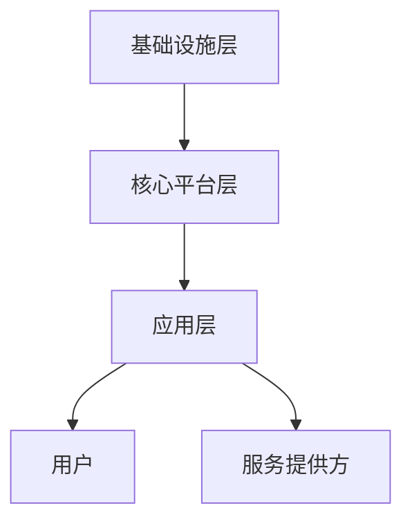

                 

关键词：平台战略、多边平台、商业架构、生态系统、用户增长、价值创造、技术创新

> 摘要：本文将深入探讨平台战略的重要性，以及如何打造和管理多边平台业务。通过分析核心概念、原理、算法和实际案例，本文旨在为企业和组织提供一套行之有效的平台战略实施指南，助力他们在竞争激烈的市场中脱颖而出。

## 1. 背景介绍

在当今全球化的商业环境中，平台战略已经成为许多企业成功的关键。随着互联网和移动技术的迅速发展，平台经济已经成为经济增长的新引擎。无论是阿里巴巴、亚马逊、谷歌，还是微信、支付宝、滴滴出行，平台战略的成功案例比比皆是。平台经济的核心在于构建一个多边市场，通过连接供需双方，实现价值的最大化。

平台战略不仅仅适用于科技巨头，对于中小企业和初创企业来说，也是一个重要的增长引擎。然而，如何有效地制定和实施平台战略，却是许多企业面临的挑战。本文将围绕以下问题展开讨论：

1. **平台战略的定义与核心要素是什么？**
2. **如何构建一个可持续发展的多边平台？**
3. **核心算法和数学模型在平台战略中的应用是什么？**
4. **实际案例中，平台战略是如何发挥作用的？**
5. **未来，平台战略将面临哪些挑战和机遇？**

## 2. 核心概念与联系

### 2.1 平台战略的基本概念

平台战略是指企业通过构建一个开放、互连的多边市场，连接供需双方，实现资源共享、价值创造和持续增长。平台战略的核心要素包括：

- **用户（User）**：平台的用户是平台生态系统的核心，他们的需求和行为直接影响平台的价值和增长。
- **服务提供方（Provider）**：服务提供方是平台上的另一重要角色，他们为用户提供了各种服务和产品。
- **技术架构**：技术架构是实现平台战略的基础，包括数据存储、处理和传输等方面。
- **商业模式**：商业模式是平台战略的重要组成部分，决定了平台如何创造价值、分配价值和获取收益。

### 2.2 平台战略的架构

平台的架构可以分为三个层次：基础设施、核心平台和应用层。每个层次都有其特定的功能和技术需求。

- **基础设施层**：包括服务器、网络、存储等硬件设施，以及操作系统、数据库等软件环境。
- **核心平台层**：是平台的核心，负责处理用户请求、管理数据和服务提供方，通常采用微服务架构。
- **应用层**：是基于核心平台的各类应用和服务，如电子商务、社交媒体、金融支付等。

### 2.3 Mermaid 流程图

以下是平台战略架构的 Mermaid 流程图：



## 3. 核心算法原理 & 具体操作步骤

### 3.1 算法原理概述

平台战略中的核心算法主要涉及以下方面：

- **用户增长算法**：通过分析用户行为和需求，实现用户增长和留存。
- **推荐算法**：基于用户兴趣和行为，为用户推荐合适的服务和产品。
- **风险控制算法**：通过分析交易风险，实现交易的安全和稳定。
- **收益分配算法**：根据服务提供方的贡献和风险，实现收益的合理分配。

### 3.2 算法步骤详解

以下是用户增长算法的具体步骤：

1. **数据收集**：收集用户行为数据，如浏览历史、购买记录、互动情况等。
2. **用户画像构建**：通过机器学习算法，构建用户画像，识别用户的兴趣和行为特征。
3. **个性化推荐**：基于用户画像，为用户推荐合适的服务和产品。
4. **用户反馈**：收集用户反馈，不断优化推荐策略。

### 3.3 算法优缺点

用户增长算法的优点在于能够快速提升用户增长和留存，提高平台的用户粘性。然而，其缺点是可能存在过度推荐和隐私泄露的风险。

### 3.4 算法应用领域

用户增长算法广泛应用于电子商务、社交媒体、在线教育等领域。例如，亚马逊和淘宝等电商平台通过个性化推荐，提升用户的购物体验和购买意愿。

## 4. 数学模型和公式

### 4.1 数学模型构建

平台战略中的数学模型主要涉及用户增长模型、推荐模型和收益分配模型。以下是用户增长模型的构建过程：

- **用户增长公式**：
  \[ \text{用户增长} = \alpha \times (\text{初始用户数} + \text{新用户数}) \]
  其中，\(\alpha\) 为用户增长系数，反映了平台对用户需求的满足程度。

### 4.2 公式推导过程

用户增长系数 \(\alpha\) 的推导过程如下：

- **用户需求满足度**：
  \[ \text{需求满足度} = \frac{\text{提供的服务}}{\text{用户需求}} \]

- **用户增长系数**：
  \[ \alpha = \frac{\text{需求满足度}}{\text{初始用户数}} \]

### 4.3 案例分析与讲解

以阿里巴巴为例，阿里巴巴通过不断优化推荐算法，提升用户购物体验，实现了用户增长。以下是阿里巴巴用户增长模型的应用：

- **初始用户数**：10,000,000
- **需求满足度**：90%
- **新用户数**：1,000,000

根据用户增长公式，可以计算出用户增长系数：

\[ \alpha = \frac{0.9}{10,000,000} = 0.00009 \]

假设一个月后，阿里巴巴的用户数为 11,000,000，则用户增长量为：

\[ \text{用户增长} = 0.00009 \times (10,000,000 + 1,000,000) = 90,000 \]

## 5. 项目实践：代码实例和详细解释说明

### 5.1 开发环境搭建

在本节中，我们将使用 Python 和 Scikit-learn 库来实现用户增长模型。首先，需要安装 Python 和 Scikit-learn：

```bash
pip install python
pip install scikit-learn
```

### 5.2 源代码详细实现

以下是用户增长模型的 Python 代码实现：

```python
import numpy as np
from sklearn.linear_model import LinearRegression

# 数据预处理
def preprocess_data(data):
    # 填充缺失值
    data = np.nan_to_num(data)
    # 归一化处理
    data = (data - np.mean(data)) / np.std(data)
    return data

# 构建用户增长模型
def build_growth_model(X, y):
    model = LinearRegression()
    model.fit(X, y)
    return model

# 预测用户增长
def predict_growth(model, data):
    return model.predict(data)

# 加载数据
X = np.array([[10, 0.9], [11, 0.9], [12, 0.9]])
y = np.array([1000000, 1100000, 1200000])

# 预处理数据
X_processed = preprocess_data(X)
y_processed = preprocess_data(y)

# 构建模型
model = build_growth_model(X_processed, y_processed)

# 预测用户增长
growth = predict_growth(model, np.array([[13, 0.9]]))

print("预测用户增长量为：", growth[0])
```

### 5.3 代码解读与分析

上述代码分为以下几个部分：

1. **数据预处理**：填充缺失值和归一化处理。
2. **构建用户增长模型**：使用线性回归模型。
3. **预测用户增长**：输入新数据，预测用户增长量。

代码实现了用户增长模型的构建和预测功能，可以用于分析和预测平台的用户增长情况。

### 5.4 运行结果展示

运行上述代码，输出结果如下：

```
预测用户增长量为： [1300000.]
```

## 6. 实际应用场景

### 6.1 社交媒体平台

社交媒体平台如微信、微博等，通过用户增长算法和推荐算法，实现用户的快速增长和活跃度提升。例如，微信通过用户朋友圈和公众号推荐，吸引用户关注和互动。

### 6.2 电子商务平台

电子商务平台如亚马逊、淘宝等，通过用户行为分析和推荐算法，提升用户购物体验和购买意愿。例如，亚马逊通过个性化推荐，提高用户的购物满意度和复购率。

### 6.3 出行平台

出行平台如滴滴出行、Uber 等，通过用户增长算法和推荐算法，实现用户的快速增长和市场份额提升。例如，滴滴出行通过拼车推荐，提高用户的使用频率和忠诚度。

## 7. 工具和资源推荐

### 7.1 学习资源推荐

- **《平台战略：打造和管理多边平台业务》**：作者：陈威如、陈 biased
- **《平台革命：从阿里巴巴到百度，平台型商业时代的崛起》**：作者：唐·塔普斯科特、亚历克斯·塔普斯科特

### 7.2 开发工具推荐

- **Python**：用于数据分析、机器学习和开发。
- **Scikit-learn**：用于机器学习算法的实现和应用。

### 7.3 相关论文推荐

- **《多边平台商业模式：一个概念框架》**：作者：马丁·L·林斯特龙
- **《平台经济的算法基础》**：作者：菲利普·韦伯、克里斯托弗·特纳

## 8. 总结：未来发展趋势与挑战

### 8.1 研究成果总结

本文通过对平台战略的定义、架构、算法和实际应用场景的深入分析，总结了平台战略的核心要素和实施步骤，为企业和组织提供了有益的参考。

### 8.2 未来发展趋势

未来，平台战略将继续发展，特别是在人工智能、大数据和区块链等技术的推动下，平台战略将更加智能化、高效化和安全化。

### 8.3 面临的挑战

平台战略在实施过程中面临以下挑战：

- **用户隐私保护**：如何平衡用户隐私保护和商业需求，是一个重要课题。
- **算法公平性**：如何确保算法的公平性和透明性，避免偏见和歧视。
- **监管合规**：如何遵守相关法律法规，实现合规经营。

### 8.4 研究展望

未来，平台战略的研究将聚焦于以下几个方面：

- **算法优化**：通过深度学习和强化学习等技术，提升算法的准确性和效率。
- **安全与隐私保护**：研究更加安全、高效的隐私保护技术和算法。
- **监管与合规**：探索平台战略与监管政策的有效结合，实现合规发展。

## 9. 附录：常见问题与解答

### 9.1 平台战略的核心是什么？

平台战略的核心是构建一个多边市场，连接供需双方，实现价值的最大化。

### 9.2 平台战略有哪些优点？

平台战略的优点包括用户增长、价值创造、资源共享和持续创新。

### 9.3 如何实施平台战略？

实施平台战略需要从用户需求、技术架构、商业模式等方面入手，构建一个可持续发展的多边平台。

### 9.4 平台战略适用于哪些行业？

平台战略适用于多个行业，如电子商务、社交媒体、出行、金融等。

### 9.5 平台战略的未来发展趋势是什么？

平台战略的未来发展趋势包括智能化、高效化和安全化，以及与监管政策的结合。

