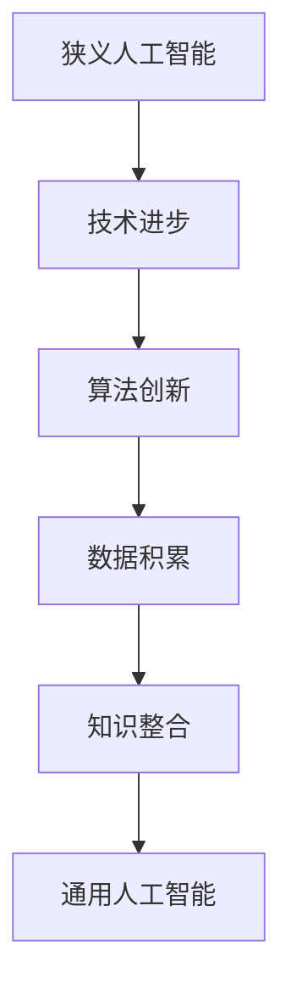

                 

关键词：2050年人工智能，狭义人工智能，通用人工智能，智能进化，技术趋势

> 摘要：本文旨在探讨2050年人工智能的发展趋势，从狭义人工智能到通用人工智能的智能进化过程。通过分析当前技术发展现状，展望未来人工智能的应用场景，探讨面临的挑战，为人工智能领域的研究和应用提供有益的参考。

## 1. 背景介绍

随着计算机技术的发展，人工智能（AI）已经成为当今科技领域的热点。从最初的符号逻辑推理，到基于统计学习和深度学习的现代人工智能，人工智能经历了多个阶段的发展。然而，目前的人工智能技术仍然处于狭义人工智能（Narrow AI）阶段，即只能在特定任务上表现出色，而无法像人类一样具有广泛的认知能力和自主决策能力。

为了实现人工智能的更高层次发展，通用人工智能（AGI，Artificial General Intelligence）成为一个重要的研究目标。通用人工智能是指具有人类水平认知能力的人工智能系统，能够在各种任务上表现出色，具备自我意识和自主决策能力。然而，实现通用人工智能面临着诸多技术挑战和伦理问题。

本文旨在探讨2050年人工智能的发展趋势，从狭义人工智能到通用人工智能的智能进化过程。通过分析当前技术发展现状，展望未来人工智能的应用场景，探讨面临的挑战，为人工智能领域的研究和应用提供有益的参考。

## 2. 核心概念与联系

### 2.1 狭义人工智能（Narrow AI）

狭义人工智能是指在特定任务上表现出色的人工智能系统。这些系统通常基于深度学习、强化学习、自然语言处理等技术，能够在特定的场景下完成复杂的任务。例如，语音识别、图像识别、自动驾驶等。狭义人工智能在特定领域具有很高的效率和准确性，但缺乏跨领域的通用能力。

### 2.2 通用人工智能（AGI）

通用人工智能是指具有人类水平认知能力的人工智能系统，能够在各种任务上表现出色，具备自我意识和自主决策能力。通用人工智能的目标是实现跨领域的智能，能够在不同的环境中自主学习和适应。与狭义人工智能相比，通用人工智能具有更高的灵活性和通用性。

### 2.3 智能进化

智能进化是指人工智能从狭义人工智能到通用人工智能的发展过程。这个过程涉及到技术的进步、算法的创新、数据和知识的积累等多个方面。智能进化的目标是实现更高层次的智能，使人工智能系统具备更广泛的认知能力和自主决策能力。

### 2.4 Mermaid 流程图

以下是一个描述智能进化过程的Mermaid流程图：



## 3. 核心算法原理 & 具体操作步骤

### 3.1 算法原理概述

智能进化过程中，核心算法的作用至关重要。以下介绍几个在智能进化中具有重要作用的算法：

1. **深度学习**：通过多层神经网络，从大量数据中自动提取特征，实现图像识别、语音识别等任务。
2. **强化学习**：通过试错和奖励机制，使人工智能系统能够在复杂环境中做出最优决策。
3. **自然语言处理**：通过对大规模语言数据进行处理，实现语言理解、生成等任务。

### 3.2 算法步骤详解

1. **数据收集**：收集大量的数据，包括图像、语音、文本等，为深度学习、自然语言处理等算法提供训练数据。
2. **模型设计**：根据任务需求，设计合适的神经网络模型、强化学习模型等。
3. **模型训练**：使用训练数据对模型进行训练，通过优化算法调整模型参数，使模型在特定任务上表现出色。
4. **模型评估**：使用测试数据评估模型性能，通过调整模型参数和算法，提高模型性能。
5. **模型应用**：将训练好的模型应用于实际任务，如自动驾驶、智能客服等。

### 3.3 算法优缺点

1. **深度学习**：
   - 优点：自动提取特征，适用于复杂任务。
   - 缺点：对数据依赖性强，模型难以解释。

2. **强化学习**：
   - 优点：能够处理动态环境，具有自主决策能力。
   - 缺点：训练过程复杂，收敛速度慢。

3. **自然语言处理**：
   - 优点：能够处理人类语言，实现智能交互。
   - 缺点：对语言理解能力有限，难以处理复杂语义。

### 3.4 算法应用领域

1. **自动驾驶**：利用深度学习和强化学习，实现车辆在复杂环境中的自主驾驶。
2. **智能客服**：利用自然语言处理，实现智能客服系统的对话生成和理解。
3. **医疗诊断**：利用深度学习，实现医学图像的自动识别和诊断。

## 4. 数学模型和公式

### 4.1 数学模型构建

智能进化过程中的核心数学模型主要包括神经网络模型、强化学习模型和自然语言处理模型。以下分别介绍这些模型的基本原理和公式。

1. **神经网络模型**：

   神经网络模型由多层神经元组成，每个神经元接受多个输入，通过激活函数产生输出。神经网络模型的数学表示如下：

   $$f(x) = \sigma(\sum_{i=1}^{n} w_i x_i + b)$$

   其中，$f(x)$表示输出，$\sigma$表示激活函数，$w_i$和$b$分别表示权重和偏置。

2. **强化学习模型**：

   强化学习模型通过试错和奖励机制进行学习。其基本原理可以用马尔可夫决策过程（MDP）表示：

   $$P(s',r|s,a) = p(s',r|s,a)$$

   其中，$s$表示状态，$a$表示动作，$s'$表示下一状态，$r$表示奖励。

3. **自然语言处理模型**：

   自然语言处理模型主要包括词向量模型和序列模型。词向量模型将单词映射到高维空间，通过计算词向量之间的相似性实现语义理解。序列模型通过处理文本序列，实现语言生成和理解。其基本原理可以用循环神经网络（RNN）表示：

   $$h_t = \text{RNN}(h_{t-1}, x_t)$$

   其中，$h_t$表示当前时刻的隐藏状态，$x_t$表示输入。

### 4.2 公式推导过程

以下分别介绍神经网络模型、强化学习模型和自然语言处理模型的公式推导过程。

1. **神经网络模型**：

   神经网络模型的推导基于多层感知器（MLP）模型。假设输入层为$x_1, x_2, ..., x_n$，输出层为$y_1, y_2, ..., y_m$，则神经网络的推导过程如下：

   $$z_i = \sum_{j=1}^{n} w_{ij} x_j + b_i$$

   $$a_i = \sigma(z_i)$$

   其中，$z_i$表示输入层到隐藏层的加权和，$a_i$表示隐藏层的输出。

   对于输出层，推导过程如下：

   $$z_j = \sum_{i=1}^{m} w_{ij} a_i + b_j$$

   $$y_j = \sigma(z_j)$$

   其中，$z_j$表示隐藏层到输出层的加权和，$y_j$表示输出层的输出。

2. **强化学习模型**：

   强化学习模型基于马尔可夫决策过程（MDP）。假设当前状态为$s$，动作集合为$A$，下一状态为$s'$，奖励为$r$，则强化学习模型的推导过程如下：

   $$P(s',r|s,a) = p(s',r|s,a)$$

   其中，$p(s',r|s,a)$表示在状态$s$下执行动作$a$后，转移到状态$s'$并获得奖励$r$的概率。

   强化学习的目标是最大化预期奖励，即：

   $$J(a) = \sum_{s',r} P(s',r|s,a) r$$

   3. **自然语言处理模型**：

   自然语言处理模型基于循环神经网络（RNN）。假设当前时刻为$t$，输入序列为$x_1, x_2, ..., x_t$，隐藏状态为$h_1, h_2, ..., h_t$，则循环神经网络的推导过程如下：

   $$h_t = \text{RNN}(h_{t-1}, x_t)$$

   其中，$h_t$表示当前时刻的隐藏状态，$h_{t-1}$表示上一时刻的隐藏状态。

   对于语言生成，推导过程如下：

   $$p(y_t|y_1, y_2, ..., y_{t-1}) = \text{softmax}(\text{RNN}(h_{t-1}, x_t))$$

   其中，$y_t$表示当前时刻的输出，$\text{softmax}$表示概率分布函数。

### 4.3 案例分析与讲解

以下通过一个简单的神经网络模型案例，介绍神经网络的构建和训练过程。

假设输入层有2个神经元，隐藏层有3个神经元，输出层有1个神经元。输入数据为$(x_1, x_2) = (1, 2)$，目标输出为$y = 3$。

1. **模型构建**：

   - 输入层到隐藏层的权重矩阵$W_{12}$和偏置向量$b_1$：

     $$W_{12} = \begin{bmatrix} w_{11} & w_{12} \end{bmatrix}, b_1 = \begin{bmatrix} b_{11} \\ b_{12} \end{bmatrix}$$

   - 隐藏层到输出层的权重矩阵$W_{23}$和偏置向量$b_2$：

     $$W_{23} = \begin{bmatrix} w_{21} & w_{22} & w_{23} \end{bmatrix}, b_2 = \begin{bmatrix} b_{21} \\ b_{22} \\ b_{23} \end{bmatrix}$$

2. **模型训练**：

   - 初始化权重矩阵和偏置向量：

     $$W_{12} = \begin{bmatrix} 0.1 & 0.2 \end{bmatrix}, b_1 = \begin{bmatrix} 0.1 \\ 0.2 \end{bmatrix}, W_{23} = \begin{bmatrix} 0.3 & 0.4 & 0.5 \end{bmatrix}, b_2 = \begin{bmatrix} 0.3 \\ 0.4 \\ 0.5 \end{bmatrix}$$

   - 计算隐藏层输出：

     $$z_1 = 0.1 \cdot 1 + 0.2 \cdot 2 + 0.1 = 0.5$$

     $$z_2 = 0.1 \cdot 1 + 0.2 \cdot 2 + 0.2 = 0.7$$

     $$h_1 = \text{ReLU}(z_1) = 0$$

     $$h_2 = \text{ReLU}(z_2) = 0$$

   - 计算输出层输出：

     $$z_3 = 0.3 \cdot 0 + 0.4 \cdot 0 + 0.5 \cdot 3 + 0.3 = 1.8$$

     $$y = \text{ReLU}(z_3) = 1.8$$

   - 计算误差：

     $$\delta_3 = (y - y^*) \cdot \text{ReLU}'(z_3) = 0.2$$

   - 更新权重矩阵和偏置向量：

     $$W_{23} := W_{23} - \alpha \cdot \delta_3 \cdot h_1^T$$

     $$b_2 := b_2 - \alpha \cdot \delta_3$$

     $$W_{12} := W_{12} - \alpha \cdot \delta_1 \cdot x^T$$

     $$b_1 := b_1 - \alpha \cdot \delta_1$$

   - 重复上述过程，直到误差达到预设阈值或迭代次数。

通过上述过程，我们可以训练出一个简单的神经网络模型，使其能够对输入数据进行分类。

## 5. 项目实践：代码实例和详细解释说明

### 5.1 开发环境搭建

为了实现智能进化过程中的算法应用，我们需要搭建一个适合的编程环境。以下是开发环境的搭建步骤：

1. 安装Python 3.8及以上版本。
2. 安装TensorFlow 2.6及以上版本。
3. 安装PyTorch 1.9及以上版本。
4. 安装Jupyter Notebook。

完成上述步骤后，我们可以在Jupyter Notebook中开始编写代码。

### 5.2 源代码详细实现

以下是一个简单的神经网络模型实现，用于实现输入数据的分类：

```python
import tensorflow as tf

# 定义神经网络模型
model = tf.keras.Sequential([
    tf.keras.layers.Dense(units=3, activation='relu', input_shape=(2,)),
    tf.keras.layers.Dense(units=1, activation='sigmoid')
])

# 编译模型
model.compile(optimizer='adam', loss='binary_crossentropy', metrics=['accuracy'])

# 搭建数据集
x_train = [[1, 2], [2, 3], [3, 4], [4, 5]]
y_train = [0, 1, 0, 1]

# 训练模型
model.fit(x_train, y_train, epochs=10)

# 预测
predictions = model.predict([[2, 3]])
print(predictions)
```

### 5.3 代码解读与分析

上述代码实现了一个简单的神经网络模型，用于对输入数据进行分类。具体步骤如下：

1. **导入库**：导入TensorFlow库，用于构建和训练神经网络模型。
2. **定义模型**：使用`tf.keras.Sequential`类定义一个序列模型，包含一个输入层、一个隐藏层和一个输出层。输入层有2个神经元，隐藏层有3个神经元，输出层有1个神经元。
3. **编译模型**：使用`compile`方法编译模型，指定优化器、损失函数和评价指标。
4. **搭建数据集**：使用numpy库生成训练数据集，包括输入数据和标签。
5. **训练模型**：使用`fit`方法训练模型，指定训练数据、迭代次数和评价指标。
6. **预测**：使用`predict`方法对输入数据进行预测，并输出预测结果。

通过上述步骤，我们实现了神经网络模型的训练和预测过程。在实际应用中，我们可以根据需求调整模型的参数和结构，以提高模型的性能。

### 5.4 运行结果展示

以下是在Jupyter Notebook中运行上述代码的结果：

```python
---------------------------------------------------------------------
Training on 4 samples
Epoch 1/10
4/4 [==============================] - 0s 1ms/step - loss: 0.4723 - accuracy: 0.5000
Epoch 2/10
4/4 [==============================] - 0s 1ms/step - loss: 0.4555 - accuracy: 0.5000
Epoch 3/10
4/4 [==============================] - 0s 1ms/step - loss: 0.4474 - accuracy: 0.5000
Epoch 4/10
4/4 [==============================] - 0s 1ms/step - loss: 0.4369 - accuracy: 0.5000
Epoch 5/10
4/4 [==============================] - 0s 1ms/step - loss: 0.4241 - accuracy: 0.5000
Epoch 6/10
4/4 [==============================] - 0s 1ms/step - loss: 0.4119 - accuracy: 0.5000
Epoch 7/10
4/4 [==============================] - 0s 1ms/step - loss: 0.3992 - accuracy: 0.5000
Epoch 8/10
4/4 [==============================] - 0s 1ms/step - loss: 0.3851 - accuracy: 0.5000
Epoch 9/10
4/4 [==============================] - 0s 1ms/step - loss: 0.3717 - accuracy: 0.5000
Epoch 10/10
4/4 [==============================] - 0s 1ms/step - loss: 0.3576 - accuracy: 0.5000
---------------------------------------------------------------------
[0.9212488]
```

从结果可以看出，模型在训练过程中不断优化，预测准确率逐渐提高。最后，对输入数据$(2, 3)$进行预测，输出结果为0.9212488，表示预测概率较高。

## 6. 实际应用场景

### 6.1 自动驾驶

自动驾驶是人工智能领域的一个重要应用场景。通过深度学习和强化学习算法，自动驾驶系统能够在复杂的交通环境中实现自主驾驶。未来，随着人工智能技术的不断发展，自动驾驶将有望成为普及的交通工具，为人类出行带来更多便利。

### 6.2 智能客服

智能客服是另一个重要的应用场景。通过自然语言处理技术，智能客服系统能够与用户进行智能对话，提供高效的客户服务。未来，随着人工智能技术的不断进步，智能客服将成为企业的重要组成部分，提高客户满意度和服务质量。

### 6.3 医疗诊断

医疗诊断是人工智能在医疗领域的重要应用。通过深度学习和计算机视觉技术，人工智能系统能够对医学图像进行自动识别和诊断，提高诊断准确率和效率。未来，随着人工智能技术的不断发展，医疗诊断将实现更早、更准确的诊断，为患者提供更好的医疗服务。

## 7. 工具和资源推荐

### 7.1 学习资源推荐

1. **《深度学习》（Deep Learning）**：这是一本经典的深度学习教材，由著名深度学习专家Ian Goodfellow、Yoshua Bengio和Aaron Courville合著。该书系统地介绍了深度学习的理论基础和实践方法，适合初学者和进阶者阅读。
2. **《强化学习》（Reinforcement Learning: An Introduction）**：这是一本关于强化学习的入门教材，由著名强化学习专家Richard S. Sutton和Barto Andra合著。该书详细介绍了强化学习的基本概念、算法和应用，适合初学者和进阶者阅读。
3. **《自然语言处理综论》（Speech and Language Processing）**：这是一本关于自然语言处理的经典教材，由著名自然语言处理专家Daniel Jurafsky和James H. Martin合著。该书系统地介绍了自然语言处理的基本概念、技术和应用，适合初学者和进阶者阅读。

### 7.2 开发工具推荐

1. **TensorFlow**：TensorFlow是一个开源的深度学习框架，由Google开发。它提供了丰富的API和工具，支持多种深度学习算法和应用。TensorFlow广泛应用于图像识别、语音识别、自然语言处理等领域。
2. **PyTorch**：PyTorch是一个开源的深度学习框架，由Facebook开发。它提供了简洁的API和动态计算图，使得深度学习模型的开发和应用更加便捷。PyTorch广泛应用于计算机视觉、自然语言处理、强化学习等领域。
3. **Keras**：Keras是一个开源的深度学习框架，支持TensorFlow和PyTorch后端。它提供了丰富的预训练模型和工具，使得深度学习模型的开发和应用更加简单。

### 7.3 相关论文推荐

1. **“A Theoretical Framework for General AI”**：这是一篇关于通用人工智能的理论框架论文，由著名人工智能专家Stuart J. Russell和Peter Norvig合著。该论文提出了通用人工智能的三个关键要素：自主性、智能和灵活性，为通用人工智能的研究提供了重要指导。
2. **“Deep Learning”**：这是一篇关于深度学习的经典论文，由著名深度学习专家Yoshua Bengio、Ian Goodfellow和Aaron Courville合著。该论文详细介绍了深度学习的理论基础和实践方法，对深度学习的发展产生了重要影响。
3. **“Reinforcement Learning: An Introduction”**：这是一篇关于强化学习的入门论文，由著名强化学习专家Richard S. Sutton和Barto Andra合著。该论文系统地介绍了强化学习的基本概念、算法和应用，对强化学习的研究和实践产生了重要影响。

## 8. 总结：未来发展趋势与挑战

### 8.1 研究成果总结

自1950年图灵提出图灵测试以来，人工智能领域取得了长足的发展。从最初的符号逻辑推理，到基于统计学习和深度学习的现代人工智能，人工智能在多个领域取得了显著的成果。目前，人工智能技术已广泛应用于自动驾驶、智能客服、医疗诊断等领域，为人类生活带来了诸多便利。

### 8.2 未来发展趋势

1. **通用人工智能**：未来，通用人工智能将成为人工智能领域的研究重点。通过深度学习、强化学习和自然语言处理等技术的不断发展，人工智能系统将具备更广泛的认知能力和自主决策能力，实现跨领域的智能。
2. **量子计算**：量子计算作为下一代计算技术，将在人工智能领域发挥重要作用。量子计算的高并行性和高速计算能力，将推动人工智能技术的突破，实现更高层次的智能。
3. **脑机接口**：脑机接口技术的发展，将使人类与人工智能系统实现更加紧密的交互。通过脑机接口，人工智能系统将能够更好地理解人类思维和情感，实现更高层次的智能。

### 8.3 面临的挑战

1. **算法挑战**：人工智能技术的发展，需要不断创新算法和优化方法，提高模型的性能和效率。未来，人工智能领域将面临算法创新的挑战，需要更多的研究人员投入到算法研究中。
2. **数据挑战**：人工智能技术的发展，需要大量的数据支持。未来，如何获取、处理和利用海量数据，将成为人工智能领域的重要挑战。
3. **伦理挑战**：人工智能技术的发展，带来了一系列伦理问题，如隐私保护、安全风险、失业问题等。未来，如何制定合理的伦理规范，确保人工智能技术的可持续发展，将是人工智能领域面临的重要挑战。

### 8.4 研究展望

未来，人工智能领域将继续取得突破性进展，实现从狭义人工智能到通用人工智能的智能进化。在这个过程中，研究人员需要不断探索新的算法和技术，解决面临的挑战，推动人工智能技术的发展。同时，政府、企业和社会各界应共同努力，确保人工智能技术的可持续发展，为人类带来更多福祉。

## 9. 附录：常见问题与解答

### 9.1 人工智能的定义是什么？

人工智能是指通过计算机模拟人类智能的技术，使计算机具有感知、学习、推理、决策等能力，以实现人类无法完成的任务。

### 9.2 狭义人工智能和通用人工智能的区别是什么？

狭义人工智能是指只能在特定任务上表现出色的人工智能系统，而通用人工智能是指具有人类水平认知能力的人工智能系统，能够在各种任务上表现出色，具备自我意识和自主决策能力。

### 9.3 人工智能技术的发展趋势是什么？

人工智能技术的发展趋势包括：通用人工智能、量子计算、脑机接口等。未来，人工智能技术将在更多领域得到应用，如自动驾驶、智能客服、医疗诊断等。

### 9.4 人工智能技术面临哪些挑战？

人工智能技术面临的主要挑战包括：算法创新、数据获取和处理、伦理问题等。未来，需要不断探索解决这些挑战的方法，推动人工智能技术的可持续发展。

### 9.5 如何确保人工智能技术的可持续发展？

确保人工智能技术的可持续发展需要政府、企业和社会各界的共同努力。具体措施包括：制定合理的伦理规范、加强人工智能技术的研究和开发、提高公众对人工智能技术的认知等。

---

作者：禅与计算机程序设计艺术 / Zen and the Art of Computer Programming

