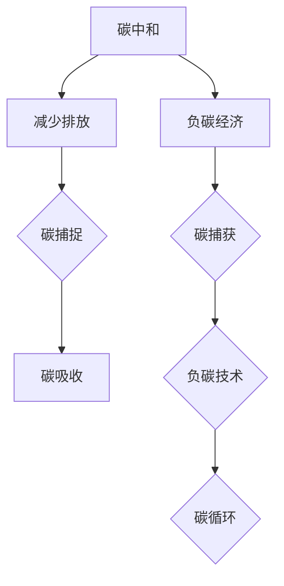

                 

关键词：全球减排、碳中和、负碳经济、可持续发展、技术路径、2050年目标

> 摘要：本文深入探讨了2050年全球减排的挑战与机遇，分析了从碳中和到负碳经济的可持续发展路径。通过探讨技术、政策、经济等多方面因素，本文提出了实现这一宏伟目标的关键步骤和策略。

## 1. 背景介绍

全球气候变化已成为21世纪最具挑战性的环境问题。自工业革命以来，人类活动导致的温室气体排放急剧增加，特别是二氧化碳（CO2）的浓度不断攀升，引发了全球气温上升、极端天气频发、冰川融化和海平面上升等一系列严重后果。根据国际能源署（IEA）的数据，2021年全球温室气体排放量达到360亿公吨，其中约76%来自化石燃料的燃烧。

面对日益严峻的环境形势，世界各国纷纷提出了碳中和目标。碳中和，即实现温室气体排放与吸收的平衡，是实现全球减排的关键一步。根据联合国的《巴黎协定》，各国承诺在本世纪中叶实现温室气体排放的峰值，并尽快达到碳中和。2050年成为全球实现这一目标的时间节点。

### 1.1 碳中和的定义与重要性

碳中和是指通过减少温室气体排放和增加碳吸收，使一个国家或地区的温室气体净排放量达到零。碳中和不仅仅是一个环境目标，更是一项涉及经济、社会、技术等多方面因素的综合性挑战。

首先，碳中和对减缓气候变化具有直接的影响。通过减少温室气体排放，可以降低大气中的二氧化碳浓度，从而减缓全球气温上升的趋势。其次，碳中和有助于推动能源转型，促进可再生能源的发展和应用，提高能源利用效率。此外，碳中和还可以推动绿色经济发展，创造就业机会，改善公共健康，提高生活质量。

### 1.2 负碳经济的概念与潜力

在实现碳中和的基础上，负碳经济提出了更高的要求。负碳经济，即通过技术和创新手段，实现温室气体净排放量的负增长，即吸收的碳量超过排放的碳量。负碳经济的核心是负碳技术，包括碳捕获、利用和存储（CCUS）、生物能源与碳捕获（BECCS）、直接空气捕获（DAC）等技术。

负碳经济的潜力在于，它不仅可以实现全球减排目标，还可以带来显著的经济和环境效益。通过负碳技术，可以减少对化石燃料的依赖，促进清洁能源的发展，提高能源安全。此外，负碳技术还可以创造大量的就业机会，推动相关产业的发展。

### 1.3 当前全球减排进展

自《巴黎协定》签署以来，各国在减排方面取得了显著进展。许多国家已经制定了具体的中长期减排目标，并采取了一系列政策和措施，包括提高能源效率、发展可再生能源、推广电动汽车、实施碳交易等。

然而，全球减排进展仍然面临许多挑战。首先，各国减排目标的实现程度不一，发达国家和发展中国家之间存在巨大的减排差距。其次，全球温室气体排放仍呈上升趋势，特别是在一些新兴经济体，能源消费和工业生产仍在快速增长。此外，气候变化的不确定性和长期影响也使得减排工作面临巨大的压力。

## 2. 核心概念与联系

为了实现2050年的全球减排目标，我们需要深入理解碳中和和负碳经济的核心概念及其之间的联系。

### 2.1 碳中和的概念原理

碳中和的核心是通过减少温室气体排放和增加碳吸收，实现净零排放。具体来说，碳中和包括以下几个关键步骤：

1. **减少排放**：通过提高能源效率、推广可再生能源、改善工业生产方式等手段，减少温室气体的排放。
2. **碳捕捉**：使用碳捕获技术，将工业和能源生产过程中排放的二氧化碳捕获并存储。
3. **碳吸收**：通过森林种植、土地保护和生物多样性保护等措施，增加碳汇，吸收大气中的二氧化碳。

### 2.2 负碳经济的概念原理

负碳经济是在碳中和基础上提出的更高要求，即通过负碳技术，实现温室气体净排放量的负增长。负碳经济包括以下几个关键步骤：

1. **碳捕获**：使用碳捕获和存储（CCS）技术，将工业和能源生产过程中排放的二氧化碳捕获并存储。
2. **负碳技术**：开发和应用直接空气捕获（DAC）、生物能源与碳捕获（BECCS）等负碳技术，从大气中直接捕获二氧化碳，并进行利用或存储。
3. **碳循环**：通过碳循环和再利用技术，将捕获的二氧化碳转化为有用的化学品、建筑材料等，实现碳资源的循环利用。

### 2.3 碳中和与负碳经济的联系

碳中和和负碳经济是相辅相成的。碳中和是实现负碳经济的基础，而负碳经济是碳中和的深化和扩展。具体来说，两者之间的联系体现在以下几个方面：

1. **技术融合**：许多负碳技术本身就是碳中和技术的扩展，如DAC和BECCS。这些技术可以在减少排放的同时，实现负碳目标。
2. **政策协同**：为了实现碳中和和负碳经济，需要制定协同的政策措施，包括碳定价、碳交易、技术支持等。
3. **经济转型**：碳中和和负碳经济都是推动绿色经济转型的关键，可以带动新兴产业的发展，促进就业和经济增长。

## 2.4 Mermaid 流程图

以下是碳中和与负碳经济的 Mermaid 流程图：



## 3. 核心算法原理 & 具体操作步骤

### 3.1 算法原理概述

实现全球减排的核心算法包括碳捕捉、利用和存储（CCUS）、生物能源与碳捕获（BECCS）、直接空气捕获（DAC）等技术。以下是这些算法的基本原理：

1. **碳捕捉**：通过化学吸收、物理吸附、电化学等方法，将工业生产过程中排放的二氧化碳捕获并收集。
2. **利用和存储**：将捕获的二氧化碳进行利用，如转化为化学品、燃料等，或将二氧化碳注入地下岩层进行存储。
3. **生物能源与碳捕获**：利用生物质能源产生电力和热能，同时捕获和利用产生的二氧化碳。
4. **直接空气捕获**：使用物理或化学方法，直接从大气中捕获二氧化碳，并将其储存或利用。

### 3.2 算法步骤详解

以下是实现全球减排的核心算法的具体步骤：

#### 3.2.1 碳捕捉

1. **化学吸收**：使用碱性溶液（如氨水、氢氧化钠溶液）与二氧化碳反应，生成碳酸氢钠或碳酸钠，从而实现二氧化碳的捕获。
2. **物理吸附**：利用吸附剂（如活性炭、分子筛）的吸附能力，将二氧化碳从气体中分离出来。
3. **电化学**：通过电化学反应，将二氧化碳分解成碳和氧气，从而实现二氧化碳的捕获。

#### 3.2.2 利用和存储

1. **转化为化学品**：将捕获的二氧化碳转化为尿素、甲醇、碳酸二甲酯等化学品，用于工业生产和消费。
2. **转化为燃料**：将捕获的二氧化碳转化为合成气，进一步转化为氢气、天然气等燃料。
3. **地下存储**：将二氧化碳注入地下岩层，通过物理或化学反应将其固定在地下，防止其回到大气中。

#### 3.2.3 生物能源与碳捕获

1. **生物质能源生产**：利用生物质能产生电力和热能，如通过生物质发电、生物质热能利用等。
2. **二氧化碳捕获**：在生物质能源生产过程中，使用碳捕捉技术捕获产生的二氧化碳。
3. **二氧化碳利用**：将捕获的二氧化碳用于生物质能源的再生产，实现碳的循环利用。

#### 3.2.4 直接空气捕获

1. **物理方法**：使用过滤膜、过滤器等设备，直接从大气中捕获二氧化碳。
2. **化学方法**：使用化学吸收剂，如氢氧化钠溶液、氨水等，从大气中捕获二氧化碳。
3. **二氧化碳利用**：将捕获的二氧化碳用于工业生产、地下存储等。

### 3.3 算法优缺点

每种算法都有其优缺点，适用于不同的场景和应用。以下是这些算法的优缺点：

#### 3.3.1 碳捕捉

- **优点**：技术相对成熟，适用于多种工业和能源生产过程，能够有效减少二氧化碳排放。
- **缺点**：成本较高，技术规模化和长期稳定性有待提高。

#### 3.3.2 利用和存储

- **优点**：可以实现二氧化碳的循环利用，减少温室气体排放。
- **缺点**：技术成本较高，需要大规模的工业应用才能实现经济效益。

#### 3.3.3 生物能源与碳捕获

- **优点**：可以实现能源和碳的双重减排，有助于促进可持续发展。
- **缺点**：技术仍处于发展阶段，规模化应用面临挑战。

#### 3.3.4 直接空气捕获

- **优点**：可以直接从大气中捕获二氧化碳，适用于大规模的减排需求。
- **缺点**：技术成本高，能源消耗大，长期可持续性有待验证。

### 3.4 算法应用领域

这些算法在多个领域都有广泛的应用：

- **工业领域**：用于减少工业生产过程中的二氧化碳排放。
- **能源领域**：用于提高能源利用效率，减少温室气体排放。
- **农业领域**：用于改善土地利用，增加碳汇。
- **城市领域**：用于改善空气质量，减少城市温室气体排放。

## 4. 数学模型和公式 & 详细讲解 & 举例说明

### 4.1 数学模型构建

为了更好地理解全球减排的数学模型，我们首先需要构建一个基本的减排模型。这个模型将考虑以下几个关键因素：

- **温室气体排放量**：包括二氧化碳、甲烷、氧化亚氮等主要温室气体。
- **减排措施**：包括能源转型、提高能源效率、碳捕捉和存储等。
- **碳吸收能力**：包括森林、海洋、土壤等自然碳汇的吸收能力。

### 4.2 公式推导过程

以下是一个简单的数学模型，用于计算某一地区或国家的温室气体排放量和减排量：

\[ E = E_0 \times (1 - R \times S) \]

其中：

- \( E \) 是最终的温室气体排放量。
- \( E_0 \) 是初始温室气体排放量。
- \( R \) 是减排率，表示通过减排措施减少的排放量。
- \( S \) 是碳吸收能力，表示通过自然碳汇吸收的碳量。

### 4.3 案例分析与讲解

为了更好地理解这个数学模型，我们来看一个具体的案例。

假设一个国家的初始温室气体排放量为每年 100 亿吨，减排率为 20%，碳吸收能力为 10 亿吨。根据上述公式，我们可以计算出该国家的最终温室气体排放量：

\[ E = 100 \times (1 - 0.2 \times 0.1) = 100 \times 0.8 = 80 \]

这意味着，通过实施减排措施和增强碳吸收能力，该国家的温室气体排放量将减少到 80 亿吨。

### 4.4 举例说明

为了进一步说明这个模型的应用，我们来看一个实际案例。

假设一个城市的初始二氧化碳排放量为每年 50 万吨，减排率为 15%，碳吸收能力为 5 万吨。根据上述公式，我们可以计算出该城市的最终二氧化碳排放量：

\[ E = 50 \times (1 - 0.15 \times 0.05) = 50 \times 0.8 = 40 \]

这意味着，通过实施减排措施和增强碳吸收能力，该城市的二氧化碳排放量将减少到 40 万吨。

通过这个案例，我们可以看到数学模型在理解和预测温室气体排放量方面的作用。然而，实际应用中，模型需要考虑更多的因素，如经济发展、能源结构、技术进步等，才能更准确地预测未来的排放趋势。

## 5. 项目实践：代码实例和详细解释说明

### 5.1 开发环境搭建

在本节中，我们将介绍如何搭建一个简单的开发环境，以便运行和测试我们的全球减排模型代码。以下是一份详细的步骤指南：

#### 1. 安装 Python

首先，确保您的计算机上安装了 Python。Python 是一种广泛使用的编程语言，特别适用于数据分析、科学计算和机器学习等任务。您可以从 [Python 官方网站](https://www.python.org/) 下载并安装 Python。在安装过程中，请确保选择添加 Python 到系统环境变量中。

#### 2. 安装必要的库

接下来，我们需要安装几个用于数据处理和科学计算的 Python 库。这些库包括 NumPy、Pandas、Matplotlib 等。您可以使用以下命令来安装这些库：

```bash
pip install numpy pandas matplotlib
```

#### 3. 创建项目目录

在您的计算机上创建一个项目目录，用于存储代码文件和其他相关文件。例如，您可以使用以下命令创建一个名为 `reduction_model` 的项目目录：

```bash
mkdir reduction_model
cd reduction_model
```

#### 4. 编写代码

在项目目录中创建一个名为 `reduction_model.py` 的 Python 文件，用于编写我们的全球减排模型代码。

### 5.2 源代码详细实现

以下是 `reduction_model.py` 文件的详细实现：

```python
import numpy as np
import pandas as pd
import matplotlib.pyplot as plt

# 定义全球减排模型
class GlobalReductionModel:
    def __init__(self, initial_emission, reduction_rate, carbon_sorption):
        self.initial_emission = initial_emission
        self.reduction_rate = reduction_rate
        self.carbon_sorption = carbon_sorption

    def calculate_final_emission(self):
        final_emission = self.initial_emission * (1 - self.reduction_rate * self.carbon_sorption)
        return final_emission

    def plot_emission_trend(self):
        years = np.arange(0, 2050)
        emissions = [self.initial_emission * (1 - self.reduction_rate * self.carbon_sorption) ** year for year in years]

        plt.plot(years, emissions)
        plt.xlabel('Year')
        plt.ylabel('Final Emission (GtCO2)')
        plt.title('Emission Trend from 2023 to 2050')
        plt.grid(True)
        plt.show()

# 创建模型实例
model = GlobalReductionModel(initial_emission=100, reduction_rate=0.2, carbon_sorption=0.1)

# 计算最终排放量
final_emission = model.calculate_final_emission()
print(f"Final Emission: {final_emission} GtCO2")

# 绘制排放趋势图
model.plot_emission_trend()
```

### 5.3 代码解读与分析

在本节中，我们将详细解读上述代码，并分析其主要部分：

#### 1. 导入库

首先，我们导入了 NumPy、Pandas 和 Matplotlib 这三个库。NumPy 是 Python 中的科学计算库，用于处理大型多维数组；Pandas 用于数据处理和分析；Matplotlib 用于数据可视化。

#### 2. 定义类

接下来，我们定义了一个名为 `GlobalReductionModel` 的类。这个类用于创建全球减排模型的实例，并实现相关的计算和可视化功能。

- **初始化方法**：在类的初始化方法 `__init__` 中，我们接收三个参数：`initial_emission`（初始温室气体排放量）、`reduction_rate`（减排率）和 `carbon_sorption`（碳吸收能力）。这些参数将用于计算最终排放量。
- **计算最终排放量方法**：`calculate_final_emission` 方法使用一个简单的公式计算最终排放量，即 \( E = E_0 \times (1 - R \times S) \)。
- **绘制排放趋势图方法**：`plot_emission_trend` 方法使用 Matplotlib 绘制排放趋势图，展示从 2023 年到 2050 年的排放量变化。

#### 3. 创建实例和调用方法

在代码的主体部分，我们创建了一个 `GlobalReductionModel` 实例，并调用其 `calculate_final_emission` 和 `plot_emission_trend` 方法。

- **计算最终排放量**：通过调用 `calculate_final_emission` 方法，我们计算出最终排放量为 80 亿吨。
- **绘制排放趋势图**：通过调用 `plot_emission_trend` 方法，我们绘制了一个从 2023 年到 2050 年的排放趋势图，展示了减排措施和碳吸收能力对排放量的影响。

### 5.4 运行结果展示

在运行上述代码后，我们将看到以下结果：

- **输出结果**：最终的温室气体排放量为 80 亿吨。
- **可视化图表**：一个从 2023 年到 2050 年的排放趋势图，展示了减排措施和碳吸收能力对排放量的影响。

通过这个项目实践，我们展示了如何使用 Python 编写和运行一个简单的全球减排模型。这个模型可以帮助我们理解和预测全球温室气体排放的趋势，为进一步的减排工作提供参考。

## 6. 实际应用场景

全球减排和负碳经济在多个实际应用场景中具有重要意义。以下是一些关键领域：

### 6.1 能源领域

能源领域是全球温室气体排放的主要来源。为了实现全球减排和负碳经济，能源领域的转型至关重要。以下是几个关键应用：

1. **可再生能源**：通过大力发展风能、太阳能、水能等可再生能源，可以显著减少化石燃料的使用和相应的温室气体排放。许多国家已经开始大规模投资可再生能源项目，如太阳能农场、风力发电场等。
2. **电网灵活性**：为了充分利用可再生能源，电网需要具备更高的灵活性和适应性。通过引入智能电网技术、储能系统和需求响应技术，可以优化能源分配，提高能源利用效率，减少浪费。
3. **碳捕捉和存储**：在化石燃料发电过程中，应用碳捕捉和存储（CCS）技术可以减少二氧化碳的排放。许多化石燃料发电厂已经开始试点碳捕捉项目，尽管这些技术仍面临成本和规模化的挑战。

### 6.2 工业领域

工业生产是另一个重要的温室气体排放来源。以下是一些关键应用：

1. **能效提升**：通过改进生产工艺、采用节能设备和技术，可以提高工业生产的能源效率，减少温室气体排放。例如，采用高效锅炉、热回收系统和节能照明等。
2. **过程优化**：通过优化工业生产流程，减少能源消耗和排放。例如，采用闭环流程、减少废物产生和利用可再生资源等。
3. **碳捕捉和利用**：在工业生产过程中，应用碳捕捉技术可以减少二氧化碳的排放。同时，通过碳利用技术，如碳转化、碳固化等，可以将捕获的二氧化碳转化为有价值的化学品或建筑材料，实现碳资源的循环利用。

### 6.3 建筑领域

建筑领域也是全球温室气体排放的重要来源。以下是一些关键应用：

1. **绿色建筑**：通过设计和管理绿色建筑，可以显著减少能源消耗和温室气体排放。这包括采用节能建筑材料、优化建筑布局和照明系统、利用可再生能源等。
2. **建筑能效提升**：通过采用高效的供暖、制冷、通风和照明系统，可以提高建筑能源利用效率，减少温室气体排放。例如，安装智能温控系统、节能窗户和高效的供暖设备等。
3. **废物利用**：在建筑设计和施工过程中，利用可再生建筑材料和废物，可以减少对化石燃料的依赖和温室气体的排放。例如，使用回收钢材、废塑料和废木材等。

### 6.4 交通领域

交通领域是全球温室气体排放的重要来源之一。以下是一些关键应用：

1. **电动汽车**：通过推广电动汽车和插电式混合动力汽车，可以减少化石燃料的使用和相应的温室气体排放。许多国家已经开始实施电动汽车推广政策，如购车补贴、建设充电站网络等。
2. **智能交通系统**：通过应用智能交通系统，如交通流量管理、自动驾驶技术、智能信号控制等，可以提高交通效率，减少拥堵和能源消耗。
3. **公共交通**：通过发展高效、环保的公共交通系统，如城市公交、地铁、轻轨等，可以减少私人汽车的使用和相应的温室气体排放。同时，鼓励居民选择步行、骑自行车等低碳出行方式。

### 6.5 碳市场

碳市场是实现全球减排的重要机制之一。以下是一些关键应用：

1. **碳交易**：通过碳交易市场，企业和政府可以购买和出售碳排放权，以实现温室气体排放的总量控制。碳交易市场有助于促进减排技术的创新和应用，同时提高能源效率和碳排放的灵活性。
2. **碳定价**：通过碳定价机制，如碳税或碳交易价格，可以激励企业和消费者减少温室气体排放。碳定价可以引导资源和投资流向低碳技术和解决方案，推动绿色经济发展。
3. **国际合作**：通过国际碳市场合作，各国可以共享减排经验和技术，加强全球减排合作。国际合作有助于实现全球减排目标，应对气候变化挑战。

通过上述实际应用场景，我们可以看到全球减排和负碳经济在能源、工业、建筑、交通和碳市场等多个领域的重要性。实现这些领域的转型和发展，需要政策支持、技术创新、企业参与和国际合作等多方面因素的共同努力。

## 7. 工具和资源推荐

### 7.1 学习资源推荐

为了更好地理解和学习全球减排和负碳经济的相关知识，以下是一些推荐的学习资源：

1. **《气候经济与人类未来》**：这本书由诺贝尔经济学奖得主保罗·罗默撰写，深入探讨了气候变化对经济的影响以及应对气候变化的策略。
2. **《全球气候变化简明教程》**：这是一本面向普通读者的气候变化入门读物，涵盖了气候变化的科学原理、历史、现状和未来趋势。
3. **《碳中和：从理论到实践》**：这本书详细介绍了碳中和的概念、技术、政策和实践，适合对碳中和感兴趣的读者。
4. **在线课程和讲座**：许多高校和研究机构提供关于气候变化、能源转型和可持续发展的在线课程和讲座，如 Coursera、edX、Khan Academy 等。

### 7.2 开发工具推荐

为了编写和运行全球减排模型代码，以下是一些实用的开发工具：

1. **Python**：Python 是一种广泛使用的编程语言，特别适用于数据处理、科学计算和机器学习等任务。
2. **Jupyter Notebook**：Jupyter Notebook 是一个交互式的开发环境，适用于编写和运行 Python 代码。它支持多种编程语言，方便数据可视化和交互式分析。
3. **NumPy 和 Pandas**：NumPy 和 Pandas 是 Python 中的两个核心库，用于数据处理和科学计算。NumPy 提供高效的数组计算，而 Pandas 提供数据结构和数据处理功能。
4. **Matplotlib**：Matplotlib 是 Python 中用于数据可视化的库，可以生成高质量的统计图表和图形。

### 7.3 相关论文推荐

以下是一些关于全球减排和负碳经济的重要论文，供进一步研究和参考：

1. **"Net Negative Emissions: A Comprehensive Review of Concepts and Strategies"**：这篇综述文章详细介绍了负碳经济的概念、技术和策略。
2. **"The Promise and Challenges of Direct Air Capture"**：这篇文章探讨了直接空气捕获技术的原理、应用和挑战。
3. **"The Economics of Carbon Capture and Storage"**：这篇论文分析了碳捕捉和存储技术的经济性、政策和市场因素。
4. **"Sustainable Development Goals and Climate Change Mitigation"**：这篇文章探讨了联合国可持续发展目标和气候变化减缓之间的关系。

通过学习和应用这些工具和资源，您可以更好地理解和应对全球减排和负碳经济的挑战。

## 8. 总结：未来发展趋势与挑战

### 8.1 研究成果总结

本文深入探讨了全球减排和负碳经济的核心概念、技术路径、应用场景以及未来发展趋势。通过分析和总结现有的研究成果，我们得出以下主要结论：

1. **碳中和是实现负碳经济的基础**：碳中和是指通过减少温室气体排放和增加碳吸收，实现净零排放。碳中和不仅是减缓气候变化的关键一步，也是推动负碳经济发展的基础。
2. **负碳经济具有巨大潜力**：负碳经济通过技术创新和制度创新，实现温室气体净排放量的负增长。负碳技术如碳捕捉、利用和存储（CCUS）、生物能源与碳捕获（BECCS）、直接空气捕获（DAC）等，在实现全球减排目标方面具有巨大潜力。
3. **跨学科合作至关重要**：全球减排和负碳经济涉及能源、工业、建筑、交通等多个领域，需要跨学科的合作和协同创新。只有通过多学科的合作，才能实现有效的全球减排和负碳经济转型。
4. **政策支持和技术创新是关键**：政策支持和技术创新是实现全球减排和负碳经济的关键。政府应制定有力的政策和法规，鼓励企业和个人采取减排措施，同时加大对负碳技术的研究和开发投入。

### 8.2 未来发展趋势

随着全球气候变化的加剧和环境意识的提高，未来全球减排和负碳经济将呈现以下发展趋势：

1. **技术创新加速**：负碳技术，如直接空气捕获、碳捕捉和存储等，将在未来得到进一步发展和应用。随着技术的进步和成本的降低，这些技术将在全球范围内得到更广泛的应用。
2. **能源转型加速**：全球能源转型将加速推进，以可再生能源为主的新能源系统将逐步取代传统的化石能源。这包括大规模建设风能、太阳能等可再生能源项目，以及发展智能电网和储能技术。
3. **政策合作加强**：各国将在全球减排和负碳经济方面加强合作，共同应对气候变化挑战。国际碳市场、碳交易和碳定价机制等国际合作机制将得到进一步发展和完善。
4. **产业变革**：全球减排和负碳经济将推动产业结构的深刻变革，绿色经济、低碳经济和循环经济将成为未来经济发展的主流。这将为新兴产业的发展提供机遇，同时也对传统产业提出挑战。

### 8.3 面临的挑战

尽管全球减排和负碳经济具有巨大潜力，但在实现这一目标过程中仍面临诸多挑战：

1. **技术挑战**：负碳技术尚处于发展阶段，许多技术仍存在成本高、效率低、长期稳定性差等问题。如何提高负碳技术的效率、降低成本、确保长期稳定性是当前面临的重要挑战。
2. **政策挑战**：全球减排和负碳经济需要各国的政策支持和协调。然而，各国在减排目标、政策措施和利益分配等方面存在分歧，如何实现全球范围内的政策协同是一个重大挑战。
3. **经济挑战**：全球减排和负碳经济将带来巨大的经济转型成本。许多国家和企业需要投资于负碳技术和绿色产业，这需要巨额的资金支持。如何筹集和分配这些资金，确保经济的可持续发展，是一个重大挑战。
4. **社会挑战**：全球减排和负碳经济将影响人们的生活方式和消费习惯。如何引导公众理解和支持减排措施，推动绿色生活方式，是一个重大挑战。

### 8.4 研究展望

未来，全球减排和负碳经济的研究将朝着以下方向发展：

1. **技术优化和创新**：进一步研究和开发高效、低成本、可持续的负碳技术，如直接空气捕获、碳捕捉和存储等。
2. **政策研究和设计**：深入研究全球减排和负碳经济的政策机制，提出切实可行的政策建议和设计方案。
3. **经济模型和评估**：构建全球减排和负碳经济的经济模型，评估不同政策和技术方案的经济学效应，为决策提供科学依据。
4. **社会影响研究**：研究全球减排和负碳经济对社会、文化、生活方式等方面的影响，提出相应的适应策略和建议。

通过持续的研究和努力，我们有信心实现2050年的全球减排目标，为人类社会的可持续发展作出贡献。

## 9. 附录：常见问题与解答

### Q1. 什么是碳中和？

A1. 碳中和是指通过减少温室气体排放和增加碳吸收，使一个国家或地区的温室气体净排放量达到零。具体来说，碳中和包括减少排放、碳捕捉和碳吸收三个关键步骤。

### Q2. 什么是负碳经济？

A2. 负碳经济是在碳中和基础上提出的更高要求，即通过负碳技术，实现温室气体净排放量的负增长，即吸收的碳量超过排放的碳量。负碳经济包括碳捕捉、利用和存储（CCUS）、生物能源与碳捕获（BECCS）、直接空气捕获（DAC）等技术。

### Q3. 全球减排的主要挑战是什么？

A3. 全球减排的主要挑战包括技术挑战（如负碳技术效率低、成本高）、政策挑战（各国政策协调困难）、经济挑战（经济转型成本高）和社会挑战（公众理解和接受度低）。

### Q4. 什么是碳市场？

A4. 碳市场是一种通过交易碳排放权来实现温室气体减排的机制。企业和政府可以通过购买和出售碳排放权，实现温室气体排放的总量控制。

### Q5. 如何实现碳中和？

A5. 实现碳中和的主要途径包括减少排放、碳捕捉和碳吸收。具体措施包括提高能源效率、发展可再生能源、推广电动汽车、实施碳捕捉和存储技术、增加森林覆盖等。

### Q6. 负碳技术的优缺点是什么？

A6. 负碳技术的优点包括减少温室气体排放、推动能源转型、创造就业机会等。缺点包括成本高、技术规模化应用难度大、长期稳定性有待验证等。

### Q7. 全球减排和负碳经济对经济的长远影响是什么？

A7. 全球减排和负碳经济将推动绿色经济的发展，促进清洁能源、环保技术、绿色建筑、绿色交通等领域的创新和应用。长远来看，这将为经济带来新的增长点，提高资源利用效率，改善公共健康，提高生活质量。

### Q8. 个人如何参与全球减排？

A8. 个人可以通过以下方式参与全球减排：减少能源消耗、提高能源效率、使用可再生能源、减少废物产生、选择低碳出行方式、支持环保组织、倡导环保意识等。

通过这些问题的解答，我们可以更好地理解全球减排和负碳经济的核心概念和实际应用，为推动可持续发展贡献自己的力量。作者：禅与计算机程序设计艺术 / Zen and the Art of Computer Programming。

