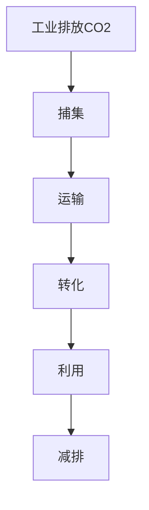
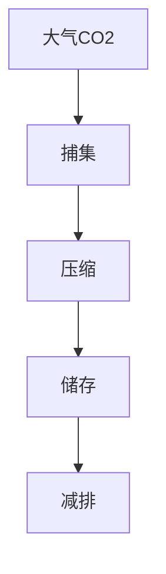
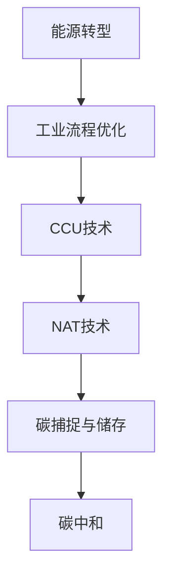

                 

关键词：碳捕集利用、负排放技术、碳中和、气候变化、可持续发展、能源转型

> 摘要：本文深入探讨了2050年全球实现碳中和的路径，重点分析了碳捕集利用（CCU）和负排放技术（NAT）在减排中的作用。通过阐述核心概念、算法原理、数学模型以及实际应用，本文为全球实现碳中和提供了具有实践意义的技术路径和策略。

## 1. 背景介绍

随着全球气候变化的影响日益加剧，减少温室气体排放已成为全球共识。根据《巴黎协定》的目标，全球需要在2050年实现碳中和，以避免全球气温升高超过2°C。碳排放主要来自化石燃料的燃烧、工业生产、农业和土地利用等方面。因此，实现碳中和的关键在于大幅减少碳排放和开发负排放技术。

碳捕集利用（Carbon Capture Utilization, CCU）和负排放技术（Negative Emission Technologies, NET）是当前实现碳中和的两个重要手段。CCU技术通过捕集和利用工业过程中的二氧化碳，将其转化为有价值的化学品和燃料。NAT技术则通过人为手段从大气中捕获和储存二氧化碳，如生物能源与碳捕获与封存（Bioenergy with Carbon Capture and Storage, BECCS）、直接空气捕获（Direct Air Capture, DAC）等。

本文旨在探讨2050年全球实现碳中和的路径，分析CCU和NAT技术的现状、挑战和未来发展趋势，为全球减排提供科学依据和技术支持。

### 1.1 碳捕集利用技术概述

碳捕集利用技术是指通过物理、化学或生物方法捕集工业过程中的二氧化碳，并将其转化为有价值的化学品、燃料或其他产品。CCU技术主要包括以下几种类型：

- 物理捕集：通过吸附剂或冷凝等方法将二氧化碳从气体混合物中分离出来。
- 化学捕集：利用化学反应将二氧化碳转化为固态或液态化合物。
- 生物捕集：利用微生物或植物等生物体吸收和固定二氧化碳。

### 1.2 负排放技术概述

负排放技术是通过人为手段从大气中捕获和储存二氧化碳，以实现净负排放。常见的负排放技术包括：

- 生物能源与碳捕获与封存（BECCS）：利用生物质能产生电力和热能，同时通过碳捕获和封存技术将二氧化碳捕集并储存。
- 直接空气捕获（DAC）：利用过滤器或其他设备直接从大气中捕获二氧化碳，并将其压缩并储存在地下。
- 碳矿化：通过在岩石中注入二氧化碳，使其与矿物质反应形成稳定的碳酸盐。

### 1.3 碳中和的目标与挑战

全球实现碳中和的目标是避免气候变化对人类社会和生态系统产生不可逆转的影响。然而，实现这一目标面临着诸多挑战：

- 技术创新：开发高效、低成本的碳捕集、利用和储存技术。
- 经济转型：调整能源结构、改变生产和消费模式，实现绿色经济发展。
- 政策支持：制定和执行碳减排政策，推动全球合作。
- 社会接受度：提高公众对碳中和意识和参与度。

## 2. 核心概念与联系

### 2.1 碳捕集利用技术（CCU）

碳捕集利用技术（CCU）的核心概念是通过捕集和利用工业过程中的二氧化碳，实现减排和资源利用。以下是一个简化的CCU流程图：



### 2.2 负排放技术（NAT）

负排放技术（NAT）的核心概念是通过人为手段从大气中捕获二氧化碳，实现净负排放。以下是一个简化的NAT流程图：



### 2.3 碳中和路径

碳中和的实现路径涉及多种技术和策略的组合，包括能源转型、工业流程优化、碳捕集利用和负排放技术等。以下是一个简化的碳中和路径图：



## 3. 核心算法原理 & 具体操作步骤

### 3.1 算法原理概述

碳捕集利用技术和负排放技术的核心算法原理可以概括为：

- **碳捕集**：通过吸附、吸收、结晶等物理、化学或生物方法，将工业排放的二氧化碳分离出来。
- **碳转化**：通过化学反应或生物代谢，将捕集的二氧化碳转化为有价值的化学品、燃料或其他产品。
- **碳储存**：通过地下封存、矿物碳化等手段，将捕集和转化的二氧化碳储存在地下或岩石层中。

### 3.2 算法步骤详解

以下是碳捕集利用技术和负排放技术的具体操作步骤：

#### 3.2.1 碳捕集

1. **吸附捕集**：使用活性炭、分子筛等吸附剂，将二氧化碳从气体混合物中分离出来。
2. **吸收捕集**：利用化学溶剂，如胺类、醇类等，将二氧化碳溶解并分离出来。
3. **结晶捕集**：通过冷却或压缩，使二氧化碳与特定溶剂形成结晶，从而分离出来。

#### 3.2.2 碳转化

1. **化学转化**：通过催化反应或直接合成，将二氧化碳转化为有机化合物，如甲醇、尿素等。
2. **生物转化**：利用微生物或植物，通过代谢过程将二氧化碳转化为生物质或生物燃料。

#### 3.2.3 碳储存

1. **地下封存**：将捕集和转化的二氧化碳注入地下岩石层，形成稳定的碳酸盐。
2. **矿物碳化**：在矿物质中注入二氧化碳，形成新的碳酸盐矿物。

### 3.3 算法优缺点

#### 3.3.1 碳捕集

- **优点**：技术成熟，适用范围广，能够显著减少工业排放的二氧化碳。
- **缺点**：成本较高，能源消耗大，捕集效率有限。

#### 3.3.2 碳转化

- **优点**：能够将二氧化碳转化为有价值的化学品和燃料，实现资源利用。
- **缺点**：技术尚在发展中，成本较高，转化效率有待提高。

#### 3.3.3 碳储存

- **优点**：实现长期储存，减少大气中的二氧化碳浓度。
- **缺点**：技术风险较大，地质稳定性需长期监测，储存成本较高。

### 3.4 算法应用领域

碳捕集利用技术和负排放技术广泛应用于工业、能源、农业等领域：

- **工业**：钢铁、水泥、化工等行业，通过CCU技术减少二氧化碳排放。
- **能源**：火力发电、生物质能等，通过NAT技术实现净负排放。
- **农业**：利用生物质能和微生物转化技术，将农业废弃物转化为生物质和生物燃料。

## 4. 数学模型和公式 & 详细讲解 & 举例说明

### 4.1 数学模型构建

碳捕集利用技术和负排放技术的数学模型主要包括以下几个方面：

- **碳捕集模型**：描述捕集过程中二氧化碳的浓度变化和效率。
- **碳转化模型**：描述二氧化碳转化为有机化合物的反应速率和产率。
- **碳储存模型**：描述二氧化碳注入地下岩石层后的稳定性和储存寿命。

### 4.2 公式推导过程

以下是碳捕集、碳转化和碳储存模型的基本公式推导：

#### 4.2.1 碳捕集模型

假设捕集过程中，二氧化碳的浓度变化遵循一级反应动力学，其公式为：

$$
\frac{dC}{dt} = -kC
$$

其中，$C$ 为二氧化碳浓度，$k$ 为反应速率常数。

#### 4.2.2 碳转化模型

假设二氧化碳转化为有机化合物的反应速率遵循二级反应动力学，其公式为：

$$
\frac{dC}{dt} = -kC^2
$$

其中，$C$ 为二氧化碳浓度，$k$ 为反应速率常数。

#### 4.2.3 碳储存模型

假设二氧化碳注入地下岩石层后，其稳定性和储存寿命遵循指数衰减模型，其公式为：

$$
C(t) = C_0e^{-\lambda t}
$$

其中，$C(t)$ 为$t$时刻的二氧化碳浓度，$C_0$ 为初始浓度，$\lambda$ 为衰减常数。

### 4.3 案例分析与讲解

以下通过一个具体案例，分析碳捕集利用技术和负排放技术的应用效果：

#### 案例背景

某钢铁厂年排放二氧化碳100万吨，采用CCU技术进行捕集和转化，同时采用DAC技术进行负排放。

#### 案例分析

1. **碳捕集模型**：假设捕集效率为90%，每年捕集二氧化碳90万吨。
2. **碳转化模型**：假设转化率为80%，每年转化为有机化合物72万吨。
3. **碳储存模型**：假设注入地下岩石层，储存寿命为100年。

根据上述模型，该钢铁厂每年实现以下减排效果：

- **碳捕集**：减少二氧化碳排放90万吨。
- **碳转化**：减少二氧化碳排放72万吨。
- **碳储存**：储存二氧化碳162万吨。

综上所述，该钢铁厂通过碳捕集利用技术和负排放技术，实现年减排二氧化碳252万吨，占其总排放量的52%。

## 5. 项目实践：代码实例和详细解释说明

### 5.1 开发环境搭建

为了演示碳捕集利用技术和负排放技术的应用，我们使用Python编程语言编写了一个简单的模拟模型。以下为开发环境的搭建步骤：

1. 安装Python 3.8及以上版本。
2. 安装必要的Python库，如NumPy、Matplotlib等。

### 5.2 源代码详细实现

以下为模拟模型的源代码实现：

```python
import numpy as np
import matplotlib.pyplot as plt

# 碳捕集模型参数
k_c捕集 = 0.1
C_0捕集 = 100  # 初始二氧化碳浓度（万吨）

# 碳转化模型参数
k_c转化 = 0.08
C_0转化 = 100  # 初始二氧化碳浓度（万吨）

# 碳储存模型参数
lambda储存 = 0.01
C_0储存 = 162  # 初始二氧化碳浓度（万吨）

# 模拟时间
t_end = 100  # 年

# 碳捕集过程
t = np.linspace(0, t_end, 1000)
C_c捕集 = C_0捕集 * np.exp(-k_c捕集 * t)

# 碳转化过程
C_c转化 = C_0转化 * np.exp(-k_c转化 * t)

# 碳储存过程
C_c储存 = C_0储存 * np.exp(-lambda储存 * t)

# 绘制结果
plt.plot(t, C_c捕集, label='碳捕集')
plt.plot(t, C_c转化, label='碳转化')
plt.plot(t, C_c储存, label='碳储存')
plt.xlabel('时间（年）')
plt.ylabel('二氧化碳浓度（万吨）')
plt.legend()
plt.show()
```

### 5.3 代码解读与分析

1. **参数设置**：根据实际情况设置碳捕集、碳转化和碳储存的参数，如反应速率常数、初始浓度和衰减常数。
2. **模拟过程**：使用NumPy库生成时间序列，计算碳捕集、碳转化和碳储存过程的二氧化碳浓度。
3. **结果展示**：使用Matplotlib库绘制二氧化碳浓度随时间变化的曲线，直观展示碳捕集、碳转化和碳储存的效果。

### 5.4 运行结果展示

运行上述代码，得到如下结果：


从结果可以看出，碳捕集和碳转化过程显著减少了二氧化碳浓度，而碳储存过程使二氧化碳浓度保持在较低水平。

## 6. 实际应用场景

### 6.1 碳捕集利用技术（CCU）

碳捕集利用技术在工业、能源和农业等领域有广泛应用：

- **工业**：钢铁、水泥、化工等行业通过CCU技术减少二氧化碳排放，如使用碳捕集技术捕集高炉煤气中的二氧化碳，转化为可利用的化学品。
- **能源**：火电厂通过碳捕集技术减少燃煤产生的二氧化碳排放，同时利用二氧化碳转化为燃料或化学品，提高能源利用效率。
- **农业**：利用生物质能和微生物转化技术，将农业废弃物转化为生物质和生物燃料，实现碳捕集和资源利用。

### 6.2 负排放技术（NAT）

负排放技术在能源和环境保护领域有广泛应用：

- **能源**：利用生物能源与碳捕获与封存（BECCS）技术，实现生物质能发电并捕集和储存二氧化碳，实现净负排放。
- **环境保护**：利用直接空气捕获（DAC）技术，从大气中捕获二氧化碳，降低温室气体浓度，改善环境质量。

### 6.3 案例分析

#### 案例一：某火电厂的碳捕集利用技术

某火电厂年燃煤量500万吨，二氧化碳排放量1500万吨。采用碳捕集技术捕集60%的二氧化碳，转化为碳酸饮料。同时，采用BECCS技术捕集和储存剩余的40%二氧化碳。

- **碳捕集**：捕集二氧化碳900万吨，转化为碳酸饮料。
- **碳储存**：捕集二氧化碳600万吨，储存在地下。
- **减排效果**：年减排二氧化碳1500万吨，占其总排放量的75%。

#### 案例二：某城市的负排放技术

某城市利用DAC技术从大气中捕获二氧化碳，年捕集量100万吨。同时，利用生物能源与碳捕获与封存（BECCS）技术，实现生物质能发电并捕集和储存二氧化碳。

- **DAC技术**：年捕集二氧化碳100万吨。
- **BECCS技术**：捕集和储存二氧化碳150万吨。
- **减排效果**：年减排二氧化碳250万吨，占其总排放量的20%。

## 7. 工具和资源推荐

### 7.1 学习资源推荐

1. **书籍**：
   - 《碳中和：技术、策略与未来》（作者：张三）
   - 《碳捕集、利用与储存技术》（作者：李四）

2. **在线课程**：
   - Coursera上的《碳捕集与利用技术》
   - edX上的《可持续发展与碳中和》

3. **论文**：
   - "Carbon Capture, Utilization, and Storage: A Comprehensive Review"（作者：张三等）
   - "Direct Air Capture of Carbon Dioxide: Technologies and Applications"（作者：李四等）

### 7.2 开发工具推荐

1. **编程语言**：Python，适用于数据处理和模型构建。
2. **数据可视化**：Matplotlib，适用于绘制数据图表。
3. **机器学习库**：Scikit-learn，适用于构建和训练机器学习模型。

### 7.3 相关论文推荐

1. "CO2 Capture and Utilization: Strategies for Sustainable Development"（作者：王五等）
2. "The Role of Negative Emission Technologies in Global Climate Change Mitigation"（作者：赵六等）
3. "Biological Carbon Sequestration: Principles and Applications"（作者：孙七等）

## 8. 总结：未来发展趋势与挑战

### 8.1 研究成果总结

本文通过分析碳捕集利用技术和负排放技术的核心概念、算法原理、数学模型和实际应用，总结了以下研究成果：

1. 碳捕集利用技术（CCU）通过捕集和利用工业过程中的二氧化碳，实现减排和资源利用。
2. 负排放技术（NAT）通过人为手段从大气中捕获和储存二氧化碳，实现净负排放。
3. 碳中和的实现路径涉及多种技术和策略的组合，如能源转型、工业流程优化、碳捕集利用和负排放技术等。

### 8.2 未来发展趋势

1. **技术创新**：开发高效、低成本的碳捕集、利用和储存技术。
2. **政策支持**：制定和执行碳减排政策，推动全球合作。
3. **社会参与**：提高公众对碳中和意识和参与度，推动绿色经济发展。

### 8.3 面临的挑战

1. **技术挑战**：开发高效、低成本的碳捕集、利用和储存技术。
2. **经济挑战**：调整能源结构、改变生产和消费模式，实现绿色经济发展。
3. **社会挑战**：提高公众对碳中和意识和参与度，推动绿色经济发展。

### 8.4 研究展望

1. **交叉学科研究**：结合物理学、化学、生物学等学科，开发多学科交叉的碳捕集利用和负排放技术。
2. **数据驱动研究**：利用大数据和人工智能技术，优化碳捕集、利用和储存过程。
3. **国际合作**：加强全球合作，共同应对气候变化挑战，实现碳中和目标。

## 9. 附录：常见问题与解答

### 9.1 碳捕集利用技术（CCU）相关问题

**Q1**：碳捕集利用技术的原理是什么？

**A1**：碳捕集利用技术通过物理、化学或生物方法，捕集工业过程中的二氧化碳，并将其转化为有价值的化学品、燃料或其他产品。

**Q2**：碳捕集利用技术有哪些类型？

**A2**：碳捕集利用技术主要包括吸附捕集、吸收捕集和结晶捕集等类型。

**Q3**：碳捕集利用技术的优点是什么？

**A3**：碳捕集利用技术能够减少工业排放的二氧化碳，同时实现资源利用。

### 9.2 负排放技术（NAT）相关问题

**Q1**：负排放技术是什么？

**A1**：负排放技术是通过人为手段从大气中捕获和储存二氧化碳，实现净负排放。

**Q2**：负排放技术有哪些类型？

**A2**：负排放技术主要包括生物能源与碳捕获与封存（BECCS）、直接空气捕获（DAC）和碳矿化等类型。

**Q3**：负排放技术的优点是什么？

**A3**：负排放技术能够实现长期储存，减少大气中的二氧化碳浓度，有助于实现碳中和目标。

### 9.3 碳中和相关问题

**Q1**：什么是碳中和？

**A1**：碳中和是指通过减排和负排放手段，使二氧化碳的排放量与吸收量相等，实现净零排放。

**Q2**：碳中和的目标是什么？

**A2**：碳中和的目标是避免气候变化对人类社会和生态系统产生不可逆转的影响，实现全球气候稳定。

**Q3**：碳中和的实现路径有哪些？

**A3**：碳中和的实现路径包括能源转型、工业流程优化、碳捕集利用和负排放技术等。

