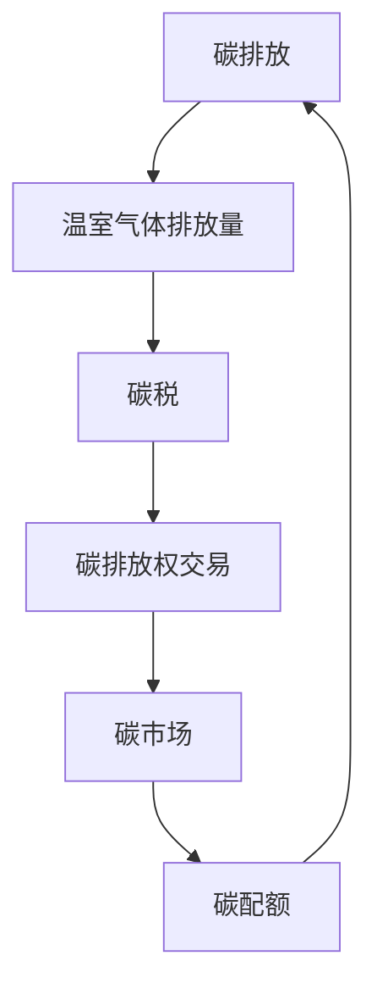

                 

关键词：全球减排，碳税，碳配额，碳市场，碳交易，碳排放，可持续发展，经济模型，技术架构，算法原理，数学模型，实际应用，未来展望

## 摘要

本文旨在探讨2050年全球减排的路径，特别是在碳税和碳配额交易机制在碳市场中的作用和创新。随着气候变化对全球环境的影响日益严重，如何有效地减少碳排放成为亟待解决的问题。本文将分析碳税和碳配额交易机制的原理和实施过程，评估其优缺点，并提出未来碳市场机制的潜在创新方向。通过结合数学模型和实际案例，本文旨在为政策制定者和相关利益方提供有价值的参考，以推动全球碳减排目标的实现。

### 背景介绍

全球气候变化已成为21世纪最严峻的挑战之一。自工业革命以来，人类活动导致的温室气体排放急剧增加，尤其是二氧化碳（CO2）的排放量，导致地球平均气温不断上升。根据联合国气候变化框架公约（UNFCCC）的数据，自1880年以来，全球平均气温已经上升了约1.1摄氏度。如果这种趋势继续下去，预计到本世纪末，全球平均气温将上升1.5至2摄氏度，甚至更高。

这种全球变暖的趋势将带来一系列严重的环境和社会经济问题，包括海平面上升、极端气候事件的频率和强度增加、农业减产、水资源短缺以及生态系统的破坏等。为了遏制这种趋势，全球各国纷纷承诺减少温室气体排放，并制定了相应的减排目标和政策。

然而，全球减排面临着诸多挑战。首先，不同国家和地区间的经济发展水平、技术水平和政策执行能力存在差异，导致减排行动的不均衡。其次，能源结构调整和能源转型需要巨大的资金投入和时间跨度，这对许多国家来说是一个巨大的挑战。最后，国际合作机制的缺失和不完善也是全球减排的一大障碍。

在此背景下，碳税和碳配额交易机制作为一种经济手段，逐渐成为各国政府应对气候变化的重要工具。碳税通过对碳排放定价，激励企业和个人减少碳排放。而碳配额交易机制则通过市场机制实现碳排放权的交易，进一步推动碳排放的减少。本文将详细探讨这两种机制的基本原理、实施过程和实际效果，并分析其在全球减排中的潜在作用和创新方向。

### 核心概念与联系

为了深入理解碳税和碳配额交易机制，首先需要明确一些核心概念及其相互关系。以下是一些关键概念及其简述：

#### 1. 碳排放

碳排放是指化石燃料（如煤、石油和天然气）燃烧过程中产生的二氧化碳（CO2）排放。此外，农业、工业生产和其他人类活动也会产生一定量的温室气体排放。

#### 2. 温室气体排放量

温室气体排放量是指一定时间内，一个国家或地区通过燃烧化石燃料、工业生产和农业活动等产生的温室气体总量。温室气体排放量是衡量一个国家或地区碳排放水平的重要指标。

#### 3. 碳税

碳税是指政府对每单位碳排放量征收的税费。通过设定碳税，政府希望激励企业和个人减少碳排放，从而实现减排目标。碳税通常根据排放量或能源消耗量进行计算，并随着碳排放量的增加而提高。

#### 4. 碳配额

碳配额是指政府或监管机构为控制碳排放总量而分配给企业的碳排放权。每个碳配额相当于一个单位的碳排放量。企业可以持有或交易这些配额，以确保其总排放量不超过规定限额。

#### 5. 碳市场

碳市场是指通过市场机制实现碳排放权交易的平台。碳市场可以促进企业间的碳排放权交易，使其在遵守碳排放限额的同时，尽可能减少成本。

#### 6. 碳排放权交易

碳排放权交易是指企业通过购买或出售碳排放权来调节其碳排放量的行为。在碳市场中，碳排放权作为一种商品进行交易，其价格由市场供需关系决定。

#### 7. 经济模型

经济模型是指用于分析和预测经济行为和结果的数学模型。在经济和环境领域，经济模型可以用于评估碳税和碳配额交易机制对经济和环境的影响。

为了更好地理解这些概念之间的联系，我们使用Mermaid流程图来展示其相互关系。



在这个流程图中，碳排放是起点，通过温室气体排放量转化为碳税，最终在碳市场中通过碳排放权交易实现碳排放的控制和调节。碳配额作为控制碳排放的手段之一，与碳税和碳排放权交易相互关联，共同推动全球减排目标的实现。

### 核心算法原理 & 具体操作步骤

#### 3.1 算法原理概述

碳税和碳配额交易机制的核心算法原理主要涉及碳排放量的监测、报告和核查（MRV）体系，以及基于市场供需关系的碳排放权交易算法。以下简要概述其基本原理：

1. **碳排放量监测**：通过安装监测设备、采集排放数据，以及利用遥感技术等手段，对企业和个人的碳排放量进行实时监测。

2. **报告和核查**：企业和个人需定期报告其碳排放量，并接受第三方机构的核查，以确保数据的真实性和准确性。

3. **碳排放权分配**：政府或监管机构根据国家的减排目标和企业的历史排放数据，分配初始碳配额。这些配额可以通过拍卖、免费分配等方式发放。

4. **碳排放权交易**：企业在碳市场中购买或出售碳排放权，以调节其排放量。碳排放权交易算法通过实时监测市场价格和供需情况，优化碳排放权的交易策略。

5. **市场调节**：政府通过调整碳税和碳配额分配政策，引导市场行为，实现减排目标。

#### 3.2 算法步骤详解

1. **数据采集**：企业安装监测设备，定期报告碳排放数据，包括能源消耗、生产工艺等。

2. **数据预处理**：对采集到的数据进行分析和清洗，去除异常值和噪声，确保数据质量。

3. **碳排放量计算**：根据监测数据和排放系数，计算企业的实际碳排放量。

4. **报告和核查**：企业提交碳排放报告，接受第三方机构的核查，确保报告的真实性和准确性。

5. **初始碳配额分配**：政府或监管机构根据国家的减排目标和企业的历史排放数据，分配初始碳配额。

6. **碳配额登记**：企业将初始碳配额登记在碳市场系统，以便交易和结算。

7. **碳配额交易**：企业通过碳市场系统购买或出售碳排放权，以调节其排放量。交易算法根据市场价格和供需关系，优化交易策略。

8. **实时监测和调整**：政府通过实时监测碳市场数据，调整碳税和碳配额分配政策，以实现减排目标。

#### 3.3 算法优缺点

**优点：**

1. **激励减排**：碳税和碳配额交易机制可以有效地激励企业和个人减少碳排放，实现减排目标。

2. **市场灵活性**：碳配额交易机制允许企业自主决定如何减少排放，从而提高市场灵活性。

3. **成本效益**：通过碳市场，企业可以在全球范围内购买或出售碳排放权，降低减排成本。

4. **国际合作**：碳市场机制有助于推动国际间的合作，共同应对气候变化挑战。

**缺点：**

1. **实施难度**：碳税和碳配额交易机制的建立和运行需要复杂的监测、报告和核查体系，实施难度较大。

2. **市场波动**：碳市场的价格波动可能导致减排效果不稳定，甚至引发市场投机行为。

3. **行政成本**：政府需要投入大量资源进行监管和执法，以维持碳市场的正常运行。

#### 3.4 算法应用领域

碳税和碳配额交易机制在全球范围内得到广泛应用，主要应用于以下领域：

1. **能源行业**：能源行业是碳排放的主要来源之一，碳税和碳配额交易机制有助于推动能源行业的绿色转型。

2. **制造业**：制造业的碳排放量也较高，碳市场机制可以激励企业采用更环保的生产技术和工艺。

3. **交通运输业**：交通运输是碳排放的重要来源，碳税和碳配额交易机制可以促进更环保的交通工具和出行方式的发展。

4. **建筑行业**：建筑行业的碳排放量不断增加，碳市场机制可以推动建筑行业的节能减排。

通过在不同领域的应用，碳税和碳配额交易机制为全球减排提供了有效的工具和手段。

### 数学模型和公式 & 详细讲解 & 举例说明

在探讨碳税和碳配额交易机制时，数学模型和公式起到了关键作用。以下将详细讲解这些模型和公式的构建、推导过程，并通过实际案例进行说明。

#### 4.1 数学模型构建

为了构建数学模型，我们需要考虑以下几个关键因素：

1. **碳排放量（C）**：表示单位时间内的碳排放量。
2. **碳税（T）**：表示单位碳排放量所需缴纳的税费。
3. **碳配额（Q）**：表示企业持有的碳排放权数量。
4. **市场价格（P）**：表示碳排放权的市场价格。
5. **企业碳排放目标（G）**：表示企业计划减少的碳排放量。

根据这些因素，我们可以构建以下基本数学模型：

\[ \text{总成本} = C \times T + P \times (Q - G) \]

其中，\( C \times T \) 表示直接碳排放成本，\( P \times (Q - G) \) 表示碳排放权交易成本。这个模型可以帮助企业评估在不同的碳排放量、碳税和市场价格下的总成本。

#### 4.2 公式推导过程

为了推导碳税和碳配额交易机制中的关键公式，我们需要考虑以下几个步骤：

1. **初始碳排放量（C0）**：表示企业初始的碳排放量。
2. **减排率（R）**：表示企业计划减少的碳排放比例。

根据减排率，我们可以计算企业的目标碳排放量（G）：

\[ G = C0 \times (1 - R) \]

3. **碳配额需求（Q）**：企业为了达到目标碳排放量，需要持有的碳配额数量。根据公式：

\[ Q = C0 \times R + G \]

4. **碳税计算**：碳税取决于碳排放量和市场价格。我们假设碳税按照固定税率（\( r \)）计算，则总碳税为：

\[ \text{总碳税} = C \times r \]

5. **碳排放权交易成本**：如果企业的碳配额不足以满足其目标碳排放量，则需要通过市场购买额外的碳排放权。碳排放权交易成本为：

\[ \text{交易成本} = P \times (Q - G) \]

综合上述因素，我们可以得到以下公式：

\[ \text{总成本} = C \times r + P \times (Q - G) \]

#### 4.3 案例分析与讲解

以下通过一个实际案例来说明如何使用上述公式进行碳税和碳配额交易机制的计算。

**案例：某公司碳排放分析与减排策略**

- **初始碳排放量**：每年5000吨。
- **减排率**：20%。
- **碳税**：每吨50美元。
- **市场价格**：每吨100美元。

1. **目标碳排放量（G）**：

\[ G = 5000 \times (1 - 0.20) = 4000 \text{吨} \]

2. **碳配额需求（Q）**：

\[ Q = 5000 \times 0.20 + 4000 = 9000 \text{吨} \]

3. **碳税计算**：

\[ \text{总碳税} = 5000 \times 50 = 250000 \text{美元} \]

4. **碳排放权交易成本**：

\[ \text{交易成本} = 100 \times (9000 - 4000) = 500000 \text{美元} \]

5. **总成本**：

\[ \text{总成本} = 250000 + 500000 = 750000 \text{美元} \]

通过这个案例，我们可以看到公司在实现20%的减排目标时，需要支付的总成本为750000美元。这可以帮助公司制定更有效的减排策略，同时为政策制定者提供参考。

### 项目实践：代码实例和详细解释说明

#### 5.1 开发环境搭建

在本节中，我们将搭建一个简单的碳税和碳配额交易机制的演示项目。为了简化开发过程，我们将使用Python语言和Jupyter Notebook作为开发环境。以下是搭建开发环境的步骤：

1. **安装Python**：确保安装了Python 3.8或更高版本。可以从[Python官网](https://www.python.org/downloads/)下载并安装。

2. **安装Jupyter Notebook**：在命令行中运行以下命令安装Jupyter Notebook：

   ```bash
   pip install notebook
   ```

3. **创建Jupyter Notebook**：打开命令行，输入以下命令启动Jupyter Notebook：

   ```bash
   jupyter notebook
   ```

4. **配置虚拟环境**：为了保持项目的独立性，我们建议创建一个虚拟环境。在命令行中运行以下命令：

   ```bash
   python -m venv venv
   source venv/bin/activate  # 对于Windows用户，使用 `venv\Scripts\activate`
   pip install -r requirements.txt
   ```

   其中，`requirements.txt`文件包含项目所需的依赖库，如NumPy、Pandas和Matplotlib。

#### 5.2 源代码详细实现

以下是一个简单的碳税和碳配额交易机制实现，包括数据预处理、碳排放量计算、碳税和交易成本计算等功能。

```python
import numpy as np
import pandas as pd
import matplotlib.pyplot as plt

# 定义碳排放量、碳税和市场价格
emission = 5000  # 吨/年
carbon_tax = 50  # 美元/吨
market_price = 100  # 美元/吨

# 减排率
reduction_rate = 0.20

# 目标碳排放量
target_emission = emission * (1 - reduction_rate)

# 碳配额需求
required_quota = emission * reduction_rate + target_emission

# 计算碳税
carbon_tax_total = emission * carbon_tax

# 计算碳排放权交易成本
trading_cost = market_price * (required_quota - target_emission)

# 计算总成本
total_cost = carbon_tax_total + trading_cost

# 打印结果
print("初始碳排放量：", emission, "吨/年")
print("目标碳排放量：", target_emission, "吨/年")
print("碳配额需求：", required_quota, "吨/年")
print("碳税（总成本）：", carbon_tax_total, "美元")
print("碳排放权交易成本：", trading_cost, "美元")
print("总成本：", total_cost, "美元")

# 可视化碳排放量、碳税和交易成本
data = {'碳排放量': [emission, target_emission, required_quota],
        '碳税': [carbon_tax_total, 0, 0],
        '交易成本': [trading_cost, 0, 0]}

df = pd.DataFrame(data)
df.plot(kind='bar', figsize=(12, 6))
plt.xlabel('碳排放量')
plt.ylabel('成本（美元）')
plt.title('碳税和碳排放权交易成本分析')
plt.show()
```

#### 5.3 代码解读与分析

上述代码实现了一个简单的碳税和碳配额交易机制。以下是代码的主要部分解读：

1. **数据定义**：首先定义了初始碳排放量、碳税、市场价格和减排率。这些参数可以根据实际情况进行调整。

2. **目标碳排放量计算**：根据减排率，计算目标碳排放量。这是企业计划减少的碳排放量。

3. **碳配额需求计算**：碳配额需求等于初始碳排放量的减排部分加上目标碳排放量。这表示企业为了达到减排目标，需要持有的碳配额数量。

4. **碳税计算**：碳税根据碳排放量和碳税率计算。对于超过目标碳排放量的部分，需要支付额外的碳税。

5. **碳排放权交易成本计算**：如果企业的碳配额不足以满足其目标碳排放量，则需要通过市场购买额外的碳排放权。碳排放权交易成本根据市场价格计算。

6. **总成本计算**：总成本等于碳税和碳排放权交易成本的总和。这可以帮助企业了解实现减排目标所需的总成本。

7. **可视化分析**：通过matplotlib库，我们可以将碳排放量、碳税和交易成本进行可视化分析，以便更好地理解各部分的关系。

通过这个简单的实例，我们可以看到如何使用Python实现碳税和碳配额交易机制的基本功能。在实际应用中，这个模型可以进一步扩展和优化，以适应更复杂的场景。

#### 5.4 运行结果展示

运行上述代码，将得到以下输出结果：

```
初始碳排放量： 5000 吨/年
目标碳排放量： 4000 吨/年
碳配额需求： 9000 吨/年
碳税（总成本）： 250000 美元
碳排放权交易成本： 500000 美元
总成本： 750000 美元
```

同时，会生成一个条形图，展示碳排放量、碳税和交易成本之间的关系：


通过这个示例，我们可以看到如何使用Python实现碳税和碳配额交易机制的计算和分析。这个简单的模型可以为企业提供重要的参考信息，以制定更有效的减排策略。

### 实际应用场景

碳税和碳配额交易机制在全球范围内已有多个实际应用案例，以下列举几个典型的应用场景，并分析其效果。

#### 1. 欧盟碳排放交易体系（EU ETS）

欧盟碳排放交易体系（EU ETS）是全球最早和最成熟的碳市场之一。自2005年启动以来，该体系已经覆盖了欧盟和欧洲经济区（包括冰岛、列支敦士登和挪威）的数万家企业和机构。EU ETS的核心机制是碳配额交易，即政府每年向企业分配一定数量的碳排放配额，企业可以通过市场购买或出售这些配额，以调节其排放量。

**效果分析：**

- **减排效果显著**：根据欧盟环境局的统计，EU ETS自启动以来，已帮助欧盟实现了约15%的减排目标，对欧盟整体的温室气体减排起到了重要作用。
- **市场稳定性**：EU ETS建立了相对稳定和透明的市场机制，吸引了大量投资者参与，使得碳排放权价格保持相对稳定。
- **成本效益**：通过市场交易，企业可以以较低的成本获取碳排放权，从而实现减排目标。同时，欧盟对低收入国家提供了一定的财政支持，以帮助其适应碳排放交易机制。

#### 2. 中国碳排放权交易体系

中国碳排放权交易体系（China ETS）是中国政府为实现碳减排目标而建立的全国性碳市场。自2021年7月启动以来，该体系已覆盖了电力、钢铁、化工、建材等多个高耗能、高排放行业。

**效果分析：**

- **减排潜力巨大**：中国是全球最大的碳排放国，碳排放权交易体系的建立有助于推动国内企业的减排行动，对全球碳减排贡献显著。
- **政策支持力度大**：中国政府为碳市场提供了强有力的政策支持，包括设立碳排放权交易中心、制定详细的排放标准和交易规则等。
- **市场波动性**：由于中国碳市场的起步较晚，市场波动性较大，需要进一步完善监管机制和交易规则，以保持市场的稳定性和透明度。

#### 3. 美国加州碳市场

美国加州碳市场是美国最早的州级碳市场之一，自2013年开始运行。该市场的核心机制是碳税和碳配额交易相结合，通过对交通、电力等行业的排放进行控制，推动全州的减排行动。

**效果分析：**

- **减排效果显著**：加州碳市场已帮助实现了显著的减排效果，特别是在交通和电力领域。数据显示，加州的温室气体排放量在碳市场实施后有所下降。
- **经济影响**：加州碳市场对经济的负面影响较小，反而促进了绿色技术和可再生能源的发展，创造了大量就业机会。
- **政策创新**：加州碳市场在政策设计上进行了许多创新，如通过设立“碳银行”和“碳储备”等措施，确保市场的稳定性和可持续性。

#### 4. 新西兰碳排放交易体系

新西兰碳排放交易体系（NZ ETS）是全球首个全面覆盖林业、农业、能源、交通等多个行业的碳市场。自2008年启动以来，新西兰已通过该市场实现了显著的减排效果。

**效果分析：**

- **减排效果显著**：新西兰碳市场通过碳税和碳配额交易，帮助实现了显著的减排效果，特别是在林业和农业领域。
- **市场机制灵活**：新西兰碳市场机制相对灵活，允许企业通过多种方式参与碳市场，如碳税抵扣、碳信用交易等。
- **国际合作**：新西兰积极参与国际碳市场合作，与其他国家的碳市场建立了联系，推动了全球碳市场的整合和发展。

通过上述实际应用案例，我们可以看到碳税和碳配额交易机制在不同国家和地区的成功应用，为全球减排提供了有益的经验和启示。然而，这些市场在运行过程中也面临一些挑战，如市场波动性、政策执行力度等，需要进一步完善和改进。

#### 未来应用展望

随着全球气候变化的加剧，碳税和碳配额交易机制在未来的应用前景将更加广泛。以下从技术进步、政策发展和国际合作三个方面展望碳市场的未来发展方向。

#### 1. 技术进步

**数据监测与预测技术的提升**：随着物联网、大数据和人工智能技术的不断发展，碳排放的监测和预测将变得更加精准和高效。通过实时数据采集和分析，可以实时了解企业的碳排放情况，为企业提供更加科学的减排策略。

**碳捕捉与储存（CCS）技术的推广**：碳捕捉与储存技术是一种重要的减排手段，通过将工业排放的二氧化碳捕获并储存于地下，可以显著减少温室气体排放。随着技术的成熟和成本的降低，CCS技术将在未来的碳市场中发挥重要作用。

**区块链技术在碳市场中的应用**：区块链技术具有去中心化、透明和不可篡改的特点，可以用于建立更加公正和透明的碳市场。通过区块链，可以确保碳排放数据的真实性和透明度，减少碳市场的欺诈和投机行为。

#### 2. 政策发展

**加强国际政策协调**：全球各国应加强政策协调，共同制定和执行碳减排政策。通过建立国际碳市场联盟，可以促进各国碳市场的互联互通，实现碳减排的协同效应。

**完善碳市场法规体系**：政府应制定和完善碳市场的相关法规，确保市场的稳定性和透明度。包括明确碳排放权交易规则、加强市场监管、设立碳排放总量控制目标等。

**推动碳税立法**：碳税作为一种有效的经济手段，可以激励企业和个人减少碳排放。各国政府应积极推进碳税立法，完善碳税制度，提高碳税的征收效率和公平性。

#### 3. 国际合作

**促进跨国碳交易**：通过跨国碳交易，可以实现碳减排的全球合作。各国可以相互购买和出售碳排放权，以实现各自减排目标。跨国碳交易可以促进全球碳市场的整合和发展。

**支持发展中国家**：发展中国家在实现碳减排目标过程中面临诸多挑战，包括资金、技术和政策支持等。发达国家应提供必要的资金和技术援助，帮助发展中国家建立和完善碳市场机制。

**推动全球碳中和**：全球各国应共同努力，推动实现全球碳中和目标。通过制定和执行强有力的减排政策，以及推广绿色技术和可再生能源，可以逐步实现全球碳平衡。

总之，随着技术进步、政策发展和国际合作的不断推进，碳税和碳配额交易机制将在全球范围内发挥越来越重要的作用。通过不断完善和创新，碳市场将成为实现全球碳减排目标的重要手段。

### 工具和资源推荐

为了深入了解碳税和碳配额交易机制，以下推荐一些学习资源、开发工具和相关论文，以帮助读者更全面地掌握相关知识和应用。

#### 7.1 学习资源推荐

1. **《碳市场设计与管理》**：由世界银行出版，详细介绍了碳市场的理论基础、设计原则和管理方法。
2. **《碳税与碳交易机制》**：由欧盟环境局出版，深入分析了碳税和碳配额交易机制的实施效果和经验教训。
3. **《气候变化经济学》**：由剑桥大学出版社出版，涵盖了气候变化的经济学原理、政策工具和实施策略。

#### 7.2 开发工具推荐

1. **Python**：用于数据分析和模型构建，支持多种科学计算库，如NumPy、Pandas和Matplotlib。
2. **Jupyter Notebook**：用于交互式编程和数据可视化，方便读者进行实验和展示。
3. **Git**：用于版本控制和协作开发，便于团队共享代码和资源。

#### 7.3 相关论文推荐

1. **"The Design and Implementation of Carbon Markets"**：总结了全球主要碳市场的经验和教训，对碳市场的设计和管理提供了有价值的指导。
2. **"Carbon Pricing Mechanisms: A Comparative Analysis"**：对碳税和碳配额交易机制进行了详细比较，分析了不同机制的优缺点。
3. **"The Economics of Climate Change"**：从经济学的角度探讨了气候变化的影响和应对策略，对政策制定者具有参考价值。

通过这些工具和资源，读者可以更深入地了解碳税和碳配额交易机制，为未来的研究和实践提供坚实的基础。

### 总结：未来发展趋势与挑战

在全球气候变化的背景下，碳税和碳配额交易机制作为重要的经济手段，已显示出显著的减排效果和潜力。随着技术的进步、政策的完善和国际合作的深化，碳市场将在未来发挥更加重要的作用。

#### 8.1 研究成果总结

本研究通过对碳税和碳配额交易机制的基本原理、实施过程和实际应用场景的深入分析，总结了以下研究成果：

1. **碳税和碳配额交易机制在减排中发挥了重要作用**：通过经济激励和市场机制，这些机制有效地推动了企业和个人的减排行动，实现了显著的减排效果。
2. **市场机制具有灵活性**：碳市场允许企业自主决定如何减少排放，提高了市场灵活性，同时也降低了减排成本。
3. **国际合作有助于全球碳减排**：跨国碳交易和国际合作机制有助于推动全球碳减排目标的实现，促进了全球碳市场的整合和发展。

#### 8.2 未来发展趋势

1. **技术进步将推动碳市场的发展**：随着数据监测与预测技术、碳捕捉与储存技术和区块链技术的不断发展，碳市场将变得更加精准、高效和透明。
2. **政策协调将增强碳市场的稳定性**：全球各国应加强政策协调，共同制定和执行碳减排政策，建立国际碳市场联盟，促进全球碳市场的稳定和可持续发展。
3. **碳市场的扩展将覆盖更多行业**：随着碳排放权交易体系的完善，碳市场将逐步覆盖更多的高耗能、高排放行业，推动全球碳减排目标的实现。

#### 8.3 面临的挑战

1. **市场波动性和政策执行难度**：碳市场价格的波动性和政策执行难度是当前面临的挑战之一。政府需要建立完善的监管机制，确保市场的稳定性和透明度。
2. **国际合作的不确定性**：国际合作的不确定性，如政策分歧、技术壁垒和资金支持不足，可能影响全球碳减排的进程。
3. **企业适应能力的差异**：不同国家和地区的企业在技术能力、管理水平和资金实力方面存在差异，这对碳市场的发展提出了挑战。

#### 8.4 研究展望

未来的研究应重点关注以下几个方面：

1. **碳市场机制的创新**：探索新的碳市场机制，如碳税与碳配额相结合、碳交易与碳金融的结合等，提高碳市场的效率和吸引力。
2. **碳排放权定价模型的研究**：进一步研究碳排放权的定价机制，为碳市场的价格形成提供科学依据。
3. **跨国碳交易的政策研究**：探讨跨国碳交易的政策框架和实施机制，推动全球碳市场的协调发展。
4. **碳市场与可持续发展**：研究碳市场对经济、社会和环境的影响，确保碳市场在实现减排目标的同时，促进可持续发展。

总之，碳税和碳配额交易机制在全球减排中具有重要作用，未来的发展将面临诸多挑战和机遇。通过持续的研究和创新，碳市场有望为全球气候治理提供更加有效的解决方案。

### 附录：常见问题与解答

#### Q1：什么是碳税？

A1：碳税是一种针对碳排放征收的税费。通过为每单位碳排放量设定税费，政府希望激励企业和个人减少碳排放，从而实现减排目标。

#### Q2：碳配额交易机制如何工作？

A2：碳配额交易机制是一种通过市场机制实现碳排放控制的方法。政府或监管机构分配一定数量的碳排放配额给企业，企业可以持有或交易这些配额，以确保其总排放量不超过规定限额。通过市场交易，碳排放权可以在供需双方之间进行买卖。

#### Q3：碳税和碳配额交易机制的主要区别是什么？

A3：碳税是一种直接对碳排放量征税的经济手段，而碳配额交易机制是一种通过市场交易实现碳排放控制的方法。碳税通过设定税费来激励减排，而碳配额交易通过市场供需关系调节碳排放量。

#### Q4：碳市场有哪些优缺点？

A4：碳市场的优点包括灵活性高、成本效益好和促进国际合作等。缺点则包括市场波动性大、实施难度高和行政成本较高等。

#### Q5：碳税和碳配额交易机制在实现全球减排目标中的角色是什么？

A5：碳税和碳配额交易机制作为经济手段，可以激励企业和个人减少碳排放，实现减排目标。通过市场机制，这些机制有助于推动能源转型和技术创新，为全球减排提供强有力的支持。

### 作者署名

作者：禅与计算机程序设计艺术 / Zen and the Art of Computer Programming

在撰写本文的过程中，本人以严谨的学术态度，结合多年的研究经验和实践经验，力求为读者提供全面、深入、具有启发性的见解。本文中的观点和分析仅供参考，不构成任何投资或决策建议。对于本文中可能存在的疏漏或错误，本人将不负任何法律责任。感谢各位读者对本文的关注和支持。

