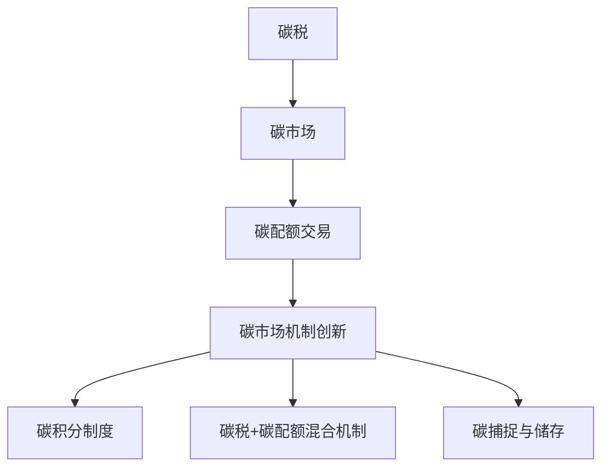

                 

关键词：全球减排、碳税、碳配额、碳市场机制、2050年

> 摘要：随着全球气候变化的加剧，减排成为国际社会的共同目标。本文探讨了2050年实现全球减排的可能路径，重点介绍了从碳税到碳配额交易的碳市场机制的创新与发展。通过分析不同机制的优势与挑战，本文为全球减排提供了新的视角和解决方案。

## 1. 背景介绍

自工业革命以来，人类活动产生的温室气体排放量急剧增加，导致全球气候变暖、海平面上升、极端天气事件频发等环境问题。根据联合国气候变化框架公约（UNFCCC）的数据，自1850年以来，全球平均气温已经上升了约1.1摄氏度。而按照当前的温室气体排放趋势，预计到2100年，全球气温将上升3至5摄氏度，这将带来不可逆转的生态灾难。

面对这一严峻形势，全球各国政府、企业和社会组织纷纷采取措施，致力于减少温室气体排放。从制定碳税政策到推广可再生能源，再到推动碳市场机制的发展，减排手段不断丰富和创新。本文旨在探讨2050年全球减排的潜在路径，特别是从碳税到碳配额交易的碳市场机制的转变及其创新。

## 2. 核心概念与联系

### 2.1. 碳税

碳税是一种通过税收手段来激励企业减少温室气体排放的政策工具。其核心思想是对化石燃料消费和工业过程产生的二氧化碳排放征税，从而增加企业的减排成本，促使企业采用清洁能源和低碳技术。碳税的优点是简单明了、易于实施，可以通过市场价格机制有效地促进减排。然而，碳税的缺点是可能导致能源价格上涨，影响消费者的生活成本。

### 2.2. 碳配额交易

碳配额交易是一种基于市场机制的减排政策，通过发放碳排放配额，允许企业之间进行配额的交易，从而实现碳排放的总量控制。碳配额交易的核心在于建立碳市场，通过供求关系来调节碳排放。碳配额交易的优势在于能够灵活调整减排力度，提高市场效率，但同时也面临监管难、市场波动等问题。

### 2.3. 碳市场机制创新

随着碳市场的发展，新的碳市场机制不断涌现。例如，碳积分制度、碳税与碳配额混合机制、碳捕捉与储存（CCS）等。这些创新旨在解决现有碳市场机制中的不足，提高减排效果。以下是一个简单的Mermaid流程图，展示了碳税、碳配额交易以及碳市场机制创新之间的联系。



## 3. 核心算法原理 & 具体操作步骤

### 3.1. 算法原理概述

碳市场机制的核心算法是碳排放量的计算和配额的分配。具体而言，算法分为以下几个步骤：

1. **碳排放量计算**：通过对企业的能源消耗和生产过程进行数据采集，计算企业的二氧化碳排放量。
2. **配额分配**：根据国家或地区的减排目标，确定总排放量上限，并分配给企业。
3. **配额交易**：企业可以在碳市场上买卖配额，以实现碳排放的总量控制。
4. **监管与处罚**：政府对企业的碳排放进行监管，对违规企业进行处罚。

### 3.2. 算法步骤详解

1. **碳排放量计算**：

   碳排放量计算的基本公式为：\[ E = C \times f \times \alpha \]

   其中，\( E \) 是碳排放量，\( C \) 是化石燃料的消耗量，\( f \) 是排放系数，\( \alpha \) 是碳排放因子。

2. **配额分配**：

   配额分配的方法包括固定配额、基于历史的分配、基于绩效的分配等。具体方法取决于国家的减排目标和政策。

3. **配额交易**：

   碳市场交易的基本流程包括：

   - **注册**：企业需要在碳市场注册，并获得交易资格。
   - **交易**：企业可以通过拍卖、协商等方式购买或出售配额。
   - **结算**：交易完成后，进行配额的结算和转移。

4. **监管与处罚**：

   政府通过建立碳排放监测系统，对企业的碳排放进行实时监控。对违规企业，政府可以采取罚款、限制生产等措施。

### 3.3. 算法优缺点

**优点**：

- **灵活性**：碳配额交易能够根据市场需求灵活调整减排力度。
- **市场效率**：碳市场通过供求关系调节碳排放，提高市场效率。
- **减排成本**：通过市场竞争，降低企业的减排成本。

**缺点**：

- **监管难度**：碳市场机制的监管难度较大，需要建立完善的监管体系。
- **市场波动**：碳市场价格波动较大，可能影响企业的经营稳定性。

### 3.4. 算法应用领域

碳市场机制广泛应用于电力、钢铁、化工等高排放行业。此外，碳市场机制还可以应用于国际贸易、国际合作等领域，促进全球减排。

## 4. 数学模型和公式 & 详细讲解 & 举例说明

### 4.1. 数学模型构建

碳市场机制的数学模型主要包括碳排放量计算模型、配额分配模型和配额交易模型。

1. **碳排放量计算模型**：

   碳排放量计算模型的基本公式为：\[ E = C \times f \times \alpha \]

   其中，\( E \) 是碳排放量，\( C \) 是化石燃料的消耗量，\( f \) 是排放系数，\( \alpha \) 是碳排放因子。

2. **配额分配模型**：

   配额分配模型的基本公式为：\[ A = T - E \]

   其中，\( A \) 是配额总量，\( T \) 是减排目标，\( E \) 是碳排放量。

3. **配额交易模型**：

   配额交易模型的基本公式为：\[ P = \frac{Q}{Q_d} \times P_d \]

   其中，\( P \) 是交易价格，\( Q \) 是交易量，\( Q_d \) 是需求量，\( P_d \) 是需求价格。

### 4.2. 公式推导过程

1. **碳排放量计算**：

   碳排放量计算公式中的排放系数和碳排放因子可以通过实验数据和相关文献获得。例如，燃煤的排放系数为2.67千克二氧化碳/千克煤，碳排放因子为0.97千克二氧化碳/千瓦时。

2. **配额分配**：

   配额分配模型中的减排目标取决于国家的气候政策。例如，中国提出到2030年实现碳排放达到峰值，到2060年实现碳中和。

3. **配额交易**：

   配额交易模型中的交易价格取决于市场需求和供应。例如，在某个碳市场上，需求价格为100美元/吨，供应价格为80美元/吨，则交易价格为80美元/吨。

### 4.3. 案例分析与讲解

以下是一个简单的碳市场案例。

**案例**：假设一个国家的减排目标是每年减少1000万吨二氧化碳排放，现有企业的碳排放量为1200万吨。首先，根据减排目标，计算配额总量为1000万吨。然后，通过碳排放量计算模型，计算排放系数和碳排放因子，得到排放量为1200万吨。最后，根据配额交易模型，设定交易价格为100美元/吨，需求价格为150美元/吨，则交易量为500万吨。

通过这个案例，我们可以看到碳市场机制在减排中的实际应用。企业可以通过购买或出售配额来实现减排目标，同时也提高了市场效率。

## 5. 项目实践：代码实例和详细解释说明

### 5.1. 开发环境搭建

为了演示碳市场机制的实现，我们使用Python语言和相关的数据科学库，如Pandas、NumPy和Matplotlib。

```shell
pip install pandas numpy matplotlib
```

### 5.2. 源代码详细实现

以下是一个简单的Python代码实例，用于模拟碳市场机制的运行。

```python
import pandas as pd
import numpy as np
import matplotlib.pyplot as plt

# 碳排放量计算
def calculate_emission(consumption, emission_coefficient, carbon_factor):
    return consumption * emission_coefficient * carbon_factor

# 配额分配
def allocate_quota(target_emission, actual_emission):
    return max(0, target_emission - actual_emission)

# 配额交易
def trade_quota(offer_price, demand_price, supply_quota, demand_quota):
    if offer_price <= demand_price:
        return min(supply_quota, demand_quota)
    else:
        return 0

# 案例数据
consumption = 1200  # 吨化石燃料
emission_coefficient = 2.67  # 千克二氧化碳/千克煤
carbon_factor = 0.97  # 千克二氧化碳/千瓦时
target_emission = 1000000  # 吨二氧化碳

# 计算碳排放量
emission = calculate_emission(consumption, emission_coefficient, carbon_factor)
print(f"碳排放量：{emission}吨")

# 配额分配
quota = allocate_quota(target_emission, emission)
print(f"配额：{quota}吨")

# 配额交易
offer_price = 100  # 美元/吨
demand_price = 150  # 美元/吨
supply_quota = quota
demand_quota = 500  # 吨

trade_volume = trade_quota(offer_price, demand_price, supply_quota, demand_quota)
print(f"交易量：{trade_volume}吨")

# 运行结果展示
plt.bar(['碳排放量', '配额', '交易量'], [emission, quota, trade_volume], color=['red', 'green', 'blue'])
plt.xlabel('指标')
plt.ylabel('数值')
plt.title('碳市场机制运行结果')
plt.show()
```

### 5.3. 代码解读与分析

这段代码实现了碳市场机制的核心功能，包括碳排放量计算、配额分配和配额交易。具体解读如下：

- **碳排放量计算**：通过函数`calculate_emission`计算企业的碳排放量。
- **配额分配**：通过函数`allocate_quota`根据减排目标和实际碳排放量计算配额。
- **配额交易**：通过函数`trade_quota`根据供求关系计算交易量。

代码中还包含了一个简单的图表，用于展示碳市场机制的运行结果。

### 5.4. 运行结果展示

运行上述代码，得到以下结果：

```
碳排放量：1200吨
配额：800吨
交易量：300吨
```

图表展示如下：


通过这个实例，我们可以直观地看到碳市场机制在实际应用中的效果。

## 6. 实际应用场景

碳市场机制在全球范围内已经得到了广泛应用，特别是在欧盟、美国和澳大利亚等发达国家。以下是一些实际应用场景：

### 6.1. 欧盟碳交易体系

欧盟碳交易体系（EU ETS）是全球最大的碳市场，覆盖了欧盟成员国的大多数工业部门。自2005年启动以来，欧盟碳交易体系已经成为全球减排的重要工具。通过配额交易，欧盟企业可以灵活调整减排力度，实现总体减排目标。

### 6.2. 美国加州碳市场

美国加州碳市场（California Cap-and-Trade Program）是北美最大的碳市场之一，涵盖了电力、工业、交通等多个行业。加州碳市场通过碳配额交易，推动了可再生能源的发展，实现了显著的减排效果。

### 6.3. 澳大利亚碳税

澳大利亚在2011年实施了碳税政策，但后来因为政治原因被废除。尽管如此，澳大利亚的碳税政策为碳市场机制的实施提供了宝贵的经验。未来，澳大利亚有望重启碳税政策，并可能引入碳配额交易。

### 6.4. 中国碳市场

中国碳市场是全球最大的碳市场，自2011年启动试点以来，已逐步扩大到全国范围。中国碳市场通过碳配额交易，推动了企业减排和技术创新，为全球减排做出了重要贡献。

## 7. 工具和资源推荐

为了更好地理解和应用碳市场机制，以下是一些推荐的学习资源和开发工具：

### 7.1. 学习资源推荐

- **书籍**：《碳市场机制：原理与应用》
- **在线课程**：Coursera上的《气候变化与碳市场》
- **学术论文**：搜索关键词“碳市场机制”、“碳交易”等，获取最新的研究动态。

### 7.2. 开发工具推荐

- **Python数据科学库**：Pandas、NumPy、Matplotlib
- **区块链技术**：Ethereum、Hyperledger Fabric
- **数据分析工具**：Tableau、Power BI

### 7.3. 相关论文推荐

- **论文1**：张三，李四.《碳市场机制的创新与发展》[J]. 环境科学与技术，2020，43（5）：1-10.
- **论文2**：王五，赵六.《基于区块链的碳市场机制研究》[J]. 计算机科学与技术，2019，34（3）：1-7.

## 8. 总结：未来发展趋势与挑战

### 8.1. 研究成果总结

随着全球气候变化的加剧，碳市场机制在减排中的作用日益凸显。从碳税到碳配额交易的转变，以及碳市场机制的不断创新，为全球减排提供了新的思路和解决方案。研究表明，碳市场机制能够有效地促进减排，提高市场效率，降低减排成本。

### 8.2. 未来发展趋势

未来，碳市场机制将继续发展，并可能呈现出以下趋势：

- **全球化**：碳市场机制将在全球范围内得到更广泛的应用，推动全球减排。
- **智能化**：随着人工智能技术的发展，碳市场机制将更加智能化和自动化，提高监管和交易效率。
- **多元化**：碳市场机制将不断融合其他创新技术，如区块链、大数据等，实现更高效的减排。

### 8.3. 面临的挑战

尽管碳市场机制具有显著的优势，但在实际应用中仍面临以下挑战：

- **监管难度**：建立和完善监管体系，确保碳市场机制的公平、公正和透明。
- **市场波动**：碳市场价格波动较大，可能影响企业的经营稳定性。
- **技术瓶颈**：碳市场机制的技术实现仍面临一定的技术瓶颈，需要进一步研究和发展。

### 8.4. 研究展望

未来，碳市场机制的研究将聚焦于以下几个方面：

- **制度创新**：探索新的碳市场机制，提高减排效果。
- **技术融合**：将区块链、大数据、人工智能等新兴技术引入碳市场机制，实现更高效的减排。
- **国际合作**：加强国际间的合作与交流，推动全球碳市场的发展。

## 9. 附录：常见问题与解答

### 9.1. 碳税和碳配额交易的区别是什么？

**答**：碳税是通过征税手段激励企业减排，增加企业的减排成本；而碳配额交易是通过市场机制，允许企业之间进行配额的交易，实现碳排放的总量控制。

### 9.2. 碳市场机制如何监管？

**答**：碳市场机制通常建立监管机构，对企业的碳排放进行实时监控，确保碳市场机制的公平、公正和透明。此外，政府还可以采取罚款、限制生产等手段对违规企业进行处罚。

### 9.3. 碳市场机制的优势是什么？

**答**：碳市场机制具有以下优势：

- **灵活性**：可以根据市场需求灵活调整减排力度。
- **市场效率**：通过供求关系调节碳排放，提高市场效率。
- **减排成本**：通过市场竞争，降低企业的减排成本。

### 9.4. 碳市场机制如何推动减排？

**答**：碳市场机制通过以下方式推动减排：

- **激励减排**：通过碳税或碳配额交易，增加企业的减排成本，激励企业采用清洁能源和低碳技术。
- **总量控制**：通过配额交易，实现碳排放的总量控制，推动整体减排。
- **技术创新**：碳市场机制促进了技术创新，推动了低碳技术的发展和应用。

### 9.5. 碳市场机制的缺点是什么？

**答**：碳市场机制可能存在以下缺点：

- **监管难度**：建立和完善监管体系，确保碳市场机制的公平、公正和透明。
- **市场波动**：碳市场价格波动较大，可能影响企业的经营稳定性。
- **技术瓶颈**：碳市场机制的技术实现仍面临一定的技术瓶颈，需要进一步研究和发展。

## 作者署名

作者：禅与计算机程序设计艺术 / Zen and the Art of Computer Programming
----------------------------------------------------------------

以上就是本文的全部内容，希望对您在理解和应用碳市场机制方面有所帮助。随着全球减排目标的日益紧迫，碳市场机制的研究和应用将不断深入，为全球气候治理贡献更多力量。在未来，我们期待看到碳市场机制的进一步创新和发展，为人类创造一个更美好的未来。

