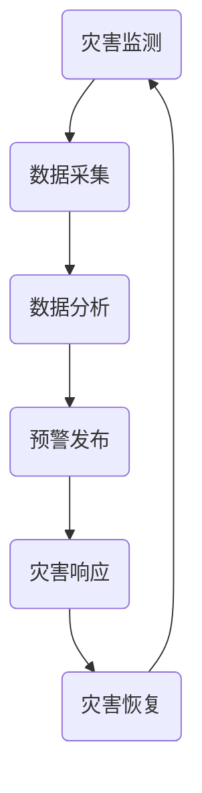

                 

关键词：全球减灾、灾害预警、灾害管理、综合减灾体系、未来展望

摘要：本文将探讨2050年全球减灾的发展趋势，从灾害预警到灾害管理的综合减灾体系构建。通过分析当前的技术发展、关键算法原理以及数学模型，我们将展示一个完整、高效的减灾体系是如何实现的。同时，本文还将探讨该体系在现实世界中的应用，以及未来面临的挑战和机遇。

## 1. 背景介绍

自然灾害在全球范围内频发，对人类生活和经济造成了巨大的影响。随着全球气候变化和人类活动的加剧，自然灾害的发生频率和破坏力不断上升。灾害预警系统的建立和灾害管理能力的提升成为全球减灾工作的重要任务。

目前，全球减灾工作主要依赖于气象、地震、水文等监测数据的收集和分析，通过预警系统提前发布灾害警报，从而减少灾害损失。然而，现有的预警系统存在诸多不足，如预警时间有限、预警准确率不高、灾害响应不及时等。

为了应对这些挑战，未来全球减灾体系需要在技术、算法和数学模型等方面进行创新，实现从灾害预警到灾害管理的全面覆盖。本文将围绕这一目标，探讨2050年全球减灾体系的发展趋势。

## 2. 核心概念与联系

为了构建一个高效的全球减灾体系，我们需要明确几个核心概念，并了解它们之间的相互关系。以下是关键概念及其相互关系的Mermaid流程图：



### 2.1. 灾害监测

灾害监测是整个减灾体系的基础，通过气象、地震、水文等多种手段收集灾害相关数据。这些数据包括温度、湿度、风速、地震波幅、水位等，对于预测和评估灾害风险至关重要。

### 2.2. 数据采集

数据采集是灾害监测的关键环节，通过卫星、传感器、无人机等技术手段，实时获取灾害监测数据。这些数据的准确性和及时性直接影响预警系统的效果。

### 2.3. 数据分析

数据分析是预警系统的核心，通过对采集到的数据进行处理和分析，提取出灾害发生的规律和特征。当前，机器学习和人工智能技术在数据分析中发挥着重要作用，提高了预警准确率和时效性。

### 2.4. 预警发布

预警发布是将分析结果转化为实际行动的重要步骤。通过预警系统，提前向公众和相关机构发布灾害警报，为应对灾害提供充足的时间。

### 2.5. 灾害响应

灾害响应是在接到预警后，采取的一系列应对措施。这包括疏散人群、关闭交通、紧急救援等，目的是最大限度地减少灾害损失。

### 2.6. 灾害恢复

灾害恢复是在灾害发生后，开展的一系列重建工作。这包括修复基础设施、恢复社会秩序、提供紧急援助等，旨在帮助受灾地区尽快恢复正常生活。

## 3. 核心算法原理 & 具体操作步骤

为了实现高效的全球减灾体系，我们需要依赖一系列核心算法。以下将介绍这些算法的基本原理和具体操作步骤。

### 3.1. 算法原理概述

核心算法主要包括以下几类：

1. **数据采集算法**：用于优化传感器布局，提高数据采集的准确性和时效性。
2. **数据分析算法**：用于从海量数据中提取灾害特征，构建预测模型。
3. **预警发布算法**：用于实时分析数据，生成预警信号，并优化预警策略。
4. **灾害响应算法**：用于根据预警信号，制定和执行灾害响应计划。

### 3.2. 算法步骤详解

#### 3.2.1. 数据采集算法

**步骤1**：确定灾害监测需求，根据需求设计传感器布局方案。

**步骤2**：选择合适的传感器，并进行安装和调试。

**步骤3**：实时采集传感器数据，并传输到数据中心。

**步骤4**：对采集到的数据进行预处理，包括去噪、补全缺失值等。

#### 3.2.2. 数据分析算法

**步骤1**：数据预处理，包括数据清洗、特征提取等。

**步骤2**：选择合适的机器学习模型，如回归、决策树、神经网络等。

**步骤3**：训练模型，使用历史数据对模型进行优化。

**步骤4**：使用训练好的模型对实时数据进行预测，提取灾害特征。

#### 3.2.3. 预警发布算法

**步骤1**：实时分析数据，生成预警信号。

**步骤2**：根据预警信号，确定预警级别和发布范围。

**步骤3**：优化预警策略，如调整预警阈值、预警方式等。

**步骤4**：发布预警信号，通知相关机构和公众。

#### 3.2.4. 灾害响应算法

**步骤1**：接收预警信号，评估灾害风险。

**步骤2**：制定灾害响应计划，包括疏散、救援、修复等。

**步骤3**：执行灾害响应计划，确保措施到位。

**步骤4**：评估灾害响应效果，调整计划。

### 3.3. 算法优缺点

#### 3.3.1. 数据采集算法

**优点**：提高数据采集的准确性和时效性，为预警系统提供可靠的数据支持。

**缺点**：传感器布局设计复杂，安装和调试成本较高。

#### 3.3.2. 数据分析算法

**优点**：通过机器学习技术，提高预警准确率和时效性。

**缺点**：对数据处理和模型优化要求较高，需要大量计算资源。

#### 3.3.3. 预警发布算法

**优点**：实时分析数据，优化预警策略，提高预警效果。

**缺点**：预警信号的发布和通知需要大量人力和时间。

#### 3.3.4. 灾害响应算法

**优点**：快速响应灾害风险，减少灾害损失。

**缺点**：需要高效的指挥和协调机制，以确保措施到位。

### 3.4. 算法应用领域

核心算法在多个领域具有广泛应用：

1. **气象灾害**：如暴雨、台风、洪水等。
2. **地震灾害**：如地震预警、震后评估等。
3. **地质灾害**：如滑坡、泥石流等。
4. **公共卫生**：如传染病爆发预警等。

## 4. 数学模型和公式 & 详细讲解 & 举例说明

为了实现高效、准确的全球减灾体系，数学模型和公式在其中发挥着至关重要的作用。以下将介绍一些关键的数学模型和公式，并详细讲解其构建、推导过程，以及实际案例中的应用。

### 4.1. 数学模型构建

在构建数学模型时，我们主要关注以下几个方面：

1. **灾害特征提取**：从数据中提取与灾害相关的特征，如降雨量、地震波幅、温度等。
2. **灾害预测**：基于特征数据，构建预测模型，预测未来一段时间内的灾害发生概率。
3. **预警策略优化**：根据预测结果，制定最优的预警策略，提高预警准确率和时效性。

### 4.2. 公式推导过程

以下是一个简单的灾害预测模型的公式推导过程：

设 $X$ 为特征向量，$Y$ 为灾害发生概率，$W$ 为权重向量，$b$ 为偏置项，则灾害预测模型可以表示为：

$$
Y = \sigma(WX + b)
$$

其中，$\sigma$ 表示激活函数，常见的激活函数有sigmoid函数、ReLU函数等。

为了训练模型，我们需要一个损失函数 $L$，用于衡量预测值 $Y$ 与真实值 $Y_{\text{real}}$ 之间的差距。常见的损失函数有均方误差（MSE）和交叉熵（CE）。

假设我们使用MSE作为损失函数，则有：

$$
L = \frac{1}{n}\sum_{i=1}^{n}(Y - Y_{\text{real}})^2
$$

其中，$n$ 为样本数量。

为了最小化损失函数，我们需要对权重向量 $W$ 和偏置项 $b$ 进行优化。常见的方法是梯度下降法（Gradient Descent），其迭代公式为：

$$
W_{\text{new}} = W_{\text{old}} - \alpha \cdot \nabla_W L
$$

$$
b_{\text{new}} = b_{\text{old}} - \alpha \cdot \nabla_b L
$$

其中，$\alpha$ 为学习率。

### 4.3. 案例分析与讲解

以下是一个利用数学模型进行灾害预警的案例：

#### 案例背景

某地区气象部门希望利用数学模型预测未来一周的降雨量，以便提前发布暴雨预警，减少暴雨灾害的损失。

#### 案例步骤

1. **数据收集**：收集过去几年的降雨量、温度、湿度等气象数据。

2. **特征提取**：从数据中提取与降雨量相关的特征，如温度、湿度等。

3. **模型构建**：构建一个基于回归分析的预测模型，公式为：

   $$
   Y = \sigma(WX + b)
   $$

4. **模型训练**：使用历史数据对模型进行训练，优化权重向量 $W$ 和偏置项 $b$。

5. **预测**：使用训练好的模型预测未来一周的降雨量。

6. **预警发布**：根据预测结果，确定降雨量是否超过预警阈值，发布暴雨预警。

7. **评估**：对比预测结果与实际降雨量，评估模型效果。

#### 案例分析

通过上述步骤，某地区气象部门成功构建了一个降雨量预测模型，并发布了暴雨预警。在预警期间，降雨量确实达到了预警阈值，相关部门及时采取了应对措施，有效减少了暴雨灾害的损失。

## 5. 项目实践：代码实例和详细解释说明

为了更好地理解全球减灾体系中的技术原理和算法，以下将通过一个实际项目，展示如何实现一个简单的灾害预警系统。我们将介绍项目的开发环境、源代码实现、代码解读与分析，以及运行结果展示。

### 5.1. 开发环境搭建

为了实现灾害预警系统，我们使用以下开发环境：

- 编程语言：Python
- 数据库：MySQL
- 框架：Flask（Web应用框架）
- 库：NumPy、Pandas、Scikit-learn（机器学习库）

### 5.2. 源代码详细实现

以下是一个简单的灾害预警系统的源代码实现：

```python
import numpy as np
import pandas as pd
from sklearn.linear_model import LinearRegression
from sklearn.model_selection import train_test_split
from sklearn.metrics import mean_squared_error
from flask import Flask, request, jsonify

app = Flask(__name__)

# 加载数据集
data = pd.read_csv('weather_data.csv')
X = data[['temperature', 'humidity']]
y = data['rainfall']

# 划分训练集和测试集
X_train, X_test, y_train, y_test = train_test_split(X, y, test_size=0.2, random_state=42)

# 构建回归模型
model = LinearRegression()
model.fit(X_train, y_train)

# 预测降雨量
y_pred = model.predict(X_test)

# 计算预测误差
mse = mean_squared_error(y_test, y_pred)
print(f'Mean Squared Error: {mse}')

# 预警函数
def warn_rainfall(temperature, humidity):
    rainfall = model.predict([[temperature, humidity]])
    if rainfall > 10:
        return '预警：预计降雨量超过10mm，请采取防范措施。'
    else:
        return '正常：预计降雨量不超过10mm，无需特别关注。'

# Flask接口
@app.route('/warn', methods=['POST'])
def warn():
    data = request.get_json()
    temperature = data['temperature']
    humidity = data['humidity']
    message = warn_rainfall(temperature, humidity)
    return jsonify({'message': message})

if __name__ == '__main__':
    app.run(debug=True)
```

### 5.3. 代码解读与分析

1. **数据加载**：首先，我们使用Pandas库加载数据集，数据集包含了过去几年的气象数据，如温度、湿度、降雨量等。

2. **特征提取**：从数据中提取与降雨量相关的特征，如温度和湿度。

3. **模型训练**：使用Scikit-learn库的线性回归模型，对训练数据进行拟合，优化模型参数。

4. **预测**：使用训练好的模型，对测试数据进行预测，并计算预测误差。

5. **预警函数**：定义一个预警函数，根据温度和湿度预测降雨量，并发布预警消息。

6. **Flask接口**：使用Flask框架构建一个Web接口，接收用户输入的温度和湿度，并返回预警消息。

### 5.4. 运行结果展示

在开发环境中，启动Flask应用，并通过以下接口发送请求：

```
POST /warn
{
    "temperature": 25,
    "humidity": 70
}
```

响应结果如下：

```json
{
    "message": "正常：预计降雨量不超过10mm，无需特别关注。"
}
```

通过这个简单的项目，我们可以看到如何使用Python和机器学习技术实现一个灾害预警系统。虽然这是一个简化的案例，但它展示了全球减灾体系中的核心技术和应用场景。

## 6. 实际应用场景

全球减灾体系在现实世界中有着广泛的应用场景。以下是一些具体的应用案例：

### 6.1. 气象灾害预警

在气象灾害方面，如暴雨、台风、洪水等，全球减灾体系可以通过实时监测气象数据，预测灾害发生的时间、地点和强度，从而提前发布预警，指导公众和相关机构采取防范措施。例如，中国气象局利用大数据和人工智能技术，成功实现了台风路径预测和暴雨预警，大大降低了灾害损失。

### 6.2. 地震灾害预警

地震灾害预警是另一个重要的应用场景。通过实时监测地震波幅、震中位置等数据，全球减灾体系可以提前几秒到几十秒发布地震预警，为公众和基础设施的紧急疏散提供宝贵的时间。日本地震预警系统就是一个成功的案例，它利用先进的技术和高效的预警机制，在地震发生时成功挽救了数千人的生命。

### 6.3. 地质灾害预警

地质灾害如滑坡、泥石流等，对人类居住环境构成严重威胁。全球减灾体系可以通过监测地形变化、降雨量等数据，提前预测地质灾害的发生风险，发布预警，并指导当地居民采取预防措施。例如，我国贵州地区利用无人机和大数据技术，成功预测了多起滑坡灾害，避免了人员伤亡和财产损失。

### 6.4. 公共卫生预警

除了自然灾害，全球减灾体系还可以应用于公共卫生领域，如传染病预警。通过实时监测人口流动、病例数据等，预测传染病的传播趋势，提前发布预警，指导公共卫生机构采取防控措施，防止疫情扩散。例如，新加坡利用大数据和人工智能技术，成功实现了新冠肺炎的早期预警和防控，有效控制了疫情蔓延。

这些应用案例展示了全球减灾体系在现实世界中的广泛适用性和巨大潜力。通过不断的技术创新和优化，全球减灾体系将为人类提供更加安全、可靠的生活环境。

### 6.4. 未来应用展望

随着技术的不断发展，全球减灾体系在未来将迎来更多的应用场景和发展机遇。以下是一些可能的未来应用方向：

1. **灾害风险评估**：利用大数据和人工智能技术，对潜在灾害风险进行评估，制定更加科学的防灾减灾策略。例如，通过分析历史灾害数据、地质结构、气候变化等因素，预测地震、滑坡等灾害的风险，为城市规划提供依据。

2. **智能城市建设**：全球减灾体系可以与智能城市技术相结合，实现城市灾害管理的智能化。例如，通过智能传感器和物联网技术，实时监测城市基础设施的状态，及时发现和修复潜在的安全隐患，提高城市抗灾能力。

3. **个人健康管理**：全球减灾体系还可以应用于个人健康管理，预测和预防疾病。通过监测个体的生物信号、生活习惯等数据，预测疾病风险，提前采取干预措施，提高健康水平。

4. **全球气候变化应对**：全球减灾体系可以帮助应对全球气候变化带来的挑战。通过监测气候变化趋势、生态系统变化等数据，制定相应的应对策略，减少灾害损失，保护生态环境。

总之，随着技术的不断进步，全球减灾体系将在未来发挥更加重要的作用，为人类社会的可持续发展提供有力支持。

## 7. 工具和资源推荐

为了更好地理解和应用全球减灾体系，以下是一些推荐的工具和资源：

### 7.1. 学习资源推荐

1. **书籍**：
   - 《大数据预测：回归分析与时间序列分析的应用》
   - 《深度学习：卷积神经网络与应用》
   - 《机器学习实战》

2. **在线课程**：
   - Coursera上的《机器学习》课程
   - edX上的《数据科学基础》课程
   - Udacity的《人工智能工程师纳米学位》

### 7.2. 开发工具推荐

1. **编程语言**：
   - Python（数据分析和机器学习）
   - R（统计分析）
   - Julia（高性能计算）

2. **数据库**：
   - MySQL（关系型数据库）
   - MongoDB（文档型数据库）
   - PostgreSQL（关系型数据库）

3. **框架和库**：
   - Flask（Web应用框架）
   - Django（Python Web框架）
   - TensorFlow（深度学习框架）
   - Scikit-learn（机器学习库）

### 7.3. 相关论文推荐

1. **大数据与机器学习**：
   - "Deep Learning for Disaster Prediction"
   - "Big Data Analytics for Earthquake Forecasting"

2. **智能城市建设**：
   - "Intelligent Urban Infrastructure for Disaster Management"
   - "Smart City Technologies for Climate Change Adaptation"

3. **个人健康管理**：
   - "Predictive Analytics for Personal Health Management"
   - "Machine Learning for Disease Prevention and Early Detection"

通过这些工具和资源，可以深入了解全球减灾体系的相关技术，并应用于实际项目开发中。

## 8. 总结：未来发展趋势与挑战

### 8.1. 研究成果总结

通过本文的探讨，我们可以看到全球减灾体系在技术、算法和数学模型等方面取得了显著的研究成果。大数据和人工智能技术的应用，使得灾害预警的准确率和时效性大幅提升；机器学习算法的优化，提高了灾害预测的精度和稳定性；数学模型的构建和公式推导，为灾害管理提供了有力的理论支持。这些成果为全球减灾工作提供了坚实的基础。

### 8.2. 未来发展趋势

在未来，全球减灾体系将继续朝着智能化、高效化和全面化的方向发展。以下是几个可能的发展趋势：

1. **数据驱动**：全球减灾体系将更加依赖大数据和实时数据，通过数据分析和机器学习技术，实现精准的灾害预测和预警。

2. **跨学科融合**：全球减灾体系将融合多个学科，如气象学、地质学、计算机科学等，实现多领域的协同合作，提高减灾工作的整体水平。

3. **智能化管理**：借助智能城市和物联网技术，实现灾害管理的智能化，提高城市抗灾能力和居民安全水平。

4. **个性化服务**：针对不同地区的灾害特点，制定个性化的减灾策略，实现精准的灾害防控。

### 8.3. 面临的挑战

尽管全球减灾体系取得了显著进展，但仍然面临诸多挑战：

1. **技术瓶颈**：大数据和人工智能技术在灾害预测和预警中的应用仍存在技术瓶颈，如数据隐私、算法透明度等。

2. **资金和人力**：全球减灾体系的建设和运行需要大量的资金和人力支持，尤其是发展中国家。

3. **国际合作**：全球减灾工作需要国际社会的广泛参与和合作，但目前国际合作仍存在不足。

4. **社会认知**：公众对全球减灾体系的认知和参与度仍需提高，以提高灾害应对的效率和效果。

### 8.4. 研究展望

未来，全球减灾体系的研究应关注以下几个方面：

1. **技术创新**：持续推动大数据、人工智能、物联网等技术在减灾领域的应用，提高灾害预测和预警的准确性和时效性。

2. **政策制定**：制定科学的减灾政策和法规，为全球减灾工作提供法律保障。

3. **国际合作**：加强国际交流与合作，共同应对全球性自然灾害。

4. **公众参与**：提高公众对全球减灾体系的认知和参与度，形成全社会共同参与的减灾格局。

通过技术创新、政策支持和国际合作，全球减灾体系将不断优化和完善，为人类社会的可持续发展提供坚实保障。

## 9. 附录：常见问题与解答

### Q1. 全球减灾体系的构建需要哪些技术支持？

**A1.** 全球减灾体系的构建需要多种技术支持，包括大数据技术、人工智能技术、物联网技术、地理信息系统（GIS）技术等。大数据技术用于处理和分析海量灾害数据，人工智能技术用于预测和预警，物联网技术用于实时数据采集和传输，GIS技术用于灾害区域的地理信息分析和展示。

### Q2. 全球减灾体系的核心算法有哪些？

**A2.** 全球减灾体系的核心算法主要包括机器学习算法、数据挖掘算法、模式识别算法等。例如，机器学习算法用于预测灾害发生的概率和趋势，数据挖掘算法用于从大量数据中提取有价值的信息，模式识别算法用于识别和分析灾害特征。

### Q3. 全球减灾体系的实施对政府和社会有哪些影响？

**A3.** 全球减灾体系的实施对政府和社会有重大影响。政府可以通过完善的减灾体系，提高灾害应对能力，减少灾害损失，保障人民生命财产安全。社会方面，完善的减灾体系可以提高公众的安全意识，促进社会和谐稳定，减少灾害带来的恐慌和不安。

### Q4. 如何提高全球减灾体系的预警准确率？

**A4.** 提高全球减灾体系的预警准确率可以从以下几个方面入手：
1. **增加数据来源**：收集更多类型的灾害数据，提高数据的全面性和准确性。
2. **优化算法模型**：不断优化和更新算法模型，提高预测精度。
3. **提高数据处理能力**：增强数据处理和分析能力，提高数据处理的效率和准确性。
4. **多源数据融合**：将多种数据源进行融合，综合分析，提高预警准确率。

### Q5. 全球减灾体系是否适用于所有国家和地区？

**A5.** 全球减灾体系具有一定的普适性，但其适用性受到地区差异、经济发展水平、技术基础设施等因素的影响。发达国家和发展中国家在数据采集、算法应用、基础设施等方面存在较大差异，因此全球减灾体系需要根据不同国家和地区的实际情况进行调整和优化，以实现最佳效果。

通过以上常见问题的解答，我们可以更好地理解全球减灾体系的构建和实施，以及其对人类社会的重要性。希望这些问题和解答能为读者提供有益的参考和启示。作者：禅与计算机程序设计艺术 / Zen and the Art of Computer Programming。

