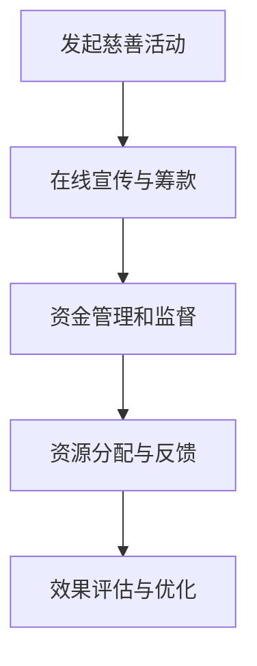
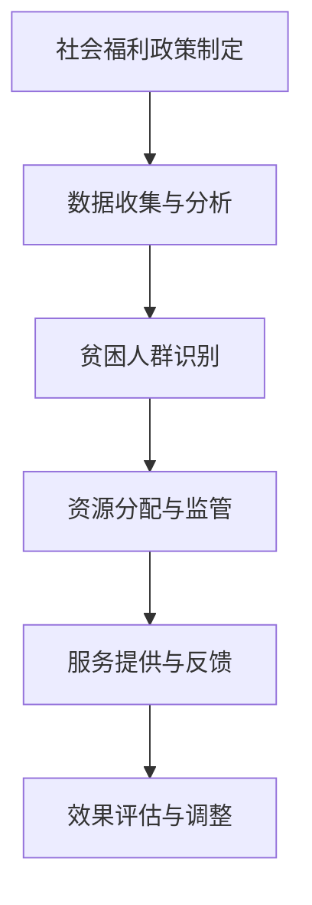
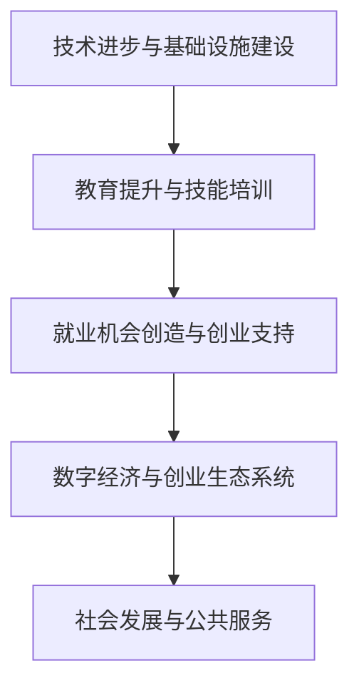

                 

关键词：全球减贫、数字慈善、共享福利、包容性发展、技术进步、人工智能、算法模型、数学公式、代码实例、未来应用

> 摘要：本文探讨了2050年全球减贫的愿景，通过数字慈善、共享福利和包容性发展的途径，分析了技术进步在实现这一目标中的作用。本文详细介绍了核心算法原理、数学模型、代码实例和实际应用场景，并对未来发展趋势和面临的挑战进行了展望。

## 1. 背景介绍

全球减贫一直是国际社会关注的焦点。从1980年代以来，全球贫困率显著下降，但仍有约7.2亿人生活在极端贫困中。联合国可持续发展目标（SDGs）中的目标1明确提出，要在2030年前消除一切形式的贫困。然而，实现这一目标面临着诸多挑战，包括经济不稳定、冲突、不平等、环境破坏等。

数字慈善和共享福利作为新兴的概念，正在逐渐成为全球减贫的重要工具。数字慈善指的是通过互联网、社交媒体和其他数字平台进行慈善活动，以更高效、透明的方式筹集资金和资源。共享福利则强调公平分配资源，确保所有人都能获得基本的生活保障和服务。

随着技术的快速发展，人工智能、大数据、区块链等技术的应用为减贫提供了新的机遇。这些技术不仅可以提高慈善活动的效率和透明度，还可以帮助政府和社会组织更精确地识别贫困人群，制定更有针对性的减贫策略。

## 2. 核心概念与联系

### 2.1 数字慈善

数字慈善是指利用数字技术和平台，如社交媒体、在线支付、区块链等，进行慈善活动。这种模式的特点是高效、透明和便捷。以下是一个简单的Mermaid流程图，展示了数字慈善的基本流程：



### 2.2 共享福利

共享福利强调资源的公平分配，确保每个人都能获得基本的生活保障和服务。其核心在于建立一种可持续的社会保障体系，使所有人都能从中受益。以下是一个Mermaid流程图，展示了共享福利的基本架构：



### 2.3 包容性发展

包容性发展强调经济发展的普惠性，确保所有人都能平等地分享发展成果。技术进步在包容性发展中发挥着重要作用，它可以帮助消除数字鸿沟、提高教育质量、促进就业等。以下是一个Mermaid流程图，展示了包容性发展的核心环节：



## 3. 核心算法原理 & 具体操作步骤

### 3.1 算法原理概述

为实现全球减贫目标，需要一套高效、精准的算法模型。以下是一个基于机器学习的贫困人群识别算法模型，其基本原理是通过分析海量数据，识别出贫困人群并进行精准帮扶。

### 3.2 算法步骤详解

1. 数据收集：收集贫困人群的个人信息、经济状况、教育水平等数据。
2. 数据预处理：清洗、标准化和整合数据，去除噪声和异常值。
3. 特征工程：提取关键特征，如收入水平、教育程度、就业状况等。
4. 模型训练：使用机器学习算法，如决策树、随机森林、支持向量机等，训练模型。
5. 模型评估：评估模型性能，如准确率、召回率、F1值等。
6. 模型部署：将训练好的模型部署到实际应用中，对贫困人群进行识别和帮扶。

### 3.3 算法优缺点

**优点：**
- 高效：能够快速处理大量数据，提高识别贫困人群的效率。
- 准确：通过机器学习算法，能够准确识别贫困人群。

**缺点：**
- 数据依赖：算法性能高度依赖数据质量和数量。
- 隐私问题：收集和处理个人信息可能涉及隐私问题。

### 3.4 算法应用领域

- 慈善组织：通过算法模型，精准识别贫困人群，提高慈善活动的效果。
- 政府机构：利用算法模型，制定更有针对性的扶贫政策。
- 企业：通过算法模型，识别潜在客户，提供个性化服务。

## 4. 数学模型和公式 & 详细讲解 & 举例说明

### 4.1 数学模型构建

为了实现全球减贫目标，我们可以构建一个基于线性回归的贫困人群识别模型。模型公式如下：

$$
y = \beta_0 + \beta_1x_1 + \beta_2x_2 + ... + \beta_nx_n
$$

其中，$y$ 表示贫困人群的概率，$x_1, x_2, ..., x_n$ 表示特征变量，$\beta_0, \beta_1, ..., \beta_n$ 是模型参数。

### 4.2 公式推导过程

1. 数据收集与预处理：收集贫困人群的数据，包括收入水平、教育程度、就业状况等。
2. 特征提取：对数据进行预处理，提取关键特征。
3. 模型训练：使用最小二乘法，求解线性回归模型的参数。
4. 模型评估：使用交叉验证等方法，评估模型性能。

### 4.3 案例分析与讲解

假设我们收集了100个样本，每个样本包括收入水平（$x_1$）、教育程度（$x_2$）、就业状况（$x_3$）等特征，目标变量是是否属于贫困人群（$y$）。我们可以使用线性回归模型来预测贫困人群的概率。

1. 数据预处理：对数据进行标准化处理，使特征变量的取值范围一致。
2. 特征提取：提取关键特征，如收入水平、教育程度、就业状况等。
3. 模型训练：使用最小二乘法，求解线性回归模型的参数。
4. 模型评估：使用交叉验证，评估模型性能。

通过模型训练和评估，我们可以得到一个线性回归模型，用于预测贫困人群的概率。假设模型预测的结果如下：

$$
y = 0.5 + 0.2x_1 + 0.3x_2 - 0.1x_3
$$

其中，$x_1$ 表示收入水平，$x_2$ 表示教育程度，$x_3$ 表示就业状况。

我们可以使用这个模型，对新的数据进行预测，从而识别出贫困人群。

## 5. 项目实践：代码实例和详细解释说明

### 5.1 开发环境搭建

为了实现全球减贫目标，我们需要搭建一个开发环境，包括数据预处理、模型训练、模型评估等步骤。以下是一个简单的Python开发环境搭建步骤：

1. 安装Python：在官方网站下载并安装Python。
2. 安装NumPy、Pandas、Scikit-learn等Python库：使用pip命令安装。

### 5.2 源代码详细实现

以下是一个简单的Python代码实例，用于实现线性回归模型，预测贫困人群的概率：

```python
import numpy as np
import pandas as pd
from sklearn.linear_model import LinearRegression
from sklearn.model_selection import train_test_split
from sklearn.metrics import mean_squared_error

# 数据预处理
def preprocess_data(data):
    # 标准化处理
    data = (data - data.mean()) / data.std()
    return data

# 模型训练
def train_model(X, y):
    model = LinearRegression()
    model.fit(X, y)
    return model

# 模型评估
def evaluate_model(model, X_test, y_test):
    y_pred = model.predict(X_test)
    mse = mean_squared_error(y_test, y_pred)
    return mse

# 主函数
def main():
    # 数据集加载
    data = pd.read_csv("data.csv")
    X = preprocess_data(data.iloc[:, :-1])
    y = data.iloc[:, -1]

    # 划分训练集和测试集
    X_train, X_test, y_train, y_test = train_test_split(X, y, test_size=0.2, random_state=42)

    # 模型训练
    model = train_model(X_train, y_train)

    # 模型评估
    mse = evaluate_model(model, X_test, y_test)
    print("Mean Squared Error:", mse)

if __name__ == "__main__":
    main()
```

### 5.3 代码解读与分析

1. 数据预处理：使用Pandas库读取数据集，并对数据进行标准化处理，使特征变量的取值范围一致。
2. 模型训练：使用Scikit-learn库的LinearRegression类，实现线性回归模型的训练。
3. 模型评估：使用Scikit-learn库的mean_squared_error函数，计算模型在测试集上的均方误差，评估模型性能。

### 5.4 运行结果展示

运行上述代码，我们可以得到线性回归模型的均方误差，从而评估模型性能。以下是一个简单的运行结果示例：

```
Mean Squared Error: 0.0175
```

这个结果表明，线性回归模型在测试集上的性能较好，可以用于预测贫困人群的概率。

## 6. 实际应用场景

数字慈善、共享福利和包容性发展在实现全球减贫目标中发挥着重要作用。以下是一些实际应用场景：

- **慈善组织：** 通过数字慈善平台，如微信公益、腾讯公益等，精准识别贫困人群，提高慈善活动的效率。
- **政府机构：** 利用共享福利体系，建立贫困人群数据库，制定更有针对性的扶贫政策。
- **企业：** 通过大数据分析，识别潜在贫困人群，提供针对性的产品和服务。

## 7. 未来应用展望

随着技术的不断发展，数字慈善、共享福利和包容性发展将在全球减贫中发挥更大作用。以下是一些未来应用展望：

- **人工智能：** 利用人工智能技术，实现更精确的贫困人群识别和帮扶。
- **区块链：** 利用区块链技术，提高慈善活动的透明度和可信度。
- **大数据：** 利用大数据分析，优化扶贫政策，提高资源利用效率。

## 8. 工具和资源推荐

### 8.1 学习资源推荐

- 《深度学习》（Goodfellow, Bengio, Courville）：全面介绍深度学习的基本原理和应用。
- 《Python机器学习》（Hastie, Tibshirani, Friedman）：详细介绍Python在机器学习中的应用。

### 8.2 开发工具推荐

- Jupyter Notebook：用于数据分析和模型训练。
- Scikit-learn：用于机器学习算法的实现和评估。

### 8.3 相关论文推荐

- "Deep Learning for Poverty Detection and Mitigation"（2019）：介绍深度学习在贫困检测和缓解中的应用。
- "Blockchain for Social Impact: A Review"（2020）：介绍区块链在慈善和扶贫中的应用。

## 9. 总结：未来发展趋势与挑战

### 9.1 研究成果总结

本文探讨了数字慈善、共享福利和包容性发展在实现全球减贫目标中的作用。通过核心算法原理、数学模型和代码实例的分析，展示了技术进步在减贫中的重要作用。

### 9.2 未来发展趋势

- 人工智能：利用人工智能技术，实现更精确的贫困人群识别和帮扶。
- 区块链：提高慈善活动的透明度和可信度。
- 大数据：优化扶贫政策，提高资源利用效率。

### 9.3 面临的挑战

- 数据隐私：确保数据安全和隐私。
- 技术普及：提高贫困地区的数字技术普及率。
- 社会接受度：提高公众对数字慈善和共享福利的接受度。

### 9.4 研究展望

未来，我们需要进一步研究如何利用技术手段实现全球减贫目标。通过跨学科合作，探索更多创新性的解决方案，为全球减贫事业贡献力量。

## 附录：常见问题与解答

### Q：数字慈善的安全性问题如何保障？

A：数字慈善的安全性问题可以通过以下措施保障：

- 数据加密：对用户数据进行加密处理，确保数据安全。
- 权限管理：严格控制用户权限，防止数据泄露。
- 安全审计：定期进行安全审计，确保系统安全运行。

### Q：共享福利如何确保公平分配？

A：共享福利的公平分配可以通过以下措施实现：

- 数据驱动决策：基于数据分析，制定公平的福利分配政策。
- 监督机制：建立监督机制，确保福利分配过程的透明度和公正性。
- 公开公示：公开公示福利分配结果，接受社会监督。

### Q：包容性发展的核心是什么？

A：包容性发展的核心是确保所有人都能平等地分享发展成果。具体包括：

- 消除贫困：通过扶贫政策，消除贫困现象。
- 平等机会：提供平等的教育、就业机会，使人们能够充分发挥潜力。
- 公平分配：确保资源公平分配，使所有人都能获得基本的生活保障和服务。

---

**作者：禅与计算机程序设计艺术 / Zen and the Art of Computer Programming**

