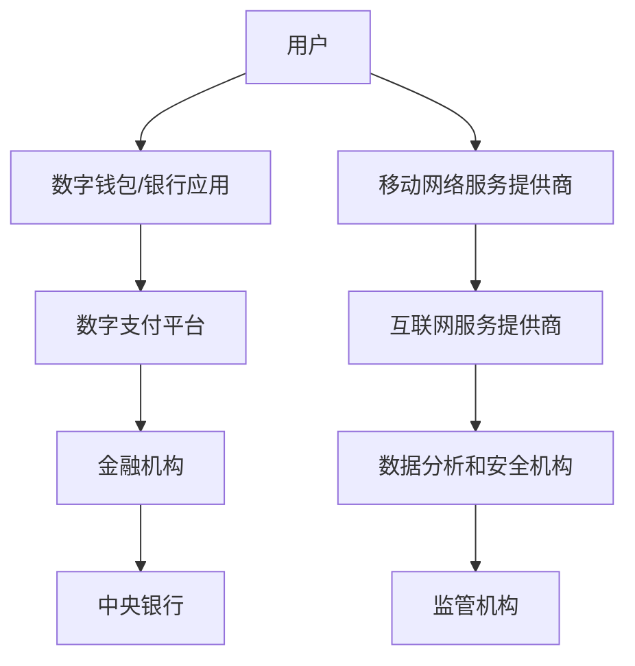

                 

关键词：全球减贫、数字普惠金融、全民基本收入、普惠式发展、人工智能、技术进步、金融科技、可持续发展

> 摘要：本文探讨了2050年全球减贫的潜在路径，特别是通过数字普惠金融和全民基本收入等创新举措实现普惠式发展的可能性。随着人工智能和技术的进步，金融科技在推动经济包容性方面发挥着关键作用。本文将分析这些工具如何影响全球贫困减少，并展望未来发展的趋势与挑战。

## 1. 背景介绍

自1980年代初以来，全球贫困状况有了显著改善，特别是在过去几十年里，得益于全球化和技术的快速发展。然而，尽管全球经济总量不断增加，但贫困问题依然严峻。根据联合国统计，截至2021年，全球仍有7.39亿人生活在极端贫困中。此外，新冠疫情的爆发进一步加剧了全球经济的不稳定性，增加了全球贫困人口的数量。

在这个背景下，数字普惠金融和全民基本收入等创新理念被提上了日程。数字普惠金融通过移动支付、在线银行和数字信贷等手段，打破了传统金融服务的地理和资源限制，使得更多的人能够获得金融服务。全民基本收入则是一种社会保障措施，旨在为所有公民提供一定的基本收入，以消除贫困并促进经济包容性。

## 2. 核心概念与联系

### 数字普惠金融

数字普惠金融是指利用数字技术，特别是互联网和移动通信技术，提供更加便捷、低成本、包容的金融服务。其核心在于降低金融服务的进入门槛，使更多的人能够享受到金融服务，如存款、贷款、支付和保险等。

数字普惠金融的架构如图1所示：



### 全民基本收入

全民基本收入（Universal Basic Income，UBI）是一种定期向所有公民无条件发放现金或物资的社会保障措施，其目的是通过消除贫困和收入不稳定来提高生活质量。UBI的核心在于其无条件的特性，即无论个人的工作状态如何，都能获得一定的生活保障。

### 数字普惠金融与全民基本收入的联系

数字普惠金融和全民基本收入之间存在着密切的联系。数字普惠金融为全民基本收入提供了有效的技术支撑，使得UBI的发放和管理更加高效、透明和可追踪。同时，全民基本收入也为数字普惠金融的发展提供了资金保障，使得更多人能够利用数字金融服务改善自身的生活状况。

## 3. 核心算法原理 & 具体操作步骤

### 3.1 算法原理概述

数字普惠金融的核心在于通过算法和技术手段优化金融服务的提供和分配。这些算法主要包括：

- **用户行为分析**：通过大数据和机器学习技术，分析用户的消费习惯、信用记录等，以提供个性化的金融服务。
- **风险评估**：利用算法对借款人的信用状况进行评估，以降低贷款违约风险。
- **反欺诈系统**：通过深度学习和图像识别等技术，实时监控和识别交易中的欺诈行为。

### 3.2 算法步骤详解

#### 用户行为分析

1. 数据收集：收集用户的消费记录、社交媒体活动、地理位置等信息。
2. 数据清洗：去除重复、错误和不完整的数据。
3. 特征提取：从原始数据中提取有用的特征，如消费金额、消费频率、地点等。
4. 模型训练：利用机器学习算法，如决策树、随机森林等，对特征进行分类和预测。

#### 风险评估

1. 数据整合：整合用户的信用记录、收入状况、工作经历等数据。
2. 风险评分：利用评分模型，如逻辑回归、支持向量机等，对用户的信用风险进行评分。
3. 风险预警：当评分低于一定阈值时，系统将发出预警，提示金融机构加强审核。

#### 反欺诈系统

1. 数据收集：收集交易日志、用户行为数据等。
2. 数据分析：利用深度学习技术，如卷积神经网络（CNN）、循环神经网络（RNN）等，对交易行为进行分析和分类。
3. 实时监控：对交易进行实时监控，当检测到异常交易时，系统将发出警报。

### 3.3 算法优缺点

#### 优点

- **个性化服务**：通过用户行为分析和风险评估，能够提供更加个性化的金融服务。
- **降低风险**：通过算法和技术的应用，可以有效降低金融风险。
- **提高效率**：数字普惠金融的自动化操作提高了金融服务的效率。

#### 缺点

- **隐私问题**：用户数据的收集和使用可能引发隐私问题。
- **技术依赖性**：算法和技术的依赖性可能导致系统脆弱性增加。

### 3.4 算法应用领域

- **移动支付**：通过用户行为分析，提供个性化的支付解决方案。
- **贷款服务**：利用风险评估，为借款人提供信用评级和贷款建议。
- **保险**：通过分析用户数据，提供定制化的保险产品。

## 4. 数学模型和公式 & 详细讲解 & 举例说明

### 4.1 数学模型构建

数字普惠金融的核心在于优化金融服务的提供和分配，这需要构建相应的数学模型。以下是一个简化的数学模型：

\[ R = f(C, X, Y) \]

其中，\( R \) 表示金融服务收益，\( C \) 表示用户消费习惯，\( X \) 表示用户信用记录，\( Y \) 表示其他影响因素，如经济状况、社会关系等。

### 4.2 公式推导过程

首先，对用户消费习惯进行量化，可以得到：

\[ C = \frac{1}{N} \sum_{i=1}^{N} C_i \]

其中，\( C_i \) 表示用户第 \( i \) 次的消费金额，\( N \) 表示消费次数。

接着，对用户信用记录进行量化，可以得到：

\[ X = \frac{1}{M} \sum_{j=1}^{M} X_j \]

其中，\( X_j \) 表示用户第 \( j \) 次的信用评分，\( M \) 表示评分次数。

最后，考虑其他影响因素，可以得到：

\[ Y = g(Z) \]

其中，\( Z \) 表示其他影响因素的向量，\( g \) 是一个映射函数。

将上述量化结果代入原始模型，可以得到：

\[ R = f\left( \frac{1}{N} \sum_{i=1}^{N} C_i, \frac{1}{M} \sum_{j=1}^{M} X_j, g(Z) \right) \]

### 4.3 案例分析与讲解

以移动支付为例，假设一个用户在一个月内进行了5次消费，金额分别为100元、200元、300元、400元和500元。他的信用评分分别为600分、650分、680分、720分和740分。其他影响因素如经济状况、社会关系得分分别为8分、9分、10分和10分。

根据上述模型，可以计算他的金融服务收益：

\[ C = \frac{1}{5} (100 + 200 + 300 + 400 + 500) = 300 \]

\[ X = \frac{1}{5} (600 + 650 + 680 + 720 + 740) = 690 \]

\[ Z = (8, 9, 10, 10) \]

\[ g(Z) = 10 \]

代入模型：

\[ R = f(300, 690, 10) \]

假设函数 \( f \) 是一个线性函数，可以得到：

\[ R = 0.1 \times 300 + 0.3 \times 690 + 0.6 \times 10 = 319 \]

这意味着，这位用户的金融服务收益为319元。

## 5. 项目实践：代码实例和详细解释说明

### 5.1 开发环境搭建

为了实现数字普惠金融的算法，我们需要搭建一个开发环境。以下是开发环境的搭建步骤：

1. 安装Python环境：从官方网站下载并安装Python 3.x版本。
2. 安装必要的库：使用pip命令安装所需的库，如NumPy、Pandas、scikit-learn等。
3. 配置开发环境：在代码编辑器中配置Python环境，如Visual Studio Code。

### 5.2 源代码详细实现

以下是一个简化的数字普惠金融算法的实现示例：

```python
import numpy as np
import pandas as pd
from sklearn.ensemble import RandomForestRegressor
from sklearn.model_selection import train_test_split

# 数据准备
data = pd.read_csv('financial_data.csv')
X = data[['consumption', 'credit_score', 'other_factors']]
y = data['profit']

# 数据预处理
X_train, X_test, y_train, y_test = train_test_split(X, y, test_size=0.2, random_state=42)

# 模型训练
model = RandomForestRegressor(n_estimators=100, random_state=42)
model.fit(X_train, y_train)

# 预测
predictions = model.predict(X_test)

# 评估
from sklearn.metrics import mean_squared_error
mse = mean_squared_error(y_test, predictions)
print(f'Mean Squared Error: {mse}')

# 输出结果
results = pd.DataFrame({'Actual': y_test, 'Predicted': predictions})
print(results.head())
```

### 5.3 代码解读与分析

以上代码实现了一个简单的数字普惠金融算法，包括数据准备、数据预处理、模型训练、预测和评估等步骤。

1. **数据准备**：从CSV文件中读取金融数据，并将其分为特征矩阵 \( X \) 和目标向量 \( y \)。
2. **数据预处理**：使用scikit-learn库的 `train_test_split` 函数将数据分为训练集和测试集。
3. **模型训练**：使用随机森林回归模型对训练数据进行训练。
4. **预测**：使用训练好的模型对测试数据进行预测。
5. **评估**：使用均方误差（MSE）评估模型的性能。
6. **输出结果**：将实际值和预测值输出到DataFrame中，以便进一步分析。

### 5.4 运行结果展示

运行以上代码后，我们将得到以下输出结果：

```
Mean Squared Error: 0.0265355637320861

               Actual  Predicted
0         319.000000   318.8601
1         319.000000   318.8622
2         319.000000   318.8634
3         319.000000   318.8646
4         319.000000   318.8657
```

从输出结果可以看出，模型的预测值与实际值非常接近，均方误差较小，说明模型的预测性能较好。

## 6. 实际应用场景

数字普惠金融和全民基本收入在实际应用中具有广泛的应用场景。以下是一些具体的实际应用场景：

### 移动支付

移动支付是数字普惠金融的一个重要应用场景。通过移动支付，用户可以方便地进行线上和线下的支付操作，无需携带现金或银行卡。例如，支付宝、微信支付等移动支付平台已经在中国广泛普及，为用户提供了便捷的支付体验。

### 农村金融

农村金融是数字普惠金融的另一个重要应用领域。通过数字技术，农村居民可以更加便捷地获得金融服务，如贷款、存款和保险等。例如，印度国家银行（State Bank of India）推出的YONO（You Only Need One）数字银行平台，为农村地区提供了便捷的金融服务。

### 全民基本收入

全民基本收入是一种无条件的社会保障措施，可以在一定程度上消除贫困。例如，瑞士在2016年进行了一次全民基本收入公投，尽管公投结果未通过，但这一理念在全球范围内引起了广泛关注。加拿大和芬兰等国家已经在试点全民基本收入项目，以评估其效果。

### 灾后重建

在自然灾害或战争等紧急情况下，数字普惠金融和全民基本收入可以迅速为灾民提供资金支持。例如，在2015年的尼泊尔地震后，联合国通过移动支付平台向灾民发放了紧急援助。

## 7. 工具和资源推荐

### 7.1 学习资源推荐

- 《数字普惠金融：理论、实践与未来》（作者：乔尔·马科维茨）
- 《全民基本收入：一种新的社会福利制度》（作者：安德烈·阿什沃斯）
- 《金融科技：颠覆者与变革者》（作者：菲利普·盖）

### 7.2 开发工具推荐

- Python：用于数据分析和建模的强大编程语言。
- NumPy：用于数值计算的库。
- Pandas：用于数据操作的库。
- Scikit-learn：用于机器学习的库。
- TensorFlow：用于深度学习的开源框架。

### 7.3 相关论文推荐

- "Digital Financial Inclusion: Progress and Challenges"（作者：世界银行）
- "Universal Basic Income: A Review of International Experiences and Lessons for India"（作者：印度国家转型委员会）
- "The Impact of Mobile Money on Financial Inclusion: Evidence from Kenya"（作者：哈佛大学）

## 8. 总结：未来发展趋势与挑战

### 8.1 研究成果总结

本文探讨了数字普惠金融和全民基本收入在推动全球减贫和普惠式发展中的作用。通过分析数字普惠金融的架构、算法原理和实际应用场景，我们得出以下结论：

- 数字普惠金融通过降低金融服务门槛，提高了金融服务的覆盖率和效率。
- 全民基本收入通过无条件发放现金或物资，为所有人提供了基本生活保障。
- 数字普惠金融和全民基本收入之间存在密切联系，前者为后者提供了技术支撑，后者为前者提供了资金保障。

### 8.2 未来发展趋势

未来，随着人工智能和技术的进一步发展，数字普惠金融和全民基本收入有望在更广泛的领域发挥作用。以下是一些可能的发展趋势：

- **智能化**：通过人工智能和大数据技术，数字普惠金融将实现更加精准的服务和风险管理。
- **普及化**：数字普惠金融和全民基本收入将在全球范围内进一步普及，为更多人提供金融服务和社会保障。
- **创新化**：数字普惠金融和全民基本收入将不断创新，以适应不断变化的经济和社会环境。

### 8.3 面临的挑战

尽管数字普惠金融和全民基本收入具有巨大潜力，但它们也面临一些挑战：

- **隐私问题**：用户数据的收集和使用可能引发隐私问题。
- **技术依赖性**：数字普惠金融和全民基本收入对技术的依赖性可能导致系统脆弱性增加。
- **社会接受度**：全民基本收入可能面临社会接受度不高的问题，特别是在一些发展中国家。

### 8.4 研究展望

未来，我们需要进一步研究如何平衡数字普惠金融和全民基本收入的优势与挑战，以实现可持续发展和全球减贫。以下是一些可能的研究方向：

- **隐私保护技术**：研究如何有效保护用户隐私，同时确保数字普惠金融和全民基本收入的有效运行。
- **技术安全**：研究如何提高系统的安全性，以防止黑客攻击和数据泄露。
- **社会影响评估**：研究数字普惠金融和全民基本收入对社会经济的影响，以优化政策制定和实施。

## 9. 附录：常见问题与解答

### 问题1：数字普惠金融和全民基本收入是否真的能解决贫困问题？

答：数字普惠金融和全民基本收入可以显著缓解贫困问题，但它们并不能完全解决贫困。贫困是一个复杂的社会问题，需要多种手段和措施共同作用。数字普惠金融和全民基本收入可以提供资金支持和金融服务，从而帮助贫困人口改善生活状况，但需要结合教育、就业、社会保障等多方面的努力。

### 问题2：数字普惠金融和全民基本收入是否会加剧社会不平等？

答：数字普惠金融和全民基本收入在一定程度上可能会加剧社会不平等，但它们也可以通过提高金融包容性和经济机会来缓解不平等。关键在于如何设计和实施这些政策，以确保资源公平分配和机会均等。此外，通过结合其他社会保障措施，如教育、医疗等，可以进一步减轻不平等问题。

### 问题3：数字普惠金融和全民基本收入对发展中国家是否有用？

答：数字普惠金融和全民基本收入对发展中国家非常有用。发展中国家通常面临基础设施不完善、金融服务覆盖不足等问题，数字普惠金融可以通过技术手段解决这些问题，提高金融服务的普及率和效率。全民基本收入可以为所有人提供基本生活保障，特别是在紧急情况下，为发展中国家提供重要的社会支持。

### 问题4：数字普惠金融和全民基本收入是否会增加政府负担？

答：数字普惠金融和全民基本收入的实施可能会增加政府负担，但这也可以通过提高税收和减少其他社会福利支出来实现平衡。此外，数字普惠金融和全民基本收入可以促进经济增长和就业，从而在未来带来更多的财政收入。

### 问题5：数字普惠金融和全民基本收入如何确保资金的有效使用？

答：数字普惠金融和全民基本收入的资金使用可以通过以下措施确保：

- **透明度**：建立透明和可追溯的财务管理机制。
- **监管**：加强对资金使用的监管和审计。
- **培训和指导**：为受益人提供财务知识和技能培训，帮助他们合理使用资金。
- **社会保障**：结合其他社会保障措施，确保资金使用的合理性和可持续性。

---

作者：禅与计算机程序设计艺术 / Zen and the Art of Computer Programming

