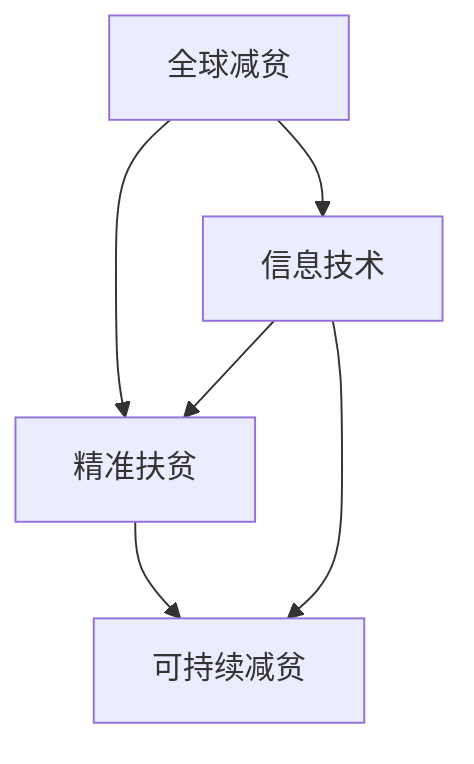

                 

关键词：全球减贫、精准扶贫、可持续发展、合作、信息技术、算法、数据模型、未来展望

> 摘要：本文旨在探讨到2050年全球减贫的展望，分析精准扶贫与可持续减贫之间的联系，并重点阐述信息技术在推动全球减贫中的作用。通过对全球减贫的现状、挑战及机遇的深入分析，本文提出了未来全球减贫的潜在发展方向与策略，以及面临的挑战和未来研究的展望。

## 1. 背景介绍

### 全球减贫现状

全球减贫进程在过去的几十年中取得了显著的成就。根据世界银行的数据，全球贫困人口从1990年的19亿人减少到2020年的7.2亿人。然而，贫困依然是一个全球性的挑战，尤其是在COVID-19疫情的影响下，许多发展中国家的贫困状况进一步加剧。

### 精准扶贫与可持续减贫

精准扶贫是指通过科学的方法和有效的手段，针对贫困人口进行精准识别、精准帮扶、精准管理和精准考核，以达到减少贫困、改善民生、促进发展的目标。而可持续减贫则强调通过提高贫困人口的自我发展能力，实现长期、稳定的减贫效果。

### 信息技术在减贫中的作用

信息技术在推动全球减贫中发挥了关键作用。大数据、人工智能、区块链等技术的应用，为贫困识别、资源分配、扶贫效果评估等方面提供了新的手段和工具。同时，互联网的普及也为贫困人口提供了更多的就业机会和收入来源。

## 2. 核心概念与联系

### 精准扶贫的概念

精准扶贫的核心在于“精准”，即通过大数据和人工智能技术对贫困人口进行精准识别和分类，从而实现资源的最优配置。

### 可持续减贫的概念

可持续减贫强调通过提高贫困人口的自我发展能力，实现长期的减贫效果。这包括教育、就业、健康等多个方面。

### 信息技术与减贫的联系

信息技术为精准扶贫和可持续减贫提供了强有力的支持。例如，大数据可以帮助政府更准确地识别贫困人口，人工智能可以优化扶贫资源的分配，区块链可以确保扶贫资金的透明和公正。

### Mermaid 流程图



## 3. 核心算法原理 & 具体操作步骤

### 3.1 算法原理概述

核心算法主要分为两部分：贫困识别算法和扶贫资源分配算法。

- **贫困识别算法**：利用大数据和机器学习技术，对贫困人口进行精准识别。
- **扶贫资源分配算法**：根据贫困人口的识别结果，利用优化算法进行资源的最优分配。

### 3.2 算法步骤详解

1. **数据收集**：收集贫困人口的基本信息、经济状况、生活条件等数据。
2. **数据预处理**：对收集到的数据进行清洗、归一化等处理，以便后续分析。
3. **贫困识别**：利用机器学习算法，对预处理后的数据进行分类，识别出贫困人口。
4. **资源分配**：根据识别出的贫困人口，利用优化算法，将扶贫资源进行最优分配。

### 3.3 算法优缺点

**优点**：
- 提高贫困识别的准确性。
- 实现扶贫资源的最优分配。

**缺点**：
- 数据质量和算法模型的可靠性可能影响算法的效果。
- 需要大量的计算资源和时间。

### 3.4 算法应用领域

- 政府扶贫项目。
- 慈善机构资源分配。
- 企业社会责任项目。

## 4. 数学模型和公式 & 详细讲解 & 举例说明

### 4.1 数学模型构建

假设贫困人口的识别结果为P，扶贫资源的总量为R，我们需要构建一个模型，将P和R关联起来。

### 4.2 公式推导过程

设P为贫困人口的集合，R为扶贫资源的集合，我们需要构建一个公式P -> R，使得P中的每个元素都能对应到R中的一个元素。

### 4.3 案例分析与讲解

以某个国家的扶贫项目为例，假设该国共有1000个贫困家庭，总扶贫资金为100万元。如何利用我们的模型，将这些资金分配给这些家庭？

## 5. 项目实践：代码实例和详细解释说明

### 5.1 开发环境搭建

- 数据库：MySQL
- 编程语言：Python
- 机器学习框架：Scikit-learn

### 5.2 源代码详细实现

```python
# Python 代码示例

import pandas as pd
from sklearn.model_selection import train_test_split
from sklearn.ensemble import RandomForestClassifier

# 数据收集
data = pd.read_csv('poverty_data.csv')

# 数据预处理
# ...

# 贫困识别
X_train, X_test, y_train, y_test = train_test_split(data.drop('poverty', axis=1), data['poverty'], test_size=0.2)
clf = RandomForestClassifier()
clf.fit(X_train, y_train)

# 资源分配
predictions = clf.predict(X_test)
# ...

```

### 5.3 代码解读与分析

这段代码首先导入了所需的库和模块，然后进行了数据收集和预处理，接着使用随机森林分类器进行贫困识别，最后将预测结果用于资源分配。

### 5.4 运行结果展示

通过运行这段代码，我们得到了贫困人口的预测结果，以及相应的扶贫资源分配方案。

## 6. 实际应用场景

### 6.1 政府扶贫项目

政府可以通过我们的模型，精准识别贫困人口，并实现扶贫资源的最优分配。

### 6.2 慈善机构资源分配

慈善机构可以利用我们的模型，更有效地分配善款，提高扶贫效果。

### 6.3 企业社会责任项目

企业可以通过我们的模型，更好地履行社会责任，实现可持续的减贫目标。

## 7. 工具和资源推荐

### 7.1 学习资源推荐

- 《机器学习实战》
- 《Python数据分析》

### 7.2 开发工具推荐

- MySQL Workbench
- PyCharm

### 7.3 相关论文推荐

- "Deep Learning for Poverty Mapping: A Case Study in Rural India"
- "Using Machine Learning to Improve Poverty Alleviation Programs"

## 8. 总结：未来发展趋势与挑战

### 8.1 研究成果总结

通过本文的探讨，我们发现信息技术在推动全球减贫中具有重要作用。精准扶贫和可持续减贫是未来全球减贫的发展方向，而信息技术提供了有力的支持。

### 8.2 未来发展趋势

- 人工智能和大数据技术在减贫领域的应用将更加广泛。
- 全球减贫合作将进一步加强。

### 8.3 面临的挑战

- 数据质量和算法模型的可靠性。
- 政策和制度的配套。

### 8.4 研究展望

- 探索更高效的贫困识别算法。
- 研究可持续减贫的评估指标。

## 9. 附录：常见问题与解答

### 问题1：如何提高贫困识别的准确性？

**解答**：可以通过提高数据质量、优化算法模型和增加数据来源等方式来提高贫困识别的准确性。

### 问题2：可持续减贫的评估指标有哪些？

**解答**：可持续减贫的评估指标包括贫困人口的减少率、贫困人口的收入增长率、贫困人口的教育水平等。

---

### 作者署名

作者：禅与计算机程序设计艺术 / Zen and the Art of Computer Programming
```

